<!-- dw2md v0.2.1 | NousResearch/hermes-agent | 2026-07-03T10:47:22Z | 65 pages -->

# NousResearch/hermes-agent — DeepWiki

> Compiled from https://deepwiki.com/NousResearch/hermes-agent
> Generated: 2026-07-03T10:47:22Z | Pages: 65

## Format

Sections are delimited by `<<< SECTION: Title [slug] >>>` lines.
Grep for `^<<< SECTION:` to list all sections.
The Structure tree below shows hierarchy; slugs in brackets are unique identifiers.

## Structure

├── 1 Overview
│   ├── 1.1 Architecture Overview
│   └── 1.2 Project Structure and Dependencies
├── 2 Getting Started
│   ├── 2.1 Installation
│   ├── 2.2 Configuration and Setup
│   ├── 2.3 Authentication and Providers
│   └── 2.4 Model Selection and Management
├── 3 CLI
│   ├── 3.1 Interactive Chat
│   ├── 3.2 Command Reference
│   ├── 3.3 TUI (Terminal User Interface)
│   └── 3.4 Web UI Dashboard
├── 4 Core Agent
│   ├── 4.1 Conversation Loop
│   ├── 4.2 Context and Prompt Management
│   ├── 4.3 Memory and Sessions
│   ├── 4.4 Honcho Integration
│   └── 4.5 Auxiliary Client
├── 5 Tool System
│   ├── 5.1 Tool Registry and Toolsets
│   ├── 5.2 Terminal and File Operations
│   ├── 5.3 Process Management
│   ├── 5.4 Security and Command Approval
│   ├── 5.5 Web, Browser, and Vision Tools
│   ├── 5.6 Code Execution and MCP Tools
│   ├── 5.7 Subagent Delegation
│   └── 5.8 Other Tools
├── 6 Execution Environments
│   ├── 6.1 Environment Abstraction
│   └── 6.2 Backend Implementations
├── 7 Messaging Gateway
│   ├── 7.1 Gateway Architecture
│   ├── 7.2 Platform Adapters
│   ├── 7.3 Session and Media Management
│   └── 7.4 Security and Pairing
├── 8 Skills System
│   ├── 8.1 Skills Management and Security
│   └── 8.2 Skills Hub
├── 9 Batch Processing
│   ├── 9.1 Batch Runner
│   ├── 9.2 Toolset Distributions
│   └── 9.3 Data Generation and Trajectories
├── 10 Advanced Topics
│   ├── 10.1 Context Compression
│   ├── 10.2 Provider Runtime Resolution
│   ├── 10.3 Cron and Scheduled Tasks
│   ├── 10.4 Diagnostic Tools
│   ├── 10.5 LSP and Computer Use
│   ├── 10.6 ACP Server and IDE Integration
│   ├── 10.7 Plugins and Memory Providers
│   └── 10.8 Internationalization (i18n)
├── 11 Voice and TTS
│   ├── 11.1 Voice Mode
│   └── 11.2 TTS and Transcription
├── 12 Desktop App
│   ├── 12.1 Electron Shell and Gateway Connection
│   └── 12.2 Desktop UI Components
├── 13 Kanban Task Board
│   ├── 13.1 Kanban Core and CLI
│   └── 13.2 Kanban Tools and Dashboard
├── 14 Infrastructure and CI/CD
│   ├── 14.1 Docker Deployment
│   └── 14.2 CI/CD and Release Management
└── 15 Glossary

## Contents

<<< SECTION: 1 Overview [1-overview] >>>

# Overview

<details>
<summary>Relevant source files</summary>

The following files were used as context for generating this wiki page:

- [.env.example](.env.example)
- [AGENTS.md](AGENTS.md)
- [CONTRIBUTING.md](CONTRIBUTING.md)
- [README.md](README.md)
- [README.ur-pk.md](README.ur-pk.md)
- [README.zh-CN.md](README.zh-CN.md)
- [agent/auxiliary_client.py](agent/auxiliary_client.py)
- [agent/model_metadata.py](agent/model_metadata.py)
- [agent/models_dev.py](agent/models_dev.py)
- [cli-config.yaml.example](cli-config.yaml.example)
- [cli.py](cli.py)
- [gateway/run.py](gateway/run.py)
- [hermes_cli/auth.py](hermes_cli/auth.py)
- [hermes_cli/commands.py](hermes_cli/commands.py)
- [hermes_cli/config.py](hermes_cli/config.py)
- [hermes_cli/main.py](hermes_cli/main.py)
- [hermes_cli/models.py](hermes_cli/models.py)
- [hermes_cli/runtime_provider.py](hermes_cli/runtime_provider.py)
- [hermes_cli/setup.py](hermes_cli/setup.py)
- [optional-skills/blockchain/evm/SKILL.md](optional-skills/blockchain/evm/SKILL.md)
- [optional-skills/blockchain/evm/scripts/evm_client.py](optional-skills/blockchain/evm/scripts/evm_client.py)
- [optional-skills/devops/pinggy-tunnel/SKILL.md](optional-skills/devops/pinggy-tunnel/SKILL.md)
- [run_agent.py](run_agent.py)
- [tests/agent/test_auxiliary_client.py](tests/agent/test_auxiliary_client.py)
- [tests/agent/test_model_metadata.py](tests/agent/test_model_metadata.py)
- [tests/agent/test_models_dev.py](tests/agent/test_models_dev.py)
- [tests/hermes_cli/test_api_key_providers.py](tests/hermes_cli/test_api_key_providers.py)
- [tests/hermes_cli/test_commands.py](tests/hermes_cli/test_commands.py)
- [tests/hermes_cli/test_model_validation.py](tests/hermes_cli/test_model_validation.py)
- [tests/hermes_cli/test_runtime_provider_resolution.py](tests/hermes_cli/test_runtime_provider_resolution.py)
- [tests/hermes_cli/test_windows_native_docs.py](tests/hermes_cli/test_windows_native_docs.py)
- [website/docs/developer-guide/contributing.md](website/docs/developer-guide/contributing.md)
- [website/docs/getting-started/installation.md](website/docs/getting-started/installation.md)
- [website/docs/getting-started/quickstart.md](website/docs/getting-started/quickstart.md)
- [website/docs/getting-started/updating.md](website/docs/getting-started/updating.md)
- [website/docs/guides/run-nemotron-3-ultra-free.md](website/docs/guides/run-nemotron-3-ultra-free.md)
- [website/docs/index.mdx](website/docs/index.mdx)
- [website/docs/integrations/providers.md](website/docs/integrations/providers.md)
- [website/docs/reference/cli-commands.md](website/docs/reference/cli-commands.md)
- [website/docs/reference/environment-variables.md](website/docs/reference/environment-variables.md)
- [website/docs/reference/optional-skills-catalog.md](website/docs/reference/optional-skills-catalog.md)
- [website/docs/reference/skills-catalog.md](website/docs/reference/skills-catalog.md)
- [website/docs/reference/slash-commands.md](website/docs/reference/slash-commands.md)
- [website/docs/user-guide/cli.md](website/docs/user-guide/cli.md)
- [website/docs/user-guide/configuration.md](website/docs/user-guide/configuration.md)
- [website/docs/user-guide/features/fallback-providers.md](website/docs/user-guide/features/fallback-providers.md)
- [website/docs/user-guide/messaging/index.md](website/docs/user-guide/messaging/index.md)
- [website/docs/user-guide/sessions.md](website/docs/user-guide/sessions.md)
- [website/docs/user-guide/skills/optional/blockchain/blockchain-evm.md](website/docs/user-guide/skills/optional/blockchain/blockchain-evm.md)
- [website/docs/user-guide/skills/optional/devops/devops-pinggy-tunnel.md](website/docs/user-guide/skills/optional/devops/devops-pinggy-tunnel.md)
- [website/docs/user-guide/windows-native.md](website/docs/user-guide/windows-native.md)
- [website/i18n/zh-Hans/docusaurus-plugin-content-docs/current/developer-guide/contributing.md](website/i18n/zh-Hans/docusaurus-plugin-content-docs/current/developer-guide/contributing.md)
- [website/i18n/zh-Hans/docusaurus-plugin-content-docs/current/getting-started/installation.md](website/i18n/zh-Hans/docusaurus-plugin-content-docs/current/getting-started/installation.md)
- [website/i18n/zh-Hans/docusaurus-plugin-content-docs/current/user-guide/windows-native.md](website/i18n/zh-Hans/docusaurus-plugin-content-docs/current/user-guide/windows-native.md)
- [website/sidebars.ts](website/sidebars.ts)

</details>


Hermes Agent is a self-improving AI agent framework built by **Nous Research**. It provides a robust conversation loop with tool-calling capabilities, persistent memory, agent-created skills, and deployment across multiple interfaces including CLI, messaging platforms (Telegram, Discord, WhatsApp, etc.), and editor integrations via the Agent Client Protocol (ACP). The system supports any OpenAI-compatible LLM provider and runs commands in local, containerized, or cloud execution environments. [run_agent.py:1-21](), [cli.py:1-14]()

This page introduces the overall architecture, major subsystems, and how they interact. For detailed information about specific subsystems:
- Agent conversation orchestration: [Architecture Overview](#1.1)
- Installation and dependency management: [Project Structure and Dependencies](#1.2)

---

## System Architecture

### Three-Tier Design

Hermes Agent follows a three-tier architecture separating user interfaces, core agent logic, and execution backends. It bridges "Natural Language Space" (user intent) to "Code Entity Space" (tool execution) through a structured registry. [run_agent.py:111-187](), [gateway/run.py:1-32]()

**Architecture Component Mapping**

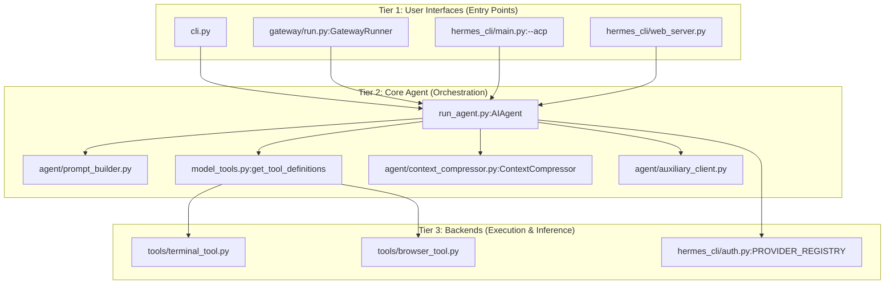

**Sources:** [run_agent.py:111-187](), [cli.py:1-14](), [gateway/run.py:1-32](), [hermes_cli/commands.py:1-12](), [hermes_cli/auth.py:173-200](), [agent/auxiliary_client.py:1-41]()

### Runtime Modes

The system supports several primary runtime modes, each instantiating `AIAgent` with different lifecycle management:

| Mode | Entry Point | Use Case | Session Persistence |
|------|-------------|----------|---------------------|
| **CLI** | `cli.py` | Interactive terminal sessions with TUI | `~/.hermes/sessions/` |
| **Gateway** | `gateway/run.py` | Messaging platforms (Telegram, Discord, etc.) | `~/.hermes/sessions/` |
| **ACP** | `hermes acp` | Editor integrations (VS Code, Zed) | Client-managed |
| **Web UI** | `hermes dashboard` | Browser-based dashboard and chat | `~/.hermes/sessions/` |

**Sources:** [cli.py:1-14](), [gateway/run.py:1-14](), [run_agent.py:92-103](), [hermes_cli/commands.py:75-76](), [hermes_cli/commands.py:84-85]()

---

## Core Components

### AIAgent Class

The `AIAgent` class in `run_agent.py` orchestrates the conversation loop. It manages the iteration budget, tool execution via `handle_function_call`, and state persistence. [run_agent.py:17-21](), [run_agent.py:111-141]()

**Execution Flow: Natural Language to Tool Call**

```mermaid
graph LR
    UserMsg["User Message"] --> AIAgent["run_agent.py:AIAgent.run_conversation()"]
    AIAgent --> PromptBuilder["agent/prompt_builder.py:build_skills_system_prompt()"]
    PromptBuilder --> LLMProvider["LLM Provider<br/>(hermes_cli/auth.py:PROVIDER_REGISTRY)"]
    LLMProvider --> ToolCallJSON["Tool Call JSON"]
    ToolCallJSON --> ToolDispatcher["model_tools.py:handle_function_call()"]
    ToolDispatcher --> ToolsDir["tools/ directory"]
    ToolsDir --> TerminalTool["tools/terminal_tool.py"]
    TerminalTool --> ToolResult["Tool Result String"]
    ToolResult --> AIAgent
```

**Sources:** [run_agent.py:111-141](), [hermes_cli/auth.py:173-200](), [agent/prompt_builder.py:159-166](), [model_tools.py:136-141]()

### Tool and Environment System

Tools are discovered at runtime and registered for LLM use. Execution occurs within abstracted environments (Local, Docker, SSH, Modal, Daytona, etc.) configured in the terminal settings.

- **Tool System**: Handled via `model_tools.py`, which provides definitions and execution logic for tools like terminal access, file operations, and web browsing. [run_agent.py:136-141]()
- **Environments**: The terminal backend allows the agent to run commands across diverse backends as configured in the `terminal` block of `config.yaml`. [hermes_cli/config.py:4-6]()

**Sources:** [run_agent.py:136-141](), [hermes_cli/config.py:4-6]()

---

## Memory and Learning

Hermes Agent features a "closed learning loop" where it creates and improves its own capabilities over time.

- **Skills System**: The agent can create new Python-based tools (skills) and manage them via the `skill_manage` tool. [hermes_cli/commands.py:71]()
- **Persistent Memory**: Uses `MEMORY.md` and `USER.md` files for long-term fact storage and user profiling, with logic managed in `agent/memory_manager.py`. [run_agent.py:148-150]()
- **Honcho Integration**: Supports AI-native memory and user modeling via the Honcho integration for cross-session recall and dialectic queries.

**Sources:** [run_agent.py:148-150](), [hermes_cli/commands.py:71]()

---

## Configuration

All persistent configuration and user data live in the `HERMES_HOME` directory (default: `~/.hermes/`). [hermes_cli/config.py:4-6]()

| File | Purpose |
|------|---------|
| `config.yaml` | Primary settings (model, terminal backend, toolsets) [hermes_cli/config.py:5]() |
| `.env` | Secrets and API keys [hermes_cli/config.py:6]() |
| `SOUL.md` | Primary agent identity/persona |
| `auth.json` | OAuth tokens and provider state |

**Sources:** [hermes_cli/config.py:4-6]()

---

## Sub-Pages

For more technical depth, please refer to the following child pages:

- **[Architecture Overview](#1.1)** — Deep dive into the three-tier architecture, the `AIAgent` loop, and tool registry internals.
- **[Project Structure and Dependencies](#1.2)** — Detailed documentation of the directory layout, key files, and the installation ecosystem including Nix support.

---

<<< SECTION: 1.1 Architecture Overview [1-1-architecture-overview] >>>

# Architecture Overview

<details>
<summary>Relevant source files</summary>

The following files were used as context for generating this wiki page:

- [agent/auxiliary_client.py](agent/auxiliary_client.py)
- [agent/model_metadata.py](agent/model_metadata.py)
- [agent/models_dev.py](agent/models_dev.py)
- [cli-config.yaml.example](cli-config.yaml.example)
- [cli.py](cli.py)
- [cron/jobs.py](cron/jobs.py)
- [cron/scheduler.py](cron/scheduler.py)
- [gateway/run.py](gateway/run.py)
- [hermes_cli/auth.py](hermes_cli/auth.py)
- [hermes_cli/commands.py](hermes_cli/commands.py)
- [hermes_cli/config.py](hermes_cli/config.py)
- [hermes_cli/cron.py](hermes_cli/cron.py)
- [hermes_cli/main.py](hermes_cli/main.py)
- [hermes_cli/models.py](hermes_cli/models.py)
- [hermes_cli/runtime_provider.py](hermes_cli/runtime_provider.py)
- [hermes_cli/setup.py](hermes_cli/setup.py)
- [optional-skills/blockchain/evm/SKILL.md](optional-skills/blockchain/evm/SKILL.md)
- [optional-skills/blockchain/evm/scripts/evm_client.py](optional-skills/blockchain/evm/scripts/evm_client.py)
- [optional-skills/devops/pinggy-tunnel/SKILL.md](optional-skills/devops/pinggy-tunnel/SKILL.md)
- [run_agent.py](run_agent.py)
- [tests/agent/test_auxiliary_client.py](tests/agent/test_auxiliary_client.py)
- [tests/agent/test_model_metadata.py](tests/agent/test_model_metadata.py)
- [tests/agent/test_models_dev.py](tests/agent/test_models_dev.py)
- [tests/cron/test_cron_prompt_injection_skill.py](tests/cron/test_cron_prompt_injection_skill.py)
- [tests/cron/test_jobs.py](tests/cron/test_jobs.py)
- [tests/cron/test_scheduler.py](tests/cron/test_scheduler.py)
- [tests/hermes_cli/test_api_key_providers.py](tests/hermes_cli/test_api_key_providers.py)
- [tests/hermes_cli/test_commands.py](tests/hermes_cli/test_commands.py)
- [tests/hermes_cli/test_cron.py](tests/hermes_cli/test_cron.py)
- [tests/hermes_cli/test_model_validation.py](tests/hermes_cli/test_model_validation.py)
- [tests/hermes_cli/test_runtime_provider_resolution.py](tests/hermes_cli/test_runtime_provider_resolution.py)
- [tests/tools/test_cronjob_tools.py](tests/tools/test_cronjob_tools.py)
- [tools/cronjob_tools.py](tools/cronjob_tools.py)
- [website/docs/developer-guide/agent-loop.md](website/docs/developer-guide/agent-loop.md)
- [website/docs/developer-guide/architecture.md](website/docs/developer-guide/architecture.md)
- [website/docs/developer-guide/context-compression-and-caching.md](website/docs/developer-guide/context-compression-and-caching.md)
- [website/docs/developer-guide/cron-internals.md](website/docs/developer-guide/cron-internals.md)
- [website/docs/developer-guide/gateway-internals.md](website/docs/developer-guide/gateway-internals.md)
- [website/docs/getting-started/quickstart.md](website/docs/getting-started/quickstart.md)
- [website/docs/integrations/providers.md](website/docs/integrations/providers.md)
- [website/docs/reference/cli-commands.md](website/docs/reference/cli-commands.md)
- [website/docs/reference/environment-variables.md](website/docs/reference/environment-variables.md)
- [website/docs/reference/optional-skills-catalog.md](website/docs/reference/optional-skills-catalog.md)
- [website/docs/reference/skills-catalog.md](website/docs/reference/skills-catalog.md)
- [website/docs/reference/slash-commands.md](website/docs/reference/slash-commands.md)
- [website/docs/reference/tools-reference.md](website/docs/reference/tools-reference.md)
- [website/docs/reference/toolsets-reference.md](website/docs/reference/toolsets-reference.md)
- [website/docs/user-guide/cli.md](website/docs/user-guide/cli.md)
- [website/docs/user-guide/configuration.md](website/docs/user-guide/configuration.md)
- [website/docs/user-guide/features/cron.md](website/docs/user-guide/features/cron.md)
- [website/docs/user-guide/features/fallback-providers.md](website/docs/user-guide/features/fallback-providers.md)
- [website/docs/user-guide/features/tools.md](website/docs/user-guide/features/tools.md)
- [website/docs/user-guide/messaging/index.md](website/docs/user-guide/messaging/index.md)
- [website/docs/user-guide/sessions.md](website/docs/user-guide/sessions.md)
- [website/docs/user-guide/skills/optional/blockchain/blockchain-evm.md](website/docs/user-guide/skills/optional/blockchain/blockchain-evm.md)
- [website/docs/user-guide/skills/optional/devops/devops-pinggy-tunnel.md](website/docs/user-guide/skills/optional/devops/devops-pinggy-tunnel.md)
- [website/i18n/zh-Hans/docusaurus-plugin-content-docs/current/developer-guide/cron-internals.md](website/i18n/zh-Hans/docusaurus-plugin-content-docs/current/developer-guide/cron-internals.md)
- [website/sidebars.ts](website/sidebars.ts)

</details>


## Purpose and Scope

This document describes the high-level architecture of the Hermes Agent system, focusing on the three-tier architecture, major subsystems, and their technical interactions. Hermes Agent is an AI agent framework designed with self-improvement capabilities, orchestrating interactions between LLMs, a diverse tool registry, and multiple execution environments. [run_agent.py:1-21]()

The architecture is organized into three primary tiers:

1.  **User Interface Layer**: Interactive frontends including the CLI (terminal interface), the Messaging Gateway (platform adapters for Telegram, Discord, etc.), and the Web UI Dashboard. [cli.py:1-13](), [gateway/run.py:1-14](), [hermes_cli/web_server.py:1-13]()
2.  **Core Agent Layer**: The central `AIAgent` class orchestrates the conversation loop, manages context/memory, and handles tool invocation. [run_agent.py:17-21](), [agent/conversation_loop.py:1-20]()
3.  **Tool & Execution Layer**: A modular system of toolsets (terminal, browser, file operations) and an environment abstraction layer that supports local, Docker, SSH, and serverless backends. [model_tools.py:122-127](), [tools/terminal_tool.py:103-105](), [hermes_cli/tools_config.py:55-83]()

---

## Core Architecture Components

### System Overview Diagram

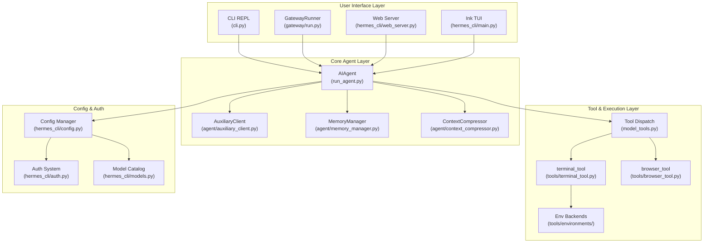

**Sources:** [run_agent.py:17-21](), [cli.py:5-13](), [gateway/run.py:1-14](), [hermes_cli/config.py:1-13](), [hermes_cli/auth.py:1-20](), [hermes_cli/main.py:145-160]().

---

## AIAgent: The Central Orchestrator

The `AIAgent` class in `run_agent.py` is the primary engine of the system. It encapsulates the logic for the "Think-Act-Observe" loop, managing the state of a single conversation session. [run_agent.py:5-21]()

### Conversation Orchestration
*   **Loop Management**: The agent executes a tool-calling loop until a final response is generated or the `IterationBudget` is exhausted. [run_agent.py:10-14](), [run_agent.py:116-116]()
*   **Context Scrubbing**: It uses `sanitize_context` to manage message history and `_strip_reasoning_tags` to handle reasoning/thought blocks (e.g., `<think>` tags) from models like DeepSeek or Grok. [run_agent.py:148-148](), [cli.py:194-204]()
*   **Token Estimation**: It utilizes `estimate_request_tokens_rough` to monitor context window usage and ensure model limits are respected. [run_agent.py:151-153]()

### Memory and Context
*   **Memory Management**: The agent builds memory context blocks and manages persistent identity via `load_soul_md`. [run_agent.py:159-166]()
*   **Context Compression**: When the context limit is approached, `ContextCompressor` summarizes past turns to free up space. [run_agent.py:157-157]()
*   **Auxiliary Client**: Side tasks like vision analysis, web extraction, or compression are offloaded to an `AuxiliaryClient`. This router resolves the best available secondary backend (OpenRouter, Nous Portal, or local endpoints) to avoid interrupting the main conversation flow. [agent/auxiliary_client.py:1-41]()

**Sources:** [run_agent.py:5-21](), [run_agent.py:148-166](), [agent/auxiliary_client.py:1-41](), [cli.py:194-204]().

---

## Tool System and Execution

Hermes employs a modular tool dispatch system that bridges natural language requests to code execution across isolated environments.

### Tool Execution Flow

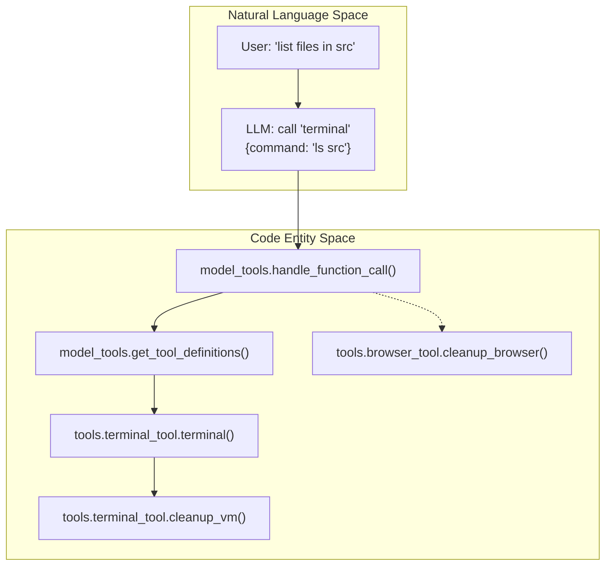

*   **Registry**: `model_tools.py` provides the central registry where tools are defined via `get_tool_definitions` and executed via `handle_function_call`. [run_agent.py:136-141]()
*   **Guardrails**: The system inspects calls for destructive patterns or dangerous commands before execution, often using a callback-based approval system. [run_agent.py:173-180]()
*   **Environments**: Terminal commands and file operations are managed with specific cleanup routines like `cleanup_vm` and `cleanup_browser` to ensure environment stability and resource management. [run_agent.py:142-144]()
*   **Configurable Toolsets**: Users can toggle features like `web`, `browser`, `terminal`, `code_execution`, and `computer_use` via `hermes tools`. [hermes_cli/tools_config.py:55-82]()

**Sources:** [run_agent.py:136-144](), [run_agent.py:173-180](), [hermes_cli/tools_config.py:55-82]().

---

## Configuration and Authentication

The system uses a hierarchical configuration and a multi-provider authentication store.

### Configuration Hierarchy
1.  **CLI Flags**: Highest priority passed during invocation (e.g., `--tui`, `--cli`, `--model`). [cli.py:8-13](), [hermes_cli/main.py:145-157]()
2.  **`config.yaml`**: User-defined settings in `~/.hermes/config.yaml`. [hermes_cli/config.py:5-6]()
3.  **`.env`**: Secrets and API keys in `~/.hermes/.env`. [hermes_cli/config.py:6]()
4.  **Defaults**: System defaults defined in `DEFAULT_CONFIG`. [hermes_cli/config.py:133-134]()

### Authentication Store
The authentication system in `hermes_cli/auth.py` manages credentials for various providers. It supports:
*   **OAuth Flows**: Device code and external browser-based flows for Nous Portal, OpenAI Codex, xAI, Qwen, and Spotify. [hermes_cli/auth.py:69-130]()
*   **API Keys**: Traditional key management for OpenRouter, custom endpoints, and specific providers like Gemini, Z.ai (GLM), or Moonshot (Kimi). [hermes_cli/auth.py:157-183]()
*   **Runtime Resolution**: `resolve_provider` picks the active provider via a priority chain, handling token refresh automatically. [hermes_cli/auth.py:11-13]()

**Sources:** [hermes_cli/config.py:1-13](), [hermes_cli/auth.py:1-20](), [hermes_cli/auth.py:69-183](), [hermes_cli/main.py:145-157]().

---

## Messaging Gateway and Interface Layer

The system supports multiple concurrent interfaces managed by specialized runners.

### Messaging Gateway
The `GatewayRunner` in `gateway/run.py` enables multi-platform support (Telegram, Discord, Slack, etc.).
*   **Session Caching**: It maintains an LRU cache of `AIAgent` instances (`_AGENT_CACHE_MAX_SIZE = 128`) to handle concurrent users with idle eviction after 1 hour. [gateway/run.py:61-66]()
*   **Platform Adapters**: Provides entry points for messaging platform integrations. [gateway/run.py:2-6]()
*   **Command Registry**: A central `COMMAND_REGISTRY` in `hermes_cli/commands.py` defines slash commands (e.g., `/new`, `/model`, `/goal`) shared across the CLI and Gateway. [hermes_cli/commands.py:1-9](), [hermes_cli/commands.py:64-118]()

### CLI and TUI
*   **REPL**: `cli.py` provides a rich interactive terminal interface using `prompt_toolkit`. [cli.py:5-13]()
*   **TUI**: A React Ink-based interface can be launched via the `--tui` flag, providing a more graphical terminal experience. [hermes_cli/main.py:145-157]()

**Sources:** [gateway/run.py:1-14](), [gateway/run.py:61-66](), [hermes_cli/commands.py:1-118](), [hermes_cli/main.py:145-157]().

---

<<< SECTION: 1.2 Project Structure and Dependencies [1-2-project-structure-and-dependencies] >>>

# Project Structure and Dependencies

<details>
<summary>Relevant source files</summary>

The following files were used as context for generating this wiki page:

- [.env.example](.env.example)
- [.envrc](.envrc)
- [AGENTS.md](AGENTS.md)
- [CONTRIBUTING.md](CONTRIBUTING.md)
- [MANIFEST.in](MANIFEST.in)
- [README.md](README.md)
- [README.ur-pk.md](README.ur-pk.md)
- [README.zh-CN.md](README.zh-CN.md)
- [acp_registry/agent.json](acp_registry/agent.json)
- [apps/desktop/src/app/chat/composer/hooks/use-composer-branch.ts](apps/desktop/src/app/chat/composer/hooks/use-composer-branch.ts)
- [flake.lock](flake.lock)
- [flake.nix](flake.nix)
- [gateway/platforms/weixin.py](gateway/platforms/weixin.py)
- [hermes_cli/__init__.py](hermes_cli/__init__.py)
- [nix/checks.nix](nix/checks.nix)
- [nix/devShell.nix](nix/devShell.nix)
- [nix/hermes-agent.nix](nix/hermes-agent.nix)
- [nix/lib.nix](nix/lib.nix)
- [nix/nixosModules.nix](nix/nixosModules.nix)
- [nix/overlays.nix](nix/overlays.nix)
- [nix/packages.nix](nix/packages.nix)
- [nix/python.nix](nix/python.nix)
- [nix/tui.nix](nix/tui.nix)
- [nix/web.nix](nix/web.nix)
- [optional-mcps/unreal-engine/manifest.yaml](optional-mcps/unreal-engine/manifest.yaml)
- [package-lock.json](package-lock.json)
- [package.json](package.json)
- [pyproject.toml](pyproject.toml)
- [scripts/contributor_audit.py](scripts/contributor_audit.py)
- [scripts/whatsapp-bridge/package-lock.json](scripts/whatsapp-bridge/package-lock.json)
- [scripts/whatsapp-bridge/package.json](scripts/whatsapp-bridge/package.json)
- [tests/gateway/test_weixin.py](tests/gateway/test_weixin.py)
- [tests/gateway/test_whatsapp_text_batching.py](tests/gateway/test_whatsapp_text_batching.py)
- [tests/hermes_cli/test_ensure_utf8_locale.py](tests/hermes_cli/test_ensure_utf8_locale.py)
- [tests/hermes_cli/test_windows_native_docs.py](tests/hermes_cli/test_windows_native_docs.py)
- [tests/test_package_json_lazy_deps.py](tests/test_package_json_lazy_deps.py)
- [tests/test_packaging_metadata.py](tests/test_packaging_metadata.py)
- [tests/test_project_metadata.py](tests/test_project_metadata.py)
- [tests/test_wheel_locales_e2e.py](tests/test_wheel_locales_e2e.py)
- [tools/lazy_deps.py](tools/lazy_deps.py)
- [ui-tui/eslint.config.mjs](ui-tui/eslint.config.mjs)
- [ui-tui/package.json](ui-tui/package.json)
- [ui-tui/tsconfig.json](ui-tui/tsconfig.json)
- [uv.lock](uv.lock)
- [website/docs/developer-guide/contributing.md](website/docs/developer-guide/contributing.md)
- [website/docs/getting-started/installation.md](website/docs/getting-started/installation.md)
- [website/docs/getting-started/nix-setup.md](website/docs/getting-started/nix-setup.md)
- [website/docs/getting-started/termux.md](website/docs/getting-started/termux.md)
- [website/docs/getting-started/updating.md](website/docs/getting-started/updating.md)
- [website/docs/guides/run-nemotron-3-ultra-free.md](website/docs/guides/run-nemotron-3-ultra-free.md)
- [website/docs/index.mdx](website/docs/index.mdx)
- [website/docs/user-guide/messaging/weixin.md](website/docs/user-guide/messaging/weixin.md)
- [website/docs/user-guide/windows-native.md](website/docs/user-guide/windows-native.md)
- [website/i18n/zh-Hans/docusaurus-plugin-content-docs/current/developer-guide/contributing.md](website/i18n/zh-Hans/docusaurus-plugin-content-docs/current/developer-guide/contributing.md)
- [website/i18n/zh-Hans/docusaurus-plugin-content-docs/current/getting-started/installation.md](website/i18n/zh-Hans/docusaurus-plugin-content-docs/current/getting-started/installation.md)
- [website/i18n/zh-Hans/docusaurus-plugin-content-docs/current/user-guide/windows-native.md](website/i18n/zh-Hans/docusaurus-plugin-content-docs/current/user-guide/windows-native.md)

</details>


This page documents the repository organization, dependency management, and installation ecosystem of Hermes Agent. It covers the directory layout, key source files, the `uv`-based dependency and Python management system, and native multi-platform installation including Nix flake support for declarative deployments.

---

## Repository Layout

Hermes Agent follows a modular codebase design with well-defined directory boundaries for CLI, core agent logic, tools, messaging gateways, and frontends.

### Top-Level Directory Structure and Key Files

The diagram below associates conceptual system components to their corresponding code entities and main source files:

```mermaid
graph TB
    Root["Repository Root"]
    
    Root --> CLI["hermes_cli/ [hermes_cli/]<br/>CLI commands & setup"]
    Root --> Agent["agent/ [agent/]<br/>Agent internals"]
    Root --> Tools["tools/ [tools/]<br/>Tool implementations"]
    Root --> Gateway["gateway/ [gateway/]<br/>Messaging platform adapters"]
    Root --> Nix["nix/ [nix/]<br/>Nix flake support for deployment"]
    Root --> TUI["ui-tui/ [ui-tui/]<br/>React Ink-based Terminal UI frontend"]

    CLI --> MainPy["main.py [hermes_cli/main.py]<br/>CLI entry point"]
    CLI --> WebServer["web_server.py [hermes_cli/web_server.py]<br/>FastAPI backend for Dashboard"]
    CLI --> InitPy["__init__.py [hermes_cli/__init__.py]<br/>Version and UTF-8 enforcement"]

    Agent --> AIAgent["AIAgent [agent/run_agent.py]<br/>Core orchestration & conversation loop"]
    Agent --> StatePy["hermes_state.py [agent/hermes_state.py]<br/>Session and memory persistence"]

    Tools --> RegistryPy["registry.py [tools/registry.py]<br/>Central tool registry"]
    Tools --> ToolsetsPy["toolsets.py [tools/toolsets.py]<br/>Toolset definitions"]
    Tools --> LazyDeps["lazy_deps.py [tools/lazy_deps.py]<br/>Runtime dependency provisioner"]

    Gateway --> GatewayRunner["GatewayRunner [gateway/run.py]<br/>Gateway service runner"]
    Gateway --> Platforms["platforms/ [gateway/platforms/]<br/>Platform adapter implementations"]

    Root --> BatchRunner["BatchRunner [batch_runner.py]<br/>Parallel trajectory generation"]
```

**Sources:** [hermes_cli/__init__.py:1-12](), [pyproject.toml:8-23](), [tools/lazy_deps.py:1-50]()

### Profile and Data Directories
Hermes uses a platform-aware directory structure for state and configuration:
*   **Standard POSIX:** `~/.hermes` [hermes_constants.py:52]()
*   **Native Windows:** `%LOCALAPPDATA%\hermes` [hermes_constants.py:48-51]()
*   **Profiles:** Subdirectories under `profiles/` within the root [hermes_constants.py:123-127]()

**Sources:** [hermes_constants.py:46-70](), [hermes_constants.py:113-151]()

---

## Dependency Management

### `uv` Package Manager Ecosystem

Hermes Agent leverages the `uv` package manager for fast, reproducible Python environment management.

- **Python Requirement:** The project requires **Python >= 3.11,<3.14** [pyproject.toml:20](). The upper bound is critical to prevent `uv` from attempting to install Python 3.14, where Rust-backed transitives like `pydantic-core` lack pre-built wheels [pyproject.toml:13-19]().
- **Exact Pinning:** All direct dependencies are exact-pinned (e.g., `openai==2.24.0`) to prevent supply-chain attacks. This policy was tightened on 2026-05-12 [pyproject.toml:25-33]().
- **Lockfile:** The `uv.lock` file captures the full resolution of the dependency tree [uv.lock:1-9]().
- **Lazy Installation:** Provider-specific packages (e.g., `anthropic`, `firecrawl-py`) are lazy-installed via `tools/lazy_deps.py` to minimize the base install size and security blast radius [pyproject.toml:39-44]().

### Core Dependencies

The pinned set of dependencies in `pyproject.toml` ensures stability:

| Category | Key Dependencies | Role |
|----------|------------------|------|
| **LLM / Data** | `openai`, `pydantic`, `python-dotenv` | Model communication, validation, and env config [pyproject.toml:45-60]() |
| **CLI / UI** | `prompt_toolkit`, `rich`, `fire` | Interactive REPL, terminal formatting, and CLI parsing [pyproject.toml:48-62]() |
| **Networking** | `httpx[socks]`, `requests`, `tenacity` | HTTP clients and retry logic [pyproject.toml:49-54]() |
| **Process** | `psutil` | Cross-platform PID and process-tree management [pyproject.toml:101]() |
| **Scheduling** | `croniter` | Core engine for scheduled/interval jobs [pyproject.toml:64]() |
| **Web Server** | `fastapi`, `uvicorn[standard]` | Backend for the Web UI Dashboard [pyproject.toml:107-108]() |
| **Terminal** | `ptyprocess` (Unix), `pywinpty` (Windows) | Cross-platform pseudo-terminal management [pyproject.toml:114-115]() |

### Optional Features (Lazy Dependencies)

Hermes supports modular installation via `tools/lazy_deps.py`. Only specs that appear in the `LAZY_DEPS` allowlist can be installed at runtime [tools/lazy_deps.py:48-50]().

| Feature Namespace | Package Specs | Notable Dependencies |
|-------------------|---------------|----------------------|
| `provider.anthropic` | `anthropic==0.87.0` | Native Anthropic SDK [tools/lazy_deps.py:99]() |
| `search.exa` | `exa-py==2.10.2` | Exa web search backend [tools/lazy_deps.py:109]() |
| `search.firecrawl` | `firecrawl-py==4.17.0` | Firecrawl web search backend [tools/lazy_deps.py:110]() |
| `image.fal` | `fal-client==0.13.1` | Fal image generation backend [tools/lazy_deps.py:135]() |
| `tts.edge` | `edge-tts==7.2.7` | Edge TTS provider [tools/lazy_deps.py:123]() |
| `platform.discord` | `discord.py[voice]==2.7.1` | Discord adapter with voice support [tools/lazy_deps.py:148]() |
| `platform.slack` | `slack-bolt==1.27.0` | Slack adapter and SDK [tools/lazy_deps.py:149-152]() |

**Sources:** [pyproject.toml:13-135](), [uv.lock:1-30](), [tools/lazy_deps.py:95-160]()

---

## Installation Ecosystem

### Cross-Platform Support

The project provides specialized logic to handle different OS environments:
- **`hermes_cli/__init__.py`**: Forces UTF-8 encoding on standard streams to prevent `UnicodeEncodeError` when rendering box-drawing characters and the ⚕ glyph [hermes_cli/__init__.py:21-51]().
- **`hermes_constants.py`**: Provides cross-platform path resolution for `HERMES_HOME` and bundled data directories like `optional-skills` [hermes_constants.py:46-110](), [hermes_constants.py:170-184]().

### Nix and NixOS Support

Hermes Agent provides a native NixOS module and flake outputs for declarative deployments.

#### NixOS Module Modes
The module supports two modes [nix/nixosModules.nix:3-5]():
1. **Native systemd service:** Standard host-level service.
2. **Container mode:** Runs inside an OCI container (Docker/Podman) with a persistent writable layer for `apt/pip/npm` installs.

#### Container Provisioning
The container entrypoint script ensures a writable toolchain is available even when the core agent is read-only in the Nix store [nix/nixosModules.nix:87-152]():
- **User/Group Management:** Creates a `hermes` user and group with specified UID/GID [nix/nixosModules.nix:90-125]().
- **Node.js:** Provisions Node 22 via NodeSource for global `npm` installs [nix/nixosModules.nix:135-151]().

#### Frontend Build Architecture

The TUI and Web dashboard are built using Node-based toolchains and integrated into the Python package.

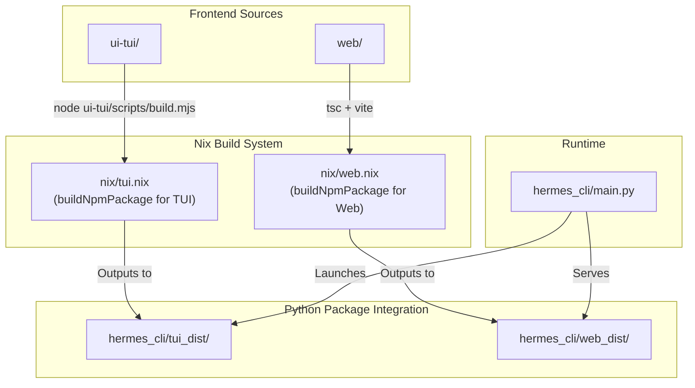

**Sources:** [nix/tui.nix:1-33](), [nix/web.nix:1-34](), [nix/nixosModules.nix:1-157](), [nix/lib.nix:1-127]()

---

## Project Entry Points

Key command-line entry points registered in `pyproject.toml` and `hermes_cli/__init__.py`:

| Command | Entry Point | Purpose |
|---------|-------------|---------|
| `hermes chat` | `hermes_cli.main:main` | Interactive chat REPL [hermes_cli/__init__.py:5]() |
| `hermes gateway` | `hermes_cli.main:main` | Multi-platform messaging gateway [hermes_cli/__init__.py:6]() |
| `hermes setup` | `hermes_cli.main:main` | Interactive configuration wizard [hermes_cli/__init__.py:9]() |
| `hermes status` | `hermes_cli.main:main` | System diagnostic and component status [hermes_cli/__init__.py:10]() |

**Sources:** [pyproject.toml:9-11](), [hermes_cli/__init__.py:1-12]()

---

<<< SECTION: 2 Getting Started [2-getting-started] >>>

# Getting Started

<details>
<summary>Relevant source files</summary>

The following files were used as context for generating this wiki page:

- [.env.example](.env.example)
- [.gitignore](.gitignore)
- [AGENTS.md](AGENTS.md)
- [CONTRIBUTING.md](CONTRIBUTING.md)
- [README.md](README.md)
- [README.ur-pk.md](README.ur-pk.md)
- [README.zh-CN.md](README.zh-CN.md)
- [hermes_cli/managed_uv.py](hermes_cli/managed_uv.py)
- [optional-skills/blockchain/evm/SKILL.md](optional-skills/blockchain/evm/SKILL.md)
- [optional-skills/blockchain/evm/scripts/evm_client.py](optional-skills/blockchain/evm/scripts/evm_client.py)
- [optional-skills/devops/pinggy-tunnel/SKILL.md](optional-skills/devops/pinggy-tunnel/SKILL.md)
- [scripts/install.ps1](scripts/install.ps1)
- [scripts/install.sh](scripts/install.sh)
- [setup-hermes.sh](setup-hermes.sh)
- [tests/hermes_cli/test_cmd_update.py](tests/hermes_cli/test_cmd_update.py)
- [tests/hermes_cli/test_cron_parser_builder.py](tests/hermes_cli/test_cron_parser_builder.py)
- [tests/hermes_cli/test_managed_uv.py](tests/hermes_cli/test_managed_uv.py)
- [tests/hermes_cli/test_run_with_idle_timeout.py](tests/hermes_cli/test_run_with_idle_timeout.py)
- [tests/hermes_cli/test_tui_npm_install.py](tests/hermes_cli/test_tui_npm_install.py)
- [tests/hermes_cli/test_update_autostash.py](tests/hermes_cli/test_update_autostash.py)
- [tests/hermes_cli/test_uv_tool_update.py](tests/hermes_cli/test_uv_tool_update.py)
- [tests/hermes_cli/test_verify_core_dependencies.py](tests/hermes_cli/test_verify_core_dependencies.py)
- [tests/hermes_cli/test_web_ui_build.py](tests/hermes_cli/test_web_ui_build.py)
- [tests/hermes_cli/test_windows_native_docs.py](tests/hermes_cli/test_windows_native_docs.py)
- [website/docs/developer-guide/contributing.md](website/docs/developer-guide/contributing.md)
- [website/docs/getting-started/installation.md](website/docs/getting-started/installation.md)
- [website/docs/getting-started/quickstart.md](website/docs/getting-started/quickstart.md)
- [website/docs/getting-started/updating.md](website/docs/getting-started/updating.md)
- [website/docs/guides/run-nemotron-3-ultra-free.md](website/docs/guides/run-nemotron-3-ultra-free.md)
- [website/docs/index.mdx](website/docs/index.mdx)
- [website/docs/integrations/providers.md](website/docs/integrations/providers.md)
- [website/docs/reference/cli-commands.md](website/docs/reference/cli-commands.md)
- [website/docs/reference/environment-variables.md](website/docs/reference/environment-variables.md)
- [website/docs/reference/optional-skills-catalog.md](website/docs/reference/optional-skills-catalog.md)
- [website/docs/reference/skills-catalog.md](website/docs/reference/skills-catalog.md)
- [website/docs/reference/slash-commands.md](website/docs/reference/slash-commands.md)
- [website/docs/user-guide/cli.md](website/docs/user-guide/cli.md)
- [website/docs/user-guide/configuration.md](website/docs/user-guide/configuration.md)
- [website/docs/user-guide/features/fallback-providers.md](website/docs/user-guide/features/fallback-providers.md)
- [website/docs/user-guide/messaging/index.md](website/docs/user-guide/messaging/index.md)
- [website/docs/user-guide/sessions.md](website/docs/user-guide/sessions.md)
- [website/docs/user-guide/skills/optional/blockchain/blockchain-evm.md](website/docs/user-guide/skills/optional/blockchain/blockchain-evm.md)
- [website/docs/user-guide/skills/optional/devops/devops-pinggy-tunnel.md](website/docs/user-guide/skills/optional/devops/devops-pinggy-tunnel.md)
- [website/docs/user-guide/windows-native.md](website/docs/user-guide/windows-native.md)
- [website/i18n/zh-Hans/docusaurus-plugin-content-docs/current/developer-guide/contributing.md](website/i18n/zh-Hans/docusaurus-plugin-content-docs/current/developer-guide/contributing.md)
- [website/i18n/zh-Hans/docusaurus-plugin-content-docs/current/getting-started/installation.md](website/i18n/zh-Hans/docusaurus-plugin-content-docs/current/getting-started/installation.md)
- [website/i18n/zh-Hans/docusaurus-plugin-content-docs/current/user-guide/windows-native.md](website/i18n/zh-Hans/docusaurus-plugin-content-docs/current/user-guide/windows-native.md)
- [website/sidebars.ts](website/sidebars.ts)

</details>


This page provides a high-level guide for installing and configuring Hermes Agent, from initial setup to your first conversation. Hermes is designed for users who live in the terminal but also offers a robust messaging gateway for external platforms, a TUI, and a desktop application [hermes_cli/main.py:41]().

---

## 2.1 Installation

Hermes Agent is cross-platform, supporting Linux, macOS, WSL2, and Android (via Termux). The primary installation method uses `uv` for fast Python provisioning and dependency management [scripts/install.sh:6](), [scripts/install.ps1:5]().

*   **Linux / macOS / WSL2**: The `curl | bash` installer handles platform-specific setup and dependency provisioning [scripts/install.sh:9-12](). It supports an FHS-style root install layout where code is at `/usr/local/lib/hermes-agent` and the command is linked to `/usr/local/bin/hermes` [scripts/install.sh:62-66]().
*   **Android / Termux**: The installer uses Python's standard library `venv` and `pip` on Termux, as `uv` is primarily for desktop/server installs [scripts/install.sh:6](). For details, see [Termux guide](https://hermes-agent.nousresearch.com/docs/getting-started/termux).
*   **Windows**: Native Windows support is available via a PowerShell one-liner [scripts/install.ps1:8](). It uses `uv` for Python provisioning and package management [scripts/install.ps1:5]().
*   **Desktop App**: A Tauri-based bootstrap installer is available for macOS and Windows, providing a graphical entry point to the ecosystem [scripts/install.ps1:49-56]().

For details, see [Installation](#2.1).

**Sources:** [scripts/install.sh:1-12](), [scripts/install.ps1:1-13](), [scripts/install.ps1:49-56](), [README.md:50-51](), [README.md:63-64]()

---

## 2.2 Configuration and Setup

Hermes stores all user data and settings in the `HERMES_HOME` directory, which defaults to `~/.hermes/` on POSIX systems [scripts/install.sh:48]() and `$env:LOCALAPPDATA\hermes` on Windows [scripts/install.ps1:26](). Configuration follows a strict hierarchy where CLI arguments override file-based settings [website/docs/user-guide/configuration.md:49-57]().

### Configuration Hierarchy

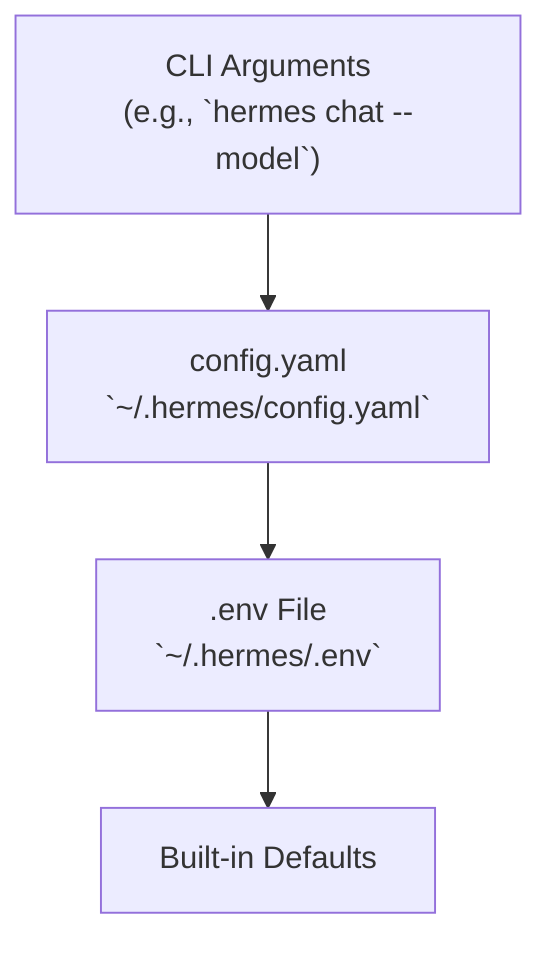
**Sources:** [website/docs/user-guide/configuration.md:49-57]()

### The Setup Wizard

The `hermes setup` command launches an interactive wizard [website/docs/reference/cli-commands.md:47]() that configures models, terminal backends, and messaging platforms. The `hermes config set` command automatically routes values to the correct file (e.g., API keys to `.env`, other settings to `config.yaml`) [website/docs/user-guide/configuration.md:45-47]().

| File | Contents |
|------|----------|
| `config.yaml` | Non-secret settings (model, terminal, TTS, compression, etc.) [website/docs/user-guide/configuration.md:19]() |
| `.env` | API keys and secrets [website/docs/user-guide/configuration.md:20]() |
| `auth.json` | OAuth provider credentials (Nous Portal, etc.) [website/docs/user-guide/configuration.md:21]() |
| `SOUL.md` | Primary agent identity (slot #1 in system prompt) [website/docs/user-guide/configuration.md:22]() |

For a full reference of configuration keys and the setup process, see [Configuration and Setup](#2.2).

**Sources:** [website/docs/user-guide/configuration.md:7-30](), [website/docs/user-guide/configuration.md:45-47](), [website/docs/reference/cli-commands.md:47]()

---

## 2.3 Authentication and Providers

Hermes features a multi-provider authentication system that supports OAuth device code flows and traditional API key providers.

1.  **OAuth Flows**: Managed via `hermes auth` [website/docs/reference/cli-commands.md:49](), supporting providers like Nous Portal, OpenAI Codex, and xAI [website/docs/integrations/providers.md:17-21]().
2.  **API Keys**: Configured in `~/.hermes/.env` for providers such as OpenRouter, DeepSeek, and Anthropic [website/docs/reference/environment-variables.md:11-79]().
3.  **Provider Resolution**: Hermes uses a resolution chain to find credentials, prioritizing environment variables and `.env` files [website/docs/user-guide/configuration.md:49-57](). The `agent/auxiliary_client.py` module defines the resolution order for text and vision/multimodal tasks [agent/auxiliary_client.py:6-22]().

### Provider Resolution Flow

```mermaid
graph TD
    A["User Command<br/>(e.g. `hermes chat`)"] --> B["`hermes_cli/main.py`<br/>`model_command()`"]
    B --> C{Credential Lookup}
    
    subgraph "Code Entity Space"
        C1["`os.environ`"]
        C2["`dotenv` Parser<br/>(for `.env`)"]
        C3["`auth.json` Reader"]
    end

    C1 --> D["`hermes_cli/runtime_provider.py`<br/>`resolve_provider_client()`"]
    C2 --> D
    C3 --> D
    D --> E["Inference API"]
```
**Sources:** [agent/auxiliary_client.py:6-22](), [website/docs/user-guide/configuration.md:49-57](), [website/docs/reference/environment-variables.md:11-79](), [website/docs/reference/cli-commands.md:49](), [website/docs/integrations/providers.md:17-21]()

For details on specific provider requirements and OAuth flows, see [Authentication and Providers](#2.3).

---

## 2.4 Model Selection and Management

Hermes maintains a model catalog and provides tools for context length discovery and validation.

*   **Interactive Selection**: The `hermes model` command provides a terminal interface for choosing providers and models [website/docs/reference/cli-commands.md:41]().
*   **Nous Portal**: A recommended unified subscription that provides access to 300+ models via `hermes setup --portal` [website/docs/integrations/providers.md:62-67]().
*   **Fallback Management**: Users can configure fallback providers via `hermes fallback` to ensure continuity if the primary model fails [website/docs/reference/cli-commands.md:42]().
*   **Model Catalog**: The `hermes_cli/models.py` module defines canonical model catalogs for various providers, including OpenRouter, Anthropic, OpenAI, Google, and xAI [hermes_cli/models.py:35-172]().

### Model Selection and Persistence

```mermaid
flowchart LR
    A["`hermes model`"] --> B["`hermes_cli/main.py`<br/>`model_command()`"]
    B --> C["`~/.hermes/config.yaml`"]
    C --> D["`hermes_cli/runtime_provider.py`<br/>`resolve_provider_client()`"]
    
    subgraph "Validation & Runtime"
        D --> E{"Check API Key"}
        E -- "Missing" --> F["`hermes auth` / `.env`"]
        E -- "Present" --> G["`AIAgent` Init<br/>`agent/agent.py`"]
    end
```
**Sources:** [hermes_cli/models.py:35-172](), [website/docs/reference/cli-commands.md:41](), [website/docs/reference/cli-commands.md:42](), [website/docs/integrations/providers.md:62-67]()

---

<<< SECTION: 2.1 Installation [2-1-installation] >>>

# Installation

<details>
<summary>Relevant source files</summary>

The following files were used as context for generating this wiki page:

- [.env.example](.env.example)
- [.envrc](.envrc)
- [.gitignore](.gitignore)
- [AGENTS.md](AGENTS.md)
- [CONTRIBUTING.md](CONTRIBUTING.md)
- [README.md](README.md)
- [README.ur-pk.md](README.ur-pk.md)
- [README.zh-CN.md](README.zh-CN.md)
- [apps/desktop/src/app/chat/composer/hooks/use-composer-branch.ts](apps/desktop/src/app/chat/composer/hooks/use-composer-branch.ts)
- [flake.lock](flake.lock)
- [flake.nix](flake.nix)
- [hermes_cli/managed_uv.py](hermes_cli/managed_uv.py)
- [nix/checks.nix](nix/checks.nix)
- [nix/devShell.nix](nix/devShell.nix)
- [nix/hermes-agent.nix](nix/hermes-agent.nix)
- [nix/lib.nix](nix/lib.nix)
- [nix/nixosModules.nix](nix/nixosModules.nix)
- [nix/overlays.nix](nix/overlays.nix)
- [nix/packages.nix](nix/packages.nix)
- [nix/python.nix](nix/python.nix)
- [nix/tui.nix](nix/tui.nix)
- [nix/web.nix](nix/web.nix)
- [package-lock.json](package-lock.json)
- [package.json](package.json)
- [scripts/install.ps1](scripts/install.ps1)
- [scripts/install.sh](scripts/install.sh)
- [scripts/whatsapp-bridge/package-lock.json](scripts/whatsapp-bridge/package-lock.json)
- [scripts/whatsapp-bridge/package.json](scripts/whatsapp-bridge/package.json)
- [setup-hermes.sh](setup-hermes.sh)
- [tests/hermes_cli/test_cmd_update.py](tests/hermes_cli/test_cmd_update.py)
- [tests/hermes_cli/test_cron_parser_builder.py](tests/hermes_cli/test_cron_parser_builder.py)
- [tests/hermes_cli/test_managed_uv.py](tests/hermes_cli/test_managed_uv.py)
- [tests/hermes_cli/test_run_with_idle_timeout.py](tests/hermes_cli/test_run_with_idle_timeout.py)
- [tests/hermes_cli/test_tui_npm_install.py](tests/hermes_cli/test_tui_npm_install.py)
- [tests/hermes_cli/test_update_autostash.py](tests/hermes_cli/test_update_autostash.py)
- [tests/hermes_cli/test_uv_tool_update.py](tests/hermes_cli/test_uv_tool_update.py)
- [tests/hermes_cli/test_verify_core_dependencies.py](tests/hermes_cli/test_verify_core_dependencies.py)
- [tests/hermes_cli/test_web_ui_build.py](tests/hermes_cli/test_web_ui_build.py)
- [tests/hermes_cli/test_windows_native_docs.py](tests/hermes_cli/test_windows_native_docs.py)
- [tests/test_package_json_lazy_deps.py](tests/test_package_json_lazy_deps.py)
- [ui-tui/eslint.config.mjs](ui-tui/eslint.config.mjs)
- [ui-tui/package.json](ui-tui/package.json)
- [ui-tui/tsconfig.json](ui-tui/tsconfig.json)
- [website/docs/developer-guide/contributing.md](website/docs/developer-guide/contributing.md)
- [website/docs/getting-started/installation.md](website/docs/getting-started/installation.md)
- [website/docs/getting-started/nix-setup.md](website/docs/getting-started/nix-setup.md)
- [website/docs/getting-started/termux.md](website/docs/getting-started/termux.md)
- [website/docs/getting-started/updating.md](website/docs/getting-started/updating.md)
- [website/docs/guides/run-nemotron-3-ultra-free.md](website/docs/guides/run-nemotron-3-ultra-free.md)
- [website/docs/index.mdx](website/docs/index.mdx)
- [website/docs/user-guide/windows-native.md](website/docs/user-guide/windows-native.md)
- [website/i18n/zh-Hans/docusaurus-plugin-content-docs/current/developer-guide/contributing.md](website/i18n/zh-Hans/docusaurus-plugin-content-docs/current/developer-guide/contributing.md)
- [website/i18n/zh-Hans/docusaurus-plugin-content-docs/current/getting-started/installation.md](website/i18n/zh-Hans/docusaurus-plugin-content-docs/current/getting-started/installation.md)
- [website/i18n/zh-Hans/docusaurus-plugin-content-docs/current/user-guide/windows-native.md](website/i18n/zh-Hans/docusaurus-plugin-content-docs/current/user-guide/windows-native.md)

</details>


This document explains the installation process for Hermes Agent, detailing installation methods (curl|bash, PowerShell, manual, Nix flake), dependency provisioning, and platform-specific considerations.

---

## Overview

Hermes Agent features a zero-configuration, fully automated installer designed to provision its own isolated Python environment and dependencies to guarantee cross-platform compatibility and minimal system interference. The core installation logic is implemented in several key scripts:

- `scripts/install.sh` for POSIX-compliant systems (Linux, macOS, WSL2, Android Termux) [scripts/install.sh:1-15]()
- `scripts/install.ps1` for Windows PowerShell environments [scripts/install.ps1:1-13]()
- `setup-hermes.sh` for developers setting up a manual clone [setup-hermes.sh:1-18]()

The installer automates system detection, dependency management (including the `uv` Python package manager), Python environment setup, repository cloning, and CLI integration. For advanced users and automated deployments, Hermes also supports a Nix flake and NixOS modules for declarative installation [nix/nixosModules.nix:1-25]().

### Installation Workflow Summary

The installer executes a structured sequence:

1.  **System Detection:** Determines OS and distribution to tailor installation steps [scripts/install.sh:210-231]() (for `install.sh`) or uses PowerShell's built-in capabilities (for `install.ps1`).
2.  **`uv` Package Manager Installation:** Provisions `uv`, a fast Python environment and package manager [scripts/install.sh:258-278](), [scripts/install.ps1:72-130]().
3.  **Python Provisioning:** Ensures Python 3.11 (or compatible fallback) is present, installing it via `uv` if needed [scripts/install.sh:285-309](), [scripts/install.ps1:132-192]().
4.  **Dependency Checks:** Verifies and installs essential system dependencies such as `git`, `curl`, `ffmpeg`, and `node` [scripts/install.sh:311-399]() (for `install.sh`) or `git`, `curl`, `nodejs` (for `install.ps1`).
5.  **Repository Setup**: Clones the Hermes Agent repository with submodules [scripts/install.sh:436-482]() (for `install.sh`) or `git clone` (for `install.ps1`).
6.  **Virtual Environment & Dependency Installation:** Uses `uv` to create a Python virtual environment and pip-install dependencies, isolating Hermes runtime [scripts/install.sh:494-529]() (for `install.sh`) or `uv venv` and `uv pip install` (for `install.ps1`).
7.  **CLI Command Integration:** Creates symlinks to the `hermes` CLI binary in user local bin paths [scripts/install.sh:531-569]() (for `install.sh`) or adds to PATH (for `install.ps1`).
8.  **Post-Installation Setup Wizard:** Invokes `hermes setup` interactively to finalize configuration [scripts/install.sh:610-628]() (for `install.sh`) or `hermes setup` (for `install.ps1`).

Sources: [scripts/install.sh:210-628](), [scripts/install.ps1:72-596](), [setup-hermes.sh:1-18]()

---

## Installation Methods

### 1. Quick Install (curl|bash or PowerShell)

#### Linux / macOS / WSL2 / Android (Termux)
Run the POSIX shell install script directly via `curl`:
```bash
curl -fsSL https://hermes-agent.nousresearch.com/install.sh | bash
```
This script automatically detects platform specifics. For Termux (Android), it uses standard Python virtual environments (`venv`) and pip instead of `uv` due to binary compatibility constraints [scripts/install.sh:6-7]().

#### Windows (Native PowerShell)
Use the PowerShell installation command:
```powershell
iex (irm https://hermes-agent.nousresearch.com/install.ps1)
```
The installer handles provisioning `uv`, Python 3.11, and Node.js. It also manages console encoding to UTF-8 to ensure that progress bars and non-ASCII characters render correctly [scripts/install.ps1:84-89]().

Sources: [scripts/install.sh:8-87](), [scripts/install.ps1:7-21]()

---

### 2. Manual Installation (Development)

Developers can manually clone and set up Hermes using the provided setup script:
```bash
git clone --recurse-submodules https://github.com/NousResearch/hermes-agent.git
cd hermes-agent
./setup-hermes.sh
```
The `setup-hermes.sh` script automates the creation of a `.venv` using `uv` (on desktop) or `python -m venv` (on Termux) and installs the correct dependency set [setup-hermes.sh:169-182]().

Sources: [setup-hermes.sh:1-18](), [setup-hermes.sh:169-182]()

---

### 3. Nix Flake and NixOS Modules

Hermes Agent supports Nix for reproducible and declarative installs.
- **NixOS Module:** Provides a native systemd service or an OCI container mode [nix/nixosModules.nix:1-11]().
- **TUI Component:** The React-based TUI is built using `pkgs.buildNpmPackage` and bundled via `esbuild` [nix/tui.nix:9-33]().
- **Web UI:** The dashboard frontend is built using Vite/React and bundled via `pkgs.buildNpmPackage` [nix/web.nix:9-34]().
- **Container Mode:** Runs Hermes from `/nix/store` bind-mounted into an Ubuntu container, allowing persistent `apt/pip/npm` installs for agent self-improvement [nix/nixosModules.nix:7-11]().
- **Dependency Isolation:** The Nix build uses `importNpmLock` to resolve Node dependencies offline, ensuring builds are reproducible without network access [nix/lib.nix:21-25]().

Sources: [nix/nixosModules.nix:1-25](), [nix/tui.nix:9-33](), [nix/web.nix:9-34](), [nix/lib.nix:21-25]()

---

### 4. Tauri Bootstrap Installer (Desktop App)

The desktop application for Hermes Agent uses a Tauri bootstrap installer (found in `apps/bootstrap-installer`). This installer leverages the `install.ps1` script on Windows and `install.sh` on macOS/Linux to provision the core Hermes CLI and its dependencies. The `--include-desktop` flag is passed to the installer to trigger the desktop app build process [scripts/install.ps1:45-60](), [scripts/install.sh:137]().

The desktop app build process ensures that a launchable binary is created. For example, on Windows, it can build `apps/desktop` into a launchable `Hermes.exe` [scripts/install.ps1:45-59]().

Sources: [scripts/install.ps1:45-60](), [scripts/install.sh:137]()

---

## Installation Flow Diagrams

### 1. System Provisioning Logic
This diagram traces the flow from initial script invocation through system detection and environment setup:

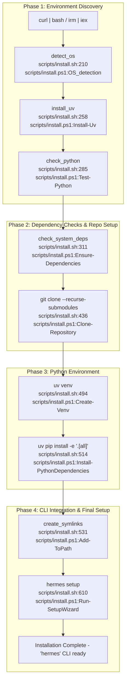
Sources: [scripts/install.sh:210-628](), [scripts/install.ps1:72-596]()

### 2. Installation Code Entity Association Map
This diagram associates system names with specific code entities and filesystem locations:

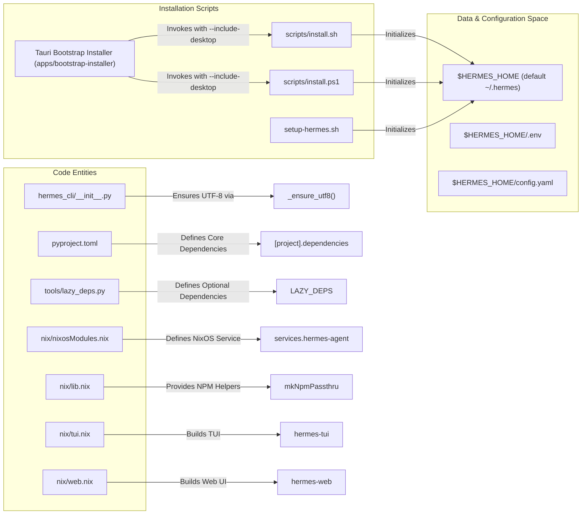
Sources: [hermes_cli/__init__.py:21-47](), [scripts/install.sh:48-58](), [scripts/install.ps1:45-60](), [scripts/install.sh:137](), [package.json:1-25](), [pyproject.toml:24-115](), [tools/lazy_deps.py:77-160](), [nix/nixosModules.nix:1-25](), [nix/lib.nix:21-25](), [nix/tui.nix:9-33](), [nix/web.nix:9-34]()

---

## Dependency Management

Hermes Agent uses `uv` to manage a strictly pinned dependency set [package.json:1-25](), [pyproject.toml:24-37](). Dependencies are exact-pinned (e.g., `openai==2.24.0`) to prevent supply-chain attacks from unvetted transitive updates [pyproject.toml:25-33]().

### Core Dependencies
| Package | Version | Purpose |
| :--- | :--- | :--- |
| `openai` | `2.24.0` | Primary LLM client [pyproject.toml:45]() |
| `pydantic` | `2.13.4` | Data validation and settings [pyproject.toml:60]() |
| `prompt_toolkit` | `3.0.52` | Interactive CLI framework [pyproject.toml:62]() |
| `psutil` | `7.2.2` | Cross-platform process management [pyproject.toml:101]() |
| `fastapi` | `>=0.104.0` | Web server for dashboard and API [pyproject.toml:107]() |

### Lazy-Installed Dependencies
Many features (e.g., specific TTS providers, messaging platforms, or vector memories) are lazy-installed on first use to minimize bloat [tools/lazy_deps.py:1-17](). The `ensure()` function in `tools/lazy_deps.py` checks for these dependencies and installs them into the venv on demand [tools/lazy_deps.py:18-24]().

- **`provider.anthropic`**: `anthropic==0.87.0` [tools/lazy_deps.py:99]()
- **`platform.discord`**: `discord.py[voice]==2.7.1` [tools/lazy_deps.py:147]()
- **`memory.honcho`**: `honcho-ai==2.0.1` [tools/lazy_deps.py:138]()

Sources: [pyproject.toml:24-123](), [tools/lazy_deps.py:77-160]()

---

## Platform-Specific Considerations

### Windows
- **UTF-8 Support:** Hermes forces UTF-8 on Windows to prevent `UnicodeEncodeError` with box-drawing characters (┌│├└─) and the ⚕ glyph used in CLI output [hermes_cli/__init__.py:21-47]().
- **Timezone Data:** The `tzdata` package is installed for Windows only to provide the Olson database [pyproject.toml:95]().
- **Process Management:** Uses `psutil` for cross-platform PID management, replacing POSIX-only idioms like `os.killpg` [pyproject.toml:96-101]().

### NixOS
- **Container Backend:** Supports both `docker` and `podman` as backends for the containerized agent [nix/nixosModules.nix:80-82]().
- **Tool Provisioning:** The container entrypoint provisions `nodejs`, `npm`, and `uv` on first boot to allow for writable tool prefixes within the persistent container layer [nix/nixosModules.nix:135-152]().

### Android (Termux)
- **Manual Path:** Uses standard `venv` and `pip` instead of `uv` due to binary compatibility constraints on Android [scripts/install.sh:6-7]().

Sources: [hermes_cli/__init__.py:21-47](), [pyproject.toml:89-100](), [nix/nixosModules.nix:80-152](), [scripts/install.sh:6-7]()

---

<<< SECTION: 2.2 Configuration and Setup [2-2-configuration-and-setup] >>>

# Configuration and Setup

<details>
<summary>Relevant source files</summary>

The following files were used as context for generating this wiki page:

- [agent/auxiliary_client.py](agent/auxiliary_client.py)
- [agent/model_metadata.py](agent/model_metadata.py)
- [agent/models_dev.py](agent/models_dev.py)
- [cli-config.yaml.example](cli-config.yaml.example)
- [cli.py](cli.py)
- [gateway/run.py](gateway/run.py)
- [hermes_cli/auth.py](hermes_cli/auth.py)
- [hermes_cli/codex_models.py](hermes_cli/codex_models.py)
- [hermes_cli/commands.py](hermes_cli/commands.py)
- [hermes_cli/config.py](hermes_cli/config.py)
- [hermes_cli/logs.py](hermes_cli/logs.py)
- [hermes_cli/main.py](hermes_cli/main.py)
- [hermes_cli/models.py](hermes_cli/models.py)
- [hermes_cli/runtime_provider.py](hermes_cli/runtime_provider.py)
- [hermes_cli/setup.py](hermes_cli/setup.py)
- [hermes_logging.py](hermes_logging.py)
- [optional-skills/blockchain/evm/SKILL.md](optional-skills/blockchain/evm/SKILL.md)
- [optional-skills/blockchain/evm/scripts/evm_client.py](optional-skills/blockchain/evm/scripts/evm_client.py)
- [optional-skills/devops/pinggy-tunnel/SKILL.md](optional-skills/devops/pinggy-tunnel/SKILL.md)
- [run_agent.py](run_agent.py)
- [tests/agent/test_auxiliary_client.py](tests/agent/test_auxiliary_client.py)
- [tests/agent/test_model_metadata.py](tests/agent/test_model_metadata.py)
- [tests/agent/test_models_dev.py](tests/agent/test_models_dev.py)
- [tests/hermes_cli/test_api_key_providers.py](tests/hermes_cli/test_api_key_providers.py)
- [tests/hermes_cli/test_auth_codex_provider.py](tests/hermes_cli/test_auth_codex_provider.py)
- [tests/hermes_cli/test_auth_codex_self_heal.py](tests/hermes_cli/test_auth_codex_self_heal.py)
- [tests/hermes_cli/test_codex_cli_model_picker.py](tests/hermes_cli/test_codex_cli_model_picker.py)
- [tests/hermes_cli/test_codex_models.py](tests/hermes_cli/test_codex_models.py)
- [tests/hermes_cli/test_commands.py](tests/hermes_cli/test_commands.py)
- [tests/hermes_cli/test_logs.py](tests/hermes_cli/test_logs.py)
- [tests/hermes_cli/test_model_validation.py](tests/hermes_cli/test_model_validation.py)
- [tests/hermes_cli/test_runtime_provider_resolution.py](tests/hermes_cli/test_runtime_provider_resolution.py)
- [tests/hermes_cli/test_setup.py](tests/hermes_cli/test_setup.py)
- [tests/hermes_cli/test_setup_model_provider.py](tests/hermes_cli/test_setup_model_provider.py)
- [tests/hermes_cli/test_setup_noninteractive.py](tests/hermes_cli/test_setup_noninteractive.py)
- [tests/hermes_cli/test_setup_openclaw_migration.py](tests/hermes_cli/test_setup_openclaw_migration.py)
- [tests/hermes_cli/test_setup_reconfigure.py](tests/hermes_cli/test_setup_reconfigure.py)
- [tests/test_hermes_logging.py](tests/test_hermes_logging.py)
- [tools/debug_helpers.py](tools/debug_helpers.py)
- [website/docs/getting-started/quickstart.md](website/docs/getting-started/quickstart.md)
- [website/docs/integrations/providers.md](website/docs/integrations/providers.md)
- [website/docs/reference/cli-commands.md](website/docs/reference/cli-commands.md)
- [website/docs/reference/environment-variables.md](website/docs/reference/environment-variables.md)
- [website/docs/reference/optional-skills-catalog.md](website/docs/reference/optional-skills-catalog.md)
- [website/docs/reference/skills-catalog.md](website/docs/reference/skills-catalog.md)
- [website/docs/reference/slash-commands.md](website/docs/reference/slash-commands.md)
- [website/docs/user-guide/cli.md](website/docs/user-guide/cli.md)
- [website/docs/user-guide/configuration.md](website/docs/user-guide/configuration.md)
- [website/docs/user-guide/features/fallback-providers.md](website/docs/user-guide/features/fallback-providers.md)
- [website/docs/user-guide/messaging/index.md](website/docs/user-guide/messaging/index.md)
- [website/docs/user-guide/sessions.md](website/docs/user-guide/sessions.md)
- [website/docs/user-guide/skills/optional/blockchain/blockchain-evm.md](website/docs/user-guide/skills/optional/blockchain/blockchain-evm.md)
- [website/docs/user-guide/skills/optional/devops/devops-pinggy-tunnel.md](website/docs/user-guide/skills/optional/devops/devops-pinggy-tunnel.md)
- [website/sidebars.ts](website/sidebars.ts)

</details>


This page covers the detailed mechanics of configuration management and setup in Hermes Agent. It explains the layered configuration hierarchy that governs runtime settings, describes the interactive setup wizard, and presents key configuration files integral to the system initialization and environment control.

---

## Directory Structure

Hermes stores all configuration and runtime data in a well-defined user directory, by default `~/.hermes/`. This home directory is configurable via the `HERMES_HOME` environment variable. [run_agent.py:125-127](), [hermes_cli/config.py:4-6]()

The directory structure is automatically created when the Hermes Agent initializes via the `ensure_hermes_home` function [hermes_cli/config.py:144]() and consists of:

```text
~/.hermes/
├── config.yaml          # Main structured configuration (model, terminal, tools, etc.)
├── .env                 # Secrets and API keys (e.g., OPENAI_API_KEY)
├── auth.json            # OAuth credentials (managed via hermes_cli/auth.py)
├── SOUL.md              # Primary agent persona (slot #1 in system prompt)
├── memories/            # Persistent memory files (MEMORY.md, USER.md)
├── skills/              # Agent skills (managed via skill_manage tool)
├── cron/                # Scheduled jobs configuration
├── sessions/            # Message gateway session storage
├── logs/                # Log files (errors.log, gateway.log, agent.log)
└── active_profile       # Optional sticky profile name for multiple config sets
```

Sources: [hermes_cli/config.py:4-13](), [website/docs/user-guide/configuration.md:18-27](), [hermes_cli/auth.py:4-13](), [hermes_cli/config.py:144]()

---

## Configuration Hierarchy

Hermes Agent applies settings in a layered precedence order to determine runtime behavior, with later layers overriding earlier ones. The resolution order is:

1.  **CLI arguments** (highest priority): Flags like `--model`, `--provider`, or `--toolsets` override all other sources for a single invocation. [cli.py:10-11]()
2.  **`~/.hermes/config.yaml`**: The primary config file for all non-secret settings. [hermes_cli/config.py:5]()
3.  **`~/.hermes/.env`**: Fallback for environment variables; strictly required for secrets (API keys, tokens). Loaded via `load_hermes_dotenv`. [run_agent.py:126-128](), [cli.py:182]()
4.  **Built-in defaults**: Hardcoded safe defaults defined in `DEFAULT_CONFIG` within `hermes_cli/config.py`. [hermes_cli/config.py:344]()

The following diagram illustrates this priority chain and how it culminates in the runtime configuration:

**Configuration Priority and Resolution**
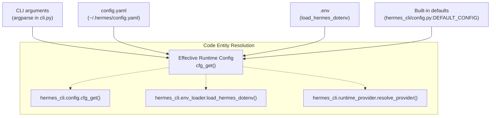

### Implementation Highlights

-   **Early Interface Decision**: The system performs a minimal YAML read of `display.interface` in `_config_default_interface_early` to decide between CLI and TUI before the full config system is initialized. [hermes_cli/main.py:119-142]()
-   **Secret Routing**: The `hermes config set` command automatically routes values: API keys are identified via `_ENV_VAR_NAME_RE` and saved to `.env` via `save_env_value`, while settings go to `config.yaml`. [hermes_cli/config.py:141-144](), [website/docs/user-guide/configuration.md:40-42]()
-   **Env Substitution**: `config.yaml` supports `${VAR_NAME}` syntax to reference variables from the environment or `.env` file, handled during config loading. [hermes_cli/config.py:300-302]()
-   **Config Parsing Warnings**: If `config.yaml` is malformed, `load_config` falls back to defaults and surfaces a warning via `_warn_config_parse_failure`, including creating a `.bak` copy of the corrupt file. [hermes_cli/config.py:42-93, 96-138]()

Sources: [cli.py:10-11, 182](), [hermes_cli/config.py:5, 42-144, 300-302, 344](), [hermes_cli/main.py:119-142](), [run_agent.py:125-128](), [website/docs/user-guide/configuration.md:40-42]()

---

## `config.yaml` Reference

The `config.yaml` file governs the structured behavior of the agent. An example is provided in `cli-config.yaml.example`. [cli-config.yaml.example:1-3]()

### Core Configuration Sections

| Section | Description | Key Configuration Keys |
| :--- | :--- | :--- |
| `model` | AI model & provider routing | `default`, `provider`, `base_url` [cli-config.yaml.example:11-47]() |
| `terminal` | Terminal execution backend | `backend`, `cwd`, `timeout`, `env_passthrough` [website/docs/user-guide/configuration.md:114-119]() |
| `agent` | Agent loop heuristics | `reasoning_effort`, `max_turns`, `max_iterations` [hermes_cli/setup.py:114-118]() |
| `auxiliary` | Side-task specialized models | `vision`, `compression`, `web_extract` [website/docs/user-guide/configuration.md:73-76]() |
| `providers` | Provider-specific tuning | `request_timeout_seconds`, `stale_timeout_seconds` [cli-config.yaml.example:109-121]() |

### Auxiliary Client Overrides

Hermes uses specialized models for tasks like context compression or vision. The `agent/auxiliary_client.py` module handles a resolution chain for these tasks, allowing overrides in `config.yaml` under the `auxiliary:` section. [agent/auxiliary_client.py:31-34]()

Sources: [agent/auxiliary_client.py:31-34](), [cli-config.yaml.example:1-47, 109-121](), [hermes_cli/setup.py:114-118](), [website/docs/user-guide/configuration.md:73-76, 114-119]()

---

## .env File Reference

The `.env` file stores sensitive API keys and environment-specific overrides. All variables can be set with `hermes config set VAR value`. [website/docs/user-guide/configuration.md:40-42]()

| Environment Variable | Purpose |
| :--- | :--- |
| `OPENROUTER_API_KEY` | Recommended for multi-model access [website/docs/reference/environment-variables.md:10]() |
| `ANTHROPIC_API_KEY` | Native Anthropic access [website/docs/reference/environment-variables.md:20]() |
| `GOOGLE_API_KEY` | Google AI Studio / Gemini access [website/docs/reference/environment-variables.md:29]() |
| `HF_TOKEN` | Hugging Face Inference Providers token [website/docs/reference/environment-variables.md:106]() |
| `HERMES_HOME` | Overrides the default `~/.hermes` directory [run_agent.py:125]() |

Sources: [run_agent.py:125](), [website/docs/reference/environment-variables.md:10, 20, 29, 106](), [website/docs/user-guide/configuration.md:40-42]()

---

## Setup Wizard

The `hermes setup` command launches a modular interactive wizard implemented in `hermes_cli/setup.py`. [hermes_cli/setup.py:1-12]()

### Modular Sections
The wizard is split into independently-runnable sections:
1.  **Model & Provider**: Configures the primary LLM and authentication. [hermes_cli/setup.py:5]()
2.  **Terminal Backend**: Configures where commands execute (Local, Docker, etc.). [hermes_cli/setup.py:6]()
3.  **Agent Settings**: Configures iterations, reasoning effort, and memory limits. [hermes_cli/setup.py:7]()
4.  **Messaging Platforms**: Connects Telegram, Discord, Slack, etc. [hermes_cli/setup.py:8]()
5.  **Tools**: Configures TTS, web search, and specialized skills. [hermes_cli/setup.py:9]()

**Setup Wizard Data Flow**
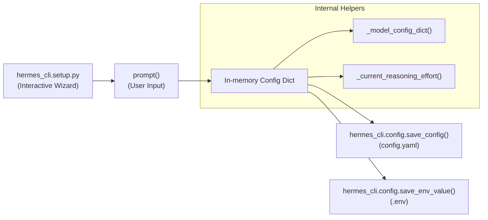

Sources: [hermes_cli/setup.py:1-12]()

---

## Terminal Backend Configuration

Hermes supports multiple execution environments via the `terminal.backend` setting. [website/docs/user-guide/configuration.md:114]()

| Backend | Environment | Implementation Detail |
| :--- | :--- | :--- |
| `local` | Host Machine | Default; no isolation [website/docs/user-guide/configuration.md:130]() |
| `docker` | Container | Full sandboxing; shared persistent container [website/docs/user-guide/configuration.md:131]() |
| `ssh` | Remote Server | Network boundary; uses SSH [website/docs/user-guide/configuration.md:132]() |
| `modal` | Cloud Sandbox | Ephemeral cloud compute [website/docs/user-guide/configuration.md:133]() |
| `daytona` | Managed Cloud | Managed cloud dev environments [website/docs/user-guide/configuration.md:134]() |
| `singularity` | HPC Container | Namespaces via `--containall` [website/docs/user-guide/configuration.md:135]()

Sources: [website/docs/user-guide/configuration.md:114, 130-135]()

---

## Configuration Management Commands

| Command | Action |
| :--- | :--- |
| `hermes config` | View current effective configuration [hermes_cli/commands.py:128]() |
| `hermes config set KEY VAL` | Update a setting (routes to `.env` or `config.yaml`) [website/docs/user-guide/configuration.md:36]() |
| `hermes config edit` | Opens `config.yaml` in the system editor [website/docs/user-guide/configuration.md:35]() |
| `hermes doctor` | Validates configuration and dependencies [hermes_cli/main.py:20]() |
| `hermes setup` | Re-runs the interactive setup wizard [hermes_cli/main.py:15]()

Sources: [hermes_cli/commands.py:128](), [hermes_cli/main.py:15, 20](), [website/docs/user-guide/configuration.md:35-36]()

---

<<< SECTION: 2.3 Authentication and Providers [2-3-authentication-and-providers] >>>

# Authentication and Providers

<details>
<summary>Relevant source files</summary>

The following files were used as context for generating this wiki page:

- [agent/auxiliary_client.py](agent/auxiliary_client.py)
- [agent/credential_pool.py](agent/credential_pool.py)
- [agent/model_metadata.py](agent/model_metadata.py)
- [agent/models_dev.py](agent/models_dev.py)
- [agent/portal_tags.py](agent/portal_tags.py)
- [agent/transports/__init__.py](agent/transports/__init__.py)
- [agent/transports/chat_completions.py](agent/transports/chat_completions.py)
- [agent/transports/types.py](agent/transports/types.py)
- [apps/desktop/src/lib/runtime-readiness.test.ts](apps/desktop/src/lib/runtime-readiness.test.ts)
- [apps/desktop/src/lib/runtime-readiness.ts](apps/desktop/src/lib/runtime-readiness.ts)
- [apps/desktop/src/store/onboarding.test.ts](apps/desktop/src/store/onboarding.test.ts)
- [apps/desktop/src/store/onboarding.ts](apps/desktop/src/store/onboarding.ts)
- [cli-config.yaml.example](cli-config.yaml.example)
- [cli.py](cli.py)
- [gateway/run.py](gateway/run.py)
- [hermes_cli/auth.py](hermes_cli/auth.py)
- [hermes_cli/auth_commands.py](hermes_cli/auth_commands.py)
- [hermes_cli/commands.py](hermes_cli/commands.py)
- [hermes_cli/config.py](hermes_cli/config.py)
- [hermes_cli/main.py](hermes_cli/main.py)
- [hermes_cli/models.py](hermes_cli/models.py)
- [hermes_cli/proxy/adapters/base.py](hermes_cli/proxy/adapters/base.py)
- [hermes_cli/proxy/adapters/nous_portal.py](hermes_cli/proxy/adapters/nous_portal.py)
- [hermes_cli/runtime_provider.py](hermes_cli/runtime_provider.py)
- [hermes_cli/setup.py](hermes_cli/setup.py)
- [plugins/model-providers/nous/__init__.py](plugins/model-providers/nous/__init__.py)
- [plugins/model-providers/openrouter/__init__.py](plugins/model-providers/openrouter/__init__.py)
- [run_agent.py](run_agent.py)
- [tests/agent/test_auxiliary_client.py](tests/agent/test_auxiliary_client.py)
- [tests/agent/test_credential_pool.py](tests/agent/test_credential_pool.py)
- [tests/agent/test_model_metadata.py](tests/agent/test_model_metadata.py)
- [tests/agent/test_models_dev.py](tests/agent/test_models_dev.py)
- [tests/agent/test_portal_tags.py](tests/agent/test_portal_tags.py)
- [tests/agent/transports/test_chat_completions.py](tests/agent/transports/test_chat_completions.py)
- [tests/agent/transports/test_transport.py](tests/agent/transports/test_transport.py)
- [tests/agent/transports/test_types.py](tests/agent/transports/test_types.py)
- [tests/hermes_cli/test_api_key_providers.py](tests/hermes_cli/test_api_key_providers.py)
- [tests/hermes_cli/test_auth_commands.py](tests/hermes_cli/test_auth_commands.py)
- [tests/hermes_cli/test_auth_nous_provider.py](tests/hermes_cli/test_auth_nous_provider.py)
- [tests/hermes_cli/test_commands.py](tests/hermes_cli/test_commands.py)
- [tests/hermes_cli/test_model_validation.py](tests/hermes_cli/test_model_validation.py)
- [tests/hermes_cli/test_nous_inference_url_validation.py](tests/hermes_cli/test_nous_inference_url_validation.py)
- [tests/hermes_cli/test_proxy.py](tests/hermes_cli/test_proxy.py)
- [tests/hermes_cli/test_runtime_provider_resolution.py](tests/hermes_cli/test_runtime_provider_resolution.py)
- [tests/hermes_cli/test_web_oauth_dispatch.py](tests/hermes_cli/test_web_oauth_dispatch.py)
- [tests/providers/test_profile_wiring.py](tests/providers/test_profile_wiring.py)
- [tests/providers/test_provider_profiles.py](tests/providers/test_provider_profiles.py)
- [tests/providers/test_transport_parity.py](tests/providers/test_transport_parity.py)
- [tests/run_agent/test_provider_parity.py](tests/run_agent/test_provider_parity.py)
- [website/docs/developer-guide/adding-providers.md](website/docs/developer-guide/adding-providers.md)
- [website/docs/developer-guide/model-provider-plugin.md](website/docs/developer-guide/model-provider-plugin.md)

</details>


This page documents the authentication system that enables Hermes Agent to connect to Large Language Model (LLM) inference providers. It covers the provider registry, OAuth flows, API key management, credential storage, provider resolution logic, and the auto-detection system.

**Scope**: This page focuses on authentication and provider selection for the **primary inference provider**. For information about auxiliary models used by tools (vision analysis, web scraping, context compression), see [Auxiliary Client (4.5)]().

---

## Overview

Hermes Agent supports a wide range of inference providers through a unified authentication system that handles:

1.  **OAuth Device Code Flows** — Used for Nous Portal and MiniMax authentication where a device code is authorized via browser [hermes_cli/auth.py:750-845]().
2.  **OAuth External Flows** — Delegated authentication via external CLI tools or browser-based redirects, used by OpenAI Codex, Qwen, xAI, and Google Gemini providers [hermes_cli/auth.py:1047-1121]().
3.  **API Key Authentication** — Direct API key providers including OpenRouter, Google AI Studio, Z.AI/GLM, Kimi/Moonshot, MiniMax, Alibaba, DeepSeek, xAI, and others [hermes_cli/auth.py:613-644]().
4.  **Credential Pooling** — Supports multiple credentials per provider with failover, rotation, and status tracking implemented in the `CredentialPool` system [agent/credential_pool.py:1-35]().
5.  **Provider Resolution Chain** — Automatic selection of the active provider based on configuration hierarchy (CLI args → config.yaml → .env → defaults) and auth state [hermes_cli/runtime_provider.py:237-331]().

---

## Provider Registry and Models

Hermes Agent maintains a **provider registry** via the `PROVIDER_REGISTRY` dictionary defined in `hermes_cli/auth.py`, containing `ProviderConfig` dataclasses that describe each known provider's authentication type, base URLs, and environment variables for API keys [hermes_cli/auth.py:167-220]().

The canonical provider IDs and their authentication schemes include:

-   **`nous`** — OAuth device code flow [hermes_cli/auth.py:168-176]().
-   **`openai-codex`** — OAuth external flow [hermes_cli/auth.py:177-182]().
-   **`anthropic`** — API key via `ANTHROPIC_API_KEY` [hermes_cli/auth.py:206-211]().
-   **`openrouter`** — API key via `OPENROUTER_API_KEY` [hermes_cli/auth.py:212-217]().
-   **`custom`** — OpenAI-compatible endpoints with user-defined `base_url` [hermes_cli/config.py:35-36]().

### Model Catalogs

Model catalogs curated per provider are declared in `hermes_cli/models.py`. These allow the system and user interfaces like `hermes setup` to display valid model options, falling back to static snapshots if live discovery fails [hermes_cli/models.py:34-145]().

| Provider ID      | Example Models                            | Notes                               |
| ---------------- | ----------------------------------------- | ----------------------------------- |
| `nous`           | `moonshotai/kimi-k2.6`, `claude-opus-4.8` | Nous Portal preferred models        |
| `copilot`        | `gpt-5.4`, `claude-sonnet-4.6`            | GitHub Copilot and ACP              |
| `anthropic`      | `claude-opus-4.8`, `claude-sonnet-4.6`    | Direct Anthropic API                |
| `openai-codex`   | `gpt-5.3-codex`, `gpt-5.4`                | OAuth authenticated OpenAI Codex    |
| `kimi-coding`    | `kimi-k2.6`, `kimi-k2-turbo-preview`      | Kimi / Moonshot family              |

Sources: [hermes_cli/auth.py:161-220](), [hermes_cli/models.py:34-145]()

---

## Provider Resolution Chain

Hermes uses a resolution chain to determine which provider and credentials to use at runtime.

### Key Functions and Classes

-   `resolve_provider(requested: Optional[str]) -> str`: Determines the preferred provider ID based on explicit request, `config.yaml`, or detected active provider [hermes_cli/auth.py:440-460]().
-   `load_pool(provider: str) -> CredentialPool`: Loads credential pools from `~/.hermes/auth.json` (inside the `credential_pool` key) to support rotation [agent/credential_pool.py:38-41]().
-   `resolve_runtime_provider(requested_provider: Optional[str]) -> dict`: Central entry point for resolving final API keys, tokens, and endpoints [hermes_cli/runtime_provider.py:237-331]().

### Runtime Provider Resolution Flow

**Runtime Provider Resolution Flow**
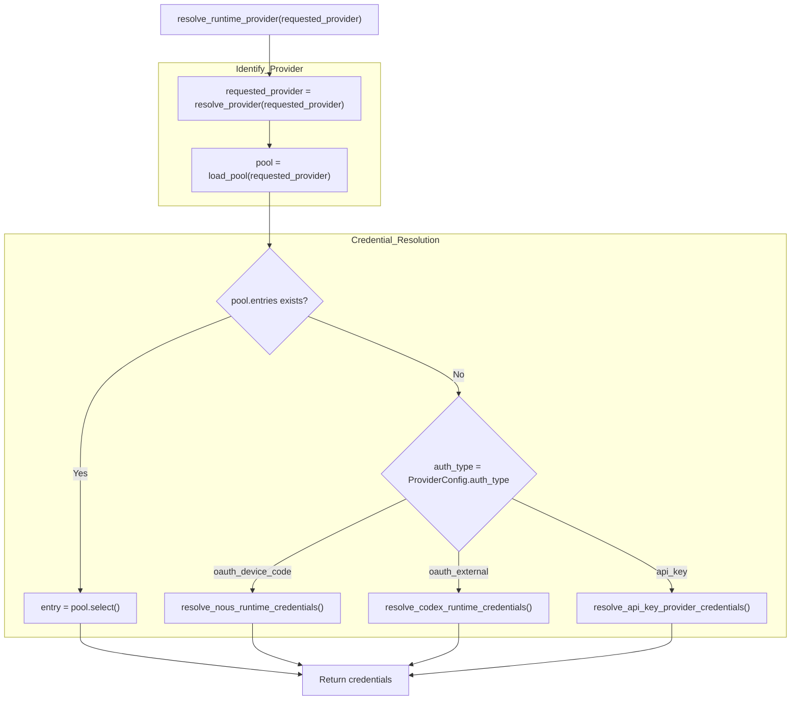
Sources: [hermes_cli/runtime_provider.py:237-331](), [agent/credential_pool.py:38-41](), [hermes_cli/auth.py:440-460]()

---

## Authentication Implementation Details

### OAuth Device Code Flow (Nous Portal)

Implemented in `_login_nous()`, this flow fetches a `user_code` and `verification_uri` from the portal. The CLI then polls the token endpoint until the user authorizes the device in their browser [hermes_cli/auth.py:750-845](). Once authorized, the CLI uses `resolve_nous_runtime_credentials()` to obtain short-lived inference keys or use the JWT directly [hermes_cli/auth.py:895-925]().

### OAuth External Flows

-   **OpenAI Codex**: `resolve_codex_runtime_credentials()` handles token retrieval and refresh for the `openai-codex` provider [hermes_cli/auth.py:1047-1064]().
-   **xAI Grok**: `resolve_xai_oauth_runtime_credentials()` provides access for SuperGrok subscribers [hermes_cli/auth.py:1082-1103]().
-   **Google Gemini**: `resolve_gemini_oauth_runtime_credentials()` supports Cloud Code Assist authentication [hermes_cli/auth.py:1104-1121]().

### API Key Providers

`resolve_api_key_provider_credentials()` scans `os.environ` (via profile-scoped `_getenv`) for keys defined in the `ProviderConfig.api_key_env_vars` list [hermes_cli/auth.py:613-644](). For Anthropic, it additionally checks for Claude Code credentials or OAuth setup-tokens [agent/anthropic_adapter.py:8-11]().

Sources: [hermes_cli/auth.py:613-1121](), [agent/anthropic_adapter.py:8-11]()

---

## Auto-Detection and Probing

Hermes Agent supports auto-detection of models and API modes, particularly for local servers.

### Local Model Auto-Detection

`_auto_detect_local_model()` queries the `/v1/models` endpoint of a local base URL (e.g., LM Studio or Ollama). If exactly one model is loaded, it is auto-selected [hermes_cli/runtime_provider.py:160-180]().

### API Mode Detection

The `_detect_api_mode_for_url()` function inspects the base URL to determine the correct transport protocol:
-   `api.openai.com` or `api.x.ai` → `codex_responses` [hermes_cli/runtime_provider.py:107-110]().
-   URLs ending in `/anthropic` → `anthropic_messages` [hermes_cli/runtime_provider.py:111-113]().

**Model Selection and Probing**

Sources: [hermes_cli/runtime_provider.py:91-117](), [hermes_cli/models.py:175-255]()

---

## Data Flow: Credential Storage and Persistence

| Location                         | Entity           | Purpose                                                                         |
| -------------------------------- | ---------------- | ------------------------------------------------------------------------------- |
| `~/.hermes/auth.json`            | `AuthStore`      | Persistent OAuth tokens and `credential_pool` state [hermes_cli/auth.py:6-10](). |
| `~/.hermes/.env`                 | Env Vars         | API keys for providers like OpenRouter and Anthropic [hermes_cli/config.py:6](). |
| `~/.hermes/config.yaml`          | `Config`         | User preferences and model overrides [hermes_cli/config.py:5]().                |

### Concurrency Safety

Access to `auth.json` is protected by file locking (`_auth_store_lock`) using `fcntl` on Unix or `msvcrt` on Windows to prevent data corruption during concurrent access [hermes_cli/auth.py:53-61]().

Sources: [hermes_cli/auth.py:6-71](), [agent/credential_pool.py:38-41](), [hermes_cli/config.py:5-6]()

---

<<< SECTION: 2.4 Model Selection and Management [2-4-model-selection-and-management] >>>

# Model Selection and Management

<details>
<summary>Relevant source files</summary>

The following files were used as context for generating this wiki page:

- [agent/auxiliary_client.py](agent/auxiliary_client.py)
- [agent/model_metadata.py](agent/model_metadata.py)
- [agent/models_dev.py](agent/models_dev.py)
- [agent/nous_rate_guard.py](agent/nous_rate_guard.py)
- [cli-config.yaml.example](cli-config.yaml.example)
- [cli.py](cli.py)
- [gateway/pairing.py](gateway/pairing.py)
- [gateway/run.py](gateway/run.py)
- [hermes_cli/auth.py](hermes_cli/auth.py)
- [hermes_cli/commands.py](hermes_cli/commands.py)
- [hermes_cli/config.py](hermes_cli/config.py)
- [hermes_cli/inventory.py](hermes_cli/inventory.py)
- [hermes_cli/main.py](hermes_cli/main.py)
- [hermes_cli/model_catalog.py](hermes_cli/model_catalog.py)
- [hermes_cli/model_switch.py](hermes_cli/model_switch.py)
- [hermes_cli/models.py](hermes_cli/models.py)
- [hermes_cli/pairing.py](hermes_cli/pairing.py)
- [hermes_cli/providers.py](hermes_cli/providers.py)
- [hermes_cli/runtime_provider.py](hermes_cli/runtime_provider.py)
- [hermes_cli/setup.py](hermes_cli/setup.py)
- [run_agent.py](run_agent.py)
- [scripts/build_model_catalog.py](scripts/build_model_catalog.py)
- [tests/agent/test_auxiliary_client.py](tests/agent/test_auxiliary_client.py)
- [tests/agent/test_model_metadata.py](tests/agent/test_model_metadata.py)
- [tests/agent/test_models_dev.py](tests/agent/test_models_dev.py)
- [tests/agent/test_nous_rate_guard.py](tests/agent/test_nous_rate_guard.py)
- [tests/gateway/test_pairing.py](tests/gateway/test_pairing.py)
- [tests/hermes_cli/test_api_key_providers.py](tests/hermes_cli/test_api_key_providers.py)
- [tests/hermes_cli/test_commands.py](tests/hermes_cli/test_commands.py)
- [tests/hermes_cli/test_inventory.py](tests/hermes_cli/test_inventory.py)
- [tests/hermes_cli/test_model_catalog.py](tests/hermes_cli/test_model_catalog.py)
- [tests/hermes_cli/test_model_switch_custom_providers.py](tests/hermes_cli/test_model_switch_custom_providers.py)
- [tests/hermes_cli/test_model_validation.py](tests/hermes_cli/test_model_validation.py)
- [tests/hermes_cli/test_models.py](tests/hermes_cli/test_models.py)
- [tests/hermes_cli/test_runtime_provider_resolution.py](tests/hermes_cli/test_runtime_provider_resolution.py)
- [tests/hermes_cli/test_tencent_tokenhub_provider.py](tests/hermes_cli/test_tencent_tokenhub_provider.py)
- [tests/hermes_cli/test_user_providers_model_switch.py](tests/hermes_cli/test_user_providers_model_switch.py)
- [website/docs/reference/model-catalog.md](website/docs/reference/model-catalog.md)
- [website/static/api/model-catalog.json](website/static/api/model-catalog.json)

</details>


This page covers the model selection and validation system, including the model catalog system, provider-specific normalization, and the dynamic context length discovery mechanism.

---

## Model Catalog System

Hermes maintains a multi-tier model discovery system that combines the `models.dev` community registry, live API discovery, and curated fallback snapshots.

### The models.dev Registry
The primary database for model metadata is `models.dev`. This registry tracks thousands of models across numerous providers [agent/models_dev.py:1-9]().
*   **Data Resolution**: Data is resolved via a bundled offline snapshot, a local disk cache (`~/.hermes/models_dev_cache.json`), and periodic network fetches from `https://models.dev/api.json` [agent/models_dev.py:11-15]().
*   **Metadata**: Each `ModelInfo` object contains critical fields for agent operations: `context_window`, `tool_call` capability, `reasoning` flags, and `cost_input`/`cost_output` for token budgeting [agent/models_dev.py:46-82]().

### Curated and Dynamic Catalogs
While `models.dev` provides the raw data, Hermes uses specialized logic to curate these lists for different providers:
*   **OpenRouter**: Models are fetched from `OPENROUTER_MODELS_URL` [agent/model_metadata.py:22]() and filtered. Free-tier models are identified for user selection [hermes_cli/model_catalog.py:75-83](). The `OPENROUTER_MODELS` list in `hermes_cli/models.py` serves as a static fallback when the live catalog is unavailable [hermes_cli/models.py:34-84]().
*   **xAI**: Models are curated via a disk cache or a static fallback list including `grok-4.3` [hermes_cli/models.py:112-118](). The `_xai_curated_models` function handles loading from disk cache and merging curated extras [hermes_cli/models.py:148-172]().
*   **Local Detection**: The system can automatically detect models on local servers (e.g., Ollama) by querying `/v1/models` [agent/model_metadata.py:111-113]().
*   **User-Defined Providers**: Users can define custom providers in `config.yaml` under the `providers:` or `custom_providers:` sections. These user-defined providers can specify `default_model` and a `models` list (either as a list of strings or a dictionary with model IDs as keys) [tests/hermes_cli/test_user_providers_model_switch.py:17-37](). The system ensures that these models are properly enumerated in the model picker, even if `models` is in dictionary format [tests/hermes_cli/test_user_providers_model_switch.py:90-110](). For OpenAI-compatible user-defined providers, Hermes will attempt to fetch live models from the `/v1/models` endpoint if available, overriding stale configured lists [tests/hermes_cli/test_user_providers_model_switch.py:134-150]().

**Model Resolution Hierarchy**

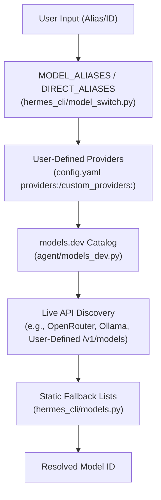
Sources: [hermes_cli/model_switch.py:123-172](), [agent/models_dev.py:11-19](), [agent/model_metadata.py:22](), [hermes_cli/model_catalog.py:34-83](), [tests/hermes_cli/test_user_providers_model_switch.py:17-37](), [tests/hermes_cli/test_user_providers_model_switch.py:90-110](), [tests/hermes_cli/test_user_providers_model_switch.py:134-150](), [hermes_cli/models.py:34-84](), [hermes_cli/models.py:112-118](), [hermes_cli/models.py:148-172]()

---

## Model Selection and Normalization

### Provider-Aware Normalization
LLM providers vary in their naming conventions. The `normalize_model_for_provider` function ensures the correct string reaches the API [hermes_cli/model_normalize.py:23-28]().

| Provider Type | Logic | Example |
| :--- | :--- | :--- |
| **Aggregators** | Requires `vendor/model` via `is_aggregator` check | `anthropic/claude-sonnet-4.6` |
| **Anthropic** | Dots to hyphens via `_dots_to_hyphens` | `claude-sonnet-4-6` |
| **Copilot/Codex** | Bare name, dots preserved | `claude-sonnet.4.6` |
| **Xiaomi** | Enforces lowercase via `_LOWERCASE_MODEL_PROVIDERS` | `mimo-v2.5-pro` |

Sources: [hermes_cli/model_normalize.py:38-116](), [hermes_cli/model_normalize.py:186-205](), [hermes_cli/providers.py:33-35]()

### The Model Switcher Pipeline
The `/model` command and CLI flags trigger a shared pipeline in `hermes_cli/model_switch.py`:
1.  **Alias Resolution**: Maps `sonnet` to `anthropic/claude-sonnet` using the `MODEL_ALIASES` map [hermes_cli/model_switch.py:123-172](). `DIRECT_ALIASES` allows for exact model+provider+base_url mappings, bypassing catalog resolution [hermes_cli/model_switch.py:183-194](). These direct aliases can be extended via the `model_aliases:` section in `config.yaml` [hermes_cli/model_switch.py:197-212]().
2.  **Provider Resolution**: Determines the target backend (e.g., OpenRouter vs. Native) via `resolve_provider_full` [hermes_cli/model_switch.py:34](). This includes resolving named custom providers defined in `custom_providers` [tests/hermes_cli/test_model_switch_custom_providers.py:48-66]().
3.  **Normalization**: Applies provider-specific naming rules via `normalize_model_for_provider` [hermes_cli/model_normalize.py:1-28]().
4.  **Agentic Check**: Validates if the model is "agentic". For instance, it warns if a user selects a Nous Research Hermes 3/4 model that lacks native tool-calling capabilities [hermes_cli/model_switch.py:71-102]().

**Model Switching Data Flow**

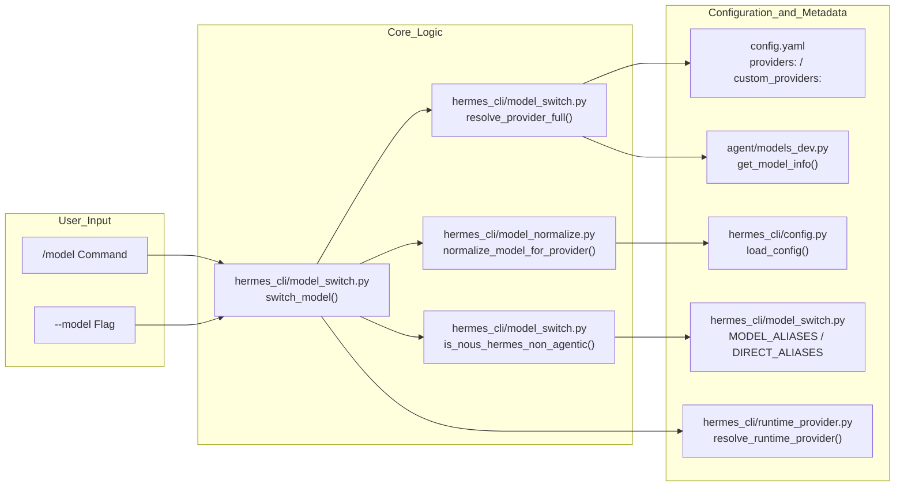
Sources: [hermes_cli/model_switch.py:1-19](), [hermes_cli/model_normalize.py:1-28](), [hermes_cli/providers.py:34-35](), [hermes_cli/model_switch.py:123-172](), [hermes_cli/model_switch.py:183-194](), [hermes_cli/model_switch.py:197-212](), [tests/hermes_cli/test_model_switch_custom_providers.py:48-66](), [hermes_cli/model_switch.py:71-102]()

---

## Context Length Discovery

Hermes dynamically discovers model context lengths to inform the `ContextCompressor` and prevent overflow errors.

### Discovery Tiers
The `get_model_context_length()` function in `agent/model_metadata.py` follows this priority:
1.  **models.dev**: Primary source for known model limits [agent/models_dev.py:68]().
2.  **Hardcoded Defaults**: Substring matching for major families (Claude: 200k-1M, GPT-5: 400k-1.05M, Gemini: 1M) in `DEFAULT_CONTEXT_LENGTHS` [agent/model_metadata.py:191-220](). This includes specific entries for models like Grok, ensuring correct context lengths even when models.dev or API metadata is unavailable [tests/agent/test_model_metadata.py:127-159]().
3.  **Probe Tiers**: If unknown, the system uses `CONTEXT_PROBE_TIERS` (256k, 128k, 64k, 32k, 16k, 8k) to step down until a request succeeds [agent/model_metadata.py:170-177]().

### Validation and Constraints
*   **Minimum Length**: Hermes enforces a `MINIMUM_CONTEXT_LENGTH` of 64,000 tokens. Models with smaller windows are rejected as they cannot support complex tool-calling trajectories [agent/model_metadata.py:185]().
*   **Error Parsing**: If a provider returns a context-related error, regex patterns are used to extract the actual limit from the error string [agent/model_metadata.py:440-480]().

Sources: [agent/model_metadata.py:170-220](), [agent/model_metadata.py:440-500](), [tests/agent/test_model_metadata.py:127-159](), [agent/model_metadata.py:185]()

---

## Auxiliary Model Management

Hermes utilizes an "Auxiliary" LLM client for non-core tasks such as vision analysis, context compression, and metadata extraction [agent/auxiliary_client.py:1-6]().

### Provider Resolution
The `resolve_provider_client` function determines which model to use for auxiliary tasks [agent/auxiliary_client.py:32-35]():
*   **Main Alias**: Resolves `main` to the user's primary model [agent/auxiliary_client.py:174-182]().
*   **Task-Specific Overrides**: Users can specify different providers for vision vs. compression in `config.yaml` via the `auxiliary` section [agent/auxiliary_client.py:32-34]().
*   **Fallback Chain**: If "auto" is selected, the system follows a priority chain: Main Provider -> OpenRouter -> Nous Portal -> Custom Endpoint -> Native Anthropic -> Direct API Keys [agent/auxiliary_client.py:7-16]().

Sources: [agent/auxiliary_client.py:1-162](), [agent/auxiliary_client.py:174-182]()

---

<<< SECTION: 3 CLI [3-cli] >>>

# CLI

<details>
<summary>Relevant source files</summary>

The following files were used as context for generating this wiki page:

- [agent/auxiliary_client.py](agent/auxiliary_client.py)
- [agent/model_metadata.py](agent/model_metadata.py)
- [agent/models_dev.py](agent/models_dev.py)
- [cli-config.yaml.example](cli-config.yaml.example)
- [cli.py](cli.py)
- [gateway/run.py](gateway/run.py)
- [hermes_cli/auth.py](hermes_cli/auth.py)
- [hermes_cli/commands.py](hermes_cli/commands.py)
- [hermes_cli/config.py](hermes_cli/config.py)
- [hermes_cli/main.py](hermes_cli/main.py)
- [hermes_cli/models.py](hermes_cli/models.py)
- [hermes_cli/runtime_provider.py](hermes_cli/runtime_provider.py)
- [hermes_cli/setup.py](hermes_cli/setup.py)
- [optional-skills/blockchain/evm/SKILL.md](optional-skills/blockchain/evm/SKILL.md)
- [optional-skills/blockchain/evm/scripts/evm_client.py](optional-skills/blockchain/evm/scripts/evm_client.py)
- [optional-skills/devops/pinggy-tunnel/SKILL.md](optional-skills/devops/pinggy-tunnel/SKILL.md)
- [run_agent.py](run_agent.py)
- [tests/agent/test_auxiliary_client.py](tests/agent/test_auxiliary_client.py)
- [tests/agent/test_model_metadata.py](tests/agent/test_model_metadata.py)
- [tests/agent/test_models_dev.py](tests/agent/test_models_dev.py)
- [tests/hermes_cli/test_api_key_providers.py](tests/hermes_cli/test_api_key_providers.py)
- [tests/hermes_cli/test_commands.py](tests/hermes_cli/test_commands.py)
- [tests/hermes_cli/test_model_validation.py](tests/hermes_cli/test_model_validation.py)
- [tests/hermes_cli/test_runtime_provider_resolution.py](tests/hermes_cli/test_runtime_provider_resolution.py)
- [website/docs/getting-started/quickstart.md](website/docs/getting-started/quickstart.md)
- [website/docs/integrations/providers.md](website/docs/integrations/providers.md)
- [website/docs/reference/cli-commands.md](website/docs/reference/cli-commands.md)
- [website/docs/reference/environment-variables.md](website/docs/reference/environment-variables.md)
- [website/docs/reference/optional-skills-catalog.md](website/docs/reference/optional-skills-catalog.md)
- [website/docs/reference/skills-catalog.md](website/docs/reference/skills-catalog.md)
- [website/docs/reference/slash-commands.md](website/docs/reference/slash-commands.md)
- [website/docs/user-guide/cli.md](website/docs/user-guide/cli.md)
- [website/docs/user-guide/configuration.md](website/docs/user-guide/configuration.md)
- [website/docs/user-guide/features/fallback-providers.md](website/docs/user-guide/features/fallback-providers.md)
- [website/docs/user-guide/messaging/index.md](website/docs/user-guide/messaging/index.md)
- [website/docs/user-guide/sessions.md](website/docs/user-guide/sessions.md)
- [website/docs/user-guide/skills/optional/blockchain/blockchain-evm.md](website/docs/user-guide/skills/optional/blockchain/blockchain-evm.md)
- [website/docs/user-guide/skills/optional/devops/devops-pinggy-tunnel.md](website/docs/user-guide/skills/optional/devops/devops-pinggy-tunnel.md)
- [website/sidebars.ts](website/sidebars.ts)

</details>


This page provides a high-level overview of the Hermes Agent command-line interface (CLI). It covers the main entry point, operating modes, configuration hierarchy, subcommand groups, and the key components bridging user interaction with the core AI agent orchestration and multi-provider runtime resolution. Detailed technical information and usage instructions for each subtopic are provided in dedicated child pages linked below.

## Entry Point

The primary CLI entry point for Hermes Agent is the `hermes` executable, which corresponds to the `hermes_cli/main.py` module. Its `main()` function builds a hierarchical command parser and dispatches subcommands to handler functions [hermes_cli/main.py:1-44]().

Before argument parsing, a specialized profile override system processes the `--profile` or `-p` flags to correctly set the `HERMES_HOME` environment variable for configuration isolation [hermes_cli/main.py:145-158](). To ensure a smooth user experience, the CLI also sets the process title to "hermes" for system monitoring tools [hermes_cli/main.py:68-106]().

**Dispatcher Architecture**

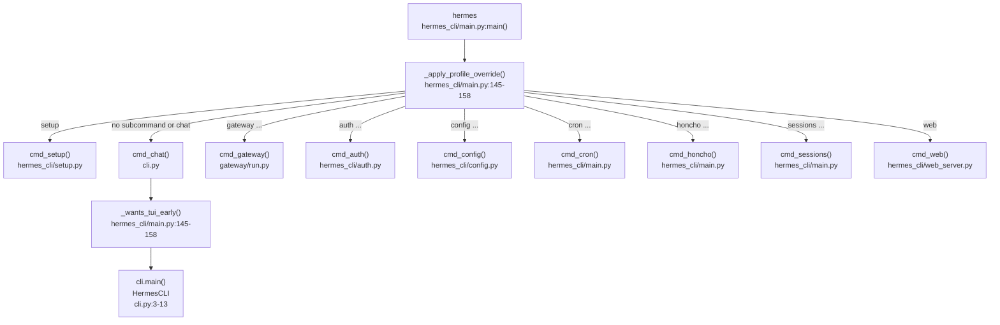

Sources: [hermes_cli/main.py:1-44](), [hermes_cli/main.py:68-106](), [hermes_cli/main.py:145-158](), [gateway/run.py:1-14](), [cli.py:1-13]()

---

## Operating Modes

The Hermes CLI supports three primary frontend modes under the `chat` subcommand (also the default when running just `hermes`) [cli.py:1-13]():

| Mode | Invocation | Description |
|---|---|---|
| **Interactive CLI** | `hermes` or `hermes chat` | Launches the `HermesCLI` class using `prompt_toolkit`. Features include a fixed input area, multiline input support, syntax highlighting, and persistent session history [cli.py:58-71](). |
| **Interactive TUI** | `hermes --tui` | Launches a React Ink-based Terminal User Interface (TUI) frontend offering enhanced mouse support, JSON-RPC gateway integration, and visual task monitoring [hermes_cli/main.py:145-158](). For details, see [TUI (Terminal User Interface)](#3.3). |
| **Single-query** | `hermes chat -q "your query"` | Sends a single query directly to `AIAgent.run_conversation()`, streams the raw response to stdout, then exits immediately [run_agent.py:17-21](). |

Internally, the `HermesCLI` class in `cli.py` wraps the `AIAgent` class defined in `run_agent.py` to orchestrate conversations and perform tool calls [run_agent.py:17-21](). For robustness, Hermes uses specialized loaders to ensure UTF-8 stdio setup on Windows via `hermes_bootstrap` [hermes_cli/main.py:59-62]().

**Interaction Flow**

```mermaid
flowchart LR
    USER_IN["User Input"]
    CLI_OBJ["HermesCLI\ncli.py"]
    AGENT["AIAgent\nrun_agent.py"]
    RUNTIME["runtime_provider.py\nresolve_runtime_provider()"]
    POOL["CredentialPool\nagent/credential_pool.py"]
    TOOLS["model_tools.py\nTool Management"]

    USER_IN --> CLI_OBJ
    CLI_OBJ -->|run_conversation()| AGENT
    AGENT --> RUNTIME
    RUNTIME --> POOL
    AGENT --> TOOLS
```

Sources: [cli.py:1-13](), [run_agent.py:1-21](), [hermes_cli/main.py:59-62](), [hermes_cli/main.py:145-158]()

---

## Configuration Hierarchy

Hermes CLI configuration is layered to enable flexible environment and user overrides [hermes_cli/config.py:1-13]():

1.  **Command-line arguments:** Highest precedence for overrides per invocation.
2.  **User configuration file:** `~/.hermes/config.yaml`, storing all non-secret settings [hermes_cli/config.py:5]().
3.  **Environment file:** `~/.hermes/.env`, for secrets including API keys and tokens [hermes_cli/config.py:6]().
4.  **Built-in defaults:** Hardcoded fallback values defined in `DEFAULT_CONFIG` [hermes_cli/config.py:132-144]().

The `hermes setup` wizard guides users interactively through configuring AI providers, models, terminal backends, and messaging platforms [hermes_cli/setup.py:4-10](). The configuration system supports environment variable substitution with `${VAR_NAME}` style references inside `config.yaml` [cli-config.yaml.example:45-46](). To prevent security escalations, the dashboard's env writer denylists sensitive variables like `LD_PRELOAD` and `PYTHONPATH` [hermes_cli/config.py:143-167](). For more details, see [Configuration and Setup](#2.2).

Sources: [hermes_cli/config.py:1-13](), [hermes_cli/config.py:143-167](), [hermes_cli/setup.py:4-10](), [cli-config.yaml.example:45-46]()

---

## Subcommand Groups

The CLI commands are organized into functional groups [hermes_cli/main.py:1-44]():

| Subcommand | Handler | Purpose |
|---|---|---|
| `chat` | `cmd_chat` | Interactive chat REPL or single-query requests [cli.py:1-13]() |
| `setup` | `cmd_setup` | Interactive setup wizard for initial configuration [hermes_cli/setup.py:1-12]() |
| `config` | `cmd_config` | Inspect and modify configuration files [hermes_cli/config.py:1-13]() |
| `auth` | `cmd_auth` | Manage authentication providers and OAuth flows [hermes_cli/auth.py:1-17]() |
| `gateway` | `cmd_gateway` | Run messaging platform gateway adapters [gateway/run.py:1-14]() |
| `web` | `cmd_web` | Launch the React-backed Web UI Dashboard [hermes_cli/main.py:41](). For details, see [Web UI Dashboard](#3.4). |
| `honcho` | `cmd_honcho` | Configure Honcho AI memory and peer settings [hermes_cli/main.py:21-36]() |
| `sessions` | `cmd_sessions` | Browse and manage previous sessions [hermes_cli/main.py:41-42]() |
| `cron` | `cmd_cron` | Manage scheduled tasks [hermes_cli/main.py:17-19]() |
| `doctor` | `cmd_doctor` | Diagnose configuration and environment issues [hermes_cli/main.py:20]() |
| `update` | `cmd_update` | Update Hermes Agent to the latest version [hermes_cli/main.py:38]() |
| `uninstall` | `cmd_uninstall` | Uninstall Hermes Agent [hermes_cli/main.py:39]() |
| `version` | `cmd_version` | Display the current version [hermes_cli/main.py:37]() |

### Slash Commands in Interactive Chat

Within the interactive chat mode, a rich set of slash commands (e.g., `/new`, `/model`, `/status`) is implemented centrally in a `COMMAND_REGISTRY` [hermes_cli/commands.py:64-140](). This registry serves as the authoritative source for CLI autocomplete and gateway command dispatch [hermes_cli/commands.py:1-9]().

For detailed documentation of slash commands, see [Interactive Chat](#3.1). A comprehensive list of all commands and their usage is available in the [Command Reference](#3.2).

Sources: [hermes_cli/main.py:1-44](), [hermes_cli/commands.py:1-9](), [hermes_cli/commands.py:64-140](), [hermes_cli/auth.py:1-17]()

---

## Module Layout and Integration

The CLI system bridges user interaction with the kernel of agent orchestration and multi-provider runtime resolution.

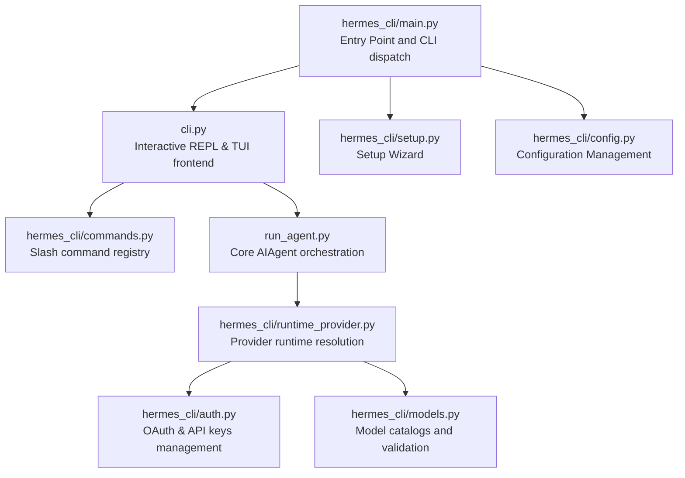

Sources: [hermes_cli/main.py:1-44](), [hermes_cli/commands.py:1-9](), [run_agent.py:1-21](), [hermes_cli/auth.py:1-17](), [hermes_cli/models.py:1-6](), [hermes_cli/setup.py:1-12](), [hermes_cli/config.py:1-13]()

---

## Child Pages

For detailed explanations, please refer to:

-   [Interactive Chat](#3.1) — Covers the interactive REPL mode, slash commands, and session management.
-   [Command Reference](#3.2) — Comprehensive reference for all Hermes subcommands.
-   [TUI (Terminal User Interface)](#3.3) — Documents the React Ink-based TUI frontend (`--tui` flag).
-   [Web UI Dashboard](#3.4) — Details the `hermes web` command and the FastAPI backend dashboard.

---

<<< SECTION: 3.1 Interactive Chat [3-1-interactive-chat] >>>

# Interactive Chat

<details>
<summary>Relevant source files</summary>

The following files were used as context for generating this wiki page:

- [agent/auxiliary_client.py](agent/auxiliary_client.py)
- [agent/model_metadata.py](agent/model_metadata.py)
- [agent/models_dev.py](agent/models_dev.py)
- [agent/turn_context.py](agent/turn_context.py)
- [cli-config.yaml.example](cli-config.yaml.example)
- [cli.py](cli.py)
- [gateway/run.py](gateway/run.py)
- [gateway/slash_commands.py](gateway/slash_commands.py)
- [hermes_cli/auth.py](hermes_cli/auth.py)
- [hermes_cli/cli_commands_mixin.py](hermes_cli/cli_commands_mixin.py)
- [hermes_cli/commands.py](hermes_cli/commands.py)
- [hermes_cli/config.py](hermes_cli/config.py)
- [hermes_cli/main.py](hermes_cli/main.py)
- [hermes_cli/models.py](hermes_cli/models.py)
- [hermes_cli/runtime_provider.py](hermes_cli/runtime_provider.py)
- [hermes_cli/setup.py](hermes_cli/setup.py)
- [hermes_cli/write_approval_commands.py](hermes_cli/write_approval_commands.py)
- [optional-skills/blockchain/evm/SKILL.md](optional-skills/blockchain/evm/SKILL.md)
- [optional-skills/blockchain/evm/scripts/evm_client.py](optional-skills/blockchain/evm/scripts/evm_client.py)
- [optional-skills/devops/pinggy-tunnel/SKILL.md](optional-skills/devops/pinggy-tunnel/SKILL.md)
- [run_agent.py](run_agent.py)
- [tests/agent/test_auxiliary_client.py](tests/agent/test_auxiliary_client.py)
- [tests/agent/test_compression_progress.py](tests/agent/test_compression_progress.py)
- [tests/agent/test_model_metadata.py](tests/agent/test_model_metadata.py)
- [tests/agent/test_models_dev.py](tests/agent/test_models_dev.py)
- [tests/agent/test_turn_context.py](tests/agent/test_turn_context.py)
- [tests/gateway/test_usage_command.py](tests/gateway/test_usage_command.py)
- [tests/hermes_cli/test_api_key_providers.py](tests/hermes_cli/test_api_key_providers.py)
- [tests/hermes_cli/test_commands.py](tests/hermes_cli/test_commands.py)
- [tests/hermes_cli/test_model_validation.py](tests/hermes_cli/test_model_validation.py)
- [tests/hermes_cli/test_runtime_provider_resolution.py](tests/hermes_cli/test_runtime_provider_resolution.py)
- [tests/tools/test_memory_tool.py](tests/tools/test_memory_tool.py)
- [tests/tools/test_memory_tool_schema.py](tests/tools/test_memory_tool_schema.py)
- [tests/tools/test_write_approval.py](tests/tools/test_write_approval.py)
- [tools/memory_tool.py](tools/memory_tool.py)
- [tools/write_approval.py](tools/write_approval.py)
- [website/docs/getting-started/quickstart.md](website/docs/getting-started/quickstart.md)
- [website/docs/integrations/providers.md](website/docs/integrations/providers.md)
- [website/docs/reference/cli-commands.md](website/docs/reference/cli-commands.md)
- [website/docs/reference/environment-variables.md](website/docs/reference/environment-variables.md)
- [website/docs/reference/optional-skills-catalog.md](website/docs/reference/optional-skills-catalog.md)
- [website/docs/reference/skills-catalog.md](website/docs/reference/skills-catalog.md)
- [website/docs/reference/slash-commands.md](website/docs/reference/slash-commands.md)
- [website/docs/user-guide/cli.md](website/docs/user-guide/cli.md)
- [website/docs/user-guide/configuration.md](website/docs/user-guide/configuration.md)
- [website/docs/user-guide/features/fallback-providers.md](website/docs/user-guide/features/fallback-providers.md)
- [website/docs/user-guide/features/memory.md](website/docs/user-guide/features/memory.md)
- [website/docs/user-guide/messaging/index.md](website/docs/user-guide/messaging/index.md)
- [website/docs/user-guide/sessions.md](website/docs/user-guide/sessions.md)
- [website/docs/user-guide/skills/optional/blockchain/blockchain-evm.md](website/docs/user-guide/skills/optional/blockchain/blockchain-evm.md)
- [website/docs/user-guide/skills/optional/devops/devops-pinggy-tunnel.md](website/docs/user-guide/skills/optional/devops/devops-pinggy-tunnel.md)
- [website/sidebars.ts](website/sidebars.ts)

</details>


This page documents the interactive terminal chat experience provided by the Hermes Agent CLI. It covers the REPL architecture, `prompt_toolkit` integration, slash commands, and session management.

---

## Component Architecture

The interactive chat is managed primarily by the `HermesCLI` class in `cli.py`. It orchestrates the lifecycle of a conversation by bridging user input to the `AIAgent` core [cli.py:1-13]().

1.  **TUI layer** — Uses `prompt_toolkit` to manage a fixed input widget (`TextArea`) at the bottom of the terminal with scrolling output above [cli.py:58-69]().
2.  **Branding/display layer** — `hermes_cli/banner.py` renders the ASCII logo and version labels [hermes_cli/banner.py:163-164]().
3.  **Command layer** — `hermes_cli/commands.py` provides a central `COMMAND_REGISTRY` for slash commands and tab-completion [hermes_cli/commands.py:64-111]().
4.  **Agent layer** — `AIAgent` (from `run_agent.py`) handles the conversation loop, tool execution, and response management [run_agent.py:17-21]().

**Diagram 1: Interactive Chat Component Map**

```mermaid
flowchart TD
    subgraph "CLI_Process [cli.py]"
        HermesCLI["HermesCLI Class"]
        load_hermes_dotenv["load_hermes_dotenv()"]
        _strip_reasoning_tags["_strip_reasoning_tags()"]
    end

    subgraph "Command_System [hermes_cli/commands.py]"
        COMMAND_REGISTRY["COMMAND_REGISTRY List"]
        CommandDef["CommandDef Dataclass"]
        resolve_command["resolve_command()"]
    end

    subgraph "UI_Engine [prompt_toolkit]"
        TextArea["TextArea (Input Widget)"]
        FileHistory["FileHistory (~/.hermes_history)"]
        patch_stdout["patch_stdout() Context"]
    end

    subgraph "Agent_Core [run_agent.py]"
        AIAgent["AIAgent Class"]
        run_conversation["run_conversation() Method"]
    end

    subgraph "Display_Logic [agent/display.py]"
        KawaiiSpinner["KawaiiSpinner Class"]
        build_tool_preview["_build_tool_preview()"]
        _get_tool_emoji["_get_tool_emoji()"]
    end

    HermesCLI --> load_hermes_dotenv
    HermesCLI --> TextArea
    HermesCLI --> AIAgent
    HermesCLI --> resolve_command
    AIAgent --> run_conversation
    run_conversation --> KawaiiSpinner
    run_conversation --> _get_tool_emoji
```

Sources: [cli.py:58-69](), [cli.py:194-207](), [hermes_cli/commands.py:64-111](), [run_agent.py:17-21](), [hermes_cli/banner.py:163-164]()

---

## REPL Flow and Input Handling

The CLI uses an asynchronous REPL loop. `patch_stdout()` is used to ensure that background updates (like the agent's spinner or tool progress) do not corrupt the user's input line [cli.py:61-61](). The system supports multi-line input via `Shift+Enter` or `Ctrl+Enter` aliases [cli.py:79-87]().

**Diagram 2: Input-to-Agent Execution Flow**

```mermaid
sequenceDiagram
    participant U as User
    participant CLI as HermesCLI [cli.py]
    participant CMD as Commands [hermes_cli/commands.py]
    participant AG as AIAgent [run_agent.py]
    participant SP as KawaiiSpinner [agent/display.py]

    U->>CLI: "Enters text + Enter"
    alt "Starts with /"
        CLI->>CMD: "resolve_command(text)"
        CMD-->>CLI: "CommandDef"
        CLI->>CLI: "process_command()"
    else "Natural Language"
        CLI->>SP: "start()"
        CLI->>AG: "run_conversation(prompt)"
        loop "Tool Loop"
            AG->>AG: "handle_function_call()"
            AG->>SP: "update(tool_status)"
        end
        AG-->>CLI: "Final Response"
        CLI->>SP: "stop()"
        CLI->>CLI: "_strip_reasoning_tags()"
        CLI->>U: "Display Markdown Response"
    end
```

Sources: [cli.py:61-61](), [cli.py:79-87](), [cli.py:194-207](), [hermes_cli/commands.py:46-61](), [run_agent.py:122-128](), [run_agent.py:168-177]()

---

## Slash Commands

Commands are defined in `hermes_cli/commands.py` and categorized for the help system. The `COMMAND_REGISTRY` is the single source of truth for the CLI, gateway, and autocomplete [hermes_cli/commands.py:64-111]().

### Session & Control Commands
| Command | Alias | Description |
| :--- | :--- | :--- |
| `/new` | `/reset` | Start a new session (fresh ID + history) [hermes_cli/commands.py:68-69]() |
| `/retry` | - | Retry the last message (resend to agent) [hermes_cli/commands.py:80-80]() |
| `/undo` | - | Back up N user turns and re-prompt (default 1) [hermes_cli/commands.py:81-82]() |
| `/rollback` | - | List or restore filesystem checkpoints [hermes_cli/commands.py:91-92]() |
| `/background`| `/bg` | Run a prompt in the background [hermes_cli/commands.py:100-101]() |
| `/goal` | - | Set a standing goal Hermes works on across turns until achieved [hermes_cli/commands.py:108-109]() |
| `/branch` | `/fork` | Branch the current session (explore a different path) [hermes_cli/commands.py:90-90]() |
| `/compress` | - | Compress conversation context (add 'here [N]' to keep recent N turns) [hermes_cli/commands.py:91-92]() |
| `/sessions` | - | Browse and resume previous sessions [hermes_cli/commands.py:126-126]() |
| `/resume` | - | Resume a previously-named session [hermes_cli/commands.py:123-123]() |
| `/title` | - | Set a title for the current session [hermes_cli/commands.py:83-84]() |
| `/stop` | - | Kill all running background processes [hermes_cli/commands.py:97-97]() |
| `/agents` | `/tasks` | Show active agents and running tasks [hermes_cli/commands.py:104-105]() |
| `/queue` | `/q` | Queue a prompt for the next turn (doesn't interrupt) [hermes_cli/commands.py:106-107]() |
| `/steer` | - | Inject a message after the next tool call without interrupting [hermes_cli/commands.py:108-109]() |
| `/moa` | - | Run one prompt through the default Mixture of Agents preset, then restore your model [hermes_cli/commands.py:111-112]() |
| `/subgoal` | - | Add or manage extra criteria on the active goal [hermes_cli/commands.py:113-114]() |
| `/status` | - | Show session, model, token, and context info [hermes_cli/commands.py:115-115]() |
| `/whoami` | - | Show your slash command access (admin / user) [hermes_cli/commands.py:116-116]() |
| `/profile` | - | Show active profile name and home directory [hermes_cli/commands.py:117-117]() |
| `/handoff` | - | Hand off this session to a messaging platform (Telegram, Discord, etc.) [hermes_cli/commands.py:88-89]() |
| `/snapshot` | `/snap` | Create or restore state snapshots of Hermes config/state [hermes_cli/commands.py:93-94]() |
| `/clear` | - | Clear screen and start a new session [hermes_cli/commands.py:72-73]() |
| `/redraw` | - | Force a full UI repaint (recovers from terminal drift) [hermes_cli/commands.py:74-75]() |
| `/history` | - | Show conversation history [hermes_cli/commands.py:76-77]() |
| `/save` | - | Save the current conversation [hermes_cli/commands.py:78-79]() |
| `/prompt` | `/compose` | Compose your next prompt in $EDITOR (markdown), then send it [hermes_cli/commands.py:81-82]() |

### Configuration & UI Commands
| Command | Alias | Description |
| :--- | :--- | :--- |
| `/personality`| - | Set a predefined personality [hermes_cli/commands.py:134-135]() |
| `/model` | - | Switch model (persists by default) [hermes_cli/commands.py:131-132]() |
| `/config` | - | Show current configuration [hermes_cli/commands.py:128-129]() |
| `/verbose` | - | Cycle tool progress display [hermes_cli/commands.py:138-140]()
| `/codex-runtime` | `/codex_runtime` | Toggle codex app-server runtime for OpenAI/Codex models [hermes_cli/commands.py:133-134]() |
| `/statusba` | - | Toggle status bar visibility [hermes_cli/commands.py:136-137]() |
| `/theme` | - | Set the color theme [hermes_cli/commands.py:141-142]() |
| `/log` | - | Show agent logs [hermes_cli/commands.py:143-144]() |
| `/limits` | - | Show token usage and rate limits [hermes_cli/commands.py:145-146]() |
| `/tools` | - | List available tools and their status [hermes_cli/commands.py:147-148]() |
| `/skills` | - | Manage skills (install, remove, list) [hermes_cli/commands.py:149-150]() |
| `/env` | - | Show or set environment variables [hermes_cli/commands.py:151-152]() |
| `/setup` | - | Run the interactive setup wizard [hermes_cli/commands.py:153-154]() |
| `/auth` | - | Manage authentication credentials [hermes_cli/commands.py:155-156]() |
| `/honcho` | - | Manage Honcho AI memory integration [hermes_cli/commands.py:157-158]() |
| `/gateway` | - | Manage the Hermes Gateway service [hermes_cli/commands.py:159-160]() |
| `/cron` | - | Manage scheduled tasks [hermes_cli/commands.py:161-162]() |
| `/doctor` | - | Check configuration and dependencies [hermes_cli/commands.py:163-164]() |
| `/update` | - | Update Hermes Agent to the latest version [hermes_cli/commands.py:165-166]() |
| `/uninstall` | - | Uninstall Hermes Agent [hermes_cli/commands.py:167-168]() |
| `/version` | - | Show Hermes Agent version [hermes_cli/commands.py:169-170]() |
| `/help` | - | Show this help message [hermes_cli/commands.py:171-172]() |

Sources: [hermes_cli/commands.py:64-172]()

---

## Session Management and Persistence

Interactive mode ensures continuity through several mechanisms:

1.  **Trajectory Logging:** Every conversation turn is saved as a trajectory via `TrajectoryLogger` for later inspection or training [run_agent.py:170-173]().
2.  **History:** Input history is persisted in `~/.hermes_history` via `prompt_toolkit.history.FileHistory` [cli.py:59-59]().
3.  **Environment Loading:** The CLI loads `.env` from `~/.hermes/.env` first, then project root as a fallback via `load_hermes_dotenv` [cli.py:180-182]().
4.  **Context Compression:** `ContextCompressor` monitors context window usage and triggers summarization based on thresholds [run_agent.py:144-144]().
5.  **Session Database:** `hermes_state.py` provides persistent session storage using SQLite with FTS5 for full-text search. This replaces older JSONL file approaches and stores session metadata, full message history, and model configuration [hermes_state.py:1-15](). Sessions can be tagged with a source (`cli`, `telegram`, `discord`, etc.) for filtering [hermes_state.py:14-15](). The database supports WAL mode for concurrent readers and handles fallbacks for incompatible filesystems [hermes_state.py:127-140]().
    *   **Session IDs:** Each session has a unique ID.
    *   **Parent Sessions:** Sessions can be linked via `parent_session_id` to represent branching conversations or compression continuations [hermes_state.py:10-11]().
    *   **Branching:** The `/branch` command creates a new session linked to the current one, allowing exploration of different paths [hermes_cli/commands.py:90-90]().
    *   **Delegated Children:** Subagent runs are marked with `_delegate_from` in their `model_config` and are cascade-deleted with their parents [hermes_state.py:75-103]().

### Runtime Provider and Model Resolution
When a session starts or a model is switched, the system resolves credentials and configuration. This checks:
1.  **Config Precedence:** CLI arguments → `config.yaml` → `.env` → defaults. The `hermes_cli/config` module handles this hierarchy [hermes_cli/config.py:1-13]().
2.  **API Keys:** Secrets are specifically routed to `.env` while settings go to `config.yaml` [hermes_cli/config.py:5-6]().
3.  **Timeouts:** Provider-specific and model-specific timeouts (e.g., `request_timeout_seconds`) are applied at runtime using `get_provider_request_timeout` and `get_provider_stale_timeout` [run_agent.py:120-123]().
4.  **Model Selection:** The `hermes_cli/models.py` catalog provides fallback model lists (e.g., `OPENROUTER_MODELS`, `_XAI_STATIC_FALLBACK`) if live endpoints are unreachable [hermes_cli/models.py:35-84](), [hermes_cli/models.py:112-118](). The `hermes_cli/setup.py` module also defines `_DEFAULT_PROVIDER_MODELS` as a fallback for the setup wizard [hermes_cli/setup.py:73-111]().
5.  **Auxiliary Tasks:** Side tasks like vision or compression are routed via `agent/auxiliary_client.py`, which follows a specific resolution chain to find the best available backend without duplicating fallback logic [agent/auxiliary_client.py:7-41](). The `aux_interrupt_protection` context manager ensures that critical auxiliary tasks like context compression are not prematurely aborted by user interrupts [agent/auxiliary_client.py:148-162]().

**Diagram 3: Provider Resolution Hierarchy**

```mermaid
flowchart TD
    subgraph "Configuration_Source [hermes_cli/config.py]"
        YAML["config.yaml (Settings)"]
        ENV[".env (Secrets)"]
        CLI_ARGS["CLI Flags (--model, --provider)"]
    end

    subgraph "Resolution_Logic [hermes_cli/runtime_provider.py]"
        resolve_provider["resolve_provider()"]
        resolve_api_key["resolve_api_key_provider_credentials()"]
        detect_api_mode["_detect_api_mode_for_url()"]
    end

    subgraph "Credential_Storage [hermes_cli/auth.py]"
        AUTH_JSON["auth.json (OAuth Tokens)"]
        PROVIDER_REGISTRY["PROVIDER_REGISTRY"]
    end

    subgraph "Model_Catalog [hermes_cli/models.py]"
        OPENROUTER_MODELS["OPENROUTER_MODELS"]
        XAI_STATIC_FALLBACK["_XAI_STATIC_FALLBACK"]
        _PROVIDER_MODELS["_PROVIDER_MODELS"]
    end

    CLI_ARGS --> resolve_provider
    YAML --> resolve_provider
    ENV --> resolve_api_key
    AUTH_JSON --> resolve_provider
    resolve_provider --> detect_api_mode
    resolve_provider --> OPENROUTER_MODELS
    resolve_provider --> XAI_STATIC_FALLBACK
    resolve_provider --> _PROVIDER_MODELS
```

Sources: [cli.py:59-59](), [cli.py:180-182](), [run_agent.py:120-123](), [run_agent.py:144-144](), [hermes_cli/config.py:1-13](), [hermes_cli/models.py:35-84](), [hermes_cli/models.py:112-118](), [hermes_cli/setup.py:73-111](), [agent/auxiliary_client.py:7-41](), [agent/auxiliary_client.py:148-162](), [hermes_cli/runtime_provider.py:1-37](), [hermes_cli/auth.py:1-17](), [hermes_state.py:1-15](), [hermes_state.py:10-11](), [hermes_state.py:14-15](), [hermes_state.py:75-103](), [hermes_state.py:127-140](), [hermes_cli/commands.py:90-90]()

---

<<< SECTION: 3.2 Command Reference [3-2-command-reference] >>>

# Command Reference

<details>
<summary>Relevant source files</summary>

The following files were used as context for generating this wiki page:

- [agent/auxiliary_client.py](agent/auxiliary_client.py)
- [agent/model_metadata.py](agent/model_metadata.py)
- [agent/models_dev.py](agent/models_dev.py)
- [cli-config.yaml.example](cli-config.yaml.example)
- [cli.py](cli.py)
- [gateway/run.py](gateway/run.py)
- [gateway/status.py](gateway/status.py)
- [hermes_cli/auth.py](hermes_cli/auth.py)
- [hermes_cli/commands.py](hermes_cli/commands.py)
- [hermes_cli/config.py](hermes_cli/config.py)
- [hermes_cli/gateway.py](hermes_cli/gateway.py)
- [hermes_cli/main.py](hermes_cli/main.py)
- [hermes_cli/models.py](hermes_cli/models.py)
- [hermes_cli/profiles.py](hermes_cli/profiles.py)
- [hermes_cli/runtime_provider.py](hermes_cli/runtime_provider.py)
- [hermes_cli/setup.py](hermes_cli/setup.py)
- [hermes_cli/status.py](hermes_cli/status.py)
- [optional-skills/blockchain/evm/SKILL.md](optional-skills/blockchain/evm/SKILL.md)
- [optional-skills/blockchain/evm/scripts/evm_client.py](optional-skills/blockchain/evm/scripts/evm_client.py)
- [optional-skills/devops/pinggy-tunnel/SKILL.md](optional-skills/devops/pinggy-tunnel/SKILL.md)
- [run_agent.py](run_agent.py)
- [tests/agent/test_auxiliary_client.py](tests/agent/test_auxiliary_client.py)
- [tests/agent/test_model_metadata.py](tests/agent/test_model_metadata.py)
- [tests/agent/test_models_dev.py](tests/agent/test_models_dev.py)
- [tests/gateway/test_discord_document_handling.py](tests/gateway/test_discord_document_handling.py)
- [tests/gateway/test_discord_send.py](tests/gateway/test_discord_send.py)
- [tests/gateway/test_document_cache.py](tests/gateway/test_document_cache.py)
- [tests/gateway/test_platform_reconnect.py](tests/gateway/test_platform_reconnect.py)
- [tests/gateway/test_runner_fatal_adapter.py](tests/gateway/test_runner_fatal_adapter.py)
- [tests/gateway/test_runner_startup_failures.py](tests/gateway/test_runner_startup_failures.py)
- [tests/gateway/test_send_image_file.py](tests/gateway/test_send_image_file.py)
- [tests/gateway/test_status.py](tests/gateway/test_status.py)
- [tests/gateway/test_telegram_conflict.py](tests/gateway/test_telegram_conflict.py)
- [tests/gateway/test_telegram_documents.py](tests/gateway/test_telegram_documents.py)
- [tests/hermes_cli/test_api_key_providers.py](tests/hermes_cli/test_api_key_providers.py)
- [tests/hermes_cli/test_commands.py](tests/hermes_cli/test_commands.py)
- [tests/hermes_cli/test_gateway.py](tests/hermes_cli/test_gateway.py)
- [tests/hermes_cli/test_gateway_linger.py](tests/hermes_cli/test_gateway_linger.py)
- [tests/hermes_cli/test_gateway_service.py](tests/hermes_cli/test_gateway_service.py)
- [tests/hermes_cli/test_model_validation.py](tests/hermes_cli/test_model_validation.py)
- [tests/hermes_cli/test_profiles.py](tests/hermes_cli/test_profiles.py)
- [tests/hermes_cli/test_runtime_provider_resolution.py](tests/hermes_cli/test_runtime_provider_resolution.py)
- [tests/hermes_cli/test_whatsapp_setup_ordering.py](tests/hermes_cli/test_whatsapp_setup_ordering.py)
- [tests/plugins/platforms/photon/test_overflow_recovery.py](tests/plugins/platforms/photon/test_overflow_recovery.py)
- [website/docs/getting-started/quickstart.md](website/docs/getting-started/quickstart.md)
- [website/docs/integrations/providers.md](website/docs/integrations/providers.md)
- [website/docs/reference/cli-commands.md](website/docs/reference/cli-commands.md)
- [website/docs/reference/environment-variables.md](website/docs/reference/environment-variables.md)
- [website/docs/reference/optional-skills-catalog.md](website/docs/reference/optional-skills-catalog.md)
- [website/docs/reference/profile-commands.md](website/docs/reference/profile-commands.md)
- [website/docs/reference/skills-catalog.md](website/docs/reference/skills-catalog.md)
- [website/docs/reference/slash-commands.md](website/docs/reference/slash-commands.md)
- [website/docs/user-guide/cli.md](website/docs/user-guide/cli.md)
- [website/docs/user-guide/configuration.md](website/docs/user-guide/configuration.md)
- [website/docs/user-guide/features/fallback-providers.md](website/docs/user-guide/features/fallback-providers.md)
- [website/docs/user-guide/messaging/index.md](website/docs/user-guide/messaging/index.md)
- [website/docs/user-guide/profile-distributions.md](website/docs/user-guide/profile-distributions.md)
- [website/docs/user-guide/profiles.md](website/docs/user-guide/profiles.md)
- [website/docs/user-guide/sessions.md](website/docs/user-guide/sessions.md)
- [website/docs/user-guide/skills/optional/blockchain/blockchain-evm.md](website/docs/user-guide/skills/optional/blockchain/blockchain-evm.md)
- [website/docs/user-guide/skills/optional/devops/devops-pinggy-tunnel.md](website/docs/user-guide/skills/optional/devops/devops-pinggy-tunnel.md)
- [website/sidebars.ts](website/sidebars.ts)

</details>


This page documents all `hermes` terminal commands — the subcommands you run from your shell to configure, manage, and interact with Hermes Agent.

**Scope:** Covers the command-line interface (CLI) exposed by the `hermes` executable. For slash commands used inside interactive chat sessions (like `/help`, `/model`, `/tools`), see [Interactive Chat](3.1)().

Related resources include the [Environment Variables Reference](website/docs/reference/environment-variables.md)() (comprehensive environment config) and the [CLI Commands Reference](website/docs/reference/cli-commands.md)() (authoritative usage guide).

---

## Command Entry Point

All Hermes commands start with the `hermes` executable, which is installed as a Python console script invoking `hermes_cli.main:main()`.

Before parsing CLI arguments, the entrypoint checks for profile selection using arguments or the sticky default profile and sets `HERMES_HOME` accordingly so all config and state reads respect the active profile. Profiles are isolated directories containing their own `config.yaml`, `.env`, memory, and skills [hermes_cli/main.py:123-142]().

The CLI also sets the process title to `hermes` for better visibility in system monitors like `top` or `htop` [hermes_cli/main.py:68-105]().

### CLI Dispatch: Natural Language to Code Mapping
```mermaid
graph LR
  Shell["Shell: $ hermes chat"] --> Entrypoint["hermes_cli/main.py:main()"]
  Entrypoint --> Parser["argparse.ArgumentParser"]
  Parser --> Subcommand["Command Handler Function"]
  Subcommand --> Implementation["Feature Implementation"]

  Parser --> chat["cmd_chat()"]
  Parser --> model["cmd_model()"]
  Parser --> gateway["gateway_command()"]
  Parser --> setup["cmd_setup()"]
  Parser --> config["cmd_config()"]
  Parser --> doctor["run_doctor()"]
  Parser --> honcho["cmd_honcho()"]
  Parser --> web["cmd_web()"]
  Parser --> kanban["cmd_kanban()"]
  Parser --> skills["cmd_skills()"]
  Parser --> sessions["cmd_sessions()"]
  Parser --> update["cmd_update()"]
  Parser --> uninstall["cmd_uninstall()"]
  Parser --> version["cmd_version()"]
  Parser --> logout["cmd_logout()"]
  Parser --> acp["cmd_acp()"]
  Parser --> status["cmd_status()"]
  Parser --> cron["cmd_cron()"]
  Parser --> profiles["cmd_profiles()"]

  chat --> cli_main["cli.py:main()"]
  model --> model_switch["hermes_cli/model_switch.py"]
  gateway --> gw_cmd["hermes_cli/gateway.py"]
  setup --> setup_wizard["hermes_cli/setup.py"]
  config --> config_cmd["hermes_cli/config.py"]
  doctor --> doctor_run["hermes_cli/doctor.py"]
  honcho --> honcho_client["plugins/memory/honcho/client.py"]
  web --> web_server["hermes_cli/web_server.py"]
  kanban --> kanban_cli["plugins/kanban/cli.py"]
  skills --> skills_cli["hermes_cli/skills.py"]
  sessions --> sessions_cli["hermes_cli/sessions.py"]
  update --> update_cli["hermes_cli/update.py"]
  uninstall --> uninstall_cli["hermes_cli/uninstall.py"]
  version --> version_cli["hermes_cli/version.py"]
  logout --> auth_cli["hermes_cli/auth.py"]
  acp --> acp_server["agent/acp_server.py"]
  status --> status_cli["hermes_cli/status.py"]
  cron --> cron_cli["hermes_cli/cron.py"]
  profiles --> profiles_cli["hermes_cli/profiles.py"]
```
**Sources:** [hermes_cli/main.py:1-44](), [hermes_cli/main.py:68-105](), [hermes_cli/setup.py:1-12](), [website/docs/reference/cli-commands.md:36-89]()

---

## Command Hierarchy

`hermes` uses Python's `argparse` subparsers for command nesting. Below is the top-level hierarchy of commands and select subcommands.

### Command Structure Diagram
```mermaid
graph TB
  hermes["hermes_cli/main.py"]

  hermes --> chat["chat"]
  hermes --> model["model"]
  hermes --> gateway["gateway"]
  hermes --> setup["setup"]
  hermes --> honcho["honcho"]
  hermes --> auth["auth"]
  hermes --> status["status"]
  hermes --> cron["cron"]
  hermes --> doctor["doctor"]
  hermes --> config["config"]
  hermes --> acp["acp"]
  hermes --> sessions["sessions"]
  hermes --> web["web"]
  hermes --> skills["skills"]
  hermes --> kanban["kanban"]
  hermes --> update["update"]
  hermes --> uninstall["uninstall"]
  hermes --> version["version"]
  hermes --> logout["logout"]
  hermes --> profiles["profiles"]

  gateway --> gw_run["run"]
  gateway --> gw_start["start"]
  gateway --> gw_stop["stop"]
  gateway --> gw_status["status"]
  gateway --> gw_install["install"]
  gateway --> gw_uninstall["uninstall"]
  gateway --> gw_restart["restart"]
  gateway --> gw_setup["setup"]

  setup --> setup_model["model"]
  setup --> setup_terminal["terminal"]
  setup --> setup_gateway["gateway"]
  setup --> setup_agent["agent"]
  setup --> setup_tools["tools"]

  honcho --> h_setup["setup"]
  honcho --> h_status["status"]
  honcho --> h_sessions["sessions"]
  honcho --> h_map["map"]
  honcho --> h_peer["peer"]
  honcho --> h_mode["mode"]
  honcho --> h_tokens["tokens"]
  honcho --> h_identity["identity"]
  honcho --> h_migrate["migrate"]

  config --> config_show["show"]
  config --> config_edit["edit"]
  config --> config_set["set"]
  config --> config_check["check"]
  config --> config_migrate["migrate"]
  config --> config_wizard["wizard"]

  auth --> auth_login["login"]
  auth --> auth_logout["logout"]
  auth --> auth_status["status"]

  cron --> cron_list["list"]
  cron --> cron_add["add"]
  cron --> cron_remove["remove"]
  cron --> cron_status["status"]
  cron --> cron_run["run"]

  sessions --> sessions_browse["browse"]
  sessions --> sessions_delete["delete"]
  sessions --> sessions_export["export"]
  sessions --> sessions_import["import"]
  sessions --> sessions_list["list"]
  sessions --> sessions_resume["resume"]

  skills --> skills_list["list"]
  skills --> skills_install["install"]
  skills --> skills_sync["sync"]
  skills --> skills_browse["browse"]
  skills --> skills_edit["edit"]
  skills --> skills_create["create"]
  skills --> skills_delete["delete"]
  skills --> skills_check["check"]

  kanban --> kanban_list["list"]
  kanban --> kanban_add["add"]
  kanban --> kanban_show["show"]
  kanban --> kanban_claim["claim"]
  kanban --> kanban_complete["complete"]
  kanban --> kanban_fail["fail"]
  kanban --> kanban_assign["assign"]
  kanban --> kanban_unassign["unassign"]
  kanban --> kanban_edit["edit"]
  kanban --> kanban_delete["delete"]
  kanban --> kanban_heartbeat["heartbeat"]
  kanban --> kanban_worker["worker"]
  kanban --> kanban_orchestrator["orchestrator"]
  kanban --> kanban_dashboard["dashboard"]

  profiles --> profiles_list["list"]
  profiles --> profiles_create["create"]
  profiles --> profiles_delete["delete"]
  profiles --> profiles_switch["switch"]
  profiles --> profiles_show["show"]
  profiles --> profiles_export["export"]
  profiles --> profiles_import["import"]
```
**Sources:** [hermes_cli/main.py:5-41](), [website/docs/reference/cli-commands.md:36-89](), [hermes_cli/setup.py:4-9](), [hermes_cli/gateway.py:5-6](), [hermes_cli/config.py:10-13](), [hermes_cli/auth.py:1-14](), [hermes_cli/status.py:1-5](), [hermes_cli/cron.py:1-5](), [hermes_cli/profiles.py:1-5](), [plugins/kanban/cli.py:1-5]()

---

## Global Options

Global flags modify behavior across multiple commands:

| Option | Description | Code Reference |
|--------|-------------|----------------|
| `--version`, `-V` | Show version and exit. | [website/docs/reference/cli-commands.md:23]() |
| `--profile <name>`, `-p` | Select profile for this invocation. | [website/docs/reference/cli-commands.md:24]() |
| `--resume <session>`, `-r` | Resume a session by ID or title. | [website/docs/reference/cli-commands.md:25]() |
| `--continue [name]`, `-c`| Resume the most recent session. | [website/docs/reference/cli-commands.md:26]() |
| `--yolo` | Bypass dangerous-command approval prompts. | [website/docs/reference/cli-commands.md:28]() |
| `--tui` | Launch the React Ink-based TUI. | [hermes_cli/main.py:145-157](), [website/docs/reference/cli-commands.md:32]() |
| `--cli` | Force classic REPL even if TUI is configured. | [hermes_cli/main.py:153-154](), [website/docs/reference/cli-commands.md:33]() |
| `--yes`, `-y` | Answer yes to all prompts. | [website/docs/reference/cli-commands.md:27]() |
| `--debug` | Enable debug logging. | [website/docs/reference/cli-commands.md:29]() |
| `--log-level <level>` | Set logging level (DEBUG, INFO, WARNING, ERROR). | [website/docs/reference/cli-commands.md:30]() |
| `--log-file <path>` | Log to a specific file. | [website/docs/reference/cli-commands.md:31]() |

**Sources:** [hermes_cli/main.py:145-157](), [website/docs/reference/cli-commands.md:19-34]()

---

## Core Commands

### `hermes chat`
Interactive or one-shot chat interface.
- **Key Flags:** `-q` (one-shot query), `-m` (model override), `-t` (toolset override) [website/docs/reference/cli-commands.md:98-103]().
- **Implementation:** Invokes the main agent loop defined in `cli.py` [cli.py:9-10]().

**Sources:** [cli.py:9-10](), [website/docs/reference/cli-commands.md:98-103]()

### `hermes model`
Interactive selection for providers and models.
- **Catalogs:** Uses `hermes_cli/models.py` for canonical lists including OpenRouter, xAI, and Nous [hermes_cli/models.py:35-84]().
- **Dynamic Discovery:** Attempts to fetch live models from endpoints (e.g., Copilot, xAI) but falls back to static curated lists [hermes_cli/models.py:91-172]().
- **Usage:** `hermes model [model] [--provider name] [--global|--session] [--refresh]` [hermes_cli/commands.py:131-132]().

**Sources:** [hermes_cli/models.py:35-84](), [hermes_cli/models.py:91-172](), [hermes_cli/commands.py:131-132]()

### `hermes gateway`
Manages the Hermes messaging gateway service.
- **`run`**: Starts the gateway in the foreground [hermes_cli/main.py:8](). This is handled by `gateway.run.start_gateway()` [gateway/run.py:5]().
- **`start` / `stop` / `restart` / `status`**: Controls the background service. These commands interact with systemd (Linux) or launchd (macOS) for service management [hermes_cli/gateway.py:95-160]().
- **`install` / `uninstall`**: Sets up or removes the system service files [hermes_cli/main.py:12-13]().
- **`setup`**: Guides through configuring messaging platforms [hermes_cli/gateway.py:37]().

**Sources:** [hermes_cli/main.py:8](), [hermes_cli/main.py:12-13](), [hermes_cli/gateway.py:37](), [hermes_cli/gateway.py:95-160](), [gateway/run.py:5]()

### `hermes setup`
Interactive setup wizard for initial configuration.
- **Modular Sections:** Includes Model/Provider, Terminal Backend, Agent Settings, Messaging Platforms, and Tools [hermes_cli/setup.py:4-9]().
- **Portal Integration:** `hermes setup --portal` configures OAuth and Tool Gateway in one step [website/docs/user-guide/configuration.md:11-13]().
- **Non-interactive Guidance:** Provides instructions for headless setup via environment variables or `hermes config set` [hermes_cli/setup.py:176-193]().

**Sources:** [hermes_cli/setup.py:4-9](), [hermes_cli/setup.py:176-193](), [website/docs/user-guide/configuration.md:11-13]()

### `hermes config`
Manages Hermes Agent configuration.
- **`show`**: Displays the current effective configuration [hermes_cli/config.py:10-13]().
- **`edit`**: Opens `config.yaml` in the default editor [hermes_cli/config.py:10-13]().
- **`set KEY VAL`**: Sets a specific configuration value. Automatically routes API keys to `.env` and other settings to `config.yaml` [website/docs/user-guide/configuration.md:39-43]().
- **`check`**: Checks for missing or deprecated options [website/docs/user-guide/configuration.md:37]().
- **`migrate`**: Interactively adds missing options [website/docs/user-guide/configuration.md:38]().
- **`wizard`**: Re-runs the full setup wizard [hermes_cli/config.py:13]().
- **Precedence:** CLI arguments > `config.yaml` > `.env` > built-in defaults [website/docs/user-guide/configuration.md:50-54]().

**Sources:** [hermes_cli/config.py:10-13](), [website/docs/user-guide/configuration.md:37](), [website/docs/user-guide/configuration.md:38](), [website/docs/user-guide/configuration.md:39-43](), [website/docs/user-guide/configuration.md:50-54]()

### `hermes auth`
Manages multi-provider authentication (OAuth and API keys).
- **Supported Flows:** OAuth device code (Nous Portal), OAuth external (xAI, Qwen), and traditional API keys [hermes_cli/auth.py:152-160]().
- **Persistence:** State is stored in `~/.hermes/auth.json` with file locking to prevent race conditions [hermes_cli/auth.py:5-6]().
- **`login`**: Initiates an OAuth flow or prompts for API key.
- **`logout`**: Clears stored authentication for a provider [hermes_cli/main.py:16]().
- **`status`**: Shows current authentication status for all providers.

**Sources:** [hermes_cli/main.py:16](), [hermes_cli/auth.py:5-6](), [hermes_cli/auth.py:152-160]()

### `hermes honcho`
Configures the Honcho AI-native memory integration.
- **`setup`**: Configures Honcho AI memory integration [hermes_cli/main.py:21]().
- **`status`**: Shows Honcho config and connection status [hermes_cli/main.py:22]().
- **`sessions`**: Lists directory → session name mappings [hermes_cli/main.py:23]().
- **`map <name>`**: Maps current directory to a session name [hermes_cli/main.py:24]().
- **`peer`**: Shows/sets peer names and dialectic settings [hermes_cli/main.py:25-28]().
- **`mode`**: Shows/sets memory mode (hybrid|honcho|local) [hermes_cli/main.py:29-30]().
- **`tokens`**: Shows/sets token budget settings [hermes_cli/main.py:31-33]().
- **`identity`**: Shows/seeds AI peer identity representation [hermes_cli/main.py:34-35]().
- **`migrate`**: Provides a step-by-step migration guide [hermes_cli/main.py:36]().

**Sources:** [hermes_cli/main.py:21-36]()

### `hermes doctor`
Diagnoses setup and dependency issues.
- **Checks:** Verifies Python environment, system packages, API key connectivity, and tool availability [hermes_cli/doctor.py:1-5]().
- **Platform Aware:** Detects Termux, macOS, and Linux to provide specific fix instructions [hermes_cli/doctor.py:61-70]().
- **Tool Detail:** Explains why certain tools might be gated (e.g., Kanban tools requiring a worker environment) [hermes_cli/doctor.py:128-132]().

**Sources:** [hermes_cli/doctor.py:1-5](), [hermes_cli/doctor.py:61-70](), [hermes_cli/doctor.py:128-132]()

### `hermes status`
Shows status of all components.
- **Information:** Displays session, model, token, and context information [hermes_cli/commands.py:116]().
- **Gateway Status:** Includes information about the gateway service [hermes_cli/status.py:1-5]().

**Sources:** [hermes_cli/commands.py:116](), [hermes_cli/status.py:1-5]()

### `hermes cron`
Manages scheduled tasks.
- **`list`**: Lists cron jobs [hermes_cli/main.py:18]().
- **`add`**: Adds a new cron job.
- **`remove`**: Removes an existing cron job.
- **`status`**: Checks if the cron scheduler is running [hermes_cli/main.py:19]().
- **`run`**: Manually triggers a cron job.

**Sources:** [hermes_cli/main.py:18](), [hermes_cli/main.py:19]()

### `hermes sessions`
Manages agent conversation sessions.
- **`browse`**: Interactive session picker with search [hermes_cli/main.py:41]().
- **`list`**: Lists all saved sessions.
- **`resume [name]`**: Resumes a previously named session [hermes_cli/commands.py:123]().
- **`delete`**: Deletes a session.
- **`export` / `import`**: Exports or imports session data.

**Sources:** [hermes_cli/main.py:41](), [hermes_cli/commands.py:123]()

### `hermes skills`
Manages agent skills (tools).
- **`list`**: Lists available skills.
- **`install` / `uninstall`**: Installs or uninstalls skills from the Skills Hub.
- **`sync`**: Synchronizes skills with the Skills Hub.
- **`browse`**: Browses the Skills Hub catalog.
- **`edit` / `create` / `delete`**: Manages local skill definitions.
- **`check`**: Checks skill integrity.

**Sources:** [hermes_cli/commands.py:131-132]() (indirectly, as skills are managed via commands)

### `hermes kanban`
Manages the Kanban task board.
- **`list`**: Lists tasks.
- **`add`**: Adds a new task.
- **`show`**: Displays details of a task.
- **`claim` / `complete` / `fail`**: Manages task lifecycle.
- **`assign` / `unassign`**: Assigns or unassigns tasks.
- **`edit` / `delete`**: Modifies or removes tasks.
- **`heartbeat`**: Updates task heartbeat.
- **`worker` / `orchestrator`**: Runs Kanban worker or orchestrator processes.
- **`dashboard`**: Launches the Kanban web dashboard.

**Sources:** [hermes_cli/commands.py:131-132]() (indirectly, as kanban is managed via commands)

### `hermes web`
Launches the web UI dashboard.
- **Backend:** Uses a FastAPI backend (`hermes_cli/web_server.py`) [website/docs/user-guide/cli.md:10]().
- **Frontend:** React dashboard for managing configuration, sessions, cron jobs, skills, analytics, and API keys.

**Sources:** [website/docs/user-guide/cli.md:10]()

### `hermes update`
Updates Hermes Agent to the latest version.
- **Backup:** Can create a full `HERMES_HOME` zip before updating [website/docs/user-guide/configuration.md:99]().
- **Local Changes:** Handles dirty tracked files and untracked files by stashing or discarding them based on configuration [website/docs/user-guide/configuration.md:103-105]().

**Sources:** [website/docs/user-guide/configuration.md:99](), [website/docs/user-guide/configuration.md:103-105]()

### `hermes uninstall`
Uninstalls Hermes Agent.

**Sources:** [hermes_cli/main.py:39]()

### `hermes version`
Shows the current version of Hermes Agent.

**Sources:** [hermes_cli/main.py:37]()

### `hermes logout`
Clears all stored authentication credentials [hermes_cli/main.py:16]().

**Sources:** [hermes_cli/main.py:16]()

### `hermes acp`
Runs as an Agent Client Protocol (ACP) server for editor integration [hermes_cli/main.py:40]().

**Sources:** [hermes_cli/main.py:40]()

### `hermes profiles`
Manages Hermes Agent profiles.
- **`list`**: Lists available profiles.
- **`create`**: Creates a new profile.
- **`delete`**: Deletes a profile.
- **`switch`**: Switches the active profile.
- **`show`**: Shows the current profile.
- **`export` / `import`**: Exports or imports profile data.

**Sources:** [hermes_cli/profiles.py:1-5]()

---

## Natural Language to Code Bridge: Provider Resolution

This diagram shows how the CLI resolves a provider name into actual credentials at runtime.

```mermaid
graph TD
  User["CLI/Config: 'nous'"] --> Resolver["hermes_cli/runtime_provider.py:resolve_provider()"]
  Resolver --> Registry["hermes_cli/auth.py:PROVIDER_REGISTRY"]
  Registry --> Creds["hermes_cli/auth.py:resolve_nous_runtime_credentials()"]
  Creds --> AuthJson["~/.hermes/auth.json"]
  AuthJson --> LLMClient["agent/auxiliary_client.py:call_llm()"]
```
**Sources:** [hermes_cli/runtime_provider.py:16-32](), [hermes_cli/auth.py:169-180](), [agent/auxiliary_client.py:1-15]()

---

## Diagnostic Flow
The `hermes doctor` command performs a sequence of health checks.

```mermaid
graph TD
  Doctor["hermes_cli/doctor.py:run_doctor()"] --> Env["Check .env and config.yaml"]
  Env --> Deps["Check system deps (uv, git, ripgrep)"]
  Deps --> Providers["Check Provider Connectivity"]
  Providers --> Tools["Check Tool Availability"]
  
  Tools --> KanbanCheck["_is_kanban_worker_env_gate()"]
  Tools --> HonchoCheck["_honcho_is_configured_for_doctor()"]
  
  Doctor --> Summary["Print Health Summary"]
```
**Sources:** [hermes_cli/doctor.py:100-150](), [hermes_cli/doctor.py:190-200]()

---

<<< SECTION: 3.3 TUI (Terminal User Interface) [3-3-tui-terminal-user-interface] >>>

# TUI (Terminal User Interface)

<details>
<summary>Relevant source files</summary>

The following files were used as context for generating this wiki page:

- [agent/markdown_tables.py](agent/markdown_tables.py)
- [hermes_cli/browser_connect.py](hermes_cli/browser_connect.py)
- [hermes_cli/mcp_startup.py](hermes_cli/mcp_startup.py)
- [scripts/profile-tui.py](scripts/profile-tui.py)
- [scripts/release.py](scripts/release.py)
- [tests/agent/test_markdown_tables.py](tests/agent/test_markdown_tables.py)
- [tests/cli/test_cli_browser_connect.py](tests/cli/test_cli_browser_connect.py)
- [tests/cli/test_cli_markdown_rendering.py](tests/cli/test_cli_markdown_rendering.py)
- [tests/hermes_cli/test_mcp_startup.py](tests/hermes_cli/test_mcp_startup.py)
- [tests/hermes_cli/test_resolve_last_session.py](tests/hermes_cli/test_resolve_last_session.py)
- [tests/test_tui_gateway_server.py](tests/test_tui_gateway_server.py)
- [tests/tools/test_refresh_agent_mcp_tools.py](tests/tools/test_refresh_agent_mcp_tools.py)
- [tests/tui_gateway/test_entry_sys_path.py](tests/tui_gateway/test_entry_sys_path.py)
- [tests/tui_gateway/test_mcp_late_refresh_thread_owner.py](tests/tui_gateway/test_mcp_late_refresh_thread_owner.py)
- [tui_gateway/entry.py](tui_gateway/entry.py)
- [tui_gateway/server.py](tui_gateway/server.py)
- [ui-tui/README.md](ui-tui/README.md)
- [ui-tui/packages/hermes-ink/index.d.ts](ui-tui/packages/hermes-ink/index.d.ts)
- [ui-tui/packages/hermes-ink/src/entry-exports.ts](ui-tui/packages/hermes-ink/src/entry-exports.ts)
- [ui-tui/packages/hermes-ink/src/ink/cache-eviction.ts](ui-tui/packages/hermes-ink/src/ink/cache-eviction.ts)
- [ui-tui/packages/hermes-ink/src/ink/colorize.test.ts](ui-tui/packages/hermes-ink/src/ink/colorize.test.ts)
- [ui-tui/packages/hermes-ink/src/ink/colorize.ts](ui-tui/packages/hermes-ink/src/ink/colorize.ts)
- [ui-tui/packages/hermes-ink/src/ink/components/Link.tsx](ui-tui/packages/hermes-ink/src/ink/components/Link.tsx)
- [ui-tui/packages/hermes-ink/src/ink/components/Text.test.ts](ui-tui/packages/hermes-ink/src/ink/components/Text.test.ts)
- [ui-tui/packages/hermes-ink/src/ink/components/Text.tsx](ui-tui/packages/hermes-ink/src/ink/components/Text.tsx)
- [ui-tui/packages/hermes-ink/src/ink/hooks/use-selection.ts](ui-tui/packages/hermes-ink/src/ink/hooks/use-selection.ts)
- [ui-tui/packages/hermes-ink/src/ink/hyperlinkHover.ts](ui-tui/packages/hermes-ink/src/ink/hyperlinkHover.ts)
- [ui-tui/packages/hermes-ink/src/ink/ink.tsx](ui-tui/packages/hermes-ink/src/ink/ink.tsx)
- [ui-tui/packages/hermes-ink/src/ink/line-width-cache.ts](ui-tui/packages/hermes-ink/src/ink/line-width-cache.ts)
- [ui-tui/packages/hermes-ink/src/ink/output.ts](ui-tui/packages/hermes-ink/src/ink/output.ts)
- [ui-tui/packages/hermes-ink/src/ink/render-node-to-output.ts](ui-tui/packages/hermes-ink/src/ink/render-node-to-output.ts)
- [ui-tui/packages/hermes-ink/src/ink/root.ts](ui-tui/packages/hermes-ink/src/ink/root.ts)
- [ui-tui/packages/hermes-ink/src/ink/stringWidth.ts](ui-tui/packages/hermes-ink/src/ink/stringWidth.ts)
- [ui-tui/packages/hermes-ink/src/ink/termio/osc.test.ts](ui-tui/packages/hermes-ink/src/ink/termio/osc.test.ts)
- [ui-tui/packages/hermes-ink/src/ink/termio/osc.ts](ui-tui/packages/hermes-ink/src/ink/termio/osc.ts)
- [ui-tui/packages/hermes-ink/src/ink/wrap-text.test.ts](ui-tui/packages/hermes-ink/src/ink/wrap-text.test.ts)
- [ui-tui/packages/hermes-ink/src/ink/wrap-text.ts](ui-tui/packages/hermes-ink/src/ink/wrap-text.ts)
- [ui-tui/packages/hermes-ink/src/utils/env.ts](ui-tui/packages/hermes-ink/src/utils/env.ts)
- [ui-tui/packages/hermes-ink/src/utils/sliceAnsi.ts](ui-tui/packages/hermes-ink/src/utils/sliceAnsi.ts)
- [ui-tui/src/__tests__/approvalAction.test.ts](ui-tui/src/__tests__/approvalAction.test.ts)
- [ui-tui/src/__tests__/clipboard.test.ts](ui-tui/src/__tests__/clipboard.test.ts)
- [ui-tui/src/__tests__/createGatewayEventHandler.test.ts](ui-tui/src/__tests__/createGatewayEventHandler.test.ts)
- [ui-tui/src/__tests__/createSlashHandler.test.ts](ui-tui/src/__tests__/createSlashHandler.test.ts)
- [ui-tui/src/__tests__/externalLink.test.ts](ui-tui/src/__tests__/externalLink.test.ts)
- [ui-tui/src/__tests__/gatewayClient.test.ts](ui-tui/src/__tests__/gatewayClient.test.ts)
- [ui-tui/src/__tests__/gracefulExit.test.ts](ui-tui/src/__tests__/gracefulExit.test.ts)
- [ui-tui/src/__tests__/markdown.test.ts](ui-tui/src/__tests__/markdown.test.ts)
- [ui-tui/src/__tests__/osc52.test.ts](ui-tui/src/__tests__/osc52.test.ts)
- [ui-tui/src/__tests__/platform.test.ts](ui-tui/src/__tests__/platform.test.ts)
- [ui-tui/src/__tests__/statusRule.test.ts](ui-tui/src/__tests__/statusRule.test.ts)
- [ui-tui/src/__tests__/subagentTree.test.ts](ui-tui/src/__tests__/subagentTree.test.ts)
- [ui-tui/src/__tests__/termux.test.ts](ui-tui/src/__tests__/termux.test.ts)
- [ui-tui/src/__tests__/text.test.ts](ui-tui/src/__tests__/text.test.ts)
- [ui-tui/src/__tests__/useConfigSync.test.ts](ui-tui/src/__tests__/useConfigSync.test.ts)
- [ui-tui/src/__tests__/useInputHandlers.test.ts](ui-tui/src/__tests__/useInputHandlers.test.ts)
- [ui-tui/src/__tests__/virtualHeights.test.ts](ui-tui/src/__tests__/virtualHeights.test.ts)
- [ui-tui/src/__tests__/wheelAccel.test.ts](ui-tui/src/__tests__/wheelAccel.test.ts)
- [ui-tui/src/app.tsx](ui-tui/src/app.tsx)
- [ui-tui/src/app/createGatewayEventHandler.ts](ui-tui/src/app/createGatewayEventHandler.ts)
- [ui-tui/src/app/interfaces.ts](ui-tui/src/app/interfaces.ts)
- [ui-tui/src/app/overlayStore.ts](ui-tui/src/app/overlayStore.ts)
- [ui-tui/src/app/slash/commands/core.ts](ui-tui/src/app/slash/commands/core.ts)
- [ui-tui/src/app/slash/commands/debug.ts](ui-tui/src/app/slash/commands/debug.ts)
- [ui-tui/src/app/slash/commands/ops.ts](ui-tui/src/app/slash/commands/ops.ts)
- [ui-tui/src/app/slash/commands/session.ts](ui-tui/src/app/slash/commands/session.ts)
- [ui-tui/src/app/slash/registry.ts](ui-tui/src/app/slash/registry.ts)
- [ui-tui/src/app/turnController.ts](ui-tui/src/app/turnController.ts)
- [ui-tui/src/app/uiStore.ts](ui-tui/src/app/uiStore.ts)
- [ui-tui/src/app/useConfigSync.ts](ui-tui/src/app/useConfigSync.ts)
- [ui-tui/src/app/useInputHandlers.ts](ui-tui/src/app/useInputHandlers.ts)
- [ui-tui/src/app/useMainApp.ts](ui-tui/src/app/useMainApp.ts)
- [ui-tui/src/components/agentsOverlay.tsx](ui-tui/src/components/agentsOverlay.tsx)
- [ui-tui/src/components/appChrome.tsx](ui-tui/src/components/appChrome.tsx)
- [ui-tui/src/components/appLayout.tsx](ui-tui/src/components/appLayout.tsx)
- [ui-tui/src/components/appOverlays.tsx](ui-tui/src/components/appOverlays.tsx)
- [ui-tui/src/components/markdown.tsx](ui-tui/src/components/markdown.tsx)
- [ui-tui/src/components/maskedPrompt.tsx](ui-tui/src/components/maskedPrompt.tsx)
- [ui-tui/src/components/messageLine.tsx](ui-tui/src/components/messageLine.tsx)
- [ui-tui/src/components/prompts.tsx](ui-tui/src/components/prompts.tsx)
- [ui-tui/src/components/textInput.tsx](ui-tui/src/components/textInput.tsx)
- [ui-tui/src/components/thinking.tsx](ui-tui/src/components/thinking.tsx)
- [ui-tui/src/config/env.ts](ui-tui/src/config/env.ts)
- [ui-tui/src/config/limits.ts](ui-tui/src/config/limits.ts)
- [ui-tui/src/content/hotkeys.ts](ui-tui/src/content/hotkeys.ts)
- [ui-tui/src/entry.tsx](ui-tui/src/entry.tsx)
- [ui-tui/src/gatewayClient.ts](ui-tui/src/gatewayClient.ts)
- [ui-tui/src/gatewayTypes.ts](ui-tui/src/gatewayTypes.ts)
- [ui-tui/src/lib/circularBuffer.ts](ui-tui/src/lib/circularBuffer.ts)
- [ui-tui/src/lib/clipboard.ts](ui-tui/src/lib/clipboard.ts)
- [ui-tui/src/lib/externalLink.ts](ui-tui/src/lib/externalLink.ts)
- [ui-tui/src/lib/gracefulExit.ts](ui-tui/src/lib/gracefulExit.ts)
- [ui-tui/src/lib/history.ts](ui-tui/src/lib/history.ts)
- [ui-tui/src/lib/memory.ts](ui-tui/src/lib/memory.ts)
- [ui-tui/src/lib/memoryMonitor.ts](ui-tui/src/lib/memoryMonitor.ts)
- [ui-tui/src/lib/openExternalUrl.test.ts](ui-tui/src/lib/openExternalUrl.test.ts)
- [ui-tui/src/lib/openExternalUrl.ts](ui-tui/src/lib/openExternalUrl.ts)
- [ui-tui/src/lib/perfPane.tsx](ui-tui/src/lib/perfPane.tsx)
- [ui-tui/src/lib/platform.ts](ui-tui/src/lib/platform.ts)
- [ui-tui/src/lib/subagentTree.ts](ui-tui/src/lib/subagentTree.ts)
- [ui-tui/src/lib/termux.ts](ui-tui/src/lib/termux.ts)
- [ui-tui/src/lib/text.ts](ui-tui/src/lib/text.ts)
- [ui-tui/src/lib/virtualHeights.ts](ui-tui/src/lib/virtualHeights.ts)
- [ui-tui/src/lib/wheelAccel.ts](ui-tui/src/lib/wheelAccel.ts)
- [ui-tui/src/types.ts](ui-tui/src/types.ts)
- [ui-tui/src/types/hermes-ink.d.ts](ui-tui/src/types/hermes-ink.d.ts)

</details>


The Hermes Agent TUI is a high-fidelity terminal interface built using **React Ink**. It provides a rich, interactive experience that includes real-time streaming of assistant reasoning (Chain-of-Thought), live tool execution tracking, markdown rendering, and a robust command system. Unlike the default `prompt_toolkit` CLI, the TUI operates on a client-server model where a Node.js frontend communicates with a Python-based JSON-RPC gateway.

## Architecture and Data Flow

The TUI architecture separates the rendering logic from the agent's execution environment. This allows the UI to remain responsive even during heavy computation or long-running tool executions.

### Component Diagram: Frontend to Backend
This diagram illustrates the bridge between the React-based UI components and the Python gateway services.

```mermaid
graph TD
    subgraph "React TUI Space (Node.js)"
        A["App (ui-tui/src/app.tsx)"] --> B["GatewayClient (ui-tui/src/gatewayClient.ts)"]
        A --> C["AppLayout (ui-tui/src/components/appLayout.tsx)"]
        C --> D["TranscriptPane (ui-tui/src/components/appLayout.tsx)"]
        C --> E["ComposerPane (ui-tui/src/components/appLayout.tsx)"]
        E --> F["TextInput (ui-tui/src/components/textInput.tsx)"]
    end

    subgraph "Gateway Space (Python)"
        B -- "JSON-RPC (stdio)" --> G["server.py (tui_gateway/server.py)"]
        G --> H["_SlashWorker (tui_gateway/server.py)"]
        G --> I["AIAgent (agent/agent.py)"]
    end

    I -- "Events (status.update, tool.start)" --> G
    G -- "JSON-RPC Events" --> B
    B -- "Dispatch" --> J["createGatewayEventHandler (ui-tui/src/app/createGatewayEventHandler.ts)"]
```
**Sources:** [ui-tui/src/app.tsx:9-25](), [tui_gateway/server.py:128-135](), [ui-tui/src/app/createGatewayEventHandler.ts:81-153]()

### Communication Protocol
The TUI uses **JSON-RPC 2.0** over standard input/output. The Python gateway redirects standard `print()` calls to `stderr` to prevent protocol corruption, reserving `stdout` exclusively for JSON messages [tui_gateway/server.py:80-81]().

1.  **Requests:** The React frontend sends requests like `session.create` or `session.resume` via the `GatewayClient` [ui-tui/src/app/useMainApp.ts:120-138]().
2.  **Events:** The gateway pushes asynchronous events such as `message.delta` (for live text) and `tool.start` (for execution tracking) [ui-tui/src/app/createGatewayEventHandler.ts:81-153]().
3.  **Slash Commands:** Commands starting with `/` are handled by a dedicated `_SlashWorker` subprocess that maintains its own `HermesCLI` instance to avoid blocking the main dispatcher [tui_gateway/server.py:144-152]().
4.  **Async RPC Dispatch:** To prevent UI hangs, slow handlers (defined in `_LONG_HANDLERS`) are routed to a `ThreadPoolExecutor` (`_pool`) so that inbound RPCs like `approval.respond` and `session.interrupt` can still be processed [tui_gateway/server.py:178-199]().

## Key Components

### 1. The Gateway Server (`tui_gateway/server.py`)
The server manages the lifecycle of agent sessions and acts as a bridge to the `AIAgent`.
- **`_SlashWorker`**: A persistent subprocess that executes CLI commands and returns structured output [tui_gateway/server.py:144-162]().
- **`write_json`**: A thread-safe utility (guarded by `_stdout_lock`) for serializing and sending protocol messages back to the React frontend [tui_gateway/server.py:135-135]().
- **Panic Logging**: Implements custom `sys.excepthook` and `threading.excepthook` to capture gateway crashes in `tui_gateway_crash.log`, as standard output is reserved for the JSON pipe [tui_gateway/server.py:59-117]().

### 2. The Composer and Input System
The TUI features a sophisticated input area supporting multi-line editing and history.
- **`TextInput`**: A high-performance React component handling terminal-specific input events, including bracketed paste detection, multi-click selection, and UTF-8 grapheme-aware cursor movement [ui-tui/src/components/textInput.tsx:28-242]().
- **`lineNav`**: Pure logic for navigating logical lines (Up/Down) within a multi-line input buffer [ui-tui/src/components/textInput.tsx:213-238]().
- **Input Metrics**: Calculates stable columns and visual height for the composer to ensure the UI doesn't flicker during multi-line expansion [ui-tui/src/components/appLayout.tsx:12-21]().

### 3. Live Execution Tracking (`ToolTrail`)
One of the TUI's primary advantages is the visualization of the agent's internal monologue and tool usage.
- **`StreamingAssistant`**: Renders the current active turn, showing the "Thinking" spinner and live reasoning text [ui-tui/src/components/appLayout.tsx:33-33]().
- **`SubagentAccordion`**: Displays a tree of tool executions and subagent delegation, including hotness-based color coding for active branches [ui-tui/src/components/thinking.tsx:280-300]().
- **`Spinner`**: Provides visual feedback using braille-based animations (e.g., `helix`, `breathe`, `cascade`) during LLM generation or tool execution [ui-tui/src/components/thinking.tsx:153-173]().
- **`LiveTodoPanel`**: Displays real-time task progress (Pending/In-Progress/Completed) directly beneath the user message that triggered them [ui-tui/src/components/appLayout.tsx:33-33]().

**Sources:** [ui-tui/src/components/thinking.tsx:1-173](), [ui-tui/src/components/appLayout.tsx:127-169]()

## Data Flow: Message Rendering

The following diagram traces how a message moves from the LLM through the system to be rendered as Markdown in the TUI.

```mermaid
sequenceDiagram
    participant LLM as "LLM Provider"
    participant Agent as "AIAgent (Core)"
    participant GW as "server.py (Gateway)"
    participant Client as "GatewayClient (JS)"
    participant EH as "createGatewayEventHandler"
    participant UI as "MessageLine (React)"

    LLM->>Agent: "Stream Chunk"
    Agent->>GW: "on_delta(text)"
    GW->>Client: {"jsonrpc": "2.0", "method": "event", "params": {"type": "message.delta", "payload": {"text": "..."}}}
    Client->>EH: "Handle message.delta"
    EH->>UI: "Update turnStore/uiStore"
    UI->>UI: "Markdown Rendering"
```
**Sources:** [ui-tui/src/app/createGatewayEventHandler.ts:81-153](), [ui-tui/src/components/messageLine.tsx:30-100]()

## TUI vs. Default CLI

| Feature | Default CLI (`prompt_toolkit`) | TUI (`--tui`) |
| :--- | :--- | :--- |
| **Rendering Engine** | Procedural ANSI | React-based Virtual DOM (`Ink`) |
| **Reasoning (CoT)** | Hidden or static block | Live streaming animation [ui-tui/src/components/thinking.tsx:153-173]() |
| **Tool Execution** | Sequential log lines | Interactive `SubagentAccordion` tree [ui-tui/src/components/thinking.tsx:280-300]() |
| **Multi-line Input** | Basic | Full editor with UTF-8 awareness [ui-tui/src/components/textInput.tsx:41-94]() |
| **Architecture** | Single Python process | Node.js Client + Python Gateway [tui_gateway/server.py:128-142]() |
| **Mouse Support** | Limited | Native (Scrolling, Selection, Drag) [ui-tui/src/app/useMainApp.ts:145-174]() |

**Sources:** [ui-tui/src/app/useMainApp.ts:140-188](), [tui_gateway/server.py:178-199]()

## Implementation Details

### Virtual History and Scrolling
To maintain performance with long conversations, the TUI uses a virtualized history system.
- **`useVirtualHistory`**: Calculates which messages are currently in the viewport to avoid rendering thousands of Ink components simultaneously [ui-tui/src/app/useMainApp.ts:23-23]().
- **`ScrollBox`**: A component from `@hermes/ink` that manages the terminal viewport and provides handles for programmatic scrolling (e.g., `stickyScroll` to follow new messages) [ui-tui/src/components/appLayout.tsx:171-182]().
- **`TranscriptScrollbar`**: Renders a visual scroll indicator synced with the `ScrollBox` state [ui-tui/src/components/appChrome.tsx:24-24]().

### Markdown Rendering
The TUI parses Markdown strings and maps them to Ink components:
- **`MessageLine`**: Handles individual message rendering, including role identification and formatting [ui-tui/src/components/messageLine.tsx:30-100]().
- **ANSI Support**: Assistant messages can contain raw ANSI codes (e.g., from tool outputs), which are sanitized or rendered accordingly [ui-tui/src/app/createGatewayEventHandler.ts:16-16]().

### Status Bar and Chrome
The TUI includes a status bar (`appChrome.tsx`) that provides real-time metrics and feedback.
- **`FaceTicker`**: Displays a rotating "kaomoji" or "braille" spinner and the duration of the current turn [ui-tui/src/components/appChrome.tsx:119-163]().
- **Context Bar**: A color-coded indicator (`ctxBarColor`) showing current token usage relative to the model's context limit [ui-tui/src/components/appChrome.tsx:165-183]().
- **`GoodVibesHeart`**: A visual "thank you" animation triggered by positive user feedback [ui-tui/src/components/appChrome.tsx:24-24]().

**Sources:** [ui-tui/src/components/messageLine.tsx:30-100](), [ui-tui/src/components/appChrome.tsx:1-183](), [ui-tui/src/components/appLayout.tsx:127-169]()

---

<<< SECTION: 3.4 Web UI Dashboard [3-4-web-ui-dashboard] >>>

# Web UI Dashboard

<details>
<summary>Relevant source files</summary>

The following files were used as context for generating this wiki page:

- [apps/desktop/README.md](apps/desktop/README.md)
- [apps/desktop/scripts/patch-electron-builder-mac-binary.cjs](apps/desktop/scripts/patch-electron-builder-mac-binary.cjs)
- [apps/desktop/scripts/run-electron-builder.cjs](apps/desktop/scripts/run-electron-builder.cjs)
- [apps/desktop/src/hermes.ts](apps/desktop/src/hermes.ts)
- [apps/desktop/src/types/hermes.ts](apps/desktop/src/types/hermes.ts)
- [hermes_cli/dashboard_auth/cookies.py](hermes_cli/dashboard_auth/cookies.py)
- [hermes_cli/dashboard_auth/middleware.py](hermes_cli/dashboard_auth/middleware.py)
- [hermes_cli/dashboard_auth/prefix.py](hermes_cli/dashboard_auth/prefix.py)
- [hermes_cli/dashboard_auth/routes.py](hermes_cli/dashboard_auth/routes.py)
- [hermes_cli/subcommands/dashboard.py](hermes_cli/subcommands/dashboard.py)
- [hermes_cli/web_server.py](hermes_cli/web_server.py)
- [plugins/dashboard_auth/nous/__init__.py](plugins/dashboard_auth/nous/__init__.py)
- [plugins/dashboard_auth/nous/plugin.yaml](plugins/dashboard_auth/nous/plugin.yaml)
- [tests/agent/test_async_utils.py](tests/agent/test_async_utils.py)
- [tests/cli/test_quick_commands.py](tests/cli/test_quick_commands.py)
- [tests/hermes_cli/test_dashboard_admin_endpoints.py](tests/hermes_cli/test_dashboard_admin_endpoints.py)
- [tests/hermes_cli/test_dashboard_auth_401_reauth.py](tests/hermes_cli/test_dashboard_auth_401_reauth.py)
- [tests/hermes_cli/test_dashboard_auth_cookies.py](tests/hermes_cli/test_dashboard_auth_cookies.py)
- [tests/hermes_cli/test_dashboard_auth_gate.py](tests/hermes_cli/test_dashboard_auth_gate.py)
- [tests/hermes_cli/test_dashboard_auth_middleware.py](tests/hermes_cli/test_dashboard_auth_middleware.py)
- [tests/hermes_cli/test_dashboard_auth_password_login.py](tests/hermes_cli/test_dashboard_auth_password_login.py)
- [tests/hermes_cli/test_dashboard_auth_prefix.py](tests/hermes_cli/test_dashboard_auth_prefix.py)
- [tests/hermes_cli/test_dashboard_auth_status_endpoint.py](tests/hermes_cli/test_dashboard_auth_status_endpoint.py)
- [tests/hermes_cli/test_dashboard_auth_ws_auth.py](tests/hermes_cli/test_dashboard_auth_ws_auth.py)
- [tests/hermes_cli/test_dashboard_unified_launch.py](tests/hermes_cli/test_dashboard_unified_launch.py)
- [tests/hermes_cli/test_gateway_runtime_health.py](tests/hermes_cli/test_gateway_runtime_health.py)
- [tests/hermes_cli/test_gui_command.py](tests/hermes_cli/test_gui_command.py)
- [tests/hermes_cli/test_serve_command.py](tests/hermes_cli/test_serve_command.py)
- [tests/hermes_cli/test_web_server.py](tests/hermes_cli/test_web_server.py)
- [tests/hermes_cli/test_web_server_messaging_profiles.py](tests/hermes_cli/test_web_server_messaging_profiles.py)
- [tests/hermes_cli/test_web_server_profile_unification.py](tests/hermes_cli/test_web_server_profile_unification.py)
- [tests/plugins/dashboard_auth/test_basic_provider.py](tests/plugins/dashboard_auth/test_basic_provider.py)
- [tests/plugins/dashboard_auth/test_nous_provider.py](tests/plugins/dashboard_auth/test_nous_provider.py)
- [tests/test_desktop_electron_pin.py](tests/test_desktop_electron_pin.py)
- [web/package.json](web/package.json)
- [web/src/App.tsx](web/src/App.tsx)
- [web/src/components/ChatSidebar.tsx](web/src/components/ChatSidebar.tsx)
- [web/src/components/LanguageSwitcher.tsx](web/src/components/LanguageSwitcher.tsx)
- [web/src/components/ModelInfoCard.tsx](web/src/components/ModelInfoCard.tsx)
- [web/src/components/OAuthLoginModal.tsx](web/src/components/OAuthLoginModal.tsx)
- [web/src/components/OAuthProvidersCard.tsx](web/src/components/OAuthProvidersCard.tsx)
- [web/src/components/ProfileScopeBanner.tsx](web/src/components/ProfileScopeBanner.tsx)
- [web/src/components/ProfileSwitcher.tsx](web/src/components/ProfileSwitcher.tsx)
- [web/src/components/SidebarFooter.tsx](web/src/components/SidebarFooter.tsx)
- [web/src/components/SidebarStatusStrip.tsx](web/src/components/SidebarStatusStrip.tsx)
- [web/src/components/ThemeSwitcher.tsx](web/src/components/ThemeSwitcher.tsx)
- [web/src/i18n/en.ts](web/src/i18n/en.ts)
- [web/src/i18n/types.ts](web/src/i18n/types.ts)
- [web/src/i18n/zh.ts](web/src/i18n/zh.ts)
- [web/src/index.css](web/src/index.css)
- [web/src/lib/api.ts](web/src/lib/api.ts)
- [web/src/lib/gatewayClient.ts](web/src/lib/gatewayClient.ts)
- [web/src/pages/AnalyticsPage.tsx](web/src/pages/AnalyticsPage.tsx)
- [web/src/pages/ChannelsPage.tsx](web/src/pages/ChannelsPage.tsx)
- [web/src/pages/ChatPage.tsx](web/src/pages/ChatPage.tsx)
- [web/src/pages/ConfigPage.tsx](web/src/pages/ConfigPage.tsx)
- [web/src/pages/CronPage.tsx](web/src/pages/CronPage.tsx)
- [web/src/pages/EnvPage.tsx](web/src/pages/EnvPage.tsx)
- [web/src/pages/LogsPage.tsx](web/src/pages/LogsPage.tsx)
- [web/src/pages/McpPage.tsx](web/src/pages/McpPage.tsx)
- [web/src/pages/ModelsPage.tsx](web/src/pages/ModelsPage.tsx)
- [web/src/pages/PairingPage.tsx](web/src/pages/PairingPage.tsx)
- [web/src/pages/ProfilesPage.tsx](web/src/pages/ProfilesPage.tsx)
- [web/src/pages/SessionsPage.tsx](web/src/pages/SessionsPage.tsx)
- [web/src/pages/SkillsPage.tsx](web/src/pages/SkillsPage.tsx)
- [web/src/pages/SystemPage.tsx](web/src/pages/SystemPage.tsx)
- [web/src/pages/WebhooksPage.tsx](web/src/pages/WebhooksPage.tsx)
- [web/src/plugins/slots.ts](web/src/plugins/slots.ts)
- [web/src/themes/context.tsx](web/src/themes/context.tsx)
- [web/src/themes/presets.ts](web/src/themes/presets.ts)
- [web/src/themes/types.ts](web/src/themes/types.ts)
- [website/docs/user-guide/desktop.md](website/docs/user-guide/desktop.md)
- [website/docs/user-guide/features/web-dashboard.md](website/docs/user-guide/features/web-dashboard.md)

</details>


The Hermes Web UI Dashboard is a browser-based management interface designed to administer a local or remote Hermes Agent installation. It provides a graphical interface for managing configuration files, environment variables, API keys, sessions, cron jobs, skills, analytics, and interactive chat sessions. The backend is a FastAPI server embedded in the Hermes CLI (`hermes_cli/web_server.py`), serving a React SPA built with Vite and Tailwind CSS.

---

## Architecture and Data Flow

The dashboard follows a client-server pattern optimized for local or remote administration:

- **Frontend SPA**: A React application located in `web/` offering views for configuring the agent, managing sessions, scheduled jobs (cron), and launching embedded terminal-based chat via a PTY [web/src/App.tsx:133-153]().
- **Backend Server**: A FastAPI backend exposes RESTful APIs and WebSocket endpoints, serves static frontend assets from `web_dist`, and mediates configuration operations on local files (e.g., `config.yaml`, `.env`) and SQLite databases [hermes_cli/web_server.py:4-10]().
- **Agent Process**: The embedded chat launches `hermes --tui` inside a POSIX PTY which the backend bridges over WebSocket to the browser terminal [web/src/pages/ChatPage.tsx:4-17]().

### Diagram: Dashboard UI to Code Entity Mapping

```mermaid
graph TD
    subgraph "Browser (React SPA)"
        UI["App.tsx (web/src/App.tsx)"]
        API_CLIENT["api.ts (web/src/lib/api.ts)"]
        UI_SESSIONS["SessionsPage.tsx (web/src/pages/SessionsPage.tsx)"]
        UI_CRON["CronPage.tsx (web/src/pages/CronPage.tsx)"]
        UI_SKILLS["SkillsPage.tsx (web/src/pages/SkillsPage.tsx)"]
        UI_CHAT["ChatPage.tsx (web/src/pages/ChatPage.tsx)"]
    end

    subgraph "Backend (FastAPI & Static Server)"
        WS["hermes_cli/web_server.py"]
        AUTH_MW["_require_token (middleware)"]
        CONFIG_LIB["hermes_cli/config.py"]
        STATUS_LIB["gateway/status.py"]
        PTY_WS["pty_ws (WebSocket)"]
    end

    UI --> API_CLIENT
    API_CLIENT -- "HTTP with X-Hermes-Session-Token" --> AUTH_MW
    AUTH_MW --> WS

    WS -- "load_config / save_config" --> CONFIG_LIB
    WS -- "read_runtime_status" --> STATUS_LIB
    
    UI_CHAT -- "WebSocket /api/pty" --> PTY_WS
    PTY_WS -- "Spawns hermes --tui" --> TUI_BIN["hermes_cli/main.py --tui"]
```

**Sources:**  
[hermes_cli/web_server.py:42-65](), [web/src/lib/api.ts:35-60](), [web/src/App.tsx:133-153](), [web/src/pages/ChatPage.tsx:4-17]()

---

## FastAPI Backend (`hermes_cli/web_server.py`)

### Server Initialization and Security

- **Lifecycle**: The app is instantiated with a lifespan context manager `_lifespan` that initializes async locks and, if running in desktop mode (`HERMES_DESKTOP=1`), starts a background cron ticker [hermes_cli/web_server.py:167-190]().
- **Session Protection**: An ephemeral session token is generated on start. This token is required in the `X-Hermes-Session-Token` header for all sensitive API calls [web/src/lib/api.ts:35-42]().
- **Network Security**: The server includes CORS middleware and a host-header guard to prevent DNS rebinding attacks. It can be run in `--insecure` mode to allow non-localhost binds, which disables the default OAuth gate [hermes_cli/web_server.py:89-92]().

### Profile Scoping

The dashboard acts as a machine-level management surface. It uses a global profile switcher that appends `?profile=<name>` to API requests [web/src/lib/api.ts:51-86](). The backend resolves this via `_profile_scope` or explicit profile-based database opens to ensure the correct `HERMES_HOME` and configuration are used for the requested operation [web/src/lib/api.ts:65-81](), [web/src/lib/api.ts:85-92]().

### Key REST API Endpoint Groups

| Domain | Description | Client Reference |
| :--- | :--- | :--- |
| **Status** | Agent version, gateway PID, and platform states | `api.getStatus()` [web/src/lib/api.ts:66]() |
| **Configuration** | CRUD for `config.yaml` and `.env` variables | `api.getConfig()`, `api.setEnvVar()` [web/src/lib/api.ts:71-72]() |
| **Sessions** | SQLite-backed session browsing and FTS5 search | `api.getSessions()` [web/src/lib/api.ts:92-112]() |
| **Cron** | Scheduled job management and blueprinting | `api.getCronJobs()` [web/src/pages/CronPage.tsx:8-9]() |
| **Skills** | Enable/disable skills and browse the Skill Hub | `api.getSkills()` [web/src/pages/SkillsPage.tsx:32-41]() |
| **Analytics** | Token usage and model-specific metrics | `api.getAnalytics()` [web/src/lib/api.ts:68]() |

**Sources:**  
[hermes_cli/web_server.py:167-190](), [web/src/lib/api.ts:51-112](), [web/src/pages/CronPage.tsx:8-9](), [web/src/pages/SkillsPage.tsx:32-41]()

---

## React Frontend Dashboard

The frontend is a modern SPA using `react-router-dom` for navigation and `lucide-react` for iconography.

### Application Layout (`web/src/App.tsx`)

The main entry point defines the navigation sidebar and routes. Notably, the **Chat tab** is rendered persistently outside the main `<Routes>` block using `display: none` when inactive. This ensures the WebSocket connection and PTY state are preserved when the user navigates to other pages [web/src/App.tsx:124-132]().

### Embedded Chat (PTY) (`web/src/pages/ChatPage.tsx`)

The Chat page provides a high-fidelity terminal experience:
- **Terminal Engine**: Uses `@xterm/xterm` with the WebGL renderer for performance [web/src/pages/ChatPage.tsx:19-24]().
- **WebSocket Bridge**: Connects to `/api/pty`, passing keystrokes to the server-side PTY and receiving ANSI streams [web/src/pages/ChatPage.tsx:44-63]().
- **Adaptive UI**: Dynamically calculates font size and line height based on the container width to ensure readability on different screen sizes [web/src/pages/ChatPage.tsx:111-123]().
- **Sidecar Gateway**: A `ChatSidebar` component maintains a second WebSocket connection to `/api/ws` via a `GatewayClient` for live session metadata, model info, and reasoning effort controls [web/src/components/ChatSidebar.tsx:5-24]().

### Session Management (`web/src/pages/SessionsPage.tsx`)

The sessions interface handles complex message types:
- **FTS5 Snippets**: Renders search results with highlighted matches [web/src/pages/SessionsPage.tsx:82-107]().
- **Context Compaction**: Detects and styles special compaction messages (summaries) to distinguish them from real conversation turns [web/src/pages/SessionsPage.tsx:164-202]().

**Sources:**  
[web/src/App.tsx:124-132](), [web/src/pages/ChatPage.tsx:19-123](), [web/src/pages/SessionsPage.tsx:82-202](), [web/src/components/ChatSidebar.tsx:5-24]()

---

## Implementation Details: PTY & Terminal

The connection between the browser and the agent process involves a pseudo-terminal (PTY) to correctly handle terminal control sequences and TUI rendering.

```mermaid
sequenceDiagram
    participant Browser as "web/src/pages/ChatPage.tsx"
    participant Server as "hermes_cli/web_server.py (pty_ws)"
    participant PTY as "POSIX PTY / Process"
    participant TUI as "hermes --tui"

    Browser->>Server: WebSocket Upgrade (/api/pty)
    Server->>PTY: Spawn hermes --tui
    PTY->>TUI: Execute
    TUI->>PTY: ANSI Output Bytes
    PTY->>Server: Read bytes
    Server->>Browser: Binary Message (Base64/Raw)
    Browser->>Browser: xterm.write(data)
    Note over Browser: User types "Hello"
    Browser->>Server: Binary Message (keystrokes)
    Server->>PTY: Write to master FD
    PTY->>TUI: Stdin input
```

**Sources:**  
[web/src/pages/ChatPage.tsx:1-17](), [hermes_cli/web_server.py:100-107]()

---

## Summary Table: Page to File Mapping

| Page | Technical Role | Implementation File |
| :--- | :--- | :--- |
| **Chat** | xterm.js terminal host | `web/src/pages/ChatPage.tsx` |
| **Sessions** | Conversation history & search | `web/src/pages/SessionsPage.tsx` |
| **Cron** | Scheduled task management | `web/src/pages/CronPage.tsx` |
| **Skills** | Tool and Skill management | `web/src/pages/SkillsPage.tsx` |
| **Config** | YAML configuration editor | `web/src/pages/ConfigPage.tsx` |
| **Analytics** | Usage data visualization | `web/src/pages/AnalyticsPage.tsx` |
| **Models** | Model selection & capability info | `web/src/pages/ModelsPage.tsx` |
| **Keys** | Environment variable management | `web/src/pages/EnvPage.tsx` |

**Sources:**  
[web/src/App.tsx:75-93](), [web/src/pages/ChatPage.tsx](), [web/src/pages/SessionsPage.tsx](), [web/src/pages/CronPage.tsx](), [web/src/pages/SkillsPage.tsx](), [web/src/pages/ModelsPage.tsx](), [web/src/pages/EnvPage.tsx]()

---

<<< SECTION: 4 Core Agent [4-core-agent] >>>

# Core Agent

<details>
<summary>Relevant source files</summary>

The following files were used as context for generating this wiki page:

- [agent/agent_runtime_helpers.py](agent/agent_runtime_helpers.py)
- [agent/auxiliary_client.py](agent/auxiliary_client.py)
- [agent/chat_completion_helpers.py](agent/chat_completion_helpers.py)
- [agent/conversation_loop.py](agent/conversation_loop.py)
- [agent/display.py](agent/display.py)
- [agent/model_metadata.py](agent/model_metadata.py)
- [agent/models_dev.py](agent/models_dev.py)
- [agent/tool_executor.py](agent/tool_executor.py)
- [cli-config.yaml.example](cli-config.yaml.example)
- [cli.py](cli.py)
- [gateway/run.py](gateway/run.py)
- [hermes_cli/auth.py](hermes_cli/auth.py)
- [hermes_cli/commands.py](hermes_cli/commands.py)
- [hermes_cli/config.py](hermes_cli/config.py)
- [hermes_cli/main.py](hermes_cli/main.py)
- [hermes_cli/models.py](hermes_cli/models.py)
- [hermes_cli/runtime_provider.py](hermes_cli/runtime_provider.py)
- [hermes_cli/setup.py](hermes_cli/setup.py)
- [infographic/friendly-tool-labels/infographic.png](infographic/friendly-tool-labels/infographic.png)
- [run_agent.py](run_agent.py)
- [tests/agent/test_auxiliary_client.py](tests/agent/test_auxiliary_client.py)
- [tests/agent/test_display.py](tests/agent/test_display.py)
- [tests/agent/test_intent_ack_continuation.py](tests/agent/test_intent_ack_continuation.py)
- [tests/agent/test_moa_switch_api_mode.py](tests/agent/test_moa_switch_api_mode.py)
- [tests/agent/test_model_metadata.py](tests/agent/test_model_metadata.py)
- [tests/agent/test_models_dev.py](tests/agent/test_models_dev.py)
- [tests/cron/test_codex_execution_paths.py](tests/cron/test_codex_execution_paths.py)
- [tests/gateway/test_ssl_cert_detection.py](tests/gateway/test_ssl_cert_detection.py)
- [tests/hermes_cli/test_api_key_providers.py](tests/hermes_cli/test_api_key_providers.py)
- [tests/hermes_cli/test_commands.py](tests/hermes_cli/test_commands.py)
- [tests/hermes_cli/test_model_validation.py](tests/hermes_cli/test_model_validation.py)
- [tests/hermes_cli/test_runtime_provider_resolution.py](tests/hermes_cli/test_runtime_provider_resolution.py)
- [tests/run_agent/test_413_compression.py](tests/run_agent/test_413_compression.py)
- [tests/run_agent/test_860_dedup.py](tests/run_agent/test_860_dedup.py)
- [tests/run_agent/test_context_token_tracking.py](tests/run_agent/test_context_token_tracking.py)
- [tests/run_agent/test_deepseek_reasoning_content_echo.py](tests/run_agent/test_deepseek_reasoning_content_echo.py)
- [tests/run_agent/test_deepseek_v4_thinking_live.py](tests/run_agent/test_deepseek_v4_thinking_live.py)
- [tests/run_agent/test_empty_response_recovery_persistence.py](tests/run_agent/test_empty_response_recovery_persistence.py)
- [tests/run_agent/test_jsondecodeerror_retryable.py](tests/run_agent/test_jsondecodeerror_retryable.py)
- [tests/run_agent/test_memory_nudge_counter_hydration.py](tests/run_agent/test_memory_nudge_counter_hydration.py)
- [tests/run_agent/test_message_sequence_repair.py](tests/run_agent/test_message_sequence_repair.py)
- [tests/run_agent/test_run_agent.py](tests/run_agent/test_run_agent.py)
- [tests/run_agent/test_tool_executor_contextvar_propagation.py](tests/run_agent/test_tool_executor_contextvar_propagation.py)
- [tools/thread_context.py](tools/thread_context.py)

</details>


The Core Agent is the central orchestration component of Hermes Agent, implemented by the `AIAgent` class in [run_agent.py:17-21](). It manages the complete lifecycle of AI-powered conversations, coordinating LLM interactions, tool execution, context management, memory, and session persistence. All entry points — including the CLI, Gateway service, and Batch Runner — instantiate an `AIAgent` and call its `run_conversation()` method to perform conversation tasks.

This page provides a high-level overview of the `AIAgent` class structure, its initialization, core responsibilities, and how it connects the natural language conversation space to code entities managing tools and memory subsystems.

## Purpose and Scope

The Core Agent serves as the unified interface for all conversation flows within Hermes Agent. It abstracts complexity such as:

- Selecting and managing LLM providers and their clients (OpenRouter, Anthropic, OpenAI, etc.) via the provider resolution chain [hermes_cli/auth.py:11-17]().
- Discovering, enabling, and dispatching tools through the centralized tool system [run_agent.py:136-141]().
- Maintaining conversation context, system prompts, and user memory [run_agent.py:159-166]().
- Handling session persistence including message logging and trajectory management [run_agent.py:92-103]().
- Managing iteration budgets with support for subagent delegation and interrupts [run_agent.py:116-116]().

For detailed technical workflows and component behaviors, see the linked child pages at the end.

Sources: [run_agent.py:17-182](), [hermes_cli/auth.py:11-17](), [run_agent.py:136-141](), [run_agent.py:159-166](), [run_agent.py:92-103](), [run_agent.py:116-116]()

---

## AIAgent Class Overview

The `AIAgent` class is the embodiment of the Core Agent, encapsulating all state and behavior for an AI-driven conversation session. It handles the end-to-end flow starting from initialization through the iterative conversation loop to final response generation.

### Architecture Diagram: Natural Language to Code Entities

```mermaid
graph TB
    NL["Natural Language Space"]
    LLM["LLM Systems<br/>(hermes_cli/models.py)"]
    TOOLS["Tool System<br/>(model_tools.py)"]
    MEMORY["Memory & Sessions<br/>(agent/memory_manager.py)"]
    PROMPT["Prompt Construction<br/>(agent/prompt_builder.py)"]
    SESSION["Trajectory Persistence<br/>(agent/usage_pricing.py)"]
    
    NL --> PROMPT
    PROMPT --> LLM
    LLM --> TOOLS
    TOOLS --> MEMORY
    MEMORY --> SESSION
    
    classDef system stroke:#999,stroke-width:1px;
    class PROMPT,LLM,TOOLS,MEMORY,SESSION system
```

This diagram shows how natural language conversation requests flow through prompt construction, are handled by underlying LLM APIs, may trigger tool invocation, and are stored in persistent memory and trajectories.

Sources: [run_agent.py:17-21](), [agent/prompt_builder.py:159-166](), [agent/usage_pricing.py:155-155](), [model_tools.py:136-141](), [hermes_cli/models.py:1-6]()

---

### Detailed Code Entity Interaction within `AIAgent`

```mermaid
graph TB
    CLI["CLI Entry Point<br/>(cli.py)"] -->|calls| AIAgent["AIAgent<br/>(run_agent.py)"]
    Gateway["Gateway Service<br/>(gateway/run.py)"] -->|calls| AIAgent["AIAgent<br/>(run_agent.py)"]
    
    AIAgent --->|initializes| LLMClient["OpenAI Client Proxy<br/>(agent/process_bootstrap.py)"]
    AIAgent --->|loads| Tools["Tool Definitions<br/>(model_tools.py)"]
    AIAgent --->|manages| ContextCompressor["ContextCompressor<br/>(agent/context_compressor.py)"]
    AIAgent --->|accesses| Memory["MemoryManager<br/>(agent/memory_manager.py)"]
    AIAgent --->|uses| Auth["Credential Pool<br/>(agent/credential_pool.py)"]

    Tools -->|executes| ToolHandlers["handle_function_call()<br/>(model_tools.py)"]
```

This diagram illustrates major internal components and integrations the `AIAgent` uses during conversation orchestration.

Sources: [run_agent.py:17-21](), [model_tools.py:136-141](), [agent/context_compressor.py:157-157](), [agent/memory_manager.py:148-148](), [agent/credential_pool.py:103-103](), [cli.py:1-13](), [gateway/run.py:1-14](), [agent/process_bootstrap.py:111-115]()

---

## Initialization and Configuration

The `AIAgent` supports comprehensive parameters enabling customization for model selection, provider credentials, toolsets availability, session state, prompt injection, and platform hints.

| Configuration Area | Core Parameters | Purpose |
|---|---|---|
| LLM Setup | `model`, `base_url`, `api_key` | Specify model identity and connectivity [run_agent.py:19-20]() |
| Tool Management | `toolsets` | Filter enabled / disabled tools [cli.py:10-10]() |
| Conversation Control | `max_iterations` | Limit the number of iterative steps and tool calls [run_agent.py:10-10]() |
| Context Augmentation | `system_prompt` | Inject extra system messages or persona [agent/prompt_builder.py:160-161]() |
| Persistent Sessions | `session_id` | Enable persistent session logging and trajectory saving [run_agent.py:68-79]() |

Sources: [run_agent.py:17-21](), [cli.py:10-10](), [agent/prompt_builder.py:160-161](), [run_agent.py:68-79]()

### Initialization Flow

```mermaid
sequenceDiagram
    participant User as "Entry Point (CLI/Gateway)"
    participant AIAgent as "AIAgent.__init__"
    participant Tools as "get_tool_definitions"
    participant LLM as "OpenAI Proxy"
    participant Compressor as "ContextCompressor"
    
    User->>AIAgent: Initialize with config (model, provider, tools, ...)
    AIAgent->>AIAgent: Create IterationBudget (shared across subagents)
    AIAgent->>LLM: Initialize lazy OpenAI client proxy
    AIAgent->>Tools: Load enabled tool schemas
    AIAgent->>Compressor: Initialize context compressor
    AIAgent-->>User: Ready to run conversation
```

Key components during initialization:

- **IterationBudget** ensures all tool calls and conversation steps remain within configured limits [run_agent.py:116-116]().
- **OpenAI Proxy** chooses between OpenAI-compatible or native Anthropic message protocol clients lazily [agent/process_bootstrap.py:111-115]().
- **Tool loading** dynamically imports and filters tools according to enable/disable lists [run_agent.py:136-141]().
- **Context compression** is prepared in case conversation length approaches model limits [agent/context_compressor.py:157-157]().
- **Memory & session loading** reads from local files and initializes memory providers [agent/memory_manager.py:148-148]().

Sources: [run_agent.py:116-116](), [agent/process_bootstrap.py:111-115](), [run_agent.py:136-141](), [agent/context_compressor.py:157-157](), [agent/memory_manager.py:148-148]()

---

## Core Responsibilities of `AIAgent`

The `AIAgent` class’s main orchestration pillars are:

### 1. LLM Communication

`AIAgent` abstracts interactions with diverse LLM providers, crafting prompt payloads and executing chat completions requests. It utilizes a lazy proxy for the OpenAI SDK to minimize startup latency [agent/process_bootstrap.py:111-115](). LLM responses are parsed for direct textual answers or tool call requests.

For detailed provider integration, see [Auxiliary Client](#4.5).

Sources: [agent/process_bootstrap.py:111-115](), [run_agent.py:148-154]()

### 2. Tool Orchestration

Tools are discovered at startup via the centralized tool registry (`get_tool_definitions`). The agent manages runtime tool availability and handles dispatching function call requests extracted from LLM responses [run_agent.py:136-141]().

All tool invocation flows funnel through `handle_function_call` [run_agent.py:139-139]().

For conversation dynamics including tool calling, iteration budgets, and interrupts, see [Conversation Loop](#4.1).

Sources: [run_agent.py:136-141](), [run_agent.py:139-139]()

### 3. Context Management

`AIAgent` constructs the conversation context dynamically. It builds system and user prompts using persona metadata from `SOUL.md`, skills prompts, and environment hints [agent/prompt_builder.py:159-166]().

The agent automatically triggers context compression when token usage nears model context window limits [agent/context_compressor.py:157-157]().

For prompt-building strategies, see [Context and Prompt Management](#4.2).

Sources: [agent/prompt_builder.py:159-166](), [agent/context_compressor.py:157-157]()

### 4. Session State and Memory Management

Conversations are logged persistently for search and replay. The agent integrates local memory files (`MEMORY.md`, `USER.md`) and supports richer memory via the Honcho system [run_agent.py:148-148]().

For detailed coverage of session formats, persistence, and Honcho integration, see [Memory and Sessions](#4.3) and [Honcho Integration](#4.4).

Sources: [run_agent.py:148-148](), [hermes_cli/config.py:4-6]()

---

## Integration Points Summary

`AIAgent` acts as a nexus integrating these critical subsystems:

| Subsystem | Description | Related Files / Modules |
|---|---|---|
| Tool System | Tool discovery, filtering, and management | `model_tools.py`, `run_agent.py` |
| Memory | Local memory files and Honcho integration | `agent/memory_manager.py`, `hermes_cli/main.py` |
| LLM Provider Clients| OpenAI/Anthropic clients, specialized adapters | `agent/process_bootstrap.py`, `agent/auxiliary_client.py` |
| Prompt/Context | System prompt construction, compression | `agent/prompt_builder.py`, `agent/context_compressor.py` |
| CLI/Gateway | Primary entry points for agent execution | `cli.py`, `gateway/run.py` |

Sources: [run_agent.py:136-141](), [agent/memory_manager.py:148-148](), [hermes_cli/main.py:21-36](), [agent/process_bootstrap.py:111-115](), [agent/auxiliary_client.py:1-41](), [agent/prompt_builder.py:159-166](), [agent/context_compressor.py:157-157](), [cli.py:1-13](), [gateway/run.py:1-14]()

---

## Child Pages

For detailed technical deep dives on specific Core Agent aspects, see:

- [Conversation Loop](#4.1) — Iterative conversation flow, tool calling, iteration budgeting, and interrupt handling.
- [Context and Prompt Management](#4.2) — System prompt construction, persona files (`SOUL.md`), and dynamic prompt injection.
- [Memory and Sessions](#4.3) — SQLite session persistence, trajectory logging, and memory file formats.
- [Honcho Integration](#4.4) — AI-native memory system, HonchoSessionManager, and dialectic queries.
- [Auxiliary Client](#4.5) — Auxiliary LLM client system for side tasks such as vision and compression.

---

This page establishes the structural overview of the Core Agent embodied in the `AIAgent` class. It bridges natural language interactions to concrete code modules managing providers, tools, and memory systems.

Sources: [run_agent.py:1-21](), [gateway/run.py:1-14](), [cli.py:1-13]()

---

<<< SECTION: 4.1 Conversation Loop [4-1-conversation-loop] >>>

# Conversation Loop

<details>
<summary>Relevant source files</summary>

The following files were used as context for generating this wiki page:

- [agent/agent_runtime_helpers.py](agent/agent_runtime_helpers.py)
- [agent/background_review.py](agent/background_review.py)
- [agent/chat_completion_helpers.py](agent/chat_completion_helpers.py)
- [agent/conversation_loop.py](agent/conversation_loop.py)
- [agent/display.py](agent/display.py)
- [agent/thread_scoped_output.py](agent/thread_scoped_output.py)
- [agent/tool_executor.py](agent/tool_executor.py)
- [gateway/display_config.py](gateway/display_config.py)
- [gateway/stream_consumer.py](gateway/stream_consumer.py)
- [infographic/friendly-tool-labels/infographic.png](infographic/friendly-tool-labels/infographic.png)
- [tests/agent/test_context_compressor_summary_continuity.py](tests/agent/test_context_compressor_summary_continuity.py)
- [tests/agent/test_display.py](tests/agent/test_display.py)
- [tests/agent/test_intent_ack_continuation.py](tests/agent/test_intent_ack_continuation.py)
- [tests/agent/test_moa_switch_api_mode.py](tests/agent/test_moa_switch_api_mode.py)
- [tests/agent/test_thread_scoped_output.py](tests/agent/test_thread_scoped_output.py)
- [tests/cron/test_codex_execution_paths.py](tests/cron/test_codex_execution_paths.py)
- [tests/gateway/test_display_config.py](tests/gateway/test_display_config.py)
- [tests/gateway/test_post_delivery_callback_chaining.py](tests/gateway/test_post_delivery_callback_chaining.py)
- [tests/gateway/test_run_cleanup_progress.py](tests/gateway/test_run_cleanup_progress.py)
- [tests/gateway/test_run_progress_topics.py](tests/gateway/test_run_progress_topics.py)
- [tests/gateway/test_ssl_cert_detection.py](tests/gateway/test_ssl_cert_detection.py)
- [tests/gateway/test_stream_consumer.py](tests/gateway/test_stream_consumer.py)
- [tests/gateway/test_stream_consumer_fresh_final.py](tests/gateway/test_stream_consumer_fresh_final.py)
- [tests/gateway/test_telegram_text_batch_perf.py](tests/gateway/test_telegram_text_batch_perf.py)
- [tests/gateway/test_verbose_command.py](tests/gateway/test_verbose_command.py)
- [tests/providers/test_plugin_discovery.py](tests/providers/test_plugin_discovery.py)
- [tests/run_agent/test_413_compression.py](tests/run_agent/test_413_compression.py)
- [tests/run_agent/test_860_dedup.py](tests/run_agent/test_860_dedup.py)
- [tests/run_agent/test_background_review.py](tests/run_agent/test_background_review.py)
- [tests/run_agent/test_background_review_cache_parity.py](tests/run_agent/test_background_review_cache_parity.py)
- [tests/run_agent/test_background_review_toolset_restriction.py](tests/run_agent/test_background_review_toolset_restriction.py)
- [tests/run_agent/test_context_token_tracking.py](tests/run_agent/test_context_token_tracking.py)
- [tests/run_agent/test_deepseek_reasoning_content_echo.py](tests/run_agent/test_deepseek_reasoning_content_echo.py)
- [tests/run_agent/test_deepseek_v4_thinking_live.py](tests/run_agent/test_deepseek_v4_thinking_live.py)
- [tests/run_agent/test_empty_response_recovery_persistence.py](tests/run_agent/test_empty_response_recovery_persistence.py)
- [tests/run_agent/test_jsondecodeerror_retryable.py](tests/run_agent/test_jsondecodeerror_retryable.py)
- [tests/run_agent/test_memory_nudge_counter_hydration.py](tests/run_agent/test_memory_nudge_counter_hydration.py)
- [tests/run_agent/test_message_sequence_repair.py](tests/run_agent/test_message_sequence_repair.py)
- [tests/run_agent/test_run_agent.py](tests/run_agent/test_run_agent.py)
- [tests/run_agent/test_tool_executor_contextvar_propagation.py](tests/run_agent/test_tool_executor_contextvar_propagation.py)
- [tools/thread_context.py](tools/thread_context.py)

</details>


This page describes the internal mechanics of the `AIAgent` conversation loop, detailing how the agent orchestrates iterative interactions, including system prompt construction, message assembly, integration of tool calls, iteration budget management, context compression, and interrupt handling.

---

## Overview

All user interactions with Hermes Agent are funneled into the pivotal method:

```python
AIAgent.run_conversation(user_message: str, conversation_history: List[Dict], ...) -> Dict
```

The core logic of this method is implemented in `agent/conversation_loop.py` [agent/conversation_loop.py:1-6](). It manages an iterative loop that continues until the model returns a final answer, the iteration budget is exhausted, or an interrupt is received [agent/conversation_loop.py:4-6]().

**Conversation Loop — Code Entity Map**

```mermaid
flowchart TD
    RC["run_conversation()\nagent/conversation_loop.py"]
    BSP["build_turn_context()\nagent/turn_context.py"]
    AM["Assemble api_messages[]\nHistory + User Turn"]
    PF["apply_anthropic_cache_control()\nagent/prompt_caching.py"]
    CP["check_compression_model_feasibility()\nagent/conversation_compression.py"]
    CC["compress_context()\nagent/conversation_compression.py"]
    AI["interruptible_api_call()\nagent/chat_completion_helpers.py"]
    PR["extract_reasoning()\nagent/agent_runtime_helpers.py"]
    HT{"tool_calls in response?"}
    ET["_execute_tool_calls_sequential()\nagent/tool_executor.py"]
    HFC["handle_function_call()\nmodel_tools.py"]
    IB["IterationBudget.consume()\nagent/iteration_budget.py"]
    FIN["_persist_session()\nrun_agent.py"]

    RC --> BSP --> AM --> PF --> CP
    CP -->|"Threshold met"| CC
    CC --> AI
    CP -->|"Below threshold"| AI
    AI --> PR
    PR --> HT
    HT -->|"finish_reason=stop"| FIN
    HT -->|"Yes"| ET
    ET --> HFC
    HFC --> IB
    IB -->|"Remaining > 0"| CP
    IB -->|"Exhausted"| FIN
```
Sources: [agent/conversation_loop.py:1-15](), [agent/chat_completion_helpers.py:155-168](), [agent/conversation_compression.py:31-31](), [agent/agent_runtime_helpers.py:17-18](), [agent/iteration_budget.py:33-35]()

---

## Iteration Budget and Interrupts

The loop is regulated by a turn-based budget and an interrupt mechanism for safety and control.

### Iteration Budget
The `IterationBudget` class [agent/iteration_budget.py:33-33]() manages the maximum allowed tool-calling steps:
- **Initialization:** Default budget is typically 90 iterations, shared across subagents [agent/iteration_budget.py:33-40]().
- **Consumption:** `consume()` is called after tool execution to decrement the remaining count [agent/iteration_budget.py:84-84]().
- **Sharing:** When subagents are spawned, the budget is shared to prevent infinite recursion [agent/iteration_budget.py:33-40]().

### Interrupt Handling
Hermes Agent uses a non-blocking interrupt system to stop long-running API calls or tool executions:
- **API Level:** `interruptible_api_call()` runs the request in a background thread [agent/chat_completion_helpers.py:155-168]().
- **Socket Shutdown:** If an interrupt is requested, `_close_request_client_once()` shuts down the underlying sockets immediately to unwind the worker thread without racing for file descriptors [agent/chat_completion_helpers.py:200-213]().
- **Tool Level:** Tools can be cancelled via the `_cancelled_tool_result` helper, which returns a structured error to the model [agent/tool_executor.py:138-145]().

Sources: [agent/iteration_budget.py:33-84](), [agent/chat_completion_helpers.py:155-213](), [agent/tool_executor.py:138-145]()

---

## Context and History Management

Before each LLM call, the agent must determine if the conversation history fits within the model's context window.

### Context Compression
The compression logic manages oversized histories:
- **Summarization:** `conversation_history_after_compression` uses an auxiliary LLM to summarize middle turns while protecting the system prompt and the most recent turns [agent/conversation_compression.py:31-31]().
- **Image Handling:** The system can reactive-shrink image payloads if the provider reports dimension or size ceiling errors [agent/conversation_loop.py:77-103]().

### Message Sanitization
The loop performs several cleanup steps on messages:
- **Repair:** `_repair_tool_call_arguments` fixes malformed JSON in model responses [agent/message_sanitization.py:40-40]().
- **Alternation:** `repair_message_sequence` enforces the `user/assistant` role alternation required by many providers [agent/agent_runtime_helpers.py:11-11]().
- **Sanitization:** `_sanitize_surrogates` and `_sanitize_messages_non_ascii` remove characters that cause API failures [agent/message_sanitization.py:38-48]().
- **DeepSeek Padding:** For DeepSeek models, the agent ensures `reasoning_content` is handled correctly in assistant turns to avoid API errors [agent/agent_runtime_helpers.py:17-18]().

Sources: [agent/conversation_compression.py:31-31](), [agent/message_sanitization.py:38-48](), [agent/agent_runtime_helpers.py:11-18](), [agent/conversation_loop.py:77-103]()

---

## Tool Execution and Error Recovery

The agent handles tool calls through a dispatch system that includes error classification and smart failover.

### Execution Flow
1. **Detection:** The loop identifies `tool_calls` in the assistant response.
2. **Execution:** `_execute_tool_calls_sequential` or `_execute_tool_calls_concurrent` dispatches calls to the registry [agent/tool_executor.py:3-5](). Concurrent execution is limited to `_MAX_TOOL_WORKERS` (default 8) [agent/tool_executor.py:69-71]().
3. **Classification:** If an API error occurs, `classify_api_error` determines the `FailoverReason` (e.g., `rate_limit`, `billing`, `context_overflow`) [agent/error_classifier.py:33-33]().

### Mapping to Code Entities

```mermaid
graph LR
    subgraph "Natural Language Space"
        LLM["LLM Response\n(Assistant Message)"]
    end

    subgraph "Code Entity Space"
        TC["tool_calls[]\n(JSON Arguments)"]
        HFC["handle_function_call()\nmodel_tools.py"]
        EC["classify_api_error()\nagent/error_classifier.py"]
        TR["registry.dispatch()\ntools/registry.py"]
    end

    LLM --> TC
    TC --> HFC
    HFC --> TR
    HFC -- "API Error" --> EC
    EC -- "Recovery Hint" --> HFC
```
Sources: [agent/tool_executor.py:1-11](), [agent/error_classifier.py:33-33](), [agent/conversation_loop.py:33-33]()

### Error Recovery Strategies
| Reason | Recovery Action |
| :--- | :--- |
| `context_overflow` | Proactive compression via `conversation_history_after_compression` [agent/error_classifier.py:33-33]() |
| `rate_limit` | Jittered backoff and credential rotation [agent/retry_utils.py:61-62]() |
| `billing` | Immediate rotation to next credential in pool [agent/agent_runtime_helpers.py:38-39]() |
| `image_too_large` | Reactive shrinking of image payloads [agent/conversation_loop.py:77-103]() |

Sources: [agent/error_classifier.py:33-33](), [agent/retry_utils.py:61-62](), [agent/agent_runtime_helpers.py:38-39](), [agent/conversation_loop.py:77-103]()

---

## Finalization and Trajectory

Once the model provides a final answer (indicated by `finish_reason: stop`), the agent wraps up the turn:
- **Reasoning:** `extract_reasoning` pulls native thinking blocks or XML scratchpads from the response [agent/agent_runtime_helpers.py:17-17]().
- **Trajectory:** `convert_to_trajectory_format` normalizes messages for persistent storage, including tool results [agent/agent_runtime_helpers.py:74-85]().
- **Cleanup:** `cleanup_vm` or `cleanup_browser` is resolved via `_ra()` to honor test patches during per-turn resource cleanup [agent/chat_completion_helpers.py:10-14]().
- **Incremental Persistence:** Tool messages are flushed to the session database incrementally via `_flush_session_db_after_tool_progress` to ensure transcript survival even if a destructive tool call occurs [agent/tool_executor.py:74-91]().

Sources: [agent/agent_runtime_helpers.py:17-85](), [agent/chat_completion_helpers.py:10-14](), [agent/tool_executor.py:74-91]()

---

<<< SECTION: 4.2 Context and Prompt Management [4-2-context-and-prompt-management] >>>

# Context and Prompt Management

<details>
<summary>Relevant source files</summary>

The following files were used as context for generating this wiki page:

- [agent/coding_context.py](agent/coding_context.py)
- [agent/context_references.py](agent/context_references.py)
- [agent/prompt_builder.py](agent/prompt_builder.py)
- [agent/skill_commands.py](agent/skill_commands.py)
- [agent/skill_utils.py](agent/skill_utils.py)
- [agent/system_prompt.py](agent/system_prompt.py)
- [hermes_cli/skills_config.py](hermes_cli/skills_config.py)
- [hermes_cli/uninstall.py](hermes_cli/uninstall.py)
- [hermes_constants.py](hermes_constants.py)
- [scripts/lib/node-bootstrap.sh](scripts/lib/node-bootstrap.sh)
- [tests/agent/test_coding_context.py](tests/agent/test_coding_context.py)
- [tests/agent/test_context_references.py](tests/agent/test_context_references.py)
- [tests/agent/test_context_refs_concurrent.py](tests/agent/test_context_refs_concurrent.py)
- [tests/agent/test_prompt_builder.py](tests/agent/test_prompt_builder.py)
- [tests/agent/test_skill_commands.py](tests/agent/test_skill_commands.py)
- [tests/agent/test_skill_utils.py](tests/agent/test_skill_utils.py)
- [tests/agent/test_system_prompt.py](tests/agent/test_system_prompt.py)
- [tests/cli/test_cli_context_warning.py](tests/cli/test_cli_context_warning.py)
- [tests/hermes_cli/test_skills_config.py](tests/hermes_cli/test_skills_config.py)
- [tests/hermes_cli/test_uninstall_node_symlinks.py](tests/hermes_cli/test_uninstall_node_symlinks.py)
- [tests/test_hermes_constants.py](tests/test_hermes_constants.py)
- [tests/test_install_sh_node_global_prefix.py](tests/test_install_sh_node_global_prefix.py)
- [tests/tools/test_credential_files.py](tests/tools/test_credential_files.py)
- [tests/tools/test_env_passthrough.py](tests/tools/test_env_passthrough.py)
- [tests/tools/test_skill_env_passthrough.py](tests/tools/test_skill_env_passthrough.py)
- [tests/tools/test_skills_tool.py](tests/tools/test_skills_tool.py)
- [tools/credential_files.py](tools/credential_files.py)
- [tools/env_passthrough.py](tools/env_passthrough.py)
- [tools/project_tools.py](tools/project_tools.py)
- [tools/skills_tool.py](tools/skills_tool.py)
- [website/docs/developer-guide/prompt-assembly.md](website/docs/developer-guide/prompt-assembly.md)
- [website/docs/developer-guide/provider-runtime.md](website/docs/developer-guide/provider-runtime.md)
- [website/docs/developer-guide/session-storage.md](website/docs/developer-guide/session-storage.md)
- [website/docs/developer-guide/tools-runtime.md](website/docs/developer-guide/tools-runtime.md)
- [website/docs/developer-guide/trajectory-format.md](website/docs/developer-guide/trajectory-format.md)
- [website/docs/guides/daily-briefing-bot.md](website/docs/guides/daily-briefing-bot.md)
- [website/docs/guides/local-llm-on-mac.md](website/docs/guides/local-llm-on-mac.md)
- [website/docs/guides/local-ollama-setup.md](website/docs/guides/local-ollama-setup.md)
- [website/docs/guides/python-library.md](website/docs/guides/python-library.md)
- [website/docs/guides/team-telegram-assistant.md](website/docs/guides/team-telegram-assistant.md)
- [website/docs/guides/tips.md](website/docs/guides/tips.md)
- [website/docs/guides/use-mcp-with-hermes.md](website/docs/guides/use-mcp-with-hermes.md)
- [website/docs/guides/use-soul-with-hermes.md](website/docs/guides/use-soul-with-hermes.md)
- [website/docs/reference/faq.md](website/docs/reference/faq.md)
- [website/docs/user-guide/features/batch-processing.md](website/docs/user-guide/features/batch-processing.md)
- [website/docs/user-guide/features/context-files.md](website/docs/user-guide/features/context-files.md)
- [website/docs/user-guide/features/personality.md](website/docs/user-guide/features/personality.md)
- [website/docs/user-guide/messaging/homeassistant.md](website/docs/user-guide/messaging/homeassistant.md)

</details>


This page explains how the `AIAgent` constructs the system prompt, manages contextual inputs from project files such as `SOUL.md`, dynamically injects user-specified context, and manages LLM context window limits via compression and auxiliary models.

---

## System Prompt Assembly

The central function for constructing the system prompt is `AIAgent._build_system_prompt()`, which delegates the actual string assembly to `build_system_prompt_parts` defined in [agent/system_prompt.py:113-234](). This method assembles a layered prompt including the agent's identity, behavioral instructions, tools, skills, and contextual project files.

### Implementation and Data Flow

- **Caching:** The system prompt is cached on `agent._cached_system_prompt` to avoid repeated costly rebuilds. It is invalidated when factors like directory changes or context compression occur [agent/system_prompt.py:127-129]().
- **Stateless Assembly Modules:** The detailed composition logic lives in `agent/prompt_builder.py` and `agent/system_prompt.py` as pure functions that return string snippets.
- **Three-Tier Architecture:** The prompt is structured into three ordered parts [agent/system_prompt.py:113-123]():
    1. **Stable:** Identity (SOUL.md or default), tool guidance, skills prompt, environment/platform hints, and model-specific operational guidance.
    2. **Context:** Context files (e.g., `HERMES.md`, `.cursorrules`) and the initial caller-supplied `system_message`.
    3. **Volatile:** Memory snapshots (MEMORY.md), user profiles (USER.md), external memory provider blocks, and session metadata.

### Composition Layers

| Layer | Source / Function | Purpose |
|---|---|---|
| **Agent Identity** | `load_soul_md()` or `DEFAULT_AGENT_IDENTITY` | Core persona and behavioral tone [agent/prompt_builder.py:123-131](). |
| **Help Guidance** | `HERMES_AGENT_HELP_GUIDANCE` | Directs agent to official docs for self-troubleshooting [agent/prompt_builder.py:133-142](). |
| **Memory Guidance** | `MEMORY_GUIDANCE` | Instructions on how to use the memory tool effectively [agent/prompt_builder.py:144-163](). |
| **Skills Guidance** | `SKILLS_GUIDANCE` | Defines the progressive disclosure pattern for skill usage [agent/prompt_builder.py:183-188](). |
| **Tool Enforcement** | `TOOL_USE_ENFORCEMENT_GUIDANCE` | Specialized formatting for models like GPT-4o [agent/prompt_builder.py:202-218](). |
| **Skills Index** | `build_skills_system_prompt()` | Injects metadata for all discovered skills [agent/prompt_builder.py:228-348](). |
| **Project Context** | `build_context_files_prompt()` | Injects project-level rules (e.g., `.cursorrules`) [agent/prompt_builder.py:350-384](). |

### System Prompt Build Logic

Title: "System Prompt Assembly Flow"
```mermaid
flowchart TD
    AIAgent["AIAgent._build_system_prompt()"]
    Parts["build_system_prompt_parts()\n(agent/system_prompt.py)"]
    LoadSoul["load_soul_md()\n(run_agent.py)"]
    BuildSkills["build_skills_system_prompt()\n(agent/prompt_builder.py)"]
    BuildContextFiles["build_context_files_prompt()\n(agent/prompt_builder.py)"]
    ScanContent["_scan_context_content()\n(agent/prompt_builder.py)"]
    FinalCache["_cached_system_prompt (string)"]

    AIAgent --> Parts
    Parts --> LoadSoul
    Parts --> BuildSkills
    Parts --> BuildContextFiles
    BuildContextFiles --> ScanContent
    ScanContent --> FinalCache
```

**Sources:** [agent/prompt_builder.py:120-218](), [agent/prompt_builder.py:228-348](), [agent/system_prompt.py:113-234](), [agent/system_prompt.py:1-22]()

---

## Context Files and Persona (SOUL.md)

### Context Discovery and Security

Hermes Agent discovers context and persona information hierarchically to ground the agent in the user's project environment:

- **Persona (`SOUL.md`):** Defines the agent's personality. Located at `${HERMES_HOME}/SOUL.md`. If missing, the agent falls back to `DEFAULT_AGENT_IDENTITY` [agent/prompt_builder.py:123-131]().
- **Project Context Files:** Discovered via `build_context_files_prompt()` which searches [agent/prompt_builder.py:350-384]():
  1. `.hermes.md` or `HERMES.md`: Native project instructions (searches up to git root) [agent/prompt_builder.py:81-99]().
  2. `AGENTS.md`: Common agent instruction file.
  3. `.cursorrules` or `.cursor/rules/*.mdc`: Compatibility with Cursor IDE rules.
- **Security Scanning:** All context content is passed through `_scan_context_content()` which utilizes `_scan_for_threats` (scope="context") to block prompt injection patterns like "ignore previous instructions" or "system prompt override" [agent/prompt_builder.py:46-62]().

### Content Truncation
To prevent the system prompt from consuming the entire context window, files are truncated via `_truncate_content()` [agent/prompt_builder.py:431-446](). The default limit is 20,000 characters, but it can be dynamically scaled based on the model's total context length [agent/prompt_builder.py:418-429]().

**Sources:** [agent/prompt_builder.py:43-62](), [agent/prompt_builder.py:81-99](), [agent/prompt_builder.py:123-131](), [agent/prompt_builder.py:418-446]()

---

## Context Window Management and Compression

Long conversations are managed by the `ContextCompressor` class, which summarizes the middle of the conversation while protecting the head (system prompt) and tail (recent turns) [agent/context_compressor.py:1-17]().

### Compression Workflow
- **Trigger:** Compression activates when `should_compress()` returns true, typically when token usage exceeds a threshold (default 85%) [tests/agent/test_context_compressor.py:27-39]().
- **Pruning:** Before LLM summarization, the system performs a cheap pre-pass to prune large tool outputs [agent/context_compressor.py:14]().
- **Summarization:** An auxiliary model summarizes the middle turns into a structured template including `HISTORICAL_TASK_HEADING`, `HISTORICAL_IN_PROGRESS_HEADING`, `HISTORICAL_PENDING_ASKS_HEADING`, and `HISTORICAL_REMAINING_WORK_HEADING` [agent/context_compressor.py:37-41]().
- **Handoff Semantic:** The summary is prefixed with a `SUMMARY_PREFIX` that instructs the model to treat the summary as background reference only and NOT as active instructions [agent/context_compressor.py:43-69]().

Title: "Context Compression Pipeline"
```mermaid
flowchart TD
    Agent["AIAgent.run_conversation()"]
    Check["ContextCompressor.should_compress()"]
    Compress["ContextCompressor.compress()"]
    Prune["_prune_old_tool_results()"]
    AuxLLM["call_llm()\n(agent/auxiliary_client.py)"]
    NewContext["Updated Message List"]

    Agent --> Check
    Check -- "Threshold Met" --> Compress
    Compress --> Prune
    Prune --> AuxLLM
    AuxLLM --> NewContext
```

**Sources:** [agent/context_compressor.py:1-17](), [agent/context_compressor.py:37-41](), [agent/context_compressor.py:43-69](), [tests/agent/test_context_compressor.py:27-39]()

---

## Dynamic Prompt Injection

### Skill Invocation Scaffolding
When a user invokes a skill via a slash command (e.g., `/skill-name`), the agent expands the turn into a model-facing message. This expansion includes `_SKILL_INVOCATION_PREFIX` and `_SINGLE_SKILL_MARKER` to wrap the skill content [agent/skill_commands.py:47-56](). This scaffolding ensures the model understands the skill instructions are active for the current turn. The `extract_user_instruction_from_skill_message` function is used to recover the original user instruction from this scaffolding for memory providers [agent/skill_commands.py:58-83]().

### Context References
The `preprocess_context_references` function in [agent/context_references.py:106-114]() allows dynamic injection of content referenced by `@` syntax (e.g., `@file:path/to/file.txt`, `@diff`, `@staged`). This content is parsed by `parse_context_references` [agent/context_references.py:62-104]() and expanded by `_expand_reference` [agent/context_references.py:207-219]() to include file contents, git diffs, or folder listings directly into the prompt. Security checks are performed to prevent path traversal and sensitive file access [agent/context_references.py:23-38]().

### Background Review Fork
The agent can spawn a "background review" thread that forks the `AIAgent` to evaluate if any memories or skills should be saved [agent/system_prompt.py:1-22](). This fork inherits the parent's cached system prompt verbatim to maintain prefix cache efficiency [agent/system_prompt.py:127-129]().

**Sources:** [agent/skill_commands.py:47-56](), [agent/skill_commands.py:58-83](), [agent/context_references.py:23-38](), [agent/context_references.py:62-104](), [agent/context_references.py:106-114](), [agent/context_references.py:207-219](), [agent/system_prompt.py:1-22](), [agent/system_prompt.py:127-129]()

---

## Summary Diagram: Natural Language Concepts to Code Entities

This diagram bridges conceptual prompt components to the actual code entities responsible for them.

Title: "Prompt Management - NL to Code Mapping"
```mermaid
flowchart TD
    subgraph NL_Space ["Natural Language Space"]
        Identity["Agent Persona / Identity (SOUL.md)"]
        ProjectRules["Project-Specific Rules (HERMES.md, AGENTS.md)"]
        Capabilities["Available Skills (/skill-name)"]
        DynamicContext["Dynamic Context Injection (@file, @diff)"]
        ContextWindow["Token Budget Management"]
    end

    subgraph Code_Entity_Space ["Code Entity Space"]
        IdentityLoader["run_agent.load_soul_md()"]
        DefaultIdentity["agent.prompt_builder.DEFAULT_AGENT_IDENTITY"]
        ContextFileBuilder["agent.prompt_builder.build_context_files_prompt()"]
        SkillCommandScanner["agent.skill_commands.scan_skill_commands()"]
        SkillInvocationBuilder["agent.skill_commands.build_skill_invocation_message()"]
        ContextRefProcessor["agent.context_references.preprocess_context_references()"]
        SystemPromptBuilder["agent.system_prompt.build_system_prompt_parts()"]
        ContextCompressorClass["agent.context_compressor.ContextCompressor"]
    end

    Identity --> IdentityLoader
    IdentityLoader --> DefaultIdentity
    ProjectRules --> ContextFileBuilder
    Capabilities --> SkillCommandScanner
    SkillCommandScanner --> SkillInvocationBuilder
    DynamicContext --> ContextRefProcessor
    ContextWindow --> ContextCompressorClass

    IdentityLoader -- "Provides Persona" --> SystemPromptBuilder
    DefaultIdentity -- "Fallback Persona" --> SystemPromptBuilder
    ContextFileBuilder -- "Provides Project Context" --> SystemPromptBuilder
    SkillInvocationBuilder -- "Injects Skill Content" --> SystemPromptBuilder
    ContextRefProcessor -- "Injects Dynamic Content" --> SystemPromptBuilder
    ContextCompressorClass -- "Manages Token Limits" --> SystemPromptBuilder
```

**Sources:** [agent/prompt_builder.py:1-462](), [agent/system_prompt.py:113-234](), [agent/context_compressor.py:1-17](), [agent/skill_commands.py:1-28](), [agent/context_references.py:1-61]()

---

<<< SECTION: 4.3 Memory and Sessions [4-3-memory-and-sessions] >>>

# Memory and Sessions

<details>
<summary>Relevant source files</summary>

The following files were used as context for generating this wiki page:

- [agent/turn_context.py](agent/turn_context.py)
- [gateway/session.py](gateway/session.py)
- [gateway/slash_commands.py](gateway/slash_commands.py)
- [hermes_cli/cli_commands_mixin.py](hermes_cli/cli_commands_mixin.py)
- [hermes_cli/write_approval_commands.py](hermes_cli/write_approval_commands.py)
- [hermes_state.py](hermes_state.py)
- [tests/agent/test_compression_progress.py](tests/agent/test_compression_progress.py)
- [tests/agent/test_turn_context.py](tests/agent/test_turn_context.py)
- [tests/gateway/test_auto_continue.py](tests/gateway/test_auto_continue.py)
- [tests/gateway/test_clean_shutdown_marker.py](tests/gateway/test_clean_shutdown_marker.py)
- [tests/gateway/test_restart_resume_pending.py](tests/gateway/test_restart_resume_pending.py)
- [tests/gateway/test_session.py](tests/gateway/test_session.py)
- [tests/gateway/test_usage_command.py](tests/gateway/test_usage_command.py)
- [tests/hermes_cli/test_sessions_delete.py](tests/hermes_cli/test_sessions_delete.py)
- [tests/hermes_state/test_resolve_resume_session_id.py](tests/hermes_state/test_resolve_resume_session_id.py)
- [tests/test_hermes_state.py](tests/test_hermes_state.py)
- [tests/tools/test_memory_tool.py](tests/tools/test_memory_tool.py)
- [tests/tools/test_memory_tool_schema.py](tests/tools/test_memory_tool_schema.py)
- [tests/tools/test_write_approval.py](tests/tools/test_write_approval.py)
- [tools/memory_tool.py](tools/memory_tool.py)
- [tools/write_approval.py](tools/write_approval.py)
- [website/docs/user-guide/features/memory.md](website/docs/user-guide/features/memory.md)

</details>


This page documents the memory and session management systems in Hermes Agent, which provide persistent conversation context, agent memory storage, and session management capabilities. The implementations span several layers including file-based memories (`MEMORY.md`, `USER.md`), SQLite-backed session persistence with full-text search, and session search for long-term retrieval.

---

## Memory System

The memory system maintains persistent knowledge for the agent and user across sessions. This is stored in two Markdown files in the memories directory scoped to each profile [tools/memory_tool.py:5-14]().

| File | Purpose | Max Size | Tool Actions |
| :--- | :--- | :--- | :--- |
| `MEMORY.md` | Agent personal notes, facts, and quirks | 2200 chars | add, replace, remove |
| `USER.md` | User preferences and profiles | 1375 chars | add, replace, remove |

Entries are separated using the `§` (section sign) character and can span multiple lines [tools/memory_tool.py:59](). Before being committed to disk, content is scanned by `_scan_memory_content` for prompt injection, role hijacking, and exfiltration patterns using the "strict" scope [tools/memory_tool.py:78-82]().

### `MemoryStore` Class and Frozen Snapshot Pattern

`MemoryStore` manages in-memory representations of these files while applying a **frozen snapshot pattern** to preserve prompt prefix caching between conversation turns [tools/memory_tool.py:113-124]():

- **Snapshot Generation**: On `load_from_disk()`, the contents of `MEMORY.md` and `USER.md` are read and captured into `_system_prompt_snapshot` [tools/memory_tool.py:132-149]().
- **Immutability**: This snapshot is injected into the system prompt on session start and remains immutable during the session to keep the LLM prefix cache stable [tools/memory_tool.py:11-14]().
- **Live Updates**: Mid-session writes via the `memory` tool update the files on disk immediately using `atomic_replace` [tools/memory_tool.py:36-36](), but do not modify the current session's system prompt snapshot.
- **Drift Protection**: If the file on disk is modified externally (e.g., manual edit or shell append) in a way that breaks the `§` delimiter format, the tool detects "drift" via `_drift_error` and refuses to overwrite, saving a backup to prevent data loss [tools/memory_tool.py:83-111]().

### Self-Improvement Loop
The agent performs background memory and skill reviews via `spawn_background_review`. After a turn, a daemon thread forks the `AIAgent` and replays the conversation to evaluate if new memories or skills should be created. This process uses a restricted toolset limited to `memory` and `skill_manage`.

#### Memory and Code Entity Bridge

Title: "Memory Persistence Flow"
```mermaid
graph TD
    subgraph "Disk_Storage_[~/.hermes/memories/]"
        M_FILE["MEMORY.md"]
        U_FILE["USER.md"]
    end

    subgraph "MemoryStore_Class_[tools/memory_tool.py]"
        L_DISK["load_from_disk()"]
        S_SNAP["_system_prompt_snapshot"]
        ENTRIES["memory_entries[] / user_entries[]"]
        SCAN["_scan_memory_content()"]
        S_DISK["_save_to_disk()"]
        DRIFT["_drift_error()"]
    end

    subgraph "MemoryTool_Implementation_[tools/memory_tool.py]"
        M_TOOL["memory_tool()"]
    end

    L_DISK -->|reads| M_FILE
    L_DISK -->|reads| U_FILE
    L_DISK -->|populates| S_SNAP
    L_DISK -->|scans_for_threats_via| SCAN
    M_TOOL -->|validates_content_with| SCAN
    M_TOOL -->|updates_live| ENTRIES
    ENTRIES -->|triggers_persistence| S_DISK
    S_DISK -->|checks_format_safety| DRIFT
    S_DISK -->|atomically_replaces| M_FILE
    S_DISK -->|atomically_replaces| U_FILE
```
Sources: [tools/memory_tool.py:55-142](), [tools/memory_tool.py:78-82](), [tools/memory_tool.py:83-111]()

---

## Session Architecture

Sessions track conversational context and metadata. A session is identified by a unique ID and associated with a `SessionSource` describing its origin [gateway/session.py:93-121]().

### `SessionSource` and Context Injection

Each session tracks its origin via the `SessionSource` dataclass [gateway/session.py:93-121]():
- `platform`: Origin (e.g., `LOCAL`, `TELEGRAM`, `DISCORD`) [gateway/session.py:102]().
- `chat_id`: Unique identifier for the chat room or DM [gateway/session.py:103]().
- `user_id`: The sender's platform-specific ID [gateway/session.py:106]().
- `profile`: The profile this inbound message is routed to [gateway/session.py:128]().

This information is used to build a session context, which is then injected into the system prompt via `build_session_context_prompt` so the agent understands its environment [gateway/session.py:8-9]().

### SQLite Session Persistence: `SessionDB`

The `SessionDB` class provides SQLite-backed storage with WAL (Write-Ahead Logging) mode enabled for concurrent access [hermes_state.py:9-15](). If WAL mode fails (e.g., on NFS/SMB/WSL1), it falls back to `journal_mode=DELETE` [hermes_state.py:128-144]().

#### Database Schema
The schema includes several key tables [hermes_state.py:1-15]():
- `sessions`: Stores metadata including `model`, `system_prompt`, `token_count`, and `title`.
- `messages`: Stores individual turns with `role`, `content`, and `tool_calls` [hermes_state.py:111]().
- `messages_fts`: A virtual FTS5 table for fast text search across all session messages [hermes_state.py:11]().

#### Session DB Entity Mapping

Title: "SessionDB Table Schema and Relations"
```mermaid
erDiagram
    "SessionDB_Class_[hermes_state.py]" ||--o{ "sessions" : manages
    "sessions" {
        TEXT id PK "UUID"
        TEXT source "cli/telegram/etc"
        TEXT user_id
        TEXT model "model_slug"
        TEXT title "human_readable_name"
        REAL started_at
        REAL ended_at
        TEXT end_reason "branched/compression/user_exit"
        INTEGER message_count
        INTEGER tool_call_count
        INTEGER input_tokens
        INTEGER output_tokens
        TEXT parent_session_id FK
        TEXT system_prompt
        TEXT model_config "JSON (includes _branched_from)"
    }

    "sessions" ||--o{ "messages" : contains
    "messages" {
        INTEGER id PK AUTOINCREMENT
        TEXT session_id FK
        TEXT role "user/assistant/tool"
        TEXT content "full_text"
        TEXT tool_calls "JSON"
        TEXT tool_name
        REAL timestamp
        TEXT reasoning
        TEXT platform_message_id "Platform-specific message ID"
    }

    "messages" ||--o{ "messages_fts" : "syncs_via_trigger"
    "messages_fts" {
        TEXT content "indexed_text"
    }

    "sessions" }|--o{ "sessions" : "parent_session_id"
```
Sources: [hermes_state.py:1-37](), [gateway/session.py:93-121](), [hermes_state.py:108-111]()

---

## Session Search and Recall

The `session_search_tool` provides long-term conversation recall using three distinct modes inferred from arguments. It operates directly on the `SessionDB` without LLM calls.

### Search Modes
- **DISCOVERY**: Pass `query`. Uses FTS5 to find matches, dedupes by lineage, and returns hits with a context window.
- **SCROLL**: Pass `session_id` and `around_message_id`. Returns a specific window of messages centered on an anchor ID.
- **BROWSE**: No arguments. Returns recent sessions chronologically with titles and previews.

### Cross-Profile Discovery
The tool can resolve sessions across different profiles by scanning every profile's `state.db` in read-only mode to find a session ID.

#### Session Search Flow

Title: "Session Search Tool Data Flow"
```mermaid
graph TD
    USER_QUERY["User Query (e.g., /search 'modpack')"] --> SESSION_SEARCH_TOOL["session_search_tool()"]

    subgraph "session_search_tool_Logic"
        SESSION_SEARCH_TOOL --> MODE_DETERMINATION{Determine Mode}
        MODE_DETERMINATION -- "query present" --> DISCOVERY_MODE[DISCOVERY Mode]
        MODE_DETERMINATION -- "session_id + around_message_id present" --> SCROLL_MODE[SCROLL Mode]
        MODE_DETERMINATION -- "no args" --> BROWSE_MODE[BROWSE Mode]

        DISCOVERY_MODE -->|Calls| FTS_SEARCH[FTS5 Search on messages_fts]
        SCROLL_MODE -->|Calls| GET_ANCHORED_VIEW[get_anchored_view()]
        BROWSE_MODE -->|Calls| GET_RECENT_SESSIONS[get_recent_sessions()]
    end

    subgraph "hermes_state.py_[SessionDB]"
        FTS_SEARCH -.-> SESSION_DB[SessionDB]
        GET_ANCHORED_VIEW -.-> SESSION_DB
        GET_RECENT_SESSIONS -.-> SESSION_DB
    end
```
Sources: [hermes_state.py:11-15](), [hermes_cli/cli_commands_mixin.py:140-175]()

---

## Session Lifecycle and Persistence

### Session Splitting and Branching
Hermes uses `parent_session_id` chains for two primary reasons:
1. **Compression**: When a session exceeds context limits, it is split, and a new child session is started [hermes_state.py:12]().
2. **Branching**: Explicit user branches (e.g., via `/branch`) create child sessions marked with `_branched_from` in `model_config` [hermes_state.py:43-49]().

### Trajectory Logging
While session history is stored in SQLite, batch runner and RL trajectories are NOT stored here [hermes_state.py:13](). Trajectories are used for fine-tuning and evaluation.

### Cascade Deletion
Delegate-subagent sessions carry a `_delegate_from` marker in `model_config` [hermes_state.py:34-35](). These are recursively collected via `_collect_delegate_child_ids` and deleted when a parent session is removed to maintain database integrity [hermes_state.py:75-104]().

### Resume Logic
The `resolve_resume_session_id` function ensures that when a user resumes an old session that has been compressed, the agent follows the chain to the latest descendant that actually contains messages [tests/hermes_state/test_resolve_resume_session_id.py:9-12]().

Sources: [hermes_state.py:9-15](), [hermes_state.py:43-60](), [hermes_state.py:73-117](), [tests/hermes_state/test_resolve_resume_session_id.py:9-12]()

---

<<< SECTION: 4.4 Honcho Integration [4-4-honcho-integration] >>>

# Honcho Integration

<details>
<summary>Relevant source files</summary>

The following files were used as context for generating this wiki page:

- [agent/memory_manager.py](agent/memory_manager.py)
- [agent/memory_provider.py](agent/memory_provider.py)
- [agent/message_content.py](agent/message_content.py)
- [hermes_cli/doctor.py](hermes_cli/doctor.py)
- [hermes_cli/memory_setup.py](hermes_cli/memory_setup.py)
- [hermes_cli/secret_prompt.py](hermes_cli/secret_prompt.py)
- [optional-skills/autonomous-ai-agents/honcho/SKILL.md](optional-skills/autonomous-ai-agents/honcho/SKILL.md)
- [plugins/memory/__init__.py](plugins/memory/__init__.py)
- [plugins/memory/holographic/__init__.py](plugins/memory/holographic/__init__.py)
- [plugins/memory/honcho/README.md](plugins/memory/honcho/README.md)
- [plugins/memory/honcho/__init__.py](plugins/memory/honcho/__init__.py)
- [plugins/memory/honcho/cli.py](plugins/memory/honcho/cli.py)
- [plugins/memory/honcho/client.py](plugins/memory/honcho/client.py)
- [plugins/memory/honcho/session.py](plugins/memory/honcho/session.py)
- [plugins/memory/openviking/README.md](plugins/memory/openviking/README.md)
- [plugins/memory/openviking/__init__.py](plugins/memory/openviking/__init__.py)
- [plugins/memory/openviking/plugin.yaml](plugins/memory/openviking/plugin.yaml)
- [tests/agent/test_memory_provider.py](tests/agent/test_memory_provider.py)
- [tests/agent/test_memory_write_bridge.py](tests/agent/test_memory_write_bridge.py)
- [tests/agent/test_message_content.py](tests/agent/test_message_content.py)
- [tests/agent/test_streaming_context_scrubber.py](tests/agent/test_streaming_context_scrubber.py)
- [tests/gateway/test_agent_cache.py](tests/gateway/test_agent_cache.py)
- [tests/gateway/test_vision_memory_leak.py](tests/gateway/test_vision_memory_leak.py)
- [tests/hermes_cli/test_doctor.py](tests/hermes_cli/test_doctor.py)
- [tests/hermes_cli/test_memory_setup.py](tests/hermes_cli/test_memory_setup.py)
- [tests/hermes_cli/test_memory_setup_provider_arg.py](tests/hermes_cli/test_memory_setup_provider_arg.py)
- [tests/hermes_cli/test_secret_prompt.py](tests/hermes_cli/test_secret_prompt.py)
- [tests/honcho_plugin/test_async_memory.py](tests/honcho_plugin/test_async_memory.py)
- [tests/honcho_plugin/test_cli.py](tests/honcho_plugin/test_cli.py)
- [tests/honcho_plugin/test_client.py](tests/honcho_plugin/test_client.py)
- [tests/honcho_plugin/test_pin_peer_name.py](tests/honcho_plugin/test_pin_peer_name.py)
- [tests/honcho_plugin/test_session.py](tests/honcho_plugin/test_session.py)
- [tests/openviking_plugin/test_openviking.py](tests/openviking_plugin/test_openviking.py)
- [tests/plugins/memory/test_holographic_shutdown_closes_db.py](tests/plugins/memory/test_holographic_shutdown_closes_db.py)
- [tests/plugins/memory/test_openviking_provider.py](tests/plugins/memory/test_openviking_provider.py)
- [tests/run_agent/test_compression_feasibility.py](tests/run_agent/test_compression_feasibility.py)
- [tests/run_agent/test_memory_provider_init.py](tests/run_agent/test_memory_provider_init.py)
- [tests/run_agent/test_memory_sync_interrupted.py](tests/run_agent/test_memory_sync_interrupted.py)
- [website/docs/developer-guide/memory-provider-plugin.md](website/docs/developer-guide/memory-provider-plugin.md)
- [website/docs/user-guide/features/honcho.md](website/docs/user-guide/features/honcho.md)
- [website/docs/user-guide/features/memory-providers.md](website/docs/user-guide/features/memory-providers.md)

</details>


Honcho is an AI-native memory system that provides persistent cross-session user modeling. The integration enables Hermes to build a deepening representation of users and contexts across conversations by reasoning about exchanges after they happen, supplementing or replacing local file-based memory (`MEMORY.md`, `USER.md`).

In the current version of Hermes, Honcho is integrated into the unified **Memory Provider Plugin** system [website/docs/user-guide/features/honcho.md:11-13](). This allows Honcho to be selected as the primary memory provider via the `hermes memory setup` wizard or manual configuration [website/docs/user-guide/features/honcho.md:32-42]().

---

## Configuration System

Honcho configuration is managed through a resolution chain that prioritizes instance-local settings over global ones. The `HonchoClientConfig` class in `plugins/memory/honcho/client.py` resolves these settings, allowing for isolated Hermes profiles to maintain distinct Honcho identities. It reads from multiple config sources, prioritizing:

1. Profile-local config path: `$HERMES_HOME/honcho.json` [plugins/memory/honcho/client.py:90-92]()
2. Default profile config: `~/.hermes/honcho.json` [plugins/memory/honcho/client.py:95-97]()
3. Global legacy config: `~/.honcho/config.json` [plugins/memory/honcho/client.py:99]()
4. Environment variables: `HONCHO_API_KEY`, `HONCHO_ENVIRONMENT`, `HONCHO_BASE_URL` [plugins/memory/honcho/client.py:6-7]()

The active host key is derived from the active Hermes profile (e.g., `hermes_<profile>`), allowing multi-profile support with distinct Honcho peers [plugins/memory/honcho/client.py:36-41](), [plugins/memory/honcho/client.py:54-72]().

### Configuration Resolution Diagram

```mermaid
graph TB
    subgraph "CodeEntitySpace:ConfigSources"
        GlobalConfig["~/.honcho/config.json<br/>resolve_global_config_path()"]
        DefaultProfileConfig["~/.hermes/honcho.json"]
        LocalConfig["$HERMES_HOME/honcho.json<br/>resolve_config_path()"]
        EnvVars["Environment Variables<br/>HONCHO_API_KEY, HONCHO_ENVIRONMENT"]
    end

    subgraph "CodeEntitySpace:ResolutionLogic"
        HostBlock["hosts block<br/>(e.g. hermes_coder)<br/>resolve_active_host()"]
        RootFields["Root-level fields<br/>(global defaults)"]
        ResolvedConfig["HonchoClientConfig object"]
    end
    
    GlobalConfig --> DefaultProfileConfig
    DefaultProfileConfig --> LocalConfig
    LocalConfig --> HostBlock
    LocalConfig --> RootFields
    EnvVars --> ResolvedConfig
    
    HostBlock -->|"Highest priority"| ResolvedConfig
    RootFields -->|"Fallback"| ResolvedConfig
    
    ResolvedConfig -->|Checks enabled with is_available()| ActiveManager["HonchoSessionManager"]
    ResolvedConfig -.-> Disabled["Inactive MemoryProvider"]
```
Sources: [plugins/memory/honcho/client.py:36-41](), [plugins/memory/honcho/client.py:54-72](), [plugins/memory/honcho/client.py:80-99]()

### Key Configuration Fields

| Field | Type | Default | Description |
|-------|------|---------|-------------|
| `enabled` | `bool` | `False` | Explicit enable/disable toggle for the Honcho provider [plugins/memory/honcho/client.py:238]() |
| `api_key` | `str` | None | Honcho API key for authentication [plugins/memory/honcho/client.py:230]() |
| `workspace` | `str` | `"hermes"` | Logical container of shared context and sessions [plugins/memory/honcho/client.py:229]() |
| `peer_name` | `str` | None | Identity of the user peer (human) [plugins/memory/honcho/client.py:235]() |
| `ai_peer` | `str` | `"hermes"` | Identity of this Hermes AI agent peer [plugins/memory/honcho/client.py:236]() |
| `write_frequency`| `str` or `int` | `"async"` | Controls when conversation turns are flushed [plugins/memory/honcho/client.py:242]() |
| `recall_mode` | `str` | `"hybrid"` | Memory retrieval modes: `hybrid`, `context`, or `tools` [plugins/memory/honcho/client.py:263]() |
| `context_cadence` | `int` | `1` | Minimum turns between fetching base context [plugins/memory/honcho/client.py:264]() |
| `dialectic_cadence`| `int` | `2` | Minimum turns between dialectic reasoning LLM calls [plugins/memory/honcho/client.py:265]() |
| `dialectic_depth` | `int` | `1` | Number of reasoning passes (1-3) [plugins/memory/honcho/client.py:266]() |

Sources: [plugins/memory/honcho/client.py:102-110](), [plugins/memory/honcho/client.py:225-273](), [website/docs/user-guide/features/honcho.md:115-125]()

---

## HonchoSessionManager

`HonchoSessionManager` orchestrates conversation sessions within Honcho’s AI-native memory. It maintains a local cache of `HonchoSession` objects that represent the session state, including message history. Sessions correspond to conversation contexts such as chat channels or projects [plugins/memory/honcho/session.py:28-43](), [plugins/memory/honcho/session.py:71-106]().

### Session and Message Flow

- When the Hermes agent receives or sends messages, they are added to `HonchoSession` via `add_message()` [plugins/memory/honcho/session.py:45-55]().
- The session manager tracks conversation turns and caches sessions keyed by identifiers like `"channel:chat_id"` [plugins/memory/honcho/session.py:36-39]().
- It retrieves or creates a remote Honcho session via `_get_or_create_honcho_session()`, which configures the session with peer identities [plugins/memory/honcho/session.py:181-205]().
- **Observation Toggles**: Controlled by granular booleans like `user_observe_me`, `user_observe_others`, `ai_observe_me`, and `ai_observe_others` settings [plugins/memory/honcho/session.py:132-135]().

### Session Data Structures Diagram

```mermaid
graph TD
    subgraph "NaturalLanguageSpace:HermesContext"
        SessionKey["Session Key<br/>e.g. 'telegram:12345'"]
        UserMessage["User/Assistant Messages"]
    end

    subgraph "CodeEntitySpace:HonchoSessionManager"
        GetSession["get_or_create_session(key)"]
        Cache["_cache: Dict[str, HonchoSession]"]
        PeersCache["_peers_cache: Dict[str, Any]"]
        SessionsCache["_sessions_cache: Dict[str, Any]"]
    end

    subgraph "CodeEntitySpace:HonchoAPISDK"
        RemoteSession["honcho.session(session_id)"]
        PeerObj["Peer objects<br/>_get_or_create_peer()"]
    end

    subgraph "CodeEntitySpace:DataClasses"
        HonchoSession["HonchoSession<br/>(Local message cache)"]
    end

    SessionKey --> GetSession
    GetSession --> RemoteSession
    RemoteSession --> HonchoSession
    HonchoSession --> Cache
    UserMessage --> HonchoSession.add_message()
    GetSession --> PeerObj
    PeerObj --> PeersCache
    RemoteSession --> SessionsCache
```
Sources: [plugins/memory/honcho/session.py:28-68](), [plugins/memory/honcho/session.py:103-105](), [plugins/memory/honcho/session.py:165-179](), [plugins/memory/honcho/session.py:181-205]()

---

## Write Frequency Modes

Honcho supports multiple write frequency modes to control how and when conversation turn data is flushed to the persistent memory backend [website/docs/user-guide/features/honcho.md:119]().

- **async (default):** Flush messages in a background thread via `_async_writer_loop`. Non-blocking for the main agent loop [plugins/memory/honcho/session.py:146-153]().
- **turn:** Flush on every turn synchronously.
- **session:** Delay writes until the session ends.
- **N (integer):** Flush every N turns based on `_turn_counter` [plugins/memory/honcho/session.py:111]().

### Async Write Pipeline Diagram

```mermaid
graph LR
    subgraph "HermesAgentContext"
        CallAddMsg["HonchoSession.add_message()"]
        SyncTurn["HonchoSessionManager.sync_turn()"]
    end

    subgraph "AsyncWriterPipeline"
        MessageQueue["_async_queue<br/>(Queue)"]
        AsyncThread["_async_writer_loop<br/>(daemon thread)"]
        HonchoAPI["Honcho API<br/>add_messages()"]
    end

    CallAddMsg --> SyncTurn
    SyncTurn --> MessageQueue
    MessageQueue --> AsyncThread
    AsyncThread --> HonchoAPI
```
The async thread consumes message batches from the queue and calls `add_messages()` on the Honcho SDK. This prevents blocking the main conversation logic on network latency [plugins/memory/honcho/session.py:146-153]().

Sources: [plugins/memory/honcho/session.py:45-55](), [plugins/memory/honcho/session.py:109-111](), [plugins/memory/honcho/session.py:146-153](), [website/docs/user-guide/features/honcho.md:119]()

---

## Honcho Tools and Dialectic Queries

Honcho exposes a set of memory provider tools through the `HonchoMemoryProvider` interface [plugins/memory/honcho/__init__.py:7-8]().

### Honcho Toolset Summary

| Tool Name         | Description                                                                                                           | Code Reference                         |
|-------------------|-----------------------------------------------------------------------------------------------------------------------|--------------------------------------|
| `honcho_profile`  | Retrieve or update a peer card (curated list of facts: preferences, patterns).                                          | `PROFILE_SCHEMA` [plugins/memory/honcho/__init__.py:36-61]()    |
| `honcho_search`   | Semantic search over stored context; returns raw excerpts ranked by relevance.                                         | `SEARCH_SCHEMA` [plugins/memory/honcho/__init__.py:63-89]()    |
| `honcho_reasoning`| Dialectic reasoning response: asks natural language questions to get synthesized insights using Honcho LLM.             | `REASONING_SCHEMA` [plugins/memory/honcho/__init__.py:91-128]() |
| `honcho_context`  | Retrieve full session context snapshot (summary, representation, card, messages).                                     | `CONTEXT_SCHEMA` [plugins/memory/honcho/__init__.py:130-152]()  |
| `honcho_conclude` | Create or delete persistent factual conclusions about a peer.                                                          | `CONCLUDE_SCHEMA` [plugins/memory/honcho/__init__.py:154-181]() |

Sources: [plugins/memory/honcho/__init__.py:36-181]()

---

### Dialectic Reasoning (Multi-Pass)

Dialectic reasoning enables Honcho to perform multi-round internal LLM synthesis of user memory. The `dialecticDepth` configuration (1–3) controls the number of passes per query [website/docs/user-guide/features/honcho.md:85-95]():

1.  **Pass 0 (Cold/Warm):** Initial assessment. **Cold start** queries focus on general facts; **Warm session** queries prioritize session-scoped context [website/docs/user-guide/features/honcho.md:64-71]().
2.  **Pass 1 (Self-Audit):** Identifies gaps in the initial assessment and synthesizes evidence from recent sessions.
3.  **Pass 2 (Reconciliation):** Checks for contradictions and produces a final synthesis.

Each pass uses a proportional reasoning level unless overridden by `dialecticDepthLevels` [website/docs/user-guide/features/honcho.md:93-95]().

Sources: [website/docs/user-guide/features/honcho.md:64-71](), [website/docs/user-guide/features/honcho.md:85-95]()

---

## Recall and Prefetch Pipeline

Honcho memory is integrated into the agent’s system prompt in various recall modes [plugins/memory/honcho/client.py:102-109]():

-   **hybrid (default):** Automatically injects context and enables Honcho tools.
-   **context:** Auto-inject context only; tools are hidden.
-   **tools:** No auto-injection; tools must be explicitly called.

### Two-Layer Context Injection

Every turn, Honcho constructs two distinct context layers for the system prompt [website/docs/user-guide/features/honcho.md:55-63]():

1.  **Base Context Layer**: Refreshed every `contextCadence` turns. Includes session summary, user representation, and peer card.
2.  **Dialectic Supplement Layer**: Refreshed every `dialecticCadence` turns. LLM-synthesized reasoning about the user's current state.

Both layers are joined and truncated to the `contextTokens` budget [plugins/memory/honcho/client.py:126-134]().

### Session-Start Prewarm
On session initialization, Honcho fires a dialectic call in the background at full `dialecticDepth` [website/docs/user-guide/features/honcho.md:97-99](). This prewarm ensures that the first turn of a conversation has immediate access to synthesized memory without waiting for a synchronous API call.

Sources: [plugins/memory/honcho/client.py:102-109](), [plugins/memory/honcho/client.py:126-134](), [plugins/memory/honcho/session.py:108-153](), [plugins/memory/honcho/__init__.py:7-181](), [website/docs/user-guide/features/honcho.md:11-125]()

---

<<< SECTION: 4.5 Auxiliary Client [4-5-auxiliary-client] >>>

# Auxiliary Client

<details>
<summary>Relevant source files</summary>

The following files were used as context for generating this wiki page:

- [agent/agent_init.py](agent/agent_init.py)
- [agent/anthropic_adapter.py](agent/anthropic_adapter.py)
- [agent/auxiliary_client.py](agent/auxiliary_client.py)
- [agent/context_compressor.py](agent/context_compressor.py)
- [agent/conversation_compression.py](agent/conversation_compression.py)
- [agent/error_classifier.py](agent/error_classifier.py)
- [agent/model_metadata.py](agent/model_metadata.py)
- [agent/models_dev.py](agent/models_dev.py)
- [agent/transports/anthropic.py](agent/transports/anthropic.py)
- [cli-config.yaml.example](cli-config.yaml.example)
- [cli.py](cli.py)
- [gateway/run.py](gateway/run.py)
- [hermes_cli/auth.py](hermes_cli/auth.py)
- [hermes_cli/commands.py](hermes_cli/commands.py)
- [hermes_cli/config.py](hermes_cli/config.py)
- [hermes_cli/main.py](hermes_cli/main.py)
- [hermes_cli/models.py](hermes_cli/models.py)
- [hermes_cli/runtime_provider.py](hermes_cli/runtime_provider.py)
- [hermes_cli/setup.py](hermes_cli/setup.py)
- [plugins/model-providers/gmi/__init__.py](plugins/model-providers/gmi/__init__.py)
- [plugins/model-providers/minimax/__init__.py](plugins/model-providers/minimax/__init__.py)
- [run_agent.py](run_agent.py)
- [tests/agent/test_anthropic_adapter.py](tests/agent/test_anthropic_adapter.py)
- [tests/agent/test_anthropic_mcp_prefix_strip.py](tests/agent/test_anthropic_mcp_prefix_strip.py)
- [tests/agent/test_anthropic_output_field_leak.py](tests/agent/test_anthropic_output_field_leak.py)
- [tests/agent/test_auxiliary_client.py](tests/agent/test_auxiliary_client.py)
- [tests/agent/test_compression_concurrent_fork.py](tests/agent/test_compression_concurrent_fork.py)
- [tests/agent/test_context_compressor.py](tests/agent/test_context_compressor.py)
- [tests/agent/test_error_classifier.py](tests/agent/test_error_classifier.py)
- [tests/agent/test_minimax_provider.py](tests/agent/test_minimax_provider.py)
- [tests/agent/test_model_metadata.py](tests/agent/test_model_metadata.py)
- [tests/agent/test_models_dev.py](tests/agent/test_models_dev.py)
- [tests/agent/test_openrouter_response_cache.py](tests/agent/test_openrouter_response_cache.py)
- [tests/hermes_cli/test_api_key_providers.py](tests/hermes_cli/test_api_key_providers.py)
- [tests/hermes_cli/test_commands.py](tests/hermes_cli/test_commands.py)
- [tests/hermes_cli/test_gmi_provider.py](tests/hermes_cli/test_gmi_provider.py)
- [tests/hermes_cli/test_model_validation.py](tests/hermes_cli/test_model_validation.py)
- [tests/hermes_cli/test_runtime_provider_resolution.py](tests/hermes_cli/test_runtime_provider_resolution.py)
- [tests/plugins/model_providers/test_minimax_profile.py](tests/plugins/model_providers/test_minimax_profile.py)
- [tests/run_agent/repro_48013_image_shrink_brick.py](tests/run_agent/repro_48013_image_shrink_brick.py)
- [tests/run_agent/test_18028_content_policy_blocked.py](tests/run_agent/test_18028_content_policy_blocked.py)
- [tests/run_agent/test_anthropic_truncation_continuation.py](tests/run_agent/test_anthropic_truncation_continuation.py)
- [tests/run_agent/test_codex_multimodal_tool_result.py](tests/run_agent/test_codex_multimodal_tool_result.py)
- [tests/run_agent/test_image_shrink_recovery.py](tests/run_agent/test_image_shrink_recovery.py)
- [tests/run_agent/test_primary_runtime_restore.py](tests/run_agent/test_primary_runtime_restore.py)
- [tests/run_agent/test_provider_attribution_headers.py](tests/run_agent/test_provider_attribution_headers.py)
- [tests/test_hermes_state_compression_locks.py](tests/test_hermes_state_compression_locks.py)
- [tests/tools/test_browser_console.py](tests/tools/test_browser_console.py)
- [tests/tools/test_vision_native_fast_path.py](tests/tools/test_vision_native_fast_path.py)

</details>


## Purpose and Scope

The auxiliary client is a centralized subsystem designed to handle auxiliary large language model (LLM) invocations for side tasks that are distinct from the primary conversation model. These side tasks include:

- **Text-focused auxiliary tasks**: Web content extraction, session search, and session context compression. [agent/auxiliary_client.py:1-5]()
- **Vision or multimodal auxiliary tasks**: Image analysis for vision tools and browser screenshot understanding. [agent/auxiliary_client.py:17-23]()

The auxiliary client system provides a unified provider resolution chain and client instantiation logic, enabling shared and consistent fallback behavior across different consumers. This shields main agent conversation workloads and their context windows from heavy summarization or specialized processing demands, offloading these to cheaper or task-specialized backends. [agent/auxiliary_client.py:3-6]()

It supports a wide variety of providers including OpenRouter, Nous Portal OAuth, local/self-hosted custom endpoints, OpenAI Codex OAuth, native Anthropic, and direct API-key providers such as Google Gemini, Kimi/Moonshot, and MiniMax. The system also handles transparent payment/credit exhaustion fallbacks by retrying with the next available provider. [agent/auxiliary_client.py:36-41]()

**Sources:** [agent/auxiliary_client.py:1-41](), [agent/auxiliary_client.py:43-51]()

---

## Architecture Overview

The auxiliary client provides a centralized provider routing and fallback system for auxiliary LLM invocations. Instead of each tool or side task implementing its own provider and credential resolution, this system allows all auxiliary consumers to reuse a common resolution chain which selects the best available backend per task type and configured overrides.

This centralized routing enables:

- **Per-task override**: Configuration of provider and model selection via `config.yaml` under the `auxiliary:` section (e.g., `auxiliary.vision.provider`, `auxiliary.compression.model`). [agent/auxiliary_client.py:32-34]()
- **Auto-detection chains**: Logic to find usable credentials and endpoints at runtime across environment variables and stored auth. [agent/auxiliary_client.py:7-23]()
- **Automatic Fallback**: Consistent retry behavior on payment/credit errors (HTTP 402) by moving to the next provider in the chain. [agent/auxiliary_client.py:36-41]()
- **Provider Adapters**: Specialized handling for non-OpenAI protocols (Anthropic, Codex). [agent/anthropic_adapter.py:1-11]()

### Per-Task Provider Resolution and Model Overrides

Auxiliary tasks specify their provider and model via configuration. The client employs the following steps for resolution:

1. Check for a per-task explicit provider override in the configuration. [agent/auxiliary_client.py:32-34]()
2. If set to `"auto"`, apply the automatic provider priority chain defined in `_resolve_auto()`. [agent/auxiliary_client.py:7-23]()
3. For the resolved provider, check for a per-task model override. [agent/auxiliary_client.py:32-34]()
4. Instantiate and return a complete client ready for usage.

### Diagram: Task to Provider Resolution to Backend Clients

```mermaid
graph TD
    subgraph "Auxiliary Task Callers"
        vision_tool["vision_analyze_tool<br/>(task='vision')"]
        web_extract_tool["web_extract<br/>(task='web_extract')"]
        compression_task["ContextCompressor<br/>(task='compression')"]
        session_search_task["session_search<br/>(task='session_search')"]
    end
    
    subgraph "Auxiliary Client Resolution (agent/auxiliary_client.py)"
        A["_get_auxiliary_provider(task)"]
        B["_resolve_forced_provider()"]
        C["_resolve_auto()"]
        D["_get_auxiliary_model(task)"]
    end
    
    subgraph "Provider Backends"
        openrouter_backend["OpenRouter<br/>(OPENROUTER_BASE_URL)"]
        nous_backend["Nous Portal<br/>(auth.json)"]
        anthropic_backend["Anthropic SDK<br/>(agent/anthropic_adapter.py)"]
        codex_adapter["_CodexCompletionsAdapter<br/>(Responses API shim)"]
        custom_endpoint["Custom Endpoint<br/>(OPENAI_BASE_URL)"]
        api_key_providers["API Key Providers<br/>(gemini, zai, kimi, minimax)"]
    end
    
    vision_tool --> A
    web_extract_tool --> A
    compression_task --> A
    session_search_task --> A
    
    A -- "provider_set" --> B
    A -- "provider=='auto'" --> C
    
    B --> openrouter_backend
    B --> nous_backend
    B --> anthropic_backend
    B --> codex_adapter
    B --> custom_endpoint
    B --> api_key_providers
    
    C -- "1. OpenRouter" --> openrouter_backend
    C -- "2. Nous Portal" --> nous_backend
    C -- "3. Custom Endpoint" --> custom_endpoint
    C -- "4. OpenAI Codex" --> codex_adapter
    C -- "5. Native Anthropic" --> anthropic_backend
    C -- "6. Direct API Key" --> api_key_providers
    
    openrouter_backend --> D
    nous_backend --> D
    anthropic_backend --> D
    codex_adapter --> D
    custom_endpoint --> D
    api_key_providers --> D
```

**Sources:** [agent/auxiliary_client.py:7-41](), [agent/auxiliary_client.py:165-183](), [hermes_cli/setup.py:4-12]()

---

## Provider Resolution Chain

### Automatic Provider Resolution

The auxiliary client implements resolution chains that attempt the following provider priorities in order for text tasks:

| Priority | Provider | Credential / Config Source | Notes |
| :--- | :--- | :--- | :--- |
| 1 | Main Provider | `_read_main_provider()` | Uses the user's primary agent model/provider. [agent/auxiliary_client.py:8-9]() |
| 2 | OpenRouter | `OPENROUTER_API_KEY` | Aggregated cloud API provider. [agent/auxiliary_client.py:10]() |
| 3 | Nous Portal | `~/.hermes/auth.json` | OAuth authentication via Nous Research. [agent/auxiliary_client.py:11]() |
| 4 | Custom Endpoint | `OPENAI_BASE_URL` + `OPENAI_API_KEY` | For local/self-hosted endpoints. [agent/auxiliary_client.py:12]() |
| 5 | Native Anthropic | `ANTHROPIC_API_KEY` | Direct SDK integration. [agent/auxiliary_client.py:13]() |
| 6 | Direct API Key | `z.ai`, `Kimi`, `MiniMax` keys | Direct integration for specific model families. [agent/auxiliary_client.py:14]() |

Vision/Multimodal task provider resolution prioritize supported vision backends like OpenRouter, Nous Portal, and Native Anthropic. [agent/auxiliary_client.py:17-23]()

**Sources:** [agent/auxiliary_client.py:7-15](), [agent/auxiliary_client.py:131-162](), [agent/auxiliary_client.py:165-183](), [agent/auxiliary_client.py:175-178]()

---

## Client Types and Adapters

### Anthropic Native Adapter

Hermes Agent includes a native adapter for Anthropic's Messages API in `agent/anthropic_adapter.py`. This adapter translates Hermes's internal OpenAI message format to Anthropic's message schema and handles authorization layers transparently. [agent/anthropic_adapter.py:1-11]()

**Highlights:**

- **Reasoning Effort → Thinking Budget**: Maps Hermes Agent's `reasoning_effort` levels to Anthropic's `output_config.effort` via `THINKING_BUDGET` and `ADAPTIVE_EFFORT_MAP`. [agent/anthropic_adapter.py:58-74]()
- **Model-Specific Output Token Limits**: Derived via `_get_anthropic_max_output()`. For example, `claude-opus-4-7` is capped at 128,000 tokens. [agent/anthropic_adapter.py:126-150]()
- **Adaptive Thinking Logic**: Detects models that support or require adaptive thinking (e.g., 4.6, 4.7, and 4.8 series) and adjusts parameters accordingly. [agent/anthropic_adapter.py:85-89]()
- **Auth Support**: Handles regular API keys (`sk-ant-api*`), OAuth setup-tokens (`sk-ant-oat*`), and `Claude Code` credentials. [agent/anthropic_adapter.py:7-11]()

### Diagram: Anthropic Adapter Data Flow

```mermaid
sequenceDiagram
    participant Hermes as "AIAgent"
    participant Adapter as "agent/anthropic_adapter.py"
    participant SDK as "anthropic (SDK)"
    
    Hermes->>Adapter: "build_anthropic_kwargs(messages, model, effort)"
    Adapter->>Adapter: "Map ADAPTIVE_EFFORT_MAP[effort]"
    Adapter->>Adapter: "Resolve _get_anthropic_max_output(model)"
    Adapter-->>Hermes: "Adapted Kwargs"
    Hermes->>SDK: "messages.create(**kwargs)"
    SDK-->>Hermes: "Response Stream"
```

**Sources:** [agent/anthropic_adapter.py:58-74](), [agent/anthropic_adapter.py:126-150](), [agent/anthropic_adapter.py:179-182]()

---

### OpenAI Codex Responses Adapter

For users authenticated via the OpenAI Codex OAuth flow or models requiring the Responses API (like GPT-5.x with reasoning), Hermes implements a shim to convert OpenAI-style chat completion requests into the Codex Responses API JSON format. [agent/auxiliary_client.py:25-30]()

**Operation highlights:**
- Translates `chat/completions` requests to the `codex_responses` transport. [agent/auxiliary_client.py:25-30]()
- Handles model allow-lists which are often shifting for Codex endpoints. [agent/auxiliary_client.py:25-30]()
- Integrated into the `_resolve_auto()` chain and the runtime provider resolver. [agent/auxiliary_client.py:10-15](), [hermes_cli/runtime_provider.py:90-115]()

**Sources:** [agent/auxiliary_client.py:25-30](), [hermes_cli/runtime_provider.py:90-115]()

---

## Smart Routing and Fallbacks

### Credential Pool Failover and Runtime Resolution

Credential management and runtime provider instantiation leverage the `CredentialPool` system:

- **Provider Normalization**: `_normalize_aux_provider()` maps aliases like `google` to `gemini` or `claude` to `anthropic` to ensure consistent resolution. [agent/auxiliary_client.py:166-193]()
- **Credential Rotation**: The client consults the `CredentialPool` to find valid, non-expired credentials for the target task. [agent/credential_pool.py:1-15]()
- **Provider Resolution**: `resolve_provider()` in `hermes_cli/auth.py` picks the active provider via a priority chain. [hermes_cli/auth.py:11-14]()

### Payment and Error Handling Fallback

When an auxiliary LLM call returns an HTTP 402 Payment Required or a credit exhaustion error, the system automatically retries with the next candidate provider in the auto-detection order via `_try_payment_fallback()`. [agent/auxiliary_client.py:36-41]()

**Sources:** [agent/auxiliary_client.py:36-41](), [hermes_cli/auth.py:11-14]()

---

## Summary Table: Provider Resolution vs. Code Entities

| Natural Language Task | Code Function / Class | Backend Implementation (Code File) |
| :--- | :--- | :--- |
| **Auxiliary Routing** | `resolve_provider_client()` | `agent/auxiliary_client.py` |
| **Auth Chain** | `_resolve_auto()` | `agent/auxiliary_client.py` |
| **Anthropic Adaptation** | `build_anthropic_client()` | `agent/anthropic_adapter.py` |
| **Codex Mapping** | `_CodexCompletionsAdapter` | `agent/auxiliary_client.py` |
| **Credential Management** | `load_pool()` | `agent/credential_pool.py` |
| **Runtime Detection** | `_detect_api_mode_for_url()` | `hermes_cli/runtime_provider.py` |

**Sources:** [agent/auxiliary_client.py:1-41](), [agent/anthropic_adapter.py:1-11](), [hermes_cli/runtime_provider.py:1-15]()

---

<<< SECTION: 5 Tool System [5-tool-system] >>>

# Tool System

<details>
<summary>Relevant source files</summary>

The following files were used as context for generating this wiki page:

- [agent/shell_hooks.py](agent/shell_hooks.py)
- [agent/verification_stop.py](agent/verification_stop.py)
- [agent/verify_hooks.py](agent/verify_hooks.py)
- [batch_runner.py](batch_runner.py)
- [docs/middleware/README.md](docs/middleware/README.md)
- [gateway/builtin_hooks/__init__.py](gateway/builtin_hooks/__init__.py)
- [gateway/hooks.py](gateway/hooks.py)
- [hermes_cli/hooks.py](hermes_cli/hooks.py)
- [hermes_cli/middleware.py](hermes_cli/middleware.py)
- [hermes_cli/nous_subscription.py](hermes_cli/nous_subscription.py)
- [hermes_cli/plugins.py](hermes_cli/plugins.py)
- [hermes_cli/tools_config.py](hermes_cli/tools_config.py)
- [model_tools.py](model_tools.py)
- [tests/agent/test_shell_hooks.py](tests/agent/test_shell_hooks.py)
- [tests/agent/test_shell_hooks_consent.py](tests/agent/test_shell_hooks_consent.py)
- [tests/agent/test_subagent_stop_hook.py](tests/agent/test_subagent_stop_hook.py)
- [tests/agent/test_verification_stop.py](tests/agent/test_verification_stop.py)
- [tests/hermes_cli/test_image_gen_picker.py](tests/hermes_cli/test_image_gen_picker.py)
- [tests/hermes_cli/test_nous_subscription.py](tests/hermes_cli/test_nous_subscription.py)
- [tests/hermes_cli/test_plugins.py](tests/hermes_cli/test_plugins.py)
- [tests/hermes_cli/test_status_model_provider.py](tests/hermes_cli/test_status_model_provider.py)
- [tests/hermes_cli/test_tools_config.py](tests/hermes_cli/test_tools_config.py)
- [tests/hermes_cli/test_video_gen_picker.py](tests/hermes_cli/test_video_gen_picker.py)
- [tests/run_agent/test_concurrent_interrupt.py](tests/run_agent/test_concurrent_interrupt.py)
- [tests/run_agent/test_image_rejection_fallback.py](tests/run_agent/test_image_rejection_fallback.py)
- [tests/test_batch_runner_checkpoint.py](tests/test_batch_runner_checkpoint.py)
- [tests/test_model_tools.py](tests/test_model_tools.py)
- [tests/test_toolsets.py](tests/test_toolsets.py)
- [tests/tools/test_discord_tool.py](tests/tools/test_discord_tool.py)
- [tests/tools/test_local_tempdir.py](tests/tools/test_local_tempdir.py)
- [tests/tools/test_mcp_dynamic_discovery.py](tests/tools/test_mcp_dynamic_discovery.py)
- [tests/tools/test_registry.py](tests/tools/test_registry.py)
- [tests/tools/test_tool_backend_helpers.py](tests/tools/test_tool_backend_helpers.py)
- [tests/tools/test_tool_result_storage.py](tests/tools/test_tool_result_storage.py)
- [tools/__init__.py](tools/__init__.py)
- [tools/binary_extensions.py](tools/binary_extensions.py)
- [tools/discord_tool.py](tools/discord_tool.py)
- [tools/registry.py](tools/registry.py)
- [tools/tool_backend_helpers.py](tools/tool_backend_helpers.py)
- [tools/tool_result_storage.py](tools/tool_result_storage.py)
- [toolsets.py](toolsets.py)
- [website/docs/guides/build-a-hermes-plugin.md](website/docs/guides/build-a-hermes-plugin.md)
- [website/docs/user-guide/features/hooks.md](website/docs/user-guide/features/hooks.md)
- [website/docs/user-guide/features/plugins.md](website/docs/user-guide/features/plugins.md)

</details>


The tool system provides the Hermes Agent with its action capabilities through a structured function-calling architecture. This page introduces the high-level framework of the tool registry, how toolsets are composed and managed, and how tool discovery and execution flow through the system.

Specific technical details about individual tool categories and implementations are delegated to child pages, linked below. This parent page provides the architectural context and explains the integration among major components involved in the Hermes tool system.

## Architecture Overview

The Hermes Agent leverages a **centralized registry pattern** for tools, where each tool module self-registers its schema, handler, and a function to check availability, triggered at module import time.

- The **tool registry singleton** (`registry`) in `tools/registry.py` holds metadata and handlers, serving as the definitive source of available tools in the system. [tools/registry.py:1-15]()
- The `model_tools.py` module orchestrates tool discovery by importing all tool modules, then provides the public API for retrieving tool schemas and handling function calls. [model_tools.py:1-21]()
- Toolsets declared in `toolsets.py` group tools by use case or scenario. Toolsets may be composed from individual tools or by including other toolsets recursively, enabling flexible configuration. [toolsets.py:1-24]()
- MCP (Model Context Protocol) servers provide dynamically registered external tools that are seamlessly integrated into the same registry to be invoked like built-in tools. [tools/mcp_tool.py:3-12]()

This modular design supports both synchronous and asynchronous tools, with robust bridging between sync agent logic and async handlers to optimize external calls.

Sources: [model_tools.py:1-30](), [toolsets.py:1-24](), [tools/registry.py:1-15]()

---

## Tool Registration and Discovery

### Registration

Each tool registers itself by calling `registry.register()` at module level. This registers metadata including:

- Tool name (string identifier)
- Toolset membership (categorical grouping)
- JSON schema for the tool parameters (OpenAI function calling style)
- Handler function (signature: takes args dict and optional kwargs)
- Availability check function (`check_fn`)
- Metadata like description, emoji icon, async status, and max result size. [tools/registry.py:77-108]()

### Discovery Process

Tool discovery is primarily performed by `model_tools.py` invoking `discover_builtin_tools()` from `tools/registry.py`:

Title: Tool Discovery Sequence
```mermaid
sequenceDiagram
    participant Startup as "Agent/CLI Startup"
    participant ModelTools as "model_tools.py"
    participant RegistryMod as "tools/registry.py"
    participant ToolModule as "tools/*.py"
    participant Registry as "ToolRegistry Singleton"

    Startup->>ModelTools: "import model_tools"
    ModelTools->>RegistryMod: "discover_builtin_tools()"

    loop "for each tool .py file"
        RegistryMod->>ToolModule: "import module"
        ToolModule->>Registry: "call registry.register()"
        Registry->>Registry: "add ToolEntry to _tools dict"
    end

    ModelTools->>ModelTools: "discover_mcp_tools()"
    ModelTools->>ModelTools: "discover_plugins()"
```

- The discovery imports all tool modules found in the `tools/` directory that contain top-level `registry.register()` calls by parsing the AST. [tools/registry.py:28-56]()
- Built-in tools are sorted and imported to ensure consistent registration order. [tools/registry.py:57-74]()
- Configurable toolsets for UI display and platform-specific logic are defined in `hermes_cli/tools_config.py`. [hermes_cli/tools_config.py:55-83]()

Sources: [model_tools.py:31-34](), [tools/registry.py:28-74](), [hermes_cli/tools_config.py:55-83]()

---

## Tool Structure

Each tool consists of the following elements:

### Schema

Tools specify their parameter interface using OpenAI-compatible function calling schemas. This includes the tool name, description, and JSON Schema parameters. [tools/registry.py:89-91]()

### Handler Function

- Signature: `handler(args: dict, **kwargs) -> str`
- Returns a string representing the tool's response (often JSON).
- Handlers may be synchronous or asynchronous. The system uses internal bridging to await async handlers transparently via `_run_async`. [model_tools.py:88-107]()

### Availability Check

Tools can specify a `check_fn` returning a boolean indicating runtime availability. This allows conditional exposure for tools depending on API keys, environment dependencies (e.g., Docker, Playwright), or platform capabilities. Results are cached for ~30 seconds via `_check_fn_cached` to avoid repeated expensive probes. [tools/registry.py:110-152]()

Sources: [tools/registry.py:76-152](), [model_tools.py:11-20]()

---

## Tool Dispatch Flow

### Invocation Sequence

Title: Tool Invocation Flow
```mermaid
graph TB
    subgraph "Natural Language Space"
        UserReq["User Input (Natural Language)"]
        LLM["LLM generates response with tool_calls"]
    end

    subgraph "Code Entity Space"
        AgentLoop["AIAgent chat loop (run_agent.py)"]
        ModelTools["model_tools.py: handle_function_call()"]
        Registry["ToolRegistry (tools/registry.py)"]
        AsyncBridge["Async bridge: _run_async()"]
        Handler["Tool handler function (e.g. tools.terminal_tool)"]
    end

    UserReq --> LLM
    LLM --> AgentLoop
    AgentLoop --> ModelTools
    ModelTools --> Registry
    Registry --> Handler
    Handler -. "async" .-> AsyncBridge
    Handler --> Result["Return JSON string result"]
    Result --> AgentLoop
```

- The agent uses `handle_function_call()` as the entry point for tool execution. [model_tools.py:13]()
- This function uses `_run_async()` to execute either sync or async handlers correctly across different thread contexts (main thread vs. worker threads). [model_tools.py:88-107]()
- Results are normalized and truncated if they exceed the tool's `max_result_size_chars`. [tools/registry.py:98-106]()

Sources: [model_tools.py:11-20, 88-107](), [tools/registry.py:100-110]()

---

## Toolsets

Tools are grouped into logical **toolsets** to simplify configuration and filtering. Toolsets are defined in `toolsets.py` and map tool names to functional groups. [toolsets.py:31-80]()

### Core Toolsets and Composition

| Toolset | Description | Primary Tools |
| :--- | :--- | :--- |
| `web` | Web research and content extraction | `web_search`, `web_extract` |
| `terminal` | Command execution and processes | `terminal`, `process` |
| `file` | File manipulation (read, write, patch) | `read_file`, `write_file`, `patch` |
| `browser` | Browser automation (Playwright) | `browser_navigate`, `browser_click` |
| `vision` | Image analysis | `vision_analyze` |
| `video` | Video analysis and understanding | `video_analyze` |
| `code_execution` | Sandboxed code execution | `execute_code` |
| `delegation` | Task delegation to subagents | `delegate_task` |

Toolsets can include other toolsets using the `includes` key, enabling nested composition. [toolsets.py:96-101]()

Sources: [toolsets.py:31-224](), [hermes_cli/tools_config.py:54-81]()

---

## Tool Categories and Configuration

The `hermes_cli/tools_config.py` module defines `CONFIGURABLE_TOOLSETS` for UI toggling and provider-aware configuration (e.g., setting API keys for vision or search). [hermes_cli/tools_config.py:55-83]()

### Plugin Tool Integration

Hermes supports extending the tool system via plugins. Plugins are discovered from bundled, user, project, and pip sources. [hermes_cli/plugins.py:5-14]()

- **Registration**: `PluginContext.register_tool()` delegates to the central registry. [hermes_cli/plugins.py:28-32]()
- **Hooks**: Plugins can register hooks like `pre_tool_call` and `post_tool_call` to intercept or log tool activity. [hermes_cli/plugins.py:135-145]()
- **Middleware**: Tools can be wrapped in execution middleware for retries or transformation. [hermes_cli/plugins.py:149-155]()

Sources: [hermes_cli/plugins.py:1-32, 135-160]()

---

## Async Tool Support

The `model_tools.py` module implements a robust asynchronous bridge `_run_async(coro)` that ensures asynchronous tool handlers can be called safely from synchronous agent loops. [model_tools.py:88-107]()

- **Persistent Loop**: Maintains a long-lived event loop (`_tool_loop`) on the main thread to prevent "Event loop is closed" errors during garbage collection of cached clients. [model_tools.py:51-63]()
- **Worker Threads**: For worker threads (used in subagent delegation), stores thread-local persistent event loops in `_worker_thread_local`. [model_tools.py:66-85]()
- **Safety**: Detects if already running inside an async event loop (e.g., the messaging gateway) and spins up a dedicated thread with its own loop to avoid blocking. [model_tools.py:113-131]()

Sources: [model_tools.py:36-131]()

---

## Related Child Pages

For detailed technical documentation and implementation specifics, see the following child pages:

- [Tool Registry and Toolsets](#5.1) — Tool registration, discovery, and platform-specific configurations.
- [Terminal and File Operations](#5.2) — Terminal execution and semantic file tools.
- [Process Management](#5.3) — Background process spawning and lifecycle management.
- [Security and Command Approval](#5.4) — Dangerous command detection and approval callbacks.
- [Web, Browser, and Vision Tools](#5.5) — Web search, Playwright automation, and multimodal analysis.
- [Code Execution and MCP Tools](#5.6) — Python sandbox and MCP server integration.
- [Subagent Delegation](#5.7) — Subagent spawning and iteration budget sharing.
- [Other Tools](#5.8) — Memory, image/video generation, and computer use.

---

Title: Toolset and Tool Code Entities
```mermaid
graph TD
    subgraph "Toolsets (toolsets.py)"
        ToolsetWeb["web: web_search, web_extract"]
        ToolsetTerminal["terminal: terminal, process"]
        ToolsetFile["file: read_file, write_file, patch"]
        ToolsetBrowser["browser: browser_navigate, browser_click"]
        ToolsetMCP["mcp_servers: dynamic MCP tools"]
    end

    subgraph "Registry and Discovery"
        Registry["ToolRegistry (tools/registry.py)"]
        ModelTools["model_tools.py: discover_builtin_tools()"]
        Plugins["hermes_cli/plugins.py: register_tool()"]
    end

    subgraph "Tool Execution Handlers"
        TerminalTool["terminal_tool.py: terminal_tool()"]
        FileTools["file_tools.py: read_file_tool(), write_file_tool()"]
        BrowserTool["browser_tool.py: browser_navigate(), browser_click()"]
        PluginTool["plugin_handler: dynamic handler"]
    end

    ToolsetWeb --> Registry
    ToolsetTerminal --> Registry
    ToolsetFile --> Registry
    ToolsetBrowser --> Registry
    ToolsetMCP --> Registry

    ModelTools --> Registry
    Plugins --> Registry
    Registry --> TerminalTool
    Registry --> FileTools
    Registry --> BrowserTool
    Registry --> PluginTool
```

Sources:
[model_tools.py:1-30, 36-131](),
[tools/registry.py:1-110, 151-181](),
[toolsets.py:1-224](),
[hermes_cli/tools_config.py:30-83](),
[hermes_cli/plugins.py:1-32]()

---

<<< SECTION: 5.1 Tool Registry and Toolsets [5-1-tool-registry-and-toolsets] >>>

# Tool Registry and Toolsets

<details>
<summary>Relevant source files</summary>

The following files were used as context for generating this wiki page:

- [agent/shell_hooks.py](agent/shell_hooks.py)
- [agent/verification_stop.py](agent/verification_stop.py)
- [agent/verify_hooks.py](agent/verify_hooks.py)
- [batch_runner.py](batch_runner.py)
- [docs/middleware/README.md](docs/middleware/README.md)
- [gateway/builtin_hooks/__init__.py](gateway/builtin_hooks/__init__.py)
- [gateway/hooks.py](gateway/hooks.py)
- [hermes_cli/curses_ui.py](hermes_cli/curses_ui.py)
- [hermes_cli/hooks.py](hermes_cli/hooks.py)
- [hermes_cli/middleware.py](hermes_cli/middleware.py)
- [hermes_cli/nous_subscription.py](hermes_cli/nous_subscription.py)
- [hermes_cli/plugins.py](hermes_cli/plugins.py)
- [hermes_cli/plugins_cmd.py](hermes_cli/plugins_cmd.py)
- [hermes_cli/subcommands/acp.py](hermes_cli/subcommands/acp.py)
- [hermes_cli/subcommands/claw.py](hermes_cli/subcommands/claw.py)
- [hermes_cli/subcommands/insights.py](hermes_cli/subcommands/insights.py)
- [hermes_cli/subcommands/memory.py](hermes_cli/subcommands/memory.py)
- [hermes_cli/subcommands/pairing.py](hermes_cli/subcommands/pairing.py)
- [hermes_cli/subcommands/plugins.py](hermes_cli/subcommands/plugins.py)
- [hermes_cli/subcommands/skills.py](hermes_cli/subcommands/skills.py)
- [hermes_cli/subcommands/tools.py](hermes_cli/subcommands/tools.py)
- [hermes_cli/tools_config.py](hermes_cli/tools_config.py)
- [model_tools.py](model_tools.py)
- [tests/agent/test_shell_hooks.py](tests/agent/test_shell_hooks.py)
- [tests/agent/test_shell_hooks_consent.py](tests/agent/test_shell_hooks_consent.py)
- [tests/agent/test_subagent_stop_hook.py](tests/agent/test_subagent_stop_hook.py)
- [tests/agent/test_verification_stop.py](tests/agent/test_verification_stop.py)
- [tests/hermes_cli/test_curses_arrow_keys.py](tests/hermes_cli/test_curses_arrow_keys.py)
- [tests/hermes_cli/test_curses_color_compat.py](tests/hermes_cli/test_curses_color_compat.py)
- [tests/hermes_cli/test_curses_ui_search.py](tests/hermes_cli/test_curses_ui_search.py)
- [tests/hermes_cli/test_image_gen_picker.py](tests/hermes_cli/test_image_gen_picker.py)
- [tests/hermes_cli/test_nous_subscription.py](tests/hermes_cli/test_nous_subscription.py)
- [tests/hermes_cli/test_plugins.py](tests/hermes_cli/test_plugins.py)
- [tests/hermes_cli/test_plugins_cmd.py](tests/hermes_cli/test_plugins_cmd.py)
- [tests/hermes_cli/test_plugins_cmd_enable_disable_nested.py](tests/hermes_cli/test_plugins_cmd_enable_disable_nested.py)
- [tests/hermes_cli/test_plugins_cmd_list.py](tests/hermes_cli/test_plugins_cmd_list.py)
- [tests/hermes_cli/test_status_model_provider.py](tests/hermes_cli/test_status_model_provider.py)
- [tests/hermes_cli/test_subcommands_followup.py](tests/hermes_cli/test_subcommands_followup.py)
- [tests/hermes_cli/test_tools_config.py](tests/hermes_cli/test_tools_config.py)
- [tests/hermes_cli/test_video_gen_picker.py](tests/hermes_cli/test_video_gen_picker.py)
- [tests/run_agent/test_concurrent_interrupt.py](tests/run_agent/test_concurrent_interrupt.py)
- [tests/run_agent/test_image_rejection_fallback.py](tests/run_agent/test_image_rejection_fallback.py)
- [tests/test_batch_runner_checkpoint.py](tests/test_batch_runner_checkpoint.py)
- [tests/test_model_tools.py](tests/test_model_tools.py)
- [tests/test_toolsets.py](tests/test_toolsets.py)
- [tests/tools/test_discord_tool.py](tests/tools/test_discord_tool.py)
- [tests/tools/test_local_tempdir.py](tests/tools/test_local_tempdir.py)
- [tests/tools/test_mcp_dynamic_discovery.py](tests/tools/test_mcp_dynamic_discovery.py)
- [tests/tools/test_registry.py](tests/tools/test_registry.py)
- [tests/tools/test_tool_backend_helpers.py](tests/tools/test_tool_backend_helpers.py)
- [tests/tools/test_tool_result_storage.py](tests/tools/test_tool_result_storage.py)
- [tools/__init__.py](tools/__init__.py)
- [tools/binary_extensions.py](tools/binary_extensions.py)
- [tools/discord_tool.py](tools/discord_tool.py)
- [tools/registry.py](tools/registry.py)
- [tools/tool_backend_helpers.py](tools/tool_backend_helpers.py)
- [tools/tool_result_storage.py](tools/tool_result_storage.py)
- [toolsets.py](toolsets.py)
- [web/src/pages/PluginsPage.tsx](web/src/pages/PluginsPage.tsx)
- [website/docs/guides/build-a-hermes-plugin.md](website/docs/guides/build-a-hermes-plugin.md)
- [website/docs/user-guide/features/hooks.md](website/docs/user-guide/features/hooks.md)
- [website/docs/user-guide/features/plugins.md](website/docs/user-guide/features/plugins.md)

</details>


This page explains the Hermes Agent tool registry system, focusing on tool registration, discovery, toolset composition, and platform-specific toolset management. It details how individual tools self-register in the centralized registry, how toolsets group tools for different use cases, and the dynamic aspects such as MCP tool integration and plugin-based tools.

---

## Overview

Hermes Agent uses a **centralized tool registry pattern**, where each tool module registers its schema, handler function, toolset category, and runtime availability check at import time [model_tools.py:5-9](). The registry acts as a unified store for tool metadata and dispatching logic [tools/registry.py:1-6](). This decouples the core agent orchestration from individual tool implementations.

Toolsets are logical groupings of tools used to enable or disable coherent bundles of functionality (e.g., web research, terminal execution, vision analysis) [toolsets.py:5-7](). Toolsets support composition by including other toolsets, allowing flexible scenario-based configuration [toolsets.py:95-237]().

Sources: [model_tools.py:1-21](), [tools/registry.py:1-15](), [toolsets.py:1-24]()

---

## Architecture

### Component Hierarchy and Data Flow

The system structure is as follows:

- **Tool Modules**: (e.g., `tools/terminal_tool.py`) define tool schemas, handlers, and register them on import using `registry.register()` [tools/registry.py:3-4]().
- **ToolRegistry Singleton**: (defined in `tools/registry.py`) collects all `ToolEntry` objects, including schemas and handlers, and provides availability checking and dispatching [tools/registry.py:151-167]().
- **Toolset System**: (`toolsets.py`) defines named groups of tools and supports resolving composed toolsets into flat lists of tool names via `resolve_toolset()` [toolsets.py:240-246]().
- **Public API Layer**: (`model_tools.py`) triggers discovery (imports tool modules), fetches filtered tool definitions via `get_tool_definitions()`, and exposes `handle_function_call()` [model_tools.py:11-21]().
- **Consumers**: Such as the core agent (`run_agent.py`), CLI, messaging gateways, and `batch_runner.py` consume this API to integrate tool functionality [model_tools.py:8-9]().

### Tool System Component Map
```mermaid
graph TB
    subgraph "Tool Modules (Self-Registering)"
        TerminalTool["tools/terminal_tool.py<br/>TERMINAL_SCHEMA<br/>terminal_tool()"]
        FileTool["tools/file_operations.py<br/>READ_FILE_SCHEMA<br/>read_file_tool()"]
        WebTool["tools/web_tools.py<br/>WEB_SEARCH_SCHEMA<br/>web_search_tool()"]
        VisionTool["tools/vision_tools.py<br/>VISION_SCHEMA<br/>vision_analyze_tool()"]
    end
    
    subgraph "ToolRegistry (Central Store)"
        Registry["tools/registry.py<br/>ToolRegistry class<br/>_tools: Dict[str, ToolEntry]<br/>_check_fn_cache: Dict"]
    end
    
    subgraph "Toolset System"
        Toolsets["toolsets.py<br/>TOOLSETS dict<br/>resolve_toolset()"]
    end
    
    subgraph "Public API Layer"
        ModelTools["model_tools.py<br/>discover_builtin_tools()<br/>get_tool_definitions()<br/>handle_function_call()"]
    end
    
    subgraph "Consumers"
        Agent["run_agent.py<br/>AIAgent class"]
        Batch["batch_runner.py<br/>_extract_tool_stats()"]
        Gateway["gateway/gateway_runner.py"]
    end
    
    TerminalTool -->| "registry.register()" | Registry
    FileTool -->| "registry.register()" | Registry
    WebTool -->| "registry.register()" | Registry
    
    Registry -->| "provides tool metadata" | ModelTools
    Toolsets -->| "maps toolsets to tools" | ModelTools
    
    ModelTools -->| "get_tool_definitions()" | Agent
    ModelTools -->| "handle_function_call()" | Agent
    ModelTools -->| "TOOL_TO_TOOLSET_MAP" | Batch
    
    ModelTools -->| "registry.dispatch()" | Registry
    Registry -->| "routes to handlers" | TerminalTool
```

Sources: [model_tools.py:11-21](), [toolsets.py:1-24](), [tools/registry.py:151-167](), [batch_runner.py:55-65]()

---

## Tool Discovery Process

Tools are discovered by dynamically importing tool modules that contain top-level `registry.register()` calls. The main discovery function `discover_builtin_tools()` scans the `tools/` directory, parses files for `registry.register` usage using the `ast` module [tools/registry.py:29-54](), then imports valid modules to trigger registration [tools/registry.py:57-74]().

### Registration Sequence
```mermaid
sequenceDiagram
    participant ModelTools as "model_tools.py"
    participant Registry as "tools/registry.py"
    participant ToolModule as "tools/terminal_tool.py"
    
    ModelTools->>Registry: discover_builtin_tools()
    activate Registry
    
    Registry->>Registry: Scan tools/*.py for registry.register()
    
    loop For each tool module
        Registry->>ToolModule: importlib.import_module()
        activate ToolModule
        
        ToolModule->>Registry: registry.register(...)
        Registry->>Registry: Create ToolEntry
        
        ToolModule-->>Registry: import complete
        deactivate ToolModule
    end
    Registry-->>ModelTools: Imported modules list
    deactivate Registry
```

Sources: [model_tools.py:32](), [tools/registry.py:29-74]()

---

## Tool Registration and Metadata

### ToolEntry and Registry Management

The `ToolEntry` class in `tools/registry.py` holds the metadata for a single tool [tools/registry.py:77-98]().

| Parameter | Description |
|-----------|-------------|
| `name` | Unique tool identifier (e.g., `"terminal"`) |
| `toolset` | The category name this tool belongs to |
| `schema` | JSON schema for LLM tool-calling |
| `handler` | Function executed when the tool is called |
| `check_fn` | Optional callable to verify prerequisites (e.g., API keys, binaries) |
| `is_async` | Flag indicating if the handler is an `async def` |
| `dynamic_schema_overrides` | Callable for runtime schema adjustments (e.g., updating limits) [tools/registry.py:99-106]() |

### Async Bridging and Event Loops

The system handles both synchronous and asynchronous tool handlers. To prevent "Event loop is closed" errors when async clients (like `httpx`) are garbage collected, `model_tools.py` maintains persistent loops [model_tools.py:51-58]():
- `_tool_loop`: Persistent loop for the main thread [model_tools.py:55-59]().
- `_worker_thread_local`: Per-thread loops for parallel execution (e.g., `delegate_task`) [model_tools.py:62-81]().
- `_run_async()`: The unified entry point for running coroutines from sync code [model_tools.py:84-107]().

Sources: [tools/registry.py:77-106](), [model_tools.py:51-107]()

---

## Toolset System

Toolsets group tools into functional categories. The `_HERMES_CORE_TOOLS` list defines the baseline set of tools available across platforms [toolsets.py:31-80]().

### Built-in Toolsets

The `TOOLSETS` dictionary in `toolsets.py` defines the composition of each group [toolsets.py:95-237]():

| Toolset | Key Tools | Description |
|---------|-----------|-------------|
| `web` | `web_search`, `web_extract` | Research and content extraction [toolsets.py:97-101]() |
| `terminal` | `terminal`, `process` | Shell access and background tasks [toolsets.py:160-164]() |
| `file` | `read_file`, `patch`, `write_file` | Semantic file manipulation [toolsets.py:191-204]() |
| `browser` | `browser_navigate`, `browser_click` | Playwright-based automation [toolsets.py:172-182]() |
| `computer_use` | `computer_use` | Desktop control via `cua-driver` [toolsets.py:150-158]() |

### Resolution Logic

`resolve_toolset(name)` recursively expands a toolset name into a flat set of tool names by checking the `tools` list and following the `includes` list of other toolsets [toolsets.py:240-246]().

Sources: [toolsets.py:31-80](), [toolsets.py:95-246]()

---

## Plugin Tool Registration

The Hermes Plugin System allows external developers to register tools that appear alongside built-in ones [hermes_cli/plugins.py:28-32]().

- **Discovery**: Plugins are loaded from `~/.hermes/plugins/`, project-local `./.hermes/plugins/`, or pip entry points [hermes_cli/plugins.py:5-14]().
- **Registration**: Inside a plugin's `register(ctx)` function, `ctx.register_tool()` is called [hermes_cli/plugins.py:30-31]().
- **Lifecycle Hooks**: Plugins can register hooks like `pre_tool_call` or `post_tool_call` to intercept tool execution [hermes_cli/plugins.py:135-156]().

### Plugin Registration Flow
```mermaid
graph LR
    subgraph "Plugin Files"
        Manifest["plugin.yaml"]
        Init["__init__.py<br/>register(ctx)"]
    end

    subgraph "Plugin System"
        Ctx["PluginContext<br/>register_tool()"]
        PM["PluginManager<br/>discover_and_load()"]
    end

    subgraph "Core Registry"
        Reg["ToolRegistry<br/>register()"]
    end

    PM -->|loads| Init
    Init -->|calls| Ctx
    Ctx -->|delegates to| Reg
```

Sources: [hermes_cli/plugins.py:1-32](), [hermes_cli/plugins.py:135-156]()

---

## Configuration and Platform Toolsets

Tools are configured per platform (CLI, Discord, Telegram, etc.) via `hermes tools` [hermes_cli/tools_config.py:1-6]().

- **Persistence**: Configuration is saved in `~/.hermes/config.yaml` under `platform_toolsets` [hermes_cli/tools_config.py:8-9]().
- **Default Off**: Niche or paid toolsets like `video_gen` or `homeassistant` are off by default [hermes_cli/tools_config.py:118-118]().
- **Platform Restrictions**: Some toolsets only appear for specific platforms (e.g., `discord_admin` only for the Discord platform) [hermes_cli/tools_config.py:153-156]().
- **Auto-Enable**: Toolsets like `x_search` auto-enable if credentials (`XAI_API_KEY`) are detected [hermes_cli/tools_config.py:121-144]().
- **Global Suppression**: The `agent.disabled_toolsets` key in `config.yaml` can globally remove tools regardless of platform settings [tests/hermes_cli/test_tools_config.py:31-44]().

Sources: [hermes_cli/tools_config.py:1-156](), [tests/hermes_cli/test_tools_config.py:31-44]()

---

<<< SECTION: 5.2 Terminal and File Operations [5-2-terminal-and-file-operations] >>>

# Terminal and File Operations

<details>
<summary>Relevant source files</summary>

The following files were used as context for generating this wiki page:

- [agent/file_safety.py](agent/file_safety.py)
- [hermes_cli/checkpoints.py](hermes_cli/checkpoints.py)
- [tests/agent/lsp/test_shell_linter_lsp_skip.py](tests/agent/lsp/test_shell_linter_lsp_skip.py)
- [tests/agent/test_file_safety.py](tests/agent/test_file_safety.py)
- [tests/agent/test_file_safety_container_mirror.py](tests/agent/test_file_safety_container_mirror.py)
- [tests/agent/test_file_safety_credentials.py](tests/agent/test_file_safety_credentials.py)
- [tests/agent/test_file_safety_sandbox_mirror.py](tests/agent/test_file_safety_sandbox_mirror.py)
- [tests/hermes_cli/test_update_zip_symlink_reject.py](tests/hermes_cli/test_update_zip_symlink_reject.py)
- [tests/integration/test_daytona_terminal.py](tests/integration/test_daytona_terminal.py)
- [tests/test_windows_subprocess_no_window_flags.py](tests/test_windows_subprocess_no_window_flags.py)
- [tests/tools/test_checkpoint_manager.py](tests/tools/test_checkpoint_manager.py)
- [tests/tools/test_daytona_environment.py](tests/tools/test_daytona_environment.py)
- [tests/tools/test_docker_cgroup_limits.py](tests/tools/test_docker_cgroup_limits.py)
- [tests/tools/test_docker_environment.py](tests/tools/test_docker_environment.py)
- [tests/tools/test_docker_orphan_reaper_integration.py](tests/tools/test_docker_orphan_reaper_integration.py)
- [tests/tools/test_file_operations.py](tests/tools/test_file_operations.py)
- [tests/tools/test_file_operations_edge_cases.py](tests/tools/test_file_operations_edge_cases.py)
- [tests/tools/test_file_read_guards.py](tests/tools/test_file_read_guards.py)
- [tests/tools/test_file_sync_back.py](tests/tools/test_file_sync_back.py)
- [tests/tools/test_file_tools.py](tests/tools/test_file_tools.py)
- [tests/tools/test_file_write_safety.py](tests/tools/test_file_write_safety.py)
- [tests/tools/test_fuzzy_match.py](tests/tools/test_fuzzy_match.py)
- [tests/tools/test_line_ending_preservation.py](tests/tools/test_line_ending_preservation.py)
- [tests/tools/test_managed_modal_environment.py](tests/tools/test_managed_modal_environment.py)
- [tests/tools/test_modal_bulk_upload.py](tests/tools/test_modal_bulk_upload.py)
- [tests/tools/test_modal_snapshot_isolation.py](tests/tools/test_modal_snapshot_isolation.py)
- [tests/tools/test_patch_failure_tracking.py](tests/tools/test_patch_failure_tracking.py)
- [tests/tools/test_patch_parser.py](tests/tools/test_patch_parser.py)
- [tests/tools/test_read_loop_detection.py](tests/tools/test_read_loop_detection.py)
- [tests/tools/test_ssh_bulk_upload.py](tests/tools/test_ssh_bulk_upload.py)
- [tests/tools/test_ssh_environment.py](tests/tools/test_ssh_environment.py)
- [tests/tools/test_sync_back_backends.py](tests/tools/test_sync_back_backends.py)
- [tests/tools/test_terminal_config_env_sync.py](tests/tools/test_terminal_config_env_sync.py)
- [tests/tools/test_todo_tool.py](tests/tools/test_todo_tool.py)
- [tests/tools/test_todo_tool_type_coercion.py](tests/tools/test_todo_tool_type_coercion.py)
- [tests/tools/test_write_deny.py](tests/tools/test_write_deny.py)
- [tools/checkpoint_manager.py](tools/checkpoint_manager.py)
- [tools/environments/daytona.py](tools/environments/daytona.py)
- [tools/environments/docker.py](tools/environments/docker.py)
- [tools/environments/file_sync.py](tools/environments/file_sync.py)
- [tools/environments/managed_modal.py](tools/environments/managed_modal.py)
- [tools/environments/modal.py](tools/environments/modal.py)
- [tools/environments/modal_utils.py](tools/environments/modal_utils.py)
- [tools/environments/singularity.py](tools/environments/singularity.py)
- [tools/environments/ssh.py](tools/environments/ssh.py)
- [tools/file_operations.py](tools/file_operations.py)
- [tools/file_tools.py](tools/file_tools.py)
- [tools/fuzzy_match.py](tools/fuzzy_match.py)
- [tools/patch_parser.py](tools/patch_parser.py)
- [tools/terminal_tool.py](tools/terminal_tool.py)
- [tools/todo_tool.py](tools/todo_tool.py)
- [website/docs/user-guide/checkpoints-and-rollback.md](website/docs/user-guide/checkpoints-and-rollback.md)
- [website/docs/user-guide/git-worktrees.md](website/docs/user-guide/git-worktrees.md)
- [website/docs/user-guide/messaging/sms.md](website/docs/user-guide/messaging/sms.md)

</details>


This page documents the terminal and file operation tools, which provide command execution and filesystem manipulation capabilities. The terminal tool executes shell commands across multiple backend environments, while file tools provide specialized operations for reading, writing, patching, and searching files.

For information about the underlying execution environment backends (local, Docker, SSH, Modal, etc.), see **6.2 Backend Implementations**. For security checks and command approval, see **5.4 Security and Command Approval**. For background process management, see **5.3 Process Management**.

---

## Overview

The terminal and file tools share a common architecture built on the environment abstraction layer. Both tool families:

- Support multiple backend environments (local, Docker, SSH, Singularity, Modal, Daytona) leveraging environment selection via environment variables [tools/terminal_tool.py:9-13]().
- Provide per-task isolation using a `task_id` parameter to support parallel and nested command execution [tools/terminal_tool.py:46-50]().
- Reuse persistent environment instances to avoid startup overhead and enable caching across multiple calls [tools/terminal_tool.py:20-22]().
- Integrate with a security approval system that prevents execution of dangerous commands by requesting user approval [tools/terminal_tool.py:193-202]().
- Handle password injection for sudo commands transparently, using callbacks and cached credentials [tools/terminal_tool.py:152-160]().

The file tools build on top of the terminal tool environments to provide cross-backend file operations such as reading, writing, patching, and searching files, with additional safeguards and optimizations for large files and to prevent infinite loop scenarios [tools/file_tools.py:2-35]().

**Sources:** [tools/terminal_tool.py:1-32](), [tools/file_tools.py:1-35](), [tools/file_operations.py:1-26]()

---

## Terminal Tool Architecture

The terminal tool serves as the core tool for executing shell commands across local and remote execution backends, including containerized and cloud sandboxes.

### Core Components and Data Flow

The following diagram maps the major code entities and their relationships involved in terminal command execution:

Title: Terminal Tool Architecture and Data Flow
```mermaid
graph TB
    subgraph "Terminal Tool Layer"
        TerminalTool["terminal_tool(command, task_id)"]
        TaskID["task_id (str) — Environment Isolation Key"]
    end
    
    subgraph "Environment Management"
        EnvCache["_active_environments (dict)"]
        EnvLock["_env_lock (threading.Lock)"]
        CreateEnv["_create_environment(env_type)"]
        EnvironmentInstance["BaseEnvironment subclass"]
    end
    
    subgraph "Security and Approval"
        CheckGuards["_check_all_guards()"]
        ApprovalCallback["_callback_tls.approval"]
        SudoHandler["_transform_sudo_command()"]
    end
    
    TerminalTool --> TaskID
    TerminalTool --> EnvCache
    EnvCache --> EnvLock
    EnvLock --> EnvCache
    EnvCache --> EnvironmentInstance
    TerminalTool --> CheckGuards
    CheckGuards --> ApprovalCallback
    TerminalTool --> SudoHandler
    TerminalTool --> CreateEnv
    CreateEnv --> EnvironmentInstance
```

- The `terminal_tool` entrypoint receives shell commands and an optional `task_id` to isolate execution contexts [tools/terminal_tool.py:28-31]().
- Active environments are cached in `_active_environments` keyed by `task_id`, guarded by a threading lock `_env_lock` [tools/terminal_tool.py:134-137]().
- The environment factory `_create_environment` instantiates the appropriate backend environment class (e.g., `DockerEnvironment`, `SSHEnvironment`, `DaytonaEnvironment`) based on the configured `TERMINAL_ENV` setting [tools/terminal_tool.py:9-13]().
- Before execution, commands are checked for dangerous patterns with `_check_all_guards`.
- Sudo commands have a special handler `_transform_sudo_command` to inject cached or approved passwords transparently [tools/terminal_tool.py:152-160]().

**Sources:** [tools/terminal_tool.py:152-202](), [tools/environments/docker.py:1-10](), [tools/environments/ssh.py:36-43](), [tools/environments/daytona.py:30-38]()

---

### Environment Lifecycle and Caching

- When a shell command is executed, the terminal tool first looks up the `_active_environments` cache to reuse an existing shell environment.
- Cloud sandboxes like Daytona support persistent filesystems that preserve working state across sandbox recreation, though long-running processes may not survive idle reaping [tools/terminal_tool.py:20-22]().
- Docker environments include a `reap_orphan_containers` mechanism to remove stale containers left behind by prior processes [tools/environments/docker.py:138-168]().
- SSH environments use `ControlMaster` for connection reuse to minimize latency [tools/environments/ssh.py:42-43]().

**Sources:** [tools/terminal_tool.py:20-22](), [tools/environments/docker.py:138-168](), [tools/environments/ssh.py:36-43]()

---

### Configuration and Safety Guards

| Variable | Default | Description |
|---|---|---|
| `TERMINAL_MAX_FOREGROUND_TIMEOUT` | `600` | Hard cap on command foreground execution timeout [tools/terminal_tool.py:107-112]() |
| `TERMINAL_DISK_WARNING_GB` | `500.0` | Disk usage warning threshold to log warnings [tools/terminal_tool.py:115-120]() |
| `file_read_max_chars` | `100,000` | Cap on character count returned to the model per read [tools/file_tools.py:58-59]() |

**Sources:** [tools/terminal_tool.py:107-120](), [tools/file_tools.py:58-82]()

---

## File Operations

File tools provide the LLM agent with rich APIs for reading, writing, patching, and searching files. These tools build on the terminal backends by composing shell command invocations via `ShellFileOperations` [tools/file_operations.py:8-16]().

### File Operations Architecture

| Method | Description | Return Type |
|---|---|---|
| `read_file` | Reads file content with pagination and line counts [tools/file_operations.py:156-172]() | `ReadResult` |
| `write_file` | Writes string content to a file [tools/file_operations.py:176-193]() | `WriteResult` |
| `patch_replace` | Applies fuzzy-match replacement [tools/file_operations.py:16-31]() | `PatchResult` |
| `search` | Search files content using ripgrep [tools/file_operations.py:25-26]() | `SearchResult` |

**Sources:** [tools/file_operations.py:1-26](), [tools/file_operations.py:156-193]()

---

### LSP Semantic Diagnostics Integration

The file tools integrate with Language Server Protocol (LSP) diagnostics. When `write_file` or `patch` is called, the system can optionally run semantic diagnostics and return errors to the agent [tools/file_operations.py:181-187]().

- `WriteResult.lsp_diagnostics`: Contains semantic errors introduced by a write [tools/file_operations.py:187]().
- `PatchResult.lsp_diagnostics`: Contains semantic errors introduced by a patch [tools/file_operations.py:187]().

**Sources:** [tools/file_operations.py:176-193]()

---

### Fuzzy Patching and Line Ending Preservation

Hermes supports complex patching via `fuzzy_find_and_replace` [tools/fuzzy_match.py:50-51]().

- **Fuzzy Matching**: Employs an 9-strategy chain (Exact, Line-trimmed, Whitespace normalized, Indentation flexible, Escape normalized, Trimmed boundary, Block anchor, Context-aware, and Unicode normalized) to handle LLM-generated variations in code formatting [tools/fuzzy_match.py:9-18, 73-83]().
- **Line Ending Preservation**: `_detect_line_ending` identifies the dominant line ending (`\n` vs `\r\n`) to prevent mixed endings when patching files [tools/file_operations.py:76-95]().
- **UTF-8 BOM Handling**: `_strip_bom` and `_has_bom` ensure that Windows-style byte order marks are preserved across edits without confusing the LLM [tools/file_operations.py:127-143]().

**Sources:** [tools/fuzzy_match.py:9-18](), [tools/file_operations.py:76-114](), [tools/file_operations.py:127-143]()

---

### Security and Write Protection

File writes and patches are protected by a multi-layered denylist system:

- **Sensitive Paths**: Writes to `/etc/`, `.ssh/`, and critical system files are blocked [agent/file_safety.py:28-63]().
- **Hermes Home**: Access to Hermes' own configuration files (`.env`, `.anthropic_oauth.json`, `mcp-tokens/`, `pairing/`) is denied [agent/file_safety.py:112-142]().
- **Device Guards**: The system refuses to read device paths like `/dev/zero`, `/dev/random`, or `/dev/stdin` that would hang the process [tools/file_tools.py:92-101]().
- **Project Env Blocking**: Reads of `.env` files anywhere on disk are blocked to prevent accidental credential exfiltration [agent/file_safety.py:150-161]().

**Sources:** [tools/file_tools.py:92-101](), [agent/file_safety.py:28-161]()

---

### Checkpoint and Rollback System

The `CheckpointManager` provides transparent filesystem snapshots via a shared shadow git store [tools/checkpoint_manager.py:2-8]().

- **Automatic Snapshots**: Triggered before file-mutating operations (`write_file`, `patch`) [tools/checkpoint_manager.py:5-8]().
- **Deduplication**: Uses a single bare git repo at `~/.hermes/checkpoints/store/` to deduplicate objects across different projects and worktrees [tools/checkpoint_manager.py:16-25, 27-36]().
- **Isolation**: Uses `GIT_DIR` and `GIT_INDEX_FILE` so no git state leaks into the user's project directory [tools/checkpoint_manager.py:38-39]().

**Sources:** [tools/checkpoint_manager.py:1-49]()

---

### Programmatic Tool Calling (PTC) via Code Execution

The `code_execution_tool` allows the LLM to write Python scripts that call other Hermes tools (like `terminal`, `read_file`, `write_file`) via RPC [tools/code_execution_tool.py:3-7]().

- **Transports**: Uses Unix Domain Sockets (UDS) for local backends and file-based RPC for remote backends [tools/code_execution_tool.py:10-23]().
- **Environment Scrubbing**: Strictly scrubs the child process environment to prevent leaking sensitive API keys or credentials, while allowing essential OS variables [tools/code_execution_tool.py:136-150]().
- **Sandboxed Tools**: Only a specific subset of tools (e.g., `web_search`, `read_file`, `terminal`) are exposed inside the sandbox [tools/code_execution_tool.py:61-69]().

**Sources:** [tools/code_execution_tool.py:1-69](), [tools/code_execution_tool.py:136-150]()

---

## Execution Flow Summary

Title: Tool to Code Entity Mapping
```mermaid
graph LR

subgraph "Natural Language Space"
    AgentCommand["Agent issues\nshell command"]
    FileRead["Agent requests\nfile read"]
    FileWrite["Agent requests\nfile write/patch"]
    PTC["Agent runs\nPython tool script"]
end

subgraph "Code Entity Space"
    TerminalTool["terminal_tool()\ntools/terminal_tool.py"]
    FileTools["read_file_tool()\ntools/file_tools.py"]
    ShellOps["ShellFileOperations\ntools/file_operations.py"]
    FuzzyMatch["fuzzy_find_and_replace()\ntools/fuzzy_match.py"]
    Safety["is_write_denied()\nagent/file_safety.py"]
    Checkpoints["CheckpointManager\ntools/checkpoint_manager.py"]
    CodeExec["code_execution_tool()\ntools/code_execution_tool.py"]
end

AgentCommand --> TerminalTool
FileRead --> FileTools
FileWrite --> FileTools
FileTools --> ShellOps
ShellOps --> FuzzyMatch
FileTools --> Safety
FileTools --> Checkpoints
PTC --> CodeExec
CodeExec --> TerminalTool
```

**Sources:** [tools/terminal_tool.py:1-32](), [tools/file_tools.py:1-23](), [tools/file_operations.py:12-26](), [tools/fuzzy_match.py:50-65](), [agent/file_safety.py:96-148](), [tools/checkpoint_manager.py:1-49](), [tools/code_execution_tool.py:3-29]()

---

<<< SECTION: 5.3 Process Management [5-3-process-management] >>>

# Process Management

<details>
<summary>Relevant source files</summary>

The following files were used as context for generating this wiki page:

- [tests/gateway/test_internal_event_bypass_pairing.py](tests/gateway/test_internal_event_bypass_pairing.py)
- [tests/integration/test_daytona_terminal.py](tests/integration/test_daytona_terminal.py)
- [tests/tools/test_base_environment.py](tests/tools/test_base_environment.py)
- [tests/tools/test_code_execution.py](tests/tools/test_code_execution.py)
- [tests/tools/test_daytona_environment.py](tests/tools/test_daytona_environment.py)
- [tests/tools/test_docker_cgroup_limits.py](tests/tools/test_docker_cgroup_limits.py)
- [tests/tools/test_docker_environment.py](tests/tools/test_docker_environment.py)
- [tests/tools/test_docker_orphan_reaper_integration.py](tests/tools/test_docker_orphan_reaper_integration.py)
- [tests/tools/test_file_sync_back.py](tests/tools/test_file_sync_back.py)
- [tests/tools/test_file_tools_live.py](tests/tools/test_file_tools_live.py)
- [tests/tools/test_interrupt.py](tests/tools/test_interrupt.py)
- [tests/tools/test_local_background_child_hang.py](tests/tools/test_local_background_child_hang.py)
- [tests/tools/test_local_env_blocklist.py](tests/tools/test_local_env_blocklist.py)
- [tests/tools/test_managed_modal_environment.py](tests/tools/test_managed_modal_environment.py)
- [tests/tools/test_modal_bulk_upload.py](tests/tools/test_modal_bulk_upload.py)
- [tests/tools/test_modal_snapshot_isolation.py](tests/tools/test_modal_snapshot_isolation.py)
- [tests/tools/test_notify_on_complete.py](tests/tools/test_notify_on_complete.py)
- [tests/tools/test_process_registry.py](tests/tools/test_process_registry.py)
- [tests/tools/test_ssh_bulk_upload.py](tests/tools/test_ssh_bulk_upload.py)
- [tests/tools/test_ssh_environment.py](tests/tools/test_ssh_environment.py)
- [tests/tools/test_sync_back_backends.py](tests/tools/test_sync_back_backends.py)
- [tests/tools/test_terminal_config_env_sync.py](tests/tools/test_terminal_config_env_sync.py)
- [tests/tools/test_threaded_process_handle.py](tests/tools/test_threaded_process_handle.py)
- [tests/tools/test_watch_patterns.py](tests/tools/test_watch_patterns.py)
- [tools/code_execution_tool.py](tools/code_execution_tool.py)
- [tools/environments/base.py](tools/environments/base.py)
- [tools/environments/daytona.py](tools/environments/daytona.py)
- [tools/environments/docker.py](tools/environments/docker.py)
- [tools/environments/file_sync.py](tools/environments/file_sync.py)
- [tools/environments/local.py](tools/environments/local.py)
- [tools/environments/managed_modal.py](tools/environments/managed_modal.py)
- [tools/environments/modal.py](tools/environments/modal.py)
- [tools/environments/modal_utils.py](tools/environments/modal_utils.py)
- [tools/environments/singularity.py](tools/environments/singularity.py)
- [tools/environments/ssh.py](tools/environments/ssh.py)
- [tools/process_registry.py](tools/process_registry.py)
- [tools/terminal_tool.py](tools/terminal_tool.py)

</details>


## Purpose and Scope

Process Management in Hermes Agent governs the spawning, tracking, and lifecycle management of background processes. This is crucial for managing long-running tasks such as servers, watchers, or continuous builds without blocking the agent's core conversation or tool execution loop.

The heart of this system is the `ProcessRegistry`, an in-memory, thread-safe registry of background processes that tracks their status, buffers output logs, supports blocking waits with interrupt support, process killing, and crash recovery through checkpointing [tools/process_registry.py:2-10]().

Background processes execute entirely within the selected environment backend (local, Docker, Modal, SSH, Singularity, Daytona) ensuring process isolation and sandboxing where applicable [tools/process_registry.py:12-14]().

## Background vs Foreground Execution

The `terminal` tool supports two modes of command execution, controlled by the `background` parameter:

| Mode | Behavior | Use Cases | Return Value |
|:---|:---|:---|:---|
| **Foreground** | Blocks until the command finishes or times out | Build scripts, installs, CLI cmds | Command output + exit code |
| **Background** | Spawns process and returns immediately with a unique session ID | Servers, watchers, daemons | Session ID, for status checks |

Background processes are tracked via `ProcessRegistry`, while foreground commands synchronously return results to the caller. Foreground commands are subject to a hard timeout cap (default 600s), configurable via `TERMINAL_MAX_FOREGROUND_TIMEOUT` [tools/terminal_tool.py:107-112]().

Sources: [tools/terminal_tool.py:30-32](), [tools/terminal_tool.py:107-112]()

## ProcessRegistry Architecture

The `ProcessRegistry` [tools/process_registry.py:141-149]() maintains two dictionaries keyed by unique session IDs:

- `_running`: currently active background processes [tools/process_registry.py:159]().
- `_finished`: recently completed processes retained for a time-to-live period [tools/process_registry.py:160]().

It also features a `pending_watchers` list and a `completion_queue` to signal process completions and watch pattern matches to the gateway [tools/process_registry.py:164-167]().

### Code Association Diagram

The diagram below associates the natural language concepts of background process management with the specific classes and methods found in the codebase.

Title: Process Management Code Association
```mermaid
graph TB
    subgraph "NaturalLanguageSpace" ["Natural Language Space"]
        UserCmd["User requests 'Run command in background'"]
        UserPoll["User queries process status"]
        UserWatch["User requests 'Notify if output matches pattern'"]
    end

    subgraph "CodeEntitySpace" ["Code Entity Space: tools/process_registry.py"]
        Registry["ProcessRegistry Class"]
        Session["ProcessSession Dataclass"]

        subgraph "InternalState" ["Internal State"]
            Running["_running: Dict[str, ProcessSession]"]
            Finished["_finished: Dict[str, ProcessSession]"]
            CQueue["pending_watchers: List"]
            CompQueue["completion_queue: Queue"]
        end

        subgraph "CoreMethods" ["Core Methods"]
            SpawnL["spawn_local()"]
            SpawnE["spawn_via_env()"]
            PollM["poll()"]
            WaitM["wait()"]
            KillM["kill_process()"]
            WatchM["_check_watch_patterns()"]
            MoveF["_move_to_finished()"]
        end
    end

    subgraph "ExecutionBackends" ["Execution Backends"]
        Local["subprocess.Popen / ptyprocess (local)"]
        Remote["BaseEnvironment.execute() (remote)"]
    end

    UserCmd --> SpawnL
    UserCmd --> SpawnE
    UserPoll --> PollM
    UserWatch --> WatchM

    SpawnL --> Session
    SpawnE --> Session
    Session --> Running
    PollM --> Running
    PollM --> Finished

    SpawnL --> Local
    SpawnE -- "execute()" --> Remote

    WatchM --> CQueue
    MoveF --> CompQueue
    Registry --> CQueue
```
Sources: [tools/process_registry.py:89-138](), [tools/process_registry.py:141-168](), [tools/process_registry.py:176-228](), [tools/process_registry.py:418-440]()

## ProcessSession Data Structure

Each background process is encapsulated as a `ProcessSession` dataclass storing lifecycle state [tools/process_registry.py:89-138]():

| Field | Type | Description |
|:---|:---|:---|
| `id` | `str` | Unique session identifier, e.g., `proc_xxxxxxxxxxxx` [tools/process_registry.py:92]() |
| `command` | `str` | The original shell command line [tools/process_registry.py:93]() |
| `task_id` | `str` | Sandbox/terminal environment isolation key [tools/process_registry.py:94]() |
| `session_key` | `str` | Gateway session key for reset isolation [tools/process_registry.py:95]() |
| `pid` | `Optional[int]` | OS process ID if known (local) [tools/process_registry.py:96]() |
| `process` | `Optional[subprocess.Popen]` | Local subprocess handle (only local env) [tools/process_registry.py:97]() |
| `env_ref` | `Any` | Reference to the environment object for remote processes [tools/process_registry.py:98]() |
| `cwd` | `Optional[str]` | Working directory of the process [tools/process_registry.py:99]() |
| `started_at` | `float` | Spawn timestamp (epoch) [tools/process_registry.py:100]() |
| `exited` | `bool` | Whether process has exited [tools/process_registry.py:102]() |
| `exit_code` | `Optional[int]` | Process exit code if exited [tools/process_registry.py:103]() |
| `output_buffer` | `str` | Rolling buffer of last ~200KB output [tools/process_registry.py:106]() |
| `max_output_chars`| `int` | Maximum size of output buffer (default 200,000 chars) [tools/process_registry.py:107]() |
| `detached` | `bool` | True if recovered from crash (no pipe) [tools/process_registry.py:108]() |
| `pid_scope` | `str` | `"host"` for local/PTY PIDs, `"sandbox"` for env-local PIDs [tools/process_registry.py:109]() |
| `watch_patterns` | `List[str]` | Regex/string patterns to watch for in output [tools/process_registry.py:120]() |
| `notify_on_complete` | `bool` | Whether to send a notification on process completion [tools/process_registry.py:118]() |

Sources: [tools/process_registry.py:89-138]()

## Spawn Modes

### Local Process Spawning (TERMINAL_ENV=local)

When running locally, background processes are spawned as subprocesses or with pseudo-terminals (PTY) for interactive behaviors.

**Lifecycle:**
- Uses `_find_shell()` to locate the shell binary [tools/environments/local.py:44]().
- Sanitizes the environment to strip sensitive Hermes secrets (API keys for OpenAI, Anthropic, etc.) via `_build_provider_env_blocklist` [tools/environments/local.py:101-190]().
- Invokes `subprocess.Popen` or `ptyprocess.PtyProcess` if `use_pty=True` [tools/process_registry.py:176-228]().

### Environment Spawn (Docker / Modal / SSH / Daytona)

For non-local backends, background commands execute inside isolated sandboxes.
- **Docker**: Background tasks are supported via the environment interface. The `DockerEnvironment` class [tools/environments/docker.py:350]() manages container lifecycle, resource limits, and filesystem persistence. It also includes a reaper function `reap_orphan_containers` [tools/environments/docker.py:138]() to clean up stale containers left behind by crashed Hermes processes.
- **SSH**: Managed through `SSHEnvironment`, utilizing `ControlMaster` for connection persistence [tools/environments/ssh.py:36-42]().
- **Daytona**: Uses the Daytona SDK to manage cloud sandboxes, supporting persistent filesystems [tools/environments/daytona.py:30-48]().
- **Programmatic Tool Calling (PTC)**: `execute_code` can spawn child processes that run Python scripts. These scripts communicate back to the parent via Unix Domain Sockets (local) or file-based RPC (remote) [tools/code_execution_tool.py:8-22]().

Title: Environment-Specific Process Spawning
```mermaid
graph TD
    A[ProcessRegistry.spawn()] --> B{TERMINAL_ENV?}
    B -- "local" --> C[ProcessRegistry.spawn_local()]
    B -- "docker/ssh/modal/daytona" --> D[ProcessRegistry.spawn_via_env()]

    C --> E[tools.environments.local._popen_bash()]
    E -- "subprocess.Popen" --> F[OS Process]
    E -- "ptyprocess.PtyProcess" --> G[PTY Process]

    D --> H[BaseEnvironment.execute_background()]
    H --> I{Backend Specific Logic}
    I -- "Docker" --> J[tools.environments.docker.DockerEnvironment]
    I -- "SSH" --> K[tools.environments.ssh.SSHEnvironment]
    I -- "Modal" --> L[tools.environments.modal.ModalEnvironment]
    I -- "Daytona" --> M[tools.environments.daytona.DaytonaEnvironment]
    I -- "Singularity" --> N[tools.environments.singularity.SingularityEnvironment]

    J --> O[Docker Container]
    K --> P[Remote SSH Session]
    L --> Q[Modal Sandbox]
    M --> R[Daytona Workspace]
    N --> S[Singularity Container]

    subgraph "Environment Setup"
        C -- "_sanitize_subprocess_env" --> E
        D -- "_scrub_child_env" --> H
    end
```
Sources: [tools/environments/local.py:44](), [tools/environments/local.py:101-190](), [tools/process_registry.py:176-228](), [tools/environments/docker.py:138](), [tools/environments/docker.py:350](), [tools/code_execution_tool.py:8-22](), [tools/environments/ssh.py:36-42](), [tools/environments/daytona.py:30-48]()

## Process Monitoring and Notifications

### Watch Patterns
Background processes support "watch patterns": regex/string patterns matched against new output. When a pattern matches, a notification event is enqueued.
The system enforces strict rate-limiting [tools/process_registry.py:62-75]():
- **Per-Session**: At most one match every 15s (`WATCH_MIN_INTERVAL_SECONDS`) [tools/process_registry.py:68]().
- **Strike Limit**: After 3 consecutive violations (`WATCH_STRIKE_LIMIT`), patterns are disabled for that session [tools/process_registry.py:69-70]().
- **Global Circuit Breaker**: Max 15 notifications per 10s across all sessions [tools/process_registry.py:73-75]().

### Completion Notifications
If `notify_on_complete` is set, a notification is enqueued in `completion_queue` when the process exits [tools/process_registry.py:118](). These synthetic completion events are used by the gateway to trigger agent callbacks [tools/process_registry.py:166-167]().

The registry reconciles local exits by checking the `Popen.poll()` status during `poll()` or `wait()` calls to handle orphaned pipes where a descendant daemon might keep a pipe open after the direct child exits [tools/process_registry.py:159-160]().

Sources: [tools/process_registry.py:62-75](), [tools/process_registry.py:118](), [tools/process_registry.py:166-167]()

## Process Tool API

The `process` tool (handled via `ProcessRegistry` methods) provides a procedural interface:

| Action | Description |
|:---|:---|
| `poll` | Returns status (`running`, `exited`), exit code, and output preview [tools/process_registry.py:418-440](). |
| `wait` | Blocks until process exit or timeout. Supports `is_interrupted` polling [tools/process_registry.py:442-493](). |
| `read_log` | Paginated retrieval of the 200KB rolling output buffer [tools/process_registry.py:495-517](). |
| `kill` | Terminates process. Uses `os.kill` for local or environment-specific kill commands [tools/process_registry.py:519-553](). |
| `write` | Writes data to process stdin [tools/process_registry.py:555-591](). On Windows, `pywinpty` expects `str` while POSIX expects `bytes` [tests/tools/test_process_registry.py:67-103](). |

Sources: [tools/process_registry.py:418-591](), [tests/tools/test_process_registry.py:67-103]()

## Lifecycle and Cleanup

### Resource Limits and Pruning
- **Rolling Buffer**: 200KB (`MAX_OUTPUT_CHARS`) [tools/process_registry.py:58]().
- **Finished TTL**: Completed processes are kept for 30 minutes (`FINISHED_TTL_SECONDS`) [tools/process_registry.py:59]().
- **Max Processes**: Hard cap of 64 concurrent tracked processes [tools/process_registry.py:60]().
- **Disk Usage Warning**: A warning is logged if the total disk usage of Hermes directories exceeds a threshold (default 500GB) [tools/terminal_tool.py:115-150]().

### Crash Recovery
The registry maintains a checkpoint file at `{HERMES_HOME}/processes.json` [tools/process_registry.py:55](). On startup, it attempts to recover sessions via `_load_checkpoint()`. Recovered sessions are marked as `detached` because their I/O pipes are lost, but they can still be polled for status if their PIDs are valid [tools/process_registry.py:775-837]().

### Environment Scrubbing and Security
Hermes prevents sensitive environment variables from leaking into spawned processes. 
- **Local/Docker/SSH**: `_HERMES_PROVIDER_ENV_BLOCKLIST` filters out API keys, tokens, and gateway secrets [tools/environments/local.py:101-190]().
- **Code Execution Sandbox**: Uses a strict scrubbing logic that only allows specific safe prefixes (e.g., `PATH`, `HOME`) and operational variables (`HERMES_HOME`, `HERMES_PROFILE`) while blocking any name containing substrings like `KEY`, `TOKEN`, or `SECRET` [tools/code_execution_tool.py:77-111]().
- **Windows Essential Vars**: On Windows, certain OS-essential variables like `SYSTEMROOT` and `USERPROFILE` are explicitly allowed to ensure basic system calls (like Winsock) function correctly [tools/code_execution_tool.py:113-142]().

Sources: [tools/process_registry.py:54-75](), [tools/process_registry.py:775-837](), [tools/environments/local.py:101-190](), [tools/code_execution_tool.py:77-142](), [tools/terminal_tool.py:115-150]()

---

<<< SECTION: 5.4 Security and Command Approval [5-4-security-and-command-approval] >>>

# Security and Command Approval

<details>
<summary>Relevant source files</summary>

The following files were used as context for generating this wiki page:

- [agent/redact.py](agent/redact.py)
- [agent/tool_dispatch_helpers.py](agent/tool_dispatch_helpers.py)
- [agent/tool_guardrails.py](agent/tool_guardrails.py)
- [agent/tool_result_classification.py](agent/tool_result_classification.py)
- [tests/agent/test_redact.py](tests/agent/test_redact.py)
- [tests/agent/test_tool_call_arg_no_redaction.py](tests/agent/test_tool_call_arg_no_redaction.py)
- [tests/agent/test_tool_dispatch_helpers.py](tests/agent/test_tool_dispatch_helpers.py)
- [tests/agent/test_tool_guardrails.py](tests/agent/test_tool_guardrails.py)
- [tests/agent/test_tool_result_classification.py](tests/agent/test_tool_result_classification.py)
- [tests/gateway/test_yolo_command.py](tests/gateway/test_yolo_command.py)
- [tests/run_agent/test_file_mutation_verifier.py](tests/run_agent/test_file_mutation_verifier.py)
- [tests/run_agent/test_tool_call_guardrail_runtime.py](tests/run_agent/test_tool_call_guardrail_runtime.py)
- [tests/tools/test_approval.py](tests/tools/test_approval.py)
- [tests/tools/test_cron_approval_mode.py](tests/tools/test_cron_approval_mode.py)
- [tests/tools/test_hardline_blocklist.py](tests/tools/test_hardline_blocklist.py)
- [tests/tools/test_threat_patterns.py](tests/tools/test_threat_patterns.py)
- [tests/tools/test_yolo_mode.py](tests/tools/test_yolo_mode.py)
- [tools/approval.py](tools/approval.py)
- [tools/threat_patterns.py](tools/threat_patterns.py)

</details>


## Purpose and Scope

The Security and Command Approval system is a safeguard layer in Hermes Agent designed to intercept and manage the execution of potentially dangerous commands issued by the AI or users. It balances flexibility and security by detecting destructive or risky operations and requiring explicit user approval before execution, thus preventing accidental system damage, unauthorized actions, or malicious code execution.

This system employs multiple overlapping mechanisms to provide a comprehensive approval workflow:

1.  **Dangerous Command Detection**: Uses a curated set of regex patterns to identify commands posing high-risk operations (e.g., recursive deletion, permission changes, sensitive file writes). This is implemented in the `tools.approval` module [tools/approval.py:1-9]().
2.  **Secret Redaction**: Automatically masks API keys, tokens, and credentials in logs and tool outputs using the `agent.redact` module to prevent accidental credential leakage [agent/redact.py:1-8]().
3.  **Hardline Blocklist**: An unconditional floor below YOLO mode that blocks catastrophic commands (e.g., `rm -rf /`, `mkfs`) regardless of configuration [tools/approval.py:1163-1215]().
4.  **Approval States and Session Management**: Tracks approval status on a per-session basis using thread-safe `contextvars`, supporting one-time, per-session, and permanent approvals [tools/approval.py:34-49]().
5.  **Tirith Integration**: Integration with the Tirith security scanner for deeper command analysis beyond regex [tests/tools/test_yolo_mode.py:91-102]().
6.  **Tool-Call Guardrails**: Runtime monitors in the agent loop that detect infinite loops or repeated failures and halt execution [agent/tool_guardrails.py:1-7]().

Sources: [tools/approval.py:1-49](), [agent/redact.py:1-15](), [agent/tool_guardrails.py:1-7]()

---

## System Architecture

The security and approval subsystem fits into the Hermes tool execution pathway as a gatekeeper between the agent issuing commands and their actual execution on the host system.

### Architecture Flow Diagram

```mermaid
graph TB
    subgraph "Execution Entry"
        TT["terminal_tool()"]
        RunAgent["AIAgent._execute_tool_calls_sequential()<br/>(run_agent.py)"]
    end

    subgraph "Detection Layer"
        Hardline["detect_hardline_command()<br/>(tools/approval.py:1218)"]
        Detect["detect_dangerous_command()<br/>(tools/approval.py:1120)"]
        Tirith["check_all_command_guards()<br/>(tools/approval.py:1396)"]
        Redact["redact_sensitive_text()<br/>(agent/redact.py:255)"]
    end

    subgraph "Approval State"
        IsApproved["is_approved()<br/>(tools/approval.py:365)"]
        YOLO["_YOLO_MODE_FROZEN<br/>(tools/approval.py:32)"]
        SessionKey["get_current_session_key()<br/>(tools/approval.py:152)"]
    end

    subgraph "Approval Interfaces"
        CLIPrompt["prompt_dangerous_approval()<br/>(tools/approval.py:848)"]
        SmartApprove["_smart_approve()<br/>(tools/approval.py:768)"]
        Hooks["_fire_approval_hook()<br/>(tools/approval.py:93)"]
    end

    TT --> SessionKey
    TT --> Hardline
    Hardline -->|"If Safe"| Tirith
    Tirith --> IsApproved
    
    IsApproved -->|"Dangerous Match?"| CLIPrompt
    CLIPrompt --> SmartApprove
    CLIPrompt --> Hooks
    
    RunAgent --> Redact
```

Sources: [tools/approval.py:152-175](), [agent/redact.py:255-300](), [tools/approval.py:1218-1250]()

---

## Dangerous Command Detection

Hermes uses regex patterns and logic to scan commands for destructive operations.

### Hardline Blocklist
The `HARDLINE_PATTERNS` are a set of commands so catastrophic they cannot be bypassed by YOLO mode [tools/approval.py:1163-1215]().
- **System Destruction**: `rm -rf /`, `rm -rf /home`, `rm -rf /etc` [tools/approval.py:1165-1175]().
- **Filesystem Damage**: `mkfs`, `dd` to block devices like `/dev/sda` [tools/approval.py:1181-1191]().
- **System Control**: `shutdown`, `reboot`, `poweroff`, `init 0` [tools/approval.py:1196-1210]().

### Standard Dangerous Patterns
Commands that trigger a mandatory approval prompt in interactive mode:
- **Recursive Delete**: Matches `rm -rf` or `rm -r` [tests/tools/test_approval.py:72-83]().
- **Shell Injections**: Detects `bash -c`, `ksh -c`, and pipe-to-shell patterns like `curl | sh` [tests/tools/test_approval.py:86-117]().
- **SQL Destructive**: Flags `DROP TABLE` or `DELETE FROM` without `WHERE` clauses [tests/tools/test_approval.py:119-135]().

Sources: [tools/approval.py:1163-1215](), [tests/tools/test_approval.py:72-135]()

---

## Secret Redaction

The `agent.redact` module provides regex-based secret redaction for logs and tool output. It is enabled by default [agent/redact.py:61-68]().

- **Prefix Patterns**: Matches known API key prefixes like `sk-` (OpenAI), `ghp_` (GitHub), and `xai-` (Grok) [agent/redact.py:71-110]().
- **Environment Assignments**: Detects `KEY=value` patterns where the key contains sensitive words like `TOKEN`, `SECRET`, or `PASSWORD` [agent/redact.py:112-118]().
- **Strategy**: Short tokens (< 18 chars) are fully masked. Longer tokens preserve the first 6 and last 4 characters [agent/redact.py:6-8]().

Sources: [agent/redact.py:1-110](), [tests/agent/test_redact.py:18-63]()

---

## Tool-Call Guardrails

The `agent.tool_guardrails` module tracks per-turn tool-call observations to prevent infinite loops and repeated failures [agent/tool_guardrails.py:1-7]().

| Guardrail Type | Threshold (Warn/Block) | Description |
| :--- | :--- | :--- |
| **Exact Failure** | 2 / 5 | Same tool with same arguments failing repeatedly [agent/tool_guardrails.py:74-75](). |
| **Same Tool Failure** | 3 / 8 | Same tool failing with different arguments [agent/tool_guardrails.py:76-77](). |
| **No Progress** | 2 / 5 | Repeated calls to idempotent tools (e.g. `ls`) without intervening mutations [agent/tool_guardrails.py:78-79](). |

### Decision Logic
The `ToolGuardrailController` returns a `ToolGuardrailDecision` [agent/tool_guardrails.py:145](). If a hard stop is triggered, the agent injects a synthetic tool result explaining the block to the LLM and halts the current turn [tests/run_agent/test_tool_call_guardrail_runtime.py:115-137]().

Sources: [agent/tool_guardrails.py:63-124](), [tests/run_agent/test_tool_call_guardrail_runtime.py:89-137]()

---

## YOLO and Approval Modes

### YOLO Mode
YOLO mode bypasses standard dangerous command prompts (but not Hardline blocks).
- **Frozen State**: `_YOLO_MODE_FROZEN` is set at import to prevent runtime tampering [tools/approval.py:29-32]().
- **Session Scoping**: Gateway sessions can enable YOLO for a specific `session_key` via `enable_session_yolo()` [tools/approval.py:465-470]().

### Approval Modes
Configurable via `config.yaml` under `approvals.mode` [tools/approval.py:194-210]():
- `manual`: Always prompt for dangerous commands.
- `smart`: Use an auxiliary LLM to auto-approve low-risk commands [tools/approval.py:768-800]().
- `off`: Disable standard prompts (YOLO equivalent).

### Cron Mode
Special handling for scheduled tasks via `cron_mode` [tests/tools/test_cron_approval_mode.py:1-11]().
- `deny`: (Default) Block all dangerous commands in cron jobs [tests/tools/test_cron_approval_mode.py:90-105]().
- `approve`: Auto-approve dangerous commands in cron jobs [tests/tools/test_cron_approval_mode.py:41-45]().

Sources: [tools/approval.py:29-32, 465-470, 768-800](), [tests/tools/test_cron_approval_mode.py:1-105]()

---

## Code Entity Mapping

```mermaid
classDiagram
    class ApprovalSystem {
        +ContextVar approval_session_key
        +dict _session_approved
        +is_approved(session_key, command)
        +detect_hardline_command(command)
        +check_all_command_guards(command)
    }
    class ToolGuardrails {
        +ToolCallGuardrailConfig config
        +after_call(tool_name, args, result)
        +check_before_call(tool_name, args)
    }
    class Redactor {
        +bool _REDACT_ENABLED
        +redact_sensitive_text(text)
    }
    
    ApprovalSystem ..> ToolGuardrails : execution gating
    ToolGuardrails ..> Redactor : log filtering
```

Sources: [tools/approval.py:34-49](), [agent/tool_guardrails.py:63-124](), [agent/redact.py:255-300]()

---

<<< SECTION: 5.5 Web, Browser, and Vision Tools [5-5-web-browser-and-vision-tools] >>>

# Web, Browser, and Vision Tools

<details>
<summary>Relevant source files</summary>

The following files were used as context for generating this wiki page:

- [hermes_cli/dep_ensure.py](hermes_cli/dep_ensure.py)
- [scripts/docker_config_migrate.py](scripts/docker_config_migrate.py)
- [tests/agent/test_auxiliary_config_bridge.py](tests/agent/test_auxiliary_config_bridge.py)
- [tests/hermes_cli/test_config.py](tests/hermes_cli/test_config.py)
- [tests/hermes_cli/test_dep_ensure.py](tests/hermes_cli/test_dep_ensure.py)
- [tests/hermes_cli/test_plugin_auxiliary_tasks.py](tests/hermes_cli/test_plugin_auxiliary_tasks.py)
- [tests/test_install_sh_browser_install.py](tests/test_install_sh_browser_install.py)
- [tests/test_model_tools_async_bridge.py](tests/test_model_tools_async_bridge.py)
- [tests/tools/test_browser_camofox.py](tests/tools/test_browser_camofox.py)
- [tests/tools/test_browser_camofox_auth.py](tests/tools/test_browser_camofox_auth.py)
- [tests/tools/test_browser_camofox_ensure_tab.py](tests/tools/test_browser_camofox_ensure_tab.py)
- [tests/tools/test_browser_camofox_persistence.py](tests/tools/test_browser_camofox_persistence.py)
- [tests/tools/test_browser_camofox_state.py](tests/tools/test_browser_camofox_state.py)
- [tests/tools/test_browser_camofox_timeout.py](tests/tools/test_browser_camofox_timeout.py)
- [tests/tools/test_browser_chromium_check.py](tests/tools/test_browser_chromium_check.py)
- [tests/tools/test_browser_cleanup.py](tests/tools/test_browser_cleanup.py)
- [tests/tools/test_browser_hardening.py](tests/tools/test_browser_hardening.py)
- [tests/tools/test_browser_homebrew_paths.py](tests/tools/test_browser_homebrew_paths.py)
- [tests/tools/test_browser_ssrf_local.py](tests/tools/test_browser_ssrf_local.py)
- [tests/tools/test_browser_type_redaction.py](tests/tools/test_browser_type_redaction.py)
- [tests/tools/test_docker_config_migrate.py](tests/tools/test_docker_config_migrate.py)
- [tests/tools/test_session_search.py](tests/tools/test_session_search.py)
- [tests/tools/test_url_safety.py](tests/tools/test_url_safety.py)
- [tests/tools/test_vision_tools.py](tests/tools/test_vision_tools.py)
- [tools/browser_camofox.py](tools/browser_camofox.py)
- [tools/browser_tool.py](tools/browser_tool.py)
- [tools/session_search_tool.py](tools/session_search_tool.py)
- [tools/url_safety.py](tools/url_safety.py)
- [tools/vision_tools.py](tools/vision_tools.py)
- [tools/web_tools.py](tools/web_tools.py)
- [website/docs/user-guide/features/browser.md](website/docs/user-guide/features/browser.md)

</details>


This document covers the tools that enable web interaction, browser automation, and visual analysis: web search and extraction [tools/web_tools.py:10-14](), automated browser control [tools/browser_tool.py:5-9](), image understanding [tools/vision_tools.py:9-11](), and video analysis. These tools leverage the auxiliary client pattern [agent/auxiliary_client.py:67-70]() to perform side tasks like summarization and vision analysis without bloating the main conversation context.

---

## Architecture Overview

The following diagram bridges the natural language tool definitions used by the agent to the underlying code entities and external service backends.

**Natural Language to Code Entity Mapping**

```mermaid
graph TB
    subgraph "Web_Toolset_[tools/web_tools.py]"
        WebSearch["web_search_tool<br/>(Search metadata)"]
        WebExtract["web_extract_tool<br/>(Content extraction)"]
    end
    
    subgraph "Browser_Toolset_[tools/browser_tool.py]"
        BrowserNav["browser_navigate<br/>(Load page)"]
        BrowserSnap["browser_snapshot<br/>(Aria tree)"]
        BrowserInteract["browser_click/type/scroll<br/>(Interactions)"]
    end
    
    subgraph "Vision_&_Video_[tools/vision_tools.py]"
        VisionAnalyze["vision_analyze_tool<br/>(Image Understanding)"]
    end
    
    subgraph "Core_Execution_&_Routing"
        WebRegistry["tools.web_tools._get_backend<br/>(Dispatcher)"]
        AuxClient["agent.auxiliary_client.async_call_llm<br/>(Summarization/Vision router)"]
        BrowserProviders["agent.browser_registry._registry_get_browser_provider<br/>(Dispatcher)"]
    end
    
    WebSearch --> WebRegistry
    WebExtract --> WebRegistry
    
    WebRegistry -.->|"Firecrawl Plugin"| Firecrawl["plugins.web.firecrawl.provider.Firecrawl"]
    WebRegistry -.->|"Tavily Plugin"| Tavily["plugins.web.tavily.provider"]
    
    WebExtract -.->|"Summarization"| AuxClient
    
    BrowserNav --> BrowserProviders
    BrowserSnap --> BrowserProviders
    
    VisionAnalyze -.->|"Multimodal Analysis"| AuxClient
```

Sources: [tools/web_tools.py:11-13](), [tools/browser_tool.py:40-50](), [tools/vision_tools.py:10-11](), [plugins/web/firecrawl/provider.py:53-60](), [agent/auxiliary_client.py:40-45](), [tools/browser_tool.py:131-134]()

---

## Web Tools

Web tools provide search and extraction capabilities through a pluggable provider system. Backend selection is determined by `web.backend` in `config.yaml` or auto-detected from environment variables [tools/web_tools.py:139-148]().

### Plugin Provider System
The system supports multiple backends, many of which have been migrated to the `plugins/web/` directory for better modularity [tools/web_tools.py:46-75]().

| Backend | Capabilities | Implementation |
|---------|--------------|----------------|
| **Firecrawl** | Search, Extract | [plugins/web/firecrawl/provider.py:53-60]() |
| **Parallel** | Search, Extract | [plugins/web/parallel/provider.py:71-74]() |
| **Tavily** | Search, Extract | [plugins/web/tavily/provider.py:63-67]() |
| **Exa** | Search, Extract | [plugins/web/exa/provider.py:75]() |
| **SearXNG** | Search | [tools/web_tools.py:147]() |
| **Brave Search** | Search | [tools/web_tools.py:164]() |
| **DuckDuckGo** | Search | [tools/web_tools.py:165]() |

Sources: [tools/web_tools.py:146-171](), [plugins/web/firecrawl/provider.py:53-60]()

### Tool Implementation Details
1.  **`web_search_tool`**: Dispatches to the resolved provider's search method [tools/web_tools.py:11]().
2.  **`web_extract_tool`**: Extracts content from specific web pages [tools/web_tools.py:12](). It uses intelligent content extraction (often via Gemini Flash) to create markdown summaries and reduce token usage [tools/web_tools.py:21-22]().
3.  **Safety**: Both search and extraction tools utilize `async_is_safe_url` to prevent SSRF by blocking requests to private or internal network addresses [tools/web_tools.py:100]().

---

## Browser Automation

The browser tool provides automated browser control using multiple backends, including cloud services and local Chromium instances [tools/browser_tool.py:5-9]().

### Browser Command Flow

```mermaid
sequenceDiagram
    participant Agent as AIAgent
    participant Tool as tools.browser_tool
    participant Registry as agent.browser_registry
    participant Provider as plugins.browser.<vendor>.provider
    participant CLI as agent-browser CLI
    participant Browser as Chromium / Browserbase / Camofox

    Agent->>Tool: browser_navigate(url, task_id)
    Tool->>Registry: _registry_get_browser_provider(config_backend)
    Registry->>Provider: Instance
    alt Cloud Mode (Browserbase/Browser Use)
        Provider->>Browser: API Request
    else Local Mode (agent-browser)
        Tool->>CLI: subprocess.run(["agent-browser", "navigate", ...])
        CLI->>Browser: Local Chromium via CDP
    else Local Anti-Detection (Camofox)
        Tool->>Browser: REST API (http://localhost:9377)
    end
    Browser-->>Tool: Page Result (ariaSnapshot)
    Tool-->>Agent: Success + Snapshot
```

Sources: [tools/browser_tool.py:42-50](), [tools/browser_tool.py:131-134](), [tools/browser_camofox.py:8-20](), [website/docs/user-guide/features/browser.md:10-17]()

### Key Features
*   **Accessibility Tree**: Uses `ariaSnapshot` for text-based page representation, ideal for LLMs without vision capabilities [tools/browser_tool.py:11-12]().
*   **Path Discovery**: Automatically resolves paths for `node`, `npx`, and `agent-browser`, including Homebrew-installed versions on macOS [tools/browser_tool.py:174-180](). Fallback directories are defined in `_SANE_PATH_DIRS` [tools/browser_tool.py:158-169]().
*   **Camofox Backend**: A local anti-detection browser server wrapping Camoufox (Firefox fork) with C++ fingerprint spoofing [tools/browser_camofox.py:1-6](). It supports VNC live view at `localhost:6080` [tools/browser_camofox.py:111-129]().
*   **Hybrid Routing**: Automatically spawns a local Chromium sidecar for private/LAN addresses (localhost, 192.168.x.x) even when a cloud provider is configured [website/docs/user-guide/features/browser.md:89-99]().
*   **CDP Support**: Allows connecting to existing Chromium-family browsers via CDP using `BROWSER_CDP_URL` [tools/browser_camofox.py:104-106]().

---

## Vision and Video Tools

### Vision Analysis
The `vision_analyze_tool` handles multimodal image understanding [tools/vision_tools.py:10]().

*   **Concurrency Management**: To prevent CPU saturation during multi-image fan-outs (like video frame analysis), the tool uses a dedicated `ThreadPoolExecutor` called `_vision_cpu_executor` [tools/vision_tools.py:170-173](). The number of workers is dynamically resolved based on host CPU cores [tools/vision_tools.py:112-122]().
*   **Safety**: Performs SSRF checks on initial URLs and all redirect targets during download [tools/vision_tools.py:46](). It uses `async_is_safe_url` to validate network locations.
*   **Optimization**: Includes a hard cap of 50MB on image downloads (`_VISION_MAX_DOWNLOAD_BYTES`) [tools/vision_tools.py:77]() and automatically detects MIME types [tests/tools/test_vision_tools.py:126-144]().
*   **Execution**: Uses `async_call_llm` to route the base64-encoded image to vision-capable models [tools/vision_tools.py:43]().

### Video Analysis
The `video_analyze_tool` provides multimodal video understanding for files and URLs.
*   **Processing**: Extracts frames and audio for analysis by frontier models (e.g., Gemini 1.5 Pro, Claude 3.5 Sonnet).
*   **Capabilities**: Supports temporal reasoning, action recognition, and video summarization by processing multiple frames through the vision pipeline.

Sources: [tools/vision_tools.py:31-43](), [tools/vision_tools.py:84-108](), [tools/vision_tools.py:162-173](), [tests/tools/test_vision_tools.py:13-25]()

---

## Session Search and Recall

The `session_search_tool` provides long-term conversation recall without LLM overhead by utilizing SQLite FTS5 [tools/session_search_tool.py:3-6]().

| Mode | Trigger | Result |
|------|---------|--------|
| **DISCOVERY** | `query` arg | FTS5 search with message windows and bookends [tools/session_search_tool.py:8-11](). |
| **SCROLL** | `session_id` + `around_message_id` | ±window messages centered on an anchor [tools/session_search_tool.py:13-16](). |
| **BROWSE** | No args | Recent sessions sorted chronologically [tools/session_search_tool.py:18-19](). |

*   **Privacy**: Automatically hides sessions from "subagent" or "tool" sources via `_HIDDEN_SESSION_SOURCES` [tools/session_search_tool.py:40]().
*   **Ranking**: Stable-sorts results so interactive sessions rank above automated cron hits using `_order_for_recall` to prevent "recall blindness" [tools/session_search_tool.py:106-120]().

Sources: [tools/session_search_tool.py:1-30](), [tests/tools/test_session_search.py:3-8]()

---

<<< SECTION: 5.6 Code Execution and MCP Tools [5-6-code-execution-and-mcp-tools] >>>

# Code Execution and MCP Tools

<details>
<summary>Relevant source files</summary>

The following files were used as context for generating this wiki page:

- [hermes_cli/mcp_config.py](hermes_cli/mcp_config.py)
- [hermes_cli/mcp_picker.py](hermes_cli/mcp_picker.py)
- [hermes_cli/subcommands/mcp.py](hermes_cli/subcommands/mcp.py)
- [optional-mcps/linear/manifest.yaml](optional-mcps/linear/manifest.yaml)
- [optional-mcps/n8n/manifest.yaml](optional-mcps/n8n/manifest.yaml)
- [tests/gateway/test_internal_event_bypass_pairing.py](tests/gateway/test_internal_event_bypass_pairing.py)
- [tests/hermes_cli/test_apply_profile_override.py](tests/hermes_cli/test_apply_profile_override.py)
- [tests/hermes_cli/test_auth_toctou_file_modes.py](tests/hermes_cli/test_auth_toctou_file_modes.py)
- [tests/hermes_cli/test_mcp_add_command_dest.py](tests/hermes_cli/test_mcp_add_command_dest.py)
- [tests/hermes_cli/test_mcp_config.py](tests/hermes_cli/test_mcp_config.py)
- [tests/hermes_cli/test_mcp_tools_config.py](tests/hermes_cli/test_mcp_tools_config.py)
- [tests/run_agent/test_tool_arg_coercion.py](tests/run_agent/test_tool_arg_coercion.py)
- [tests/tools/test_base_environment.py](tests/tools/test_base_environment.py)
- [tests/tools/test_browser_orphan_reaper.py](tests/tools/test_browser_orphan_reaper.py)
- [tests/tools/test_code_execution.py](tests/tools/test_code_execution.py)
- [tests/tools/test_file_tools_live.py](tests/tools/test_file_tools_live.py)
- [tests/tools/test_interrupt.py](tests/tools/test_interrupt.py)
- [tests/tools/test_local_background_child_hang.py](tests/tools/test_local_background_child_hang.py)
- [tests/tools/test_local_env_blocklist.py](tests/tools/test_local_env_blocklist.py)
- [tests/tools/test_mcp_client_cert.py](tests/tools/test_mcp_client_cert.py)
- [tests/tools/test_mcp_oauth.py](tests/tools/test_mcp_oauth.py)
- [tests/tools/test_mcp_oauth_bidirectional.py](tests/tools/test_mcp_oauth_bidirectional.py)
- [tests/tools/test_mcp_oauth_cold_load_expiry.py](tests/tools/test_mcp_oauth_cold_load_expiry.py)
- [tests/tools/test_mcp_oauth_integration.py](tests/tools/test_mcp_oauth_integration.py)
- [tests/tools/test_mcp_oauth_manager.py](tests/tools/test_mcp_oauth_manager.py)
- [tests/tools/test_mcp_oauth_metadata.py](tests/tools/test_mcp_oauth_metadata.py)
- [tests/tools/test_mcp_preflight_content_type.py](tests/tools/test_mcp_preflight_content_type.py)
- [tests/tools/test_mcp_probe.py](tests/tools/test_mcp_probe.py)
- [tests/tools/test_mcp_reconnect_signal.py](tests/tools/test_mcp_reconnect_signal.py)
- [tests/tools/test_mcp_stability.py](tests/tools/test_mcp_stability.py)
- [tests/tools/test_mcp_tool.py](tests/tools/test_mcp_tool.py)
- [tests/tools/test_mcp_tool_401_handling.py](tests/tools/test_mcp_tool_401_handling.py)
- [tests/tools/test_mcp_tool_issue_948.py](tests/tools/test_mcp_tool_issue_948.py)
- [tests/tools/test_mcp_tool_session_expired.py](tests/tools/test_mcp_tool_session_expired.py)
- [tests/tools/test_notify_on_complete.py](tests/tools/test_notify_on_complete.py)
- [tests/tools/test_process_registry.py](tests/tools/test_process_registry.py)
- [tests/tools/test_threaded_process_handle.py](tests/tools/test_threaded_process_handle.py)
- [tests/tools/test_watch_patterns.py](tests/tools/test_watch_patterns.py)
- [tools/code_execution_tool.py](tools/code_execution_tool.py)
- [tools/environments/base.py](tools/environments/base.py)
- [tools/environments/local.py](tools/environments/local.py)
- [tools/mcp_oauth.py](tools/mcp_oauth.py)
- [tools/mcp_oauth_manager.py](tools/mcp_oauth_manager.py)
- [tools/mcp_tool.py](tools/mcp_tool.py)
- [tools/process_registry.py](tools/process_registry.py)
- [website/docs/reference/mcp-config-reference.md](website/docs/reference/mcp-config-reference.md)
- [website/docs/user-guide/features/mcp.md](website/docs/user-guide/features/mcp.md)

</details>


The Hermes Agent framework provides advanced capabilities for programmatic tool interaction and external tool discovery. This is achieved through two primary mechanisms: the **Code Execution Sandbox** for programmatic tool calling (PTC) and the **Model Context Protocol (MCP)** for integrating external tool servers.

## 1. Code Execution Sandbox (Programmatic Tool Calling)

The code execution sandbox enables the LLM to write Python scripts that call Hermes tools programmatically via RPC, collapsing multi-step tool chains into a single inference turn. This reduces context window usage by preventing intermediate tool results from entering the conversation history. [tools/code_execution_tool.py:3-7]()

### 1.1 Architecture and Data Flow

The `execute_code` tool allows the LLM to generate a Python script that calls whitelisted tools through an RPC bridge. Only the script's stdout is returned to the LLM—intermediate tool results never enter the context window. The system supports two transports: **Local (UDS/TCP)** and **Remote (File-based)** for environments like Docker or SSH. [tools/code_execution_tool.py:8-29]()

**Programmatic Tool Calling (PTC) Flow**
```mermaid
graph TB
    subgraph "ParentProcess [HermesAgent]"
        AIAgent["AIAgent/LLM"]
        Handler["execute_code()_Handler"]
        RPCServer["_rpc_server_loop()_Thread"]
        Socket["UnixDomainSocket (UDS) or TCP"]
        Dispatcher["handle_function_call()"]
    end
    
    subgraph "ChildProcess [Sandbox]"
        Script["user_script.py (LLM Code)"]
        Stubs["hermes_tools.py (Auto-generated)"]
    end

    AIAgent -->|"1. Generate Code"| Handler
    Handler -->|"2. Create Socket & Start"| RPCServer
    Handler -->|"3. Spawn Child"| Script
    Script -->|"4. import"| Stubs
    Stubs -->|"5. RPC Call (JSON)"| Socket
    Socket -->|"6. Receive"| RPCServer
    RPCServer -->|"7. Dispatch"| Dispatcher
    Dispatcher -->|"8. Tool Logic"| Dispatcher
    Dispatcher -->|"9. Result"| RPCServer
    RPCServer -->|"10. Send"| Socket
    Socket -->|"11. Return Value"| Stubs
    Script -->|"12. print() to stdout"| Handler
    Handler -->|"13. Final Result"| AIAgent
```
**Sources:** [tools/code_execution_tool.py:8-29](), [tools/code_execution_tool.py:10-25]()

### 1.2 Tool Stub Generation
The `generate_hermes_tools_module` function builds the source code for a `hermes_tools.py` module. This module contains stubs that map Python function calls to JSON-RPC requests. [tools/code_execution_tool.py:8-15]()

The sandbox supports a specific subset of tools defined in `SANDBOX_ALLOWED_TOOLS`:
*   `web_search`, `web_extract`
*   `read_file`, `write_file`, `search_files`, `patch`
*   `terminal`

**Sources:** [tools/code_execution_tool.py:61-69](), [tools/code_execution_tool.py:10-15]()

### 1.3 Security and Resource Limits
The sandbox enforces several security boundaries and resource constraints:
*   **Platform Support:** Available on Linux and macOS via Unix domain sockets. On Windows, the system falls back to loopback TCP for the sandbox RPC transport. [tools/code_execution_tool.py:27-29](), [tools/code_execution_tool.py:51-54]()
*   **Timeout:** Default execution limit of 300 seconds (`DEFAULT_TIMEOUT`). [tools/code_execution_tool.py:72]()
*   **Call Volume:** Default maximum of 50 tool calls per script execution (`DEFAULT_MAX_TOOL_CALLS`). [tools/code_execution_tool.py:73]()
*   **Output Capping:** Stdout is capped at 50 KB (`MAX_STDOUT_BYTES`) and Stderr at 10 KB (`MAX_STDERR_BYTES`). [tools/code_execution_tool.py:74-75]()
*   **Environment Scrubbing:** The `_scrub_child_env` function removes sensitive variables (keys, tokens, passwords) using `_SECRET_SUBSTRINGS` while preserving OS-essential variables like `SYSTEMROOT` on Windows. [tools/code_execution_tool.py:90-91](), [tools/code_execution_tool.py:110-133](), [tools/code_execution_tool.py:136-176]()

**Sources:** [tools/code_execution_tool.py:51-54](), [tools/code_execution_tool.py:72-75](), [tools/code_execution_tool.py:136-176]()

---

## 2. Model Context Protocol (MCP) Integration

Hermes Agent supports the Model Context Protocol (MCP), allowing it to connect to external tool servers (e.g., GitHub, Filesystem) and register their capabilities dynamically. [tools/mcp_tool.py:3-11]() Configuration for MCP servers is read from `~/.hermes/config.yaml` under the `mcp_servers` key. [tools/mcp_tool.py:15-52]()

### 2.1 MCP Architecture
The MCP implementation uses a dedicated background event loop (`_mcp_loop`) running in a daemon thread (`_mcp_thread`). Each server is represented by an `MCPServerTask`. [tools/mcp_tool.py:68-71]() Stderr from MCP subprocesses is redirected to a shared log file `~/.hermes/logs/mcp-stderr.log` to prevent TUI corruption. [tools/mcp_tool.py:132-156]()

**MCP Client Integration System**
```mermaid
graph LR
    subgraph "HermesAgentCore"
        Registry["ToolRegistry"]
        CallerThread["Caller Thread"]
        Config["_load_mcp_config()"]
    end

    subgraph "MCPBackgroundSystem"
        Loop["_mcp_loop (Asyncio Loop)"]
        Task1["MCPServerTask (Server A)"]
        Task2["MCPServerTask (Server B)"]
    end

    subgraph "ExternalServers"
        Stdio["Stdio Subprocess (npx)"]
        HTTP["HTTP/SSE Endpoint"]
    end

    Config -->|"1. Read Config"| Loop
    Registry -.->|"2. Register Tools"| CallerThread
    CallerThread -->|"3. run_coroutine_threadsafe"| Loop
    Loop --> Task1
    Loop --> Task2
    Task1 <-->|"stdio_client"| Stdio
    Task2 <-->|"sse_client"| HTTP
```
**Sources:** [tools/mcp_tool.py:68-82](), [tools/mcp_tool.py:132-156]()

### 2.2 Schema Mapping and Tool Registration
Tools discovered from MCP servers are converted into the agent's internal tool schema via `_convert_mcp_schema`. [tools/mcp_tool.py:1052-1060]()
*   **Prefixing:** Tool names are prefixed with `mcp_{server_name}_`. [tools/mcp_tool.py:1055-1057]()
*   **Sanitization:** Hyphens are replaced with underscores for LLM compatibility. [tools/mcp_tool.py:1055-1057]()
*   **Schema Normalization:** Input schemas are normalized, ensuring `$ref` from `#/definitions` are rewritten to `#/defs` or `#/parameters`. [tests/tools/test_mcp_tool.py:172-183]()

**Sources:** [tools/mcp_tool.py:1052-1060](), [tests/tools/test_mcp_tool.py:140-149](), [tests/tools/test_mcp_tool.py:172-183]()

### 2.3 OAuth 2.1 Support
For servers requiring browser-based authentication, `mcp_oauth.py` implements OAuth 2.1 with PKCE. [tools/mcp_oauth.py:3-7]()
*   **HermesTokenStorage:** Persists tokens and client information to `~/.hermes/mcp-tokens/`. [tools/mcp_oauth.py:123-134]()
*   **Secure Storage:** Tokens land on disk with mode `0o600` and parent directories at `0o700` to prevent secrets from being world-readable. [tests/tools/test_mcp_oauth.py:65-93]()
*   **Callback Server:** Spawns an ephemeral `HTTPServer` on localhost to capture authorization codes. [tools/mcp_oauth.py:16-17](), [tools/mcp_oauth.py:49]()
*   **Non-Interactive Environments:** `OAuthNonInteractiveError` is raised if interaction is required but `sys.stdin.isatty()` is false or no display is detected. [tools/mcp_oauth.py:86-87](), [tools/mcp_oauth.py:149-191]()

**Sources:** [tools/mcp_oauth.py:3-17](), [tools/mcp_oauth.py:123-134](), [tests/tools/test_mcp_oauth.py:65-93](), [tools/mcp_oauth.py:86-87]()

### 2.4 Reliability and Security
*   **Credential Redaction:** Error messages returned to the LLM are scrubbed of secrets. [tools/mcp_tool.py:59]()
*   **Auto-Reconnection:** Implements automatic reconnection with exponential backoff (up to 5 retries). [tools/mcp_tool.py:57]()
*   **Parallelism:** Supports a `supports_parallel_tool_calls` flag to allow concurrent execution of tools from the same server. [tools/mcp_tool.py:64-65]()
*   **Environment Filtering:** Subprocesses are spawned with filtered environment variables to prevent leaking host secrets. [tools/mcp_tool.py:58]()

**Sources:** [tools/mcp_tool.py:53-65]()

---

## 3. Background Process Management

Hermes Agent tracks background processes spawned via `terminal(background=true)` using a centralized `ProcessRegistry`. [tools/process_registry.py:2-10]()

### 3.1 Registry Architecture
The `ProcessRegistry` provides output buffering (200KB window), status polling, and crash recovery via a `processes.json` checkpoint file. [tools/process_registry.py:4-9](), [tools/process_registry.py:58]()

**Background Process Lifecycle**
```mermaid
graph TD
    subgraph "ProcessRegistry [tools/process_registry.py]"
        Reg["ProcessRegistry"]
        Sessions["_running / _finished Dicts"]
        Checkpoint["processes.json"]
    end

    subgraph "Execution"
        Proc["subprocess.Popen / PTY"]
        Reader["_reader_thread"]
        Buffer["output_buffer (Rolling)"]
    end

    Reg -->|"spawn()"| Sessions
    Sessions --> Proc
    Proc --> Reader
    Reader --> Buffer
    Reg -->|"checkpoint()"| Checkpoint
    Checkpoint -->|"load()"| Sessions
```
**Sources:** [tools/process_registry.py:142-150](), [tools/process_registry.py:91-140]()

### 3.2 Rate Limiting and Safety
To prevent flooding users with notifications, the registry implements per-session and global rate limits for output watch patterns. [tools/process_registry.py:63-76]()
*   **Per-Session Limit:** At most one match every 15 seconds. [tools/process_registry.py:69]()
*   **Strike System:** After 3 consecutive strike windows (matches arriving during cooldown), watch patterns are disabled. [tools/process_registry.py:70]()
*   **Global Circuit Breaker:** Caps total notifications across all sessions. [tools/process_registry.py:72-76]()

**Sources:** [tools/process_registry.py:63-76]()

---

## 4. Execution Environment Sanitization

Subprocess environments are strictly sanitized to prevent leaking Hermes secrets to external commands. [tools/environments/local.py:76-190]()

### 4.1 Environment Blocklist
The `_HERMES_PROVIDER_ENV_BLOCKLIST` contains sensitive variables that are always stripped, including:
*   LLM API keys (OpenAI, Anthropic, etc.) [tools/environments/local.py:128-151]()
*   Gateway messaging tokens (Telegram, Discord, etc.) [tools/environments/local.py:152-179]()
*   Hermes-managed Bedrock inference tokens (`AWS_BEARER_TOKEN_BEDROCK`). [tools/environments/local.py:96-98]()

**Sources:** [tools/environments/local.py:101-190](), [tests/tools/test_local_env_blocklist.py:98-115]()

### 4.2 Capability Preservation
General AWS credentials (e.g., `AWS_ACCESS_KEY_ID`, `AWS_SECRET_ACCESS_KEY`) are intentionally preserved to allow users to run tools like `terraform` or `aws cli` within the agent terminal. [tools/environments/local.py:88-95](), [tests/tools/test_local_env_blocklist.py:117-150]()

**Sources:** [tools/environments/local.py:88-95](), [tests/tools/test_local_env_blocklist.py:117-150]()

---

<<< SECTION: 5.7 Subagent Delegation [5-7-subagent-delegation] >>>

# Subagent Delegation

<details>
<summary>Relevant source files</summary>

The following files were used as context for generating this wiki page:

- [agent/moa_loop.py](agent/moa_loop.py)
- [hermes_cli/managed_scope.py](hermes_cli/managed_scope.py)
- [hermes_cli/send_cmd.py](hermes_cli/send_cmd.py)
- [tests/agent/test_display_tool_failure.py](tests/agent/test_display_tool_failure.py)
- [tests/agent/test_moa_slot_api_mode.py](tests/agent/test_moa_slot_api_mode.py)
- [tests/cli/test_tool_progress_scrollback.py](tests/cli/test_tool_progress_scrollback.py)
- [tests/cron/test_cron_no_agent.py](tests/cron/test_cron_no_agent.py)
- [tests/hermes_cli/test_argparse_flag_propagation.py](tests/hermes_cli/test_argparse_flag_propagation.py)
- [tests/hermes_cli/test_managed_scope.py](tests/hermes_cli/test_managed_scope.py)
- [tests/hermes_cli/test_managed_scope_loaders.py](tests/hermes_cli/test_managed_scope_loaders.py)
- [tests/hermes_cli/test_send_cmd.py](tests/hermes_cli/test_send_cmd.py)
- [tests/run_agent/test_moa_loop_mode.py](tests/run_agent/test_moa_loop_mode.py)
- [tests/run_agent/test_moa_streaming.py](tests/run_agent/test_moa_streaming.py)
- [tests/tools/test_delegate.py](tests/tools/test_delegate.py)
- [tools/delegate_tool.py](tools/delegate_tool.py)
- [website/docs/guides/automate-with-cron.md](website/docs/guides/automate-with-cron.md)
- [website/docs/guides/cron-script-only.md](website/docs/guides/cron-script-only.md)
- [website/docs/guides/delegation-patterns.md](website/docs/guides/delegation-patterns.md)
- [website/docs/guides/pipe-script-output.md](website/docs/guides/pipe-script-output.md)
- [website/docs/user-guide/features/delegation.md](website/docs/user-guide/features/delegation.md)

</details>


This page documents the `delegate_task` tool, which spawns child `AIAgent` instances with isolated context, restricted toolsets, and dedicated terminal sessions. The system supports both single-task and parallel batch delegation modes, with configurable progress reporting for CLI and messaging gateway environments.

---

## Overview

The `delegate_task` tool allows an agent to spawn one or more child agents to work on tasks in completely isolated contexts. This is useful for:

- **Reasoning-heavy subtasks** that would flood the parent's context window with intermediate tool calls [[website/docs/user-guide/features/delegation.md:102-104]]().
- **Parallel independent workstreams** (e.g., researching multiple topics simultaneously) [[website/docs/guides/delegation-patterns.md:32-43]]().
- **Zero-context-cost workflows** where only the final summary matters to the parent [[tools/delegate_tool.py:15-16]]().

Each subagent receives:
- A fresh conversation with no parent history [[tools/delegate_tool.py:9-10]]().
- Its own `task_id` which creates an isolated terminal session and file operations cache [[tools/delegate_tool.py:11-11]]().
- A restricted toolset (certain tools like `delegate_task` itself are always blocked to prevent recursive delegation) [[tools/delegate_tool.py:45-53]]().
- A focused system prompt built from the delegated goal and context [[tools/delegate_tool.py:12-13]](), [[tools/delegate_tool.py:646-679]]().

The parent's context only sees the delegation call and the final summary—never the child's intermediate reasoning or tool results [[tools/delegate_tool.py:15-16]]().

**Sources**: [[tools/delegate_tool.py:1-17]](), [[website/docs/user-guide/features/delegation.md:9-16]]()

---

## Tool Schema and Registration

The `delegate_task` tool is registered in the `delegation` toolset with two operational modes:

- **Single Task Mode**: Provide `goal` (+ optional `context`, `toolsets`) [[tools/delegate_tool.py:1012-1019]]().
- **Batch Mode**: Provide `tasks` array for parallel execution [[tools/delegate_tool.py:1020-1025]]().

### Delegation Logic Flow

Title: "Delegation Tool Architecture"
```mermaid
graph TB
    subgraph "Tool_Registration"
        Schema["DELEGATE_TASK_SCHEMA<br/>(tools/delegate_tool.py:1000)"]
        Handler["delegate_task()<br/>handler function"]
    end

    subgraph "Parameters"
        Goal["goal: str<br/>(single task description)"]
        Context["context: str<br/>(background info for subagent)"]
        Toolsets["toolsets: list[str]<br/>(default: terminal, file, web)"]
        Tasks["tasks: list[dict]<br/>(batch mode)"]
        Model["model: str<br/>(override parent's model)"]
        MaxIter["max_iterations: int<br/>(default: 50)"]
    end

    subgraph "Blocked_Tools"
        Blocked["DELEGATE_BLOCKED_TOOLS<br/>frozenset (tools/delegate_tool.py:45)"]
        DelegateBlock["delegate_task<br/>(no recursive delegation)"]
        ClarifyBlock["clarify<br/>(no user interaction)"]
        MemoryBlock["memory<br/>(no shared MEMORY.md writes)"]
        SendBlock["send_message<br/>(no cross-platform side effects)"]
        CodeBlock["execute_code<br/>(no opaque scripts)"]
        CronBlock["cronjob<br/>(no scheduling in parent name)"]
    end

    Goal --> Handler
    Context --> Handler
    Toolsets --> Handler
    Tasks --> Handler
    Model --> Handler
    MaxIter --> Handler

    Handler --> Blocked
    Blocked --> DelegateBlock
    Blocked --> ClarifyBlock
    Blocked --> MemoryBlock
    Blocked --> SendBlock
    Blocked --> CodeBlock
    Blocked --> CronBlock
```

**Blocked Tools Rationale**:

| Tool | Reason for Blocking |
|---|---|
| `delegate_task` | Prevents recursive delegation beyond `MAX_DEPTH` (default 1) [[tools/delegate_tool.py:47-47]](), [[tools/delegate_tool.py:140-140]](). |
| `clarify` | Subagents cannot interact with the user; would deadlock parent TUI [[tools/delegate_tool.py:48-48]](), [[tools/delegate_tool.py:61-64]](). |
| `memory` | Prevents concurrent writes to shared `MEMORY.md` [[tools/delegate_tool.py:49-49]](). |
| `send_message` | Prevents uncontrolled side effects on messaging platforms [[tools/delegate_tool.py:50-50]](). |
| `execute_code` | Encourages step-by-step reasoning instead of monolithic scripts [[tools/delegate_tool.py:51-51]](). |
| `cronjob` | Prevents subagents from scheduling more work in the parent's name [[tools/delegate_tool.py:52-52]](). |

**Sources**: [[tools/delegate_tool.py:45-54]](), [[tools/delegate_tool.py:1000-1110]](), [[tests/tools/test_delegate.py:20-25]]()

---

## Subagent Isolation Architecture

Each child agent is spawned with complete isolation from the parent's runtime state.

Title: "Subagent Isolation and Data Flow"
```mermaid
graph TB
    subgraph "Parent_Agent_Context"
        ParentAgent["AIAgent<br/>(agent/agent.py:AIAgent)"]
        ParentHistory["Conversation History"]
        ParentTaskID["task_id: parent_uuid"]
    end

    subgraph "Delegation_Call"
        DelegateCall["delegate_task(goal, context, toolsets)"]
        StrippedToolsets["_strip_blocked_tools(toolsets)"]
        ChildPrompt["_build_child_system_prompt(goal, context)"]
    end

    subgraph "Child_Agent_Context"
        ChildAgent["AIAgent<br/>(delegate_depth=1)"]
        ChildHistory["Fresh Conversation<br/>(system + goal message)"]
        ChildTaskID["task_id: child_uuid<br/>(new terminal session)"]
        ChildTools["Restricted Toolset"]
    end

    subgraph "Result_Flow"
        ChildSummary["final_response: str"]
        JSONResult["JSON result<br/>(results array + duration)"]
    end

    ParentAgent --> DelegateCall
    DelegateCall --> StrippedToolsets
    DelegateCall --> ChildPrompt

    StrippedToolsets --> ChildTools
    ChildPrompt --> ChildAgent

    ChildAgent --> ChildHistory
    ChildAgent --> ChildTaskID
    ChildAgent --> ChildTools

    ChildAgent --> ChildSummary
    ChildSummary --> JSONResult
    JSONResult --> ParentAgent

    ParentHistory -.->|NO ACCESS| ChildAgent
    ParentTaskID -.->|SEPARATE| ChildTaskID
```

**Isolation Mechanisms**:

1.  **Context Isolation**: `skip_context_files=True` and `skip_memory=True` ensures children start with a clean slate [[tools/delegate_tool.py:843-845]]().
2.  **Session Isolation**: Each child gets a unique `task_id`, creating a separate terminal session and file operations cache [[tools/delegate_tool.py:837-837]]().
3.  **Toolset Restriction**: `_strip_blocked_tools()` removes the blocked tools from any requested toolsets [[tools/delegate_tool.py:718-724]]().
4.  **Credential Overrides**: Subagents can be routed to different models/providers than the parent via configuration or direct tool parameters [[tools/delegate_tool.py:795-799]]().

**Sources**: [[tools/delegate_tool.py:718-845]](), [[tools/delegate_tool.py:646-679]](), [[tests/tools/test_delegate.py:128-158]]()

---

## Single vs Batch Mode

### Single Task Mode
Spawns one child agent, blocks until completion, and returns a JSON summary [[tools/delegate_tool.py:901-970]]().

### Batch Mode (Parallel)
Spawns multiple child agents in parallel using `ThreadPoolExecutor` [[tools/delegate_tool.py:27-30]](). 
- **Concurrency**: Maximum concurrent subagents is determined by `delegation.max_concurrent_children` (default 3) [[tools/delegate_tool.py:133-133]]().
- **Result Ordering**: Results are returned in input order after all children complete [[tools/delegate_tool.py:972-996]]().

Title: "Parallel Delegation Sequence"
```mermaid
sequenceDiagram
    participant Parent as "Parent AIAgent"
    participant Delegate as "delegate_task()"
    participant Executor as "ThreadPoolExecutor"
    participant Child1 as "Child 1"
    participant Child2 as "Child 2"

    Parent->>Delegate: tasks=[t1, t2]
    Delegate->>Executor: submit(_run_single_child, 0)
    Delegate->>Executor: submit(_run_single_child, 1)

    par Parallel Execution
        Executor->>Child1: AIAgent.run_conversation()
        Executor->>Child2: AIAgent.run_conversation()
    end

    Child1-->>Executor: result (summary, duration)
    Child2-->>Executor: result (summary, duration)

    Executor->>Delegate: as_completed()
    Delegate-->>Parent: JSON {results: [r1, r2]}
```

**Sources**: [[tools/delegate_tool.py:901-996]](), [[website/docs/user-guide/features/delegation.md:122-130]]()

---

## Progress Reporting Architecture

Progress reporting relays child events to the parent's display (CLI or Gateway).

Title: "Progress Relay Data Flow"
```mermaid
graph TB
    subgraph "Child_Agent"
        Child["AIAgent (subagent)"]
        ToolCall["Tool Call Event"]
        ThinkEvent["_thinking Event"]
    end

    subgraph "Progress_Callback"
        BuildCallback["_build_child_progress_callback()"]
        SpinnerPath["CLI Path:<br/>spinner.print_above()"]
        GatewayPath["Gateway Path:<br/>Batch tool names"]
    end

    subgraph "Display"
        CLI["Terminal Output"]
        Gateway["Platform Adapter Callback"]
    end

    Child --> ToolCall
    Child --> ThinkEvent

    ToolCall --> BuildCallback
    ThinkEvent --> BuildCallback

    BuildCallback --> SpinnerPath
    BuildCallback --> GatewayPath

    SpinnerPath --> CLI
    GatewayPath --> Gateway
```

### CLI Path: Tree View Display
When the parent agent has a `_delegate_spinner` (CLI context), child tool calls are printed above the spinner using `KawaiiSpinner.print_above()` [[tools/delegate_tool.py:736-737]]().
- **Thinking Events**: `_thinking` events show reasoning previews to indicate activity [[tools/delegate_tool.py:750-769]]().

### Gateway Path: Batched Tool Names
When the parent agent has a `tool_progress_callback` (gateway context), tool names are batched (default batch size 5) and relayed to avoid flooding the messaging platform [[tools/delegate_tool.py:747-748]](). Thinking events are relayed as `subagent.thinking` events [[tools/delegate_tool.py:770-773]]().

**Sources**: [[tools/delegate_tool.py:726-788]](), [[website/docs/user-guide/features/delegation.md:126-127]]()

---

## Iteration Budget and Security

### Iteration Budget
Subagents operate under a constrained iteration budget to prevent runaway loops:
- **Default Limit**: Children are restricted to 50 iterations by default [[tools/delegate_tool.py:603-603]]().
- **Depth Limit**: Recursion is capped by `MAX_DEPTH` (default 1). Grandchildren are rejected unless `max_spawn_depth` is raised in configuration [[tools/delegate_tool.py:140-145]]().

### Subagent Approval Callbacks
Subagents run in background threads where interactive `input()` would deadlock the parent TUI [[tools/delegate_tool.py:61-64]]().
- **Auto-Deny (Default)**: `_subagent_auto_deny` returns "deny" for dangerous commands, allowing the subagent to see a refusal and recover [[tools/delegate_tool.py:74-85]]().
- **Auto-Approve (Opt-in)**: `_subagent_auto_approve` can be enabled via `delegation.subagent_auto_approve: true` [[tools/delegate_tool.py:88-98]]().

### Interrupt Propagation
The parent maintains an `_active_subagents` dictionary protected by `_active_subagents_lock` [[tools/delegate_tool.py:161-164]]().
- **Propagation**: If the parent agent is interrupted (e.g., via user input or platform interrupt), the interrupt propagates to all active children, triggering an immediate shutdown of their conversation loops [[tools/delegate_tool.py:932-937]]().

**Sources**: [[tools/delegate_tool.py:57-111]](), [[tools/delegate_tool.py:140-165]](), [[tools/delegate_tool.py:603-603]](), [[tools/delegate_tool.py:932-937]](), [[tests/tools/test_delegate.py:166-170]]()

---

<<< SECTION: 5.8 Other Tools [5-8-other-tools] >>>

# Other Tools

<details>
<summary>Relevant source files</summary>

The following files were used as context for generating this wiki page:

- [agent/curator.py](agent/curator.py)
- [agent/curator_backup.py](agent/curator_backup.py)
- [agent/image_gen_provider.py](agent/image_gen_provider.py)
- [apps/desktop/src/app/session/hooks/use-session-actions.test.tsx](apps/desktop/src/app/session/hooks/use-session-actions.test.tsx)
- [apps/desktop/src/store/composer-status.test.ts](apps/desktop/src/store/composer-status.test.ts)
- [hermes_cli/curator.py](hermes_cli/curator.py)
- [hermes_cli/moa_config.py](hermes_cli/moa_config.py)
- [plugins/image_gen/fal/__init__.py](plugins/image_gen/fal/__init__.py)
- [plugins/image_gen/krea/__init__.py](plugins/image_gen/krea/__init__.py)
- [plugins/image_gen/krea/plugin.yaml](plugins/image_gen/krea/plugin.yaml)
- [plugins/image_gen/openai-codex/__init__.py](plugins/image_gen/openai-codex/__init__.py)
- [plugins/image_gen/openai-codex/plugin.yaml](plugins/image_gen/openai-codex/plugin.yaml)
- [plugins/image_gen/openai/__init__.py](plugins/image_gen/openai/__init__.py)
- [skills/computer-use/SKILL.md](skills/computer-use/SKILL.md)
- [tests/agent/test_curator.py](tests/agent/test_curator.py)
- [tests/agent/test_curator_activity.py](tests/agent/test_curator_activity.py)
- [tests/agent/test_curator_backup.py](tests/agent/test_curator_backup.py)
- [tests/agent/test_curator_classification.py](tests/agent/test_curator_classification.py)
- [tests/agent/test_curator_reports.py](tests/agent/test_curator_reports.py)
- [tests/agent/test_save_url_image.py](tests/agent/test_save_url_image.py)
- [tests/cli/test_moa_command.py](tests/cli/test_moa_command.py)
- [tests/computer_use/test_cua_telemetry.py](tests/computer_use/test_cua_telemetry.py)
- [tests/computer_use/test_doctor.py](tests/computer_use/test_doctor.py)
- [tests/cron/test_jobs_crossprocess_lock.py](tests/cron/test_jobs_crossprocess_lock.py)
- [tests/cron/test_rewrite_skill_refs.py](tests/cron/test_rewrite_skill_refs.py)
- [tests/gateway/test_reasoning_command.py](tests/gateway/test_reasoning_command.py)
- [tests/gateway/test_session_model_override_routing.py](tests/gateway/test_session_model_override_routing.py)
- [tests/gateway/test_session_model_reset.py](tests/gateway/test_session_model_reset.py)
- [tests/hermes_cli/test_curator_recent_run_notice.py](tests/hermes_cli/test_curator_recent_run_notice.py)
- [tests/hermes_cli/test_curator_run.py](tests/hermes_cli/test_curator_run.py)
- [tests/hermes_cli/test_curator_status.py](tests/hermes_cli/test_curator_status.py)
- [tests/hermes_cli/test_install_cua_driver.py](tests/hermes_cli/test_install_cua_driver.py)
- [tests/hermes_cli/test_moa_config.py](tests/hermes_cli/test_moa_config.py)
- [tests/hermes_cli/test_post_setup_gating.py](tests/hermes_cli/test_post_setup_gating.py)
- [tests/plugins/image_gen/test_krea_provider.py](tests/plugins/image_gen/test_krea_provider.py)
- [tests/plugins/image_gen/test_openai_codex_provider.py](tests/plugins/image_gen/test_openai_codex_provider.py)
- [tests/plugins/image_gen/test_openai_provider.py](tests/plugins/image_gen/test_openai_provider.py)
- [tests/tools/conftest.py](tests/tools/conftest.py)
- [tests/tools/test_computer_use.py](tests/tools/test_computer_use.py)
- [tests/tools/test_computer_use_capture_routing.py](tests/tools/test_computer_use_capture_routing.py)
- [tests/tools/test_computer_use_vision_routing.py](tests/tools/test_computer_use_vision_routing.py)
- [tests/tools/test_image_generation.py](tests/tools/test_image_generation.py)
- [tests/tools/test_image_generation_artifacts.py](tests/tools/test_image_generation_artifacts.py)
- [tests/tools/test_image_generation_env.py](tests/tools/test_image_generation_env.py)
- [tests/tools/test_image_generation_image_to_image.py](tests/tools/test_image_generation_image_to_image.py)
- [tests/tools/test_skill_manager_tool.py](tests/tools/test_skill_manager_tool.py)
- [tests/tools/test_skill_provenance.py](tests/tools/test_skill_provenance.py)
- [tests/tools/test_skill_usage.py](tests/tools/test_skill_usage.py)
- [tests/tools/test_transcription.py](tests/tools/test_transcription.py)
- [tests/tools/test_transcription_dotenv_fallback.py](tests/tools/test_transcription_dotenv_fallback.py)
- [tests/tools/test_transcription_tools.py](tests/tools/test_transcription_tools.py)
- [tests/tools/test_tts_dotenv_fallback.py](tests/tools/test_tts_dotenv_fallback.py)
- [tests/tui_gateway/test_goal_command.py](tests/tui_gateway/test_goal_command.py)
- [tests/tui_gateway/test_protocol.py](tests/tui_gateway/test_protocol.py)
- [tests/tui_gateway/test_review_summary_callback.py](tests/tui_gateway/test_review_summary_callback.py)
- [tools/computer_use/backend.py](tools/computer_use/backend.py)
- [tools/computer_use/cua_backend.py](tools/computer_use/cua_backend.py)
- [tools/computer_use/doctor.py](tools/computer_use/doctor.py)
- [tools/computer_use/schema.py](tools/computer_use/schema.py)
- [tools/computer_use/tool.py](tools/computer_use/tool.py)
- [tools/computer_use/vision_routing.py](tools/computer_use/vision_routing.py)
- [tools/computer_use_tool.py](tools/computer_use_tool.py)
- [tools/image_generation_tool.py](tools/image_generation_tool.py)
- [tools/skill_manager_tool.py](tools/skill_manager_tool.py)
- [tools/skill_provenance.py](tools/skill_provenance.py)
- [tools/skill_usage.py](tools/skill_usage.py)
- [tools/transcription_tools.py](tools/transcription_tools.py)
- [tools/tts_tool.py](tools/tts_tool.py)
- [website/docs/developer-guide/image-gen-provider-plugin.md](website/docs/developer-guide/image-gen-provider-plugin.md)
- [website/docs/integrations/index.md](website/docs/integrations/index.md)
- [website/docs/user-guide/features/computer-use.md](website/docs/user-guide/features/computer-use.md)
- [website/docs/user-guide/features/curator.md](website/docs/user-guide/features/curator.md)
- [website/docs/user-guide/features/image-generation.md](website/docs/user-guide/features/image-generation.md)
- [website/docs/user-guide/features/mixture-of-agents.md](website/docs/user-guide/features/mixture-of-agents.md)
- [website/docs/user-guide/features/overview.md](website/docs/user-guide/features/overview.md)
- [website/docs/user-guide/features/tool-gateway.md](website/docs/user-guide/features/tool-gateway.md)
- [website/docs/user-guide/features/tts.md](website/docs/user-guide/features/tts.md)

</details>


This page documents auxiliary tools that support specialized agent capabilities: persistent memory, image generation, speech processing, mixture of agents, session search, skill management, and desktop control.

---

## Memory and Session Search

Hermes provides two distinct layers of conversation recall: file-backed curated memory (`MEMORY.md`/`USER.md`) and high-performance search over SQLite transcripts.

### Curated Memory Tools
The `memory` tool manages bounded, file-backed storage that persists across sessions. It uses a **frozen snapshot pattern**: entries are loaded into the system prompt at session start [tools/memory_tool.py:129-131]() and remain stable to preserve the prefix cache. Mid-session writes update the disk immediately but do NOT mutate the current session's system prompt [tools/memory_tool.py:12-14]().

| Action | Implementation | Purpose |
|:---|:---|:---|
| `add` | `MemoryStore.add_entry()` | Append observation to `MEMORY.md` or `USER.md` |
| `replace` | `MemoryStore.replace_entry()` | Substring match and update an existing entry |
| `remove` | `MemoryStore.remove_entry()` | Delete an entry via substring matching |

**Drift Detection**: The tool includes a guard against external edits (manual shell appends or patches). If the file on disk contains content that wouldn't round-trip through the tool's parser, it refuses the write and saves a backup [tools/memory_tool.py:92-103]().

**Sources:** [tools/memory_tool.py:1-24](), [tools/memory_tool.py:113-165]()

### Session Search Tool
The `session_search_tool` provides long-term conversation recall via the SQLite session database. It operates in three modes inferred from arguments [tools/session_search_tool.py:5-19]():

1.  **DISCOVERY**: Pass a `query` to run FTS5 (Full-Text Search). It returns hits with a message window and "bookends" (first/last 3 messages of the session) [tools/session_search_tool.py:8-11]().
2.  **SCROLL**: Pass a `session_id` and `around_message_id` to retrieve a specific slice of a conversation for drill-down [tools/session_search_tool.py:13-16]().
3.  **BROWSE**: Called with no arguments to list recent sessions chronologically [tools/session_search_tool.py:18-19]().

**Session Search Architecture**
```mermaid
flowchart TD
    subgraph "Natural_Language_Space"
        UserQuery["'Find where we discussed NeoForge'"]
    end

    subgraph "Code_Entity_Space"
        TOOL["session_search_tool in tools/session_search_tool.py"]
        DB["SessionDB in hermes_state.py"]
        FTS["FTS5 Virtual Table (messages_fts)"]
        PROF["_resolve_profile_db()"]
        
        UserQuery --> TOOL
        TOOL -- "query" --> FTS
        FTS -- "rowid" --> DB
        DB -- "get_anchored_view()" --> TOOL
        TOOL -- "profile param" --> PROF
        PROF -- "read-only" --> DB
    end
```

**Sources:** [tools/session_search_tool.py:1-30](), [tools/session_search_tool.py:111-131](), [tools/session_search_tool.py:153-190]()

---

## Voice, TTS, and Transcription

Hermes supports high-quality speech synthesis and transcription across multiple providers.

### Text-to-Speech (TTS)
The `text_to_speech_tool` converts agent responses into audio files. It supports 15+ providers, ranging from free local engines to premium cloud APIs [tools/tts_tool.py:5-15]().

*   **Cloud Providers**: ElevenLabs, OpenAI, MiniMax, Mistral, Google Gemini, xAI [tools/tts_tool.py:7-12]().
*   **Local Providers**: Edge TTS (default), NeuTTS, KittenTTS, Piper [tools/tts_tool.py:6, 13-15]().
*   **Custom Commands**: Users can define shell commands in `config.yaml` under `tts.providers.<name>` to run arbitrary TTS binaries [tools/tts_tool.py:18-22]().

### Transcription (STT)
The `transcribe_audio` tool handles speech-to-text for voice messages received via messaging gateways [tools/transcription_tools.py:16-17](). It prefers the **local** provider (faster-whisper) by default to minimize latency and cost [tools/transcription_tools.py:86-88]().

**Sources:** [tools/tts_tool.py:1-50](), [tools/transcription_tools.py:1-28](), [tools/transcription_tools.py:86-104]()

---

## Image Generation

The `image_generation_tool` provides high-fidelity visual content creation primarily via the FAL.ai API [tools/image_generation_tool.py:5-7]().

- **Model Catalog**: Supports models including FLUX 2 Pro, FLUX 2 Klein, Z-Image Turbo, and Nano Banana Pro (Gemini) [tools/image_generation_tool.py:97-188]().
- **Unified Payload**: The tool translates agent-provided `prompt` and `aspect_ratio` into model-specific parameters like `image_size_preset` or `gpt_literal` dimensions [tools/image_generation_tool.py:80-90]().
- **Upscaling**: Optionally chains the FAL Clarity Upscaler for specific models like FLUX 2 Pro [tools/image_generation_tool.py:153]().

**Sources:** [tools/image_generation_tool.py:1-21](), [tools/image_generation_tool.py:97-188]()

---

## Skill Management and Curator

### Skill Manager
The `skill_manage` tool allows the agent to create and modify procedural knowledge [tools/skill_manager_tool.py:5-12]().
- **Actions**: Supports `create`, `edit`, `patch`, `delete`, and `write_file` [tools/skill_manager_tool.py:15-21]().
- **Directory Structure**: Skills live in `~/.hermes/skills/` with a mandatory `SKILL.md` file containing YAML frontmatter [tools/skill_manager_tool.py:22-33]().
- **Security**: Includes a `_validate_delete_target` guard to prevent recursive deletion of critical system directories or symlink-based escapes [tools/skill_manager_tool.py:193-210]().

### Curator
The `curator` is a background orchestrator that reviews agent-created skills. It runs when the system is idle and performs lifecycle transitions (marking skills as stale or archiving them) based on inactivity [agent/curator.py:3-7]().

**Skill and Task Integration**
```mermaid
flowchart LR
    subgraph "Code_Entity_Space"
        SM["skill_manage() in tools/skill_manager_tool.py"]
        CUR["Curator in agent/curator.py"]
        DIR["~/.hermes/skills/"]
        VAL["_validate_frontmatter()"]
        SCAN["_security_scan_skill()"]
        GUARD["skills_guard.py"]
    end

    SM -- "action=create" --> VAL
    VAL -- "ok" --> SCAN
    SCAN -- "calls" --> GUARD
    GUARD -- "allowed" --> DIR
    CUR -- "apply_automatic_transitions" --> DIR
```

**Sources:** [tools/skill_manager_tool.py:1-40](), [agent/curator.py:1-20](), [agent/curator.py:140-203]()

---

## Computer Use (Desktop Control)

The `computer_use` toolset provides cross-platform desktop control (macOS, Windows, Linux) via the `cua-driver` backend [tools/computer_use/cua_backend.py:1-11]().

### Architecture and Safety
- **Protocol**: Speaks MCP over stdio to the `cua-driver` binary [tools/computer_use/cua_backend.py:3-5]().
- **Schema**: Uses a universal OpenAI function-calling format rather than Anthropic-native types [tools/computer_use/schema.py:41-50]().
- **Telemetry**: Hermes disables `cua-driver` telemetry by default via the `CUA_DRIVER_RS_TELEMETRY_ENABLED=0` environment variable [tools/computer_use/cua_backend.py:104-142]().

### Targeting and Capture
The driver supports targeting specific UI elements by integer ID or absolute screen coordinates [tools/computer_use/schema.py:59-65](). For full-screen operations, it uses sentinel names like `screen` or `desktop` to resolve the underlying shell windows [tools/computer_use/cua_backend.py:81-101]().

**Sources:** [tools/computer_use/cua_backend.py:1-34](), [tools/computer_use/cua_backend.py:104-142](), [tools/computer_use/schema.py:41-100]()

---

## Persistent Goals (/goal)

The persistent goals feature allows the agent to track a long-running objective across multiple turns and sessions.

- **Persistence**: Goals are stored in the session state and injected into the system prompt to maintain focus.
- **Slash Command**: Users can set or update the goal using the `/goal` command in the CLI or messaging gateways.
- **Alignment**: The goal acts as a high-level constraint for all sub-tasks and tool calls, ensuring the agent does not drift during complex multi-step workflows.

**Sources:** [hermes_cli/goals.py](), [agent/agent.py]()

---

<<< SECTION: 6 Execution Environments [6-execution-environments] >>>

# Execution Environments

<details>
<summary>Relevant source files</summary>

The following files were used as context for generating this wiki page:

- [tests/gateway/test_internal_event_bypass_pairing.py](tests/gateway/test_internal_event_bypass_pairing.py)
- [tests/integration/test_daytona_terminal.py](tests/integration/test_daytona_terminal.py)
- [tests/tools/test_base_environment.py](tests/tools/test_base_environment.py)
- [tests/tools/test_code_execution.py](tests/tools/test_code_execution.py)
- [tests/tools/test_daytona_environment.py](tests/tools/test_daytona_environment.py)
- [tests/tools/test_docker_cgroup_limits.py](tests/tools/test_docker_cgroup_limits.py)
- [tests/tools/test_docker_environment.py](tests/tools/test_docker_environment.py)
- [tests/tools/test_docker_orphan_reaper_integration.py](tests/tools/test_docker_orphan_reaper_integration.py)
- [tests/tools/test_file_sync_back.py](tests/tools/test_file_sync_back.py)
- [tests/tools/test_file_tools_live.py](tests/tools/test_file_tools_live.py)
- [tests/tools/test_interrupt.py](tests/tools/test_interrupt.py)
- [tests/tools/test_local_background_child_hang.py](tests/tools/test_local_background_child_hang.py)
- [tests/tools/test_local_env_blocklist.py](tests/tools/test_local_env_blocklist.py)
- [tests/tools/test_managed_modal_environment.py](tests/tools/test_managed_modal_environment.py)
- [tests/tools/test_modal_bulk_upload.py](tests/tools/test_modal_bulk_upload.py)
- [tests/tools/test_modal_snapshot_isolation.py](tests/tools/test_modal_snapshot_isolation.py)
- [tests/tools/test_notify_on_complete.py](tests/tools/test_notify_on_complete.py)
- [tests/tools/test_process_registry.py](tests/tools/test_process_registry.py)
- [tests/tools/test_ssh_bulk_upload.py](tests/tools/test_ssh_bulk_upload.py)
- [tests/tools/test_ssh_environment.py](tests/tools/test_ssh_environment.py)
- [tests/tools/test_sync_back_backends.py](tests/tools/test_sync_back_backends.py)
- [tests/tools/test_terminal_config_env_sync.py](tests/tools/test_terminal_config_env_sync.py)
- [tests/tools/test_threaded_process_handle.py](tests/tools/test_threaded_process_handle.py)
- [tests/tools/test_watch_patterns.py](tests/tools/test_watch_patterns.py)
- [tools/code_execution_tool.py](tools/code_execution_tool.py)
- [tools/environments/base.py](tools/environments/base.py)
- [tools/environments/daytona.py](tools/environments/daytona.py)
- [tools/environments/docker.py](tools/environments/docker.py)
- [tools/environments/file_sync.py](tools/environments/file_sync.py)
- [tools/environments/local.py](tools/environments/local.py)
- [tools/environments/managed_modal.py](tools/environments/managed_modal.py)
- [tools/environments/modal.py](tools/environments/modal.py)
- [tools/environments/modal_utils.py](tools/environments/modal_utils.py)
- [tools/environments/singularity.py](tools/environments/singularity.py)
- [tools/environments/ssh.py](tools/environments/ssh.py)
- [tools/process_registry.py](tools/process_registry.py)
- [tools/terminal_tool.py](tools/terminal_tool.py)

</details>


## Purpose and Scope

Execution Environments provide an abstraction layer that allows the terminal tool to execute commands in different backends, from direct local execution to isolated containers and remote cloud sandboxes. This system enables Hermes to adapt its execution strategy based on security requirements, resource constraints, and deployment scenarios.

The environment system is primarily utilized by the `terminal_tool` [tools/terminal_tool.py:23-31]() and file tools, which delegate to the terminal's execution layer. This abstraction ensures that the agent can interact with the filesystem and shell consistently, regardless of whether it is running on a developer's laptop, in a Docker container, or in a serverless cloud sandbox.

---

## Environment Selection

The environment backend is selected via the `TERMINAL_ENV` environment variable [tools/terminal_tool.py:9-12](). The `_create_environment` factory function [tools/terminal_tool.py:534-585]() resolves the requested environment type and instantiates the corresponding backend class.

| Backend | Value | Implementation Class | Use Case |
|---------|-------|----------------------|----------|
| Local | `local` | `LocalEnvironment` | Direct host execution (fastest) |
| Docker | `docker` | `DockerEnvironment` | Isolated containers with hardened security |
| SSH | `ssh` | `SSHEnvironment` | Remote execution via SSH connection |
| Modal | `modal` | `ModalEnvironment` | Serverless cloud sandboxes (scalable) |
| Daytona | `daytona` | `DaytonaEnvironment` | Cloud development workspaces |
| Singularity | `singularity` | `SingularityEnvironment` | HPC containers (research clusters) |

**Sources:** [tools/terminal_tool.py:9-12](), [tools/terminal_tool.py:534-585]()

---

## Environment Lifecycle

### Creation and Caching

Environments are created lazily on the first command execution and cached per `task_id` to enable session persistence. The lifecycle is managed by global state dictionaries in `tools/terminal_tool.py` that track active instances and their last activity timestamps.

**Environment Management Diagram**
```mermaid
graph TB
    subgraph "Global_State [tools/terminal_tool.py]"
        active["_active_environments [tools/terminal_tool.py:469]<br/>{task_id: BaseEnvironment}"]
        activity["_last_activity [tools/terminal_tool.py:471]<br/>{task_id: float}"]
        locks["_creation_locks [tools/terminal_tool.py:473]<br/>{task_id: threading.Lock}"]
    end
    
    subgraph "Creation_Flow"
        check["Check _active_environments"]
        create_lock["Acquire _creation_locks[task_id]"]
        double_check["Double-check after lock"]
        spawn["_create_environment() [tools/terminal_tool.py:534]"]
        cache["Store in _active_environments"]
    end
    
    check -->|"not found"| create_lock
    create_lock --> double_check
    double_check -->|"still missing"| spawn
    spawn --> cache
    
    check -->|"found"| touch["Update _last_activity"]
    double_check -->|"created by another thread"| touch
```

The per-task lock (`_creation_locks`) [tools/terminal_tool.py:473-476]() prevents race conditions where concurrent tool calls for the same `task_id` would create duplicate sandboxes.

For details, see [Environment Abstraction](#6.1).

**Sources:** [tools/terminal_tool.py:469-476](), [tools/terminal_tool.py:957-1031]()

### Activity Tracking and Expiry

A background cleanup thread (`_cleanup_thread_worker`) [tools/terminal_tool.py:674-753]() runs every 60 seconds to terminate environments inactive for longer than `TERMINAL_LIFETIME_SECONDS` (default 300s). Environments with active background processes have their timestamps automatically refreshed to prevent premature termination [tools/terminal_tool.py:738-753](). The system also includes disk usage monitoring [tools/terminal_tool.py:123-149]() to warn when scratch space exceeds thresholds.

**Sources:** [tools/terminal_tool.py:674-753](), [tools/terminal_tool.py:123-149]()

---

## Configuration and Isolation

### Resource Limits and Images

The system supports granular control over container resources and images via environment variables.

| Variable | Default | Description |
|----------|---------|-------------|
| `TERMINAL_DOCKER_IMAGE` | `nikolaik/python-nodejs:python3.11-nodejs20` | Default Docker image [tools/terminal_tool.py:537]() |
| `TERMINAL_TIMEOUT` | `180` | Command timeout in seconds [tools/terminal_tool.py:552]() |
| `TERMINAL_CONTAINER_CPU` | `1` | CPU cores for containers [tools/terminal_tool.py:555]() |
| `TERMINAL_CONTAINER_MEMORY` | `5120` | Memory in MB [tools/terminal_tool.py:558]() |
| `TERMINAL_CONTAINER_PERSISTENT` | `true` | Enable persistent filesystem [tools/terminal_tool.py:564]() |

**Sources:** [tools/terminal_tool.py:534-585]()

### Environment Sanitization

To prevent sensitive Hermes credentials (like LLM API keys) from leaking into the execution environment, the `LocalEnvironment` and `DockerEnvironment` implement a blocklist system [tools/environments/local.py:101-193](). This is critical for preventing external CLI tools from inheriting Hermes' operational secrets.

**Secret Sanitization Flow**
```mermaid
graph LR
    subgraph "Sanitization_Logic [tools/environments/local.py]"
        blocklist["_HERMES_PROVIDER_ENV_BLOCKLIST [tools/environments/local.py:193]"]
        
        input_env["base_env"] --> sanitize["_sanitize_subprocess_env() [tools/environments/local.py:228]"]
        blocklist --> sanitize
        force["_HERMES_PROVIDER_ENV_FORCE_PREFIX [tools/environments/local.py:77]"] --> sanitize
        
        sanitize --> final_env["sanitized_dict"]
    end
```

The blocklist is derived from registered providers and tool configurations [tools/environments/local.py:101-126](). Users can override this using the `_HERMES_FORCE_` prefix for specific variables [tools/environments/local.py:77](). On Windows, essential OS variables like `SYSTEMROOT` and `COMSPEC` are preserved to ensure basic process spawning remains functional [tools/code_execution_tool.py:119-142]().

**Sources:** [tools/environments/local.py:77-193](), [tools/environments/docker.py:19-20](), [tools/code_execution_tool.py:119-142]()

---

## Backend Implementations

All Hermes execution backends inherit from the `BaseEnvironment` abstract class [tools/environments/base.py:213-222](). This base class defines a unified spawn-per-call model where every command spawns a fresh `bash -c` process but maintains state through session snapshots [tools/environments/base.py:3-7]().

### Backend Highlights

- **LocalEnvironment**: Executes directly on the host but uses `_sanitize_subprocess_env` to filter secrets [tools/environments/local.py:228](). It handles MSYS/Git Bash path translation on Windows [tools/environments/local.py:23-41]().
- **DockerEnvironment**: Hardened with security flags including `cap-drop ALL`, `no-new-privileges`, and PID limits [tools/environments/docker.py:1-6](). It includes an orphan reaper to clean up stale containers [tools/environments/docker.py:138-170]().
- **SSHEnvironment**: Uses `ControlMaster` for connection persistence [tools/environments/ssh.py:85-87]() and `FileSyncManager` [tools/environments/ssh.py:72-79]() to sync credentials and skills to the remote host.
- **ModalEnvironment**: Executes via native `modal.Sandbox` in cloud environments [tools/environments/modal.py:164](). Supports filesystem snapshots that are restored on subsequent sessions for the same `task_id` [tools/environments/modal.py:196-202]().
- **DaytonaEnvironment**: Uses the Daytona Python SDK [tools/environments/daytona.py:30-43]() to run commands in cloud sandboxes, supporting persistent workspaces across sessions via `sandbox.start()` [tools/environments/daytona.py:92]().
- **SingularityEnvironment**: Optimized for HPC clusters using namespace isolation and writable overlays for persistence [tools/environments/singularity.py:1-6]().

**Execution Interface Diagram**
```mermaid
graph TD
    subgraph "Environment_Hierarchy"
        Base["BaseEnvironment [tools/environments/base.py:213]"]
        Local["LocalEnvironment [tools/environments/local.py:1]"]
        Docker["DockerEnvironment [tools/environments/docker.py:1]"]
        SSH["SSHEnvironment [tools/environments/ssh.py:36]"]
        Daytona["DaytonaEnvironment [tools/environments/daytona.py:30]"]
        Singularity["SingularityEnvironment [tools/environments/singularity.py:1]"]
    end

    subgraph "Execution_Contract"
        Execute["execute(command) [tools/environments/base.py:246]"]
        RunBash["_run_bash(cmd_string) [tools/environments/base.py:291]"]
        Snapshot["init_session() [tools/environments/base.py:330]"]
    end

    Base --> Local
    Base --> Docker
    Base --> SSH
    Base --> Daytona
    Base --> Singularity

    Execute --> Snapshot
    Execute --> RunBash
```

For details, see [Backend Implementations](#6.2).

**Sources:** [tools/environments/base.py](), [tools/environments/local.py](), [tools/environments/docker.py](), [tools/environments/ssh.py](), [tools/environments/daytona.py](), [tools/environments/singularity.py]()

---

## File and Credential Synchronization

Remote backends (SSH, Daytona, Modal) lack direct access to host files. The `FileSyncManager` [tools/environments/file_sync.py:108]() and `tools/credential_files.py` ensure that necessary credentials, skills, and cache files are available in the sandbox.

- **Sync Logic**: Tracks local file changes via mtime+size and detects deletions [tools/environments/base.py:175-180]().
- **Transactional**: State is only committed if all upload/delete operations succeed [tools/environments/file_sync.py:138-146]().
- **Bulk Operations**: Supports streaming transfers for high-latency connections to avoid per-file overhead.
    - **SSH**: Uses a tar-over-SSH pipe [tools/environments/ssh.py:188-195]().
    - **Daytona**: Uses `sandbox.fs.upload_files()` for multipart POST batching [tools/environments/daytona.py:160-180]().
    - **Modal**: Uses `tarfile` to stream directory contents into the sandbox [tools/environments/modal.py:11-12]().

**Sources:** [tools/environments/base.py:175-180](), [tools/environments/ssh.py:188-195](), [tools/environments/daytona.py:160-180](), [tools/environments/file_sync.py:108-146](), [tools/environments/modal.py:11-12]()

---

<<< SECTION: 6.1 Environment Abstraction [6-1-environment-abstraction] >>>

# Environment Abstraction

<details>
<summary>Relevant source files</summary>

The following files were used as context for generating this wiki page:

- [tests/gateway/test_internal_event_bypass_pairing.py](tests/gateway/test_internal_event_bypass_pairing.py)
- [tests/integration/test_daytona_terminal.py](tests/integration/test_daytona_terminal.py)
- [tests/tools/test_base_environment.py](tests/tools/test_base_environment.py)
- [tests/tools/test_code_execution.py](tests/tools/test_code_execution.py)
- [tests/tools/test_daytona_environment.py](tests/tools/test_daytona_environment.py)
- [tests/tools/test_docker_cgroup_limits.py](tests/tools/test_docker_cgroup_limits.py)
- [tests/tools/test_docker_environment.py](tests/tools/test_docker_environment.py)
- [tests/tools/test_docker_orphan_reaper_integration.py](tests/tools/test_docker_orphan_reaper_integration.py)
- [tests/tools/test_file_sync_back.py](tests/tools/test_file_sync_back.py)
- [tests/tools/test_file_tools_live.py](tests/tools/test_file_tools_live.py)
- [tests/tools/test_interrupt.py](tests/tools/test_interrupt.py)
- [tests/tools/test_local_background_child_hang.py](tests/tools/test_local_background_child_hang.py)
- [tests/tools/test_local_env_blocklist.py](tests/tools/test_local_env_blocklist.py)
- [tests/tools/test_managed_modal_environment.py](tests/tools/test_managed_modal_environment.py)
- [tests/tools/test_modal_bulk_upload.py](tests/tools/test_modal_bulk_upload.py)
- [tests/tools/test_modal_snapshot_isolation.py](tests/tools/test_modal_snapshot_isolation.py)
- [tests/tools/test_notify_on_complete.py](tests/tools/test_notify_on_complete.py)
- [tests/tools/test_process_registry.py](tests/tools/test_process_registry.py)
- [tests/tools/test_ssh_bulk_upload.py](tests/tools/test_ssh_bulk_upload.py)
- [tests/tools/test_ssh_environment.py](tests/tools/test_ssh_environment.py)
- [tests/tools/test_sync_back_backends.py](tests/tools/test_sync_back_backends.py)
- [tests/tools/test_terminal_config_env_sync.py](tests/tools/test_terminal_config_env_sync.py)
- [tests/tools/test_threaded_process_handle.py](tests/tools/test_threaded_process_handle.py)
- [tests/tools/test_watch_patterns.py](tests/tools/test_watch_patterns.py)
- [tools/code_execution_tool.py](tools/code_execution_tool.py)
- [tools/environments/base.py](tools/environments/base.py)
- [tools/environments/daytona.py](tools/environments/daytona.py)
- [tools/environments/docker.py](tools/environments/docker.py)
- [tools/environments/file_sync.py](tools/environments/file_sync.py)
- [tools/environments/local.py](tools/environments/local.py)
- [tools/environments/managed_modal.py](tools/environments/managed_modal.py)
- [tools/environments/modal.py](tools/environments/modal.py)
- [tools/environments/modal_utils.py](tools/environments/modal_utils.py)
- [tools/environments/singularity.py](tools/environments/singularity.py)
- [tools/environments/ssh.py](tools/environments/ssh.py)
- [tools/process_registry.py](tools/process_registry.py)
- [tools/terminal_tool.py](tools/terminal_tool.py)

</details>


## Purpose and Scope

This page documents the environment abstraction layer that enables Hermes Agent to execute commands and manipulate files across multiple execution backends (local, Docker, Modal, SSH, Singularity, and Daytona) through a unified interface. This abstraction allows tools like `terminal`, `read_file`, `write_file`, `patch`, and `search_files` to work identically regardless of where the code runs.

The abstraction provides:
- **Unified Interface**: A common set of methods for command execution and cleanup defined in the `BaseEnvironment` abstract base class [tools/environments/base.py:19-21]().
- **Lifecycle Management**: Automated creation, caching, and background reaping of inactive environments via a background cleanup thread [tools/terminal_tool.py:530-631]().
- **Session Reuse**: Persistent state (CWD, environment variables, shell variables) across multiple tool calls within the same task using a "spawn-per-call" model where a session snapshot is captured once at init and re-sourced before each command [tools/environments/base.py:3-7]().
- **Security Isolation**: Per-task sandboxed execution and environment variable sanitization to prevent sensitive Hermes-internal credentials from leaking into subprocesses [tools/environments/local.py:75-191](), [tools/environments/docker.py:3-6]().

**Sources:** [tools/environments/base.py:1-21](), [tools/terminal_tool.py:530-631](), [tools/environments/local.py:75-191](), [tools/environments/docker.py:1-6]()

---

## The BaseEnvironment Interface

All execution environments implement a minimal interface consisting of core methods defined in the `BaseEnvironment` class.

| Method | Signature | Purpose |
|--------|-----------|---------|
| `execute()` | `execute(command: str, cwd: str = None, timeout: int = None, stdin_data: str = None) -> dict` | Execute a shell command and return a dictionary containing `output` and `returncode` [tools/environments/base.py:214-219](). |
| `cleanup()` | `cleanup() -> None` | Release resources, such as stopping containers, closing SSH ControlMaster sockets, or terminating sandboxes [tools/environments/base.py:216-216](). |

### Implementation Details
- **`ProcessHandle` Protocol**: Backends return a `ProcessHandle` (like `subprocess.Popen`) or a `_ThreadedProcessHandle` for SDK-based backends (Modal, Daytona) to provide a consistent polling and wait interface [tools/environments/base.py:187-200](), [tools/environments/daytona.py:33-33]().
- **Heredoc Support**: Backends like `DaytonaEnvironment` and `ModalEnvironment` use a `_stdin_mode = "heredoc"` for `stdin_data` to pass multi-line strings into cloud sandboxes efficiently [tools/environments/daytona.py:38-38](), [tools/environments/modal.py:171-171]().
- **Activity Monitoring**: The `touch_activity_if_due` function allows long-running executions to report liveness to the gateway via a thread-local activity callback, preventing session timeouts during heavy computation [tools/environments/base.py:44-79]().
- **Safe Stdin Piping**: To avoid pipe-buffer deadlocks and Windows newline corruption, the base layer uses `_pipe_stdin` which writes through the underlying byte buffer on a daemon thread [tools/environments/base.py:102-133]().

**Sources:** [tools/environments/base.py:44-219](), [tools/environments/daytona.py:33-38](), [tools/environments/modal.py:171-171]()

---

## Environment Factory and Configuration

### Factory Pattern
The `_create_environment()` function in `terminal_tool.py` serves as the central factory. It resolves the backend type from the `TERMINAL_ENV` variable and instantiates the specific implementation class [tools/terminal_tool.py:406-454]().

#### Environment Resolution Flow
```mermaid
graph TD
    subgraph "terminal_tool.py"
        CreateEnv["_create_environment()"]
        Config["_get_env_config()"]
    end
    
    CreateEnv --> Config
    
    Config --> |"TERMINAL_ENV='local'"| Local["LocalEnvironment<br/>(tools/environments/local.py)"]
    Config --> |"TERMINAL_ENV='docker'"| Docker["DockerEnvironment<br/>(tools/environments/docker.py)"]
    Config --> |"TERMINAL_ENV='modal'"| Modal["ModalEnvironment<br/>(tools/environments/modal.py)"]
    Config --> |"TERMINAL_ENV='ssh'"| SSH["SSHEnvironment<br/>(tools/environments/ssh.py)"]
    Config --> |"TERMINAL_ENV='singularity'"| Singularity["SingularityEnvironment<br/>(tools/environments/singularity.py)"]
    Config --> |"TERMINAL_ENV='daytona'"| Daytona["DaytonaEnvironment<br/>(tools/environments/daytona.py)"]
    
    Local --> Return["BaseEnvironment Instance"]
    Docker --> Return
    Modal --> Return
    SSH --> Return
    Singularity --> Return
    Daytona --> Return
```
**Sources:** [tools/terminal_tool.py:406-454]()

### Configuration Resolution
Configuration follows a strict hierarchy:
1. **Per-task overrides**: Set via `register_task_env_overrides()`, used for specific tasks or benchmarks [tools/terminal_tool.py:378-395]().
2. **Environment Variables**: `TERMINAL_ENV`, `TERMINAL_DOCKER_IMAGE`, `TERMINAL_SSH_HOST`, etc. [tools/terminal_tool.py:9-12]().
3. **Defaults**: Hardcoded fallbacks (e.g., `local` backend) [tools/terminal_tool.py:10-10]().

**Sources:** [tools/terminal_tool.py:8-12](), [tools/terminal_tool.py:378-454]()

---

## Environment Lifecycle Management

### Creation and Caching
Environments are created on-demand and stored in a global `_active_environments` registry, keyed by `task_id`. To prevent race conditions where multiple tool calls attempt to spawn the same sandbox simultaneously, a `_creation_locks` dictionary provides per-task synchronization [tools/terminal_tool.py:359-365]().

### Automatic Cleanup and Reaping
A background thread, `_cleanup_thread_worker`, periodically scans active environments to reap those that have exceeded their idle TTL [tools/terminal_tool.py:530-631]().

#### Environment Cleanup Flow
```mermaid
graph TD
    subgraph "Cleanup Loop"
        Start["_cleanup_thread_worker<br/>(tools/terminal_tool.py:530)"] --> Poll["Poll every 60s"]
        Poll --> Check["Iterate _active_environments"]
        Check --> ActiveProc{"ProcessRegistry.has_active_processes?<br/>(tools/terminal_tool.py:536)"}
        ActiveProc -- "Yes" --> KeepAlive["Update _last_activity<br/>(Reset TTL)"]
        ActiveProc -- "No" --> AgeCheck{"Inactive > TTL?"}
        AgeCheck -- "Yes" --> Teardown["1. Remove from Registry<br/>2. Call env.cleanup()"]
        AgeCheck -- "No" --> Next["Skip"]
    end
```

**Key Behaviors:**
- **Background Process Protection**: If the `ProcessRegistry` reports active background tasks for a `task_id`, the environment is kept alive regardless of tool inactivity [tools/terminal_tool.py:536-544]().
- **Non-blocking Teardown**: `env.cleanup()` is called outside the global lock to prevent slow container shutdowns from blocking the entire system [tools/terminal_tool.py:560-592]().
- **Disk Usage Warnings**: The tool monitors total disk usage of hermes-related scratch directories via `_check_disk_usage_warning()` and warns when thresholds are exceeded [tools/terminal_tool.py:123-149]().
- **Orphan Container Reaping**: For Docker, a `reap_orphan_containers` utility cleans up stale containers matching `label=hermes-agent=1` and `status=exited` that were left behind by crashed processes [tools/environments/docker.py:138-170]().

**Sources:** [tools/terminal_tool.py:123-149](), [tools/terminal_tool.py:530-631](), [tools/environments/docker.py:138-170]()

---

## Execution Backend Implementations

| Backend | Class | Characteristics |
|---------|-------|-----------------|
| **Local** | `LocalEnvironment` | Runs on host. Uses `_popen_bash` for execution. Filters internal credentials via `_HERMES_PROVIDER_ENV_BLOCKLIST` [tools/environments/local.py:191-191](). |
| **Docker** | `DockerEnvironment` | Security-hardened with `cap-drop ALL`, `no-new-privileges`, and PID limits [tools/environments/docker.py:3-6](). Supports filesystem persistence via bind mounts [tools/environments/docker.py:4-5](). |
| **Modal** | `ModalEnvironment` | Cloud-based execution via native Modal Sandboxes. Supports filesystem snapshots and persistent storage via `_SNAPSHOT_STORE` [tools/environments/modal.py:34-182](). |
| **SSH** | `SSHEnvironment` | Remote execution via `ControlMaster` persistence [tools/environments/ssh.py:36-43](). Uses hashed socket IDs to fit macOS path limits [tools/environments/ssh.py:53-66](). |
| **Singularity** | `SingularityEnvironment` | Hardened Singularity/Apptainer containers with resource limits and optional writable overlays for persistence [tools/environments/singularity.py:158-196](). |
| **Daytona** | `DaytonaEnvironment` | Cloud-based execution using the Daytona Python SDK. Supports persistent sandboxes that can be stopped and resumed [tools/environments/daytona.py:30-50](). |

**Sources:** [tools/environments/docker.py:1-6](), [tools/environments/ssh.py:36-66](), [tools/environments/daytona.py:30-50](), [tools/environments/modal.py:34-182](), [tools/environments/singularity.py:158-196](), [tools/environments/local.py:191-191]()

---

## File Synchronization and Credentials

Remote backends (SSH, Daytona, Modal) create sandboxes with no host files. The framework provides specialized logic to bridge this gap.

- **`FileSyncManager`**: A shared utility used by SSH, Daytona, and Modal backends to manage uploading, deleting, and downloading files on the remote side using mtime-based change detection [tools/environments/file_sync.py:108-137]().
- **Credential Passthrough**: The system ensures provider credentials (like `OPENAI_API_KEY`) are blocked from leaking into the environment unless explicitly allowed via `_HERMES_PROVIDER_ENV_BLOCKLIST` [tools/environments/local.py:75-191]().
- **Bulk Transfers**: Backends implement bulk upload/download methods (e.g., using `tar` over SSH or SDK multipart POST in Daytona via `sandbox.fs.upload_files()`) to avoid per-file HTTP/TLS overhead [tools/environments/ssh.py:188-190](), [tools/environments/daytona.py:160-180](), [tools/environments/file_sync.py:44-46]().
- **Sync Back**: The `sync_back()` method in `FileSyncManager` pulls remote changes (like edited skills or cache) back to the host machine transactionally [tools/environments/file_sync.py:220-250]().
- **Persistent Filesystems**: Cloud sandboxes like Daytona and Modal preserve working state across sandbox recreation using persistent labels and snapshot IDs [tools/environments/daytona.py:86-118](), [tools/environments/modal.py:34-60]().

**Sources:** [tools/environments/file_sync.py:1-250](), [tools/environments/ssh.py:72-190](), [tools/environments/daytona.py:86-180](), [tools/environments/modal.py:34-60](), [tools/environments/local.py:75-191]()

---

## Tool Integration Flow

The relationship between high-level tools and the environment abstraction is mediated by `terminal_tool` and the `ProcessRegistry`.

#### Terminal Tool Execution Flow
```mermaid
graph LR
    subgraph "Natural Language Space"
        User["'Run the tests in a Docker container'"]
    end

    subgraph "Code Entity Space"
        Agent["AIAgent<br/>(agent/agent.py)"]
        TTool["terminal_tool<br/>(tools/terminal_tool.py)"]
        Registry["ProcessRegistry<br/>(tools/process_registry.py)"]
        Env["DockerEnvironment<br/>(tools/environments/docker.py)"]
    end

    User -- "User intent" --> Agent
    Agent -- "Calls terminal_tool()" --> TTool
    TTool -- "Spawns process via" --> Registry
    TTool -- "Executes command via" --> Env
    Registry -- "Manages background processes" --> Env
```

**Sources:** [tools/terminal_tool.py:25-32](), [tools/environments/docker.py:1-6](), [tools/environments/base.py:187-200](), [tools/process_registry.py:17-30]()

---

## Programmatic Tool Calling (PTC) Sandbox

The `execute_code` tool allows the LLM to write Python scripts that call other Hermes tools via RPC, collapsing multi-step chains into a single inference turn [tools/code_execution_tool.py:3-6]().

### Transport Mechanisms
- **Local Backend (UDS)**: Uses Unix Domain Sockets (or loopback TCP on Windows) for RPC between the child script and the parent Hermes process [tools/code_execution_tool.py:10-14]().
- **Remote Backends (File-based RPC)**: Tool calls are written as request files in the remote environment. A polling thread on the parent reads them via `env.execute()`, dispatches the tool, and writes response files back [tools/code_execution_tool.py:16-22]().

### Security and Environment Scrubbing
The sandbox enforces strict resource limits and environment variable scrubbing to prevent credential leakage [tools/code_execution_tool.py:71-133]().

- **Scrubbing Rules**: Secret-substring names (e.g., `KEY`, `TOKEN`, `PASSWORD`) are blocked [tools/code_execution_tool.py:136-147]().
- **Allowed Tools**: Only a specific subset of tools (e.g., `web_search`, `read_file`, `terminal`) are exposed inside the sandbox [tools/code_execution_tool.py:61-69]().

#### Code Execution RPC Flow
```mermaid
sequenceDiagram
    participant Script as "Sandbox Script (child)"
    participant Stub as "hermes_tools.py (RPC Stub)"
    participant Parent as "Hermes Process (parent)"
    participant Tool as "Internal Tool Dispatcher"

    Script->>Stub: call read_file("config.yaml")
    Stub->>Parent: RPC Request (UDS or File)
    Parent->>Tool: handle_function_call("read_file", args)
    Tool-->>Parent: JSON Result
    Parent-->>Stub: RPC Response
    Stub-->>Script: Python dict
```

**Sources:** [tools/code_execution_tool.py:1-133](), [tests/tools/test_code_execution.py:51-68]()

---

<<< SECTION: 6.2 Backend Implementations [6-2-backend-implementations] >>>

# Backend Implementations

<details>
<summary>Relevant source files</summary>

The following files were used as context for generating this wiki page:

- [optional-skills/blockchain/evm/SKILL.md](optional-skills/blockchain/evm/SKILL.md)
- [optional-skills/blockchain/evm/scripts/evm_client.py](optional-skills/blockchain/evm/scripts/evm_client.py)
- [optional-skills/devops/pinggy-tunnel/SKILL.md](optional-skills/devops/pinggy-tunnel/SKILL.md)
- [tests/integration/test_daytona_terminal.py](tests/integration/test_daytona_terminal.py)
- [tests/tools/test_daytona_environment.py](tests/tools/test_daytona_environment.py)
- [tests/tools/test_docker_cgroup_limits.py](tests/tools/test_docker_cgroup_limits.py)
- [tests/tools/test_docker_environment.py](tests/tools/test_docker_environment.py)
- [tests/tools/test_docker_orphan_reaper_integration.py](tests/tools/test_docker_orphan_reaper_integration.py)
- [tests/tools/test_file_sync_back.py](tests/tools/test_file_sync_back.py)
- [tests/tools/test_managed_modal_environment.py](tests/tools/test_managed_modal_environment.py)
- [tests/tools/test_modal_bulk_upload.py](tests/tools/test_modal_bulk_upload.py)
- [tests/tools/test_modal_snapshot_isolation.py](tests/tools/test_modal_snapshot_isolation.py)
- [tests/tools/test_ssh_bulk_upload.py](tests/tools/test_ssh_bulk_upload.py)
- [tests/tools/test_ssh_environment.py](tests/tools/test_ssh_environment.py)
- [tests/tools/test_sync_back_backends.py](tests/tools/test_sync_back_backends.py)
- [tests/tools/test_terminal_config_env_sync.py](tests/tools/test_terminal_config_env_sync.py)
- [tools/environments/daytona.py](tools/environments/daytona.py)
- [tools/environments/docker.py](tools/environments/docker.py)
- [tools/environments/file_sync.py](tools/environments/file_sync.py)
- [tools/environments/managed_modal.py](tools/environments/managed_modal.py)
- [tools/environments/modal.py](tools/environments/modal.py)
- [tools/environments/modal_utils.py](tools/environments/modal_utils.py)
- [tools/environments/singularity.py](tools/environments/singularity.py)
- [tools/environments/ssh.py](tools/environments/ssh.py)
- [tools/terminal_tool.py](tools/terminal_tool.py)
- [website/docs/getting-started/quickstart.md](website/docs/getting-started/quickstart.md)
- [website/docs/integrations/providers.md](website/docs/integrations/providers.md)
- [website/docs/reference/cli-commands.md](website/docs/reference/cli-commands.md)
- [website/docs/reference/environment-variables.md](website/docs/reference/environment-variables.md)
- [website/docs/reference/optional-skills-catalog.md](website/docs/reference/optional-skills-catalog.md)
- [website/docs/reference/skills-catalog.md](website/docs/reference/skills-catalog.md)
- [website/docs/reference/slash-commands.md](website/docs/reference/slash-commands.md)
- [website/docs/user-guide/cli.md](website/docs/user-guide/cli.md)
- [website/docs/user-guide/configuration.md](website/docs/user-guide/configuration.md)
- [website/docs/user-guide/features/fallback-providers.md](website/docs/user-guide/features/fallback-providers.md)
- [website/docs/user-guide/messaging/index.md](website/docs/user-guide/messaging/index.md)
- [website/docs/user-guide/sessions.md](website/docs/user-guide/sessions.md)
- [website/docs/user-guide/skills/optional/blockchain/blockchain-evm.md](website/docs/user-guide/skills/optional/blockchain/blockchain-evm.md)
- [website/docs/user-guide/skills/optional/devops/devops-pinggy-tunnel.md](website/docs/user-guide/skills/optional/devops/devops-pinggy-tunnel.md)
- [website/sidebars.ts](website/sidebars.ts)

</details>


This page documents the execution environment backends that implement the common `execute()` interface defined in the environment abstraction layer. Each backend provides command execution in a different context: local machine, Docker containers, Singularity containers, Modal cloud sandboxes, remote SSH hosts, or Daytona workspaces.

For the common interface and lifecycle management (environment creation, cleanup, activity tracking), see [6.1 Environment Abstraction](). For details on command execution through the terminal tool and process management, see [5.2 Terminal and File Operations]() and [5.3 Process Management]().

---

## Configuration System

Backend selection and configuration are controlled by environment variables and the `~/.hermes/config.yaml` file. The `TERMINAL_ENV` environment variable or the configuration logic determines which backend is instantiated [tools/terminal_tool.py:9-13]().

### Backend Selection

The environment variable or config key controls which backend is instantiated:

| Value | Backend | Use Case |
|-------|---------|----------|
| `local` | `LocalEnvironment` | Direct execution on host machine (default, fastest) [tools/environments/local.py:1-1]() |
| `docker` | `DockerEnvironment` | Isolated Docker containers with security hardening [tools/environments/docker.py:1-6]() |
| `singularity` | `SingularityEnvironment` | HPC-friendly containers with overlay filesystems [tools/environments/singularity.py:1-6]() |
| `modal` | `ModalEnvironment` | Cloud sandboxes via Modal.com SDK [tools/environments/modal.py:164-170]() |
| `ssh` | `SSHEnvironment` | Remote execution over SSH with ControlMaster [tools/environments/ssh.py:36-43]() |
| `daytona` | `DaytonaEnvironment` | Daytona development environment workspaces [tools/environments/daytona.py:30-36]() |

### Configuration Variables Mapping

The following diagram maps environment variables and configuration keys to the internal structures used during backend initialization.

"Natural Language Space to Code Entity Space: Configuration Mapping"
```mermaid
flowchart TB
    subgraph EnvVars["Environment Variables & Config (Natural Language)"]
        TERMINAL_ENV["TERMINAL_ENV / terminal.backend"]
        DOCKER_IMG["TERMINAL_DOCKER_IMAGE / terminal.image"]
        SSH_HOST["TERMINAL_SSH_HOST / terminal.ssh_host"]
        SSH_USER["TERMINAL_SSH_USER / terminal.ssh_user"]
        CPU["TERMINAL_CONTAINER_CPU / terminal.cpu"]
        MEMORY["TERMINAL_CONTAINER_MEMORY / terminal.memory"]
    end
    
    subgraph ConfigDict["Code Entities (Backend __init__ Args)"]
        env_type["env_type: str"]
        image["image: str"]
        host["host: str"]
        user["user: str"]
        cpu_val["cpu: int"]
        mem_val["memory: int"]
    end
    
    TERMINAL_ENV --> env_type
    DOCKER_IMG --> image
    SSH_HOST --> host
    SSH_USER --> user
    CPU --> cpu_val
    MEMORY --> mem_val
```
Sources: [tools/environments/docker.py:38-60](), [website/docs/user-guide/configuration.md:113-123](), [website/docs/reference/environment-variables.md:113-125]()

---

## LocalEnvironment

The `LocalEnvironment` backend executes commands directly on the host machine. It is the default option and provides the lowest latency but offers no process or filesystem isolation.

### Key Features
- **Shell Resolution:** It utilizes `_popen_bash` to spawn a subprocess with standard I/O setup [tools/environments/base.py:136-156]().
- **Environment Blocklist:** To prevent leaking sensitive provider keys (e.g., `OPENAI_API_KEY`, `ANTHROPIC_TOKEN`) into the local shell environment, it utilizes a blocklist generated via `_build_provider_env_blocklist` to protect credentials [tools/environments/local.py:101-190]().
- **CWD Persistence:** The local environment can recover when a working directory is deleted by walking up to the nearest existing ancestor via `_resolve_safe_cwd` [tools/environments/local.py:43-74](). On Windows, it handles MSYS/Git Bash path translation via `_msys_to_windows_path` [tools/environments/local.py:23-41]().

Sources: [tools/environments/base.py:136-156](), [tools/environments/local.py:23-190]()

---

## DockerEnvironment

The `DockerEnvironment` provides a security-hardened container execution environment. It is the recommended backend for balancing performance with safety.

### Security and Resource Limits
Hermes applies strict security flags to every container to prevent host breakout and resource exhaustion:
- **Search Paths:** If `docker` is not in the system PATH, the backend checks common install locations like `/usr/local/bin/docker` or `/opt/homebrew/bin/docker` [tools/environments/docker.py:25-32]().
- **Labeling:** Containers are tagged with `hermes-agent=1` and `hermes-profile` labels for lifecycle tracking [tools/environments/docker.py:106-120]().
- **Orphan Reaping:** Includes a `reap_orphan_containers` function to clean up stale containers that match `status=exited` and are older than `max_age_seconds` [tools/environments/docker.py:138-170]().
- **Hardening:** Every container is created with `cap-drop ALL`, `no-new-privileges`, and PID limits [tools/environments/docker.py:1-6]().

### Configuration and Mounting
The `DockerEnvironment` supports automatic mounting of the host's current working directory to the container's `/workspace` via the `auto_mount_cwd` parameter [tools/environments/docker.py:317-330](). It also allows forwarding specific environment variables through `docker_forward_env` [tools/environments/docker.py:38-60]().

Sources: [tools/environments/docker.py:1-170](), [tools/environments/docker.py:317-330]()

---

## SSHEnvironment

The `SSHEnvironment` allows the agent to execute commands on a remote server.

### Connection Persistence
To avoid the overhead of establishing a new SSH connection for every tool call, Hermes uses `ControlMaster` [tools/environments/ssh.py:1-2]():
- **ControlPath:** A local socket is created in `tempfile.gettempdir() / "hermes-ssh"` to multiplex sessions. The socket filename is a stable hash of the user/host/port to remain under the 104-byte limit on macOS [tools/environments/ssh.py:53-66]().
- **ControlPersist:** The connection is kept open for 300 seconds [tools/environments/ssh.py:87-87]().

### File Synchronization
The `SSHEnvironment` uses a `FileSyncManager` to ensure that local `~/.hermes` files are synchronized to the remote host [tools/environments/ssh.py:72-79](). It uses `scp` for single file uploads and a streaming `tar` pipe over the existing `ControlMaster` connection for efficient bulk transfers via `_ssh_bulk_upload` [tools/environments/ssh.py:159-180]().

Sources: [tools/environments/ssh.py:36-87](), [tools/environments/ssh.py:159-180]()

---

## DaytonaEnvironment

The `DaytonaEnvironment` integrates with the Daytona cloud development platform using the Daytona Python SDK [tools/environments/daytona.py:30-36]().

### Sandbox Lifecycle
- **Persistence:** Supports persistent sandboxes that are resumed across sessions, preserving the filesystem [tools/environments/daytona.py:89-101]().
- **Resource Management:** Translates memory and disk requirements into GiB and caps disk space at 10GB [tools/environments/daytona.py:76-84]().
- **Remote Home Detection:** Detects the remote user's home directory by executing `echo $HOME` inside the sandbox [tools/environments/daytona.py:132-142]().

### Bulk File Upload and Download
To optimize performance, the Daytona backend implements `_daytona_bulk_upload`, which batches multiple files into a single HTTP call using `sandbox.fs.upload_files()` [tools/environments/daytona.py:160-181](). It also provides `_daytona_bulk_download` to retrieve the remote `.hermes/` directory as a tar archive [tools/environments/daytona.py:182-192]().

Sources: [tools/environments/daytona.py:30-192]()

---

## ModalEnvironment

The `ModalEnvironment` provides cloud-native sandboxes using the Modal SDK [tools/environments/modal.py:164-170]().

### Direct SDK Integration
The implementation uses `Sandbox.create()` and `Sandbox.exec()` to manage cloud sandboxes.
- **Async Management:** Uses an `_AsyncWorker` thread to safely manage the asyncio event loop required by the Modal SDK [tools/environments/modal.py:127-163]().
- **Snapshots:** Supports persistent behavior by storing and restoring Modal `snapshot_id` values in `modal_snapshots.json` [tools/environments/modal.py:34-60]().
- **Image Resolution:** Automatically converts registry strings (e.g., "ubuntu:22.04") into Modal `Image` objects, including logic to inject Python 3 if missing [tools/environments/modal.py:94-125]().

Sources: [tools/environments/modal.py:34-170]()

---

## Code Execution Sandbox (PTC)

The `execute_code` tool allows the LLM to write Python scripts that call Hermes tools via RPC, effectively collapsing multi-step tool chains into a single turn [tools/code_execution_tool.py:3-7]().

### Transport Backends
- **Local (UDS):** Uses Unix Domain Sockets for communication between the parent process and the sandbox script [tools/code_execution_tool.py:10-15]().
- **Remote (File-based):** Uses request/response files for environments like Docker or SSH where a direct socket is not feasible [tools/code_execution_tool.py:16-23]().

### Security and Scrubbing
Environment variables are scrubbed before being passed to the sandbox to prevent secret leakage. The `_scrub_child_env` function applies rules to block names containing `KEY`, `TOKEN`, `SECRET`, etc., while allowing essential OS variables [tools/code_execution_tool.py:136-150]().

Sources: [tools/code_execution_tool.py:3-150]()

---

## Execution Flow and Data Path

The following diagram illustrates the path a command takes from the agent to a specific backend implementation.

"Code Entity Space: Command Execution Flow"
```mermaid
sequenceDiagram
    participant A as AIAgent (agent/agent.py)
    participant T as terminal_tool.py
    participant B as BaseEnvironment (base.py)
    participant E as SpecificBackend (e.g., DockerEnvironment)
    participant P as _ThreadedProcessHandle

    A->>T: terminal_tool(cmd)
    T->>B: execute(command, cwd, timeout)
    B->>B: _before_execute() (Sync files via FileSyncManager)
    
    alt SDK Backends (Modal/Daytona)
        B->>E: _run_bash(cmd_string, ...)
        E->>P: __init__(exec_fn, cancel_fn)
        P-->>B: return ProcessHandle
    else Subprocess Backends (Local/Docker/SSH)
        B->>E: _run_bash(cmd_string, ...)
        E->>B: _popen_bash(cmd, stdin_data)
        B-->>E: return subprocess.Popen
        E-->>B: return ProcessHandle
    end
    
    B->>B: _wait_for_process(handle, timeout)
    B-->>T: dict(stdout, stderr, exit_code)
```
Sources: [tools/environments/base.py:136-156](), [tools/environments/daytona.py:30-40](), [tools/environments/ssh.py:36-43](), [tools/environments/docker.py:1-6](), [tools/terminal_tool.py:9-13]()

---

<<< SECTION: 7 Messaging Gateway [7-messaging-gateway] >>>

# Messaging Gateway

<details>
<summary>Relevant source files</summary>

The following files were used as context for generating this wiki page:

- [agent/auxiliary_client.py](agent/auxiliary_client.py)
- [agent/model_metadata.py](agent/model_metadata.py)
- [agent/models_dev.py](agent/models_dev.py)
- [cli-config.yaml.example](cli-config.yaml.example)
- [cli.py](cli.py)
- [gateway/channel_directory.py](gateway/channel_directory.py)
- [gateway/config.py](gateway/config.py)
- [gateway/mirror.py](gateway/mirror.py)
- [gateway/platforms/base.py](gateway/platforms/base.py)
- [gateway/run.py](gateway/run.py)
- [hermes_cli/auth.py](hermes_cli/auth.py)
- [hermes_cli/commands.py](hermes_cli/commands.py)
- [hermes_cli/config.py](hermes_cli/config.py)
- [hermes_cli/main.py](hermes_cli/main.py)
- [hermes_cli/models.py](hermes_cli/models.py)
- [hermes_cli/runtime_provider.py](hermes_cli/runtime_provider.py)
- [hermes_cli/setup.py](hermes_cli/setup.py)
- [run_agent.py](run_agent.py)
- [tests/agent/test_auxiliary_client.py](tests/agent/test_auxiliary_client.py)
- [tests/agent/test_model_metadata.py](tests/agent/test_model_metadata.py)
- [tests/agent/test_models_dev.py](tests/agent/test_models_dev.py)
- [tests/gateway/test_channel_directory.py](tests/gateway/test_channel_directory.py)
- [tests/gateway/test_config.py](tests/gateway/test_config.py)
- [tests/gateway/test_mirror.py](tests/gateway/test_mirror.py)
- [tests/gateway/test_platform_base.py](tests/gateway/test_platform_base.py)
- [tests/gateway/test_run_tool_media_re.py](tests/gateway/test_run_tool_media_re.py)
- [tests/gateway/test_tts_media_routing.py](tests/gateway/test_tts_media_routing.py)
- [tests/hermes_cli/test_api_key_providers.py](tests/hermes_cli/test_api_key_providers.py)
- [tests/hermes_cli/test_commands.py](tests/hermes_cli/test_commands.py)
- [tests/hermes_cli/test_model_validation.py](tests/hermes_cli/test_model_validation.py)
- [tests/hermes_cli/test_runtime_provider_resolution.py](tests/hermes_cli/test_runtime_provider_resolution.py)
- [tests/tools/test_send_message_tool.py](tests/tools/test_send_message_tool.py)
- [tools/send_message_tool.py](tools/send_message_tool.py)

</details>


The messaging gateway is a background service that connects Hermes Agent to multiple messaging platforms simultaneously. It runs as a single process that manages platform adapters, routes messages to per-chat agent instances, and persists conversation history across sessions. The gateway is designed to be highly resilient, featuring a per-session agent cache with LRU eviction and idle TTL to prevent memory leaks in long-lived processes [gateway/run.py:65-67](), as well as specialized logic to map raw provider errors or transient network failures into user-safe replies [gateway/run.py:101-133]().

For information about the CLI interface, see [CLI](#3). For details on how the agent processes conversations, see [Core Agent](#4).

---

## Architecture Overview

The gateway uses a multi-layered architecture where platform-specific adapters normalize incoming traffic into a unified event format, which the `GatewayRunner` then dispatches to specific `AIAgent` instances.

### System Entity Mapping

This diagram maps high-level gateway concepts to the specific Python classes and files that implement them.

```mermaid
graph TB
    subgraph "Platform_Adapters [gateway/platforms/]"
        TG["TelegramAdapter (telegram/adapter.py)"]
        DC["DiscordAdapter (discord.py)"]
        SL["SlackAdapter (slack.py)"]
        WA["WhatsAppAdapter (whatsapp.py)"]
        MX["MatrixAdapter (matrix.py)"]
        API["APIServerAdapter (api_server.py)"]
        FS["FeishuAdapter (feishu.py)"]
        WC["WeChatAdapter (wechat.py)"]
        QQ["QQBotAdapter (qqbot.py)"]
        BC["BasePlatformAdapter (base.py)"]
    end

    subgraph "Core_Orchestration [gateway/]"
        GR["GatewayRunner (run.py)"]
        GC["GatewayConfig (gateway/config.py)"]
    end

    subgraph "CLI_Integration [hermes_cli/]"
        GW_CLI["hermes_gateway_cmd (hermes_cli/main.py)"]
        CFG["ConfigBridge (hermes_cli/config.py)"]
        CMD["CommandRegistry (hermes_cli/commands.py)"]
    end

    subgraph "Agent_Runtime"
        AA["AIAgent (run_agent.py)"]
        IB["IterationBudget (agent/iteration_budget.py)"]
    end

    TG -- "MessageEvent" --> GR
    DC -- "MessageEvent" --> GR
    SL -- "MessageEvent" --> GR
    API -- "MessageEvent" --> GR

    BC -. "Interface" .-> TG
    BC -. "Interface" .-> DC

    GR -- "Spawn/Route" --> AA
    AA -- "Budgeting" --> IB
    GW_CLI -- "Manage Service" --> GR
    CFG -- "Load Settings" --> GR
    GC -- "Platform Enum" --> GR
    CMD -- "Slash Dispatch" --> GR
```

**Sources:** [gateway/run.py:5-66](), [hermes_cli/main.py:8-13](), [gateway/config.py:1-9](), [hermes_cli/commands.py:1-9]()

### Key Components

| Component | Code Entity | Responsibility |
|-----------|-------|----------------|
| **Gateway Controller** | `GatewayRunner` | Manages adapter lifecycles, session mapping, and LRU agent caching [gateway/run.py:6-66](). |
| **Platform Interface** | `BasePlatformAdapter` | Abstract base class defining methods for message sending, media handling, and UTF-16 length calculation [gateway/platforms/base.py:20-145](). |
| **CLI Gateway Entry** | `hermes gateway` | Main entry point for starting the gateway service from the command line [hermes_cli/main.py:8-13](). |
| **Slash Commands** | `COMMAND_REGISTRY` | Central registry for commands like `/new`, `/model`, and `/approve` [hermes_cli/commands.py:64-123](). |

**Sources:** [gateway/run.py:6-66](), [gateway/platforms/base.py:20-145](), [hermes_cli/commands.py:64-123](), [hermes_cli/main.py:8-13]()

---

## Gateway Architecture

The `GatewayRunner` (defined in `gateway/run.py`) acts as the central nervous system. It manages a cache of `AIAgent` instances, capped by `_AGENT_CACHE_MAX_SIZE` (default 128) and evicted after `_AGENT_CACHE_IDLE_TTL_SECS` (1 hour) [gateway/run.py:65-67](). To maintain security, the gateway performs best-effort secret redaction using `_GATEWAY_SECRET_PATTERNS` before text is sent to a messaging platform [gateway/run.py:147-154]().

The gateway integrates with the host operating system's service manager via the CLI:
- **Commands:** Supports `start`, `stop`, `status`, `install`, and `uninstall` via the `hermes gateway` subcommand [hermes_cli/main.py:8-13]().
- **Config:** Loads gateway-specific settings for platforms, home channels, and delivery preferences [gateway/config.py:1-9]().

For details on routing, session expiry, and cron integration, see [Gateway Architecture](#7.1).

**Sources:** [gateway/run.py:65-154](), [hermes_cli/main.py:8-13](), [gateway/config.py:1-9]()

---

## Platform Adapters

Platform adapters translate platform-specific protocols into a common messaging format. Each adapter is responsible for handling its own network requirements and message constraints.

### Platform Capabilities

| Feature | Implementation Detail |
|---------|-----------------------|
| **Authentication** | Leverages `~/.hermes/.env` for API keys and secrets [hermes_cli/config.py:1-6](). |
| **Media Routing** | Detects audio formats like `.mp3`, `.ogg`, and `.opus` to route via platform-specific audio senders [gateway/platforms/base.py:30-35](). |
| **Error Handling** | Specialized regex patterns filter noisy status messages and provider policy violations [gateway/run.py:72-135](). |
| **Raw Text Surfaces** | Platforms like `api_server` and `webhook` bypass human-facing sanitization [gateway/run.py:98-100](). |

For details on specific adapter implementations, see [Platform Adapters](#7.2).

**Sources:** [hermes_cli/config.py:1-6](), [gateway/platforms/base.py:30-35](), [gateway/run.py:72-135]()

---

## Session and Media Management

The gateway manages session state and provides a bridge between messaging platforms and the agent's core capabilities.

- **Agent Persistence:** Each session is backed by an `AIAgent` instance that maintains message history and tool access [run_agent.py:17-20]().
- **Working Directory:** Local sessions record the launch `cwd`, while gateway sessions record no stable host directory [run_agent.py:68-81]().
- **Media Handling:** The `BasePlatformAdapter` provides utilities like `utf16_len` to ensure messages fit within platform limits (e.g., Telegram's 4096 UTF-16 unit limit) [gateway/platforms/base.py:133-145]().

For details on media caching, idle resets, and formatting, see [Session and Media Management](#7.3).

**Sources:** [run_agent.py:17-81](), [gateway/platforms/base.py:133-145]()

---

## Security and Pairing

The gateway implements a strict security model to prevent unauthorized access to the agent's toolsets.

### Security Layers
1. **Credential Protection:** Secrets are isolated in `.env` files, and sensitive environment variables (like `PYTHONPATH` or `LD_PRELOAD`) are blocked from being set via config tools [hermes_cli/config.py:143-167]().
2. **Platform Sanitization:** Messaging platforms are treated as human-facing, triggering filtering of internal status logs and secrets [gateway/run.py:92-97]().
3. **Approval Flow:** Dangerous commands can be gated behind `/approve` or `/deny` slash commands in the gateway [hermes_cli/commands.py:98-101]().
4. **Redaction:** Sensitive patterns (OpenAI keys, GitHub tokens, Slack tokens, etc.) are automatically redacted from outgoing gateway messages [gateway/run.py:147-154]().

For details on the security model and pairing flow, see [Security and Pairing](#7.4).

**Sources:** [hermes_cli/config.py:143-167](), [gateway/run.py:92-154](), [hermes_cli/commands.py:98-101]()

---

<<< SECTION: 7.1 Gateway Architecture [7-1-gateway-architecture] >>>

# Gateway Architecture

<details>
<summary>Relevant source files</summary>

The following files were used as context for generating this wiki page:

- [agent/auxiliary_client.py](agent/auxiliary_client.py)
- [agent/model_metadata.py](agent/model_metadata.py)
- [agent/models_dev.py](agent/models_dev.py)
- [cli-config.yaml.example](cli-config.yaml.example)
- [cli.py](cli.py)
- [gateway/display_config.py](gateway/display_config.py)
- [gateway/run.py](gateway/run.py)
- [gateway/status.py](gateway/status.py)
- [gateway/stream_consumer.py](gateway/stream_consumer.py)
- [hermes_cli/auth.py](hermes_cli/auth.py)
- [hermes_cli/commands.py](hermes_cli/commands.py)
- [hermes_cli/config.py](hermes_cli/config.py)
- [hermes_cli/gateway.py](hermes_cli/gateway.py)
- [hermes_cli/main.py](hermes_cli/main.py)
- [hermes_cli/models.py](hermes_cli/models.py)
- [hermes_cli/profiles.py](hermes_cli/profiles.py)
- [hermes_cli/runtime_provider.py](hermes_cli/runtime_provider.py)
- [hermes_cli/setup.py](hermes_cli/setup.py)
- [hermes_cli/status.py](hermes_cli/status.py)
- [run_agent.py](run_agent.py)
- [tests/agent/test_auxiliary_client.py](tests/agent/test_auxiliary_client.py)
- [tests/agent/test_model_metadata.py](tests/agent/test_model_metadata.py)
- [tests/agent/test_models_dev.py](tests/agent/test_models_dev.py)
- [tests/gateway/test_discord_document_handling.py](tests/gateway/test_discord_document_handling.py)
- [tests/gateway/test_discord_send.py](tests/gateway/test_discord_send.py)
- [tests/gateway/test_display_config.py](tests/gateway/test_display_config.py)
- [tests/gateway/test_document_cache.py](tests/gateway/test_document_cache.py)
- [tests/gateway/test_platform_reconnect.py](tests/gateway/test_platform_reconnect.py)
- [tests/gateway/test_post_delivery_callback_chaining.py](tests/gateway/test_post_delivery_callback_chaining.py)
- [tests/gateway/test_run_cleanup_progress.py](tests/gateway/test_run_cleanup_progress.py)
- [tests/gateway/test_run_progress_topics.py](tests/gateway/test_run_progress_topics.py)
- [tests/gateway/test_runner_fatal_adapter.py](tests/gateway/test_runner_fatal_adapter.py)
- [tests/gateway/test_runner_startup_failures.py](tests/gateway/test_runner_startup_failures.py)
- [tests/gateway/test_send_image_file.py](tests/gateway/test_send_image_file.py)
- [tests/gateway/test_status.py](tests/gateway/test_status.py)
- [tests/gateway/test_stream_consumer.py](tests/gateway/test_stream_consumer.py)
- [tests/gateway/test_stream_consumer_fresh_final.py](tests/gateway/test_stream_consumer_fresh_final.py)
- [tests/gateway/test_telegram_conflict.py](tests/gateway/test_telegram_conflict.py)
- [tests/gateway/test_telegram_documents.py](tests/gateway/test_telegram_documents.py)
- [tests/gateway/test_telegram_text_batch_perf.py](tests/gateway/test_telegram_text_batch_perf.py)
- [tests/gateway/test_verbose_command.py](tests/gateway/test_verbose_command.py)
- [tests/hermes_cli/test_api_key_providers.py](tests/hermes_cli/test_api_key_providers.py)
- [tests/hermes_cli/test_commands.py](tests/hermes_cli/test_commands.py)
- [tests/hermes_cli/test_gateway.py](tests/hermes_cli/test_gateway.py)
- [tests/hermes_cli/test_gateway_linger.py](tests/hermes_cli/test_gateway_linger.py)
- [tests/hermes_cli/test_gateway_service.py](tests/hermes_cli/test_gateway_service.py)
- [tests/hermes_cli/test_model_validation.py](tests/hermes_cli/test_model_validation.py)
- [tests/hermes_cli/test_profiles.py](tests/hermes_cli/test_profiles.py)
- [tests/hermes_cli/test_runtime_provider_resolution.py](tests/hermes_cli/test_runtime_provider_resolution.py)
- [tests/hermes_cli/test_whatsapp_setup_ordering.py](tests/hermes_cli/test_whatsapp_setup_ordering.py)
- [tests/plugins/platforms/photon/test_overflow_recovery.py](tests/plugins/platforms/photon/test_overflow_recovery.py)
- [website/docs/reference/profile-commands.md](website/docs/reference/profile-commands.md)
- [website/docs/user-guide/profile-distributions.md](website/docs/user-guide/profile-distributions.md)
- [website/docs/user-guide/profiles.md](website/docs/user-guide/profiles.md)

</details>


The Gateway Architecture provides a multi-platform messaging daemon that allows Hermes Agent to interact with users over Telegram, Discord, Slack, and other messaging protocols. It operates as a persistent service, orchestrating multiple concurrent `AIAgent` sessions and managing message routing, session persistence, and scheduled tasks.

**Key architectural difference from CLI**: While the CLI maintains a single persistent `AIAgent` instance for one user [cli.py:5-13](), the gateway orchestrates a fleet of concurrent sessions, instantiating or reusing agents from an LRU cache based on incoming `MessageEvent` metadata [gateway/run.py:61-67]().

---

## System Overview

The gateway is composed of platform-specific adapters, a central orchestration runner, and a delivery routing system.

### Natural Language to Code Entity Mapping
The following diagram bridges conceptual messaging components to the specific Python classes and files responsible for execution.

```mermaid
graph TB
    subgraph "Platform_Layer (plugins/platforms/)"
        TG["TelegramAdapter (telegram/adapter.py)"]
        DC["DiscordAdapter (discord/adapter.py)"]
        WA["WhatsAppAdapter (whatsapp/adapter.py)"]
    end
    
    subgraph "Orchestration_Layer (gateway/)"
        GW["GatewayRunner (run.py)"]
        DR["DeliveryRouter (delivery.py)"]
        SC["GatewayStreamConsumer (stream_consumer.py)"]
        GR["GatewayRegistry (platform_registry.py)"]
    end
    
    subgraph "Agent_Layer (root/)"
        AG["AIAgent (run_agent.py)"]
        AUX["AuxiliaryClient (agent/auxiliary_client.py)"]
    end
    
    subgraph "Storage_Layer (root/)"
        DB["hermes_state (hermes_state.py)"]
        CFG["GatewayConfig (gateway/config.py)"]
    end
    
    TG -->|"MessageEvent"| GW
    DC -->|"MessageEvent"| GW
    
    GW --> GR
    GW -->|"instantiates"| AG
    GW -->|"checks"| CFG
    
    AG -->|"on_delta()"| SC
    SC -->|"edit_message()"| TG
    
    AG --> DB
    AG --> AUX
    
    DR -->|"send_message()"| TG
    DR -->|"send_message()"| DC
```
**Sources**: [gateway/run.py:5-14](), [gateway/run.py:60-66](), [gateway/config.py:136-167](), [gateway/stream_consumer.py:79-92]()

| Component | Purpose | Location |
|-----------|---------|----------|
| `GatewayRunner` | Main daemon class managing adapter lifecycles and agent orchestration | [gateway/run.py:204-1000]() |
| `Platform` | Enum defining supported messaging platforms and plugin discovery | [gateway/config.py:136-167]() |
| `AIAgent` | The core agent class that executes the conversation loop | [run_agent.py:17-21]() |
| `GatewayStreamConsumer` | Bridges synchronous agent callbacks to async platform delivery for live message editing | [gateway/stream_consumer.py:79-92]() |
| `DeliveryRouter` | Routes outbound messages and media to the correct platform adapter | [gateway/delivery.py:10-20]() |
| `AuxiliaryClient` | Provides fallback LLM backends for side tasks like context compression | [agent/auxiliary_client.py:1-41]() |

---

## GatewayRunner Lifecycle

### Initialization and Agent Cache
The `GatewayRunner` manages a pool of `AIAgent` instances using an LRU cache to prevent memory exhaustion in long-lived daemons. Each agent instance is heavy, holding LLM clients, tool schemas, and memory providers [gateway/run.py:61-63]().

- **Cache Tuning**: The cache is capped at 128 agents (`_AGENT_CACHE_MAX_SIZE`) [gateway/run.py:66]().
- **Idle Expiry**: An idle TTL of 3600 seconds (1 hour) is enforced; agents inactive for this duration are evicted via `_session_expiry_watcher` [gateway/run.py:67]().
- **Windows Venv Patching**: On Windows, `_ensure_windows_gateway_venv_imports()` ensures the Hermes venv packages are visible even if launched via `pythonw.exe` to avoid missing MCP dependencies [gateway/run.py:157-191]().

**Sources**: [gateway/run.py:61-67](), [gateway/run.py:157-191]()

### Startup Sequence
The `GatewayRunner.start()` method initializes the messaging environment.

```mermaid
sequenceDiagram
    participant Main
    participant GW as GatewayRunner
    participant Adapters as Platform Adapters
    participant Registry as platform_registry.py
    
    Main->>GW: start()
    GW->>Registry: get_adapter_class(platform)
    
    loop For each platform in config
        GW->>GW: _create_adapter(platform)
        GW->>Adapters: set_message_handler(self._handle_message)
        GW->>Adapters: connect()
    end
    
    GW->>GW: _start_session_expiry_watcher()
    GW-->>Main: True
```
**Sources**: [gateway/run.py:371-469](), [gateway/run.py:600-610]()

---

## Message Routing and Processing

### The Message Handler
When a platform adapter receives a message, it invokes `_handle_message` on the `GatewayRunner`.

1. **Session Identification**: The runner derives a unique session ID based on the platform, chat ID, and user ID [gateway/run.py:618-620]().
2. **Slash Command Interception**: Incoming text is checked for slash commands. If a match is found in `COMMAND_REGISTRY` (e.g., `/new`, `/model`), the runner executes the command logic instead of passing it to the agent [gateway/run.py:720-730](), [hermes_cli/commands.py:64-140]().
3. **Agent Invocation**: For normal messages, the runner retrieves an `AIAgent` from the cache or instantiates a new one, then calls `agent.run_conversation()` [gateway/run.py:750-760]().

**Sources**: [gateway/run.py:618-760](), [hermes_cli/commands.py:64-140]()

### Content Filtering and Sanitization
The gateway applies strict filtering to prevent operational noise from leaking into user chats:
- **Noisy Status Filter**: Transient statuses (e.g., "compression summary failed", "preflight compression") are suppressed via `_TELEGRAM_NOISY_STATUS_RE` [gateway/run.py:72-90]().
- **Provider Error Masking**: Infrastructure errors (e.g., "API call failed", "401 Unauthorized") are sanitized for all platforms except programmatic ones like `api_server` or `webhook` [gateway/run.py:103-120]().
- **Secret Redaction**: Sensitive patterns like OpenAI API keys (`sk-...`) or GitHub tokens are redacted before delivery [gateway/run.py:147-154]().

**Sources**: [gateway/run.py:72-154]()

---

## Scheduled Tasks and Service Integration

### Cron Integration
The gateway provides the delivery infrastructure for scheduled tasks managed via `hermes cron` [hermes_cli/main.py:17-19]().
- **Scheduled Delivery**: When a cron job triggers, it uses the `DeliveryRouter` to route the output to the target platform [gateway/delivery.py:10-20]().
- **Session Context**: The agent uses `get_session_env` to understand its messaging environment during scheduled runs [run_agent.py:93-98]().

**Sources**: [gateway/delivery.py:10-20](), [hermes_cli/main.py:17-19](), [run_agent.py:93-98]()

### Auxiliary Tasks
The gateway leverages the `AuxiliaryClient` for side-channel operations that shouldn't interrupt the main conversation:
- **Context Compression**: Summarizes history when token limits are reached [agent/auxiliary_client.py:1-5]().
- **Interrupt Protection**: Atomic tasks like compression use `aux_interrupt_protection` to ensure they aren't aborted by new incoming messages [agent/auxiliary_client.py:130-162]()

**Sources**: [agent/auxiliary_client.py:1-162]()

---

<<< SECTION: 7.2 Platform Adapters [7-2-platform-adapters] >>>

# Platform Adapters

<details>
<summary>Relevant source files</summary>

The following files were used as context for generating this wiki page:

- [.github/pr-screenshots/telegram-overflow/topic-final-response-clipped.jpg](.github/pr-screenshots/telegram-overflow/topic-final-response-clipped.jpg)
- [apps/desktop/electron/windows-child-process.test.cjs](apps/desktop/electron/windows-child-process.test.cjs)
- [docs/plans/2026-06-09-003-fix-telegram-stream-overflow-continuations-plan.md](docs/plans/2026-06-09-003-fix-telegram-stream-overflow-continuations-plan.md)
- [docs/relay-connector-contract.md](docs/relay-connector-contract.md)
- [gateway/channel_directory.py](gateway/channel_directory.py)
- [gateway/config.py](gateway/config.py)
- [gateway/mirror.py](gateway/mirror.py)
- [gateway/platform_registry.py](gateway/platform_registry.py)
- [gateway/platforms/ADDING_A_PLATFORM.md](gateway/platforms/ADDING_A_PLATFORM.md)
- [gateway/platforms/api_server.py](gateway/platforms/api_server.py)
- [gateway/platforms/base.py](gateway/platforms/base.py)
- [gateway/platforms/msgraph_webhook.py](gateway/platforms/msgraph_webhook.py)
- [gateway/platforms/qqbot/__init__.py](gateway/platforms/qqbot/__init__.py)
- [gateway/platforms/qqbot/adapter.py](gateway/platforms/qqbot/adapter.py)
- [gateway/platforms/qqbot/chunked_upload.py](gateway/platforms/qqbot/chunked_upload.py)
- [gateway/platforms/qqbot/constants.py](gateway/platforms/qqbot/constants.py)
- [gateway/platforms/qqbot/crypto.py](gateway/platforms/qqbot/crypto.py)
- [gateway/platforms/qqbot/keyboards.py](gateway/platforms/qqbot/keyboards.py)
- [gateway/platforms/qqbot/onboard.py](gateway/platforms/qqbot/onboard.py)
- [gateway/platforms/qqbot/utils.py](gateway/platforms/qqbot/utils.py)
- [gateway/platforms/signal.py](gateway/platforms/signal.py)
- [gateway/platforms/signal_format.py](gateway/platforms/signal_format.py)
- [gateway/platforms/webhook.py](gateway/platforms/webhook.py)
- [gateway/platforms/whatsapp_cloud.py](gateway/platforms/whatsapp_cloud.py)
- [gateway/platforms/whatsapp_common.py](gateway/platforms/whatsapp_common.py)
- [gateway/relay/__init__.py](gateway/relay/__init__.py)
- [gateway/relay/adapter.py](gateway/relay/adapter.py)
- [gateway/relay/transport.py](gateway/relay/transport.py)
- [gateway/relay/ws_transport.py](gateway/relay/ws_transport.py)
- [gateway/session_context.py](gateway/session_context.py)
- [gateway/shutdown_forensics.py](gateway/shutdown_forensics.py)
- [gateway/whatsapp_identity.py](gateway/whatsapp_identity.py)
- [hermes_cli/build_info.py](hermes_cli/build_info.py)
- [hermes_cli/dump.py](hermes_cli/dump.py)
- [hermes_cli/setup_whatsapp_cloud.py](hermes_cli/setup_whatsapp_cloud.py)
- [hermes_cli/slack_cli.py](hermes_cli/slack_cli.py)
- [hermes_cli/subcommands/slack.py](hermes_cli/subcommands/slack.py)
- [hermes_cli/webhook.py](hermes_cli/webhook.py)
- [plugins/platforms/discord/adapter.py](plugins/platforms/discord/adapter.py)
- [plugins/platforms/feishu/adapter.py](plugins/platforms/feishu/adapter.py)
- [plugins/platforms/google_chat/__init__.py](plugins/platforms/google_chat/__init__.py)
- [plugins/platforms/google_chat/adapter.py](plugins/platforms/google_chat/adapter.py)
- [plugins/platforms/google_chat/oauth.py](plugins/platforms/google_chat/oauth.py)
- [plugins/platforms/google_chat/plugin.yaml](plugins/platforms/google_chat/plugin.yaml)
- [plugins/platforms/irc/adapter.py](plugins/platforms/irc/adapter.py)
- [plugins/platforms/irc/plugin.yaml](plugins/platforms/irc/plugin.yaml)
- [plugins/platforms/matrix/adapter.py](plugins/platforms/matrix/adapter.py)
- [plugins/platforms/mattermost/adapter.py](plugins/platforms/mattermost/adapter.py)
- [plugins/platforms/photon/README.md](plugins/platforms/photon/README.md)
- [plugins/platforms/photon/adapter.py](plugins/platforms/photon/adapter.py)
- [plugins/platforms/photon/auth.py](plugins/platforms/photon/auth.py)
- [plugins/platforms/photon/cli.py](plugins/platforms/photon/cli.py)
- [plugins/platforms/photon/plugin.yaml](plugins/platforms/photon/plugin.yaml)
- [plugins/platforms/photon/sidecar/index.mjs](plugins/platforms/photon/sidecar/index.mjs)
- [plugins/platforms/photon/sidecar/package-lock.json](plugins/platforms/photon/sidecar/package-lock.json)
- [plugins/platforms/photon/sidecar/package.json](plugins/platforms/photon/sidecar/package.json)
- [plugins/platforms/photon/sidecar/patch-spectrum-mixed-attachments.mjs](plugins/platforms/photon/sidecar/patch-spectrum-mixed-attachments.mjs)
- [plugins/platforms/slack/adapter.py](plugins/platforms/slack/adapter.py)
- [plugins/platforms/teams/__init__.py](plugins/platforms/teams/__init__.py)
- [plugins/platforms/teams/adapter.py](plugins/platforms/teams/adapter.py)
- [plugins/platforms/teams/plugin.yaml](plugins/platforms/teams/plugin.yaml)
- [plugins/platforms/telegram/adapter.py](plugins/platforms/telegram/adapter.py)
- [plugins/platforms/whatsapp/adapter.py](plugins/platforms/whatsapp/adapter.py)
- [scripts/setup_open_webui.sh](scripts/setup_open_webui.sh)
- [scripts/whatsapp-bridge/allowlist.js](scripts/whatsapp-bridge/allowlist.js)
- [scripts/whatsapp-bridge/allowlist.test.mjs](scripts/whatsapp-bridge/allowlist.test.mjs)
- [scripts/whatsapp-bridge/bridge.js](scripts/whatsapp-bridge/bridge.js)
- [scripts/whatsapp-bridge/outbound_ids.js](scripts/whatsapp-bridge/outbound_ids.js)
- [scripts/whatsapp-bridge/outbound_ids.test.mjs](scripts/whatsapp-bridge/outbound_ids.test.mjs)
- [scripts/whatsapp-bridge/owner_message_gate.js](scripts/whatsapp-bridge/owner_message_gate.js)
- [scripts/whatsapp-bridge/owner_message_gate.test.mjs](scripts/whatsapp-bridge/owner_message_gate.test.mjs)
- [skills/productivity/teams-meeting-pipeline/SKILL.md](skills/productivity/teams-meeting-pipeline/SKILL.md)
- [tests/cli/test_cli_new_session.py](tests/cli/test_cli_new_session.py)
- [tests/cron/test_cron_context_from.py](tests/cron/test_cron_context_from.py)
- [tests/docker/test_dump_build_sha.py](tests/docker/test_dump_build_sha.py)
- [tests/e2e/test_discord_adapter.py](tests/e2e/test_discord_adapter.py)
- [tests/gateway/feishu_helpers.py](tests/gateway/feishu_helpers.py)
- [tests/gateway/relay/stub_connector.py](tests/gateway/relay/stub_connector.py)
- [tests/gateway/relay/test_relay_adapter.py](tests/gateway/relay/test_relay_adapter.py)
- [tests/gateway/relay/test_relay_follow_up.py](tests/gateway/relay/test_relay_follow_up.py)
- [tests/gateway/relay/test_relay_interrupt.py](tests/gateway/relay/test_relay_interrupt.py)
- [tests/gateway/relay/test_relay_multiplatform.py](tests/gateway/relay/test_relay_multiplatform.py)
- [tests/gateway/relay/test_relay_passthrough.py](tests/gateway/relay/test_relay_passthrough.py)
- [tests/gateway/relay/test_relay_policy_send.py](tests/gateway/relay/test_relay_policy_send.py)
- [tests/gateway/relay/test_relay_registration.py](tests/gateway/relay/test_relay_registration.py)
- [tests/gateway/relay/test_relay_roundtrip.py](tests/gateway/relay/test_relay_roundtrip.py)
- [tests/gateway/relay/test_relay_roundtrip_telegram.py](tests/gateway/relay/test_relay_roundtrip_telegram.py)
- [tests/gateway/relay/test_relay_sheds_crypto.py](tests/gateway/relay/test_relay_sheds_crypto.py)
- [tests/gateway/relay/test_self_provision.py](tests/gateway/relay/test_self_provision.py)
- [tests/gateway/relay/test_ws_transport.py](tests/gateway/relay/test_ws_transport.py)
- [tests/gateway/test_allowed_channels_widening.py](tests/gateway/test_allowed_channels_widening.py)
- [tests/gateway/test_api_server.py](tests/gateway/test_api_server.py)
- [tests/gateway/test_api_server_bind_guard.py](tests/gateway/test_api_server_bind_guard.py)
- [tests/gateway/test_api_server_jobs.py](tests/gateway/test_api_server_jobs.py)
- [tests/gateway/test_api_server_runs.py](tests/gateway/test_api_server_runs.py)
- [tests/gateway/test_approve_deny_commands.py](tests/gateway/test_approve_deny_commands.py)
- [tests/gateway/test_channel_directory.py](tests/gateway/test_channel_directory.py)
- [tests/gateway/test_config.py](tests/gateway/test_config.py)
- [tests/gateway/test_discord_bot_auth_bypass.py](tests/gateway/test_discord_bot_auth_bypass.py)
- [tests/gateway/test_discord_bot_filter.py](tests/gateway/test_discord_bot_filter.py)
- [tests/gateway/test_discord_component_auth.py](tests/gateway/test_discord_component_auth.py)
- [tests/gateway/test_discord_connect.py](tests/gateway/test_discord_connect.py)
- [tests/gateway/test_discord_free_response.py](tests/gateway/test_discord_free_response.py)
- [tests/gateway/test_discord_pending_text_batch_shutdown.py](tests/gateway/test_discord_pending_text_batch_shutdown.py)
- [tests/gateway/test_discord_roles_dm_scope.py](tests/gateway/test_discord_roles_dm_scope.py)
- [tests/gateway/test_discord_slash_auth.py](tests/gateway/test_discord_slash_auth.py)
- [tests/gateway/test_discord_slash_commands.py](tests/gateway/test_discord_slash_commands.py)
- [tests/gateway/test_feishu.py](tests/gateway/test_feishu.py)
- [tests/gateway/test_feishu_approval_buttons.py](tests/gateway/test_feishu_approval_buttons.py)
- [tests/gateway/test_feishu_bot_auth_bypass.py](tests/gateway/test_feishu_bot_auth_bypass.py)
- [tests/gateway/test_feishu_channel_prompts.py](tests/gateway/test_feishu_channel_prompts.py)
- [tests/gateway/test_feishu_sdk_executor.py](tests/gateway/test_feishu_sdk_executor.py)
- [tests/gateway/test_gateway_inactivity_timeout.py](tests/gateway/test_gateway_inactivity_timeout.py)
- [tests/gateway/test_google_chat.py](tests/gateway/test_google_chat.py)
- [tests/gateway/test_irc_adapter.py](tests/gateway/test_irc_adapter.py)
- [tests/gateway/test_matrix.py](tests/gateway/test_matrix.py)
- [tests/gateway/test_matrix_dm_invite_recording.py](tests/gateway/test_matrix_dm_invite_recording.py)
- [tests/gateway/test_matrix_mention.py](tests/gateway/test_matrix_mention.py)
- [tests/gateway/test_matrix_voice.py](tests/gateway/test_matrix_voice.py)
- [tests/gateway/test_mattermost.py](tests/gateway/test_mattermost.py)
- [tests/gateway/test_mirror.py](tests/gateway/test_mirror.py)
- [tests/gateway/test_msgraph_webhook.py](tests/gateway/test_msgraph_webhook.py)
- [tests/gateway/test_platform_base.py](tests/gateway/test_platform_base.py)
- [tests/gateway/test_platform_connected_checkers.py](tests/gateway/test_platform_connected_checkers.py)
- [tests/gateway/test_platform_registry.py](tests/gateway/test_platform_registry.py)
- [tests/gateway/test_qqbot.py](tests/gateway/test_qqbot.py)
- [tests/gateway/test_run_tool_media_re.py](tests/gateway/test_run_tool_media_re.py)
- [tests/gateway/test_runtime_env_reload_config_authority.py](tests/gateway/test_runtime_env_reload_config_authority.py)
- [tests/gateway/test_session_api.py](tests/gateway/test_session_api.py)
- [tests/gateway/test_session_env.py](tests/gateway/test_session_env.py)
- [tests/gateway/test_shutdown_forensics.py](tests/gateway/test_shutdown_forensics.py)
- [tests/gateway/test_signal.py](tests/gateway/test_signal.py)
- [tests/gateway/test_signal_format.py](tests/gateway/test_signal_format.py)
- [tests/gateway/test_slack.py](tests/gateway/test_slack.py)
- [tests/gateway/test_slack_approval_buttons.py](tests/gateway/test_slack_approval_buttons.py)
- [tests/gateway/test_slack_group_dm_scope_warning.py](tests/gateway/test_slack_group_dm_scope_warning.py)
- [tests/gateway/test_slack_mention.py](tests/gateway/test_slack_mention.py)
- [tests/gateway/test_slack_user_token_warning.py](tests/gateway/test_slack_user_token_warning.py)
- [tests/gateway/test_stream_consumer_thread_routing.py](tests/gateway/test_stream_consumer_thread_routing.py)
- [tests/gateway/test_teams.py](tests/gateway/test_teams.py)
- [tests/gateway/test_telegram_approval_buttons.py](tests/gateway/test_telegram_approval_buttons.py)
- [tests/gateway/test_telegram_bot_auth_bypass.py](tests/gateway/test_telegram_bot_auth_bypass.py)
- [tests/gateway/test_telegram_format.py](tests/gateway/test_telegram_format.py)
- [tests/gateway/test_telegram_group_gating.py](tests/gateway/test_telegram_group_gating.py)
- [tests/gateway/test_telegram_model_picker.py](tests/gateway/test_telegram_model_picker.py)
- [tests/gateway/test_telegram_overflow_partial.py](tests/gateway/test_telegram_overflow_partial.py)
- [tests/gateway/test_telegram_pending_update_probe.py](tests/gateway/test_telegram_pending_update_probe.py)
- [tests/gateway/test_telegram_rich_messages.py](tests/gateway/test_telegram_rich_messages.py)
- [tests/gateway/test_tts_media_routing.py](tests/gateway/test_tts_media_routing.py)
- [tests/gateway/test_webhook_adapter.py](tests/gateway/test_webhook_adapter.py)
- [tests/gateway/test_webhook_deliver_only.py](tests/gateway/test_webhook_deliver_only.py)
- [tests/gateway/test_webhook_dynamic_routes.py](tests/gateway/test_webhook_dynamic_routes.py)
- [tests/gateway/test_webhook_integration.py](tests/gateway/test_webhook_integration.py)
- [tests/gateway/test_whatsapp_allowlist_lid_resolution.py](tests/gateway/test_whatsapp_allowlist_lid_resolution.py)
- [tests/gateway/test_whatsapp_bridge_pidfile.py](tests/gateway/test_whatsapp_bridge_pidfile.py)
- [tests/gateway/test_whatsapp_cloud.py](tests/gateway/test_whatsapp_cloud.py)
- [tests/gateway/test_whatsapp_connect.py](tests/gateway/test_whatsapp_connect.py)
- [tests/gateway/test_whatsapp_formatting.py](tests/gateway/test_whatsapp_formatting.py)
- [tests/gateway/test_whatsapp_from_owner.py](tests/gateway/test_whatsapp_from_owner.py)
- [tests/gateway/test_whatsapp_group_gating.py](tests/gateway/test_whatsapp_group_gating.py)
- [tests/gateway/test_whatsapp_identity.py](tests/gateway/test_whatsapp_identity.py)
- [tests/gateway/test_whatsapp_media_path_profile.py](tests/gateway/test_whatsapp_media_path_profile.py)
- [tests/gateway/test_whatsapp_to_jid.py](tests/gateway/test_whatsapp_to_jid.py)
- [tests/hermes_cli/test_auth_profile_fallback.py](tests/hermes_cli/test_auth_profile_fallback.py)
- [tests/hermes_cli/test_banner_git_state.py](tests/hermes_cli/test_banner_git_state.py)
- [tests/hermes_cli/test_build_info.py](tests/hermes_cli/test_build_info.py)
- [tests/hermes_cli/test_dump_git_commit.py](tests/hermes_cli/test_dump_git_commit.py)
- [tests/hermes_cli/test_provider_groups.py](tests/hermes_cli/test_provider_groups.py)
- [tests/hermes_cli/test_setup_irc.py](tests/hermes_cli/test_setup_irc.py)
- [tests/hermes_cli/test_setup_matrix_e2ee.py](tests/hermes_cli/test_setup_matrix_e2ee.py)
- [tests/hermes_cli/test_setup_prompt_menus.py](tests/hermes_cli/test_setup_prompt_menus.py)
- [tests/hermes_cli/test_slack_cli.py](tests/hermes_cli/test_slack_cli.py)
- [tests/hermes_cli/test_webhook_cli.py](tests/hermes_cli/test_webhook_cli.py)
- [tests/plugins/platforms/photon/test_auth.py](tests/plugins/platforms/photon/test_auth.py)
- [tests/plugins/platforms/photon/test_inbound.py](tests/plugins/platforms/photon/test_inbound.py)
- [tests/plugins/platforms/photon/test_markdown.py](tests/plugins/platforms/photon/test_markdown.py)
- [tests/plugins/platforms/photon/test_mention_gating.py](tests/plugins/platforms/photon/test_mention_gating.py)
- [tests/plugins/platforms/photon/test_reactions.py](tests/plugins/platforms/photon/test_reactions.py)
- [tests/plugins/platforms/photon/test_setup_access.py](tests/plugins/platforms/photon/test_setup_access.py)
- [tests/plugins/platforms/photon/test_spectrum_patch.py](tests/plugins/platforms/photon/test_spectrum_patch.py)
- [tests/plugins/test_discord_runtime_failure.py](tests/plugins/test_discord_runtime_failure.py)
- [tests/run_agent/test_session_id_env.py](tests/run_agent/test_session_id_env.py)
- [tests/test_atomic_replace_symlinks.py](tests/test_atomic_replace_symlinks.py)
- [tests/tools/test_local_interrupt_cleanup.py](tests/tools/test_local_interrupt_cleanup.py)
- [tests/tools/test_send_message_tool.py](tests/tools/test_send_message_tool.py)
- [tools/send_message_tool.py](tools/send_message_tool.py)
- [utils.py](utils.py)
- [website/docs/developer-guide/adding-platform-adapters.md](website/docs/developer-guide/adding-platform-adapters.md)
- [website/docs/guides/operate-teams-meeting-pipeline.md](website/docs/guides/operate-teams-meeting-pipeline.md)
- [website/docs/user-guide/features/api-server.md](website/docs/user-guide/features/api-server.md)
- [website/docs/user-guide/messaging/discord.md](website/docs/user-guide/messaging/discord.md)
- [website/docs/user-guide/messaging/feishu.md](website/docs/user-guide/messaging/feishu.md)
- [website/docs/user-guide/messaging/google_chat.md](website/docs/user-guide/messaging/google_chat.md)
- [website/docs/user-guide/messaging/matrix.md](website/docs/user-guide/messaging/matrix.md)
- [website/docs/user-guide/messaging/mattermost.md](website/docs/user-guide/messaging/mattermost.md)
- [website/docs/user-guide/messaging/msgraph-webhook.md](website/docs/user-guide/messaging/msgraph-webhook.md)
- [website/docs/user-guide/messaging/open-webui.md](website/docs/user-guide/messaging/open-webui.md)
- [website/docs/user-guide/messaging/photon.md](website/docs/user-guide/messaging/photon.md)
- [website/docs/user-guide/messaging/signal.md](website/docs/user-guide/messaging/signal.md)
- [website/docs/user-guide/messaging/slack.md](website/docs/user-guide/messaging/slack.md)
- [website/docs/user-guide/messaging/teams-meetings.md](website/docs/user-guide/messaging/teams-meetings.md)
- [website/docs/user-guide/messaging/teams.md](website/docs/user-guide/messaging/teams.md)
- [website/docs/user-guide/messaging/telegram.md](website/docs/user-guide/messaging/telegram.md)
- [website/docs/user-guide/messaging/webhooks.md](website/docs/user-guide/messaging/webhooks.md)
- [website/docs/user-guide/messaging/whatsapp.md](website/docs/user-guide/messaging/whatsapp.md)
- [website/i18n/zh-Hans/docusaurus-plugin-content-docs/current/user-guide/configuration.md](website/i18n/zh-Hans/docusaurus-plugin-content-docs/current/user-guide/configuration.md)
- [website/i18n/zh-Hans/docusaurus-plugin-content-docs/current/user-guide/features/fallback-providers.md](website/i18n/zh-Hans/docusaurus-plugin-content-docs/current/user-guide/features/fallback-providers.md)
- [website/i18n/zh-Hans/docusaurus-plugin-content-docs/current/user-guide/messaging/slack.md](website/i18n/zh-Hans/docusaurus-plugin-content-docs/current/user-guide/messaging/slack.md)
- [website/i18n/zh-Hans/docusaurus-plugin-content-docs/current/user-guide/messaging/telegram.md](website/i18n/zh-Hans/docusaurus-plugin-content-docs/current/user-guide/messaging/telegram.md)

</details>


Platform adapters provide a unified interface for integrating Hermes Agent with messaging platforms. Each adapter normalizes platform-specific message formats, handles media attachments, manages authentication, and translates between standard markdown and platform-specific formatting conventions.

For information about the gateway service that orchestrates these adapters, see [7.1 Gateway Architecture](). For session management and routing logic, see [7.3 Session and Media Management]().

---

## Architecture Overview

Platform adapters follow a common inheritance pattern where all concrete implementations extend `BasePlatformAdapter` [gateway/platforms/base.py:333-350](). This abstract base class defines the contract for connecting to platforms, sending/receiving messages, and handling media.

### Platform Class Hierarchy

```mermaid
graph TB
    subgraph "Abstract Layer"
        BasePlatformAdapter["BasePlatformAdapter<br/>(gateway/platforms/base.py)"]
        MessageEvent["MessageEvent<br/>normalized incoming message"]
        SendResult["SendResult<br/>send operation result"]
    end
    
    subgraph "Concrete Adapters"
        TelegramAdapter["TelegramAdapter<br/>(plugins/platforms/telegram/adapter.py)"]
        DiscordAdapter["DiscordAdapter<br/>(plugins/platforms/discord/adapter.py)"]
        SlackAdapter["SlackAdapter<br/>(plugins/platforms/slack/adapter.py)"]
        APIServerAdapter["APIServerAdapter<br/>(gateway/platforms/api_server.py)"]
        SignalAdapter["SignalAdapter<br/>(gateway/platforms/signal.py)"]
        MatrixAdapter["MatrixAdapter<br/>(gateway/platforms/matrix.py)"]
        QQBotAdapter["QQBotAdapter<br/>(gateway/platforms/qqbot/adapter.py)"]
    end
    
    subgraph "Support Systems"
        ImageCache["cache_image_from_bytes<br/>(gateway/platforms/base.py)"]
        AudioCache["cache_audio_from_bytes<br/>(gateway/platforms/base.py)"]
        ResponseStore["ResponseStore<br/>(gateway/platforms/api_server.py)"]
    end
    
    BasePlatformAdapter --> MessageEvent
    BasePlatformAdapter --> SendResult
    
    TelegramAdapter -. "inherits" .-> BasePlatformAdapter
    DiscordAdapter -. "inherits" .-> BasePlatformAdapter
    SlackAdapter -. "inherits" .-> BasePlatformAdapter
    APIServerAdapter -. "inherits" .-> BasePlatformAdapter
    SignalAdapter -. "inherits" .-> BasePlatformAdapter
    QQBotAdapter -. "inherits" .-> BasePlatformAdapter
    MatrixAdapter -. "inherits" .-> BasePlatformAdapter
    
    TelegramAdapter --> ImageCache
    TelegramAdapter --> AudioCache
    APIServerAdapter --> ResponseStore
```

**Sources:** [gateway/platforms/base.py:333-350](), [plugins/platforms/telegram/adapter.py:68-83](), [plugins/platforms/slack/adapter.py:71-85](), [gateway/platforms/api_server.py:55-60](), [gateway/platforms/signal.py:34-44](), [gateway/config.py:136-167]()

---

## BasePlatformAdapter Interface

The `BasePlatformAdapter` class [gateway/platforms/base.py:333-904]() defines the core interface that all platform adapters must implement.

### Abstract Methods

| Method | Purpose | Returns |
|--------|---------|---------|
| `connect()` | Establish connection to platform, start receiving messages [gateway/platforms/base.py:352-358]() | `bool` (success) |
| `disconnect()` | Close connection and cleanup resources [gateway/platforms/base.py:360-366]() | `None` |
| `send(chat_id, content, ...)` | Send a text message to a chat [gateway/platforms/base.py:368-386]() | `SendResult` |
| `get_chat_info(chat_id)` | Retrieve chat metadata (name, type) [gateway/platforms/base.py:461-467]() | `Dict[str, Any]` |

### Optional Override Methods

| Method | Default Behavior | Override Purpose |
|--------|------------------|------------------|
| `edit_message()` | Returns `success=False` | Platform-specific message editing [gateway/platforms/base.py:400-415]() |
| `send_typing()` | No-op | Show typing indicator [gateway/platforms/base.py:388-398]() |
| `send_image()` | Fallback to text URL | Native image attachments [gateway/platforms/base.py:420-435]() |
| `format_message()` | Return content as-is | Platform-specific markdown conversion [gateway/platforms/base.py:440-450]() |

**Sources:** [gateway/platforms/base.py:352-467]()

---

## Message Flow and Normalization

Platform adapters normalize diverse message formats into a common `MessageEvent` structure [gateway/platforms/base.py:272-318]().

### Inbound Message Pipeline

```mermaid
sequenceDiagram
    participant Platform as "Platform API<br/>(Telegram/Discord/etc)"
    participant Adapter as "PlatformAdapter<br/>_handle_*_message()"
    participant Cache as "Media Cache<br/>cache_image_from_bytes()"
    participant Gateway as "GatewayRunner<br/>_message_handler"
    participant Agent as "AIAgent<br/>run_conversation()"
    
    Platform->>Adapter: Raw platform message
    
    alt Has media attachment
        Adapter->>Platform: Download media bytes
        Platform-->>Adapter: Media data
        Adapter->>Cache: cache_*_from_bytes(data, ext)
        Cache-->>Adapter: Local file path
    end
    
    Adapter->>Adapter: Build MessageEvent<br/>normalize fields
    
    Adapter->>Gateway: handle_message(MessageEvent)
    
    alt Session already active
        Gateway->>Gateway: Queue interrupt
    else Session idle
        Gateway->>Agent: Process message
        Agent-->>Gateway: Response text
        Gateway->>Adapter: send(text_content)
    end
```

**Sources:** [gateway/platforms/base.py:272-318](), [plugins/platforms/telegram/adapter.py:668-791](), [plugins/platforms/slack/adapter.py:400-450]()

### MessageEvent Structure

The `MessageEvent` dataclass [gateway/platforms/base.py:272-318]() provides a unified representation:
- **Text extraction:** Adapters extract text from platform-specific fields (e.g., Telegram `message.text` vs `message.caption` [plugins/platforms/telegram/adapter.py:668-682]()).
- **Media caching:** Attachments are downloaded to local cache directories to preserve them beyond platform URL expiration [gateway/platforms/base.py:58-175]().
- **Document injection:** Small text files (logs, code, markdown) have their content injected directly into `event.text` to provide context to the LLM [plugins/platforms/telegram/adapter.py:791-840]().

---

## Platform-Specific Implementations

### Telegram Adapter
The `TelegramAdapter` [plugins/platforms/telegram/adapter.py:68-83]() uses `python-telegram-bot`.
- **MarkdownV2 formatting:** Implements `_escape_mdv2` to handle Telegram's strict formatting requirements [plugins/platforms/telegram/adapter.py:171-173]().
- **UTF-16 Limits:** Tracks message length in UTF-16 code units (limit 4096) via `utf16_len` to match Telegram's internal counters [gateway/platforms/base.py:133-145]().
- **Network Fallback:** Includes `TelegramFallbackTransport` to handle connection issues in restricted regions [plugins/platforms/telegram/adapter.py:86-90]().

**Sources:** [plugins/platforms/telegram/adapter.py:171-212](), [gateway/platforms/base.py:133-145](), [plugins/platforms/telegram/adapter.py:86-90]()

### Discord Adapter
The `DiscordAdapter` [plugins/platforms/discord/adapter.py:107-108]() uses `discord.py`.
- **Forum Support:** Detects and handles forum threads natively [plugins/platforms/discord/adapter.py:41-45]().
- **Non-conversational Tracking:** Uses `_DiscordNonConversationalMessageTracker` to filter out status noise (like "Working..." messages) from conversation history [plugins/platforms/discord/adapter.py:182-185]().
- **Command Sync:** Manages slash command registration and synchronization [plugins/platforms/discord/adapter.py:47-54]().

**Sources:** [plugins/platforms/discord/adapter.py:41-185]()

### Signal Adapter
The `SignalAdapter` [gateway/platforms/signal.py:34-44]() connects to a `signal-cli` daemon.
- **SSE Streaming:** Inbound messages arrive via Server-Sent Events [gateway/platforms/signal.py:4-5]().
- **Media Remuxing:** Android voice notes (raw ADTS AAC) are losslessly remuxed into `.m4a` containers via `_remux_aac_to_m4a` for compatibility with transcription APIs [gateway/platforms/signal.py:141-194]().
- **Rate Limiting:** Implements a token-bucket scheduler to handle Signal's strict attachment and message rate limits [gateway/platforms/signal.py:47-57]().

**Sources:** [gateway/platforms/signal.py:4-194]()

### Slack Adapter
The `SlackAdapter` [plugins/platforms/slack/adapter.py:71-85]() uses `slack-bolt` Socket Mode.
- **Block Kit Parsing:** `_extract_text_from_slack_blocks` walks the rich-text tree recursively to extract readable text [plugins/platforms/slack/adapter.py:107-194]().
- **Slash Commands:** Tracks the user ID of the slash-command invoker to route responses correctly [plugins/platforms/slack/adapter.py:136-168]().
- **Session Isolation:** Differentiates between channel slash commands (group semantics) and DM slash commands [tests/gateway/test_slack.py:134-168]().

**Sources:** [plugins/platforms/slack/adapter.py:71-194](), [tests/gateway/test_slack.py:134-168]()

### API Server Adapter
The `APIServerAdapter` [gateway/platforms/api_server.py:240-260]() provides an OpenAI-compatible interface.
- **Response Store:** Uses `ResponseStore` (SQLite-backed LRU) to maintain conversation state across stateless HTTP requests [gateway/platforms/api_server.py:67-68]().
- **Normalization:** `_normalize_chat_content` flattens array-based content parts into plain text strings [gateway/platforms/api_server.py:134-184]().
- **Endpoints:** Exposes `/v1/chat/completions` and `/v1/responses` for external UI integration [gateway/platforms/api_server.py:4-23]().

**Sources:** [gateway/platforms/api_server.py:4-260](), [tests/gateway/test_api_server.py:58-131]()

### Matrix Adapter
The `MatrixAdapter` [tests/gateway/test_matrix.py:1-7]() uses the `mautrix-python` library.
- **Encryption Support:** Handles Megolm/Olm decryption via `OlmMachine` [tests/gateway/test_matrix.py:159-172]().
- **Event Handling:** Routes `m.room.message` and `m.reaction` events [tests/gateway/test_matrix.py:44-49]().

**Sources:** [tests/gateway/test_matrix.py:1-233]()

---

## Relay Connector

The `RelayAdapter` [gateway/relay/adapter.py]() and `RelayConnector` provide a mechanism for bridging remote gateway instances. This allows a Hermes instance in one network to act as a gateway for a remote instance, facilitating multi-hop communication or remote management using a WebSocket-based transport.

**Sources:** [gateway/config.py:167](), [gateway/relay/adapter.py](), [gateway/relay/ws_transport.py]()

---

## Security and Redaction

### Access Control
Adapters implement platform-specific security layers:
- **Allowlist filtering:** Configured via `allowed_chats` or numeric IDs [gateway/config.py:136-167]().
- **API Server Auth:** Validates requests against `API_SERVER_KEY` and supports security headers [gateway/platforms/api_server.py:25-36]().

### Redaction
The `send_message` tool and platform adapters use `redact_sensitive_text` to prevent secrets from appearing in chat transcripts or error messages [tools/send_message_tool.py:78-83]().

**Sources:** [gateway/config.py:136-167](), [gateway/platforms/api_server.py:34-60](), [tools/send_message_tool.py:78-83]()

---

<<< SECTION: 7.3 Session and Media Management [7-3-session-and-media-management] >>>

# Session and Media Management

<details>
<summary>Relevant source files</summary>

The following files were used as context for generating this wiki page:

- [gateway/channel_directory.py](gateway/channel_directory.py)
- [gateway/config.py](gateway/config.py)
- [gateway/dead_targets.py](gateway/dead_targets.py)
- [gateway/delivery.py](gateway/delivery.py)
- [gateway/mirror.py](gateway/mirror.py)
- [gateway/platforms/base.py](gateway/platforms/base.py)
- [gateway/session.py](gateway/session.py)
- [hermes_state.py](hermes_state.py)
- [infographic/dead-delivery-targets/infographic.png](infographic/dead-delivery-targets/infographic.png)
- [tests/gateway/test_auto_continue.py](tests/gateway/test_auto_continue.py)
- [tests/gateway/test_background_command.py](tests/gateway/test_background_command.py)
- [tests/gateway/test_channel_directory.py](tests/gateway/test_channel_directory.py)
- [tests/gateway/test_clean_shutdown_marker.py](tests/gateway/test_clean_shutdown_marker.py)
- [tests/gateway/test_config.py](tests/gateway/test_config.py)
- [tests/gateway/test_dead_targets.py](tests/gateway/test_dead_targets.py)
- [tests/gateway/test_delivery.py](tests/gateway/test_delivery.py)
- [tests/gateway/test_dm_topics.py](tests/gateway/test_dm_topics.py)
- [tests/gateway/test_mirror.py](tests/gateway/test_mirror.py)
- [tests/gateway/test_platform_base.py](tests/gateway/test_platform_base.py)
- [tests/gateway/test_restart_resume_pending.py](tests/gateway/test_restart_resume_pending.py)
- [tests/gateway/test_run_tool_media_re.py](tests/gateway/test_run_tool_media_re.py)
- [tests/gateway/test_session.py](tests/gateway/test_session.py)
- [tests/gateway/test_telegram_thread_fallback.py](tests/gateway/test_telegram_thread_fallback.py)
- [tests/gateway/test_tts_media_routing.py](tests/gateway/test_tts_media_routing.py)
- [tests/gateway/test_voice_command.py](tests/gateway/test_voice_command.py)
- [tests/hermes_cli/test_sessions_delete.py](tests/hermes_cli/test_sessions_delete.py)
- [tests/hermes_state/test_resolve_resume_session_id.py](tests/hermes_state/test_resolve_resume_session_id.py)
- [tests/test_hermes_state.py](tests/test_hermes_state.py)
- [tests/tools/test_send_message_tool.py](tests/tools/test_send_message_tool.py)
- [tools/send_message_tool.py](tools/send_message_tool.py)

</details>


**Purpose**: This page documents how the Hermes messaging gateway manages conversational sessions and multi-platform media. It covers session identity via composite keys, persistent storage using SQLite, media caching for vision/audio tools, and the interrupt handling mechanism that allows users to stop or redirect the agent mid-turn.

**Scope**: This document covers the `GatewayRunner`, `SessionDB`, `SessionSource`, and `BasePlatformAdapter` components. For the core conversation logic, see [Core Agent](4.1). For specific platform configurations, see [Platform Adapters](7.2).

---

## Session Identity and Context

The gateway identifies unique conversations using a composite key that incorporates the platform, user, and chat context. This ensures that a single user can maintain distinct conversation states across different groups or DM channels.

### Session Source and Keys
The `SessionSource` dataclass [gateway/session.py:93-128]() tracks the origin of every message. This information is used to route responses back to the correct place, inject context into the system prompt, and track origin for cron job delivery [gateway/session.py:97-101]().

| Component | Description | Example |
|-----------|-------------|---------|
| **Platform** | The originating service (Enum) | `telegram`, `discord`, `whatsapp` [gateway/session.py:102]() |
| **Chat ID** | Unique ID for the DM or Group | `-100123456789` (TG), `C12345` (Slack) [gateway/session.py:103]() |
| **Thread ID** | Sub-context for forum topics or threads | Discord Thread ID, Slack `thread_ts` [gateway/session.py:108]() |
| **Chat Type** | Classification of the chat | `dm`, `group`, `channel`, `thread` [gateway/session.py:105]() |

The `session_key` is generated by combining these identifiers to ensure session isolation [gateway/session.py:228-245](). For example, Telegram supergroup forum topics route using `message_thread_id` to maintain separate conversation lanes [gateway/platforms/base.py:87-104](). In private DM topics created by Hermes on Telegram, the system ensures messages stay in the expected lane by including both the thread ID and a reply anchor [gateway/platforms/base.py:55-77]().

### Dynamic Context Injection
To help the agent understand its environment, the `SessionContext` is used to build a dynamic system prompt. This prompt informs the agent about:
- Which platform it is currently speaking on [gateway/session.py:102]().
- **PII Redaction**: User IDs and phone numbers are hashed for privacy [gateway/session.py:34-54](). The `_hash_sender_id` helper converts identifiers to `user_<12hex>` format [gateway/session.py:39-41]().

Sources: [gateway/session.py:34-54](), [gateway/session.py:93-128](), [gateway/session.py:228-245](), [gateway/platforms/base.py:55-104]()

---

## Session Storage Architecture

Hermes uses a centralized SQLite database (`state.db`) for global search, metadata, and message history.

### SQLite State Store (`SessionDB`)
The `SessionDB` class provides persistent session storage [hermes_state.py:122-125](). It defaults to **WAL (Write-Ahead Logging)** mode for concurrent multi-platform access [hermes_state.py:10]().

To handle environments where WAL is incompatible (like NFS or SMB), the system detects `locking protocol` errors and falls back to `journal_mode=DELETE` [hermes_state.py:128-144]().

**Key Database Operations**:
- `create_session()`: Initializes a session record with metadata and model configuration [tests/test_hermes_state.py:82-87]().
- `update_session_cwd()`: Persists the current working directory and git branch for a session [tests/test_hermes_state.py:131-137]().
- `_delete_delegate_children()`: Handles cascade-deletion of subagent sessions to ensure database integrity [hermes_state.py:107-119]().

### Full-Text Search (FTS5)
The database uses the SQLite FTS5 module to index message content [hermes_state.py:11](). 
- **Triggers**: Automated triggers (`messages_fts_insert`, etc.) keep the search index in sync with the `messages` table [hermes_state.py:164-171]().
- **Trigram Tokenizer**: The system includes a trigram tokenizer for substring search in CJK text [tests/test_hermes_state.py:54-65]().

```mermaid
graph TD
    subgraph "Code Entity Space"
        DB["SessionDB (hermes_state.py)"]
        TableS["sessions (SQLite Table)"]
        TableM["messages (SQLite Table)"]
        FTS["messages_fts (FTS5 Virtual Table)"]
        Triggers["_FTS_TRIGGERS (hermes_state.py)"]
    end

    subgraph "Data Flow"
        Append["append_message()"]
        Append --> TableM
        TableM --> Triggers
        Triggers --> FTS
    end

    subgraph "Natural Language Space"
        Search["'Find my previous conversation about Python'"]
        SearchTool["send_message (tools/send_message_tool.py)"]
        SearchTool --> DB
    end
```
**Diagram: Message persistence and FTS5 indexing flow**

Sources: [hermes_state.py:4-15](), [hermes_state.py:107-119](), [hermes_state.py:128-144](), [hermes_state.py:164-171](), [tests/test_hermes_state.py:54-65]()

---

## Media Management and Caching

The gateway handles multimodal inputs by recognizing and routing various media types across platforms.

### Platform Media Handling
The `send_message` tool identifies media by file extension [tools/send_message_tool.py:60-63]():
- **Images**: `.jpg`, `.jpeg`, `.png`, `.webp`, `.gif`
- **Video**: `.mp4`, `.mov`, `.avi`, `.mkv`
- **Audio**: `.ogg`, `.mp3`, `.wav`, `.flac`

The `should_send_media_as_audio` function determines if a file should use the platform's native audio sender [gateway/platforms/base.py:110-131](). For Telegram, this distinguishes between `sendAudio` (MP3/M4A) and `sendVoice` (Opus/OGG) [gateway/platforms/base.py:126-130]().

### Inbound Media Validation
The gateway caps inbound media buffered into RAM to prevent OOM (Out Of Memory) issues. The default cap is 128 MiB [tests/gateway/test_platform_base.py:29-33]().
- **Validation**: `validate_inbound_media_size` checks payload sizes before caching [tests/gateway/test_platform_base.py:68-73]().
- **Caching**: Helpers like `cache_image_from_bytes` and `cache_audio_from_bytes` persist media to disk for agent processing [tests/gateway/test_platform_base.py:13-15]().

Sources: [tools/send_message_tool.py:60-63](), [gateway/platforms/base.py:110-131](), [tests/gateway/test_platform_base.py:29-33](), [tests/gateway/test_platform_base.py:68-73]()

---

## Interrupt Handling and Session Hygiene

### Message Truncation
To comply with platform-specific limits (e.g., Telegram's 4096 UTF-16 code unit limit), the gateway implements smart truncation [gateway/platforms/base.py:133-145]().
- **UTF-16 Aware**: Telegram measures length in UTF-16 code units, meaning emojis consume two units. `utf16_len` handles this calculation [gateway/platforms/base.py:133-145]().
- **Boundary Safety**: `_prefix_within_utf16_limit` ensures that multi-code-unit characters (like surrogate pairs) are not sliced in half during truncation [gateway/platforms/base.py:148-164]().

### Voice Mode Management
Users can control voice interactions via the `/voice` command [tests/gateway/test_voice_command.py:91-110]().
- **Modes**: Supports `on` (voice only), `off`, and `tts` (all messages) [tests/gateway/test_voice_command.py:98-118]().
- **Persistence**: Voice preferences are saved to `gateway_voice_mode.json` to survive restarts [tests/gateway/test_voice_command.py:148-154]().

```mermaid
graph TD
    subgraph "Code Entity Space"
        Event["MessageEvent (gateway/platforms/base.py)"]
        IsCmd["is_command()"]
        GetCmd["get_command()"]
        Truncate["_prefix_within_utf16_limit (gateway/platforms/base.py)"]
        State["SessionDB (hermes_state.py)"]
    end

    subgraph "Processing Flow"
        Inbound["Inbound Raw Text"] --> Event
        Event --> IsCmd
        IsCmd -- "True" --> GetCmd
        GetCmd -- "e.g. /stop" --> Interrupt["Signal Interrupt"]
        AgentOutput["Agent Response"] --> Truncate
        Truncate --> Outbound["Platform API Send"]
    end

    subgraph "Natural Language Space"
        UserCmd["'User types /reset'"]
        SystemResponse["'Agent output is too long for Telegram'"]
    end

    UserCmd --> Inbound
    SystemResponse --> AgentOutput
```
**Diagram: Command detection and message processing flow**

Sources: [gateway/platforms/base.py:133-164](), [tests/gateway/test_platform_base.py:112-163](), [tests/gateway/test_voice_command.py:91-154]()

---

<<< SECTION: 7.4 Security and Pairing [7-4-security-and-pairing] >>>

# Security and Pairing

<details>
<summary>Relevant source files</summary>

The following files were used as context for generating this wiki page:

- [agent/nous_rate_guard.py](agent/nous_rate_guard.py)
- [gateway/channel_directory.py](gateway/channel_directory.py)
- [gateway/config.py](gateway/config.py)
- [gateway/mirror.py](gateway/mirror.py)
- [gateway/pairing.py](gateway/pairing.py)
- [gateway/platforms/base.py](gateway/platforms/base.py)
- [hermes_cli/model_catalog.py](hermes_cli/model_catalog.py)
- [hermes_cli/pairing.py](hermes_cli/pairing.py)
- [scripts/build_model_catalog.py](scripts/build_model_catalog.py)
- [tests/agent/test_nous_rate_guard.py](tests/agent/test_nous_rate_guard.py)
- [tests/gateway/test_channel_directory.py](tests/gateway/test_channel_directory.py)
- [tests/gateway/test_config.py](tests/gateway/test_config.py)
- [tests/gateway/test_mirror.py](tests/gateway/test_mirror.py)
- [tests/gateway/test_pairing.py](tests/gateway/test_pairing.py)
- [tests/gateway/test_platform_base.py](tests/gateway/test_platform_base.py)
- [tests/gateway/test_run_tool_media_re.py](tests/gateway/test_run_tool_media_re.py)
- [tests/gateway/test_tts_media_routing.py](tests/gateway/test_tts_media_routing.py)
- [tests/hermes_cli/test_model_catalog.py](tests/hermes_cli/test_model_catalog.py)
- [tests/hermes_cli/test_models.py](tests/hermes_cli/test_models.py)
- [tests/hermes_cli/test_tencent_tokenhub_provider.py](tests/hermes_cli/test_tencent_tokenhub_provider.py)
- [tests/tools/test_send_message_tool.py](tests/tools/test_send_message_tool.py)
- [tools/send_message_tool.py](tools/send_message_tool.py)
- [website/docs/reference/model-catalog.md](website/docs/reference/model-catalog.md)
- [website/static/api/model-catalog.json](website/static/api/model-catalog.json)

</details>


This page documents the security architecture, user authorization mechanisms, and session management for the Hermes Agent messaging gateway. It details how the system handles allowlist filtering, the Direct Message (DM) pairing system, and the security model for platform-specific safety.

---

## Security Model and Authorization Hierarchy

The Hermes Agent gateway implements a multi-layered authorization system to control access across messaging platforms. Authorization is evaluated to determine if an incoming message event should be processed by an agent.

### Authorization Logic

The gateway evaluates access in a specific priority order. The logic is primarily managed by `GatewayAuthorizationMixin` (referenced in gateway logic), which interfaces with the configuration and pairing stores.

| Priority | Check Type | Code Entity / Configuration |
| :--- | :--- | :--- |
| 1 | Upstream Trust | `_adapter_authorization_is_upstream()` |
| 2 | Platform Policy | `_adapter_enforces_own_access_policy()` |
| 3 | DM Pairing | `PairingStore.is_approved(platform, user_id)` [gateway/pairing.py:144-150]() |
| 4 | Platform Allowlist | `allowed_users` list in `PlatformConfig` [gateway/config.py:32-36]() |
| 5 | Global Allowlist | `GATEWAY_ALLOWED_USERS` environment variable |

### DM Policy Enforcement
The gateway distinguishes between different adapter-level policies via `unauthorized_dm_behavior` configuration [gateway/config.py:95-101](). 
- **`pair`**: Triggers the pairing handshake for unknown users.
- **`ignore`**: Silently drops messages from unauthorized senders.

**Sources**: [gateway/pairing.py:144-150](), [gateway/config.py:32-101]()

---

## DM Pairing System

The pairing system provides a secure workflow for granting access to new users without manual configuration file edits. It follows security guidelines including unambiguous alphabets and cryptographic randomness [gateway/pairing.py:8-17]().

### Security Features
- **Alphabet**: Uses an 8-character code from a 32-character unambiguous alphabet (`ABCDEFGHJKLMNPQRSTUVWXYZ23456789`) to prevent `0/O` and `1/I` confusion [gateway/pairing.py:39-41]().
- **Rate Limiting**: 1 request per user per 10 minutes [gateway/pairing.py:45]().
- **Lockout**: 5 failed attempts result in a 1-hour lockout [gateway/pairing.py:46-50]().
- **Permissions**: Data files are stored with `0600` permissions (owner read/write only) via `_secure_write` [gateway/pairing.py:55-72]().

### Storage and Persistence
The `PairingStore` [gateway/pairing.py:81-96]() manages pairing data in `~/.hermes/pairing/`. It uses atomic writes to ensure data integrity.
- `{platform}-pending.json`: Tracks active pairing requests [gateway/pairing.py:97-98]().
- `{platform}-approved.json`: Lists authorized users [gateway/pairing.py:100-101]().

### Code Entity Space: Pairing Flow
The following diagram maps the logical pairing flow to the internal components and classes.

```mermaid
sequenceDiagram
    participant U as ["External User"]
    participant G as ["GatewayRunner"]
    participant P as ["PairingStore (gateway/pairing.py)"]
    participant CLI as ["hermes_cli/pairing.py"]

    U->>G: "Inbound Message"
    G->>P: "is_approved(platform, user_id)"
    P-->>G: "False"
    G->>P: "request_pairing(platform, user_id)"
    P->>P: "secrets.choice(ALPHABET)"
    P-->>G: "Code: 'K7L9NPQR'"
    G-->>U: "Unauthorized. Pairing code: K7L9NPQR"
    CLI->>P: "approve(platform, 'K7L9NPQR')"
    P->>P: "_approve_user(platform, user_id)"
    P-->>CLI: "Success"
    U->>G: "Subsequent Message"
    G->>P: "is_approved(platform, user_id)"
    P-->>G: "True"
```
**Sources**: [gateway/pairing.py:39-180](), [gateway/config.py:95-101]()

---

## Gateway Security and Data Sanitization

The gateway acts as a security boundary, ensuring sensitive information is redacted and inbound media is capped.

### Inbound Media Safety
To prevent RAM exhaustion, the gateway enforces a configurable limit on inbound media (default 128 MiB) [tests/gateway/test_platform_base.py:29-33]().
- `cache_image_from_bytes` [tests/gateway/test_platform_base.py:35-39]()
- `cache_audio_from_bytes` [tests/gateway/test_platform_base.py:41-45]()
- `cache_video_from_bytes` [tests/gateway/test_platform_base.py:47-52]()

These functions utilize `validate_inbound_media_size` [tests/gateway/test_platform_base.py:68-72]() which raises a `ValueError` if the payload exceeds the limit.

### Redaction and Logging
Sensitive information is scrubbed from logs and tool outputs:
- **`safe_url_for_log`**: Strips query fragments and user credentials from URLs [tests/gateway/test_platform_base.py:82-93]().
- **`_sanitize_error_text`**: Redacts secrets (API keys, tokens) from error messages before surfacing them to users or models [tools/send_message_tool.py:78-83]().
- **`redact_sensitive_text`**: Core utility used for text scrubbing [tools/send_message_tool.py:17]().

**Sources**: [tests/gateway/test_platform_base.py:24-93](), [tools/send_message_tool.py:78-90]()

---

## Session Mirroring and Context Security

When messages are sent via tools (e.g., `send_message`), the gateway maintains context security by "mirroring" the delivery into the local session.

### Mirroring Mechanism
The `mirror_to_session` function [gateway/mirror.py:25-33]() appends a `delivery-mirror` record to the target session. This ensures that if an agent sends a message to a platform, it "remembers" that action in its own conversation history.
- **Role Management**: Defaults to `role="assistant"` for agent replies [gateway/mirror.py:40-47]().
- **Persistence**: Writes to both JSONL transcripts and the SQLite `SessionDB` [gateway/mirror.py:79-180]().

### Channel Resolution Security
The `resolve_channel_name` function [gateway/channel_directory.py:7-12]() allows agents to address channels by human-friendly names. To prevent "shadowing" or malicious redirection, the system:
- Prefers exact ID matches over name matches [tests/gateway/test_channel_directory.py:161-174]().
- Uses a `channel_aliases.json` overlay for durable, user-defined names [gateway/channel_directory.py:20-26]().

**Sources**: [gateway/mirror.py:25-185](), [gateway/channel_directory.py:1-110](), [tests/gateway/test_channel_directory.py:161-174]()

---

## Natural Language Space to Code Entity Space: Security Model

This diagram illustrates the overall security model of the gateway, connecting high-level concepts to their corresponding code entities.

```mermaid
graph TD
    subgraph ["Gateway Authorization"]
        GAM["GatewayAuthorizationMixin"]
        PS["PairingStore (gateway/pairing.py)"]
        WID["WhatsApp Identity (gateway/whatsapp_identity.py)"]
    end

    subgraph ["Data Sanitization"]
        RE["redact_sensitive_text (agent/redact.py)"]
        SMT["send_message_tool (tools/send_message_tool.py)"]
        BPA["BasePlatformAdapter (gateway/platforms/base.py)"]
    end

    subgraph ["Persistence"]
        PDB["pairing-approved.json (gateway/pairing.py)"]
        CD["Channel Directory (gateway/channel_directory.py)"]
        MIR["Mirroring (gateway/mirror.py)"]
    end

    GAM -- "Checks Approval" --> PS
    PS -- "Normalizes via" --> WID
    PS -- "Persists to" --> PDB
    SMT -- "Sanitizes Errors" --> RE
    BPA -- "Validates Media Size" --> BPA
    BPA -- "Builds Directory" --> CD
    SMT -- "Updates Context" --> MIR
```

**Sources**: [gateway/pairing.py:81-200](), [gateway/platforms/base.py:1-131](), [tools/send_message_tool.py:78-90](), [gateway/mirror.py:25-53]()

---

<<< SECTION: 8 Skills System [8-skills-system] >>>

# Skills System

<details>
<summary>Relevant source files</summary>

The following files were used as context for generating this wiki page:

- [agent/coding_context.py](agent/coding_context.py)
- [agent/prompt_builder.py](agent/prompt_builder.py)
- [agent/skill_commands.py](agent/skill_commands.py)
- [agent/skill_utils.py](agent/skill_utils.py)
- [agent/system_prompt.py](agent/system_prompt.py)
- [hermes_cli/skills_config.py](hermes_cli/skills_config.py)
- [hermes_cli/skills_hub.py](hermes_cli/skills_hub.py)
- [scripts/build_skills_index.py](scripts/build_skills_index.py)
- [tests/agent/test_coding_context.py](tests/agent/test_coding_context.py)
- [tests/agent/test_prompt_builder.py](tests/agent/test_prompt_builder.py)
- [tests/agent/test_skill_commands.py](tests/agent/test_skill_commands.py)
- [tests/agent/test_skill_utils.py](tests/agent/test_skill_utils.py)
- [tests/agent/test_system_prompt.py](tests/agent/test_system_prompt.py)
- [tests/hermes_cli/test_skills_config.py](tests/hermes_cli/test_skills_config.py)
- [tests/hermes_cli/test_skills_hub.py](tests/hermes_cli/test_skills_hub.py)
- [tests/hermes_cli/test_skills_install_flags.py](tests/hermes_cli/test_skills_install_flags.py)
- [tests/hermes_cli/test_skills_skip_confirm.py](tests/hermes_cli/test_skills_skip_confirm.py)
- [tests/scripts/test_build_skills_index_health.py](tests/scripts/test_build_skills_index_health.py)
- [tests/tools/test_force_dangerous_override.py](tests/tools/test_force_dangerous_override.py)
- [tests/tools/test_skills_guard.py](tests/tools/test_skills_guard.py)
- [tests/tools/test_skills_hub.py](tests/tools/test_skills_hub.py)
- [tests/tools/test_skills_hub_clawhub.py](tests/tools/test_skills_hub_clawhub.py)
- [tests/tools/test_skills_sync.py](tests/tools/test_skills_sync.py)
- [tests/tools/test_skills_tool.py](tests/tools/test_skills_tool.py)
- [tests/website/test_extract_skills.py](tests/website/test_extract_skills.py)
- [tools/project_tools.py](tools/project_tools.py)
- [tools/skills_guard.py](tools/skills_guard.py)
- [tools/skills_hub.py](tools/skills_hub.py)
- [tools/skills_sync.py](tools/skills_sync.py)
- [tools/skills_tool.py](tools/skills_tool.py)
- [website/docs/developer-guide/creating-skills.md](website/docs/developer-guide/creating-skills.md)
- [website/docs/user-guide/features/skills.md](website/docs/user-guide/features/skills.md)
- [website/docs/user-guide/security.md](website/docs/user-guide/security.md)
- [website/i18n/zh-Hans/docusaurus-plugin-content-docs/current/user-guide/features/skills.md](website/i18n/zh-Hans/docusaurus-plugin-content-docs/current/user-guide/features/skills.md)
- [website/scripts/extract-skills.py](website/scripts/extract-skills.py)
- [website/scripts/prebuild.mjs](website/scripts/prebuild.mjs)
- [website/src/pages/skills/index.tsx](website/src/pages/skills/index.tsx)
- [website/src/pages/skills/styles.module.css](website/src/pages/skills/styles.module.css)

</details>


This page documents the skills system: how skills are structured, stored, and injected into the agent's system prompt; the `skill_manage` tool that allows the agent to author and maintain skills; the Skills Hub infrastructure for installing skills from external registries; and the security scanning pipeline.

For general tool registration and dispatch mechanics, see [Tool Registry and Toolsets](#5.1). For the system prompt construction that consumes skill data, see [Context and Prompt Management](#4.2).

---

## What Skills Are

A **skill** is a directory containing a `SKILL.md` file that provides the agent with procedural knowledge — step-by-step instructions, reference material, templates, and supporting scripts for a specific capability. The agent reads skill content on demand rather than having it always loaded, keeping token usage low [tools/skills_tool.py:9-13]().

Skills are stored in `~/.hermes/skills/`, organized by category. On fresh install, bundled skills from the repo's `skills/` directory are seeded there via `tools/skills_sync.py` [tools/skills_sync.py:5-11](). Agent-created and hub-downloaded skills also land in this same directory [tools/skills_tool.py:90-94]().

**Example directory tree:**

```text
~/.hermes/skills/
├── mlops/
│   └── axolotl/
│       ├── SKILL.md             # Main instructions (required)
│       ├── references/          # Supporting documentation
│       ├── templates/          # Output templates
│       └── assets/              # Supplementary files
├── diagramming/
│   └── excalidraw/
│       ├── SKILL.md
│       └── scripts/
│           └── upload.py
├── .hub/                        # Skills Hub state and metadata
│   ├── lock.json                # Tracks provenance
│   ├── quarantine/              # Pending security scan
│   └── audit.log                # Installation history
└── .bundled_manifest            # Tracks seeded bundled skills
```

Sources: [tools/skills_tool.py:14-27](), [tools/skills_tool.py:90-94](), [tools/skills_sync.py:39-41](), [tools/skills_sync.py:5-11]()

---

## SKILL.md Format

Every skill must have a `SKILL.md` with YAML frontmatter. This format is compatible with the [agentskills.io](https://agentskills.io/specification) open standard [tools/skills_tool.py:28-46]().

**Key frontmatter fields:**
- `name` — skill identifier, max 64 chars [tools/skills_tool.py:97-97]()
- `description` — brief description, max 1024 chars [tools/skills_tool.py:98-98]()
- `platforms` — optional list (e.g., `[macos, linux, windows]`) to restrict compatibility [tools/skills_tool.py:100-106]()
- `prerequisites` — optional legacy runtime requirements (env vars, commands) [tools/skills_tool.py:37-40]()

The frontmatter is parsed by `parse_frontmatter()` in `agent/skill_utils.py` [agent/skill_utils.py:123-157](). Supporting files under `references/`, `templates/`, or `assets/` are accessible via `skill_view(name, file_path)` [tools/skills_tool.py:65-67]().

Sources: [tools/skills_tool.py:28-46](), [tools/skills_tool.py:96-106](), [agent/skill_utils.py:123-157]()

---

## System Prompt Integration

At agent startup, the system prompt builder generates a compact skills index. This uses **progressive disclosure**: only minimal metadata (name and truncated description) appears in the main system prompt to save tokens [tools/skills_tool.py:9-13]().

**Progressive disclosure levels:**

| Level | Tool call | Returns |
|-------|-----------|---------|
| 0 | `skills_list()` | List of all available skills with names and descriptions [tools/skills_tool.py:53-53]() |
| 1 | `skill_view(name)` | Full `SKILL.md` instructions for the specific skill [tools/skills_tool.py:54-54]() |
| 2 | `skill_view(name, path)` | Content of a specific reference, template, or asset file [tools/skills_tool.py:65-67]() |

**Component diagram — skill prompt injection:**

```mermaid
flowchart TD
    PB["agent/prompt_builder.py\n_build_system_prompt()"]
    SU["agent/skill_utils.py\niter_skill_index_files()\nparse_frontmatter()"]
    FS["~/.hermes/skills/\n(filesystem)"]
    SP["system prompt\n(injected index)"]
    ST["tools/skills_tool.py\nskill_view()\nskills_list()"]
    LLM["LLM Inference"]

    PB -->|"calls"| SU
    SU -->|"reads metadata"| FS
    PB -->|"appends index"| SP
    SP --> LLM
    LLM -->|"invokes tool"| ST
    ST -->|"reads full body"| FS
```

Sources: [tools/skills_tool.py:52-67](), [tools/skills_tool.py:9-13](), [agent/skill_utils.py:123-157]()

---

## Skills Tools (Agent-Facing)

Two tool modules expose skill access and modification to the agent:

### Read-Only Tools (`tools/skills_tool.py`)

Registered tools that allow the agent to discover and read its own capabilities:

| Tool | Description |
|------|-------------|
| `skills_list` | Returns metadata (Tier 0) for all compatible skills [tools/skills_tool.py:53-53]() |
| `skill_view` | Returns full instructions (Tier 1) or specific files (Tier 2) [tools/skills_tool.py:54-54]() |

These tools respect platform compatibility checks; skills marked for `macos` will not be listed when running on `linux` [agent/skill_utils.py:163-182]().

### Authoring Tool (`tools/skill_manager_tool.py`)

The `skill_manage` tool allows the agent to maintain its own skill library. The agent is encouraged to save new workflows as skills after complex tasks.

| Action | Description |
|--------|-------------|
| `create` | Create a new skill directory and `SKILL.md` [tools/skill_manager_tool.py:15-15]() |
| `edit` | Replace the entire content of an existing skill file [tools/skill_manager_tool.py:16-16]() |
| `patch` | Apply targeted search-and-replace edits to a skill [tools/skill_manager_tool.py:17-17]() |
| `delete` | Remove a skill (only permitted for user-created skills) [tools/skill_manager_tool.py:18-18]() |

For details on skill creation and security scanning of agent-authored code, see [Skills Management and Security](#8.1).

Sources: [tools/skills_tool.py:52-67](), [tools/skill_manager_tool.py:14-21](), [agent/skill_utils.py:163-182]()

---

## Skills Hub

The Skills Hub enables installing skills from external registries. This is a **user-driven** system; the agent can see installed skills but cannot search or install new ones from the hub itself [tools/skills_hub.py:5-13]().

### Architecture

The hub uses a "source router" to communicate with different registries (GitHub, `skills.sh`, LobeHub, etc.) and a "quarantine" system for security scanning before installation [tools/skills_hub.py:3-11]().

**Component diagram — Skills Hub:**

```mermaid
flowchart LR
    subgraph cli["User Interface"]
        HCLI["hermes_cli/skills_hub.py\ndo_search()\ndo_install()"]
    end

    subgraph hub["tools/skills_hub.py"]
        SR["create_source_router()"]
        GHS["GitHubSource"]
        SSH["SkillsShSource"]
        LHS["LobeHubSource"]
        HLF["HubLockFile\n(lock.json)"]
    end

    subgraph guard["tools/skills_guard.py"]
        SG["scan_skill()"]
        TP["THREAT_PATTERNS\n(Regex scanning)"]
    end

    subgraph store["Filesystem"]
        QD[".hub/quarantine/"]
        LD["skills/ (Live)"]
        AL[".hub/audit.log"]
    end

    HCLI -->|"commands"| SR
    SR --> GHS & SSH & LHS
    GHS -->|"fetch bundle"| QD
    QD -->|"input"| SG
    SG -->|"uses"| TP
    SG -->|"verdict: SAFE"| LD
    SG -->|"log result"| AL
    LD --> HLF
```

Sources: [tools/skills_hub.py:5-14](), [tools/skills_hub.py:49-56](), [hermes_cli/skills_hub.py:49-61](), [tools/skills_guard.py:3-9]()

### Source Adapters

Supported sources include:
- **GitHubSource**: Fetches from any GitHub repository using the Contents API [tools/skills_hub.py:9-9]().
- **SkillsShSource**: Integrates with the `skills.sh` registry by delegating to GitHub [tools/skills_hub.py:15-15]().
- **OptionalSkillSource**: Provides "official" but unactivated skills shipped with the repository [tools/skills_hub.py:8-8]().
- **UrlSource**: Allows direct installation from a raw `SKILL.md` URL [tools/skills_hub.py:16-16]().

For details on browsing and installing from the hub, see [Skills Hub](#8.2).

Sources: [tools/skills_hub.py:7-11](), [hermes_cli/skills_hub.py:164-177]()

---

## Code Entity Map

This diagram traces the skills system from the local filesystem through agent tooling to system prompt injection.

```mermaid
flowchart TD
    subgraph fs["Filesystem (~/.hermes/skills/)"]
        SKMD["SKILL.md\n(YAML Frontmatter)"]
        SUBF["references/\ntemplates/"]
        HDIR[".hub/lock.json\n.hub/quarantine/"]
    end

    subgraph tool_layer["Tool Implementations"]
        TST["tools/skills_tool.py\nskills_list()\nskill_view()"]
        SMT["tools/skill_manager_tool.py\nskill_manage()"]
        TSH["tools/skills_hub.py\nGitHubSource\nSkillsShSource"]
        TSG["tools/skills_guard.py\nscan_skill()"]
    end

    subgraph core["Agent Core"]
        APB["agent/prompt_builder.py\n_build_system_prompt()"]
        ASU["agent/skill_utils.py\nparse_frontmatter()"]
        ASC["agent/skill_commands.py\n_load_skill_payload()"]
    end

    subgraph interface["CLI / Slash Commands"]
        HCSH["hermes_cli/skills_hub.py\ndo_search()\ndo_install()"]
        HMAIN["hermes_cli/main.py\ncmd_skills()"]
        CLI["CLI / Gateway\n(/skill-name)"]
    end

    SKMD --> ASU
    ASU --> APB
    SKMD --> TST
    TST --> APB
    
    SMT -->|"write/edit"| SKMD
    
    TSH -->|"download"| HDIR
    HDIR --> TSG
    TSG -->|"verdict: SAFE"| SKMD
    
    HMAIN --> HCSH
    HCSH --> TSH

    ASC --> CLI
    SKMD --> ASC
```

Sources: [tools/skills_tool.py:90-94](), [tools/skills_tool.py:64-67](), [hermes_cli/skills_hub.py:49-61](), [tools/skill_manager_tool.py:14-21](), [agent/skill_commands.py:138-173]()

---

<<< SECTION: 8.1 Skills Management and Security [8-1-skills-management-and-security] >>>

# Skills Management and Security

<details>
<summary>Relevant source files</summary>

The following files were used as context for generating this wiki page:

- [agent/coding_context.py](agent/coding_context.py)
- [agent/curator.py](agent/curator.py)
- [agent/curator_backup.py](agent/curator_backup.py)
- [agent/prompt_builder.py](agent/prompt_builder.py)
- [agent/skill_commands.py](agent/skill_commands.py)
- [agent/skill_utils.py](agent/skill_utils.py)
- [agent/system_prompt.py](agent/system_prompt.py)
- [docs/design/profile-builder.md](docs/design/profile-builder.md)
- [hermes_cli/curator.py](hermes_cli/curator.py)
- [hermes_cli/skills_config.py](hermes_cli/skills_config.py)
- [hermes_cli/skills_hub.py](hermes_cli/skills_hub.py)
- [hermes_cli/tips.py](hermes_cli/tips.py)
- [scripts/build_skills_index.py](scripts/build_skills_index.py)
- [skills/autonomous-ai-agents/hermes-agent/SKILL.md](skills/autonomous-ai-agents/hermes-agent/SKILL.md)
- [tests/agent/test_coding_context.py](tests/agent/test_coding_context.py)
- [tests/agent/test_curator.py](tests/agent/test_curator.py)
- [tests/agent/test_curator_activity.py](tests/agent/test_curator_activity.py)
- [tests/agent/test_curator_backup.py](tests/agent/test_curator_backup.py)
- [tests/agent/test_curator_classification.py](tests/agent/test_curator_classification.py)
- [tests/agent/test_curator_reports.py](tests/agent/test_curator_reports.py)
- [tests/agent/test_prompt_builder.py](tests/agent/test_prompt_builder.py)
- [tests/agent/test_skill_commands.py](tests/agent/test_skill_commands.py)
- [tests/agent/test_skill_utils.py](tests/agent/test_skill_utils.py)
- [tests/agent/test_system_prompt.py](tests/agent/test_system_prompt.py)
- [tests/cron/test_jobs_crossprocess_lock.py](tests/cron/test_jobs_crossprocess_lock.py)
- [tests/cron/test_rewrite_skill_refs.py](tests/cron/test_rewrite_skill_refs.py)
- [tests/gateway/test_reasoning_command.py](tests/gateway/test_reasoning_command.py)
- [tests/gateway/test_session_model_override_routing.py](tests/gateway/test_session_model_override_routing.py)
- [tests/gateway/test_session_model_reset.py](tests/gateway/test_session_model_reset.py)
- [tests/hermes_cli/test_curator_recent_run_notice.py](tests/hermes_cli/test_curator_recent_run_notice.py)
- [tests/hermes_cli/test_curator_run.py](tests/hermes_cli/test_curator_run.py)
- [tests/hermes_cli/test_curator_status.py](tests/hermes_cli/test_curator_status.py)
- [tests/hermes_cli/test_skills_config.py](tests/hermes_cli/test_skills_config.py)
- [tests/hermes_cli/test_skills_hub.py](tests/hermes_cli/test_skills_hub.py)
- [tests/hermes_cli/test_skills_install_flags.py](tests/hermes_cli/test_skills_install_flags.py)
- [tests/hermes_cli/test_skills_skip_confirm.py](tests/hermes_cli/test_skills_skip_confirm.py)
- [tests/scripts/test_build_skills_index_health.py](tests/scripts/test_build_skills_index_health.py)
- [tests/tools/test_force_dangerous_override.py](tests/tools/test_force_dangerous_override.py)
- [tests/tools/test_skill_manager_tool.py](tests/tools/test_skill_manager_tool.py)
- [tests/tools/test_skill_provenance.py](tests/tools/test_skill_provenance.py)
- [tests/tools/test_skill_usage.py](tests/tools/test_skill_usage.py)
- [tests/tools/test_skills_guard.py](tests/tools/test_skills_guard.py)
- [tests/tools/test_skills_hub.py](tests/tools/test_skills_hub.py)
- [tests/tools/test_skills_hub_clawhub.py](tests/tools/test_skills_hub_clawhub.py)
- [tests/tools/test_skills_sync.py](tests/tools/test_skills_sync.py)
- [tests/tools/test_skills_tool.py](tests/tools/test_skills_tool.py)
- [tests/website/test_extract_skills.py](tests/website/test_extract_skills.py)
- [tools/project_tools.py](tools/project_tools.py)
- [tools/skill_manager_tool.py](tools/skill_manager_tool.py)
- [tools/skill_provenance.py](tools/skill_provenance.py)
- [tools/skill_usage.py](tools/skill_usage.py)
- [tools/skills_guard.py](tools/skills_guard.py)
- [tools/skills_hub.py](tools/skills_hub.py)
- [tools/skills_sync.py](tools/skills_sync.py)
- [tools/skills_tool.py](tools/skills_tool.py)
- [web/src/pages/ProfileBuilderPage.tsx](web/src/pages/ProfileBuilderPage.tsx)
- [website/docs/developer-guide/creating-skills.md](website/docs/developer-guide/creating-skills.md)
- [website/docs/user-guide/features/curator.md](website/docs/user-guide/features/curator.md)
- [website/docs/user-guide/features/skills.md](website/docs/user-guide/features/skills.md)
- [website/docs/user-guide/security.md](website/docs/user-guide/security.md)
- [website/docs/user-guide/skills/bundled/autonomous-ai-agents/autonomous-ai-agents-hermes-agent.md](website/docs/user-guide/skills/bundled/autonomous-ai-agents/autonomous-ai-agents-hermes-agent.md)
- [website/i18n/zh-Hans/docusaurus-plugin-content-docs/current/developer-guide/model-provider-plugin.md](website/i18n/zh-Hans/docusaurus-plugin-content-docs/current/developer-guide/model-provider-plugin.md)
- [website/i18n/zh-Hans/docusaurus-plugin-content-docs/current/integrations/providers.md](website/i18n/zh-Hans/docusaurus-plugin-content-docs/current/integrations/providers.md)
- [website/i18n/zh-Hans/docusaurus-plugin-content-docs/current/reference/cli-commands.md](website/i18n/zh-Hans/docusaurus-plugin-content-docs/current/reference/cli-commands.md)
- [website/i18n/zh-Hans/docusaurus-plugin-content-docs/current/reference/environment-variables.md](website/i18n/zh-Hans/docusaurus-plugin-content-docs/current/reference/environment-variables.md)
- [website/i18n/zh-Hans/docusaurus-plugin-content-docs/current/reference/faq.md](website/i18n/zh-Hans/docusaurus-plugin-content-docs/current/reference/faq.md)
- [website/i18n/zh-Hans/docusaurus-plugin-content-docs/current/reference/profile-commands.md](website/i18n/zh-Hans/docusaurus-plugin-content-docs/current/reference/profile-commands.md)
- [website/i18n/zh-Hans/docusaurus-plugin-content-docs/current/reference/slash-commands.md](website/i18n/zh-Hans/docusaurus-plugin-content-docs/current/reference/slash-commands.md)
- [website/i18n/zh-Hans/docusaurus-plugin-content-docs/current/user-guide/features/skills.md](website/i18n/zh-Hans/docusaurus-plugin-content-docs/current/user-guide/features/skills.md)
- [website/i18n/zh-Hans/docusaurus-plugin-content-docs/current/user-guide/features/web-dashboard.md](website/i18n/zh-Hans/docusaurus-plugin-content-docs/current/user-guide/features/web-dashboard.md)
- [website/i18n/zh-Hans/docusaurus-plugin-content-docs/current/user-guide/profiles.md](website/i18n/zh-Hans/docusaurus-plugin-content-docs/current/user-guide/profiles.md)
- [website/i18n/zh-Hans/docusaurus-plugin-content-docs/current/user-guide/skills/bundled/autonomous-ai-agents/autonomous-ai-agents-hermes-agent.md](website/i18n/zh-Hans/docusaurus-plugin-content-docs/current/user-guide/skills/bundled/autonomous-ai-agents/autonomous-ai-agents-hermes-agent.md)
- [website/scripts/extract-skills.py](website/scripts/extract-skills.py)
- [website/scripts/prebuild.mjs](website/scripts/prebuild.mjs)
- [website/src/pages/skills/index.tsx](website/src/pages/skills/index.tsx)
- [website/src/pages/skills/styles.module.css](website/src/pages/skills/styles.module.css)

</details>


This page documents the skills management system, which allows the agent to create, modify, and delete skills—reusable procedural knowledge for recurring task types. Skills are the agent's "how-to" memory: they capture proven approaches, workflows, and solutions that can be applied to similar problems in the future.

For information about discovering and installing community skills from the hub, see **8.2 Skills Hub**. This page focuses on programmatic management, security scanning, and the underlying synchronization mechanisms.

---

## Purpose and Scope

The skills system provides:
- **Programmatic skill creation**: The agent can create new skills based on successful task completions (typically after 5+ tool calls or fixing a tricky error) [agent/curator.py:9-12]().
- **Modification operations**: Create, edit, patch, or delete skills via the `skill_manage` tool [tools/skill_manager_tool.py:14-20]().
- **Security scanning**: Automatic regex-based static analysis of all skill content before installation or update via `Skills Guard` [tools/skills_guard.py:3-9]().
- **Supporting files**: References, templates, scripts, and assets alongside `SKILL.md` [tools/skills_tool.py:14-26]().
- **Validation**: Strict name, frontmatter, and platform compatibility constraints [tools/skill_manager_tool.py:178-205]().
- **Synchronization**: Automatic seeding and updating of bundled skills from the repository to the user directory [tools/skills_sync.py:3-7]().
- **Lifecycle Curation**: Background review and maintenance of agent-created skills to archive stale or unused procedural knowledge [agent/curator.py:1-20]().

All skills reside in a single location (`~/.hermes/skills/`) and follow a standardized structure with YAML frontmatter [tools/skills_tool.py:87-91]().

**Sources:** [agent/curator.py:1-20](), [tools/skill_manager_tool.py:14-20](), [tools/skills_tool.py:14-26](), [tools/skill_manager_tool.py:178-205](), [tools/skills_sync.py:3-7](), [tools/skills_tool.py:87-91](), [tools/skills_guard.py:3-9]()

---

## Skills Directory Structure

All skills are stored in `SKILLS_DIR` (`~/.hermes/skills/`) with optional category subdirectories [tools/skills_tool.py:91-94](). This directory is the single source of truth for agent edits, hub installs, and bundled skills [tools/skills_tool.py:87-89]().

```text
~/.hermes/skills/
├── .bundled_manifest         # Tracks hashes of synced bundled skills [tools/skills_sync.py:41]
├── .hub/                     # Hub state, lockfiles, and quarantine [tools/skills_hub.py:72-80]
├── .curator_state            # Persistent scheduler state for the curator [agent/curator.py:71-72]
├── .curator_suppressed       # List of built-ins archived by curator [tools/skills_sync.py:136]
├── my-skill/
│   ├── SKILL.md              # Required: main skill definition [tools/skills_tool.py:17]
│   ├── references/           # Optional: Supporting documentation [tools/skills_tool.py:18]
│   ├── templates/            # Optional: Templates for output [tools/skills_tool.py:21]
│   ├── scripts/              # Optional: Helper scripts [tools/skill_manager_tool.py:28]
│   └── assets/               # Optional: Supplementary files [tools/skills_tool.py:23]
└── category-name/
    └── another-skill/
        └── SKILL.md
```

**Sources:** [tools/skills_tool.py:14-26](), [tools/skills_tool.py:87-94](), [tools/skills_sync.py:41](), [tools/skill_manager_tool.py:28](), [tools/skills_hub.py:72-80](), [agent/curator.py:71-72](), [tools/skills_sync.py:136]()

### SKILL.md Format

Every skill must have a `SKILL.md` file with YAML frontmatter followed by markdown content [tools/skills_tool.py:28-46](). The `skill_manage` tool validates these fields during creation [tools/skill_manager_tool.py:119-150]().

| Field | Requirement | Description |
| :--- | :--- | :--- |
| `name` | Required | Max 64 chars, lowercase alphanumeric + hyphens [tools/skill_manager_tool.py:154, 166]() |
| `description` | Required | Max 1024 chars [tools/skills_tool.py:98, tools/skill_manager_tool.py:155]() |
| `platforms` | Optional | List of `macos`, `linux`, `windows` [tools/skills_tool.py:100-106]() |
| `prerequisites` | Optional | Legacy env var names and command checks [tools/skills_tool.py:37-41]() |

**Sources:** [tools/skills_tool.py:28-46](), [tools/skill_manager_tool.py:154-155](), [tools/skills_tool.py:98](), [tools/skills_tool.py:100-106](), [tools/skill_manager_tool.py:166]()

---

## Skill Management Tools

The primary programmatic interfaces for skills are `skills_list` and `skill_view`, which implement a "progressive disclosure" architecture to save context tokens [tools/skills_tool.py:9-13]().

### Tool Implementation and Flow

The following diagram bridges the agent's intent to the underlying code entities that perform file operations and security checks.

```mermaid
graph TD
    subgraph "Natural Language Space"
        UserReq["User: 'Show me my skills'"]
        AgentDecide["AIAgent decides to use skills_list"]
        AgentManage["AIAgent uses skill_manage(action='create')"]
        SlashCmd["User: '/my-skill task'"]
    end

    subgraph "Code Entity Space"
        SkillsList["skills_list()<br/>[tools/skills_tool.py:53]"]
        SkillView["skill_view()<br/>[tools/skills_tool.py:54]"]
        SkillManage["skill_manage()<br/>[tools/skill_manager_tool.py:3]"]
        SkillsGuard["_security_scan_skill()<br/>[tools/skill_manager_tool.py:121]"]
        SkillCmds["_load_skill_payload()<br/>[agent/skill_commands.py:138]"]
        
        subgraph "Internal Utilities"
            ParseFM["parse_frontmatter()<br/>[agent/skill_utils.py:25]"]
            MatchPlatform["skill_matches_platform()<br/>[agent/skill_utils.py:27]"]
            ValidateFM["_validate_frontmatter()<br/>[tools/skill_manager_tool.py:119]"]
        end
        
        Registry["tools/registry.py"]
    end

    UserReq --> AgentDecide
    AgentDecide --> SkillsList
    AgentDecide --> SkillView
    AgentManage --> SkillManage
    SlashCmd --> SkillCmds
    
    SkillsList --> MatchPlatform
    SkillView --> ParseFM
    SkillManage --> ValidateFM
    SkillManage --> SkillsGuard
    
    SkillsList -.->|Registers to| Registry
    SkillView -.->|Registers to| Registry
    SkillManage -.->|Registers to| Registry
```

**Sources:** [tools/skills_tool.py:53-54](), [tools/skill_manager_tool.py:3-20](), [tools/skill_manager_tool.py:121](), [agent/skill_commands.py:138](), [agent/skill_utils.py:25-27](), [tools/skill_manager_tool.py:119]()

---

## Security and Prompt Injection Scanning

Hermes implements layers of security scanning for skill content and context files:

### 1. Context Scanning
Before any context file (like `HERMES.md` or `SOUL.md`) is injected into the system prompt, it is scanned for prompt injection patterns [agent/prompt_builder.py:33-41]().

- **Scope**: Uses the `context` scope from `tools/threat_patterns.py` [agent/prompt_builder.py:46-56]().
- **Blocking**: If findings are detected, the content is replaced with a `[BLOCKED]` warning to prevent the content from entering the system prompt verbatim [agent/prompt_builder.py:57-60]().

**Sources:** [agent/prompt_builder.py:33-60]()

### 2. Skills Guard (Static Analysis)
The `Skills Guard` is a security scanner for externally-sourced skills and optionally agent-created ones [tools/skills_guard.py:3-9]().

- **Trust Levels**: Defines `builtin`, `trusted` (OpenAI/Anthropic/HuggingFace/NVIDIA), and `community` levels [tools/skills_guard.py:11-14, 40-49]().
- **Policy Enforcement**: `community` skills with any caution or dangerous findings are blocked unless forced [tools/skills_guard.py:51-61]().
- **Threat Patterns**: Detects environment exfiltration (e.g., `curl` with `$API_KEY`), credential store access (e.g., `~/.ssh`), and prompt injection (e.g., "ignore previous instructions") [tools/skills_guard.py:95-175]().

**Sources:** [tools/skills_guard.py:3-175]()

### 3. Skill Manager Guard
The `skill_manage` tool can optionally scan agent-created skills if `skills.guard_agent_created` is enabled in `config.yaml` [tools/skill_manager_tool.py:102-118]().

- **Blocking Logic**: If a scan returns a "dangerous" or "ask" verdict, the tool returns a failure message to the agent, allowing it to retry with safer content [tools/skill_manager_tool.py:131-142]().

**Sources:** [tools/skill_manager_tool.py:102-142]()

---

## Synchronization and Bundled Skills

Bundled skills are seeded into the user's `~/.hermes/skills/` directory on install and updated via a manifest-based sync mechanism [tools/skills_sync.py:3-7]().

### Manifest Logic (v2)
The sync process uses `~/.hermes/skills/.bundled_manifest` to track skill versions via MD5 hashes [tools/skills_sync.py:8-10, 41]().

| Scenario | Logic |
| :--- | :--- |
| **New Skill** | Copied to user directory, hash recorded [tools/skills_sync.py:204](). |
| **Unmodified Skill** | If user copy matches manifest hash, it is updated if the repo version changed [tools/skills_sync.py:210-212](). |
| **Modified Skill** | If user copy differs from manifest hash, sync is skipped to protect customizations [tools/skills_sync.py:214-215](). |
| **Deleted Skill** | If entry exists in manifest but file is missing in user dir, it is not re-added [tools/skills_sync.py:217-218](). |

```mermaid
graph TD
    subgraph "Sync Process [tools/skills_sync.py]"
        Start["sync_bundled_skills()"]
        ReadManifest["_read_manifest()"]
        Discover["_discover_bundled_skills()"]
        
        subgraph "Per Skill Logic"
            CheckExist{"Exists in user dir?"}
            CheckHash{"User hash == Manifest hash?"}
            Copy["shutil.copytree()"]
            Skip["Log: Skip modified"]
        end
        
        WriteManifest["_write_manifest()"]
    end

    Start --> ReadManifest
    ReadManifest --> Discover
    Discover --> CheckExist
    CheckExist -- No --> Copy
    CheckExist -- Yes --> CheckHash
    CheckHash -- Yes --> Copy
    CheckHash -- No --> Skip
    Copy --> WriteManifest
    Skip --> WriteManifest
```

**Sources:** [tools/skills_sync.py:3-22](), [tools/skills_sync.py:204-218]()

---

## Curator: Skill Lifecycle Management

The `Curator` is a background orchestrator that reviews agent-created skills to prevent library rot [agent/curator.py:1-20](). It runs during idle periods (default: 2 hours of inactivity) [agent/curator.py:57, 154-159]().

### State Transitions
The Curator automatically transitions skills through lifecycle states based on activity [agent/curator.py:10-18]():

1.  **Active**: Frequently used skills.
2.  **Stale**: Skills not used for 30 days are marked as stale [agent/curator.py:58, 162-167]().
3.  **Archived**: Skills not used for 90 days are moved to `.archive/` [agent/curator.py:59, 170-175]().

### Implementation Details
- **Trigger**: Runs every 7 days if the agent is idle [agent/curator.py:56, 146-151]().
- **Auxiliary Review**: Spawns a forked `AIAgent` using the auxiliary model to perform content-aware consolidation or patching of skills [agent/curator.py:11-13, 47-54]().
- **Invariants**: Only touches agent-created skills; pinned skills bypass all auto-transitions [agent/curator.py:16-18]().

**Sources:** [agent/curator.py:1-20](), [agent/curator.py:56-61](), [agent/curator.py:146-175]()

---

## Character and Token Limits

To maintain efficiency and prevent context overflow, the system enforces strict limits on skill metadata and content:

- **Name**: Max 64 characters (`MAX_NAME_LENGTH`) [tools/skills_tool.py:97, tools/skill_manager_tool.py:154]().
- **Description**: Max 1024 characters (`MAX_DESCRIPTION_LENGTH`) [tools/skills_tool.py:98, tools/skill_manager_tool.py:155]().
- **Agent-Created Content**: Skill content is limited to 100,000 characters (~36k tokens) [tools/skill_manager_tool.py:164]().
- **Supporting Files**: Individual supporting files (scripts, assets) are limited to 1 MiB [tools/skill_manager_tool.py:165]().

**Sources:** [tools/skills_tool.py:97-98](), [tools/skill_manager_tool.py:154-155](), [tools/skill_manager_tool.py:164-165]()

---

<<< SECTION: 8.2 Skills Hub [8-2-skills-hub] >>>

# Skills Hub

<details>
<summary>Relevant source files</summary>

The following files were used as context for generating this wiki page:

- [hermes_cli/claw.py](hermes_cli/claw.py)
- [hermes_cli/skills_hub.py](hermes_cli/skills_hub.py)
- [optional-skills/migration/DESCRIPTION.md](optional-skills/migration/DESCRIPTION.md)
- [optional-skills/migration/openclaw-migration/SKILL.md](optional-skills/migration/openclaw-migration/SKILL.md)
- [optional-skills/migration/openclaw-migration/scripts/openclaw_to_hermes.py](optional-skills/migration/openclaw-migration/scripts/openclaw_to_hermes.py)
- [scripts/build_skills_index.py](scripts/build_skills_index.py)
- [skills/productivity/google-workspace/SKILL.md](skills/productivity/google-workspace/SKILL.md)
- [skills/productivity/google-workspace/references/gmail-search-syntax.md](skills/productivity/google-workspace/references/gmail-search-syntax.md)
- [skills/productivity/google-workspace/scripts/_hermes_home.py](skills/productivity/google-workspace/scripts/_hermes_home.py)
- [skills/productivity/google-workspace/scripts/google_api.py](skills/productivity/google-workspace/scripts/google_api.py)
- [skills/productivity/google-workspace/scripts/gws_bridge.py](skills/productivity/google-workspace/scripts/gws_bridge.py)
- [skills/productivity/google-workspace/scripts/setup.py](skills/productivity/google-workspace/scripts/setup.py)
- [tests/hermes_cli/test_claw.py](tests/hermes_cli/test_claw.py)
- [tests/hermes_cli/test_skills_hub.py](tests/hermes_cli/test_skills_hub.py)
- [tests/hermes_cli/test_skills_install_flags.py](tests/hermes_cli/test_skills_install_flags.py)
- [tests/hermes_cli/test_skills_skip_confirm.py](tests/hermes_cli/test_skills_skip_confirm.py)
- [tests/scripts/test_build_skills_index_health.py](tests/scripts/test_build_skills_index_health.py)
- [tests/skills/test_google_workspace_api.py](tests/skills/test_google_workspace_api.py)
- [tests/skills/test_google_workspace_credential_files.py](tests/skills/test_google_workspace_credential_files.py)
- [tests/skills/test_openclaw_migration.py](tests/skills/test_openclaw_migration.py)
- [tests/test_plugin_skills.py](tests/test_plugin_skills.py)
- [tests/tools/test_force_dangerous_override.py](tests/tools/test_force_dangerous_override.py)
- [tests/tools/test_skills_guard.py](tests/tools/test_skills_guard.py)
- [tests/tools/test_skills_hub.py](tests/tools/test_skills_hub.py)
- [tests/tools/test_skills_hub_clawhub.py](tests/tools/test_skills_hub_clawhub.py)
- [tests/tools/test_skills_sync.py](tests/tools/test_skills_sync.py)
- [tests/website/test_extract_skills.py](tests/website/test_extract_skills.py)
- [tools/skills_guard.py](tools/skills_guard.py)
- [tools/skills_hub.py](tools/skills_hub.py)
- [tools/skills_sync.py](tools/skills_sync.py)
- [website/docs/developer-guide/creating-skills.md](website/docs/developer-guide/creating-skills.md)
- [website/docs/guides/migrate-from-openclaw.md](website/docs/guides/migrate-from-openclaw.md)
- [website/docs/guides/work-with-skills.md](website/docs/guides/work-with-skills.md)
- [website/docs/user-guide/configuring-models.md](website/docs/user-guide/configuring-models.md)
- [website/docs/user-guide/features/skills.md](website/docs/user-guide/features/skills.md)
- [website/docs/user-guide/security.md](website/docs/user-guide/security.md)
- [website/docs/user-guide/skills/google-workspace.md](website/docs/user-guide/skills/google-workspace.md)
- [website/i18n/zh-Hans/docusaurus-plugin-content-docs/current/user-guide/features/skills.md](website/i18n/zh-Hans/docusaurus-plugin-content-docs/current/user-guide/features/skills.md)
- [website/scripts/extract-skills.py](website/scripts/extract-skills.py)
- [website/scripts/prebuild.mjs](website/scripts/prebuild.mjs)
- [website/src/pages/skills/index.tsx](website/src/pages/skills/index.tsx)
- [website/src/pages/skills/styles.module.css](website/src/pages/skills/styles.module.css)

</details>


The Skills Hub is a **user-driven** discovery and installation system for extending Hermes Agent capabilities. It connects to multiple registries—including official optional skills, GitHub repositories, the `skills.sh` marketplace, and `ClawHub`—and provides a unified interface for searching, installing, and managing skills.

**Key Principle:** The Skills Hub is exclusively user-operated. Agents cannot autonomously install, modify, or delete skills from the hub. Users manage the library via the `hermes skills` CLI or `/skills` slash commands. [hermes_cli/skills_hub.py:3-11]()

**Security Model:** Every skill from an external source is passed through the `Skills Guard` scanner. Dangerous patterns (e.g., exfiltration, prompt injection, destructive commands) trigger blocks or require explicit user overrides based on the source's trust level. [tools/skills_guard.py:3-9]()

## Architecture Overview

The Skills Hub architecture bridges the gap between remote registries and the local `~/.hermes/skills/` directory.

**Skills Hub System Architecture**

```mermaid
graph TD
    subgraph "User Interface (hermes_cli/skills_hub.py)"
        CLI["do_search / do_install / do_list"]
        Slash["handle_skills_slash"]
    end

    subgraph "Hub Logic (tools/skills_hub.py)"
        Router["create_source_router()"]
        Search["unified_search()"]
        Lock["HubLockFile"]
        Taps["TapsManager"]
    end

    subgraph "Source Adapters (tools/skills_hub.py)"
        OptSrc["OptionalSkillSource<br/>(Local optional-skills/)"]
        GHSrc["GitHubSource<br/>(GitHub API)"]
        SSH_Src["SkillsShSource<br/>(skills.sh Adapter)"]
        LobeSrc["LobeHubSource<br/>(LobeHub Index)"]
        ClawSrc["ClawHubSource<br/>(ClawHub API)"]
    end

    subgraph "Security (tools/skills_guard.py)"
        Guard["scan_skill()"]
        Policy["should_allow_install()"]
        Patterns["THREAT_PATTERNS"]
    end

    subgraph "Local Storage (Filesystem)"
        S_Dir["SKILLS_DIR (~/.hermes/skills/)"]
        H_Dir["HUB_DIR (~/.hermes/skills/.hub/)"]
        LockJ["LOCK_FILE (lock.json)"]
        AuditL["AUDIT_LOG (audit.log)"]
    end

    CLI --> Search
    Slash --> Search
    Search --> Router
    Router --> OptSrc & GHSrc & SSH_Src & LobeSrc & ClawSrc

    GHSrc --> Guard
    Guard --> Patterns
    Guard --> Policy

    Policy --"Allowed"--> S_Dir
    Policy --"Blocked/Manual"--> H_Dir

    Lock --> LockJ
    LockJ -.-> AuditL
```
Sources: [tools/skills_hub.py:3-14](), [hermes_cli/skills_hub.py:3-11](), [tools/skills_guard.py:3-23]()

**Skill Resolution Data Flow**

This diagram illustrates how a user-provided short name (e.g., "pptx") is resolved to a specific code entity (a `SkillBundle`) and eventually written to the `SKILLS_DIR`.

```mermaid
sequenceDiagram
    participant U as "User (CLI/Slash)"
    participant R as "_resolve_short_name"
    participant S as "unified_search"
    participant SR as "create_source_router"
    participant G as "GitHubSource"
    participant B as "SkillBundle"

    U->>R: "/skills install pptx"
    R->>S: unified_search("pptx")
    S->>SR: "Get active SkillSource list"
    SR-->>S: "[OptionalSkillSource, GitHubSource, ...]"
    S->>G: "inspect('pptx')"
    G-->>S: "SkillMeta(identifier='anthropics/skills/pptx')"
    S-->>R: "List[SkillMeta]"
    R-->>U: "Resolved to: anthropics/skills/pptx"
    U->>G: "fetch('anthropics/skills/pptx')"
    G->>B: "Create SkillBundle(files, metadata)"
    B-->>U: "SkillBundle"
```
Sources: [hermes_cli/skills_hub.py:49-95](), [tools/skills_hub.py:130-153]()

**Key Code Entities:**

| Entity | File | Role |
| :--- | :--- | :--- |
| `SkillSource` | [tools/skills_hub.py:24-24]() | Abstract base class for all skill registry adapters. |
| `GitHubAuth` | [tools/skills_hub.py:172-172]() | Manages GitHub API tokens via env vars, `gh` CLI, or Apps. |
| `HubLockFile` | [tools/skills_hub.py:844-844]() | Tracks the source, hash, and version of installed hub skills. |
| `SkillMeta` | [tools/skills_hub.py:130-141]() | Minimal metadata returned by search results. |
| `SkillBundle` | [tools/skills_hub.py:145-153]() | Container for downloaded skill files and metadata. |

Sources: [tools/skills_hub.py:24-24](), [tools/skills_hub.py:130-153](), [tools/skills_hub.py:172-178](), [tools/skills_hub.py:844-900]()

## Source Adapters

The hub uses a pluggable adapter system to fetch skills. The `create_source_router` function initializes the active adapters. [tools/skills_hub.py:1135-1150]()

### GitHub Adapter
The `GitHubSource` fetches skills from any GitHub repository using the Contents API. [tools/skills_hub.py:307-310]()
*   **Authentication:** Managed by `GitHubAuth`, prioritizing `GITHUB_TOKEN`, `GH_TOKEN`, or `gh auth token`. [tools/skills_hub.py:172-178]()
*   **Trust Resolution:** Repositories like `openai/skills`, `anthropics/skills`, and `NVIDIA/skills` are automatically marked as `trusted`. [tools/skills_guard.py:40-49]()
*   **Categorization:** Supports `skills.sh.json` grouping sidecars to stamp categories onto `SkillMeta` results. [tools/skills_hub.py:418-440]()

### skills.sh Adapter
`SkillsShSource` acts as a proxy for the `skills.sh` marketplace. [tools/skills_hub.py:537-540]() It searches the marketplace index and delegates the actual file fetching to `GitHubSource` once the underlying repository is identified. [tools/skills_hub.py:623-630]()

### ClawHub and LobeHub Adapters
*   `ClawHubSource` connects to the ClawHub API to search and fetch skills, supporting both search endpoints and exact slug lookups. [tools/skills_hub.py:656-665]()
*   `LobeHubSource` fetches a remote JSON index of skills and filters them based on the query. [tools/skills_hub.py:461-470]()

### Optional Skills
`OptionalSkillSource` provides access to the `optional-skills/` directory included in the Hermes repository. [tools/skills_hub.py:245-250]() These are considered `builtin` and bypass standard security scanning. [tools/skills_guard.py:52-53]() Official optional skills are not active by default and must be installed via `hermes skills install official/<category>/<skill>`. [tools/skills_hub.py:265-275]()

Sources: [tools/skills_hub.py:245-250](), [tools/skills_hub.py:307-310](), [tools/skills_hub.py:461-470](), [tools/skills_hub.py:537-540](), [tools/skills_hub.py:656-665](), [tools/skills_guard.py:40-53]()

## Security and Scanning

The `Skills Guard` system performs static analysis on every downloaded skill before installation. [tools/skills_guard.py:3-9]()

### Scanning Logic
The `scan_skill` function iterates through all files in a downloaded bundle. [tools/skills_guard.py:330-340]()
1.  **Threat Patterns:** Uses regex to detect exfiltration (e.g., `curl` with env vars [tools/skills_guard.py:98-100]()), prompt injection (e.g., "ignore previous instructions" [tools/skills_guard.py:180-182]()), and destructive commands. [tools/skills_guard.py:96-179]()
2.  **Invisible Characters:** Checks for homoglyph attacks or invisible Unicode characters used to obfuscate code. [tools/skills_guard.py:193-199]()
3.  **Verdict:** Produces a verdict of `safe`, `caution`, or `dangerous`. [tools/skills_guard.py:280-289]()

### Installation Policy
The `INSTALL_POLICY` determines if a skill can be installed based on its `trust_level` and `verdict`. [tools/skills_guard.py:51-61]()

| Trust Level | Safe | Caution | Dangerous |
| :--- | :--- | :--- | :--- |
| `builtin` | Allow | Allow | Allow |
| `trusted` | Allow | Allow | Block |
| `community` | Allow | Block | Block |
| `agent-created`| Allow | Allow | Ask |

Sources: [tools/skills_guard.py:51-61](), [tools/skills_guard.py:96-199](), [tools/skills_guard.py:280-289](), [tools/skills_guard.py:330-340]()

## Skill Distribution and Syncing

Skills are distributed as directories containing a mandatory `SKILL.md` file. [tools/skills_sync.py:114-122]()

### The Hub State
The hub manages its internal state in `~/.hermes/skills/.hub/`:
*   **lock.json:** Maps installed skills to their source, content hash, and install path. [tools/skills_hub.py:77-79]()
*   **audit.log:** Records every installation and security scan result. [tools/skills_hub.py:87-89]()
*   **quarantine/**: Temporary storage for skills awaiting scan results or user approval. [tools/skills_hub.py:82-84]()
*   **taps.json:** Stores the list of user-added GitHub repositories. [tools/skills_hub.py:92-94]()

### Skills Syncing
The `tools/skills_sync.py` module handles the seeding and updating of bundled skills. [tools/skills_sync.py:3-22]() It uses a manifest (`.bundled_manifest`) to track the origin hash of synced skills, ensuring that user customizations are not overwritten during updates. [tools/skills_sync.py:12-21]()

Sources: [tools/skills_hub.py:77-111](), [tools/skills_hub.py:844-900](), [tools/skills_sync.py:3-22]()

## CLI and Slash Commands

The `hermes_cli/skills_hub.py` module provides the implementation for both CLI subcommands and interactive slash commands. [hermes_cli/skills_hub.py:3-11]()

| Command | Function |
| :--- | :--- |
| `do_search` | Searches registries via `unified_search` and displays a Rich table. [hermes_cli/skills_hub.py:330-350]() |
| `do_install` | Orchestrates fetch -> quarantine -> scan -> install flow. [hermes_cli/skills_hub.py:410-450]() |
| `do_list` | Lists installed skills, distinguishing between hub, builtin, and local. [hermes_cli/skills_hub.py:220-250]() |
| `do_tap` | Adds a new GitHub repository to the search index. [hermes_cli/skills_hub.py:650-680]() |

Sources: [hermes_cli/skills_hub.py:3-11](), [hermes_cli/skills_hub.py:49-95](), [hermes_cli/skills_hub.py:126-153](), [tools/skills_hub.py:1010-1030]()

---

<<< SECTION: 9 Batch Processing [9-batch-processing] >>>

# Batch Processing

<details>
<summary>Relevant source files</summary>

The following files were used as context for generating this wiki page:

- [batch_runner.py](batch_runner.py)
- [hermes_cli/nous_subscription.py](hermes_cli/nous_subscription.py)
- [hermes_cli/tools_config.py](hermes_cli/tools_config.py)
- [mini_swe_runner.py](mini_swe_runner.py)
- [model_tools.py](model_tools.py)
- [tests/hermes_cli/test_image_gen_picker.py](tests/hermes_cli/test_image_gen_picker.py)
- [tests/hermes_cli/test_nous_subscription.py](tests/hermes_cli/test_nous_subscription.py)
- [tests/hermes_cli/test_status_model_provider.py](tests/hermes_cli/test_status_model_provider.py)
- [tests/hermes_cli/test_tools_config.py](tests/hermes_cli/test_tools_config.py)
- [tests/hermes_cli/test_video_gen_picker.py](tests/hermes_cli/test_video_gen_picker.py)
- [tests/test_batch_runner_checkpoint.py](tests/test_batch_runner_checkpoint.py)
- [tests/test_mini_swe_runner.py](tests/test_mini_swe_runner.py)
- [tests/test_model_tools.py](tests/test_model_tools.py)
- [tests/test_toolsets.py](tests/test_toolsets.py)
- [tests/test_trajectory_compressor.py](tests/test_trajectory_compressor.py)
- [tests/test_trajectory_compressor_async.py](tests/test_trajectory_compressor_async.py)
- [tests/tools/test_discord_tool.py](tests/tools/test_discord_tool.py)
- [tests/tools/test_mcp_dynamic_discovery.py](tests/tools/test_mcp_dynamic_discovery.py)
- [tests/tools/test_tool_backend_helpers.py](tests/tools/test_tool_backend_helpers.py)
- [tools/__init__.py](tools/__init__.py)
- [tools/discord_tool.py](tools/discord_tool.py)
- [tools/tool_backend_helpers.py](tools/tool_backend_helpers.py)
- [toolsets.py](toolsets.py)
- [trajectory_compressor.py](trajectory_compressor.py)

</details>


This page covers the parallel data generation pipeline used to run the Hermes agent across large prompt datasets, producing trajectory files for model training. It describes `BatchRunner`, toolset distributions, the checkpointing system, output formats, and the post-processing pipeline.

For details on the trajectory compression algorithm (token budgeting, summarization, `TrajectoryCompressor`), see [Data Generation and Trajectories](#9.3). For the agent conversation loop that each worker invokes, see [Core Agent](#4).

---

## Overview

The batch processing system runs `AIAgent` in parallel across a JSONL prompt dataset, saves per-prompt conversation trajectories, and aggregates tool usage and reasoning statistics. It is the primary mechanism for generating supervised fine-tuning data.

**Entry point:** `batch_runner.py` [batch_runner.py:1-21](), invoked via `python batch_runner.py` or imported as `BatchRunner`.

**Supporting modules:**
- `toolset_distributions.py` — defines named probability distributions over toolsets [toolset_distributions.py:1-20]()
- `model_tools.py` — provides `TOOL_TO_TOOLSET_MAP` for tool discovery and statistics normalization [batch_runner.py:61-65]()
- `toolsets.py` — defines the core toolset groupings used in distributions [toolsets.py:95-200]()
- `trajectory_compressor.py` — post-processes trajectories to fit within context windows [trajectory_compressor.py:1-31]()
- `mini_swe_runner.py` — a specialized runner for SWE benchmark data collection using Hermes execution environments [mini_swe_runner.py:1-27]()

Sources: [batch_runner.py:1-21](), [toolset_distributions.py:1-20](), [batch_runner.py:61-65](), [toolsets.py:95-200](), [trajectory_compressor.py:1-31](), [mini_swe_runner.py:1-27]()

---

## BatchRunner Pipeline

### Architecture

The `BatchRunner` utilizes `multiprocessing.Pool` to parallelize agent execution [batch_runner.py:41](). Each worker process instantiates an `AIAgent` with specific flags to ensure session isolation and prevent persistent state (like `MEMORY.md`) from contaminating training data [batch_runner.py:49](), [batch_runner.py:334-457]().

**BatchRunner Pipeline**

```mermaid
flowchart TD
    IN["dataset.jsonl\n{'prompt': '...' }"] --> LD["_load_dataset()"]
    LD --> TR["_create_batches()\nList[List[Tuple[int, Dict]]]"]
    TR --> POOL["multiprocessing.Pool\npool.imap_unordered()"]
    POOL --> BW["_process_batch_worker(args)"]
    BW --> SP["_process_single_prompt()\nper prompt"]
    SP --> DIST["sample_toolsets_from_distribution()\ntoolset_distributions.py"]
    DIST --> AG["AIAgent(\n  skip_memory=True\n  skip_context_files=True\n  save_trajectories=False\n)"]
    AG --> CONV["agent.run_conversation(prompt,\n  task_id='task_{idx}')"]
    CONV --> TS["_extract_tool_stats(messages)"]
    CONV --> RS["_extract_reasoning_stats(messages)"]
    CONV --> TF["agent._convert_to_trajectory_format()"]
    TF --> FILTER{"has_any_reasoning?"}
    FILTER -->|"no"| DISCARD["discard sample"]
    FILTER -->|"yes"| NTS["_normalize_tool_stats()"]
    NTS --> BF["batch_N.jsonl"]
    BW --> CK["_save_checkpoint()\ncheckpoint.json"]
    BF --> CMB["combine_batch_files()\nfilter invalid tools"]
    CMB --> OUT["trajectories.jsonl"]
    CMB --> STATS["statistics.json"]
```

Sources: [batch_runner.py:41](), [batch_runner.py:49](), [batch_runner.py:334-457](), [batch_runner.py:125-228]()

For details, see [Batch Runner](#9.1).

---

## Toolset Distributions

`toolset_distributions.py` defines named probability configurations [toolset_distributions.py:1-20](). Each distribution maps toolset names to an independent inclusion probability (0–100%). On each prompt, `sample_toolsets_from_distribution()` rolls independently for each toolset [toolset_distributions.py:50-54]().

**Distribution Sampling Logic**

```mermaid
flowchart LR
    NAME["distribution_name"] --> GD["get_distribution(name)\nDISTRIBUTIONS"]
    GD --> LOOP["for toolset, prob in dist[toolsets]"]
    LOOP --> ROLL["random.random() * 100 < prob?"]
    ROLL -->|"yes"| INC["include toolset"]
    ROLL -->|"no"| SKIP["skip toolset"]
    INC --> RESULT["selected_toolsets: List[str]"]
    SKIP --> RESULT
    RESULT --> GUARD{"len == 0?"}
    GUARD -->|"yes"| FALLBACK["add highest-probability toolset"]
    GUARD -->|"no"| OUT["return selected_toolsets"]
    FALLBACK --> OUT
```

Sources: [toolset_distributions.py:50-54](), [batch_runner.py:50-54]()

For details, see [Toolset Distributions](#9.2).

---

## Checkpointing and Resume

The runner tracks completed prompts to support fault-tolerant resumption. Resume matches on prompt text content and indices to ensure robustness [batch_runner.py:8-12]().

- **`checkpoint.json`** stores progress, run metadata, and aggregated statistics [batch_runner.py:8-12]().
- Failed prompts are handled gracefully to allow for retries in subsequent runs [batch_runner.py:440-457]().

Sources: [batch_runner.py:8-12](), [batch_runner.py:440-457]()

---

## Statistics and Normalization

### Tool Stats (`_extract_tool_stats`)

The runner walks the `messages` list to increment usage counts [batch_runner.py:125-158](). Success is determined by the absence of an `"error"` field in tool responses, with special handling for terminal tool responses (nested content) and JSON success flags [batch_runner.py:160-188](). Stats are normalized via `_normalize_tool_stats()` using `ALL_POSSIBLE_TOOLS` (derived from `TOOL_TO_TOOLSET_MAP`) to ensure a consistent schema for HuggingFace datasets [batch_runner.py:65-98]().

### Reasoning Stats (`_extract_reasoning_stats`)

The system identifies reasoning via scratchpad tags or native thinking tokens extracted from the assistant messages [batch_runner.py:195-228](). Trajectories without reasoning are typically discarded to maintain dataset quality [batch_runner.py:387-393]().

Sources: [batch_runner.py:125-158](), [batch_runner.py:160-188](), [batch_runner.py:65-98](), [batch_runner.py:195-228](), [batch_runner.py:387-393]()

For details, see [Data Generation and Trajectories](#9.3).

---

## Execution Configuration Space

The batch processing system bridges high-level tool configuration defined in `hermes_cli/tools_config.py` with the runtime toolset resolution in `toolsets.py`.

**Tool Mapping and Configuration**

```mermaid
classDiagram
    class ToolsetRegistry {
        <<toolsets.py>>
        _HERMES_CORE_TOOLS
        TOOLSETS
    }
    class BatchRunner {
        <<batch_runner.py>>
        ALL_POSSIBLE_TOOLS
        _extract_tool_stats()
        _process_single_prompt()
    }
    class ModelTools {
        <<model_tools.py>>
        TOOL_TO_TOOLSET_MAP
        get_tool_definitions()
    }
    class ToolsetDistributions {
        <<toolset_distributions.py>>
        sample_toolsets_from_distribution()
    }
    class TrajectoryCompressor {
        <<trajectory_compressor.py>>
        CompressionConfig
        _generate_summary()
    }
    class MiniSWERunner {
        <<mini_swe_runner.py>>
        TERMINAL_TOOL_DEFINITION
        create_environment()
    }
    BatchRunner ..> ToolsetDistributions : samples toolsets
    BatchRunner ..> ModelTools : imports TOOL_TO_TOOLSET_MAP
    ToolsetDistributions ..> ToolsetRegistry : references toolset keys
    ModelTools ..> ToolsetRegistry : uses toolset definitions
    BatchRunner ..> TrajectoryCompressor : post-process output
    MiniSWERunner ..> BatchRunner : compatible output format
```

Sources: [batch_runner.py:50-55](), [toolsets.py:31-73](), [model_tools.py:12-21](), [trajectory_compressor.py:83-124](), [mini_swe_runner.py:68-110](), [hermes_cli/tools_config.py:55-83]()

---

## Usage Examples

**Basic batch run:**
```bash
python batch_runner.py \
  --dataset_file=data/prompts.jsonl \
  --batch_size=10 \
  --run_name=science_run \
  --distribution=image_gen \
  --num_workers=4
```

**Resuming an interrupted run:**
```bash
python batch_runner.py \
  --dataset_file=data/prompts.jsonl \
  --batch_size=10 \
  --run_name=science_run \
  --resume
```

**Compressing generated trajectories:**
```bash
python trajectory_compressor.py \
  --input=data/science_run \
  --target_max_tokens=16000 \
  --summarization_model=google/gemini-3-flash-preview
```

**Running SWE tasks with sandboxed environments:**
```bash
python mini_swe_runner.py \
  --task "Create a hello world Python script" \
  --env docker \
  --image python:3.11-slim
```

Sources: [batch_runner.py:14-21](), [trajectory_compressor.py:16-31](), [mini_swe_runner.py:16-27]()

---

<<< SECTION: 9.1 Batch Runner [9-1-batch-runner] >>>

# Batch Runner

<details>
<summary>Relevant source files</summary>

The following files were used as context for generating this wiki page:

- [agent/pet/generate/atlas.py](agent/pet/generate/atlas.py)
- [agent/pet/generate/imagegen.py](agent/pet/generate/imagegen.py)
- [agent/pet/generate/orchestrate.py](agent/pet/generate/orchestrate.py)
- [agent/pet/generate/prompts.py](agent/pet/generate/prompts.py)
- [apps/desktop/src/app/pet-generate/components/provider-picker.tsx](apps/desktop/src/app/pet-generate/components/provider-picker.tsx)
- [batch_runner.py](batch_runner.py)
- [hermes_cli/nous_subscription.py](hermes_cli/nous_subscription.py)
- [hermes_cli/tools_config.py](hermes_cli/tools_config.py)
- [model_tools.py](model_tools.py)
- [scripts/run_tests.sh](scripts/run_tests.sh)
- [scripts/run_tests_parallel.py](scripts/run_tests_parallel.py)
- [tests/agent/test_pet_generate.py](tests/agent/test_pet_generate.py)
- [tests/conftest.py](tests/conftest.py)
- [tests/hermes_cli/test_cmd_update_docker.py](tests/hermes_cli/test_cmd_update_docker.py)
- [tests/hermes_cli/test_image_gen_picker.py](tests/hermes_cli/test_image_gen_picker.py)
- [tests/hermes_cli/test_nous_subscription.py](tests/hermes_cli/test_nous_subscription.py)
- [tests/hermes_cli/test_status_model_provider.py](tests/hermes_cli/test_status_model_provider.py)
- [tests/hermes_cli/test_tools_config.py](tests/hermes_cli/test_tools_config.py)
- [tests/hermes_cli/test_video_gen_picker.py](tests/hermes_cli/test_video_gen_picker.py)
- [tests/test_batch_runner_checkpoint.py](tests/test_batch_runner_checkpoint.py)
- [tests/test_live_system_guard_self_test.py](tests/test_live_system_guard_self_test.py)
- [tests/test_model_tools.py](tests/test_model_tools.py)
- [tests/test_run_tests_parallel.py](tests/test_run_tests_parallel.py)
- [tests/test_toolsets.py](tests/test_toolsets.py)
- [tests/tools/test_discord_tool.py](tests/tools/test_discord_tool.py)
- [tests/tools/test_mcp_dynamic_discovery.py](tests/tools/test_mcp_dynamic_discovery.py)
- [tests/tools/test_tool_backend_helpers.py](tests/tools/test_tool_backend_helpers.py)
- [tools/__init__.py](tools/__init__.py)
- [tools/discord_tool.py](tools/discord_tool.py)
- [tools/tool_backend_helpers.py](tools/tool_backend_helpers.py)
- [toolsets.py](toolsets.py)

</details>


The Batch Runner provides parallel batch processing capabilities for running the `AIAgent` across multiple prompts from datasets. It supports checkpoint-based resumption, tool usage statistics aggregation, probabilistic toolset sampling, and trajectory collection in the proper format for training and evaluation.

For information about toolset distributions used by the Batch Runner, see section 9.2. For trajectory format and data generation, see section 9.3.

**Sources:** [batch_runner.py:1-21]()

---

## BatchRunner Class

The `BatchRunner` class manages the complete lifecycle of batch processing operations. It handles dataset loading, batch creation, parallel execution via multiprocessing, checkpoint persistence, and statistics aggregation.

### Initialization Parameters

| Parameter | Type | Default | Description |
|-----------|------|---------|-------------|
| `dataset_file` | `str` | required | Path to JSONL file with `prompt` field |
| `batch_size` | `int` | required | Number of prompts per batch |
| `run_name` | `str` | required | Name for checkpointing and output |
| `distribution` | `str` | `"default"` | Toolset distribution name |
| `max_iterations` | `int` | `10` | Max agent iterations per prompt |
| `model` | `str` | `"claude-opus-4-20250514"` | Model identifier |
| `num_workers` | `int` | `4` | Parallel worker processes |
| `ephemeral_system_prompt` | `str` | `None` | System prompt NOT saved to trajectories |
| `max_samples` | `int` | `None` | Limit dataset to first N samples |
| `prefill_messages` | `List[Dict]` | `None` | Few-shot priming messages |

The constructor validates the distribution using `validate_distribution` [batch_runner.py:533-534]() and creates the output directory structure at `data/{run_name}` [batch_runner.py:560](). It also prepares batches indexed with original dataset positions [batch_runner.py:590-619]().

**Sources:** [batch_runner.py:511-619](), [toolset_distributions.py:53-54]()

---

## System Architecture

The following diagram bridges the high-level Batch Runner concepts with the specific code entities that implement them.

### Batch Runner Logic Flow

```mermaid
graph TB
    subgraph "Entry Point"
        CLI["CLI Invocation<br/>python batch_runner.py"]
    end
    
    subgraph "BatchRunner [batch_runner.py]"
        Init["BatchRunner.__init__<br/>Load dataset, create batches"]
        Run["BatchRunner.run(resume=False)<br/>Orchestrates execution"]
        LoadDataset["BatchRunner._load_dataset<br/>Parse JSONL"]
        CreateBatches["BatchRunner._create_batches<br/>Split into chunks"]
        LoadCheckpoint["BatchRunner._load_checkpoint<br/>Read checkpoint.json"]
        ScanContent["BatchRunner._scan_completed_prompts_by_content<br/>Content-based resume"]
        SaveCheckpoint["BatchRunner._save_checkpoint<br/>Persist progress"]
    end
    
    subgraph "Multiprocessing Pool"
        Pool["multiprocessing.Pool(num_workers)<br/>Process pool"]
        WorkerN["_process_batch_worker<br/>Handle single batch"]
    end
    
    subgraph "Batch Worker Process"
        PromptLoop["For each prompt"]
        ProcessPrompt["_process_single_prompt<br/>Run AIAgent"]
        ExtractStats["_extract_tool_stats<br/>Parse tool usage"]
        ExtractReasoning["_extract_reasoning_stats<br/>Count reasoning turns"]
        NormalizeStats["_normalize_tool_stats<br/>Ensure schema consistency"]
        SaveTrajectory["Append to batch_N.jsonl"]
    end
    
    subgraph "Agent Execution [run_agent.py]"
        AIAgent["AIAgent<br/>run_conversation"]
        SampleToolsets["sample_toolsets_from_distribution<br/>[toolset_distributions.py]"]
    end
    
    subgraph "Output Files"
        CheckpointFile["checkpoint.json"]
        BatchFiles["batch_N.jsonl"]
        StatsFile["statistics.json"]
    end
    
    CLI --> Init
    Init --> LoadDataset
    Init --> CreateBatches
    Init --> Run
    Run --> LoadCheckpoint
    Run --> ScanContent
    Run --> Pool
    Pool --> WorkerN
    WorkerN --> PromptLoop
    PromptLoop --> ProcessPrompt
    PromptLoop --> SampleToolsets
    ProcessPrompt --> AIAgent
    AIAgent --> ExtractStats
    AIAgent --> ExtractReasoning
    ExtractStats --> NormalizeStats
    NormalizeStats --> SaveTrajectory
    SaveTrajectory --> BatchFiles
    WorkerN --> SaveCheckpoint
    SaveCheckpoint --> CheckpointFile
    Run --> StatsFile
```

**Sources:** [batch_runner.py:231-508](), [batch_runner.py:511-1036]()

---

## Multiprocessing and Isolation

The Batch Runner uses Python's `multiprocessing.Pool` to execute batches in parallel across multiple worker processes [batch_runner.py:870-916]().

### Worker Pool Configuration

Tasks are submitted via `pool.imap_unordered()` for efficient non-blocking execution [batch_runner.py:898](). Each prompt is processed with a unique `task_id` formatted as `task_{prompt_index}` [batch_runner.py:307]().

```mermaid
graph LR
    subgraph "Main Process"
        BatchRunner["BatchRunner.run()"]
        TaskQueue["Task Queue<br/>(batch_num, batch_data)"]
        ResultCollector["pool.imap_unordered"]
        ProgressBar["rich.Progress"]
    end
    
    subgraph "Worker Pool"
        W1["_process_batch_worker"]
        W2["_process_batch_worker"]
    end
    
    subgraph "Per-Worker State"
        Agent1["AIAgent<br/>task_id: task_0"]
        Agent2["AIAgent<br/>task_id: task_1"]
    end
    
    BatchRunner --> TaskQueue
    TaskQueue --> W1
    TaskQueue --> W2
    W1 --> Agent1
    W2 --> Agent2
    W1 --> ResultCollector
    W2 --> ResultCollector
    ResultCollector --> ProgressBar
```

### Task Isolation
The unique `task_id` ensures:
- Separate execution environments for terminal tools [batch_runner.py:245]().
- Per-task container image overrides via `register_task_env_overrides` [batch_runner.py:252-300]().
- No cross-contamination between concurrent executions.

**Sources:** [batch_runner.py:231-308](), [batch_runner.py:870-916]()

---

## Checkpoint and Resume System

The checkpoint system provides fault tolerance. The `_scan_completed_prompts_by_content()` method provides robust resume by matching prompt text rather than indices, allowing recovery even if the dataset order changes [batch_runner.py:712-754]().

### Checkpoint File Structure
Located at `data/{run_name}/checkpoint.json`, it tracks `completed_prompts` (indices) and `batch_stats` [batch_runner.py:667-691](). It uses an atomic write pattern (writing to a `.tmp` file first) to ensure the file is never left in a partially-written state [batch_runner.py:796-833]().

**Sources:** [batch_runner.py:667-833](), [batch_runner.py:712-754]()

---

## Toolset Distribution Sampling

Each prompt independently samples toolsets from the specified distribution using `sample_toolsets_from_distribution` [batch_runner.py:303-308]().

| Distribution | Description | Sources |
|--------------|-------------|---------|
| `default` | All tools available 100% of the time | [toolset_distributions.py:51-54]() |
| `image_gen` | Focus on image generation and vision | [toolset_distributions.py:20]() |
| `research` | Web research and browser automation | [toolset_distributions.py:20]() |

**Sources:** [batch_runner.py:303-308](), [toolset_distributions.py:50-54]()

---

## Statistics Extraction

The Batch Runner extracts comprehensive statistics to track tool usage and reasoning quality.

### Tool Statistics
The `_extract_tool_stats()` function parses message history to compute `count`, `success`, and `failure` for each tool [batch_runner.py:125-192]().
- **Success Detection:** The system checks for non-null error fields and valid JSON content [batch_runner.py:166-187](). It specifically handles terminal tool responses wrapped in a `content` field [batch_runner.py:177-182]().
- **Normalization:** `_normalize_tool_stats()` [batch_runner.py:71-98]() and `_normalize_tool_error_counts()` [batch_runner.py:101-122]() ensure all tools in `ALL_POSSIBLE_TOOLS` [batch_runner.py:65]() are present in the output JSONL to prevent schema mismatches in downstream datasets. `ALL_POSSIBLE_TOOLS` is auto-derived from `TOOL_TO_TOOLSET_MAP` in `model_tools.py` [batch_runner.py:65](), [model_tools.py:14]().

### Reasoning Coverage
The `_extract_reasoning_stats()` function checks for `<REASONING_SCRATCHPAD>` or native thinking tokens in assistant turns [batch_runner.py:195-228](). Samples with `has_any_reasoning: false` are discarded to ensure quality [batch_runner.py:439-444]().

**Sources:** [batch_runner.py:54-228](), [batch_runner.py:439-444](), [model_tools.py:14]()

---

## Output and Trajectories

Trajectories are saved in `batch_N.jsonl` files using a standard format [batch_runner.py:457-467]().

### Trajectory Conversion
The `convert_to_trajectory_format` helper [agent/agent_runtime_helpers.py:66-168]() transforms internal `AIAgent` messages into a structured format for training:
1. **System Prompt Injection:** Injects a standard system message containing tool definitions wrapped in `<tools>` XML tags [agent/agent_runtime_helpers.py:85-97]().
2. **Thinking Normalization:** Converts internal reasoning fields or `<REASONING_SCRATCHPAD>` tags into standardized `<think>` tags [agent/agent_runtime_helpers.py:126-132]().
3. **Multimodal Stripping:** Replaces large base64 image blobs with text summaries to keep file sizes manageable [agent/agent_runtime_helpers.py:81]().

Final aggregated metrics are stored in `statistics.json` [batch_runner.py:962-1016]().

**Sources:** [batch_runner.py:457-467](), [batch_runner.py:962-1016](), [agent/agent_runtime_helpers.py:66-168]()

---

<<< SECTION: 9.2 Toolset Distributions [9-2-toolset-distributions] >>>

# Toolset Distributions

<details>
<summary>Relevant source files</summary>

The following files were used as context for generating this wiki page:

- [batch_runner.py](batch_runner.py)
- [hermes_cli/nous_subscription.py](hermes_cli/nous_subscription.py)
- [hermes_cli/tools_config.py](hermes_cli/tools_config.py)
- [model_tools.py](model_tools.py)
- [tests/hermes_cli/test_image_gen_picker.py](tests/hermes_cli/test_image_gen_picker.py)
- [tests/hermes_cli/test_nous_subscription.py](tests/hermes_cli/test_nous_subscription.py)
- [tests/hermes_cli/test_status_model_provider.py](tests/hermes_cli/test_status_model_provider.py)
- [tests/hermes_cli/test_tools_config.py](tests/hermes_cli/test_tools_config.py)
- [tests/hermes_cli/test_video_gen_picker.py](tests/hermes_cli/test_video_gen_picker.py)
- [tests/test_batch_runner_checkpoint.py](tests/test_batch_runner_checkpoint.py)
- [tests/test_model_tools.py](tests/test_model_tools.py)
- [tests/test_toolsets.py](tests/test_toolsets.py)
- [tests/tools/test_discord_tool.py](tests/tools/test_discord_tool.py)
- [tests/tools/test_mcp_dynamic_discovery.py](tests/tools/test_mcp_dynamic_discovery.py)
- [tests/tools/test_tool_backend_helpers.py](tests/tools/test_tool_backend_helpers.py)
- [tools/__init__.py](tools/__init__.py)
- [tools/discord_tool.py](tools/discord_tool.py)
- [tools/tool_backend_helpers.py](tools/tool_backend_helpers.py)
- [toolsets.py](toolsets.py)

</details>


This document describes the toolset distribution system used for probabilistic tool sampling during batch evaluation runs. For information about the batch runner itself, see [Batch Runner](9.1). For details on trajectory format and data generation, see [Data Generation and Trajectories](9.3).

## Purpose and Overview

Toolset distributions enable controlled randomization of tool availability during batch processing. Each distribution defines which toolsets can be sampled and their probability of being selected for any given prompt. This allows the creation of diverse evaluation datasets with varying tool access patterns, simulating real-world scenarios where different tools may or may not be available.

Key characteristics:
- **Independent sampling**: Each toolset is sampled independently based on its probability percentage [toolset_distributions.py:5-7]().
- **Multiple concurrent toolsets**: A single prompt can have access to multiple toolsets simultaneously [toolset_distributions.py:31-41]().
- **Reproducible yet varied**: Different prompts in the same run get different toolset combinations, creating diverse trajectories [batch_runner.py:304-315]().

Sources: [toolset_distributions.py:1-25](), [batch_runner.py:304-315]()

## Distribution Format

A distribution is a dictionary with two fields:
- `description`: Human-readable explanation of the distribution's purpose [toolset_distributions.py:32]().
- `toolsets`: Dictionary mapping toolset names to probability percentages (0-100) [toolset_distributions.py:33-41]().

```python
{
    "description": "Heavy focus on image generation with vision and web support",
    "toolsets": {
        "image_gen": 90,  # 90% chance of inclusion
        "vision": 90,
        "web": 55,
        "terminal": 45,
        "moa": 10
    }
}
```

Probabilities represent independent chances of inclusion. For example, with the `image_gen` distribution:
- Each prompt has a 90% chance of getting `image_gen` tools [toolset_distributions.py:48]().
- Each prompt has a 90% chance of getting `vision` tools [toolset_distributions.py:49]().
- A single prompt could get all five toolsets, none, or any combination.

Sources: [toolset_distributions.py:26-54]()

## Sampling Mechanism

The `sample_toolsets_from_distribution()` function performs independent Bernoulli trials for each toolset defined in the distribution.

### Toolset Sampling Logic
Title: Toolset Sampling Logic
```mermaid
flowchart TD
    Start["sample_toolsets_from_distribution()"]
    GetDist["DISTRIBUTIONS.get(name)"]
    InitList["selected_toolsets = []"]
    LoopStart{"For each toolset<br/>in dist['toolsets']"}
    Validate["validate_toolset(toolset_name)"]
    ValidCheck{"Is valid?"}
    RollDice["random.random() * 100"]
    ProbCheck{"< probability?"}
    AddToolset["selected_toolsets.append(toolset_name)"]
    CheckEmpty{"selected_toolsets<br/>empty?"}
    AddHighest["max(dist['toolsets'].items(),<br/>key=lambda x: x[1])[0]"]
    Return["Return selected_toolsets"]
    
    Start --> GetDist
    GetDist --> InitList
    InitList --> LoopStart
    LoopStart --> Validate
    Validate --> ValidCheck
    ValidCheck -->|No| LoopStart
    ValidCheck -->|Yes| RollDice
    RollDice --> ProbCheck
    ProbCheck -->|Yes| AddToolset
    ProbCheck -->|No| LoopStart
    AddToolset --> LoopStart
    LoopStart -->|Done| CheckEmpty
    CheckEmpty -->|Yes| AddHighest
    CheckEmpty -->|No| Return
    AddHighest --> Return
```

**Fallback guarantee**: If no toolsets are sampled (unlikely with reasonable probabilities), the system automatically selects the toolset with the highest probability to ensure at least one toolset is available [toolset_distributions.py:279-284]().

Sources: [toolset_distributions.py:247-288]()

## Predefined Distributions

The system includes numerous predefined distributions covering common evaluation scenarios [toolset_distributions.py:29-220]():

### General Purpose Distributions

| Distribution | Description | Key Toolsets |
|-------------|-------------|--------------|
| `default` | All tools, all the time | All at 100% [toolset_distributions.py:31-41]() |
| `balanced` | Equal probability for all | All at 50% [toolset_distributions.py:107-118]() |
| `minimal` | Web research only | web: 100% [toolset_distributions.py:121-126]() |

### Task-Focused Distributions

| Distribution | Description | Primary Use Case | Key Probabilities |
|-------------|-------------|------------------|-------------------|
| `image_gen` | Image generation focus | Visual content creation | image_gen: 90%, vision: 90% [toolset_distributions.py:45-54]() |
| `research` | Web research + analysis | Information gathering | web: 90%, browser: 70% [toolset_distributions.py:57-66]() |
| `science` | Scientific computing | Research workflows | web: 94%, terminal: 94%, file: 94% [toolset_distributions.py:69-80]() |
| `development` | Coding tasks | Software development | terminal: 80%, file: 80% [toolset_distributions.py:83-92]() |
| `creative` | Visual arts | Image generation/analysis | image_gen: 90%, vision: 90% [toolset_distributions.py:148-155]() |
| `reasoning` | Complex problem solving | Multi-model reasoning | moa: 90% [toolset_distributions.py:158-165]() |

### Browser and Specialized Distributions

| Distribution | Description | Browser Availability | Notes |
|-------------|-------------|---------------------|-------|
| `browser_use` | Full browser interaction | 100% | Includes web: 80%, vision: 70% [toolset_distributions.py:168-175]() |
| `browser_only` | Pure browser automation | 100% | No other tools [toolset_distributions.py:178-183]() |
| `browser_tasks` | Browser-focused evaluation | 97% | For browser-use-tasks.jsonl [toolset_distributions.py:186-193]() |
| `terminal_tasks` | Terminal evaluation | 97% | For nous-terminal-tasks.jsonl [toolset_distributions.py:196-205]() |
| `mixed_tasks` | Multi-capability evaluation | High browser/terminal | 92% each for primary tools [toolset_distributions.py:208-220]() |

Sources: [toolset_distributions.py:29-220]()

### Distribution Probabilities Visualization
Title: Distribution Probabilities Visualization
```mermaid
graph LR
    subgraph "Default_Distribution"
        D1["all_toolsets_100%"]
    end
    
    subgraph "Image_Gen_Distribution"
        IG1["image_gen:_90%"]
        IG2["vision:_90%"]
        IG3["web:_55%"]
        IG4["terminal:_45%"]
        IG5["moa:_10%"]
    end
    
    subgraph "Research_Distribution"
        R1["web:_90%"]
        R2["browser:_70%"]
        R3["vision:_50%"]
        R4["moa:_40%"]
        R5["terminal:_10%"]
    end
    
    subgraph "Terminal_Tasks_Distribution"
        T1["terminal:_97%"]
        T2["file:_97%"]
        T3["web:_97%"]
        T4["browser:_75%"]
        T5["vision:_50%"]
        T6["image_gen:_10%"]
    end
```

Sources: [toolset_distributions.py:31-220]()

## Integration with Batch Processing

Toolset distributions integrate with the `BatchRunner` at initialization and during the parallel execution loop.

### Batch Runner Distribution Flow
Title: Batch Runner Distribution Flow
```mermaid
flowchart TD
    BatchRunner["BatchRunner.__init__()"]
    ValidateDist["validate_distribution(self.distribution)"]
    ValidCheck{"distribution_in<br/>DISTRIBUTIONS?"}
    Raise["Raise_ValueError:<br/>Unknown_distribution"]
    StoreConfig["self.distribution_=_distribution"]
    
    ProcessPrompt["_process_single_prompt(prompt_index,<br/>prompt_data,_batch_num,_config)"]
    Sample["sample_toolsets_from_distribution(config['distribution'])"]
    CreateAgent["AIAgent(enabled_toolsets=selected_toolsets,<br/>save_trajectories=False,<br/>skip_context_files=True,<br/>skip_memory=True)"]
    RunConv["agent.run_conversation(prompt,_task_id=task_id)"]
    SaveTrajectory["trajectory_entry_=_ {<br/>...'toolsets_used':_selected_toolsets}"]
    
    BatchRunner --> ValidateDist
    ValidateDist --> ValidCheck
    ValidCheck -->|No| Raise
    ValidCheck -->|Yes| StoreConfig
    
    StoreConfig -.->|Later_during_execution| ProcessPrompt
    ProcessPrompt --> Sample
    Sample --> CreateAgent
    CreateAgent --> RunConv
    RunConv --> SaveTrajectory
```

### Initialization Validation

When creating a `BatchRunner`, the distribution name is validated against the registry [batch_runner.py:586-587]():

```python
if not validate_distribution(distribution):
    raise ValueError(f"Unknown distribution: {distribution}. Available: {list(list_distributions().keys())}")
```

### Per-Prompt Sampling

Each worker process gets a fresh sample from the distribution inside `_process_single_prompt()` [batch_runner.py:304-305]():

```python
selected_toolsets = sample_toolsets_from_distribution(config["distribution"])

agent = AIAgent(
    model=config["model"],
    enabled_toolsets=selected_toolsets,  # Sampled toolsets
    # ...
)
```

The sampled toolsets are stored in the final trajectory metadata for downstream analysis [batch_runner.py:349]().

### Command-Line Usage

Specify a distribution when invoking the batch runner [batch_runner.py:19-20]():

```bash
# Use the image_gen distribution
python batch_runner.py --dataset_file=data.jsonl --distribution=image_gen
```

Sources: [batch_runner.py:19-20](), [batch_runner.py:304-358](), [batch_runner.py:586-587]()

## API Reference

### Core Functions

#### `get_distribution(name: str) -> Optional[Dict[str, any]]`
Retrieve a distribution definition by name [toolset_distributions.py:223-234]().

#### `list_distributions() -> Dict[str, Dict]`
Get all available distributions [toolset_distributions.py:237-244]().

#### `sample_toolsets_from_distribution(distribution_name: str) -> List[str]`
Sample toolsets based on a distribution's probabilities [toolset_distributions.py:247-288]().
- Each toolset is sampled independently.
- Random roll for each toolset: `random.random() * 100 < probability`.
- If no toolsets selected, picks the highest probability one as fallback [toolset_distributions.py:279-284]().

#### `validate_distribution(distribution_name: str) -> bool`
Check if a distribution name is valid [toolset_distributions.py:291-301]().

Sources: [toolset_distributions.py:223-301]()

## Toolset Configuration for Batch Runs

The `BatchRunner` uses the sampled toolsets to instantiate the `AIAgent`. This determines which tool backends are initialized. Each toolset maps to specific tool names defined in `toolsets.py` [toolsets.py:88-235]() and discovered in `model_tools.py` [model_tools.py:32-34]().

### Natural Language to Code Entity Space: Toolset Resolution

This diagram bridges the conceptual "toolsets" requested in distributions to the actual Python modules and functions that implement them.

Title: Toolset Resolution Bridge
```mermaid
graph TD
    subgraph "Natural_Language_Space"
        D["Distribution:_'image_gen'"]
        T_REQ["Toolset:_'image_gen'"]
    end

    subgraph "Code_Entity_Space"
        TS_DEF["toolsets.py:_TOOLSETS['image_gen']"]
        REG["tools.registry:_registry"]
        M_TOOLS["model_tools.py:_discover_builtin_tools()"]
        
        subgraph "Tool_Modules"
            MOD_IMG["tools/image_generation_tool.py"]
            MOD_WEB["tools/web_tools.py"]
            MOD_TERM["tools/terminal_tool.py"]
            MOD_FILE["tools/file_operations.py"]
            MOD_VISION["tools/vision_tools.py"]
            MOD_BROWSER["tools/browser_tool.py"]
            MOD_MOA["tools/mixture_of_agents_tool.py"]
            MOD_VIDEO["tools/video_tools.py"]
            MOD_DISCORD["tools/discord_tool.py"]
        end
        
        FUNC_IMG["image_generate()"]
        FUNC_WEB_SEARCH["web_search()"]
        FUNC_WEB_EXTRACT["web_extract()"]
        FUNC_TERM["terminal()"]
        FUNC_FILE_READ["read_file()"]
        FUNC_FILE_WRITE["write_file()"]
        FUNC_VISION_ANALYZE["vision_analyze()"]
        FUNC_BROWSER_NAVIGATE["browser_navigate()"]
        FUNC_MOA["mixture_of_agents()"]
        FUNC_VIDEO_ANALYZE["video_analyze()"]
        FUNC_DISCORD_CORE["_discord_request()"]
    end

    D -->|references| T_REQ
    T_REQ -->|resolved_by| TS_DEF
    TS_DEF -->|lists_tools| FUNC_IMG
    TS_DEF -->|lists_tools| FUNC_WEB_SEARCH
    TS_DEF -->|lists_tools| FUNC_WEB_EXTRACT
    TS_DEF -->|lists_tools| FUNC_TERM
    TS_DEF -->|lists_tools| FUNC_FILE_READ
    TS_DEF -->|lists_tools| FUNC_FILE_WRITE
    TS_DEF -->|lists_tools| FUNC_VISION_ANALYZE
    TS_DEF -->|lists_tools| FUNC_BROWSER_NAVIGATE
    TS_DEF -->|lists_tools| FUNC_MOA
    TS_DEF -->|lists_tools| FUNC_VIDEO_ANALYZE
    TS_DEF -->|lists_tools| FUNC_DISCORD_CORE

    M_TOOLS -->|imports| MOD_IMG
    M_TOOLS -->|imports| MOD_WEB
    M_TOOLS -->|imports| MOD_TERM
    M_TOOLS -->|imports| MOD_FILE
    M_TOOLS -->|imports| MOD_VISION
    M_TOOLS -->|imports| MOD_BROWSER
    M_TOOLS -->|imports| MOD_MOA
    M_TOOLS -->|imports| MOD_VIDEO
    M_TOOLS -->|imports| MOD_DISCORD

    MOD_IMG -->|registers| FUNC_IMG
    MOD_WEB -->|registers| FUNC_WEB_SEARCH
    MOD_WEB -->|registers| FUNC_WEB_EXTRACT
    MOD_TERM -->|registers| FUNC_TERM
    MOD_FILE -->|registers| FUNC_FILE_READ
    MOD_FILE -->|registers| FUNC_FILE_WRITE
    MOD_VISION -->|registers| FUNC_VISION_ANALYZE
    MOD_BROWSER -->|registers| FUNC_BROWSER_NAVIGATE
    MOD_MOA -->|registers| FUNC_MOA
    MOD_VIDEO -->|registers| FUNC_VIDEO_ANALYZE
    MOD_DISCORD -->|registers| FUNC_DISCORD_CORE

    FUNC_IMG -->|stored_in| REG
    FUNC_WEB_SEARCH -->|stored_in| REG
    FUNC_WEB_EXTRACT -->|stored_in| REG
    FUNC_TERM -->|stored_in| REG
    FUNC_FILE_READ -->|stored_in| REG
    FUNC_FILE_WRITE -->|stored_in| REG
    FUNC_VISION_ANALYZE -->|stored_in| REG
    FUNC_BROWSER_NAVIGATE -->|stored_in| REG
    FUNC_MOA -->|stored_in| REG
    FUNC_VIDEO_ANALYZE -->|stored_in| REG
    FUNC_DISCORD_CORE -->|stored_in| REG
```

Sources: [toolsets.py:88-235](), [model_tools.py:32-34](), [toolset_distributions.py:26-54](), [tools/__init__.py:1-15](), [hermes_cli/tools_config.py:55-83](), [tools/discord_tool.py:36-65]()

### Tool Distribution Data Flow

This diagram traces how a distribution string in the CLI becomes a set of active tools in the `AIAgent`.

Title: Tool Distribution Data Flow
```mermaid
sequenceDiagram
    participant CLI as "batch_runner.py (CLI)"
    participant BR as "BatchRunner"
    participant DIST as "toolset_distributions.py"
    participant AGENT as "run_agent.py (AIAgent)"
    participant REG as "tools.registry (Registry)"
    participant MODEL_TOOLS as "model_tools.py"

    CLI->>BR: --distribution="research"
    BR->>DIST: validate_distribution("research")
    DIST-->>BR: True
    BR->>BR: _process_single_prompt()
    BR->>DIST: sample_toolsets_from_distribution("research")
    DIST-->>BR: ["web", "browser"]
    BR->>AGENT: AIAgent(enabled_toolsets=["web", "browser"])
    AGENT->>MODEL_TOOLS: get_tool_definitions(enabled_toolsets=["web", "browser"])
    MODEL_TOOLS->>REG: registry.get_tool_definitions(enabled_toolsets=["web", "browser"])
    REG-->>MODEL_TOOLS: [web_search_schema, browser_navigate_schema, ...]
    MODEL_TOOLS-->>AGENT: [web_search_schema, browser_navigate_schema, ...]
    AGENT->>AGENT: run_conversation()
```

Sources: [batch_runner.py:304-358](), [toolset_distributions.py:247-288](), [model_tools.py:12-21]()

## Platform and Managed Configuration

In standard operation (outside batch runs), toolsets are configured per-platform via `hermes_cli/tools_config.py`.

### Configuration Summary
- **Storage**: Per-platform toolsets are saved to `~/.hermes/config.yaml` under `platform_toolsets` [hermes_cli/tools_config.py:8-9]().
- **Default Off**: Certain niche or paid toolsets like `video`, `video_gen`, and `homeassistant` are disabled by default [hermes_cli/tools_config.py:118]().
- **Managed Tools**: The `NousSubscriptionFeatures` system handles entitlement for managed tool gateways (e.g., Fal for image generation, Firecrawl for web) [hermes_cli/nous_subscription.py:72-78]().
- **Platform Restrictions**: Some toolsets only appear for specific platforms (e.g., `discord_admin` only for `discord` platform) [hermes_cli/tools_config.py:153-156]().
- **Discord Specifics**: The `discord` and `discord_admin` toolsets are restricted to the Discord platform [hermes_cli/tools_config.py:153-156](). Actions like `search_members` are gated by detected privileged intents [tools/discord_tool.py:10-26]().

Sources: [hermes_cli/tools_config.py:1-156](), [hermes_cli/nous_subscription.py:1-120](), [tools/discord_tool.py:1-26]()

## Validation and Safety

The validation system ensures distributions reference valid toolsets and prevents runtime errors:

1. **Distribution existence**: `validate_distribution()` checks if the name exists in `DISTRIBUTIONS` [toolset_distributions.py:291-301]().
2. **Toolset validity**: `validate_toolset()` from the `toolsets` module verifies each toolset name [toolset_distributions.py:24]().
3. **Graceful degradation**: Invalid toolsets are skipped with a warning rather than failing the entire run [toolset_distributions.py:266-268]().
4. **Runtime Warnings**: If a platform configuration contains entirely invalid toolsets, a warning (ref #38798) is logged once per platform [hermes_cli/tools_config.py:37-40](), [tests/hermes_cli/test_tools_config.py:62-78]().

Sources: [toolset_distributions.py:247-301](), [batch_runner.py:586-587](), [hermes_cli/tools_config.py:37-40]()

---

<<< SECTION: 9.3 Data Generation and Trajectories [9-3-data-generation-and-trajectories] >>>

# Data Generation and Trajectories

<details>
<summary>Relevant source files</summary>

The following files were used as context for generating this wiki page:

- [mini_swe_runner.py](mini_swe_runner.py)
- [tests/test_mini_swe_runner.py](tests/test_mini_swe_runner.py)
- [tests/test_trajectory_compressor.py](tests/test_trajectory_compressor.py)
- [tests/test_trajectory_compressor_async.py](tests/test_trajectory_compressor_async.py)
- [trajectory_compressor.py](trajectory_compressor.py)

</details>


## Purpose and Scope

This page documents the trajectory data format generated by the batch processing system for training and evaluation purposes. Trajectories capture the complete conversation history between the user and the agent, including all tool calls, tool responses, and reasoning content. The format is designed for compatibility with HuggingFace datasets and includes normalized tool usage statistics for consistent schema across all entries.

For information about the batch processing pipeline that generates these trajectories, see [Batch Runner](9.1). For information about how tools are sampled for each prompt, see [Toolset Distributions](9.2).

---

## Trajectory Format Overview

Each trajectory entry represents a complete conversation between the user and the agent, stored in a standardized format compatible with training frameworks and HuggingFace datasets.

Title: Trajectory Structure and Data Flow
```mermaid
graph TB
    subgraph "Trajectory Entry Structure"
        Entry["Trajectory Entry<br/>(JSONL line)"]
        Entry --> PromptIdx["prompt_index<br/>(int)"]
        Entry --> Convos["conversations<br/>(List[Dict])"]
        Entry --> Meta["metadata<br/>(Dict)"]
        Entry --> Stats["Tool Statistics"]
        Entry --> Status["Completion Status"]
    end
    
    subgraph "Conversations Format"
        Convos --> Msg1["Message 1"]
        Convos --> Msg2["Message 2"]
        Convos --> MsgN["Message N"]
        
        Msg1 --> From1["from: 'human' | 'gpt'"]
        Msg1 --> Value1["value: str"]
        Msg1 --> TC1["tool_calls: List<br/>(optional)"]
        Msg1 --> TID1["tool_call_id: str<br/>(optional)"]
    end
    
    subgraph "Tool Statistics"
        Stats --> ToolStats["tool_stats<br/>(normalized)"]
        Stats --> ErrorCounts["tool_error_counts<br/>(normalized)"]
        
        ToolStats --> TS1["terminal:<br/>{count, success, failure}"]
        ToolStats --> TS2["read_file:<br/>{count: 0, success: 0, failure: 0}"]
        ToolStats --> TS3["ALL other tools:<br/>{count: 0, success: 0, failure: 0}"]
    end
    
    subgraph "Metadata Fields"
        Meta --> BatchNum["batch_num: int"]
        Meta --> Timestamp["timestamp: ISO 8601"]
        Meta --> Model["model: str"]
    end
    
    Status --> Completed["completed: bool"]
    Status --> Partial["partial: bool"]
    Status --> APICalls["api_calls: int"]
    Status --> Toolsets["toolsets_used: List[str]"]
```

The trajectory format uses the `from`/`value` message structure for training compatibility:

-   **`from`**: Either `"human"` (user message) or `"gpt"` (assistant message) [batch_runner.py:461-462]().
-   **`value`**: The message content (string) [batch_runner.py:461-462]().
-   **`tool_calls`**: Present on assistant messages when the model invokes tools [batch_runner.py:142-143]().
-   **`tool_call_id`**: Present on tool response messages to link back to the tool call [batch_runner.py:150-151]().

This structure is created by `AIAgent._convert_to_trajectory_format()` and differs from the OpenAI message format used during agent execution (`role` instead of `from`, `content` instead of `value`).

Sources: [batch_runner.py:457-467](), [batch_runner.py:114-191]()

---

## Tool Statistics Normalization

All trajectory entries include normalized tool statistics with a **consistent schema** across all possible tools. This is required for HuggingFace datasets to load the JSONL files without schema mismatch errors when creating Arrow/Parquet tables.

Title: Normalization of Tool Entities
```mermaid
graph LR
    subgraph "Raw Tool Stats"
        Raw["From Agent Execution"]
        Raw --> R1["terminal: {count: 5, success: 4, failure: 1}"]
        Raw --> R2["read_file: {count: 2, success: 2, failure: 0}"]
    end
    
    subgraph "Normalization Process"
        Norm["_normalize_tool_stats()"]
        AllTools["ALL_POSSIBLE_TOOLS<br/>(derived from TOOL_TO_TOOLSET_MAP)"]
        Defaults["DEFAULT_TOOL_STATS<br/>{count: 0, success: 0, failure: 0}"]
    end
    
    subgraph "Normalized Tool Stats"
        N["All Tools Present"]
        N --> N1["terminal: {count: 5, success: 4, failure: 1}"]
        N --> N2["read_file: {count: 2, success: 2, failure: 0}"]
        N --> N3["write_file: {count: 0, success: 0, failure: 0}"]
        N --> N4["web_search: {count: 0, success: 0, failure: 0}"]
        N --> N5["vision_analyze: {count: 0, success: 0, failure: 0}"]
        N --> Etc["...all other tools"]
    end
    
    Raw --> Norm
    AllTools --> Norm
    Defaults --> Norm
    Norm --> N
```

### Tool Statistics Schema

The `ALL_POSSIBLE_TOOLS` set is automatically derived from `TOOL_TO_TOOLSET_MAP` in `model_tools.py`, ensuring it stays in sync when new tools are added:

[batch_runner.py:61-66]()
```python
# All possible tools - auto-derived from the master mapping in model_tools.py.
ALL_POSSIBLE_TOOLS = set(TOOL_TO_TOOLSET_MAP.keys())

# Default stats for tools that weren't used
DEFAULT_TOOL_STATS = {'count': 0, 'success': 0, 'failure': 0}
```

The `_normalize_tool_stats()` function ensures every trajectory entry includes statistics for **all** possible tools, even if they weren't used (zeros). This guarantees schema consistency required by Arrow/Parquet.

Sources: [batch_runner.py:70-98](), [batch_runner.py:101-122](), [model_tools.py:14-18]()

---

## Tool Statistics Extraction

Tool usage statistics are extracted from the message history by analyzing assistant messages (tool calls) and tool messages (tool responses) in `_extract_tool_stats`.

Title: Logic Flow for Statistics Extraction
```mermaid
graph TB
    subgraph "Message History"
        Msgs["messages: List[Dict]"]
        Msgs --> AM1["Assistant Message<br/>tool_calls: [...]"]
        Msgs --> TM1["Tool Message<br/>tool_call_id: 'call_123'<br/>content: JSON result"]
    end
    
    subgraph "Extraction Process"
        Extract["_extract_tool_stats()"]
        Map["tool_calls_map<br/>(tool_call_id -> tool_name)"]
        Check["Success/Failure Detection"]
    end
    
    subgraph "Success/Failure Logic"
        Check --> C1["Parse content as JSON"]
        C1 --> C2["Check 'error' field != null"]
        C1 --> C3["Check 'success' == false"]
        C1 --> C4["Terminal tool:<br/>check inner content.error"]
        C2 --> Fail["Mark as Failure"]
        C3 --> Fail
        C4 --> Fail
        C1 --> Success["Mark as Success"]
    end
    
    Msgs --> Extract
    Extract --> Map
    Map --> Check
```

### Success/Failure Detection

The extraction logic carefully determines whether each tool call succeeded or failed:

1.  **Parse JSON response**: Try to parse the tool response content as JSON [batch_runner.py:168-168]().
2.  **Check error field**: If `error` field exists AND has a non-null value → failure [batch_runner.py:172-173]().
3.  **Terminal tool special handling**: Terminal wraps responses in a `content` field; check inner `content.error` [batch_runner.py:177-182]().
4.  **Non-zero exit codes**: These are not considered failures, as the model can self-correct [batch_runner.py:180-180]().
5.  **`success: false` pattern**: Explicitly marks failure for some tools [batch_runner.py:184-185]().

Sources: [batch_runner.py:125-202]()

---

## Trajectory Compression

Post-processing of completed agent trajectories is handled by the `TrajectoryCompressor` class [trajectory_compressor.py:15-16](). This system compresses trajectories to fit within a target token budget while preserving training signal quality.

Title: Trajectory Compression Strategy
```mermaid
graph TD
    subgraph "Input Trajectory"
        T1["First Turns (System, Human, GPT, Tool)"]
        T2["Middle Turns (Intermediate Steps)"]
        T3["Last N Turns (Final Actions/Conclusions)"]
    end

    subgraph "Compression Logic"
        C1["Protect First Turns"]
        C2["Protect Last N Turns"]
        C3["Compress Middle Region"]
        C4["Summarize with LLM"]
    end

    subgraph "Output Trajectory"
        O1["Original First Turns"]
        O2["Summary Message (Human)"]
        O3["Original Last N Turns"]
    end

    T1 --> C1
    T2 --> C3
    T3 --> C2
    C3 --> C4
    C1 --> O1
    C4 --> O2
    C2 --> O3
```

### Compression Strategy
The `TrajectoryCompressor` uses the following rules defined in `CompressionConfig` [trajectory_compressor.py:83-124]():
1.  **Protect first turns**: Keeps system, human, first GPT response, and first tool response [trajectory_compressor.py:9-11]().
2.  **Protect last N turns**: Keeps final actions and conclusions (default `protect_last_n_turns: 4`) [trajectory_compressor.py:98]().
3.  **Compress MIDDLE turns**: Only intermediate turns starting from the 2nd tool response are eligible for compression [trajectory_compressor.py:11]().
4.  **LLM Summarization**: Replaces the compressed region with a single human summary message generated by a model like `google/gemini-3-flash-preview` [trajectory_compressor.py:101]().

The `_effective_temperature_for_model` function [trajectory_compressor.py:59-79]() is used to determine the appropriate temperature setting for the summarization model. Specifically, it handles cases where the model manages temperature server-side (e.g., Kimi) by returning `None`, signaling the caller to omit the `temperature` parameter entirely [trajectory_compressor.py:66-76]().

To avoid "Event loop is closed" errors when processing multiple trajectories, the `TrajectoryCompressor` creates its `AsyncOpenAI` client lazily via `_get_async_client()`, ensuring it binds to the current active event loop [trajectory_compressor.py:15-16](), [tests/test_trajectory_compressor_async.py:9-11]().

Sources: [trajectory_compressor.py:8-31](), [trajectory_compressor.py:59-79](), [trajectory_compressor.py:83-124](), [tests/test_trajectory_compressor.py:33-56](), [tests/test_trajectory_compressor_async.py:19-85]()

---

## Reasoning Extraction and Metrics

Trajectories capture reasoning content from models that support it. The system handles multiple provider formats for reasoning content through `_extract_reasoning_from_message`.

### Reasoning Metrics
The system tracks reasoning coverage per trajectory in `_extract_reasoning_stats` [batch_runner.py:205-239]():
-   **`total_assistant_turns`**: Total turns by the model [batch_runner.py:229]().
-   **`turns_with_reasoning`**: Number of turns where reasoning was successfully extracted [batch_runner.py:230]().
-   **`has_any_reasoning`**: Boolean flag indicating if any turn in the trajectory contained reasoning [batch_runner.py:232]().

Sources: [batch_runner.py:205-239]()

---

## Trajectory Entry Schema

Each trajectory entry saved to JSONL has the following complete schema:

| Field | Type | Description |
|-------|------|-------------|
| `prompt_index` | `int` | Index of the prompt in the original dataset |
| `conversations` | `List[Dict]` | Message history in `from`/`value` format |
| `metadata` | `Dict` | Batch number, timestamp, model name, and toolsets used |
| `completed` | `bool` | True if agent finished naturally |
| `api_calls` | `int` | Number of LLM API calls made |
| `tool_stats` | `Dict[str, Dict]` | **Normalized** full statistics: `{tool: {count, success, failure}}` |
| `tool_error_counts` | `Dict[str, int]` | **Normalized** simple error counts: `{tool: failure_count}` |
| `reasoning_stats` | `Dict` | Reasoning coverage: `{total_assistant_turns, turns_with_reasoning, ...}` |

Sources: [batch_runner.py:457-467](), [batch_runner.py:70-122]()

---

## `mini_swe_runner` for SWE Benchmark Data Collection

The `mini_swe_runner.py` script provides a specialized runner for collecting data compatible with the SWE-bench format, leveraging Hermes-Agent's execution environments and trajectory format.

Title: SWE Data Collection Flow
```mermaid
graph TD
    subgraph "Natural Language Space"
        Task["Task Description<br/>(e.g. 'Fix issue #123')"]
    end

    subgraph "Code Entity Space"
        Runner["MiniSWERunner"]
        EnvFactory["create_environment()"]
        Local["LocalEnvironment"]
        Docker["DockerEnvironment"]
        Modal["ModalEnvironment"]
        Tool["TERMINAL_TOOL_DEFINITION"]
    end

    Task --> Runner
    Runner --> EnvFactory
    EnvFactory --> Local
    EnvFactory --> Docker
    EnvFactory --> Modal
    Runner --> Tool
    Tool --> Trajectory["Trajectory Output<br/>(JSONL)"]
```

### Key Components and Features

-   **Execution Environments**: `mini_swe_runner` can instantiate and utilize `LocalEnvironment`, `DockerEnvironment`, or `ModalEnvironment` via `create_environment()` [mini_swe_runner.py:117-151]().
-   **Terminal Tool**: It uses a `TERMINAL_TOOL_DEFINITION` [mini_swe_runner.py:68-110]() that allows the LLM to interact with the environment via bash commands.
-   **Trajectory Output**: The runner captures the interaction history and saves it in the Hermes-Agent trajectory format [mini_swe_runner.py:157-174]().
-   **LLM Integration**: It handles model-specific temperature settings via `_effective_temperature_for_model` [mini_swe_runner.py:43-59](). This function ensures that models with strict sampling contracts (like Kimi) do not receive client-side temperature overrides [mini_swe_runner.py:49-59]().

Sources: [mini_swe_runner.py:43-59](), [mini_swe_runner.py:68-110](), [mini_swe_runner.py:117-151](), [mini_swe_runner.py:157-203]()

---

## Summary

The trajectory system ensures data quality for training through:
-   **Standardized message format**: `from`/`value` pairs [batch_runner.py:461-462]().
-   **Normalized tool statistics**: Ensures schema consistency for Arrow/Parquet [batch_runner.py:70-122]().
-   **Trajectory Compression**: Intelligent budget management via `TrajectoryCompressor` [trajectory_compressor.py:1-31]().
-   **SWE Benchmark Data Collection**: `mini_swe_runner` provides a specialized tool for generating trajectories in isolated environments [mini_swe_runner.py:1-27]().

Sources: [batch_runner.py:1-88](), [trajectory_compressor.py:1-43](), [mini_swe_runner.py:1-27]()

---

<<< SECTION: 10 Advanced Topics [10-advanced-topics] >>>

# Advanced Topics

<details>
<summary>Relevant source files</summary>

The following files were used as context for generating this wiki page:

- [agent/agent_init.py](agent/agent_init.py)
- [agent/context_compressor.py](agent/context_compressor.py)
- [agent/conversation_compression.py](agent/conversation_compression.py)
- [agent/error_classifier.py](agent/error_classifier.py)
- [agent/portal_tags.py](agent/portal_tags.py)
- [agent/transports/__init__.py](agent/transports/__init__.py)
- [agent/transports/chat_completions.py](agent/transports/chat_completions.py)
- [agent/transports/types.py](agent/transports/types.py)
- [plugins/model-providers/gmi/__init__.py](plugins/model-providers/gmi/__init__.py)
- [plugins/model-providers/nous/__init__.py](plugins/model-providers/nous/__init__.py)
- [plugins/model-providers/openrouter/__init__.py](plugins/model-providers/openrouter/__init__.py)
- [tests/agent/test_compression_concurrent_fork.py](tests/agent/test_compression_concurrent_fork.py)
- [tests/agent/test_context_compressor.py](tests/agent/test_context_compressor.py)
- [tests/agent/test_error_classifier.py](tests/agent/test_error_classifier.py)
- [tests/agent/test_openrouter_response_cache.py](tests/agent/test_openrouter_response_cache.py)
- [tests/agent/test_portal_tags.py](tests/agent/test_portal_tags.py)
- [tests/agent/transports/test_chat_completions.py](tests/agent/transports/test_chat_completions.py)
- [tests/agent/transports/test_transport.py](tests/agent/transports/test_transport.py)
- [tests/agent/transports/test_types.py](tests/agent/transports/test_types.py)
- [tests/hermes_cli/test_gmi_provider.py](tests/hermes_cli/test_gmi_provider.py)
- [tests/providers/test_profile_wiring.py](tests/providers/test_profile_wiring.py)
- [tests/providers/test_provider_profiles.py](tests/providers/test_provider_profiles.py)
- [tests/providers/test_transport_parity.py](tests/providers/test_transport_parity.py)
- [tests/run_agent/repro_48013_image_shrink_brick.py](tests/run_agent/repro_48013_image_shrink_brick.py)
- [tests/run_agent/test_18028_content_policy_blocked.py](tests/run_agent/test_18028_content_policy_blocked.py)
- [tests/run_agent/test_codex_multimodal_tool_result.py](tests/run_agent/test_codex_multimodal_tool_result.py)
- [tests/run_agent/test_image_shrink_recovery.py](tests/run_agent/test_image_shrink_recovery.py)
- [tests/run_agent/test_primary_runtime_restore.py](tests/run_agent/test_primary_runtime_restore.py)
- [tests/run_agent/test_provider_attribution_headers.py](tests/run_agent/test_provider_attribution_headers.py)
- [tests/run_agent/test_provider_parity.py](tests/run_agent/test_provider_parity.py)
- [tests/test_hermes_state_compression_locks.py](tests/test_hermes_state_compression_locks.py)
- [tests/tools/test_browser_console.py](tests/tools/test_browser_console.py)
- [tests/tools/test_vision_native_fast_path.py](tests/tools/test_vision_native_fast_path.py)
- [website/docs/developer-guide/adding-providers.md](website/docs/developer-guide/adding-providers.md)
- [website/docs/developer-guide/model-provider-plugin.md](website/docs/developer-guide/model-provider-plugin.md)

</details>


This section covers advanced features and internal systems that extend Hermes Agent's capabilities beyond basic conversation loops. These topics are relevant for power users, system administrators, and developers working on the codebase.

For core agent functionality, see [Core Agent](#4). For tool configuration, see [Tool System](#5). For memory systems, see [Memory and Sessions](#4.3) and [Honcho Integration](#4.4).

---

## Context Compression

Context compression automatically manages conversation length by summarizing middle turns when approaching the model's token limit. This prevents context overflow errors and reduces API costs while preserving conversation continuity.

### Architecture

The compression system tracks actual token usage from API responses and triggers summarization when crossing a configurable threshold. It preserves the system prompt, recent turns, and conversation structure while condensing middle history into a summary message using a specialized handoff template `SUMMARY_PREFIX` [agent/context_compressor.py:43-69](). It also uses a `_SUMMARY_END_MARKER` to prevent models from misinterpreting historical context as active instructions [agent/context_compressor.py:92-95](). To prevent transcript forks in concurrent environments (like background review tasks), a per-session lock is used during rotation [agent/conversation_compression.py:55-72]().

**Context Compression Flow**
```mermaid
graph TB
    subgraph "TokenTracking"
        [APIResponse] --> ["ContextCompressor.update_from_response()"]
        ["ContextCompressor.update_from_response()"] --> ["ContextCompressor.last_prompt_tokens"]
    end

    subgraph "CompressionTrigger"
        ["ContextCompressor.should_compress()"] --> ["ThresholdCheck"]
        ["get_model_context_length()"] --> ["ThresholdCheck"]
    end

    subgraph "Summarization"
        ["ThresholdCheck"] -- "threshold exceeded" --> ["ContextCompressor._generate_summary_prompt()"]
        ["ContextCompressor._generate_summary_prompt()"] --> ["call_llm()"]
        ["call_llm()"] --> ["ContextCompressor._generate_summary()"]
    end

    subgraph "ContextRebuild"
        ["ContextCompressor._generate_summary()"] --> ["Insert_SUMMARY_PREFIX"]
        ["Insert_SUMMARY_PREFIX"] --> ["DropMiddleTurns"]
        ["DropMiddleTurns"] --> ["Rebuild_messages_list"]
    end
```
**Sources:** [agent/context_compressor.py:1-95](), [agent/context_compressor.py:252-273](), [agent/conversation_compression.py:49-72]()

### ContextCompressor Class

The `ContextCompressor` class in [agent/context_compressor.py:202-250]() handles all compression logic. It uses an auxiliary client via `call_llm` [agent/context_compressor.py:26-27]() for summarization to avoid disrupting the main model's state.

| Property | Type | Description |
|----------|------|-------------|
| `threshold_percent` | `float` | Compression trigger threshold (default 0.85) [agent/context_compressor.py:220](). |
| `protect_first_n` | `int` | Number of initial turns to preserve (default 2) [agent/context_compressor.py:221](). |
| `protect_last_n` | `int` | Number of recent turns to preserve (default 2) [agent/context_compressor.py:222](). |

**Key Methods:**
- `update_from_response(usage)`: Updates tracked token counts from API response [agent/context_compressor.py:252-261]().
- `should_compress()`: Returns True if `last_prompt_tokens` exceeds threshold [agent/context_compressor.py:263-273]().
- `compress(messages)`: Orchestrates the full compression pipeline, including the fallback to deterministic truncation if the LLM summarizer fails [agent/context_compressor.py:365-410]().

**Sources:** [agent/context_compressor.py:202-410](), [agent/context_compressor.py:26-27]()

For details, see [Context Compression](#10.1).

---

## Provider Runtime Resolution

Provider runtime resolution determines which LLM provider and credentials to use at agent initialization time. This system supports multiple authentication methods, automatic fallbacks, and multi-credential pooling for same-provider failover.

### Resolution Logic

The system resolves credentials during agent initialization in `init_agent` [agent/agent_init.py:166-200](). It handles model normalization, stripping native provider prefixes while retaining aggregator slugs. The `ChatCompletionsTransport` handles the translation of internal message formats to provider-specific requirements [agent/transports/chat_completions.py:118-127]().

**Provider and Credential Space Mapping**
```mermaid
graph TD
    subgraph "NaturalLanguageSpace"
        UserIntent["'Use Claude 3.5 on OpenRouter'"]
    end

    subgraph "CodeEntitySpace"
        [init_agent] --> [ProviderProfile]
        [ProviderProfile] --> [get_provider_profile]
        [get_provider_profile] --> [_REGISTRY]
        [init_agent] --> [ChatCompletionsTransport]
        [ChatCompletionsTransport] --> [convert_messages]
    end

    UserIntent --> [init_agent]
```
**Sources:** [agent/agent_init.py:166-200](), [providers/__init__.py:3-4](), [agent/transports/chat_completions.py:118-130]()

### API Mode Detection and Error Handling

The `api_mode` determines how messages and tool calls are formatted. The `classify_api_error` function in `agent/error_classifier.py` provides a structured taxonomy (e.g., `auth`, `rate_limit`, `billing`) to determine if the system should retry, rotate credentials, or compress context [agent/error_classifier.py:24-69]().

**Sources:** [agent/error_classifier.py:24-69](), [agent/transports/chat_completions.py:128-155]()

For details, see [Provider Runtime Resolution](#10.2).

---

## Cron and Scheduled Tasks

The cron system allows scheduling arbitrary agent tasks with platform-specific delivery. Jobs run unattended and can send results to any configured messaging platform via the gateway.

### Gateway Integration
Scheduled tasks are managed via the `hermes cron` CLI. The gateway handles delivery modes and integration with the scheduler, firing hooks like `gateway:startup` to initialize background processes.

For details, see [Cron and Scheduled Tasks](#10.3).

---

## Diagnostic Tools

Hermes provides built-in diagnostic commands for troubleshooting configuration, connectivity, and system state.

- `hermes doctor`: Checks configuration and dependencies.
- `hermes status`: Shows status of all components.
- `hermes plugins list`: Shows installed and enabled plugins.

For details, see [Diagnostic Tools](#10.4).

---

## LSP and Computer Use

Hermes integrates with Language Server Protocol (LSP) for semantic diagnostics and provides a `computer_use` tool for macOS desktop control.

### LSP Integration
The LSP integration wires semantic diagnostics (e.g., `pyright`, `gopls`, `rust-analyzer`) into file manipulation tools like `write_file` and `patch`.

### Computer Use Tool
The `computer_use` tool enables Hermes to control the macOS desktop via `cua-driver`, allowing clicking, typing, and screenshot interaction.

For details, see [LSP and Computer Use](#10.5).

---

## ACP Server and IDE Integration

The Agent Client Protocol (ACP) allows Hermes to be used as a backend for IDEs like VS Code and Zed.

- `hermes acp`: Run as an ACP server for editor integration.
- **HermesACPAgent**: A specialized agent implementation for IDE session management.

For details, see [ACP Server and IDE Integration](#10.6).

---

## Plugins and Memory Providers

Hermes supports a plugin-based architecture for extending both context management and memory capabilities.

### Plugin System Architecture
The `PluginManager` discovers and loads plugins from bundled, user, project, and pip sources. Plugins can register tools, hooks, and middleware.

**Plugin and Hook Space Mapping**
```mermaid
graph TD
    subgraph "NaturalLanguageSpace"
        ExtensionReq["'Add a custom calculator tool'"]
    end

    subgraph "CodeEntitySpace"
        [PluginManager] --> [ProviderProfile]
        [ProviderProfile] --> [build_api_kwargs_extras]
        [ProviderProfile] --> [default_headers]
        [PluginManager] --> [MemoryProvider]
    end

    ExtensionReq --> [PluginManager]
```
**Sources:** [providers/base.py:11-20](), [tests/providers/test_provider_profiles.py:1-20]()

### Specialized Engines
- **Context Engines:** Abstract base class `ContextEngine` allows replacing the default compressor with third-party implementations [agent/context_engine.py:28]().
- **Memory Providers:** Pluggable backends for long-term storage (e.g., Honcho, Mem0, RetainDB).

For details, see [Plugins and Memory Providers](#10.7).

---

## Internationalization (i18n)

Hermes Agent supports internationalization to provide a localized user experience across its CLI and gateway interfaces.

- **Static Message Catalog:** Messages are stored in the `locales/` directory.
- **Scope:** Covers CLI approval prompts and gateway slash-command replies for multiple supported languages including `en`, `zh`, `ja`, `de`, `es`, `fr`, and more.

For details, see [Internationalization (i18n)](#10.8).

---

<<< SECTION: 10.1 Context Compression [10-1-context-compression] >>>

# Context Compression

<details>
<summary>Relevant source files</summary>

The following files were used as context for generating this wiki page:

- [agent/agent_init.py](agent/agent_init.py)
- [agent/agent_runtime_helpers.py](agent/agent_runtime_helpers.py)
- [agent/chat_completion_helpers.py](agent/chat_completion_helpers.py)
- [agent/context_compressor.py](agent/context_compressor.py)
- [agent/conversation_compression.py](agent/conversation_compression.py)
- [agent/conversation_loop.py](agent/conversation_loop.py)
- [agent/display.py](agent/display.py)
- [agent/error_classifier.py](agent/error_classifier.py)
- [agent/tool_executor.py](agent/tool_executor.py)
- [infographic/friendly-tool-labels/infographic.png](infographic/friendly-tool-labels/infographic.png)
- [plugins/model-providers/gmi/__init__.py](plugins/model-providers/gmi/__init__.py)
- [tests/agent/test_compression_concurrent_fork.py](tests/agent/test_compression_concurrent_fork.py)
- [tests/agent/test_context_compressor.py](tests/agent/test_context_compressor.py)
- [tests/agent/test_display.py](tests/agent/test_display.py)
- [tests/agent/test_error_classifier.py](tests/agent/test_error_classifier.py)
- [tests/agent/test_intent_ack_continuation.py](tests/agent/test_intent_ack_continuation.py)
- [tests/agent/test_moa_switch_api_mode.py](tests/agent/test_moa_switch_api_mode.py)
- [tests/agent/test_openrouter_response_cache.py](tests/agent/test_openrouter_response_cache.py)
- [tests/cron/test_codex_execution_paths.py](tests/cron/test_codex_execution_paths.py)
- [tests/gateway/test_ssl_cert_detection.py](tests/gateway/test_ssl_cert_detection.py)
- [tests/hermes_cli/test_gmi_provider.py](tests/hermes_cli/test_gmi_provider.py)
- [tests/run_agent/repro_48013_image_shrink_brick.py](tests/run_agent/repro_48013_image_shrink_brick.py)
- [tests/run_agent/test_18028_content_policy_blocked.py](tests/run_agent/test_18028_content_policy_blocked.py)
- [tests/run_agent/test_413_compression.py](tests/run_agent/test_413_compression.py)
- [tests/run_agent/test_860_dedup.py](tests/run_agent/test_860_dedup.py)
- [tests/run_agent/test_codex_multimodal_tool_result.py](tests/run_agent/test_codex_multimodal_tool_result.py)
- [tests/run_agent/test_context_token_tracking.py](tests/run_agent/test_context_token_tracking.py)
- [tests/run_agent/test_deepseek_reasoning_content_echo.py](tests/run_agent/test_deepseek_reasoning_content_echo.py)
- [tests/run_agent/test_deepseek_v4_thinking_live.py](tests/run_agent/test_deepseek_v4_thinking_live.py)
- [tests/run_agent/test_empty_response_recovery_persistence.py](tests/run_agent/test_empty_response_recovery_persistence.py)
- [tests/run_agent/test_image_shrink_recovery.py](tests/run_agent/test_image_shrink_recovery.py)
- [tests/run_agent/test_jsondecodeerror_retryable.py](tests/run_agent/test_jsondecodeerror_retryable.py)
- [tests/run_agent/test_memory_nudge_counter_hydration.py](tests/run_agent/test_memory_nudge_counter_hydration.py)
- [tests/run_agent/test_message_sequence_repair.py](tests/run_agent/test_message_sequence_repair.py)
- [tests/run_agent/test_primary_runtime_restore.py](tests/run_agent/test_primary_runtime_restore.py)
- [tests/run_agent/test_provider_attribution_headers.py](tests/run_agent/test_provider_attribution_headers.py)
- [tests/run_agent/test_run_agent.py](tests/run_agent/test_run_agent.py)
- [tests/run_agent/test_tool_executor_contextvar_propagation.py](tests/run_agent/test_tool_executor_contextvar_propagation.py)
- [tests/test_hermes_state_compression_locks.py](tests/test_hermes_state_compression_locks.py)
- [tests/tools/test_browser_console.py](tests/tools/test_browser_console.py)
- [tests/tools/test_vision_native_fast_path.py](tests/tools/test_vision_native_fast_path.py)
- [tools/thread_context.py](tools/thread_context.py)

</details>


This page documents the context compression system in Hermes Agent. Context compression automatically reduces conversation history to fit within model context limits while preserving conversation continuity and task state.

For information about the conversation loop and message handling, see [Core Agent: Conversation Loop](). For prompt construction and caching, see [Core Agent: Context and Prompt Management]().

---

## Purpose and Scope

The context compression system solves the problem of conversations exceeding model context limits. As agent conversations grow through repeated tool calls and responses, the token count can exceed the model's maximum context length (typically 128k-1M tokens for modern models). Rather than truncating history or failing requests, Hermes implements surgical compression that:

1.  **Preserves critical context** — System prompts, initial user exchanges, and the most recent turns remain intact. [agent/context_compressor.py:4-5]()
2.  **Maintains conversation flow** — The agent continues working seamlessly after compression using a structured "handoff summary" that describes completed work and current state. [agent/context_compressor.py:8-11]()
3.  **Reduces costs** — Compressed contexts use fewer input tokens by pruning old tool outputs before they are even sent to the summarizer. [agent/context_compressor.py:14-15]()
4.  **Enables long-running sessions** — Conversations can continue indefinitely by sliding the compression window and iteratively updating summaries. [agent/context_compressor.py:12-12]()
5.  **Reactive Recovery** — Beyond proactive summarization, the system handles reactive errors like `context_overflow` or `image_too_large` by shrinking base64 image parts in-place to fit provider ceilings (e.g., Anthropic's 5 MB limit). [agent/conversation_compression.py:20-23](), [agent/error_classifier.py:46-49]()

The system is primarily implemented in the `ContextCompressor` class, which handles the logic of summarizing middle turns while protecting the head and tail of the conversation. [agent/context_compressor.py:1-6]()

**Sources:** [agent/context_compressor.py:1-17](), [agent/conversation_compression.py:1-27](), [agent/error_classifier.py:46-49]()

---

## System Architecture

Hermes employs a pluggable context engine architecture. While `ContextCompressor` is the default, the system supports third-party engines via a plugin system defined in `agent/context_engine.py`. [agent/context_engine.py:1-10]()

### Context Management Flow
The following diagram illustrates how the `ContextCompressor` bridges the high-level conversation state with the low-level message list and model constraints.

**Context Compression Data Flow**
```mermaid
graph TB
    subgraph "AIAgent Loop (agent/conversation_loop.py)"
        [AIAgent] --> [run_conversation]
        [run_conversation] --> [build_turn_context]
    end
    
    subgraph "Compression Logic (agent/context_compressor.py)"
        [ContextCompressor] --> [get_model_context_length]
        [ContextCompressor] --> [call_llm]
        [ContextCompressor] --> ["_summarize_tool_result"]
    end
    
    subgraph "Data Structures"
        ["MsgList"] -- "List[Dict]" --> ["SummaryMessage"]
        ["SummaryMessage"] -- "SUMMARY_PREFIX" --> ["MsgList"]
    end

    subgraph "Error Recovery (agent/error_classifier.py)"
        ["classify_api_error"] --> ["FailoverReason"]
        ["FailoverReason"] -->|"context_overflow"| ["compress_context"]
        ["FailoverReason"] -->|"image_too_large"| ["try_shrink_image_parts_in_messages"]
    end
    
    [run_conversation] -->|"should_compress()"| [ContextCompressor]
    [ContextCompressor] --> [get_model_context_length]
    [ContextCompressor] --> ["_summarize_tool_result"]
    ["_summarize_tool_result"] --> ["MsgList"]
    
    [ContextCompressor] -->|"Generate Summary"| [call_llm]
    [call_llm] --> ["SummaryMessage"]
    ["SummaryMessage"] -->|"Injected into"| ["MsgList"]
    ["MsgList"] --> [build_turn_context]
```
**Sources:** [agent/context_compressor.py:26-32](), [agent/conversation_loop.py:31-35](), [agent/error_classifier.py:46-49](), [agent/conversation_compression.py:15-19]()

---

## Model Context Discovery

Before compression can occur, the system must determine the model's limits. `ContextCompressor` initializes these values during setup. [agent/context_compressor.py:116-120]()

1.  **Metadata Resolution**: Queries `get_model_context_length` to resolve limits based on the model name and provider. [agent/context_compressor.py:29-31]()
2.  **Dynamic Thresholding**: The `threshold_tokens` (trigger point for compression) is calculated as a percentage of the total `context_length`. [agent/context_compressor.py:124-124]()
3.  **Feasibility Check**: `check_compression_model_feasibility` warns at session start if the auxiliary compression model's context window is smaller than the main model's compression threshold. [agent/conversation_compression.py:154-167]()
4.  **Auto-Correction**: If the auxiliary model's context is smaller than the main model's threshold, Hermes auto-lowers the session threshold to match the auxiliary model's capacity. [agent/conversation_compression.py:180-185]()

**Sources:** [agent/context_compressor.py:116-124](), [agent/conversation_compression.py:154-185](), [agent/model_metadata.py:29-32]()

---

## Compression Strategy: Surgical Compaction

The `ContextCompressor` uses a "head-middle-tail" strategy to ensure the agent never loses its original instructions or its most recent context. [agent/context_compressor.py:4-5]()

### 1. Tool Output Summarization (Pre-pass)
Before LLM summarization, the compressor performs an informative pre-pass via `_summarize_tool_result`. This replaces large tool outputs (like file reads or terminal logs) with descriptive 1-line summaries (e.g., `[terminal] ran npm test -> exit 0`). [agent/context_compressor.py:440-459]()

### 2. Message Partitioning
| Segment | Logic | Purpose |
| :--- | :--- | :--- |
| **Protected Head** | First `protect_first_n` messages | Keeps the system prompt and the initial user exchange. [agent/context_compressor.py:111-111]() |
| **Compacted Middle** | Turns between Head and Tail | Summarized into a single structured message. [agent/context_compressor.py:4-5]() |
| **Protected Tail** | Last `protect_last_n` messages or `tail_token_budget` | Keeps the most recent context for immediate continuity. [agent/context_compressor.py:13-13](), [agent/context_compressor.py:126-126]() |

### 3. Handoff Semantics and Conflict Resolution
To prevent the agent from being "hijacked" by old instructions in the summary, Hermes uses strict framing in `SUMMARY_PREFIX`. [agent/context_compressor.py:43-69]()

*   **Reference Only**: Summaries are explicitly marked as "REFERENCE ONLY" and "NOT active instructions". [agent/context_compressor.py:44-46]()
*   **Latest Message Wins**: If the summary describes a task that the latest user message contradicts (e.g., a "stop" or "never mind" signal), the latest message always takes priority. [agent/context_compressor.py:53-54]()
*   **Historical Headings**: Sections are titled with "Historical" (e.g., `HISTORICAL_TASK_HEADING`) to avoid being read as active directives. [agent/context_compressor.py:37-41]()
*   **Renormalization**: `_strip_summary_prefix` ensures that when re-compacting, old summary headers are removed so stale directives don't survive. [agent/context_compressor.py:98-103]()

### 4. Concurrency and In-Place Compaction
To prevent "transcript forks" where two concurrent paths (e.g., a main turn and a background review) attempt to compress the same session, Hermes uses a per-session compression lock in `SessionDB`. [agent/conversation_compression.py:133-140]()

*   **Lock Acquisition**: Agents call `_compression_lock_holder` to generate a unique ID before starting. [agent/conversation_compression.py:55-72]()
*   **Preflight Deferral**: `should_defer_preflight_to_real_usage` prevents redundant compression attempts when rough token estimates are near the threshold but real usage might still fit. [tests/agent/test_context_compressor.py:68-75]()

**Sources:** [agent/context_compressor.py:37-69](), [agent/conversation_compression.py:55-72](), [tests/agent/test_context_compressor.py:68-111]()

---

## Configuration and Thresholds

Compression behavior is controlled via the `ContextCompressor` constructor, which derives budgets from the model's context length.

| Parameter | Default | Description |
| :--- | :--- | :--- |
| `threshold_percent` | `0.75` | Triggers compression when prompt tokens reach 75% of context. [agent/context_compressor.py:108-108]() |
| `protect_first_n` | `3` | Number of non-system messages to preserve at the start. [agent/context_compressor.py:111-111]() |
| `protect_last_n` | `6` | Minimum number of recent messages to preserve. [agent/context_compressor.py:112-112]() |

### Token Budgets
*   **Tail Token Budget**: Derived as `threshold_tokens * summary_target_ratio`. [agent/context_compressor.py:125-126]()
*   **Summary Ceiling**: Absolute ceiling for summary length (Default: 12,000 tokens) via `_SUMMARY_TOKENS_CEILING`. [agent/context_compressor.py:89-89]()

**Sources:** [agent/context_compressor.py:89-89](), [agent/context_compressor.py:108-112](), [agent/context_compressor.py:125-126]()

---

## Implementation Reference

### Class Hierarchy and Relationships

**Code Entity Relationships**
```mermaid
classDiagram
    class ContextEngine {
        <<Abstract>>
        +last_prompt_tokens: int
        +threshold_tokens: int
        +context_length: int
        +should_compress(prompt_tokens) bool*
        +compress(messages) List*
        +update_from_response(usage) void*
    }
    class ContextCompressor {
        +compression_count: int
        +previous_summary: str
        +"_summarize_tool_result(name, args, content)"
        +"_generate_summary(messages)"
        +"_align_boundary_forward(messages, index)"
        +"_find_tail_cut_by_tokens(messages, tail_token_budget)"
    }
    class AIAgent {
        +context_compressor: ContextEngine
        +"_compress_context()"
    }

    ContextEngine <|-- ContextCompressor
    AIAgent o-- ContextEngine : uses
```
**Sources:** [agent/context_compressor.py:105-115](), [agent/context_engine.py:32-61](), [agent/agent_init.py:33-33]()

### Key Internal Methods
*   `should_compress(prompt_tokens)` [agent/context_compressor.py:195](): Checks if the current token count exceeds `threshold_tokens`. [agent/context_compressor.py:195-199]()
*   `_align_boundary_forward` [agent/context_compressor.py:405](): A safety utility that ensures compression boundaries don't split "atomic" message blocks, such as a tool call and its immediate response. [agent/context_compressor.py:405-421]()
*   `_find_tail_cut_by_tokens` [agent/context_compressor.py:358](): Calculates how many messages to keep at the end of the conversation to stay within the `tail_token_budget`. [agent/context_compressor.py:358-374]()
*   `update_from_response(usage)` [agent/context_compressor.py:177](): Updates internal token tracking based on actual usage reported by the model provider. [agent/context_compressor.py:177-185]()
*   `compress_context(agent, messages)` [agent/conversation_compression.py:228](): The main entry point that runs the compressor, updates the session ID, and notifies context engines. [agent/conversation_compression.py:228-255]()

**Sources:** [agent/context_compressor.py:177-185](), [agent/context_compressor.py:195-199](), [agent/context_compressor.py:358-374](), [agent/context_compressor.py:405-421](), [agent/conversation_compression.py:228-255]()

---

<<< SECTION: 10.2 Provider Runtime Resolution [10-2-provider-runtime-resolution] >>>

# Provider Runtime Resolution

<details>
<summary>Relevant source files</summary>

The following files were used as context for generating this wiki page:

- [agent/auxiliary_client.py](agent/auxiliary_client.py)
- [agent/codex_responses_adapter.py](agent/codex_responses_adapter.py)
- [agent/gemini_native_adapter.py](agent/gemini_native_adapter.py)
- [agent/model_metadata.py](agent/model_metadata.py)
- [agent/models_dev.py](agent/models_dev.py)
- [agent/portal_tags.py](agent/portal_tags.py)
- [agent/transports/__init__.py](agent/transports/__init__.py)
- [agent/transports/chat_completions.py](agent/transports/chat_completions.py)
- [agent/transports/codex.py](agent/transports/codex.py)
- [agent/transports/types.py](agent/transports/types.py)
- [cli-config.yaml.example](cli-config.yaml.example)
- [cli.py](cli.py)
- [gateway/run.py](gateway/run.py)
- [hermes_cli/auth.py](hermes_cli/auth.py)
- [hermes_cli/commands.py](hermes_cli/commands.py)
- [hermes_cli/config.py](hermes_cli/config.py)
- [hermes_cli/main.py](hermes_cli/main.py)
- [hermes_cli/model_normalize.py](hermes_cli/model_normalize.py)
- [hermes_cli/models.py](hermes_cli/models.py)
- [hermes_cli/runtime_provider.py](hermes_cli/runtime_provider.py)
- [hermes_cli/setup.py](hermes_cli/setup.py)
- [plugins/model-providers/nous/__init__.py](plugins/model-providers/nous/__init__.py)
- [plugins/model-providers/openrouter/__init__.py](plugins/model-providers/openrouter/__init__.py)
- [run_agent.py](run_agent.py)
- [tests/agent/test_auxiliary_client.py](tests/agent/test_auxiliary_client.py)
- [tests/agent/test_auxiliary_named_custom_providers.py](tests/agent/test_auxiliary_named_custom_providers.py)
- [tests/agent/test_codex_responses_adapter.py](tests/agent/test_codex_responses_adapter.py)
- [tests/agent/test_gemini_free_tier_gate.py](tests/agent/test_gemini_free_tier_gate.py)
- [tests/agent/test_gemini_native_adapter.py](tests/agent/test_gemini_native_adapter.py)
- [tests/agent/test_model_metadata.py](tests/agent/test_model_metadata.py)
- [tests/agent/test_models_dev.py](tests/agent/test_models_dev.py)
- [tests/agent/test_portal_tags.py](tests/agent/test_portal_tags.py)
- [tests/agent/transports/test_chat_completions.py](tests/agent/transports/test_chat_completions.py)
- [tests/agent/transports/test_codex_transport.py](tests/agent/transports/test_codex_transport.py)
- [tests/agent/transports/test_transport.py](tests/agent/transports/test_transport.py)
- [tests/agent/transports/test_types.py](tests/agent/transports/test_types.py)
- [tests/hermes_cli/test_api_key_providers.py](tests/hermes_cli/test_api_key_providers.py)
- [tests/hermes_cli/test_auth_xai_oauth_provider.py](tests/hermes_cli/test_auth_xai_oauth_provider.py)
- [tests/hermes_cli/test_commands.py](tests/hermes_cli/test_commands.py)
- [tests/hermes_cli/test_gemini_free_tier_setup_block.py](tests/hermes_cli/test_gemini_free_tier_setup_block.py)
- [tests/hermes_cli/test_gemini_provider.py](tests/hermes_cli/test_gemini_provider.py)
- [tests/hermes_cli/test_model_normalize.py](tests/hermes_cli/test_model_normalize.py)
- [tests/hermes_cli/test_model_validation.py](tests/hermes_cli/test_model_validation.py)
- [tests/hermes_cli/test_runtime_provider_resolution.py](tests/hermes_cli/test_runtime_provider_resolution.py)
- [tests/hermes_cli/test_xai_oauth_refresh.py](tests/hermes_cli/test_xai_oauth_refresh.py)
- [tests/providers/test_profile_wiring.py](tests/providers/test_profile_wiring.py)
- [tests/providers/test_provider_profiles.py](tests/providers/test_provider_profiles.py)
- [tests/providers/test_transport_parity.py](tests/providers/test_transport_parity.py)
- [tests/run_agent/test_codex_no_tools_nonetype.py](tests/run_agent/test_codex_no_tools_nonetype.py)
- [tests/run_agent/test_codex_xai_oauth_recovery.py](tests/run_agent/test_codex_xai_oauth_recovery.py)
- [tests/run_agent/test_provider_parity.py](tests/run_agent/test_provider_parity.py)
- [tests/run_agent/test_run_agent_codex_responses.py](tests/run_agent/test_run_agent_codex_responses.py)
- [website/docs/developer-guide/adding-providers.md](website/docs/developer-guide/adding-providers.md)
- [website/docs/developer-guide/model-provider-plugin.md](website/docs/developer-guide/model-provider-plugin.md)

</details>


Provider runtime resolution is the system that determines which LLM provider to use for a request and obtains the necessary credentials, base URLs, and model configurations at execution time. This enables dynamic provider switching, multi-credential failover, and automatic protocol adaptation (OpenAI, Anthropic, or Codex) without hardcoded dependencies.

## Overview

The resolution system operates in multiple stages:

1.  **Provider Selection** — Determine which provider (`openrouter`, `anthropic`, `openai-codex`, `xai`, etc.) is requested based on model prefixes or explicit configuration [hermes_cli/auth.py:1121-1145]().
2.  **Credential Resolution** — Obtain API keys, OAuth tokens, or session credentials from environment variables, persistent storage, or the `~/.hermes/auth.json` file [hermes_cli/auth.py:4-10]().
3.  **Base URL Resolution** — Determine the API endpoint URL, accounting for provider defaults and custom overrides [hermes_cli/auth.py:158-161]().
4.  **API Mode Detection** — Determine the communication protocol (e.g., standard `chat_completions`, `anthropic_messages`, or `codex_responses`) [hermes_cli/auth.py:1121-1145]().
5.  **Transport Construction** — Build a `ProviderTransport` instance configured with the resolved parameters to handle message formatting and response normalization [agent/auxiliary_client.py:125-128]().

Two separate resolution chains exist:
*   **Main Agent Client** — Used for primary conversation loops, resolving via the `AIAgent` constructor which maps models to transports [run_agent.py:136-141]().
*   **Auxiliary Clients** — Used for side tasks like context compression, vision analysis, or web extraction, resolved via a dedicated resolution chain that manages fallback providers [agent/auxiliary_client.py:1-41]().

Sources: [hermes_cli/auth.py:1-17](), [agent/auxiliary_client.py:1-41](), [run_agent.py:136-141]()

## Provider Normalization and Prefixes

Hermes supports a wide array of provider prefixes in model strings. If a model is specified as `provider/model_id`, the system identifies the target backend while preserving provider-specific syntax like OpenRouter's `:free` suffixes [hermes_cli/models.py:76-84]().

| Prefix Category | Examples |
| :--- | :--- |
| **Global Gateways** | `openrouter`, `nous`, `ollama-cloud` [hermes_cli/auth.py:170-221](), [hermes_cli/auth.py:307-313]() |
| **Native Providers** | `anthropic`, `deepseek`, `gemini`, `xai`, `nvidia` [hermes_cli/auth.py:233-300]() |
| **Specialized/OAuth** | `minimax-oauth`, `qwen-oauth`, `copilot-acp` [hermes_cli/auth.py:210-231]() |
| **Aggregators** | `opencode-zen`, `kilocode`, `huggingface` [hermes_cli/setup.py:103-111]() |

The `PROVIDER_REGISTRY` in `hermes_cli/auth.py` defines the authentication types and default endpoints for these backends [hermes_cli/auth.py:169-178](). The `_strip_provider_prefix` function ensures that internal lookups use the canonical model name while preserving necessary tags (like Ollama `:latest`) [agent/model_metadata.py:87-104]().

Sources: [hermes_cli/auth.py:169-315](), [hermes_cli/models.py:35-84](), [hermes_cli/setup.py:73-111](), [agent/model_metadata.py:87-104]()

## Auxiliary Resolution and Fallbacks

The auxiliary client system provides a shared router for side tasks. It ensures that critical functions like context compression pick up the best available backend without duplicating logic [agent/auxiliary_client.py:1-6]().

### Resolution Order for Text Tasks
1.  **Main Provider**: The user's primary selected model [agent/auxiliary_client.py:8-9]().
2.  **OpenRouter**: Checked if `OPENROUTER_API_KEY` is present [agent/auxiliary_client.py:10]().
3.  **Nous Portal**: Active provider in `~/.hermes/auth.json` [agent/auxiliary_client.py:11]().
4.  **Custom/Local**: Custom base URLs and local endpoints [agent/auxiliary_client.py:12]().
5.  **Native Direct**: Anthropic, Z-AI, Moonshot, etc. [agent/auxiliary_client.py:13-14]().

### Payment Fallback
When a resolved provider returns an HTTP 402 (Payment Required) or credit-related error, `call_llm()` automatically retries with the next available provider in the chain [agent/auxiliary_client.py:36-41]().

Sources: [agent/auxiliary_client.py:1-41](), [agent/auxiliary_client.py:130-162]()

## Transport and API Modes

Hermes uses a plugin-like architecture for communication protocols, detected automatically from the provider ID or base URL.

### Chat Completions (OpenAI-Compatible)
The default transport used for most providers. It includes logic for sanitizing messages and handling tool calls [run_agent.py:168-180]().

### Codex (Responses API)
A specialized transport for OpenAI Codex, xAI's `/v1/responses`, and GitHub Models.
*   **API Mode Detection**: Automatically switches to `codex_responses` for `api.openai.com` or `api.x.ai` hostnames to support reasoning and tool-calling [agent/auxiliary_client.py:35]().
*   **Adapter**: Uses `_CodexCompletionsAdapter` to wrap the specialized responses API into a standard completions interface [run_agent.py:181-182]().

### Interrupt Protection
Some auxiliary tasks (like context compression) are marked as **interrupt-protected**. This prevents a gateway interrupt from aborting a mid-flight summary call, which would otherwise result in a degraded conversation history [agent/auxiliary_client.py:139-153]().

Sources: [agent/auxiliary_client.py:139-162](), [run_agent.py:168-182]()

## Runtime Resolution Flow

This diagram illustrates how a user-provided model string is resolved into a functional client and transport.

Title: Provider Resolution Pipeline
```mermaid
graph TD
    subgraph "Natural_Language_Space"
        ["INPUT: 'anthropic/claude-opus-4.8'"]
    end

    subgraph "Code_Entity_Space"
        ["RESOLVE: hermes_cli/auth.py::resolve_provider_runtime_credentials"]
        ["LOAD: agent/credential_pool.py::load_pool"]
        ["AUTH: hermes_cli/auth.py::ProviderConfig"]
        ["MODE: agent/auxiliary_client.py::_build_call_kwargs"]
        ["AGENT: run_agent.py::AIAgent"]
    end

    ["INPUT: 'anthropic/claude-opus-4.8'"] --> ["RESOLVE: hermes_cli/auth.py::resolve_provider_runtime_credentials"]
    ["RESOLVE: hermes_cli/auth.py::resolve_provider_runtime_credentials"] -- "Provider: 'anthropic'" --> ["LOAD: agent/credential_pool.py::load_pool"]
    ["LOAD: agent/credential_pool.py::load_pool"] --> ["AUTH: hermes_cli/auth.py::ProviderConfig"]
    ["AUTH: hermes_cli/auth.py::ProviderConfig"] --> ["MODE: agent/auxiliary_client.py::_build_call_kwargs"]
    ["MODE: agent/auxiliary_client.py::_build_call_kwargs"] --> ["AGENT: run_agent.py::AIAgent"]
```
Sources: [hermes_cli/auth.py:169-180](), [agent/credential_pool.py:103-104](), [agent/auxiliary_client.py:125-128](), [run_agent.py:136-141]()

## Credential Pooling

Hermes implements a `CredentialPool` to manage multiple keys for the same provider, allowing for automatic rotation and health tracking.

Title: Credential Management and Rotation
```mermaid
graph TD
    subgraph "agent/credential_pool.py"
        ["LOAD: load_pool(provider)"]
        ["STRAT: _get_credential_pool_strategies"]
        ["PICK: get_next_credential"]
        ["MARK: mark_unhealthy"]
    end

    subgraph "hermes_cli/auth.py"
        ["STORE: auth.json"]
    end

    ["LOAD: load_pool(provider)"] --> ["STRAT: _get_credential_pool_strategies"]
    ["STRAT: _get_credential_pool_strategies"] --> ["PICK: get_next_credential"]
    ["PICK: get_next_credential"] -- "402/429 Error" --> ["MARK: mark_unhealthy"]
    ["STORE: auth.json"] -.-> ["LOAD: load_pool(provider)"]
```
The pool allows users to configure multiple API keys for a single provider (e.g., multiple OpenRouter keys) and select rotation strategies such as round-robin or least-used [hermes_cli/setup.py:45-55]().

Sources: [agent/credential_pool.py:103-104](), [hermes_cli/setup.py:45-55](), [hermes_cli/auth.py:4-10]()

---

<<< SECTION: 10.3 Cron and Scheduled Tasks [10-3-cron-and-scheduled-tasks] >>>

# Cron and Scheduled Tasks

<details>
<summary>Relevant source files</summary>

The following files were used as context for generating this wiki page:

- [cron/jobs.py](cron/jobs.py)
- [cron/scheduler.py](cron/scheduler.py)
- [hermes_cli/cron.py](hermes_cli/cron.py)
- [tests/cron/test_cron_prompt_injection_skill.py](tests/cron/test_cron_prompt_injection_skill.py)
- [tests/cron/test_jobs.py](tests/cron/test_jobs.py)
- [tests/cron/test_scheduler.py](tests/cron/test_scheduler.py)
- [tests/hermes_cli/test_cron.py](tests/hermes_cli/test_cron.py)
- [tests/tools/test_cronjob_tools.py](tests/tools/test_cronjob_tools.py)
- [tools/cronjob_tools.py](tools/cronjob_tools.py)
- [website/docs/developer-guide/agent-loop.md](website/docs/developer-guide/agent-loop.md)
- [website/docs/developer-guide/architecture.md](website/docs/developer-guide/architecture.md)
- [website/docs/developer-guide/context-compression-and-caching.md](website/docs/developer-guide/context-compression-and-caching.md)
- [website/docs/developer-guide/cron-internals.md](website/docs/developer-guide/cron-internals.md)
- [website/docs/developer-guide/gateway-internals.md](website/docs/developer-guide/gateway-internals.md)
- [website/docs/reference/tools-reference.md](website/docs/reference/tools-reference.md)
- [website/docs/reference/toolsets-reference.md](website/docs/reference/toolsets-reference.md)
- [website/docs/user-guide/features/cron.md](website/docs/user-guide/features/cron.md)
- [website/docs/user-guide/features/tools.md](website/docs/user-guide/features/tools.md)
- [website/i18n/zh-Hans/docusaurus-plugin-content-docs/current/developer-guide/cron-internals.md](website/i18n/zh-Hans/docusaurus-plugin-content-docs/current/developer-guide/cron-internals.md)

</details>


The cron system in Hermes Agent enables scheduled task automation with natural-language job definitions. Jobs are managed through a unified tool interface or CLI, executed automatically by the gateway daemon, and deliver results to configured platforms. This system provides unattended execution of recurring agent workflows—daily reports, periodic backups, monitoring checks, or any task expressible as an agent prompt.

---

## Job Structure and Storage

Cron jobs are stored as JSON objects in `~/.hermes/cron/jobs.json` [cron/jobs.py:64-66](). Execution output is saved locally to `~/.hermes/cron/output/{job_id}/{timestamp}.md` [cron/jobs.py:87](). The system uses cross-process advisory file locking via `_jobs_lock()` to prevent clobbering during concurrent CLI and gateway access [cron/jobs.py:97-115]().

### Job Schema
| Field | Type | Description |
|-------|------|-------------|
| `id` | `str` | Unique UUID for the job. Immutable after creation [cron/jobs.py:162](). |
| `name` | `str` | Human-readable job name, defaults to prompt excerpt [cron/jobs.py:194-204](). |
| `prompt` | `str` | The natural-language instruction given to the agent [cron/jobs.py:130-132](). |
| `schedule` | `dict` | Structured schedule: `kind` (once/interval/cron) and `value` [cron/jobs.py:209-247](). |
| `enabled` | `bool` | Activation state [cron/jobs.py:150](). |
| `next_run_at` | `str` | ISO 8601 timestamp of next execution [cron/jobs.py:250-313](). |
| `deliver` | `str` | Delivery target (e.g., "local", "origin", "telegram") [cron/scheduler.py:234-242](). |
| `skills` | `list` | List of skills to load before execution [cron/jobs.py:154-177](). |
| `script` | `str` | Path to a script to execute instead of a prompt [cron/jobs.py:136](). |
| `workdir` | `str` | Working directory for script/agent execution [cron/scheduler.py:488](). |
| `no_agent` | `bool` | If true, runs script only and delivers stdout verbatim [hermes_cli/cron.py:166-167](). |

### Schedule Types
The system parses schedules via `parse_schedule` [cron/jobs.py:206]():
1.  **Intervals**: "every 30m", "every 2h" [cron/jobs.py:232-239]().
2.  **Cron Expressions**: Standard 5-field syntax (requires `croniter`) [cron/jobs.py:243-247]().
3.  **One-shot Durations**: "30m", "1d" (runs once after duration) [cron/jobs.py:214-221]().
4.  **ISO Timestamps**: Naive timestamps are anchored to the configured `HERMES_TIMEZONE` [cron/jobs.py:113-137]().

**Sources:** [cron/jobs.py:64-313](), [hermes_cli/cron.py:166-167](), [cron/jobs.py:97-115]()

---

## Execution Architecture

The gateway daemon calls `tick()` every 60 seconds from a background thread [cron/scheduler.py:4-5](). A file-based lock at `~/.hermes/cron/.tick.lock` ensures only one process runs the scheduler at a time [cron/scheduler.py:7-9]().

### Data Flow: Schedule to Execution
```mermaid
graph TD
    subgraph "Natural Language Space"
        UserPrompt["'every 1h check server'"]
    end

    subgraph "Code Entity Space"
        Tool["tools/cronjob_tools.py:cronjob"]
        Parse["cron/jobs.py:parse_schedule"]
        Store["cron/jobs.py:JOBS_FILE"]
        Tick["cron/scheduler.py:tick"]
        RunJob["cron/scheduler.py:run_job"]
        AIAgent["run_agent.py:AIAgent"]
        Delivery["cron/scheduler.py:_deliver_result"]
    end

    UserPrompt --> Tool
    Tool --> Parse
    Parse --> Store
    Tick -->|get_due_jobs| Store
    Tick --> RunJob
    RunJob --> AIAgent
    AIAgent -->|final_response| Delivery
    Delivery -->|_send_to_platform| Platforms["Telegram/Discord/WhatsApp"]
```
**Sources:** [cron/scheduler.py:4-45](), [tools/cronjob_tools.py:22-35](), [cron/jobs.py:37-46](), [website/docs/developer-guide/architecture.md:55-55]()

### Job Execution Process
When a job is due, `run_job` [cron/scheduler.py:456]() initializes execution:
1.  **Profile Switching**: `_job_profile_context` [cron/scheduler.py:174]() temporarily sets `HERMES_HOME` and environment variables to match the job's pinned profile [cron/scheduler.py:176-180]().
2.  **Session Isolation**: Each run uses a unique `session_id` prefixed with `cron_{job_id}_` [cron/scheduler.py:483]().
3.  **Toolset Resolution**: `_resolve_cron_enabled_toolsets` [cron/scheduler.py:169]() determines available tools. It layers enabled MCP servers onto the job's toolset using `_merge_mcp_into_per_job_toolsets` [cron/scheduler.py:138-152]().
4.  **Silent Mode**: A system hint `SILENT_MARKER` (`[SILENT]`) [cron/scheduler.py:157]() is prepended to the prompt. If the agent responds with this marker, delivery is suppressed [cron/scheduler.py:426-428]().
5.  **Serialization**: Jobs with a `workdir` run sequentially via `_sequential_pool` to avoid process-global mutation races [cron/scheduler.py:169-173]().

**Sources:** [cron/scheduler.py:138-180](), [cron/scheduler.py:426-428](), [cron/scheduler.py:456-483](), [cron/scheduler.py:160-173]()

---

## Security and Constraints

### Prompt Scanning
Cron prompts are scanned for critical threats using `_scan_cron_prompt` [tools/cronjob_tools.py:173]().
-   **Injection**: Blocks "ignore previous instructions" and system prompt overrides [tools/cronjob_tools.py:80-83]().
-   **Exfiltration**: Blocks `curl`/`wget` commands that embed environment variables (e.g., `$API_KEY`) into URLs or POST data [tools/cronjob_tools.py:105-116]().
-   **Unicode**: Detects invisible characters and zero-width joiners (ZWJ) used for obfuscation, while allowing legitimate emoji sequences [tools/cronjob_tools.py:125-168]().

### Assembled Prompt Scanning
A secondary scanner, `_scan_cron_skill_assembled` [tools/cronjob_tools.py:182](), runs against the fully assembled prompt including loaded skills inside `_build_job_prompt` [cron/scheduler.py:355-357](). It uses a looser pattern set to avoid false positives on legitimate security documentation within skills [tools/cronjob_tools.py:97-102](). If a violation is detected at runtime, `CronPromptInjectionBlocked` is raised [cron/scheduler.py:102]().

### Gateway Lifecycle Protection
The CLI rejects cron jobs that contain commands capable of restarting or stopping the gateway (e.g., `hermes gateway restart`, `systemctl stop hermes`) via `_GATEWAY_LIFECYCLE_PATTERNS` [hermes_cli/cron.py:24-35]().

### Session Constraints
Cron-run sessions cannot recursively create more cron jobs. Hermes disables cron management toolsets (`cronjob`, `messaging`, `clarify`) inside cron executions [cron/scheduler.py:115-135]().

**Sources:** [tools/cronjob_tools.py:77-168](), [tools/cronjob_tools.py:182-205](), [cron/scheduler.py:102-135](), [hermes_cli/cron.py:24-35]()

---

## Delivery and Gateway Integration

### Delivery Resolution
The `_resolve_delivery_target` function determines where output goes [cron/scheduler.py:234]():
-   **`local`**: No external delivery; output saved to disk only [cron/scheduler.py:259-260]().
-   **`origin`**: Routes back to the platform and `chat_id` that created the job, preserving `thread_id` [cron/scheduler.py:262-268]().
-   **Fallback**: If `origin` is missing, it attempts to use environment variables like `MATRIX_HOME_ROOM` or `TELEGRAM_HOME_CHANNEL` [cron/scheduler.py:269-284]().

### Delivery Data Flow
```mermaid
graph TD
    subgraph "Cron Scheduler"
        A["cron/scheduler.py:run_job"] --> B["cron/scheduler.py:_deliver_result"]
    end

    subgraph "Delivery Resolution"
        B --> C["cron/scheduler.py:_resolve_delivery_target"]
        C --> D{"Is 'deliver' == 'local'?"}
        D -- "Yes" --> E["Save output to disk"]
        D -- "No" --> F{"Is 'deliver' == 'origin'?"}
        F -- "Yes" --> G["Resolve origin platform/chat_id"]
        F -- "No" --> H["Parse 'platform:chat_id' or platform name"]
        G --> I["Check _HOME_TARGET_ENV_VARS for fallback"]
    end

    subgraph "Message Sending"
        K["Construct message with header/footer"]
        I --> K
        H --> K
        K --> L["cron/scheduler.py:_send_media_via_adapter"]
    end

    B --> E
    B --> K
```
**Sources:** [cron/scheduler.py:234-315](), [tests/cron/test_scheduler.py:137-152](), [cron/scheduler.py:317-340]()

---

## Managed Cron and Scale-to-Zero

Hermes supports pluggable cron triggers via `resolve_cron_scheduler()` [cron/scheduler_provider.py](). While the default is the in-process ticker, the **Chronos** provider enables scale-to-zero deployments [website/docs/developer-guide/cron-internals.md:134-143]().

### Chronos Integration Flow
```mermaid
sequenceDiagram
    participant JobTool as tools/cronjob_tools.py
    participant Chronos as cron/scheduler_provider.py:Chronos
    participant Nous as Nous Infrastructure (Portal)
    participant Gateway as gateway/run.py

    JobTool->>Chronos: Create/Update Job
    Chronos->>Nous: Arm one-shot at next_run_at
    Note over Nous: Waiting for fire time...
    Nous->>Gateway: POST /api/cron/fire (JWT Auth)
    Gateway->>Gateway: Verify Token
    Gateway->>JobTool: run_job()
    JobTool->>Chronos: Re-arm next run
    Chronos->>Nous: Arm next one-shot
```
**Sources:** [website/docs/developer-guide/cron-internals.md:134-172](), [cron/scheduler_provider.py:68-72]()

---

## CLI and Tool Usage

### Unified Tool Interface
The `cronjob` tool provides a single entry point for agents to manage schedules [tools/cronjob_tools.py:4-6]().

| Action | Purpose |
|--------|---------|
| `create` | Schedules a new job; captures current chat as `origin` [tools/cronjob_tools.py:25-35](). |
| `list` | Returns a summary of all jobs [cron/jobs.py:27](). |
| `update` | Modifies existing job fields (prompt, schedule, skills, etc.) [cron/jobs.py:34](). |
| `trigger` | Forces immediate execution of a job [tools/cronjob_tools.py:231](). |

### CLI Commands
-   `hermes cron create "every 1h" "Check status"`: Manual job creation [hermes_cli/cron.py:187]().
-   `hermes cron list`: Displays status, next run time, and repeat counts [hermes_cli/cron.py:108-162]().
-   `hermes cron status`: Shows gateway PID and overall cron execution health via `TICKER_HEARTBEAT_FILE` [hermes_cli/cron.py:173-185](), [cron/jobs.py:72]().

**Sources:** [tools/cronjob_tools.py:22-35](), [hermes_cli/cron.py:108-187](), [cron/jobs.py:72]()

---

<<< SECTION: 10.4 Diagnostic Tools [10-4-diagnostic-tools] >>>

# Diagnostic Tools

<details>
<summary>Relevant source files</summary>

The following files were used as context for generating this wiki page:

- [agent/memory_manager.py](agent/memory_manager.py)
- [agent/memory_provider.py](agent/memory_provider.py)
- [agent/message_content.py](agent/message_content.py)
- [hermes_cli/debug.py](hermes_cli/debug.py)
- [hermes_cli/diagnostics_upload.py](hermes_cli/diagnostics_upload.py)
- [hermes_cli/doctor.py](hermes_cli/doctor.py)
- [hermes_cli/memory_setup.py](hermes_cli/memory_setup.py)
- [hermes_cli/secret_prompt.py](hermes_cli/secret_prompt.py)
- [hermes_cli/subcommands/auth.py](hermes_cli/subcommands/auth.py)
- [hermes_cli/subcommands/backup.py](hermes_cli/subcommands/backup.py)
- [hermes_cli/subcommands/config.py](hermes_cli/subcommands/config.py)
- [hermes_cli/subcommands/debug.py](hermes_cli/subcommands/debug.py)
- [hermes_cli/subcommands/doctor.py](hermes_cli/subcommands/doctor.py)
- [hermes_cli/subcommands/dump.py](hermes_cli/subcommands/dump.py)
- [hermes_cli/subcommands/gui.py](hermes_cli/subcommands/gui.py)
- [hermes_cli/subcommands/hooks.py](hermes_cli/subcommands/hooks.py)
- [hermes_cli/subcommands/import_cmd.py](hermes_cli/subcommands/import_cmd.py)
- [plugins/memory/__init__.py](plugins/memory/__init__.py)
- [plugins/memory/holographic/__init__.py](plugins/memory/holographic/__init__.py)
- [plugins/memory/openviking/README.md](plugins/memory/openviking/README.md)
- [plugins/memory/openviking/__init__.py](plugins/memory/openviking/__init__.py)
- [plugins/memory/openviking/plugin.yaml](plugins/memory/openviking/plugin.yaml)
- [tests/agent/test_memory_provider.py](tests/agent/test_memory_provider.py)
- [tests/agent/test_memory_write_bridge.py](tests/agent/test_memory_write_bridge.py)
- [tests/agent/test_message_content.py](tests/agent/test_message_content.py)
- [tests/agent/test_streaming_context_scrubber.py](tests/agent/test_streaming_context_scrubber.py)
- [tests/gateway/test_vision_memory_leak.py](tests/gateway/test_vision_memory_leak.py)
- [tests/hermes_cli/test_debug.py](tests/hermes_cli/test_debug.py)
- [tests/hermes_cli/test_diagnostics_upload.py](tests/hermes_cli/test_diagnostics_upload.py)
- [tests/hermes_cli/test_doctor.py](tests/hermes_cli/test_doctor.py)
- [tests/hermes_cli/test_memory_setup.py](tests/hermes_cli/test_memory_setup.py)
- [tests/hermes_cli/test_memory_setup_provider_arg.py](tests/hermes_cli/test_memory_setup_provider_arg.py)
- [tests/hermes_cli/test_secret_prompt.py](tests/hermes_cli/test_secret_prompt.py)
- [tests/openviking_plugin/test_openviking.py](tests/openviking_plugin/test_openviking.py)
- [tests/plugins/memory/test_holographic_shutdown_closes_db.py](tests/plugins/memory/test_holographic_shutdown_closes_db.py)
- [tests/plugins/memory/test_openviking_provider.py](tests/plugins/memory/test_openviking_provider.py)
- [tests/run_agent/test_memory_provider_init.py](tests/run_agent/test_memory_provider_init.py)
- [tests/run_agent/test_memory_sync_interrupted.py](tests/run_agent/test_memory_sync_interrupted.py)
- [website/docs/developer-guide/memory-provider-plugin.md](website/docs/developer-guide/memory-provider-plugin.md)

</details>


Hermes Agent provides a suite of diagnostic utilities for validating system configuration, troubleshooting environment issues, and monitoring service health. These tools range from `hermes doctor` for deep environment validation to `hermes debug share` for automated log redaction and reporting.

---

## Overview

The diagnostic system provides visibility into the agent's runtime environment, authentication state, and service health.

| Command | Purpose | Implementation File |
|---------|---------|---------------------|
| `hermes doctor` | Comprehensive system health check and auto-repair. | [hermes_cli/doctor.py:1-5]() |
| `hermes status` | Quick overview of components, auth, and gateway. | [hermes_cli/status.py:1-5]() |
| `hermes debug share` | Redacts and uploads logs/sys-info for support. | [hermes_cli/debug.py:1-12]() |
| `hermes gateway status` | Specific health and PID tracking for the gateway daemon. | [hermes_cli/gateway.py:1-5]() |

**Sources:** [hermes_cli/doctor.py:1-5](), [hermes_cli/status.py:1-5](), [hermes_cli/debug.py:1-12](), [hermes_cli/gateway.py:1-5]()

---

## Doctor Command Architecture

The `hermes doctor` command performs a multi-stage validation of the Python environment, configuration files, and system services. It is designed to be "Termux-aware," adjusting its recommendations based on whether it detects an Android environment [hermes_cli/doctor.py:61-71]().

### Natural Language to Code Entity Mapping: Doctor
```mermaid
graph TB
    subgraph "Natural Language Space"
        User["User runs 'hermes doctor'"]
        Fix["Auto-repair issues"]
        Termux["Android/Termux Detection"]
        ProviderEnv["Provider API Key Check"]
        HonchoConfig["Honcho Memory Config Check"]
        KanbanGate["Kanban Worker Check"]
    end

    subgraph "Code Entity Space"
        main["hermes_cli/doctor.py: run_doctor()"]
        is_termux["hermes_constants.py: is_termux()"]
        fix_logic["hermes_cli/doctor.py: _fail_and_issue()"]
        sys_pkg["hermes_cli/doctor.py: _system_package_install_cmd()"]
        has_provider_env_config["hermes_cli/doctor.py: _has_provider_env_config()"]
        honcho_is_configured_for_doctor["hermes_cli/doctor.py: _honcho_is_configured_for_doctor()"]
        apply_overrides["hermes_cli/doctor.py: _apply_doctor_tool_availability_overrides()"]
    end

    User --> main
    main --> is_termux
    main --> fix_logic
    main --> has_provider_env_config
    main --> honcho_is_configured_for_doctor
    main --> apply_overrides
    is_termux --> sys_pkg
    ProviderEnv --> has_provider_env_config
    HonchoConfig --> honcho_is_configured_for_doctor
```
**Sources:** [hermes_cli/doctor.py:57-61](), [hermes_cli/doctor.py:101-104](), [hermes_cli/doctor.py:106-114](), [hermes_cli/doctor.py:196-200](), [hermes_cli/doctor.py:65-71](), [hermes_cli/doctor.py:135-150]()

### Internal Logic and Auto-Fix
- **Environment Loading:** Loads variables from `~/.hermes/.env` to ensure API key checks work [hermes_cli/doctor.py:22-24](). It specifically reads `.env` as UTF-8 to avoid crashes on Windows Chinese locales (GBK) [tests/hermes_cli/test_doctor.py:59-74]().
- **Tool Availability:** The `_apply_doctor_tool_availability_overrides` function handles special cases like `kanban` (gated for dispatcher-spawned workers) and `honcho` (available if configured, even without an active session) [hermes_cli/doctor.py:135-150]().
- **OAuth Fallbacks:** Uses `_has_healthy_oauth_fallback_for_apikey_provider` to determine if a missing API key is non-blocking because a valid OAuth session exists for MiniMax or xAI [hermes_cli/doctor.py:153-175]().
- **Platform-Specific Hints:** Provides custom installation commands for Termux (using `pkg`) versus standard Linux/macOS (using `uv` or `brew`) [hermes_cli/doctor.py:61-71]().

**Sources:** [hermes_cli/doctor.py:22-24](), [hermes_cli/doctor.py:61-71](), [hermes_cli/doctor.py:135-150](), [hermes_cli/doctor.py:153-175](), [tests/hermes_cli/test_doctor.py:59-74]()

---

## Debugging and Log Redaction

The `hermes debug share` utility automates the process of gathering logs and system information for troubleshooting while ensuring privacy.

### Debug Data Flow
```mermaid
graph TD
    subgraph "Natural Language Space"
        Share["Share Debug Report"]
        Redact["Redact Sensitive Info"]
        Sweep["Clean Expired Pastes"]
    end

    subgraph "Code Entity Space"
        debug_share["hermes_cli/debug.py: run_debug_share()"]
        redact_text["agent/redact.py: redact_sensitive_text()"]
        capture_logs["hermes_cli/debug.py: _capture_log_snapshot()"]
        upload_paste["hermes_cli/debug.py: upload_to_pastebin()"]
        sweep_pastes["hermes_cli/debug.py: _sweep_expired_pastes()"]
    end

    Share --> debug_share
    debug_share --> capture_logs
    capture_logs --> redact_text
    redact_text --> upload_paste
    debug_share --> sweep_pastes
```
**Sources:** [hermes_cli/debug.py:4-12](), [hermes_cli/debug.py:33-36](), [hermes_cli/debug.py:72-77](), [hermes_cli/debug.py:131-138]()

### Redaction and Persistence:
- **Redaction:** Log content is processed through `redact_sensitive_text` with `force=True` before upload to prevent credential leakage [hermes_cli/debug.py:6-10](). A `_REDACTION_BANNER` is prepended to the content to notify reviewers [hermes_cli/debug.py:33-36]().
- **Log Snapshots:** `_capture_log_snapshot` reads up to 512 KB per log file (agent.log, gateway.log, etc.) [hermes_cli/debug.py:60-62](). If a file is missing or empty, it returns descriptive placeholders like `(file empty)` [tests/hermes_cli/test_debug.py:165-173]().
- **Paste Management:** Pastes are uploaded to `paste.rs` (primary) or `dpaste.com` (fallback) [hermes_cli/debug.py:54-58](). Metadata for uploaded pastes is stored in `~/.hermes/pastes/pending.json` for later cleanup [hermes_cli/debug.py:72-86]().
- **Opportunistic Sweeping:** `_sweep_expired_pastes` is called synchronously on every `hermes debug` invocation to DELETE expired pastes from `paste.rs` [hermes_cli/debug.py:139-183]().

**Sources:** [hermes_cli/debug.py:6-10](), [hermes_cli/debug.py:33-36](), [hermes_cli/debug.py:54-62](), [hermes_cli/debug.py:72-86](), [hermes_cli/debug.py:139-183](), [tests/hermes_cli/test_debug.py:165-173]()

---

## Memory Provider Diagnostics

The `hermes memory setup` command includes a discovery phase that validates provider availability and dependencies.

### Natural Language to Code Entity Mapping: Memory Diagnostics
```mermaid
graph TB
    subgraph "Natural Language Space"
        Setup["hermes memory setup"]
        Discover["Discover Providers"]
        DepCheck["Check Dependencies"]
        Load["Load Provider Instance"]
    end

    subgraph "Code Entity Space"
        setup_wizard["hermes_cli/memory_setup.py: run_memory_setup()"]
        get_available["hermes_cli/memory_setup.py: _get_available_providers()"]
        install_deps["hermes_cli/memory_setup.py: _install_dependencies()"]
        load_provider["plugins/memory/__init__.py: load_memory_provider()"]
        is_available["agent/memory_provider.py: is_available()"]
    end

    Setup --> setup_wizard
    setup_wizard --> get_available
    get_available --> load_provider
    load_provider --> is_available
    setup_wizard --> install_deps
```
**Sources:** [hermes_cli/memory_setup.py:80-91](), [hermes_cli/memory_setup.py:176-187](), [agent/memory_provider.py:54-59]()

### Memory Discovery Logic:
- **Provider Discovery:** `_get_available_providers` scans `plugins/memory/` and attempts to load each provider to check its `get_config_schema` [hermes_cli/memory_setup.py:176-209]().
- **Dependency Validation:** `_install_dependencies` checks `plugin.yaml` for `pip_dependencies` and `external_dependencies` [hermes_cli/memory_setup.py:80-101](). It uses `uv` or `pip` to install missing packages automatically [hermes_cli/memory_setup.py:127-141]().
- **Availability Check:** Providers must implement `is_available()` to signal they have valid configuration and credentials [agent/memory_provider.py:54-59]().

**Sources:** [hermes_cli/memory_setup.py:80-101](), [hermes_cli/memory_setup.py:127-141](), [hermes_cli/memory_setup.py:176-209](), [agent/memory_provider.py:54-59]()

---

## Troubleshooting Summary Table

| Symptom | Diagnostic Step | Implementation Reference |
|---------|-----------------|--------------------------|
| **Gateway fails to start** | Check for stale PID files or active locks | [hermes_cli/gateway.py:1-5]() |
| **API keys not loading** | Check `.env` encoding (must be UTF-8) | [tests/hermes_cli/test_doctor.py:59-102]() |
| **Memory plugin missing** | Check `pip_dependencies` in `plugin.yaml` | [hermes_cli/memory_setup.py:80-101]() |
| **Logs contain secrets** | Run `hermes debug share` (auto-redacts) | [hermes_cli/debug.py:4-12]() |

**Sources:** [hermes_cli/debug.py:4-12](), [hermes_cli/memory_setup.py:80-101](), [tests/hermes_cli/test_doctor.py:59-102]()

---

<<< SECTION: 10.5 LSP and Computer Use [10-5-lsp-and-computer-use] >>>

# LSP and Computer Use

<details>
<summary>Relevant source files</summary>

The following files were used as context for generating this wiki page:

- [agent/file_safety.py](agent/file_safety.py)
- [skills/computer-use/SKILL.md](skills/computer-use/SKILL.md)
- [tests/agent/lsp/test_shell_linter_lsp_skip.py](tests/agent/lsp/test_shell_linter_lsp_skip.py)
- [tests/agent/test_file_safety.py](tests/agent/test_file_safety.py)
- [tests/agent/test_file_safety_container_mirror.py](tests/agent/test_file_safety_container_mirror.py)
- [tests/agent/test_file_safety_credentials.py](tests/agent/test_file_safety_credentials.py)
- [tests/agent/test_file_safety_sandbox_mirror.py](tests/agent/test_file_safety_sandbox_mirror.py)
- [tests/computer_use/test_cua_telemetry.py](tests/computer_use/test_cua_telemetry.py)
- [tests/computer_use/test_doctor.py](tests/computer_use/test_doctor.py)
- [tests/hermes_cli/test_install_cua_driver.py](tests/hermes_cli/test_install_cua_driver.py)
- [tests/hermes_cli/test_post_setup_gating.py](tests/hermes_cli/test_post_setup_gating.py)
- [tests/tools/test_computer_use.py](tests/tools/test_computer_use.py)
- [tests/tools/test_computer_use_capture_routing.py](tests/tools/test_computer_use_capture_routing.py)
- [tests/tools/test_computer_use_vision_routing.py](tests/tools/test_computer_use_vision_routing.py)
- [tests/tools/test_file_operations.py](tests/tools/test_file_operations.py)
- [tests/tools/test_file_operations_edge_cases.py](tests/tools/test_file_operations_edge_cases.py)
- [tests/tools/test_file_write_safety.py](tests/tools/test_file_write_safety.py)
- [tests/tools/test_fuzzy_match.py](tests/tools/test_fuzzy_match.py)
- [tests/tools/test_line_ending_preservation.py](tests/tools/test_line_ending_preservation.py)
- [tests/tools/test_patch_failure_tracking.py](tests/tools/test_patch_failure_tracking.py)
- [tests/tools/test_patch_parser.py](tests/tools/test_patch_parser.py)
- [tests/tools/test_write_deny.py](tests/tools/test_write_deny.py)
- [tools/computer_use/backend.py](tools/computer_use/backend.py)
- [tools/computer_use/cua_backend.py](tools/computer_use/cua_backend.py)
- [tools/computer_use/doctor.py](tools/computer_use/doctor.py)
- [tools/computer_use/schema.py](tools/computer_use/schema.py)
- [tools/computer_use/tool.py](tools/computer_use/tool.py)
- [tools/computer_use/vision_routing.py](tools/computer_use/vision_routing.py)
- [tools/computer_use_tool.py](tools/computer_use_tool.py)
- [tools/file_operations.py](tools/file_operations.py)
- [tools/fuzzy_match.py](tools/fuzzy_match.py)
- [tools/patch_parser.py](tools/patch_parser.py)
- [website/docs/user-guide/features/computer-use.md](website/docs/user-guide/features/computer-use.md)

</details>


This page documents two advanced capabilities within the Hermes Agent framework that bridge the gap between text-based reasoning and environment-aware execution:
1.  **Language Server Protocol (LSP) Integration**: The system that wires semantic diagnostics (errors, warnings, hints) from language servers into file modification tools.
2.  **Computer Use**: Universal desktop control (macOS, Windows, Linux) via `cua-driver`, allowing agents to interact with GUI applications in the background.

## Language Server Protocol (LSP) Integration

The Hermes Agent integrates with Language Servers (e.g., `pyright`, `gopls`, `rust-analyzer`) to provide semantic feedback directly to the agent after it modifies code. This feedback loop allows the agent to detect and fix syntax errors or type mismatches immediately after applying a change.

### Integration with File Tools

LSP diagnostics are integrated into the core file manipulation tools: `write_file` and `patch`. When these tools execute, they return a result object that includes a dedicated `lsp_diagnostics` field.

*   **`WriteResult`**: Captures diagnostics after a full file write `[tools/file_operations.py:176-192]()`.
*   **`PatchResult`**: Captures diagnostics after a partial update (hunk-based). It allows the model to see syntax and semantic errors as separate signals from traditional linting `[tools/file_operations.py:195-212]()`.

### Data Flow and Semantic Feedback

The integration ensures that the agent doesn't just "write and pray." Instead, it receives structured signals from the compiler/linter. The `ShellFileOperations` class `[tools/file_operations.py:16-26]()` wraps the terminal backend's execution interface to provide this unified API.

#### LSP Semantic Diagnostic Flow

```mermaid
graph TD
    subgraph "Natural-Language-Space"
        A["AIAgent"]
    end

    subgraph "Code-Entity-Space"
        B["tools/file_operations.py:ShellFileOperations"]
        C["agent/lsp/ (LSP Layer)"]
        D["Language-Server (e.g. pyright)"]
    end

    A -->|"calls write_file/patch"| B
    B -->|"executes modification"| B
    B -->|"requests diagnostics"| C
    C -->|"LSP: textDocument/publishDiagnostics"| D
    D -->|"returns Semantic Errors"| C
    C -->|"populates lsp_diagnostics"| B
    B -->|"returns WriteResult/PatchResult"| A
```
Sources: `[tools/file_operations.py:8-26]()`, `[tools/file_operations.py:187-190]()`, `[tools/file_operations.py:206-209]()`

### Robust Matching and Fuzzy Logic

To ensure patches apply correctly even when LLMs generate slightly incorrect whitespace or indentation, Hermes uses a multi-strategy fuzzy matching chain in `tools/fuzzy_match.py`.

*   **Strategies**: The 9-strategy chain includes exact match, line-trimmed, whitespace normalized, indentation flexible, escape normalized, trimmed boundary, unicode normalized, block anchor, and context-aware `[tools/fuzzy_match.py:73-83]()`.
*   **Escape Drift Guard**: The `_detect_escape_drift` function detects if the transport layer added spurious backslashes (e.g., `\'` instead of `'`) and blocks the write to prevent file corruption `[tools/fuzzy_match.py:147-158]()`.
*   **Indentation Preservation**: When a fuzzy strategy matches, the replacement text is re-indented to match the file's actual indentation depth `[tools/fuzzy_match.py:111-115]()`.

Sources: `[tools/fuzzy_match.py:1-30]()`, `[tools/fuzzy_match.py:73-83]()`, `[tools/fuzzy_match.py:147-158]()`

### Safety and Deny Lists

Even when using LSP-enabled tools, the agent is subject to a strict write-deny list and path guards defined in `agent/file_safety.py`.

*   **Denied Paths**: Includes sensitive files like `.ssh/authorized_keys`, `.ssh/id_rsa`, `.netrc`, and active profile `.env` files `[agent/file_safety.py:28-59]()`.
*   **Credential Guard**: `get_read_block_error` prevents the agent from reading internal Hermes credential stores like `auth.json` and `.anthropic_oauth.json` `[agent/file_safety.py:161-185]()`.
*   **Safe Write Roots**: The `HERMES_WRITE_SAFE_ROOT` environment variable can restrict all writes to specific directory subtrees `[agent/file_safety.py:80-96]()`.

Sources: `[agent/file_safety.py:28-59]()`, `[agent/file_safety.py:161-185]()`, `[tools/file_operations.py:146-149]()`

---

## Computer Use (Universal Desktop Control)

The `computer_use` tool enables universal desktop control across macOS, Windows, and Linux. It uses `cua-driver` to interact with the OS in the background via accessibility APIs.

### Backend Architecture

The tool is model-agnostic and provides a standardized interface for interacting with the desktop environment.

*   **`cua-driver`**: The primary backend. It facilitates communication between the agent and the operating system via MCP (Model Context Protocol) over stdio `[tools/computer_use/cua_backend.py:1-11]()`.
*   **Universal Schema**: Hermes uses a standard OpenAI function-calling schema (`COMPUTER_USE_SCHEMA`) so every tool-capable model can drive it `[tools/computer_use/tool.py:3-6]()`, `[tools/computer_use/schema.py:1-10]()`.
*   **Multimodal Output**: Actions that capture the screen return multi-part tool messages containing text summaries and base64-encoded PNG images `[tools/computer_use/tool.py:19-30]()`.

### Interaction Model

The tool supports various modes of interaction:
1.  **Coordinate-based**: Direct interaction with specific screen coordinates `[tools/computer_use/schema.py:115-125]()`.
2.  **Vision-assisted**: Using multimodal analysis of the screen to identify targets via `mode='som'` (Set-of-Mark) `[tools/computer_use/schema.py:58-69]()`.
3.  **AX (Accessibility)**: Utilizing the text-based representation of the UI element tree `[tools/computer_use/schema.py:66-67]()`.

#### Computer Use Tool Execution Flow

```mermaid
graph TD
    subgraph "Natural-Language-Space"
        M["AIAgent Decision"]
    end

    subgraph "Code-Entity-Space"
        T["tools/computer_use/tool.py:handle_computer_use"]
        B["tools/computer_use/cua_backend.py:CuaDriverBackend"]
        C["cua-driver (Binary)"]
    end

    subgraph "External-OS"
        OS["Accessibility (AX/UI Automation) API"]
    end

    M -->|"call computer_use"| T
    T -->|"dispatch action"| B
    B -->|"MCP over stdio"| C
    C -->|"Native APIs (Win32/SkyLight/AT-SPI)"| OS
    OS -->|"UI Result / Capture"| C
    C -->|"ActionResult / CaptureResult"| B
    B -->|"Multi-part Content"| T
    T -->|"JSON + Visual Data"| M
```
Sources: `[tools/computer_use/tool.py:1-37]()`, `[tools/computer_use/cua_backend.py:1-34]()`, `[tools/computer_use/cua_backend.py:52-57]()`

### Safety and Approval

Computer use is subject to safety checks and human-in-the-loop approval for destructive actions.

*   **Action Classification**: Actions like `capture`, `wait`, and `list_apps` are considered safe `[tools/computer_use/tool.py:80-80]()`, while `click`, `type`, and `key` are destructive and require approval via `set_approval_callback` `[tools/computer_use/tool.py:68-76]()`, `[tools/computer_use/tool.py:83-86]()`.
*   **Blocked Key Combos**: Critical system shortcuts like "Log Out" (`cmd+shift+q`) or "Lock Screen" (`cmd+ctrl+q`) are hard-blocked `[tools/computer_use/tool.py:90-103]()`.
*   **Text Injection Guard**: The `type` action is scanned for dangerous shell patterns like `curl | bash` or `sudo rm -rf` via `_is_blocked_type` `[tools/computer_use/tool.py:118-132]()`.
*   **Telemetry Control**: Users can opt-out of `cua-driver` telemetry via `config.yaml` using the `CUA_DRIVER_RS_TELEMETRY_ENABLED` environment variable `[tools/computer_use/cua_backend.py:107-141]()`.

Sources: `[tools/computer_use/tool.py:68-103]()`, `[tools/computer_use/tool.py:118-132]()`, `[tools/computer_use/cua_backend.py:129-141]()`

### Summary of Actions

| Action | Description | Targeting |
| :--- | :--- | :--- |
| `capture` | Takes a screenshot and/or retrieves UI state. | `som`, `vision`, `ax` modes `[tools/computer_use/schema.py:58-69]()` |
| `click` | Performs a mouse click (left, right, double, middle). | Coordinates/Elements `[tools/computer_use/schema.py:107-125]()` |
| `type` | Types a string of text into the active field. | String `[tools/computer_use/schema.py:42]()` |
| `key` | Presses specific key combinations (e.g., "cmd+space"). | Key chords `[tools/computer_use/schema.py:43]()` |
| `list_apps` | Lists currently running applications. | N/A `[tools/computer_use/tool.py:80-80]()` |
| `focus_app` | Brings a specific application to the foreground. | App Name `[tools/computer_use/tool.py:83-86]()` |
| `drag` | Performs a drag-and-drop operation. | `from_element`, `to_coordinate`, etc. `[tools/computer_use/schema.py:143-158]()` |
| `scroll` | Scrolls the view. | Direction/Amount `[tools/computer_use/schema.py:41]()` |

Sources: `[tools/computer_use/tool.py:80-86]()`, `[tools/computer_use/schema.py:32-48]()`, `[tools/computer_use/schema.py:58-69]()`, `[tools/computer_use/cua_backend.py:7-11]()`

---

<<< SECTION: 10.6 ACP Server and IDE Integration [10-6-acp-server-and-ide-integration] >>>

# ACP Server and IDE Integration

<details>
<summary>Relevant source files</summary>

The following files were used as context for generating this wiki page:

- [acp_adapter/edit_approval.py](acp_adapter/edit_approval.py)
- [acp_adapter/events.py](acp_adapter/events.py)
- [acp_adapter/server.py](acp_adapter/server.py)
- [acp_adapter/session.py](acp_adapter/session.py)
- [acp_adapter/tools.py](acp_adapter/tools.py)
- [agent/codex_runtime.py](agent/codex_runtime.py)
- [agent/transports/codex_app_server_session.py](agent/transports/codex_app_server_session.py)
- [tests/acp/test_approval_isolation.py](tests/acp/test_approval_isolation.py)
- [tests/acp/test_edit_approval.py](tests/acp/test_edit_approval.py)
- [tests/acp/test_events.py](tests/acp/test_events.py)
- [tests/acp/test_mcp_e2e.py](tests/acp/test_mcp_e2e.py)
- [tests/acp/test_server.py](tests/acp/test_server.py)
- [tests/acp/test_session.py](tests/acp/test_session.py)
- [tests/acp/test_session_db_private_access.py](tests/acp/test_session_db_private_access.py)
- [tests/acp/test_tools.py](tests/acp/test_tools.py)
- [tests/acp_adapter/test_acp_commands.py](tests/acp_adapter/test_acp_commands.py)
- [tests/acp_adapter/test_acp_images.py](tests/acp_adapter/test_acp_images.py)
- [tests/agent/transports/test_codex_app_server_session.py](tests/agent/transports/test_codex_app_server_session.py)
- [tests/run_agent/test_codex_app_server_integration.py](tests/run_agent/test_codex_app_server_integration.py)
- [tests/run_agent/test_token_persistence_non_cli.py](tests/run_agent/test_token_persistence_non_cli.py)
- [tests/tools/test_local_shell_init.py](tests/tools/test_local_shell_init.py)
- [tests/tools/test_terminal_tool.py](tests/tools/test_terminal_tool.py)

</details>


Hermes Agent implements the **Agent Client Protocol (ACP)**, a standardized communication layer that allows the agent to function as a backend for AI-native editors and IDEs. By running as an ACP server, Hermes provides its full suite of self-improvement capabilities, toolsets, and persistent memory to environments like VS Code and Zed.

## Overview and Architecture

The ACP integration is centered around the `HermesACPAgent` class [acp_adapter/server.py:39-39](), which implements the `acp.Agent` interface. This server translates ACP lifecycle events (initialization, authentication, session management) into internal `AIAgent` operations.

### Data Flow

When an IDE connects to Hermes via ACP, the following flow occurs:

1.  **Initialization**: The client sends an `initialize` request. Hermes responds with its capabilities, including session forking, listing, and resumption [acp_adapter/server.py:107-115]().
2.  **Session Creation**: The client requests a `new_session`, `load_session`, or `resume_session`, providing a working directory (`cwd`) [acp_adapter/server.py:282-358]().
3.  **Prompt Execution**: The client sends a prompt. The `HermesACPAgent` extracts text from ACP content blocks, retrieves or restores the `SessionState` [acp_adapter/session.py:170-184](), and executes the agent loop in a `ThreadPoolExecutor` [acp_adapter/server.py:90-90]().
4.  **Streaming Updates**: During execution, callbacks created via `acp_adapter.events` capture tool progress, thinking blocks, and assistant messages, sending them back to the IDE as ACP session updates via `asyncio.run_coroutine_threadsafe` [acp_adapter/events.py:96-101]().

### System Component Mapping

The following diagram bridges the Agent Client Protocol concepts to the specific Python entities in the codebase.

**Diagram: ACP to Code Entity Mapping**
```mermaid
graph TD
    subgraph "IDE_ACP_Client"
        IDE["IDE (VS Code / Zed)"]
    end

    subgraph "ACP_Server_Layer"
        Server["HermesACPAgent (acp_adapter/server.py)"]
        SManager["SessionManager (acp_adapter/session.py)"]
        SState["SessionState (acp_adapter/session.py)"]
        Auth["detect_provider (acp_adapter/auth.py)"]
        Events["make_step_cb (acp_adapter/events.py)"]
        Tools["build_tool_start (acp_adapter/tools.py)"]
    end

    subgraph "Core_Agent_Layer"
        CoreAgent["AIAgent (run_agent.py)"]
        SessionDB["SessionDB (hermes_state.py)"]
        Terminal["terminal_tool (tools/terminal_tool.py)"]
        MCP["register_mcp_servers (tools/mcp_tool.py)"]
        Codex["CodexAppServerSession (agent/transports/codex_app_server_session.py)"]
    end

    IDE -- "JSON-RPC (STDIO)" --> Server
    Server -- "manages" --> SManager
    SManager -- "creates/restores" --> SState
    SState -- "wraps" --> CoreAgent
    SManager -- "persists to" --> SessionDB
    Server -- "checks" --> Auth
    CoreAgent -- "triggers" --> Events
    Events -- "notifies" --> IDE
    Events -- "uses" --> Tools
    SState -- "overrides env" --> Terminal
    Server -- "registers" --> MCP
    CoreAgent -- "optionally uses" --> Codex
```
Sources: [acp_adapter/server.py:39-39](), [acp_adapter/session.py:170-184](), [acp_adapter/events.py:96-101](), [acp_adapter/session.py:39-71](), [acp_adapter/tools.py:21-56](), [acp_adapter/server.py:90-90](), [agent/transports/codex_app_server_session.py:10-23]()

## Session Management

ACP sessions are managed by a thread-safe `SessionManager` [acp_adapter/session.py:186-206](). Unlike standard CLI sessions, ACP sessions are explicitly tied to an editor's working directory (`cwd`) and are persisted to the shared `SessionDB` (`~/.hermes/state.db`) so they survive process restarts [acp_adapter/session.py:1-8]().

### Session Persistence and Recovery

When a session is created, its `cwd` is registered with the terminal tool via `_register_task_cwd` [acp_adapter/session.py:123-138]() to ensure environment overrides are applied to sub-processes. This is particularly important for Windows Subsystem for Linux (WSL) environments, where Windows drive paths need to be translated to WSL mount paths (e.g., `E:\Projects` to `/mnt/e/Projects`) [acp_adapter/session.py:39-54]().

### Session Lifecycle Functions

| Function | File:Line | Description |
| :--- | :--- | :--- |
| `create_session` | [acp_adapter/session.py:209-222]() | Initializes a new `SessionState`, fresh `AIAgent`, and persists to DB. |
| `fork_session` | [acp_adapter/session.py:243-277]() | Deep-copies a session's history into a new ID with a fresh agent instance. |
| `list_sessions` | [acp_adapter/session.py:279-314]() | Merges in-memory and persisted sessions into a unified list. |
| `_translate_acp_cwd` | [acp_adapter/session.py:39-54]() | Converts Windows drive paths to WSL mount paths if Hermes is running in WSL. |
| `_register_task_cwd` | [acp_adapter/session.py:123-138]() | Binds a task/session ID to the editor's working directory for tools. |

Sources: [acp_adapter/session.py:186-314](), [acp_adapter/session.py:39-54](), [acp_adapter/session.py:123-138]()

## IDE Integration Flow

**Diagram: IDE Integration Sequence**
```mermaid
sequenceDiagram
    participant IDE as "IDE (Zed/VSCode)"
    participant ACP as "HermesACPAgent"
    participant SM as "SessionManager"
    participant AG as "AIAgent"
    participant DB as "SessionDB (~/.hermes/state.db)"
    participant MCP_REG as "mcp_tool.register_mcp_servers"

    IDE->>ACP: initialize()
    ACP-->>IDE: InitializeResponse (agent_capabilities: fork, list, resume)
    IDE->>ACP: new_session(cwd="/project", mcpServers=[...])
    ACP->>SM: create_session(cwd="/project", mcp_servers=[...])
    SM->>MCP_REG: register_mcp_servers(...)
    MCP_REG-->>SM: registered_tool_names
    SM->>DB: _persist(session_state)
    SM-->>ACP: session_id, initial_model_state
    ACP-->>IDE: NewSessionResponse (session_id, models)
    IDE->>ACP: prompt(session_id, "Fix the bug")
    ACP->>AG: run_conversation(user_message, callbacks)
    loop Agent Turn
        AG->>AG: Agent Reasoning
        AG->>ACP: thinking_callback("Thinking...")
        ACP->>IDE: session_update (AgentThoughtChunk)
        AG->>AG: Tool Selection
        AG->>ACP: tool_progress_callback("tool.started", "terminal", ...)
        ACP->>IDE: session_update (ToolCallStart)
        AG->>AG: Tool Execution
        AG->>ACP: step_callback(api_call_count, prev_tools)
        ACP->>IDE: session_update (ToolCallProgress)
    end
    AG-->>ACP: final_response, messages
    ACP-->>IDE: PromptResponse (stop_reason="end_turn")
```
Sources: [acp_adapter/server.py:93-127](), [acp_adapter/session.py:209-222](), [acp_adapter/events.py:114-182](), [acp_adapter/events.py:189-202](), [acp_adapter/events.py:205-245]()

## Implementation Details

### Tool Mapping and Progress
Hermes tool names are mapped to ACP `ToolKind` (e.g., `read_file` -> `read`, `terminal` -> `execute`) using `TOOL_KIND_MAP` [acp_adapter/tools.py:21-56](). During execution, `make_tool_progress_cb` creates a callback that generates unique tool call IDs via `make_tool_call_id` [acp_adapter/tools.py:86-88]() and emits `ToolCallStart` events [acp_adapter/events.py:114-182]().

### Edit Approval and Security
The ACP server implements a pre-execution approval mechanism for file mutations.
*   **Edit Proposals**: Tools like `write_file` and `patch` generate an `EditProposal` [acp_adapter/edit_approval.py:25-33]() containing the old and new text.
*   **Gating**: The `maybe_require_edit_approval` function [acp_adapter/edit_approval.py:181-209]() checks if an approval requester is bound in the current `ContextVar`. If so, it blocks execution until the client approves.
*   **Auto-Approval**: The `should_auto_approve_edit` function [acp_adapter/edit_approval.py:148-178]() determines if a change can bypass the prompt based on the session's policy (e.g., `workspace_session`). Sensitive files like `.env` or `.ssh` keys always require manual approval [acp_adapter/edit_approval.py:140-145]().
*   **Concurrency Isolation**: To prevent overlapping sessions from stomping on each other's approval state, approval and sudo callbacks are stored in thread-local storage [tests/acp/test_approval_isolation.py:20-140]().

### MCP Server Integration
Hermes supports registering ACP-provided MCP servers during session initialization. In `new_session`, `mcp_servers` are passed to the `SessionManager` [acp_adapter/session.py:140-155](), which uses `register_mcp_servers` to expose these as toolsets. This allows IDEs to dynamically extend the agent's capabilities with their own local tools [tests/acp/test_mcp_e2e.py:59-110]().

### Codex App Server Integration
For high-performance local execution, Hermes can use the `CodexAppServerSession` [agent/transports/codex_app_server_session.py:10-23](). This runtime owns one Codex thread per Hermes session and handles server-initiated approval requests for patches and commands [agent/transports/codex_app_server_session.py:3-7](). It translates Codex notifications into Hermes accounting, including token usage (input, output, reasoning, and cache read) [agent/codex_runtime.py:98-130]().

### Display and Output Redirection
Since ACP reserves `stdout` for JSON-RPC frames, incidental output is redirected to `stderr` via `_acp_stderr_print` [acp_adapter/session.py:112-120](). Tool titles are dynamically built to provide human-readable summaries (e.g., `terminal: ls -la`) [acp_adapter/tools.py:91-180]().

### Authentication and Runtime Detection
The server utilizes `detect_provider()` [acp_adapter/auth.py:65-65]() to identify existing runtime credentials. If Hermes is not yet configured, it advertises a `terminal` auth method that allows the user to run the setup wizard directly from the IDE [acp_adapter/auth.py:40-40]().

### Slash Command Support in ACP
The ACP server supports specific slash commands within prompts to provide fine-grained control over the agent's behavior during a session:
*   **/steer**: Injects guidance into a running agent or replays an interrupted prompt with user corrections [tests/acp_adapter/test_acp_commands.py:118-148]().
*   **/queue**: Adds a prompt to a queue to be executed sequentially after the current turn completes [tests/acp_adapter/test_acp_commands.py:171-180]().

Sources: [acp_adapter/tools.py:21-56](), [acp_adapter/edit_approval.py:25-209](), [acp_adapter/session.py:140-155](), [tests/acp/test_mcp_e2e.py:59-110](), [agent/transports/codex_app_server_session.py:1-23](), [agent/codex_runtime.py:98-160](), [acp_adapter/session.py:112-120](), [acp_adapter/tools.py:91-180](), [acp_adapter/auth.py:40-65](), [tests/acp_adapter/test_acp_commands.py:118-180](), [tests/acp/test_approval_isolation.py:20-140]()

---

<<< SECTION: 10.7 Plugins and Memory Providers [10-7-plugins-and-memory-providers] >>>

# Plugins and Memory Providers

<details>
<summary>Relevant source files</summary>

The following files were used as context for generating this wiki page:

- [agent/memory_manager.py](agent/memory_manager.py)
- [agent/memory_provider.py](agent/memory_provider.py)
- [agent/message_content.py](agent/message_content.py)
- [agent/shell_hooks.py](agent/shell_hooks.py)
- [agent/verification_stop.py](agent/verification_stop.py)
- [agent/verify_hooks.py](agent/verify_hooks.py)
- [docs/middleware/README.md](docs/middleware/README.md)
- [gateway/builtin_hooks/__init__.py](gateway/builtin_hooks/__init__.py)
- [gateway/hooks.py](gateway/hooks.py)
- [hermes_cli/curses_ui.py](hermes_cli/curses_ui.py)
- [hermes_cli/doctor.py](hermes_cli/doctor.py)
- [hermes_cli/hooks.py](hermes_cli/hooks.py)
- [hermes_cli/memory_setup.py](hermes_cli/memory_setup.py)
- [hermes_cli/middleware.py](hermes_cli/middleware.py)
- [hermes_cli/plugins.py](hermes_cli/plugins.py)
- [hermes_cli/plugins_cmd.py](hermes_cli/plugins_cmd.py)
- [hermes_cli/secret_prompt.py](hermes_cli/secret_prompt.py)
- [hermes_cli/subcommands/acp.py](hermes_cli/subcommands/acp.py)
- [hermes_cli/subcommands/claw.py](hermes_cli/subcommands/claw.py)
- [hermes_cli/subcommands/insights.py](hermes_cli/subcommands/insights.py)
- [hermes_cli/subcommands/memory.py](hermes_cli/subcommands/memory.py)
- [hermes_cli/subcommands/pairing.py](hermes_cli/subcommands/pairing.py)
- [hermes_cli/subcommands/plugins.py](hermes_cli/subcommands/plugins.py)
- [hermes_cli/subcommands/skills.py](hermes_cli/subcommands/skills.py)
- [hermes_cli/subcommands/tools.py](hermes_cli/subcommands/tools.py)
- [plugins/memory/__init__.py](plugins/memory/__init__.py)
- [plugins/memory/hindsight/README.md](plugins/memory/hindsight/README.md)
- [plugins/memory/hindsight/__init__.py](plugins/memory/hindsight/__init__.py)
- [plugins/memory/hindsight/plugin.yaml](plugins/memory/hindsight/plugin.yaml)
- [plugins/memory/holographic/__init__.py](plugins/memory/holographic/__init__.py)
- [plugins/memory/openviking/README.md](plugins/memory/openviking/README.md)
- [plugins/memory/openviking/__init__.py](plugins/memory/openviking/__init__.py)
- [plugins/memory/openviking/plugin.yaml](plugins/memory/openviking/plugin.yaml)
- [tests/agent/test_memory_async_sync.py](tests/agent/test_memory_async_sync.py)
- [tests/agent/test_memory_provider.py](tests/agent/test_memory_provider.py)
- [tests/agent/test_memory_session_switch.py](tests/agent/test_memory_session_switch.py)
- [tests/agent/test_memory_user_id.py](tests/agent/test_memory_user_id.py)
- [tests/agent/test_memory_write_bridge.py](tests/agent/test_memory_write_bridge.py)
- [tests/agent/test_message_content.py](tests/agent/test_message_content.py)
- [tests/agent/test_shell_hooks.py](tests/agent/test_shell_hooks.py)
- [tests/agent/test_shell_hooks_consent.py](tests/agent/test_shell_hooks_consent.py)
- [tests/agent/test_streaming_context_scrubber.py](tests/agent/test_streaming_context_scrubber.py)
- [tests/agent/test_subagent_stop_hook.py](tests/agent/test_subagent_stop_hook.py)
- [tests/agent/test_verification_stop.py](tests/agent/test_verification_stop.py)
- [tests/gateway/test_vision_memory_leak.py](tests/gateway/test_vision_memory_leak.py)
- [tests/hermes_cli/test_curses_arrow_keys.py](tests/hermes_cli/test_curses_arrow_keys.py)
- [tests/hermes_cli/test_curses_color_compat.py](tests/hermes_cli/test_curses_color_compat.py)
- [tests/hermes_cli/test_curses_ui_search.py](tests/hermes_cli/test_curses_ui_search.py)
- [tests/hermes_cli/test_doctor.py](tests/hermes_cli/test_doctor.py)
- [tests/hermes_cli/test_memory_setup.py](tests/hermes_cli/test_memory_setup.py)
- [tests/hermes_cli/test_memory_setup_provider_arg.py](tests/hermes_cli/test_memory_setup_provider_arg.py)
- [tests/hermes_cli/test_plugins.py](tests/hermes_cli/test_plugins.py)
- [tests/hermes_cli/test_plugins_cmd.py](tests/hermes_cli/test_plugins_cmd.py)
- [tests/hermes_cli/test_plugins_cmd_enable_disable_nested.py](tests/hermes_cli/test_plugins_cmd_enable_disable_nested.py)
- [tests/hermes_cli/test_plugins_cmd_list.py](tests/hermes_cli/test_plugins_cmd_list.py)
- [tests/hermes_cli/test_secret_prompt.py](tests/hermes_cli/test_secret_prompt.py)
- [tests/hermes_cli/test_subcommands_followup.py](tests/hermes_cli/test_subcommands_followup.py)
- [tests/openviking_plugin/test_openviking.py](tests/openviking_plugin/test_openviking.py)
- [tests/plugins/memory/test_hindsight_provider.py](tests/plugins/memory/test_hindsight_provider.py)
- [tests/plugins/memory/test_holographic_shutdown_closes_db.py](tests/plugins/memory/test_holographic_shutdown_closes_db.py)
- [tests/plugins/memory/test_openviking_provider.py](tests/plugins/memory/test_openviking_provider.py)
- [tests/run_agent/test_concurrent_interrupt.py](tests/run_agent/test_concurrent_interrupt.py)
- [tests/run_agent/test_image_rejection_fallback.py](tests/run_agent/test_image_rejection_fallback.py)
- [tests/run_agent/test_memory_provider_init.py](tests/run_agent/test_memory_provider_init.py)
- [tests/run_agent/test_memory_sync_interrupted.py](tests/run_agent/test_memory_sync_interrupted.py)
- [tests/tools/test_local_tempdir.py](tests/tools/test_local_tempdir.py)
- [tests/tools/test_registry.py](tests/tools/test_registry.py)
- [tests/tools/test_tool_result_storage.py](tests/tools/test_tool_result_storage.py)
- [tools/binary_extensions.py](tools/binary_extensions.py)
- [tools/registry.py](tools/registry.py)
- [tools/tool_result_storage.py](tools/tool_result_storage.py)
- [web/src/pages/PluginsPage.tsx](web/src/pages/PluginsPage.tsx)
- [website/docs/developer-guide/memory-provider-plugin.md](website/docs/developer-guide/memory-provider-plugin.md)
- [website/docs/guides/build-a-hermes-plugin.md](website/docs/guides/build-a-hermes-plugin.md)
- [website/docs/user-guide/features/hooks.md](website/docs/user-guide/features/hooks.md)
- [website/docs/user-guide/features/plugins.md](website/docs/user-guide/features/plugins.md)

</details>


Hermes features a robust plugin architecture that allows for extending the agent's capabilities without modifying the core codebase. This system supports adding custom tools, lifecycle hooks, specialized memory providers, and context compression engines. Memory providers implement a standardized interface to offer advanced storage solutions such as AI-native modeling, vector-based retrieval, or external database integrations.

## Plugin System Architecture

The plugin system is managed by the `PluginManager`, which handles discovery, loading, and registration of extensions [[hermes_cli/plugins.py:233-237]](). Plugins are opt-in by default and must be explicitly enabled in the configuration via `plugins.enabled` in `config.yaml` [[hermes_cli/plugins.py:182-191]]().

### Plugin Discovery Sources
Plugins are discovered from four primary sources [[hermes_cli/plugins.py:5-14]]():

1.  **Bundled Plugins**: Located in `<repo>/plugins/`. Note that `memory/` and `context_engine/` subdirectories are excluded from standard discovery as they have their own specialized paths [[hermes_cli/plugins.py:7-9]]().
2.  **User Plugins**: Located in `~/.hermes/plugins/<name>/` [[hermes_cli/plugins.py:10]]().
3.  **Project Plugins**: Located in `./.hermes/plugins/<name>/`. These require the environment variable `HERMES_ENABLE_PROJECT_PLUGINS=true` [[hermes_cli/plugins.py:11-12]]().
4.  **Pip Plugins**: Packages exposing the `hermes_agent.plugins` entry-point group [[hermes_cli/plugins.py:13-14]]().

Later sources override earlier ones on name collision, allowing users to override bundled plugins with local versions [[hermes_cli/plugins.py:16-17]]().

### Plugin Manifest and Structure
Every directory-based plugin must contain a `plugin.yaml` manifest and an `__init__.py` file with a `register(ctx)` function [[hermes_cli/plugins.py:19-20]]().

| Field | Description |
| :--- | :--- |
| `name` | Unique identifier for the plugin [[hermes_cli/plugins.py:183]](). |
| `kind` | Plugin category: `standalone` (default), `backend` (tool implementation), or `exclusive` (memory/context) [[hermes_cli/plugins.py:192-196]](). |
| `requires_env` | Environment variables required for operation; prompted during install [[hermes_cli/plugins.py:185]](). |
| `provides_tools` | List of tool names registered by the plugin [[hermes_cli/plugins.py:186]](). |
| `provides_hooks` | List of lifecycle hooks the plugin subscribes to [[hermes_cli/plugins.py:187]](). |

### Lifecycle Hooks
Plugins register callbacks for specific events in the agent's execution flow via `ctx.register_hook()` [[hermes_cli/plugins.py:215-219]](). Valid hooks include [[hermes_cli/plugins.py:135-185]]():

*   `pre_tool_call` / `post_tool_call`: Executed around tool invocations.
*   `transform_llm_output`: Allows plugins to modify response text before it reaches the user [[hermes_cli/plugins.py:143-144]]().
*   `pre_llm_call` / `post_llm_call`: Executed around the main LLM inference loop.
*   `on_session_start` / `on_session_end`: Triggered at session boundaries.
*   `pre_gateway_dispatch`: Allows plugins to skip or rewrite incoming messages in the messaging gateway [[hermes_cli/plugins.py:166-173]]().
*   `pre_approval_request` / `post_approval_response`: Fired when a dangerous command needs user approval [[hermes_cli/plugins.py:180-185]]().

### Middleware System
Plugins can register middleware to intercept and modify payloads. Middleware types include `llm_request`, `tool_request`, and `tool_execution` [[tests/hermes_cli/test_plugins.py:107-117]](). Unlike hooks, middleware can modify the payload or influence the control flow [[tests/hermes_cli/test_plugins.py:137-140]]().

### Code Entity Mapping: Plugin Registration
The following diagram illustrates how the `PluginManager` bridges the natural language "Plugin" concept into the `tools.registry` and hook system.

**Title: Plugin Loading and Entity Registration**
```mermaid
graph TD
    subgraph "NaturalLanguageSpace"
        [Plugin] --> [CustomTool]
        [Plugin] --> [LifecycleHook]
        [Plugin] --> [SlashCommand]
        [Plugin] --> [Middleware]
    end

    subgraph "CodeEntitySpace"
        PM["PluginManager"]
        PC["PluginContext"]
        TR["tools/registry.py"]
        REG["register(ctx)"]
        
        PM -- "instantiates" --> PC
        PM -- "calls" --> REG
        REG -- "ctx.register_tool()" --> PC
        PC -- "delegates_to" --> TR
        REG -- "ctx.register_hook()" --> PC
        PC -- "updates" --> PM
        REG -- "ctx.register_command()" --> PC
        REG -- "ctx.register_middleware()" --> PC
    end
```
Sources: [[hermes_cli/plugins.py:196-231]](), [[hermes_cli/plugins.py:215-219]](), [[hermes_cli/plugins.py:221-224]](), [[tests/hermes_cli/test_plugins.py:107-117]]()

---

## Memory Providers

Memory Providers are specialized plugins implementing the `MemoryProvider` Abstract Base Class (ABC) [[agent/memory_provider.py:34]](). They allow Hermes to use structured, searchable, or high-dimensional memory spaces.

### The MemoryProvider Interface
A Memory Provider must implement several key methods to integrate with the `MemoryManager` [[agent/memory_manager.py:35-37]]():

*   `initialize(session_id, **kwargs)`: Sets up the memory session [[agent/memory_provider.py:41]]().
*   `prefetch(query)`: Recalls context before a turn starts [[agent/memory_provider.py:48]]().
*   `sync_turn(user, assistant)`: Persists turns after a response [[agent/memory_provider.py:55]]().
*   `handle_tool_call(name, args)`: Processes calls to memory-specific tools [[agent/memory_provider.py:61]]().
*   `get_tool_schemas()`: Returns JSON schemas for tools provided by this memory backend [[agent/memory_provider.py:58]]().

### Bundled Memory Plugins

| Provider | Implementation | Key Features |
| :--- | :--- | :--- |
| **Honcho** | `HonchoMemoryProvider` | AI-native cross-session modeling with dialectic reasoning and peer cards [[plugins/memory/honcho/__init__.py:1-8]](). |
| **Hindsight** | `HindsightMemoryProvider` | Knowledge graph and entity resolution. Supports cloud and local modes [[plugins/memory/hindsight/__init__.py:1-6]](). |
| **OpenViking** | `OpenVikingMemoryProvider` | Hierarchical context database (`viking://`) by ByteDance with tiered loading [[plugins/memory/openviking/__init__.py:1-23]](). |
| **Mem0** | `Mem0MemoryProvider` | Server-side fact extraction and deduplication via Mem0 Platform. |
| **RetainDB** | `RetainDBMemoryProvider` | Cloud relational storage with crash-safe SQLite write-behind queue. |
| **ByteRover** | `ByteRoverProvider` | Local-first vector memory and task tracking. |
| **Holographic** | `HolographicMemoryProvider` | Simple key-value memory for storing facts [[plugins/memory/holographic/__init__.py:1-5]](). |

### Hindsight Implementation Details
Hindsight provides long-term memory with knowledge graphs. It supports a configurable recall budget (`low`, `mid`, `high`) and an embedded daemon for local operation [[plugins/memory/hindsight/__init__.py:15-19]]().
*   **API Capabilities**: Probes for `update_mode='append'` support to avoid overwriting turns in older API versions [[plugins/memory/hindsight/__init__.py:62-64]]().
*   **Bank Isolation**: Uses `bank_id` (default: `hermes`) to segment memory banks [[plugins/memory/hindsight/__init__.py:14]]().
*   **Local Runtime**: Includes a health grace timeout for slow embedded daemons on resource-contended hosts [[plugins/memory/hindsight/__init__.py:91-97]]().

### OpenViking Implementation Details
OpenViking organizes knowledge into a filesystem hierarchy. It maps memory categories to specific subdirectories [[plugins/memory/openviking/__init__.py:88-94]]():
*   `preference` -> `viking://preferences`
*   `entity` -> `viking://entities`
*   `event` -> `viking://events`
*   `case` -> `viking://cases`
*   `pattern` -> `viking://patterns`

It provides tiered context loading: L0 (~100 tokens), L1 (~2k), and L2 (full) [[plugins/memory/openviking/__init__.py:20]]().

### Data Flow: Memory Tool Invocation
When the agent decides to use a memory tool, the request is routed through the `MemoryManager`.

**Title: Memory Provider Tool Execution Flow**
```mermaid
sequenceDiagram
    participant A as "AIAgent"
    participant MM as "MemoryManager"
    participant P as "MemoryProvider"
    participant SDK as "ExternalService"

    A->>MM: "handle_tool_call('honcho_search',args)"
    MM->>P: "handle_tool_call('honcho_search',args)"
    P->>SDK: "API Request"
    SDK-->>P: "Results/Context"
    P-->>MM: "Formatted Context String"
    MM-->>A: "Tool Response"
```
Sources: [[agent/memory_manager.py:105-115]](), [[plugins/memory/openviking/__init__.py:41-43]]()

---

## Configuration and Discovery

### Configuration via config.yaml
The active memory provider is defined in the `config.yaml` file. Only one external provider can be active at a time to prevent tool schema bloat [[agent/memory_manager.py:6-9]]().

```yaml
memory:
  provider: "honcho"      # Selects the active MemoryProvider
  mode: "hybrid"          # context, tools, or hybrid
```

### Plugin Management CLI
The `hermes plugins` command allows users to manage their extensions [[hermes_cli/plugins_cmd.py:1-8]]().
*   **Install**: `hermes plugins install <url|shorthand>` clones a plugin from Git into `~/.hermes/plugins/` [[hermes_cli/plugins_cmd.py:152-177]]().
*   **Update**: Pulls the latest changes for installed plugins via `git pull`.
*   **Remove**: Deletes the plugin directory from the user's home.

Sources: [[hermes_cli/plugins_cmd.py:74-78]](), [[hermes_cli/plugins_cmd.py:152-177]]()

---

## Specialty Plugins

Hermes includes several specialty plugins that extend its capabilities beyond core agent functions and memory.

### Image and Video Generation
Specialty tools for media generation are provided via unified tool interfaces.
*   **Payload Normalization**: The system translates unified inputs (prompt, aspect ratio) into model-specific payloads for backends like FAL.ai.
*   **Media Types**: Supports both static image generation and dynamic video generation via external provider plugins.

### Kanban Board
The Kanban plugin provides a multi-profile collaboration board backed by SQLite (`kanban_db`).
*   **Tools**: Provides `kanban_create_task`, `kanban_update_task`, and `kanban_list_tasks`.
*   **Lifecycle**: Tasks support claim, heartbeat, and completion flows for multi-agent coordination.

### Diagnostic Tools
The `hermes doctor` command acts as a diagnostic plugin to verify the health of the system and its plugins [[hermes_cli/doctor.py:1-5]]().
*   **Provider Checks**: Validates environment variables and connectivity for providers like Honcho [[hermes_cli/doctor.py:106-115]]().
*   **Tool Availability**: Checks if required system packages (e.g., `ripgrep`, `nodejs`) are installed [[hermes_cli/doctor.py:65-71]]().
*   **Environment Validation**: Specifically detects if Kanban tools are runtime-gated (only loaded for worker processes) [[hermes_cli/doctor.py:117-126]]().

### Other Specialty Plugins
*   **Google Meet**: Tools for creating and managing meetings.
*   **Achievements**: System for tracking agent accomplishments.
*   **Observability / Langfuse**: Tracing and evaluation of LLM applications via middleware.
*   **Spotify**: Integration for music playback and playlist management.

Sources: [[hermes_cli/doctor.py:106-115]](), [[hermes_cli/doctor.py:65-71]](), [[hermes_cli/doctor.py:117-126]]()

---

<<< SECTION: 10.8 Internationalization (i18n) [10-8-internationalization-i18n] >>>

# Internationalization (i18n)

<details>
<summary>Relevant source files</summary>

The following files were used as context for generating this wiki page:

- [MANIFEST.in](MANIFEST.in)
- [acp_registry/agent.json](acp_registry/agent.json)
- [agent/auxiliary_client.py](agent/auxiliary_client.py)
- [agent/model_metadata.py](agent/model_metadata.py)
- [agent/models_dev.py](agent/models_dev.py)
- [cli-config.yaml.example](cli-config.yaml.example)
- [cli.py](cli.py)
- [gateway/platforms/weixin.py](gateway/platforms/weixin.py)
- [gateway/run.py](gateway/run.py)
- [hermes_cli/__init__.py](hermes_cli/__init__.py)
- [hermes_cli/auth.py](hermes_cli/auth.py)
- [hermes_cli/commands.py](hermes_cli/commands.py)
- [hermes_cli/config.py](hermes_cli/config.py)
- [hermes_cli/main.py](hermes_cli/main.py)
- [hermes_cli/models.py](hermes_cli/models.py)
- [hermes_cli/runtime_provider.py](hermes_cli/runtime_provider.py)
- [hermes_cli/setup.py](hermes_cli/setup.py)
- [optional-mcps/unreal-engine/manifest.yaml](optional-mcps/unreal-engine/manifest.yaml)
- [pyproject.toml](pyproject.toml)
- [run_agent.py](run_agent.py)
- [scripts/contributor_audit.py](scripts/contributor_audit.py)
- [tests/agent/test_auxiliary_client.py](tests/agent/test_auxiliary_client.py)
- [tests/agent/test_model_metadata.py](tests/agent/test_model_metadata.py)
- [tests/agent/test_models_dev.py](tests/agent/test_models_dev.py)
- [tests/gateway/test_weixin.py](tests/gateway/test_weixin.py)
- [tests/gateway/test_whatsapp_text_batching.py](tests/gateway/test_whatsapp_text_batching.py)
- [tests/hermes_cli/test_api_key_providers.py](tests/hermes_cli/test_api_key_providers.py)
- [tests/hermes_cli/test_commands.py](tests/hermes_cli/test_commands.py)
- [tests/hermes_cli/test_ensure_utf8_locale.py](tests/hermes_cli/test_ensure_utf8_locale.py)
- [tests/hermes_cli/test_model_validation.py](tests/hermes_cli/test_model_validation.py)
- [tests/hermes_cli/test_runtime_provider_resolution.py](tests/hermes_cli/test_runtime_provider_resolution.py)
- [tests/test_packaging_metadata.py](tests/test_packaging_metadata.py)
- [tests/test_project_metadata.py](tests/test_project_metadata.py)
- [tests/test_wheel_locales_e2e.py](tests/test_wheel_locales_e2e.py)
- [tools/lazy_deps.py](tools/lazy_deps.py)
- [uv.lock](uv.lock)
- [website/docs/user-guide/messaging/weixin.md](website/docs/user-guide/messaging/weixin.md)

</details>


Hermes Agent incorporates a static message catalog system for internationalization (i18n), enabling the application to display messages in multiple languages. This system is primarily used for user-facing prompts in the Command Line Interface (CLI), replies to slash commands within the messaging gateway, and the comprehensive localization of the Web Dashboard and Desktop application.

## Purpose and Scope

The i18n system provides a localized user experience for high-impact interaction points. While the core agent reasoning and tool outputs remain in English to maintain performance and consistency, the interface layers are translatable.

**Included in Scope:**
*   **CLI Approval Prompts**: Messages shown when a dangerous command needs user review, localized via the `t` function [gateway/run.py:57-57]().
*   **Gateway Slash-Command Replies**: Standard responses for commands defined in the `COMMAND_REGISTRY` [hermes_cli/commands.py:64-138]().
*   **Web UI Dashboard**: Complete localization of the React-based management interface, including analytics, session management, and configuration panels.
*   **Desktop UI**: Localization of the Electron-based shell, mirroring the Web UI's translation structure.

Sources: [gateway/run.py:55-57](), [hermes_cli/commands.py:64-138]()

## Supported Languages

The system supports 16 primary languages. The backend facilitates this through a central localization utility, while the frontend defines supported locales in its type system.

| Code | Language | Code | Language |
| :--- | :--- | :--- | :--- |
| `en` | English (Baseline) | `tr` | Turkish |
| `zh` | Simplified Chinese | `uk` | Ukrainian |
| `zh-hant` | Traditional Chinese | `af` | Afrikaans |
| `ja` | Japanese | `ga` | Irish (Gaeilge) |
| `de` | German | `hu` | Hungarian |
| `es` | Spanish | `it` | Italian |
| `fr` | French | `ko` | Korean |
| `pt` | Portuguese | `ru` | Russian |

Sources: [gateway/run.py:57-57](), [hermes_cli/main.py:116-144]()

## Gateway and CLI i18n Implementation

The backend utilizes localized strings for platform-specific interactions via the `agent.i18n.t` function. This is critical for the `GatewayRunner`, which manages the lifecycle of messaging platform integrations like Telegram, Discord, and Slack [gateway/run.py:5-7]().

### Data Flow: Message Localization

When a user interacts with the gateway (e.g., via a slash command), the system resolves the command through the `COMMAND_REGISTRY` and fetches the appropriate localized response.

```mermaid
graph TD
    subgraph "Natural Language Space"
        "UserMsg"["User sends '/status' in Telegram"]
    end

    subgraph "Code Entity Space"
        "GatewayRunner"["GatewayRunner: gateway/run.py"]
        "I18n_T"["t() function: agent/i18n.py"]
        "CmdRegistry"["COMMAND_REGISTRY: hermes_cli/commands.py"]
        "LocalesDir"["locales/ directory"]
    end

    subgraph "Logic Flow"
        "MatchCmd"["Match '/status' to CommandDef"]
        "FetchString"["t('commands.status.description')"]
    end

    "UserMsg" --> "GatewayRunner"
    "GatewayRunner" --> "MatchCmd"
    "MatchCmd" --> "CmdRegistry"
    "MatchCmd" --> "FetchString"
    "FetchString" --> "I18n_T"
    "I18n_T" --> "LocalesDir"
```
Title: "Gateway Command Localization Flow"

Sources: [gateway/run.py:5-57](), [hermes_cli/commands.py:64-138]()

## Web UI and Dashboard Integration

The `hermes web` command launches a FastAPI backend (`hermes_cli/web_server.py`) that serves the React dashboard. This dashboard manages configuration, sessions, and analytics [hermes_cli/main.py:33-36](). The i18n system ensures that the dashboard reflects the user's language preference.

### Data Flow: API and Web Server i18n

The Web Server provides endpoints for managing the agent's state. While the API returns data, the frontend application handles the presentation of localized labels.

```mermaid
graph TD
    subgraph "Natural Language Space"
        "DashboardView"["User views 'Analytics' in Browser"]
    end

    subgraph "Code Entity Space"
        "WebServer"["web_server.py: FastAPI"]
        "CLI_Config"["hermes_cli/config.py"]
        "Frontend_I18n"["React i18n Context"]
    end

    subgraph "Communication"
        "HTTP_GET"["GET /api/config"]
    end

    "DashboardView" --> "Frontend_I18n"
    "Frontend_I18n" --> "HTTP_GET"
    "HTTP_GET" --> "WebServer"
    "WebServer" --> "CLI_Config"
```
Title: "Web Dashboard Localization and API Interaction"

Sources: [hermes_cli/web_server.py:1-44](), [hermes_cli/main.py:33-36](), [hermes_cli/config.py:1-13]()

## Adding New Locale Keys

To add new keys to the system, parity must be maintained between the static catalog in `locales/` and any consuming frontend types.

### 1. Update Backend Catalog
Add the new key to the JSON files in the `locales/` directory. Each language (e.g., `en.json`, `zh.json`) must contain the key to avoid fallbacks to the raw key name.

### 2. Update CLI/Gateway Logic
Use the `t()` function to retrieve the string:
```python
from agent.i18n import t
message = t("new.locale.key", default="Fallback Message")
```
This is frequently used in the `GatewayRunner` for status updates that are suppressed or sanitized for human-facing chats [gateway/run.py:92-100]().

### 3. Dynamic Placeholders
The backend `t()` function supports dynamic interpolation. In the JSON catalog:
`"welcome": "Hello, {name}!"`

In the code:
`t("welcome", name="Hermes")`

Sources: [gateway/run.py:57-57](), [gateway/run.py:92-100](), [hermes_cli/commands.py:46-58]()

---

<<< SECTION: 11 Voice and TTS [11-voice-and-tts] >>>

# Voice and TTS

<details>
<summary>Relevant source files</summary>

The following files were used as context for generating this wiki page:

- [tests/tools/conftest.py](tests/tools/conftest.py)
- [tests/tools/test_transcription.py](tests/tools/test_transcription.py)
- [tests/tools/test_transcription_dotenv_fallback.py](tests/tools/test_transcription_dotenv_fallback.py)
- [tests/tools/test_transcription_tools.py](tests/tools/test_transcription_tools.py)
- [tests/tools/test_tts_dotenv_fallback.py](tests/tools/test_tts_dotenv_fallback.py)
- [tests/tools/test_voice_cli_integration.py](tests/tools/test_voice_cli_integration.py)
- [tests/tools/test_voice_mode.py](tests/tools/test_voice_mode.py)
- [tools/transcription_tools.py](tools/transcription_tools.py)
- [tools/tts_tool.py](tools/tts_tool.py)
- [tools/voice_mode.py](tools/voice_mode.py)
- [website/docs/guides/use-voice-mode-with-hermes.md](website/docs/guides/use-voice-mode-with-hermes.md)
- [website/docs/user-guide/features/tts.md](website/docs/user-guide/features/tts.md)
- [website/docs/user-guide/features/voice-mode.md](website/docs/user-guide/features/voice-mode.md)

</details>


This page provides a high-level overview of the voice interaction and speech synthesis capabilities of Hermes Agent. The system supports full-duplex voice conversations in the CLI, automated transcription of voice messages on messaging platforms (Telegram, Discord, WhatsApp, Slack, Signal, etc.), and high-quality text-to-speech (TTS) responses across multiple providers.

## Overview of Voice Capabilities

Hermes Agent bridges the gap between natural language speech and the agentic core through a modular pipeline of Speech-to-Text (STT) and Text-to-Speech (TTS) components.

| Feature | Description | Implementation |
|---------|-------------|----------------|
| **Voice Mode** | Real-time, push-to-talk or continuous voice interaction in the CLI. | `tools/voice_mode.py` [tools/voice_mode.py:1-10]() |
| **STT Pipeline** | Multi-provider transcription (Local, Groq, OpenAI, Mistral, xAI, ElevenLabs). | `tools/transcription_tools.py` [tools/transcription_tools.py:5-15]() |
| **TTS Synthesis** | Multi-provider synthesis (Edge, ElevenLabs, OpenAI, MiniMax, Mistral, Gemini, xAI, NeuTTS, KittenTTS, Piper). | `tools/tts_tool.py` [tools/tts_tool.py:5-15]() |
| **Platform Delivery**| Integration with Discord Voice Channels and messaging voice bubbles. | `website/docs/user-guide/features/tts.md:32-40]() |

### System Architecture Flow

The following diagram illustrates how audio data flows from a user into the `AIAgent` and back out as synthesized speech, bridging the "Natural Language Space" to the "Code Entity Space".

**Audio Processing Pipeline**
```mermaid
graph LR
    subgraph "Natural Language Space"
        UserAudio["User Voice / Voice Message"]
        AgentAudio["Agent Spoken Response"]
    end

    subgraph "Code Entity Space"
        Recorder["AudioRecorder (tools.voice_mode)"]
        STT["transcribe_audio (tools.transcription_tools)"]
        Agent["AIAgent (agent.agent)"]
        TTS["text_to_speech_tool (tools.tts_tool)"]
    end

    UserAudio --> Recorder
    Recorder --> STT
    STT -- "Transcript (Text)" --> Agent
    Agent -- "Response (Text)" --> TTS
    TTS --> AgentAudio
```
Sources: [tools/voice_mode.py:1-10](), [tools/transcription_tools.py:23-28](), [tools/tts_tool.py:32-35]()

---

## Voice Mode

Voice Mode allows for a hands-free interaction experience within the terminal. It utilizes `sounddevice` and `numpy` for low-latency audio I/O and implements environment detection to ensure compatibility across SSH, Docker, and WSL [tools/voice_mode.py:141-190]().

*   **Activation:** Controlled via `/voice on` in the CLI. The system uses a `_voice_lock` to protect state changes during concurrent recording and processing [tests/tools/test_voice_cli_integration.py:23-29]().
*   **Environment Support:** Includes specialized support for Termux via `termux-microphone-record` and `termux-api` when PortAudio is unavailable [tools/voice_mode.py:61-85]().
*   **Continuous Mode:** Supports a continuous listening mode that triggers processing when silence is detected based on `silence_threshold` and `silence_duration` [website/docs/user-guide/features/voice-mode.md:149-156]().
*   **Diagnostic Support:** The `detect_audio_environment` function checks for the presence of audio libraries and provides installation hints for missing dependencies [tools/voice_mode.py:141-158]().
*   **Hallucination Filter:** Includes logic to filter out phantom text (e.g., "Thank you for watching") generated by Whisper from background noise [website/docs/user-guide/features/voice-mode.md:168-171]().

For details, see [Voice Mode](#11.1).

Sources: [tools/voice_mode.py:1-10](), [tests/tools/test_voice_cli_integration.py:130-147](), [website/docs/user-guide/features/voice-mode.md:149-171]()

---

## TTS and Transcription

The TTS and STT systems are designed for "Zero Config" operation while supporting premium cloud providers for enhanced quality.

### Speech-to-Text (STT)
The transcription system resolves providers in a priority chain: **Local (faster-whisper) > Groq > OpenAI > Mistral > xAI > ElevenLabs** [tools/transcription_tools.py:86-92]().
*   **Local:** Uses `faster-whisper` to run models locally or executes a shell command defined in `HERMES_LOCAL_STT_COMMAND` [tools/transcription_tools.py:86-93]().
*   **Validation:** All audio files are validated for format (mp3, ogg, wav, etc.) and size (max 25MB) before being sent to providers [tools/transcription_tools.py:102-104]().
*   **Dotenv Integration:** STT providers consult `get_env_value()` to ensure keys in `~/.hermes/.env` are honored [tests/tools/test_transcription_dotenv_fallback.py:1-8]().

### Text-to-Speech (TTS)
The `text_to_speech_tool` handles synthesis and automatic conversion. It utilizes `ffmpeg` to convert various outputs to OGG Opus format specifically for Telegram voice bubbles [tools/tts_tool.py:24-26](). It also includes a `_strip_markdown_for_tts` utility to remove bolding, headers, and code blocks for natural speech [tests/tools/test_voice_cli_integration.py:45-125]().

**TTS Provider Mapping**
| Provider | Code Entity | Key Features |
|----------|-------------|--------------|
| **Edge TTS** | `_import_edge_tts` | Free, Microsoft Edge neural voices [tools/tts_tool.py:85-95]() |
| **ElevenLabs** | `_import_elevenlabs` | Premium quality, model-aware character caps [tools/tts_tool.py:97-116]() |
| **OpenAI** | `_import_openai_client` | High quality, gpt-4o-mini-tts support [tools/tts_tool.py:118-121]() |
| **MiniMax TTS** | `DEFAULT_MINIMAX_MODEL` | High-quality with voice cloning [tools/tts_tool.py:179-181]() |
| **Mistral** | `_import_mistral_client` | Multilingual, native Opus support [tools/tts_tool.py:123-139]() |
| **Google Gemini** | `DEFAULT_GEMINI_TTS_MODEL` | 30 prebuilt voices, persona prompt support [website/docs/user-guide/features/tts.md:68-72]() |
| **xAI TTS** | `DEFAULT_XAI_VOICE_ID` | Grok voices, uses xAI Grok OAuth [tools/tts_tool.py:184-186]() |
| **NeuTTS** | `DEFAULT_PROVIDER` | Local, free, on-device TTS [tools/tts_tool.py:13]() |
| **KittenTTS** | `_import_kittentts` | On-device 25MB nano model [tools/tts_tool.py:147-151]() |
| **Piper** | `_import_piper` | Local neural VITS, 44 languages [tools/tts_tool.py:153-162]() |

**Voice/TTS Class Association**
```mermaid
classDiagram
    class TranscriptionTools {
        +transcribe_audio(path)
        +_transcribe_local()
        +_transcribe_groq()
        +_transcribe_openai()
        +_transcribe_mistral()
        +_transcribe_xai()
        +_transcribe_elevenlabs()
    }
    class TTSTool {
        +text_to_speech_tool(text)
        +_import_edge_tts()
        +_import_elevenlabs()
        +_import_openai_client()
        +_import_mistral_client()
        +_import_kittentts()
        +_import_piper()
        +_strip_markdown_for_tts()
    }
    class VoiceMode {
        +detect_audio_environment()
        +_audio_available()
        +_import_audio()
    }

    TTSTool <.. TranscriptionTools : "Processes STT for TTS feedback"
    VoiceMode --> TranscriptionTools : "Feeds audio to transcribe_audio"
```
Sources: [tools/transcription_tools.py:23-28](), [tools/tts_tool.py:5-15](), [tools/voice_mode.py:32-50]()

For details, see [TTS and Transcription](#11.2).

Sources: [tools/tts_tool.py:5-16](), [tools/transcription_tools.py:5-16](), [tools/voice_mode.py:1-10](), [tests/tools/test_tts_dotenv_fallback.py:1-8]()

---

<<< SECTION: 11.1 Voice Mode [11-1-voice-mode] >>>

# Voice Mode

<details>
<summary>Relevant source files</summary>

The following files were used as context for generating this wiki page:

- [gateway/dead_targets.py](gateway/dead_targets.py)
- [gateway/delivery.py](gateway/delivery.py)
- [infographic/dead-delivery-targets/infographic.png](infographic/dead-delivery-targets/infographic.png)
- [tests/gateway/test_background_command.py](tests/gateway/test_background_command.py)
- [tests/gateway/test_dead_targets.py](tests/gateway/test_dead_targets.py)
- [tests/gateway/test_delivery.py](tests/gateway/test_delivery.py)
- [tests/gateway/test_dm_topics.py](tests/gateway/test_dm_topics.py)
- [tests/gateway/test_telegram_thread_fallback.py](tests/gateway/test_telegram_thread_fallback.py)
- [tests/gateway/test_voice_command.py](tests/gateway/test_voice_command.py)
- [tests/tools/test_voice_cli_integration.py](tests/tools/test_voice_cli_integration.py)
- [tests/tools/test_voice_mode.py](tests/tools/test_voice_mode.py)
- [tools/voice_mode.py](tools/voice_mode.py)
- [website/docs/guides/use-voice-mode-with-hermes.md](website/docs/guides/use-voice-mode-with-hermes.md)
- [website/docs/user-guide/features/voice-mode.md](website/docs/user-guide/features/voice-mode.md)

</details>


Voice Mode provides real-time audio interaction capabilities across the CLI and messaging gateways. It encompasses local microphone capture, speech-to-text (STT) transcription, text-to-speech (TTS) synthesis, and specialized integration with Discord voice channels featuring continuous ambient mixing.

## Architecture Overview

The voice system is divided into two primary execution contexts: the **CLI Voice Mode** (push-to-talk/continuous) and the **Gateway Voice Mode** (asynchronous voice messages and live Discord VC).

### Data Flow: Voice Input to Agent
The following diagram illustrates how raw audio is captured, processed, and delivered to the `AIAgent`.

**Voice Input Pipeline**
```mermaid
graph TD
    subgraph "Input_Sources"
        CLI["CLI (sounddevice)"]
        TG["Telegram (Voice Note)"]
        DIS_VC["Discord VoiceChannel (VoiceReceiver)"]
        TMX["Termux (termux-microphone-record)"]
    end

    subgraph "Processing_Pipeline"
        PCM["PCM Audio Buffer"]
        VAD["Silence Detection (RMS)"]
        WAV["WAV Encoding (wave)"]
        STT["transcribe_audio (Whisper)"]
    end

    CLI --> PCM
    TG --> WAV
    DIS_VC --> PCM
    TMX --> WAV
    PCM --> VAD
    VAD --> WAV
    WAV --> STT
    STT --> AGENT["AIAgent.chat()"]
```
Sources: [tools/voice_mode.py:1-10](), [website/docs/user-guide/features/voice-mode.md:132-143](), [tools/voice_mode.py:61-64](), [tools/voice_mode.py:22-22]()

## Discord and Gateway Integration

Voice mode in the messaging gateway allows the agent to process voice notes on Telegram and Discord, as well as join Discord Voice Channels (VC). This is managed via the `GatewayRunner` and platform-specific adapters.

### Per-Chat Voice Settings
Users can control voice behavior using the `/voice` command within messaging platforms. These settings are persisted to a JSON file (`gateway_voice_mode.json`) to maintain state across restarts [tests/gateway/test_voice_command.py:148-154](). The `GatewayRunner._handle_voice_command` function processes these updates and writes them to disk [tests/gateway/test_voice_command.py:91-100]().

| Command | Mode | Effect |
|---------|------|--------|
| `/voice on` | `voice_only` | Agent responds with voice only [tests/gateway/test_voice_command.py:98-102]() |
| `/voice tts` | `all` | Agent responds with both text and voice [tests/gateway/test_voice_command.py:113-117]() |
| `/voice off` | `off` | Voice replies disabled [tests/gateway/test_voice_command.py:105-110]() |
| `/voice status` | N/A | Returns the current voice configuration for the chat [tests/gateway/test_voice_command.py:120-124]() |

### Implementation Logic
The `GatewayRunner` synchronizes these persisted modes to the platform adapters via `_sync_voice_mode_state_to_adapter` [tests/gateway/test_voice_command.py:168-179](). In Discord and Telegram, the adapter tracks these settings in `_auto_tts_enabled_chats` and `_auto_tts_disabled_chats` to determine if a voice reply should be generated after a text response [tests/gateway/test_voice_command.py:168-179]().

**Voice Mode State Management**
```mermaid
classDiagram
    class GatewayRunner {
        +_voice_mode: dict
        +_VOICE_MODE_PATH: Path
        +_handle_voice_command(event)
        +_sync_voice_mode_state_to_adapter(adapter)
    }
    class BasePlatformAdapter {
        +_auto_tts_enabled_chats: set
        +_auto_tts_disabled_chats: set
        +send_voice(chat_id, audio_path)
    }
    class DiscordAdapter {
        +platform: DISCORD
    }

    GatewayRunner --> BasePlatformAdapter : "syncs state via _sync_voice_mode_state_to_adapter"
    DiscordAdapter --|> BasePlatformAdapter
```
Sources: [tests/gateway/test_voice_command.py:78-84](), [tests/gateway/test_voice_command.py:168-179](), [tests/gateway/test_voice_command.py:148-154]()

## Speech-to-Text (STT) Pipeline

Transcription is handled by the `transcribe_audio` utility. The system supports a provider resolution chain:

1.  **Local**: Uses `faster-whisper` for on-device inference [website/docs/user-guide/features/voice-mode.md:94-95]().
2.  **Groq**: High-speed cloud transcription via `GROQ_API_KEY` [website/docs/user-guide/features/voice-mode.md:96-96]().
3.  **OpenAI**: Standard cloud Whisper API using `VOICE_TOOLS_OPENAI_KEY` [website/docs/user-guide/features/voice-mode.md:97-97]().

### Hallucination Filtering
The system filters Whisper's phantom text (e.g., "Thank you for watching", "Subscribe") using a set of 26 known hallucination phrases across multiple languages, plus regex patterns to catch repetitive variations [website/docs/user-guide/features/voice-mode.md:168-171]().

Sources: [website/docs/user-guide/features/voice-mode.md:94-102](), [website/docs/user-guide/features/voice-mode.md:168-171]()

## Text-to-Speech (TTS) Synthesis

TTS synthesis supports multiple backends including ElevenLabs, OpenAI, NeuTTS, and Edge TTS.

### Backend Features
- **Markdown Stripping**: The `_strip_markdown_for_tts` function (defined in `tools/tts_tool.py`) removes bolding (`**`), italics (`*`), inline code (`` ` ``), and headers (`#`) to ensure the synthesizer only receives speakable text [tests/tools/test_voice_cli_integration.py:45-56](). It specifically handles fenced code blocks by removing the content entirely to avoid reading out raw code [tests/tools/test_voice_cli_integration.py:58-62]().
- **Streaming**: Supports sentence-by-sentence playback for ElevenLabs and OpenAI, reducing perceived latency. This requires `sounddevice` and `elevenlabs` (or `openai`) packages [website/docs/user-guide/features/voice-mode.md:160-165](), [tests/tools/test_voice_cli_integration.py:181-196]().
- **Local TTS**: `NeuTTS` provides a free, local synthesis option using `espeak-ng` as a phonemizer backend [website/docs/user-guide/features/voice-mode.md:79-87]().

Sources: [tests/tools/test_voice_cli_integration.py:48-125](), [website/docs/user-guide/features/voice-mode.md:160-165](), [tests/tools/test_voice_cli_integration.py:181-196]()

## CLI Voice Controller

The `AudioRecorder` logic (defined in `tools/voice_mode.py`) manages local hardware via `sounddevice` and `numpy`.

- **Environment Detection**: `detect_audio_environment` checks for SSH, Docker, and WSL (PulseAudio) sockets to ensure hardware access [tools/voice_mode.py:142-172]().
- **Socket Validation**: The system validates `PULSE_SERVER` and `XDG_RUNTIME_DIR` sockets (e.g., checking `pulse/native` or `pipewire-0`) to support audio forwarding over SSH or into containers [tools/voice_mode.py:89-139](), [tests/tools/test_voice_mode.py:98-114]().
- **Termux Support**: On Android via Termux, it uses `termux-microphone-record` and checks for the `com.termux.api` package via `pm list packages` [tools/voice_mode.py:61-86]().
- **VAD Logic**: Uses a two-stage algorithm: speech confirmation (RMS > 200 for 0.3s) followed by end detection (3.0s silence) [website/docs/user-guide/features/voice-mode.md:149-155]().
- **CLI State**: The `HermesCLI` class maintains thread-safe voice state using `_voice_lock` to coordinate between the main REPL and the background audio recording/processing threads [tests/tools/test_voice_cli_integration.py:22-32]().

Sources: [tools/voice_mode.py:32-48](), [tools/voice_mode.py:89-139](), [tools/voice_mode.py:142-172](), [website/docs/user-guide/features/voice-mode.md:149-155](), [tests/tools/test_voice_cli_integration.py:22-38]()

---

<<< SECTION: 11.2 TTS and Transcription [11-2-tts-and-transcription] >>>

# TTS and Transcription

<details>
<summary>Relevant source files</summary>

The following files were used as context for generating this wiki page:

- [tests/tools/conftest.py](tests/tools/conftest.py)
- [tests/tools/test_transcription.py](tests/tools/test_transcription.py)
- [tests/tools/test_transcription_dotenv_fallback.py](tests/tools/test_transcription_dotenv_fallback.py)
- [tests/tools/test_transcription_tools.py](tests/tools/test_transcription_tools.py)
- [tests/tools/test_tts_dotenv_fallback.py](tests/tools/test_tts_dotenv_fallback.py)
- [tools/transcription_tools.py](tools/transcription_tools.py)
- [tools/tts_tool.py](tools/tts_tool.py)
- [website/docs/user-guide/features/tts.md](website/docs/user-guide/features/tts.md)

</details>


Hermes Agent provides a multi-modal audio pipeline supporting Text-to-Speech (TTS) synthesis and Speech-to-Text (STT) transcription. This system enables voice-based interaction across the CLI, messaging platforms (Telegram, Discord, WhatsApp, Slack, and Signal), and specialized environments like Discord voice channels.

## Architecture and Data Flow

The audio subsystem is decoupled from the core agent logic, functioning as a set of utility tools and background processors. The following diagram illustrates how audio data moves from a user's voice input to the agent's synthesized response, mapping system processes to specific code entities.

**Audio Pipeline Data Flow (Code Entity Mapping)**
```mermaid
graph TD
    subgraph "Natural Language Space"
        UserVoice["User Audio (OGG/MP3/WAV)"]
        AgentResponse["Response Text"]
        VoiceBubble["Final Audio (Voice Bubble/File)"]
    end

    subgraph "Code Entity Space: tools/transcription_tools.py"
        UserVoice --> TA["transcribe_audio()"]
        TA --> PS["_get_provider()"]
        PS -- "local" --> TL["_transcribe_local()"]
        PS -- "groq" --> TG["_transcribe_groq()"]
        PS -- "openai" --> TO["_transcribe_openai()"]
        PS -- "mistral" --> TM["_transcribe_mistral()"]
        PS -- "xai" --> TX["_transcribe_xai()"]
        TL --> F["Transcript Text"]
        TG --> F
        TO --> F
        TM --> F
        TX --> F
    end

    subgraph "Code Entity Space: AIAgent"
        F --> Chat["AIAgent.chat()"]
        Chat --> AgentResponse
    end

    subgraph "Code Entity Space: tools/tts_tool.py"
        AgentResponse --> SM["_strip_markdown_for_tts()"]
        SM --> TTS["text_to_speech_tool()"]
        TTS --> TP["_get_provider()"]
        TP -- "edge" --> GE["_generate_edge_tts()"]
        TP -- "elevenlabs" --> GL["_generate_elevenlabs()"]
        TP -- "openai" --> GO["_generate_openai_tts()"]
        TP -- "minimax" --> GMX["_generate_minimax_tts()"]
        TP -- "mistral" --> GM["_generate_mistral_tts()"]
        TP -- "gemini" --> GG["_generate_gemini_tts()"]
        TP -- "xai" --> GX["_generate_xai_tts()"]
        TP -- "neutts" --> GN["_generate_neutts()"]
        TP -- "kittentts" --> GK["_generate_kittentts()"]
        TP -- "piper" --> GP["_generate_piper_tts()"]
        GE --> N["Audio Output"]
        GL --> N
        GO --> N
        GMX --> N
        GM --> N
        GG --> N
        GX --> N
        GN --> N
        GK --> N
        GP --> N
        N --> CO["_convert_to_opus()"]
        CO --> VoiceBubble
    end
```
Sources: [tools/tts_tool.py:1-35](), [tools/transcription_tools.py:1-27]()

## Text-to-Speech (TTS) Synthesis

The TTS system is managed by `tools/tts_tool.py`. It supports multiple backends ranging from free cloud-based neural voices to high-fidelity premium providers and local on-device synthesis.

### Supported Backends
| Provider | Implementation | Key Features |
| :--- | :--- | :--- |
| **Edge TTS** | `_generate_edge_tts` | Default, free, uses Microsoft Edge neural voices. [tools/tts_tool.py:6-6](), [tools/tts_tool.py:169-169]() |
| **ElevenLabs** | `_generate_elevenlabs` | Premium, highest quality, supports multilingual v2 and flash v2.5. [tools/tts_tool.py:7-7](), [tools/tts_tool.py:171-173]() |
| **OpenAI TTS** | `_generate_openai_tts` | Paid, high quality, uses `gpt-4o-mini-tts` by default. [tools/tts_tool.py:8-8](), [tools/tts_tool.py:174-174]() |
| **MiniMax TTS** | `_generate_minimax_tts` | High-quality with voice cloning, uses `speech-02-hd`. [tools/tts_tool.py:9-9](), [tools/tts_tool.py:180-182]() |
| **Mistral (Voxtral)** | `_generate_mistral_tts` | Multilingual, native Opus, uses `voxtral-mini-tts-2603`. [tools/tts_tool.py:10-10](), [tools/tts_tool.py:183-184]() |
| **Google Gemini** | `_generate_gemini_tts` | 30 prebuilt voices, supports natural-language performance direction via `persona_prompt_file`. [tools/tts_tool.py:11-11](), [website/docs/user-guide/features/tts.md:102-114]() |
| **xAI TTS** | `_generate_xai_tts` | Grok voices (e.g., Eve), supports custom voice IDs and xAI Grok OAuth credentials. [tools/tts_tool.py:12-12](), [tools/tts_tool.py:185-185]() |
| **NeuTTS** | `_generate_neutts` | Local, free, on-device synthesis via `neutts-air-q4-gguf`. [tools/tts_tool.py:13-13](), [website/docs/user-guide/features/tts.md:79-83]() |
| **KittenTTS** | `_generate_kittentts` | Local 25MB int8 model (`kitten-tts-nano-0.8-int8`). [tools/tts_tool.py:14-14](), [tools/tts_tool.py:175-176]() |
| **Piper** | `_generate_piper_tts` | Local neural VITS, 44 languages supported. [tools/tts_tool.py:15-15](), [tools/tts_tool.py:177-177]() |

### Implementation Details
- **Markdown Stripping**: Before synthesis, `_strip_markdown_for_tts` removes structural characters and `<think>` blocks to ensure natural spoken output.
- **Character Limits**: Providers have specific input caps (e.g., OpenAI 4096, xAI 15k). ElevenLabs limits are model-aware: `eleven_flash_v2_5` (40k), `eleven_multilingual_v2` (10k), and `eleven_v3` (5k). [website/docs/user-guide/features/tts.md:133-157]()
- **Configuration**: TTS settings are loaded from `~/.hermes/config.yaml` under the `tts:` key. This includes provider selection, global speed, and provider-specific parameters like voice IDs and models. [website/docs/user-guide/features/tts.md:43-96]()
- **API Key Resolution**: API keys are resolved using `get_env_value`, which checks `~/.hermes/.env` via the live config module first, then `os.environ`. [tools/tts_tool.py:59-71]()
- **Format Conversion**: Platforms like Telegram require Opus-encoded OGG files for native voice bubbles. The tool uses `ffmpeg` to transform MP3 or WAV outputs into the required format. [website/docs/user-guide/features/tts.md:34-40]()

Sources: [tools/tts_tool.py:5-35](), [tools/tts_tool.py:59-71](), [website/docs/user-guide/features/tts.md:43-157]()

## Speech-to-Text (STT) Transcription

The transcription system in `tools/transcription_tools.py` provides a unified interface for converting audio files into text.

### Provider Resolution
The system uses a priority-based resolution chain defined in `_get_provider`. If a provider is not explicitly set in the `stt` config, it auto-detects based on available keys and libraries:
1. **Local (faster-whisper)**: Default, free, auto-downloads models (~150MB for `base`). [tools/transcription_tools.py:7-8](), [tools/transcription_tools.py:87-89]()
2. **Groq**: High-speed cloud transcription using `whisper-large-v3-turbo`. [tools/transcription_tools.py:9-9](), [tools/transcription_tools.py:91-91]()
3. **OpenAI**: Paid cloud transcription using `whisper-1`. [tools/transcription_tools.py:10-10](), [tools/transcription_tools.py:90-90]()
4. **Mistral**: Transcription using Voxtral Transcribe API (`voxtral-mini-latest`). [tools/transcription_tools.py:11-11](), [tools/transcription_tools.py:92-92]()
5. **xAI**: High accuracy STT with diarization and 21 languages. [tools/transcription_tools.py:12-13]()
6. **ElevenLabs**: Uses the Scribe API with `scribe_v2`. [tools/transcription_tools.py:14-15](), [tools/transcription_tools.py:93-93]()

### Implementation Details
- **API Key Resolution**: Similar to TTS, API keys for cloud STT providers are resolved using `get_env_value`, ensuring compatibility with `~/.hermes/.env`. [tools/transcription_tools.py:51-63]()
- **Transcription Dispatch**: The primary entry point is `transcribe_audio(file_path)`. It performs the following:
    - **Validation**: `_validate_audio_file` checks file existence, format (MP3, OGG, WAV, etc.), and size against `MAX_FILE_SIZE` (25MB). [tools/transcription_tools.py:103-105]()
    - **Dispatch**: Dispatches to the resolved provider function (e.g., `_transcribe_local` or `_transcribe_openai`).
- **Local Model Management**: For `faster-whisper`, the model is loaded once and stored in the `_local_model` singleton to avoid repeated loading overhead. [tools/transcription_tools.py:111-113]()
- **Model Normalization**: `_normalize_local_model` handles cases where cloud-specific model names (e.g., `whisper-1`) are mistakenly configured for local providers, falling back to a default local model. [tools/transcription_tools.py:183-191]()

Sources: [tools/transcription_tools.py:5-15](), [tools/transcription_tools.py:51-63](), [tools/transcription_tools.py:87-113]()

## xAI Integration and Web Voice

Hermes includes deep integration with xAI for both search and audio. The `tools/xai_http.py` module provides shared logic for direct xAI HTTP calls, including TTS and STT.

### xAI Credential Resolution
xAI credentials are resolved with a specific priority to handle both OAuth and direct API keys:
1. **Hermes-managed OAuth**: Checks for tokens in `~/.hermes/auth.json` via `resolve_runtime_provider` or `resolve_xai_oauth_runtime_credentials`.
2. **XAI_API_KEY**: Resolved via `get_env_value` to check the `.env` file.

### Availability Probes
- **Cheap Probe**: `has_xai_credentials()` is designed to be a "cheap" probe that only checks for the existence of credentials (env var or `auth.json`) without triggering network calls or token refreshes.

**xAI Integration Architecture (Code Entity Mapping)**
```mermaid
graph TD
    subgraph "Auth Logic: tools/xai_http.py"
        HXC["has_xai_credentials()"] --> RXC["resolve_xai_http_credentials()"]
        RXC --> ENV["get_env_value('XAI_API_KEY')"]
        RXC --> OAUTH["hermes_cli.auth.resolve_xai_oauth_runtime_credentials"]
    end

    subgraph "TTS: tools/tts_tool.py"
        TTS["_generate_xai_tts()"] --> RXC
    end

    subgraph "STT: tools/transcription_tools.py"
        STT["_transcribe_xai()"] --> RXC
    end

    subgraph "Web: plugins/web/xai/provider.py"
        WSP["XAIWebSearchProvider.search()"] --> RXC
    end
```
Sources: [tools/tts_tool.py:79-79](), [tools/transcription_tools.py:100-100]()

## Platform and Media Management

The audio system is integrated across the Messaging Gateway to handle multi-platform delivery.

- **Format Selection**: Output formats are tailored per platform: Opus (`.ogg`) for Telegram voice bubbles (requires `ffmpeg` for certain providers) and MP3 (`.mp3`) for CLI, Discord, and WhatsApp. [tools/tts_tool.py:24-26]()
- **Local Command Providers**: Users can define custom TTS providers of `type: command` in `config.yaml`. Hermes writes text to a temp file and executes the configured shell command. [tools/tts_tool.py:17-21]()
- **Dependency Management**: Audio providers use lazy imports (e.g., `_import_edge_tts`, `_import_elevenlabs`, `_import_mistral_client`) to avoid crashing in environments where audio drivers or specific SDKs are missing. [tools/tts_tool.py:86-140]()
- **Web Platform Adapter**: Browser-based voice uses standard audio formats compatible with web playback, often mediated through the web server dashboard.

Sources: [tools/tts_tool.py:17-26](), [tools/tts_tool.py:86-140](), [website/docs/user-guide/features/tts.md:34-40]()

---

<<< SECTION: 12 Desktop App [12-desktop-app] >>>

# Desktop App

<details>
<summary>Relevant source files</summary>

The following files were used as context for generating this wiki page:

- [apps/desktop/README.md](apps/desktop/README.md)
- [apps/desktop/electron/main.cjs](apps/desktop/electron/main.cjs)
- [apps/desktop/electron/preload.cjs](apps/desktop/electron/preload.cjs)
- [apps/desktop/package.json](apps/desktop/package.json)
- [apps/desktop/scripts/patch-electron-builder-mac-binary.cjs](apps/desktop/scripts/patch-electron-builder-mac-binary.cjs)
- [apps/desktop/scripts/run-electron-builder.cjs](apps/desktop/scripts/run-electron-builder.cjs)
- [apps/desktop/src/app/chat/composer/hooks/use-composer-metrics.ts](apps/desktop/src/app/chat/composer/hooks/use-composer-metrics.ts)
- [apps/desktop/src/app/chat/composer/index.tsx](apps/desktop/src/app/chat/composer/index.tsx)
- [apps/desktop/src/app/chat/index.tsx](apps/desktop/src/app/chat/index.tsx)
- [apps/desktop/src/app/desktop-controller.tsx](apps/desktop/src/app/desktop-controller.tsx)
- [apps/desktop/src/global.d.ts](apps/desktop/src/global.d.ts)
- [apps/desktop/src/i18n/en.ts](apps/desktop/src/i18n/en.ts)
- [apps/desktop/src/i18n/ja.ts](apps/desktop/src/i18n/ja.ts)
- [apps/desktop/src/i18n/types.ts](apps/desktop/src/i18n/types.ts)
- [apps/desktop/src/i18n/zh-hant.ts](apps/desktop/src/i18n/zh-hant.ts)
- [apps/desktop/src/i18n/zh.ts](apps/desktop/src/i18n/zh.ts)
- [apps/desktop/src/store/composer.test.ts](apps/desktop/src/store/composer.test.ts)
- [apps/desktop/src/store/composer.ts](apps/desktop/src/store/composer.ts)
- [apps/desktop/src/styles.css](apps/desktop/src/styles.css)
- [tests/hermes_cli/test_gui_command.py](tests/hermes_cli/test_gui_command.py)
- [tests/test_desktop_electron_pin.py](tests/test_desktop_electron_pin.py)
- [website/docs/user-guide/desktop.md](website/docs/user-guide/desktop.md)
- [website/docs/user-guide/features/web-dashboard.md](website/docs/user-guide/features/web-dashboard.md)

</details>


The Hermes Desktop application is a native, cross-platform shell built on Electron that provides a high-performance graphical interface for the Hermes Agent. It manages the lifecycle of the underlying agent gateway, handles complex multi-profile authentication (OAuth), and provides a rich React-based environment for chat, tool execution, and session management.

## System Architecture

The desktop application follows a tiered architecture that separates low-level system management from the user interface. It utilizes a "Bootstrap" model to ensure the Hermes environment is provisioned correctly on the host machine.

### Process Model and Responsibilities

The application is split between the Electron Main process (Node.js) and the Renderer process (React).

| Process | Role | Key Code Entities |
| :--- | :--- | :--- |
| **Main Process** | Shell management, local gateway spawning, native OS integration, and secure storage. | `electron/main.cjs` [apps/desktop/electron/main.cjs:1-19](), `runBootstrap` [apps/desktop/electron/main.cjs:29-29]() |
| **Renderer Process** | UI state management, WebSocket communication with the gateway, and user interaction. | `AppShell` [apps/desktop/src/app/desktop-controller.tsx:123-123](), `desktop-controller.tsx` [apps/desktop/src/app/desktop-controller.tsx:1-5]() |

### Desktop Entity Relationship
The following diagram illustrates how the desktop shell bridges native OS capabilities to the Hermes core.

"Desktop Entity Relationship"
```mermaid
graph TD
    subgraph "Native_Space_(Main_Process)"
        Main["main.cjs"]
        Runner["bootstrap-runner.cjs"]
        WSProbe["gateway-ws-probe.cjs"]
        SafeStore["safeStorage"]
    end

    subgraph "Web_Space_(Renderer_Process)"
        Controller["desktop-controller.tsx"]
        GatewayHook["useGatewayBoot"]
        SessionStore["$gatewayState"]
    end

    Main -->|"spawns"| Runner
    Runner -->|"provisions"| LocalGateway["hermes_gateway"]
    WSProbe -->|"verifies"| LocalGateway
    
    GatewayHook -->|"ipcRenderer.invoke"| Main
    Controller -->|"manages"| SessionStore
    SessionStore -->|"WebSocket"| LocalGateway
```
Sources: [apps/desktop/electron/main.cjs:1-58](), [apps/desktop/src/app/desktop-controller.tsx:94-94](), [apps/desktop/src/store/session.ts:61-61]()

## Core Functional Areas

### 1. Electron Shell and Gateway Connection
The Electron shell acts as a supervisor for the Hermes backend. It can connect to a locally managed gateway instance or a remote instance via WebSocket. The shell handles hardware acceleration overrides and manages secure storage for desktop-specific secrets.

*   **Bootstrap Runner:** Handles initial setup and spawning of the backend via `runBootstrap` [apps/desktop/electron/main.cjs:29-29]().
*   **Connection Management:** Resolves WebSocket URLs and manages authentication via `connection-config.cjs` [apps/desktop/electron/main.cjs:98-112]().
*   **Remote Display Handling:** Detects remote displays (SSH X11, VNC, RDP) via `detectRemoteDisplay` and disables GPU hardware acceleration to prevent flickering [apps/desktop/electron/main.cjs:181-190]().
*   **Native Terminal:** Integrates `node-pty` to provide native terminal capabilities within the app [apps/desktop/electron/main.cjs:123-149]().

For details, see [Electron Shell and Gateway Connection](#12.1).

### 2. Profile and Onboarding Management
Hermes Desktop supports a sophisticated multi-profile system, allowing users to switch between different agent identities, each with unique credentials and session histories.

*   **Onboarding Flow:** Managed through dedicated overlays like `DesktopOnboardingOverlay` [apps/desktop/src/app/desktop-controller.tsx:9-9]().
*   **Profile Switching:** Handled by the `$activeGatewayProfile` and `$profileScope` stores [apps/desktop/src/app/desktop-controller.tsx:49-51]().
*   **I18n Support:** Comprehensive internationalization with full translations for English (`en`), Chinese (`zh`, `zh-hant`), and Japanese (`ja`) [apps/desktop/src/i18n/en.ts:5-5](), [apps/desktop/src/i18n/zh.ts:5-5](), [apps/desktop/src/i18n/ja.ts:5-5](), [apps/desktop/src/i18n/zh-hant.ts:5-5]().

### 3. Desktop User Interface Components
The UI is built using React and a custom design system optimized for agentic workflows, featuring a "Right Rail" for secondary content and an extensible composer.

*   **Chat Composer:** The `ChatBar` component supports slash commands, file attachments, and rich text editing using `@assistant-ui/react` primitives [apps/desktop/src/app/chat/composer/index.tsx:72-94]().
*   **Right Rail:** Provides side-by-side previews for files, web pages, and tool outputs via `ChatPreviewRail` [apps/desktop/src/app/desktop-controller.tsx:87-91]().
*   **Command Center:** Provides a centralized interface for searching sessions and executing actions via `CommandCenterView` [apps/desktop/src/app/desktop-controller.tsx:135-135]().

For details, see [Desktop UI Components](#12.2).

## Component Map

This map associates high-level UI features with their primary code implementations.

"UI Component to Code Mapping"
```mermaid
graph LR
    subgraph "UI_Component_Space"
        Sidebar["Sidebar_&_Switcher"]
        Composer["Chat_Input"]
        RightRail["Preview_Rail"]
        Settings["Configuration"]
    end

    subgraph "Code_Entity_Space"
        SidebarCode["ChatSidebar"]
        SwitcherCode["SessionSwitcher"]
        ComposerCode["ChatBar"]
        RailCode["ChatPreviewRail"]
        SettingsCode["SettingsView"]
    end

    Sidebar --> SidebarCode
    Sidebar --> SwitcherCode
    Composer --> ComposerCode
    RightRail --> RailCode
    Settings --> SettingsCode
```
Sources: [apps/desktop/src/app/desktop-controller.tsx:83-141](), [apps/desktop/src/app/chat/composer/index.tsx:72-94]()

## Installation and Distribution
The application is packaged using `electron-builder`. It includes scripts for staging native dependencies and bundling the main process [apps/desktop/package.json:21-24]().

| Platform | Packaging Format |
| :--- | :--- |
| **macOS** | DMG, Zip [apps/desktop/package.json:27-29]() |
| **Windows** | NSIS, MSI [apps/desktop/package.json:30-32]() |
| **Linux** | AppImage, DEB, RPM [apps/desktop/package.json:33-33]() |

Sources: [apps/desktop/package.json:24-33](), [apps/desktop/electron/main.cjs:159-163]()

---

<<< SECTION: 12.1 Electron Shell and Gateway Connection [12-1-electron-shell-and-gateway-connection] >>>

# Electron Shell and Gateway Connection

<details>
<summary>Relevant source files</summary>

The following files were used as context for generating this wiki page:

- [agent/credential_pool.py](agent/credential_pool.py)
- [apps/desktop/electron/main.cjs](apps/desktop/electron/main.cjs)
- [apps/desktop/electron/preload.cjs](apps/desktop/electron/preload.cjs)
- [apps/desktop/package.json](apps/desktop/package.json)
- [apps/desktop/src/app/chat/composer/hooks/use-composer-metrics.ts](apps/desktop/src/app/chat/composer/hooks/use-composer-metrics.ts)
- [apps/desktop/src/app/chat/composer/index.tsx](apps/desktop/src/app/chat/composer/index.tsx)
- [apps/desktop/src/app/chat/index.tsx](apps/desktop/src/app/chat/index.tsx)
- [apps/desktop/src/app/desktop-controller.tsx](apps/desktop/src/app/desktop-controller.tsx)
- [apps/desktop/src/global.d.ts](apps/desktop/src/global.d.ts)
- [apps/desktop/src/i18n/en.ts](apps/desktop/src/i18n/en.ts)
- [apps/desktop/src/i18n/ja.ts](apps/desktop/src/i18n/ja.ts)
- [apps/desktop/src/i18n/types.ts](apps/desktop/src/i18n/types.ts)
- [apps/desktop/src/i18n/zh-hant.ts](apps/desktop/src/i18n/zh-hant.ts)
- [apps/desktop/src/i18n/zh.ts](apps/desktop/src/i18n/zh.ts)
- [apps/desktop/src/lib/runtime-readiness.test.ts](apps/desktop/src/lib/runtime-readiness.test.ts)
- [apps/desktop/src/lib/runtime-readiness.ts](apps/desktop/src/lib/runtime-readiness.ts)
- [apps/desktop/src/store/composer.test.ts](apps/desktop/src/store/composer.test.ts)
- [apps/desktop/src/store/composer.ts](apps/desktop/src/store/composer.ts)
- [apps/desktop/src/store/onboarding.test.ts](apps/desktop/src/store/onboarding.test.ts)
- [apps/desktop/src/store/onboarding.ts](apps/desktop/src/store/onboarding.ts)
- [apps/desktop/src/styles.css](apps/desktop/src/styles.css)
- [hermes_cli/auth_commands.py](hermes_cli/auth_commands.py)
- [hermes_cli/proxy/adapters/base.py](hermes_cli/proxy/adapters/base.py)
- [hermes_cli/proxy/adapters/nous_portal.py](hermes_cli/proxy/adapters/nous_portal.py)
- [tests/agent/test_credential_pool.py](tests/agent/test_credential_pool.py)
- [tests/hermes_cli/test_auth_commands.py](tests/hermes_cli/test_auth_commands.py)
- [tests/hermes_cli/test_auth_nous_provider.py](tests/hermes_cli/test_auth_nous_provider.py)
- [tests/hermes_cli/test_nous_inference_url_validation.py](tests/hermes_cli/test_nous_inference_url_validation.py)
- [tests/hermes_cli/test_proxy.py](tests/hermes_cli/test_proxy.py)
- [tests/hermes_cli/test_web_oauth_dispatch.py](tests/hermes_cli/test_web_oauth_dispatch.py)

</details>


The Hermes desktop application is an Electron-based shell that orchestrates the lifecycle of the Hermes Agent backend and manages secure connections to either local or remote messaging gateways. It provides a robust authentication layer using both static session tokens and OAuth2 flows, while adapting its rendering and execution model to the host environment.

## Core Architecture

The Electron main process `apps/desktop/electron/main.cjs` acts as the privileged controller [apps/desktop/electron/main.cjs:1-19](). It manages window creation, native system integrations (like the power monitor and system tray), and the inter-process communication (IPC) bridge that allows the React-based renderer to interact with the underlying OS and the Hermes gateway.

### Connection Logic Flow

The desktop app follows a hierarchical resolution strategy to establish a connection to a Hermes gateway:
1.  **Environment Overrides**: Checks for `HERMES_GATEWAY_URL` and `HERMES_GATEWAY_TOKEN` via `buildDesktopBackendEnv` [apps/desktop/electron/backend-env.cjs:45-45]().
2.  **Profile-Specific Overrides**: User-defined remote URLs and authentication modes resolved through `connection-config.cjs` [apps/desktop/electron/connection-config.cjs:98-112]().
3.  **Local Backend**: Spawns a local Python process via the bootstrap runner if no remote configuration is active [apps/desktop/electron/main.cjs:29-29]().

### Data Flow: Renderer to Gateway

The following diagram illustrates how a request from the UI travels through the Electron shell to reach the gateway.

**Request Dispatch Architecture**
```mermaid
graph TD
    subgraph "RendererProcess [React]"
        UI["ChatBar Component"] -- "calls" --> HermesClient["hermes.ts: HermesGateway"]
        HermesClient -- "invokes" --> Preload["preload.cjs: window.hermesDesktop.api"]
    end

    subgraph "MainProcess [Electron]"
        Preload -- "IPC: hermes:api" --> Main["main.cjs: ipcMain.handle"]
        Main -- "uses" --> ConnConfig["connection-config.cjs"]
        Main -- "net.request" --> Gateway["Hermes Gateway (Local/Remote)"]
    end

    subgraph "GatewaySpace"
        Gateway -- "/api/status" --> Status["Auth & Version Status"]
        Gateway -- "/api/ws" --> WebSocket["Message Stream"]
    end

    UI -.-> |"Bridge Entity"| Preload
    Main -.-> |"Implementation"| ConnConfig
```
Sources: `[apps/desktop/electron/main.cjs:8-19]()`, `[apps/desktop/src/app/chat/composer/index.tsx:72-94]()`, `[apps/desktop/electron/connection-config.cjs:98-112]()`, `[apps/desktop/src/app/desktop-controller.tsx:61-77]()`

## Gateway Connection Configuration

The `connection-config.cjs` utility provides pure logic for normalizing URLs and determining authentication requirements [apps/desktop/electron/connection-config.cjs:98-112]().

### Authentication Modes
Hermes supports two primary authentication models for remote gateways:
1.  **Token Mode**: A static session token. REST requests include the `X-Hermes-Session-Token` header, and WebSockets use the `?token=` query parameter [apps/desktop/electron/connection-config.cjs:100-101]().
2.  **OAuth Mode**: Hosted gateways use HttpOnly session cookies for REST. WebSocket upgrades require a single-use "ticket" minted via `POST /api/auth/ws-ticket`, resulting in a URL constructed by `buildGatewayWsUrlWithTicket` [apps/desktop/electron/connection-config.cjs:101-101]().

### WebSocket Probing and Revalidation
Before establishing a full session, the shell performs a "probe" using `probeGatewayWebSocket` to ensure the target URL is reachable and to identify the required authentication scheme [apps/desktop/electron/gateway-ws-probe.cjs:39-39](). The renderer uses `useGatewayBoot` to orchestrate the connection lifecycle, including checking if the backend is out of date [apps/desktop/src/app/desktop-controller.tsx:94-94]().

| Function | Responsibility |
| :--- | :--- |
| `normalizeRemoteBaseUrl` | Strips trailing slashes and ensures clean protocol prefixes [apps/desktop/electron/connection-config.cjs:106-106](). |
| `authModeFromStatus` | Parses `/api/status` to check `auth_required` for OAuth detection [apps/desktop/electron/connection-config.cjs:99-99](). |
| `buildGatewayWsUrl` | Constructs the `ws://` or `wss://` URL with the appropriate `token` [apps/desktop/electron/connection-config.cjs:100-100](). |
| `probeGatewayWebSocket` | Performs a low-level connection test to verify gateway availability [apps/desktop/electron/main.cjs:39-39](). |

Sources: `[apps/desktop/electron/connection-config.cjs:98-112]()`, `[apps/desktop/electron/main.cjs:39-41]()`, `[apps/desktop/src/app/desktop-controller.tsx:94-95]()`

## OAuth and Session Management

The desktop app handles complex OAuth flows to acquire credentials for various LLM providers and the gateway itself. This is integrated with the `credential_pool.py` system on the backend which manages rotation and failover [agent/credential_pool.py:1-42]().

### The OAuth Dispatcher
When a user initiates a login (e.g., via the onboarding flow), the shell manages network requests through `electronNet` to handle cookies and secure headers [apps/desktop/electron/main.cjs:11-11](). The `oauth-net-request.cjs` helper handles serialization of JSON bodies for these requests [apps/desktop/electron/main.cjs:43-43]().

**OAuth Entity Mapping**
```mermaid
sequenceDiagram
    participant UI as "OnboardingOverlay (React)"
    participant Main as "Electron Main (main.cjs)"
    participant Net as "oauth-net-request.cjs"
    participant Prov as "OAuth Provider Gateway"

    UI->>Main: ipcRenderer.invoke("hermes:connection-config:oauth-login")
    Main->>Net: serializeJsonBody()
    Net->>Prov: POST /api/providers/oauth/{id}/start
    Prov-->>Net: JSON { auth_url, session_id }
    Net-->>UI: Return Auth URL to Renderer
```
Sources: `[apps/desktop/src/app/desktop-controller.tsx:9-9]()`, `[apps/desktop/electron/main.cjs:43-43]()`, `[apps/desktop/electron/main.cjs:11-11]()`, `[agent/credential_pool.py:92-97]()`

### Profile Management
Connections are scoped by profiles. The `profileRemoteOverride` function determines if a specific profile should connect to a remote gateway instead of the local one [apps/desktop/electron/connection-config.cjs:108-108](). The `$activeGatewayProfile` store in the renderer tracks the currently selected profile and its associated gateway settings [apps/desktop/src/app/desktop-controller.tsx:49-53]().

## Hardware and Environment Adaptation

The Electron shell includes logic to adapt to different execution environments, specifically handling remote displays and WSL.

### GPU Acceleration and Remote Displays
To prevent flickering on remote displays (SSH X11 forwarding, VNC, RDP), the shell detects these environments via `detectRemoteDisplay()` [apps/desktop/electron/main.cjs:28-28](). If detected, it disables hardware acceleration and forces software compositing [apps/desktop/electron/main.cjs:181-190]().

### Background Throttling
To ensure chat transcripts stream smoothly even when the window is occluded, Hermes manages Chromium's power states and backgrounding behavior via `powerMonitor` and command-line switches [apps/desktop/electron/main.cjs:12-12]().

### Native Dependencies
Hermes integrates `node-pty` for native terminal support. In packaged builds, it resolves the native dependency from `resources/native-deps/node-pty` to ensure compatibility with the ASAR environment [apps/desktop/electron/main.cjs:126-149]().

Sources: `[apps/desktop/electron/main.cjs:126-149]()`, `[apps/desktop/electron/main.cjs:181-190]()`, `[apps/desktop/electron/main.cjs:28-28]()`

---

<<< SECTION: 12.2 Desktop UI Components [12-2-desktop-ui-components] >>>

# Desktop UI Components

<details>
<summary>Relevant source files</summary>

The following files were used as context for generating this wiki page:

- [apps/desktop/electron/titlebar-overlay-width.cjs](apps/desktop/electron/titlebar-overlay-width.cjs)
- [apps/desktop/electron/titlebar-overlay-width.test.cjs](apps/desktop/electron/titlebar-overlay-width.test.cjs)
- [apps/desktop/electron/vscode-marketplace.cjs](apps/desktop/electron/vscode-marketplace.cjs)
- [apps/desktop/electron/vscode-marketplace.test.cjs](apps/desktop/electron/vscode-marketplace.test.cjs)
- [apps/desktop/electron/windows-hermes-resolution.test.cjs](apps/desktop/electron/windows-hermes-resolution.test.cjs)
- [apps/desktop/src/app/chat/sidebar/index.tsx](apps/desktop/src/app/chat/sidebar/index.tsx)
- [apps/desktop/src/app/chat/sidebar/project-dialog.tsx](apps/desktop/src/app/chat/sidebar/project-dialog.tsx)
- [apps/desktop/src/app/chat/sidebar/virtual-session-list.tsx](apps/desktop/src/app/chat/sidebar/virtual-session-list.tsx)
- [apps/desktop/src/app/command-palette/marketplace-theme-page.tsx](apps/desktop/src/app/command-palette/marketplace-theme-page.tsx)
- [apps/desktop/src/app/right-sidebar/terminal/agent-terminal-stream.ts](apps/desktop/src/app/right-sidebar/terminal/agent-terminal-stream.ts)
- [apps/desktop/src/app/right-sidebar/terminal/instance.tsx](apps/desktop/src/app/right-sidebar/terminal/instance.tsx)
- [apps/desktop/src/app/right-sidebar/terminal/rail.tsx](apps/desktop/src/app/right-sidebar/terminal/rail.tsx)
- [apps/desktop/src/app/right-sidebar/terminal/terminals.ts](apps/desktop/src/app/right-sidebar/terminal/terminals.ts)
- [apps/desktop/src/app/right-sidebar/terminal/use-agent-terminal.ts](apps/desktop/src/app/right-sidebar/terminal/use-agent-terminal.ts)
- [apps/desktop/src/app/right-sidebar/terminal/use-terminal-session.ts](apps/desktop/src/app/right-sidebar/terminal/use-terminal-session.ts)
- [apps/desktop/src/app/right-sidebar/terminal/workspace.tsx](apps/desktop/src/app/right-sidebar/terminal/workspace.tsx)
- [apps/desktop/src/app/session/hooks/use-session-state-cache.test.tsx](apps/desktop/src/app/session/hooks/use-session-state-cache.test.tsx)
- [apps/desktop/src/app/session/hooks/use-session-state-cache.ts](apps/desktop/src/app/session/hooks/use-session-state-cache.ts)
- [apps/desktop/src/app/settings/appearance-settings.tsx](apps/desktop/src/app/settings/appearance-settings.tsx)
- [apps/desktop/src/app/settings/mcp-settings.tsx](apps/desktop/src/app/settings/mcp-settings.tsx)
- [apps/desktop/src/app/settings/model-settings.test.tsx](apps/desktop/src/app/settings/model-settings.test.tsx)
- [apps/desktop/src/app/settings/model-settings.tsx](apps/desktop/src/app/settings/model-settings.tsx)
- [apps/desktop/src/app/settings/with-active.test.ts](apps/desktop/src/app/settings/with-active.test.ts)
- [apps/desktop/src/app/shell/hooks/use-statusbar-items.tsx](apps/desktop/src/app/shell/hooks/use-statusbar-items.tsx)
- [apps/desktop/src/app/shell/hooks/use-window-controls-overlay-width.ts](apps/desktop/src/app/shell/hooks/use-window-controls-overlay-width.ts)
- [apps/desktop/src/app/shell/titlebar.ts](apps/desktop/src/app/shell/titlebar.ts)
- [apps/desktop/src/app/types.ts](apps/desktop/src/app/types.ts)
- [apps/desktop/src/app/updates-overlay.tsx](apps/desktop/src/app/updates-overlay.tsx)
- [apps/desktop/src/components/assistant-ui/clarify-tool.tsx](apps/desktop/src/components/assistant-ui/clarify-tool.tsx)
- [apps/desktop/src/components/ui/button.tsx](apps/desktop/src/components/ui/button.tsx)
- [apps/desktop/src/lib/chat-runtime.test.ts](apps/desktop/src/lib/chat-runtime.test.ts)
- [apps/desktop/src/lib/chat-runtime.ts](apps/desktop/src/lib/chat-runtime.ts)
- [apps/desktop/src/lib/desktop-slash-commands.test.ts](apps/desktop/src/lib/desktop-slash-commands.test.ts)
- [apps/desktop/src/lib/desktop-slash-commands.ts](apps/desktop/src/lib/desktop-slash-commands.ts)
- [apps/desktop/src/store/composer-status.ts](apps/desktop/src/store/composer-status.ts)
- [apps/desktop/src/store/layout.ts](apps/desktop/src/store/layout.ts)
- [apps/desktop/src/store/session.test.ts](apps/desktop/src/store/session.test.ts)
- [apps/desktop/src/store/session.ts](apps/desktop/src/store/session.ts)
- [apps/desktop/src/store/updates.test.ts](apps/desktop/src/store/updates.test.ts)
- [apps/desktop/src/store/updates.ts](apps/desktop/src/store/updates.ts)
- [apps/desktop/src/themes/user-themes.test.ts](apps/desktop/src/themes/user-themes.test.ts)
- [apps/desktop/src/themes/user-themes.ts](apps/desktop/src/themes/user-themes.ts)
- [tools/close_terminal_tool.py](tools/close_terminal_tool.py)

</details>


The Hermes Desktop application is a high-performance React frontend encapsulated within an Electron shell. It leverages a state management architecture driven by **nanostores** for reactive, cross-component data flow and **assistant-ui** for the core conversational interface.

## 1. Chat Composer (`ChatBar`)

The `ChatBar` is the primary input interface, handling rich text editing, file attachments, slash commands, and voice interactions.

### Implementation Details
- **Rich Editor**: Uses a custom editor implementation in `rich-editor.ts` that supports inline references (chips) for files and sessions via `renderComposerContents` [apps/desktop/src/app/chat/composer/index.tsx:110-113]().
- **State Management**: Syncs with `assistant-ui` state via `useAuiState` [apps/desktop/src/app/chat/composer/index.tsx:201]() and manages local attachments through `$composerAttachments` [apps/desktop/src/app/chat/composer/index.tsx:29]().
- **History & Queue**: Supports browsing command history via `browseBackward`/`browseForward` [apps/desktop/src/app/chat/composer/index.tsx:37-42]() and a prompt queuing system (`$queuedPromptsBySession`) for multi-turn planning [apps/desktop/src/app/chat/composer/index.tsx:52-61]().
- **Voice Integration**: Features integrated voice recording and playback activities via `useVoiceRecorder` and `useVoiceConversation` [apps/desktop/src/app/chat/composer/index.tsx:93-94]().

### Data Flow: Submission
The `onSubmit` handler in `usePromptActions.ts` orchestrates the transition from UI input to Gateway request:
1. **Slash Command Detection**: If the input starts with `/`, it is intercepted for local execution or skill dispatch via `parseSlashCommand` [apps/desktop/src/app/session/hooks/use-prompt-actions.ts:12-16]().
2. **Attachment Syncing**: Images and files are uploaded to the backend via `image.attach_bytes` or `file.attach` before the text is sent [apps/desktop/src/app/session/hooks/use-prompt-actions.ts:182-201]().
3. **Concurrency Guard**: Retries gateway calls across transient "session busy" errors using `withSessionBusyRetry` to ensure the turn lands successfully [apps/desktop/src/app/session/hooks/use-prompt-actions.ts:144-160]().

**Sources**: [apps/desktop/src/app/chat/composer/index.tsx](), [apps/desktop/src/app/session/hooks/use-prompt-actions.ts]()

---

## 2. Session Sidebar and Profile Switcher

The sidebar manages navigation between different agent profiles and historical conversation sessions.

### Session Sidebar (`ChatSidebar`)
- **Virtualization**: Uses `VirtualSessionList` for performance when handling large numbers of sessions [apps/desktop/src/app/chat/sidebar/index.tsx:123]().
- **Organization**: Sessions are grouped by "Workspace" (based on `cwd`) or listed chronologically. It uses `mergeSessionPage` to keep "working" sessions visible even if they haven't been flushed to the server-side DB yet [apps/desktop/src/store/session.ts:151-174]().
- **Persistence**: Interaction states like pinned sessions are managed via `$pinnedSessionIds` and `pinSession`/`unpinSession` functions [apps/desktop/src/app/chat/sidebar/index.tsx:33-60]().
- **Search Integration**: Full-text search (FTS) results synthesize minimal `SessionInfo` objects to render in the same row component as loaded sessions [apps/desktop/src/app/chat/sidebar/index.tsx:178-199]().

### Profile Switcher (`ProfileRail`)
The `ProfileRail` provides a vertical switcher, allowing users to partition their work into distinct agent contexts.
- **Drag-and-Drop**: Uses `@dnd-kit` to allow users to reorder profiles [apps/desktop/src/app/chat/sidebar/index.tsx:1-5]().
- **Multi-Profile Logic**: Supports switching between specific profiles or an "All Profiles" unified view (`ALL_PROFILES`) [apps/desktop/src/store/profile.ts:62]().

### Component Association Diagram
Title: "Sidebar and Profile Code Entities"
```mermaid
graph TD
    subgraph "Navigation_Logic"
        PS["ProfileRail (profile-switcher.tsx)"]
        SB["ChatSidebar (index.tsx)"]
        MSP["mergeSessionPage (store/session.ts)"]
    end

    subgraph "State_Entities"
        $P["$profiles (store/profile.ts)"]
        $S["$sessions (store/session.ts)"]
        $PIN["$pinnedSessionIds (store/layout.ts)"]
        $C["$cronJobs (store/cron.ts)"]
    end

    PS -- "filters_sorts" --> $P
    SB -- "renders" --> $S
    SB -- "merges_incoming" --> MSP
    MSP -- "reads" --> $S
    SB -- "toggles" --> $PIN
    SB -- "polls" --> $C
```
**Sources**: [apps/desktop/src/app/chat/sidebar/index.tsx](), [apps/desktop/src/store/session.ts](), [apps/desktop/src/store/profile.ts](), [apps/desktop/src/store/layout.ts]()

---

## 3. Assistant-UI Thread Component

The `Thread` component is the main viewport for the conversation, utilizing `@assistant-ui/react` primitives.

### Custom Message Parts
- **`AssistantMessage`**: Renders agent responses with support for tool call status and branch-in-new-chat functionality.
- **`ClarifyTool`**: A specialized tool component that renders an interactive "Clarify" panel when the agent needs user input (choices or freeform text) [apps/desktop/src/components/assistant-ui/clarify-tool.tsx:98-112]().
- **`ToolFallback`**: A generic renderer for tool outputs that handles Ansi text, file diffs, and search results [apps/desktop/src/components/assistant-ui/clarify-tool.tsx:108]().

### Thread Logic and State Sync
The thread state is synchronized via `useSessionStateCache`, which manages the transition between runtime sessions and the UI view. It prevents "bleeding" of background session messages into the active view by checking the `activeSessionId` before flushing the pending view state [apps/desktop/src/app/session/hooks/use-session-state-cache.ts:176-187]().

### Streaming Data Flow
Title: "Message Streaming and State Sync"
```mermaid
graph LR
    GE["Gateway_Events (use-message-stream.ts)"]
    SC["useSessionStateCache.ts"]
    MM["$messages (store/session.ts)"]
    TH["Thread (thread.tsx)"]

    GE -- "update_cache" --> SC
    SC -- "flushPendingViewState" --> MM
    MM -- "useStore" --> TH
```
**Sources**: [apps/desktop/src/components/assistant-ui/clarify-tool.tsx](), [apps/desktop/src/app/session/hooks/use-session-state-cache.ts](), [apps/desktop/src/store/session.ts]()

---

## 4. Model Selection and Management

Model selection is handled through global settings and per-session overrides.

- **Durable Picking**: The composer's model, effort, and fast mode are sticky UI states persisted in `localStorage` [apps/desktop/src/store/session.ts:19-22]().
- **Profile Defaults**: A profile switch force-reseeds the composer to that profile's default model settings [apps/desktop/src/store/session.ts:17-18]().
- **Reasoning Effort**: Supports granular control over reasoning levels (`none`, `minimal`, `low`, `medium`, `high`, `xhigh`) [apps/desktop/src/app/settings/model-settings.tsx:39]().
- **Auxiliary Tasks**: Specific model assignments for side tasks like `vision`, `web_extract`, and `mcp` can be configured independently of the main model [apps/desktop/src/app/settings/model-settings.tsx:68-77]().

**Sources**: [apps/desktop/src/store/session.ts](), [apps/desktop/src/app/settings/model-settings.tsx]()

---

## 5. Right Sidebar: Terminal Workspace

The Right Sidebar hosts a persistent terminal workspace capable of running multiple interactive shells and agent process mirrors.

### Terminal Management
- **Persistence**: Terminal tabs (id, title, cwd, and scrollback) are persisted to `localStorage` via `TERMINALS_STORAGE_KEY` [apps/desktop/src/app/right-sidebar/terminal/terminals.ts:46-51]().
- **Revival**: On app relaunch, a "revive buffer" of the last 100 lines is replayed in the xterm instance [apps/desktop/src/app/right-sidebar/terminal/terminals.ts:48-51]().
- **Agent Mirrors**: Background processes spawned by the agent are automatically surfaced as read-only tabs using `ensureAgentTerminal` [apps/desktop/src/app/right-sidebar/terminal/workspace.tsx:34-45]().
- **Layout**: Instances are stacked using absolute positioning; inactive tabs are set to `visibility: invisible` rather than `display: none` to prevent xterm layout corruption [apps/desktop/src/app/right-sidebar/terminal/instance.tsx:13-15]().

**Sources**: [apps/desktop/src/app/right-sidebar/terminal/terminals.ts](), [apps/desktop/src/app/right-sidebar/terminal/workspace.tsx](), [apps/desktop/src/app/right-sidebar/terminal/instance.tsx]()

---

## 6. System Status and Updates

The application includes a comprehensive system for monitoring backend health and orchestrating self-updates.

### Statusbar Controls
The statusbar provides real-time feedback on the gateway connection, inference readiness, and active subagents [apps/desktop/src/app/shell/hooks/use-statusbar-items.tsx:57-71]().
- **YOLO Mode**: A toggle for bypassing tool approvals, which can be applied per-session or globally (via Shift+Click) [apps/desktop/src/app/shell/hooks/use-statusbar-items.tsx:93-113]().
- **Gateway Menu**: A panel surfacing detailed inference status and system diagnostics [apps/desktop/src/app/shell/hooks/use-statusbar-items.tsx:132-143]().

### Updates Overlay (`UpdatesOverlay`)
Handles the discovery and application of updates for both the Electron client and the Hermes backend.
- **Version Tracking**: Tracks distance from the configured branch (`behind` count) and surfaces an ambient notification pill [apps/desktop/src/store/updates.ts:1-6]().
- **Contract Verification**: Guards against protocol skew between the GUI and backend using `REQUIRED_BACKEND_CONTRACT` [apps/desktop/src/store/updates.ts:94-112]().
- **Update Stages**: Orchestrates stages including `downloading`, `applying`, and `restart` [apps/desktop/src/app/updates-overlay.tsx:65-74]().

**Sources**: [apps/desktop/src/app/shell/hooks/use-statusbar-items.tsx](), [apps/desktop/src/store/updates.ts](), [apps/desktop/src/app/updates-overlay.tsx]()

---

<<< SECTION: 13 Kanban Task Board [13-kanban-task-board] >>>

# Kanban Task Board

<details>
<summary>Relevant source files</summary>

The following files were used as context for generating this wiki page:

- [hermes_cli/kanban.py](hermes_cli/kanban.py)
- [hermes_cli/kanban_db.py](hermes_cli/kanban_db.py)
- [hermes_cli/kanban_diagnostics.py](hermes_cli/kanban_diagnostics.py)
- [plugins/kanban/dashboard/dist/index.js](plugins/kanban/dashboard/dist/index.js)
- [plugins/kanban/dashboard/dist/style.css](plugins/kanban/dashboard/dist/style.css)
- [plugins/kanban/dashboard/plugin_api.py](plugins/kanban/dashboard/plugin_api.py)
- [tests/hermes_cli/test_kanban_boards.py](tests/hermes_cli/test_kanban_boards.py)
- [tests/hermes_cli/test_kanban_cli.py](tests/hermes_cli/test_kanban_cli.py)
- [tests/hermes_cli/test_kanban_core_functionality.py](tests/hermes_cli/test_kanban_core_functionality.py)
- [tests/hermes_cli/test_kanban_db.py](tests/hermes_cli/test_kanban_db.py)
- [tests/hermes_cli/test_kanban_diagnostics.py](tests/hermes_cli/test_kanban_diagnostics.py)
- [tests/plugins/test_kanban_dashboard_plugin.py](tests/plugins/test_kanban_dashboard_plugin.py)
- [tests/tools/test_command_guards.py](tests/tools/test_command_guards.py)
- [tests/tools/test_kanban_tools.py](tests/tools/test_kanban_tools.py)
- [tools/kanban_tools.py](tools/kanban_tools.py)
- [website/docs/user-guide/features/kanban-tutorial.md](website/docs/user-guide/features/kanban-tutorial.md)
- [website/docs/user-guide/features/kanban-worker-lanes.md](website/docs/user-guide/features/kanban-worker-lanes.md)
- [website/docs/user-guide/features/kanban.md](website/docs/user-guide/features/kanban.md)

</details>


The Hermes Kanban system is a durable, SQLite-backed task coordination framework designed for multi-profile and multi-project collaboration. Unlike transient subagent delegations (like `delegate_task`), the Kanban system persists tasks, state transitions, and inter-agent communication in a shared database, allowing work to survive restarts and involve human intervention [website/docs/user-guide/features/kanban.md:32-51]().

## System Architecture

The system operates as a cross-profile coordination primitive. While individual profiles maintain their own identities and memories, they all converge on a shared `kanban.db` located at the Hermes root (typically `~/.hermes/kanban.db`) [hermes_cli/kanban_db.py:1-9](). This architecture enables a **Dispatcher** to claim tasks and spawn specialized **Worker** profiles to execute them.

### Data Flow and Entity Mapping

The following diagram illustrates how natural language concepts map to specific code entities and storage locations.

**Natural Language to Code Entity Space**
```mermaid
graph TD
    subgraph "Natural Language Space"
        Task["'Ship Feature X'"]
        Assignee["'Senior Developer'"]
        Workspace["'Work Directory'"]
        Comment["'Need API keys'"]
    end

    subgraph "Code Entity Space (hermes_cli/kanban_db.py)"
        TaskTable["Task (dataclass)"]
        Status["VALID_STATUSES"]
        DB["SQLite: kanban.db"]
    end

    subgraph "Execution Space"
        Profile["AIAgent (Profile)"]
        Worker["Worker Process"]
    end

    Task --> TaskTable
    Assignee --> Profile
    Workspace --> TaskTable
    Comment --> DB
    
    TaskTable --> DB
    Profile --> Worker
    Worker -- "Claims" --> TaskTable
```
Sources: [hermes_cli/kanban_db.py:1-69](), [hermes_cli/kanban_db.py:87-102](), [website/docs/user-guide/features/kanban.md:11-20]()

## Core Components

The system is divided into three primary layers: the Database Kernel, the CLI/Interface layer, and the Agent Toolset.

### 1. Kanban Core and CLI
The core logic resides in `kanban_db.py`, which manages the SQLite schema: `tasks`, `task_links`, `task_comments`, and `task_events` [hermes_cli/kanban_db.py:55-59](). It implements a robust concurrency strategy using **WAL mode** and `BEGIN IMMEDIATE` transactions to ensure atomic task claiming by workers via compare-and-swap (CAS) updates on `tasks.status` and `tasks.claim_lock` [hermes_cli/kanban_db.py:61-68]().

The CLI surface (`hermes kanban ...`) provides human-facing commands for task management, including creation, listing, and manual state overrides [hermes_cli/kanban.py:1-13]().

For details, see [Kanban Core and CLI](#13.1).

### 2. Kanban Tools and Dashboard
Agents interact with the board through a specialized toolset (`kanban_tools.py`) rather than the CLI. This ensures backend portability across different execution environments like Docker, Modal, or SSH, as tools run in the agent's Python process and can always reach the local DB [tools/kanban_tools.py:9-15](). The system also includes a web-based **Dashboard Plugin** (`plugin_api.py` and `dist/index.js`) that provides a visual board view and real-time updates via WebSockets [plugins/kanban/dashboard/plugin_api.py:1-12]().

For details, see [Kanban Tools and Dashboard](#13.2).

## Task Lifecycle and Dispatching

Tasks follow a strict state machine: `triage`, `todo`, `scheduled`, `ready`, `running`, `blocked`, `review`, `done`, and `archived` [hermes_cli/kanban_db.py:102](). 

The **Dispatcher** is a background loop (usually embedded in the Hermes Gateway) that ticks every 60 seconds to [website/docs/user-guide/features/kanban.md:69-70]():
* Promote `todo` tasks to `ready` once dependencies (links) are satisfied.
* Reclaim stale claims from crashed or wedged workers [hermes_cli/kanban_db.py:61-68]().
* Spawn worker processes for `ready` tasks using the assigned profile.
* Handle **Circuit Breaking**: Auto-blocks tasks after `BLOCK_RECURRENCE_LIMIT` (2) to prevent infinite unblock/re-block loops [hermes_cli/kanban_db.py:133-134]().

**Task State Machine and Code Transitions**
```mermaid
stateDiagram-v2
    [*] --> triage
    triage --> todo: "create_task()"
    todo --> ready: "Dispatcher: check_dependencies()"
    ready --> running: "claim_task() / dispatch_once()"
    running --> blocked: "kanban_block() / _handle_block"
    blocked --> ready: "unblock_task() / _handle_unblock"
    running --> done: "complete_task() / _handle_complete"
    done --> archived: "archive_task()"
```
Sources: [hermes_cli/kanban_db.py:102](), [hermes_cli/kanban.py:36-44](), [tools/kanban_tools.py:135-164](), [website/docs/user-guide/features/kanban.md:62-70]()

## Multi-Project Boards
Users can isolate unrelated workstreams by creating separate boards. Each board is a directory under `<root>/kanban/boards/<slug>/` containing its own database, workspaces, and logs [hermes_cli/kanban_db.py:11-18](). The system resolves the active board via the `HERMES_KANBAN_BOARD` environment variable or the `kanban/current` pointer file [hermes_cli/kanban_db.py:25-37]().

| Feature | Description | Code Reference |
|:---|:---|:---|
| **Shared Root** | All profiles share the same board by default to facilitate coordination. | [hermes_cli/kanban_db.py:1-9]() |
| **Workspaces** | Supports `scratch` (ephemeral), `worktree` (git), and `dir:<path>` (persistent). | [hermes_cli/kanban_db.py:135]() |
| **Circuit Breaker** | Auto-blocks tasks after `BLOCK_RECURRENCE_LIMIT` or `DEFAULT_FAILURE_LIMIT`. | [hermes_cli/kanban_db.py:133-134]() |
| **Block Kinds** | Typed reasons: `dependency`, `needs_input`, `capability`, `transient`. | [hermes_cli/kanban_db.py:124-125]() |
| **Heartbeat** | Workers must call `heartbeat_claim` within a timeout to prevent reclamation. | [hermes_cli/kanban_db.py:61-68]() |
| **Idempotency** | Prevents duplicate task creation via an `idempotency_key` field. | [tests/hermes_cli/test_kanban_core_functionality.py:58-69]() |

Sources: [hermes_cli/kanban_db.py:1-155](), [hermes_cli/kanban.py:1-100](), [website/docs/user-guide/features/kanban.md:57-71]()

---

<<< SECTION: 13.1 Kanban Core and CLI [13-1-kanban-core-and-cli] >>>

# Kanban Core and CLI

<details>
<summary>Relevant source files</summary>

The following files were used as context for generating this wiki page:

- [hermes_cli/kanban.py](hermes_cli/kanban.py)
- [hermes_cli/kanban_db.py](hermes_cli/kanban_db.py)
- [hermes_cli/kanban_diagnostics.py](hermes_cli/kanban_diagnostics.py)
- [plugins/kanban/dashboard/dist/index.js](plugins/kanban/dashboard/dist/index.js)
- [plugins/kanban/dashboard/dist/style.css](plugins/kanban/dashboard/dist/style.css)
- [plugins/kanban/dashboard/plugin_api.py](plugins/kanban/dashboard/plugin_api.py)
- [tests/hermes_cli/test_kanban_boards.py](tests/hermes_cli/test_kanban_boards.py)
- [tests/hermes_cli/test_kanban_cli.py](tests/hermes_cli/test_kanban_cli.py)
- [tests/hermes_cli/test_kanban_core_functionality.py](tests/hermes_cli/test_kanban_core_functionality.py)
- [tests/hermes_cli/test_kanban_db.py](tests/hermes_cli/test_kanban_db.py)
- [tests/hermes_cli/test_kanban_diagnostics.py](tests/hermes_cli/test_kanban_diagnostics.py)
- [tests/plugins/test_kanban_dashboard_plugin.py](tests/plugins/test_kanban_dashboard_plugin.py)
- [tests/tools/test_command_guards.py](tests/tools/test_command_guards.py)
- [tests/tools/test_kanban_tools.py](tests/tools/test_kanban_tools.py)
- [tools/kanban_tools.py](tools/kanban_tools.py)
- [website/docs/user-guide/features/kanban-tutorial.md](website/docs/user-guide/features/kanban-tutorial.md)
- [website/docs/user-guide/features/kanban-worker-lanes.md](website/docs/user-guide/features/kanban-worker-lanes.md)
- [website/docs/user-guide/features/kanban.md](website/docs/user-guide/features/kanban.md)

</details>


The Kanban system is a durable, SQLite-backed task board designed for multi-profile and multi-project coordination. Unlike ephemeral subagent delegation, the Kanban system provides a persistent state machine for tasks that survive restarts, support human-in-the-loop interaction, and allow for complex multi-agent workflows.

## Kanban Database Schema and Architecture

The core of the system is `kanban_db.py`, which manages a shared SQLite database. By default, this database is located at `<root>/kanban.db` where `<root>` is the shared Hermes home [hermes_cli/kanban_db.py:3-5](). The system supports multiple "boards" (projects), each with its own isolated database, logs, and workspace root [hermes_cli/kanban_db.py:11-18]().

### Core Schema Entities
The database contains four primary tables [hermes_cli/kanban_db.py:55-59]():
*   **`tasks`**: Stores task metadata, status, assignee, priority, and workspace configuration.
*   **`task_links`**: Records parent-child dependencies between tasks via `task_id` and `parent_id`.
*   **`task_comments`**: An append-only log of human and agent communications.
*   **`task_events`**: A diagnostic audit trail of state transitions and worker activity.

### Status State Machine
Tasks transition through a defined lifecycle [hermes_cli/kanban_db.py:102]():
1.  **`triage`**: Initial raw ideas requiring specification.
2.  **`todo`**: Tasks waiting for dependencies or assignment.
3.  **`scheduled`**: Tasks waiting for a specific time or delay [plugins/kanban/dashboard/plugin_api.py:150-152]().
4.  **`ready`**: Dependencies satisfied; available for a dispatcher to claim.
5.  **`running`**: Claimed by a worker process.
6.  **`blocked`**: Worker requires human input or external resolution.
7.  **`review`**: Task completed and awaiting human/peer verification.
8.  **`done`**: Task completed successfully.
9.  **`archived`**: Completed tasks removed from the active board view.

### Concurrency and Locking
The system uses SQLite's **WAL (Write-Ahead Logging) mode** and `BEGIN IMMEDIATE` transactions to handle concurrent access [hermes_cli/kanban_db.py:61-63](). Task claiming uses a **Compare-and-Swap (CAS)** strategy on `tasks.status` and `tasks.claim_lock` to ensure that exactly one dispatcher wins a task [hermes_cli/kanban_db.py:63-65](). For cross-process initialization, it employs file-level locking, using `msvcrt.locking` on Windows [tests/hermes_cli/test_kanban_db.py:81-106]().

Sources: [hermes_cli/kanban_db.py:1-69](), [tests/hermes_cli/test_kanban_db.py:45-63](), [plugins/kanban/dashboard/plugin_api.py:142-152]()

---

## Task Lifecycle: Claim, Heartbeat, and Completion

The Kanban lifecycle is managed by a dispatcher (usually embedded in the Hermes Gateway) that ticks every 60 seconds by default [website/docs/user-guide/features/kanban.md:69-70]().

### The Dispatch Loop
1.  **Reclaim Stale Claims**: Reclaims tasks where the worker PID is dead or the `claim_expires` timestamp has passed [hermes_cli/kanban_db.py:61-69]().
2.  **Promote Dependencies**: Moves tasks from `todo` to `ready` if all their parent tasks in `task_links` are `done` [website/docs/user-guide/features/kanban.md:63-64]().
3.  **Claim and Spawn**: Atomically marks a `ready` task as `running`, sets a `claim_lock`, and spawns the assigned profile as a new OS process [hermes_cli/kanban_db.py:63-65]().

### Heartbeat and Crash Recovery
Workers are spawned with a default **Claim TTL** (often 15 minutes) [hermes_cli/kanban_db.py:112](). 
*   **`heartbeat_claim(task_id)`**: Workers must periodically call this to extend their lease [hermes_cli/kanban_db.py:107-108]().
*   **Crash Detection**: The dispatcher checks if the worker process is still alive. If the PID is gone, the task is released [tests/hermes_cli/test_kanban_core_functionality.py:37-51]().
*   **Circuit Breaker**: If a task fails to spawn more than `DEFAULT_FAILURE_LIMIT` (default: 2) times consecutively, it is moved to `blocked` [tests/hermes_cli/test_kanban_core_functionality.py:96-104]().

### Block Kinds and Unblock-Loop Breaker
The system distinguishes between different reasons for a task being "blocked" [hermes_cli/kanban_db.py:104-125]():
*   **`dependency`**: Waiting for another task (routed back to `todo`).
*   **`needs_input`**: Human decision required.
*   **`capability`**: Agent lacks permissions or tools.
*   **`transient`**: Flaky failure suitable for retry.

To prevent "unblock storms" where a cron unblocks a task only for a worker to immediately re-block it, the **`BLOCK_RECURRENCE_LIMIT`** (default: 2) escalates the task to `triage` after repeated failures for the same reason [hermes_cli/kanban_db.py:127-134]().

### Workspaces
Workers operate in three types of environments [hermes_cli/kanban.py:96-118]():
*   **`scratch`**: A temporary directory deleted upon task completion [website/docs/user-guide/features/kanban.md:66]().
*   **`dir:<path>`**: An absolute path to a persistent local directory [website/docs/user-guide/features/kanban.md:67]().
*   **`worktree`**: A Git worktree managed via `git worktree add` [website/docs/user-guide/features/kanban.md:68]().

Sources: [hermes_cli/kanban_db.py:104-163](), [website/docs/user-guide/features/kanban.md:55-71](), [tests/hermes_cli/test_kanban_core_functionality.py:96-121](), [hermes_cli/kanban.py:96-118]()

---

## Hermes Kanban CLI

The `hermes kanban` command provides the human-facing interface for board management. It supports plain text and `--json` output formats [hermes_cli/kanban.py:9-13]().

### Key Subcommands
| Command | Description |
| :--- | :--- |
| `create` | Adds a new task. Supports `--parent`, `--workspace`, and `--assignee` [hermes_cli/kanban.py:193-210](). |
| `list` | Lists tasks. Filterable by `--status`, `--assignee`, and `--tenant` [hermes_cli/kanban.py:53-58](). |
| `show` | Displays full task details, including comments and event history [hermes_cli/kanban.py:53-58](). |
| `comment` | Appends a message to the task's discussion thread [hermes_cli/kanban.py:14-23](). |
| `block` / `unblock` | Manually manages task blocks [hermes_cli/kanban.py:152-160](). |
| `boards` | Manages project boards (create, switch, delete) [hermes_cli/kanban_db.py:11-23](). |

### Slash Command Integration
The `run_slash` function in `hermes_cli/kanban.py` allows the CLI and the Messaging Gateway to share the same parsing logic for `/kanban ...` commands [hermes_cli/kanban.py:10-12]().

Sources: [hermes_cli/kanban.py:1-117](), [tests/hermes_cli/test_kanban_cli.py:76-114]()

---

## Agent Tool Integration

Agents interact with the board through structured tool calls in `tools/kanban_tools.py`. This prevents shell-quoting errors and allows the agent to receive structured JSON errors [tools/kanban_tools.py:9-21]().

### Gating and Security
Kanban tools are only visible to the agent if [tools/kanban_tools.py:64-78]():
1.  The `HERMES_KANBAN_TASK` environment variable is set (indicating the agent is a spawned worker).
2.  The active profile has the `kanban` toolset enabled in its `config.yaml`.

**Ownership Enforcement**: Workers are restricted from mutating tasks other than the one they are assigned to. `_enforce_worker_task_ownership(tid)` rejects destructive calls on foreign task IDs [tools/kanban_tools.py:135-152]().

### Implementation Diagram: CLI to Database Flow
This diagram illustrates how user input via the CLI or Agent tools resolves to database operations.

Title: Kanban Execution Flow
```mermaid
graph TD
    subgraph "NaturalLanguageSpace"
        User["User Input / Agent Intent"]
    end

    subgraph "CodeEntitySpace_hermes_cli_kanban_py"
        CLI["kanban_command()"]
        Slash["run_slash()"]
    end

    subgraph "CodeEntitySpace_tools_kanban_tools_py"
        Tool["_handle_complete() / _handle_block()"]
    end

    subgraph "CodeEntitySpace_hermes_cli_kanban_db_py"
        InitDB["init_db()"]
        Connect["connect()"]
        Complete["complete_task()"]
        Block["block_task()"]
        DB[("kanban_db")]
    end

    User --> CLI
    User --> Slash
    User --> Tool
    
    CLI --> Connect
    Slash --> Connect
    Tool --> Connect
    
    Connect --> DB
    Tool --> Complete
    Tool --> Block
    Complete --> DB
    Block --> DB
```
Sources: [hermes_cli/kanban.py:1-13](), [tools/kanban_tools.py:1-38](), [hermes_cli/kanban_db.py:1-69]()

---

## Dashboard and Live Updates

The Kanban system includes a Web UI dashboard implemented as a plugin. It provides a visual board view with drag-and-drop capabilities [plugins/kanban/dashboard/dist/index.js:1-11]().

### Backend API (`plugin_api.py`)
The dashboard communicates with a FastAPI backend mounted at `/api/plugins/kanban/` [plugins/kanban/dashboard/plugin_api.py:1-3]().
*   **`GET /board`**: Returns the current state of all columns, tenants, and assignees [plugins/kanban/dashboard/plugin_api.py:150-152]().
*   **`POST /tasks`**: Creates new tasks from the UI [plugins/kanban/dashboard/plugin_api.py:87-90]().
*   **`WebSocket /events`**: Provides live updates by tailing the `task_events` table [plugins/kanban/dashboard/plugin_api.py:10-12]().

### Component Mapping: Dashboard to Code
This diagram maps UI components to their corresponding backend logic and database entities.

Title: Dashboard Component Mapping
```mermaid
graph LR
    subgraph "UISpace_React_SDK"
        Card["KanbanCard_dist_index_js"]
        Column["StatusColumn_dist_index_js"]
        WS["WebSocket_dist_index_js"]
    end

    subgraph "BackendSpace_plugin_api_py"
        Route["Route_board"]
        EventLoop["_ws_upgrade_authorized()"]
    end

    subgraph "DatabaseSpace_kanban_db_py"
        TaskTbl["tasks_table"]
        EventTbl["task_events_table"]
    end

    Card -- "GET/PATCH" --> Route
    Column -- "Filter" --> Route
    WS -- "Tail" --> EventLoop
    Route --> TaskTbl
    EventLoop --> EventTbl
```
Sources: [plugins/kanban/dashboard/plugin_api.py:1-56](), [plugins/kanban/dashboard/dist/index.js:12-42](), [plugins/kanban/dashboard/dist/style.css:157-171]()

---

<<< SECTION: 13.2 Kanban Tools and Dashboard [13-2-kanban-tools-and-dashboard] >>>

# Kanban Tools and Dashboard

<details>
<summary>Relevant source files</summary>

The following files were used as context for generating this wiki page:

- [hermes_cli/kanban.py](hermes_cli/kanban.py)
- [hermes_cli/kanban_db.py](hermes_cli/kanban_db.py)
- [hermes_cli/kanban_diagnostics.py](hermes_cli/kanban_diagnostics.py)
- [plugins/kanban/dashboard/dist/index.js](plugins/kanban/dashboard/dist/index.js)
- [plugins/kanban/dashboard/dist/style.css](plugins/kanban/dashboard/dist/style.css)
- [plugins/kanban/dashboard/plugin_api.py](plugins/kanban/dashboard/plugin_api.py)
- [tests/hermes_cli/test_kanban_boards.py](tests/hermes_cli/test_kanban_boards.py)
- [tests/hermes_cli/test_kanban_cli.py](tests/hermes_cli/test_kanban_cli.py)
- [tests/hermes_cli/test_kanban_core_functionality.py](tests/hermes_cli/test_kanban_core_functionality.py)
- [tests/hermes_cli/test_kanban_db.py](tests/hermes_cli/test_kanban_db.py)
- [tests/hermes_cli/test_kanban_diagnostics.py](tests/hermes_cli/test_kanban_diagnostics.py)
- [tests/plugins/test_kanban_dashboard_plugin.py](tests/plugins/test_kanban_dashboard_plugin.py)
- [tests/tools/test_command_guards.py](tests/tools/test_command_guards.py)
- [tests/tools/test_kanban_tools.py](tests/tools/test_kanban_tools.py)
- [tools/kanban_tools.py](tools/kanban_tools.py)
- [website/docs/user-guide/features/kanban-tutorial.md](website/docs/user-guide/features/kanban-tutorial.md)
- [website/docs/user-guide/features/kanban-worker-lanes.md](website/docs/user-guide/features/kanban-worker-lanes.md)
- [website/docs/user-guide/features/kanban.md](website/docs/user-guide/features/kanban.md)

</details>


The Hermes Kanban system provides a structured interface for both AI agents and human users to coordinate complex, multi-step tasks. While the core logic resides in a shared SQLite database, the system exposes two primary interaction layers: a **tool-calling interface** for agents to manage their own lifecycles and an **interactive web dashboard** for human oversight and manual board manipulation.

## Agent Tool Interface

Agents interact with the Kanban board through the `kanban_tools` module. These tools are dynamically registered into the agent's schema based on the execution context.

### Gating and Visibility
The visibility of Kanban tools is strictly controlled to prevent task-scoped workers from interfering with global board state:

*   **Worker Mode:** When the `HERMES_KANBAN_TASK` environment variable is set (indicating a dispatcher-spawned worker), the agent sees **lifecycle tools** (`kanban_complete`, `kanban_block`, `kanban_heartbeat`, `kanban_comment`, `kanban_create`, `kanban_link`) but is denied access to **routing tools** (`kanban_list`, `kanban_unblock`) [tools/kanban_tools.py:65-79](), [tools/kanban_tools.py:82-93]().
*   **Orchestrator Mode:** If the profile explicitly enables the `kanban` toolset in its configuration [tools/kanban_tools.py:52-62]() and is not currently running as a spawned worker, it gains access to the full suite, including routing and enumeration tools [tools/kanban_tools.py:82-93]().
*   **Default Mode:** A standard `hermes chat` session without the `kanban` toolset enabled sees zero Kanban tools [tools/kanban_tools.py:65-79]().

### Key Tool Handlers
| Tool Name | Purpose | Implementation Detail |
| :--- | :--- | :--- |
| `kanban_show` | Retrieves full task details, comments, and run history. | Resolves `task_id` from env if omitted [tools/kanban_tools.py:97-106](). |
| `kanban_complete` | Marks the current task as `done` and provides a result summary. | Enforces task ownership for workers [tools/kanban_tools.py:135-164](). |
| `kanban_block` | Transitions task to `blocked` for human intervention. | Supports typed block reasons (e.g., `needs_input`) [hermes_cli/kanban_db.py:102-125](). |
| `kanban_heartbeat` | Manually refreshes the `claim_expires` TTL. | Prevents dispatcher reclamation during long runs [tools/kanban_tools.py:1-28](). |
| `kanban_list` | Enumerates tasks across the board with filtering. | Orchestrator-only to prevent worker distraction [tools/kanban_tools.py:82-93](). |

**Sources:** [tools/kanban_tools.py:1-164](), [tests/tools/test_kanban_tools.py:21-144]()

## Web Dashboard Plugin

The Kanban Dashboard is implemented as a plugin for the Hermes Web UI. It provides a real-time, drag-and-drop interface for task management.

### Backend Architecture (`plugin_api.py`)
The backend is a FastAPI-powered REST and WebSocket service mounted at `/api/plugins/kanban/` [plugins/kanban/dashboard/plugin_api.py:1-8]().

*   **REST Endpoints:** Handles CRUD operations, board filtering by tenant/assignee, and board switching [plugins/kanban/dashboard/plugin_api.py:97-136]().
*   **Live Updates:** Uses a WebSocket (`/events`) that tails the append-only `task_events` table on a poll interval, allowing the UI to reflect changes made by background workers or CLI commands immediately [plugins/kanban/dashboard/plugin_api.py:10-12]().
*   **Authentication:** Leverages the dashboard's session-token auth middleware or single-use OAuth tickets to secure plugin routes [plugins/kanban/dashboard/plugin_api.py:14-34](). It delegates WebSocket authorization to `hermes_cli.web_server._ws_auth_ok` [plugins/kanban/dashboard/plugin_api.py:64-94]().

### Frontend Implementation (`dist/index.js`)
The frontend is a React-based SPA that uses the Hermes Plugin SDK for UI components [plugins/kanban/dashboard/dist/index.js:12-25]().

*   **Column Mapping:** Maps database statuses (`triage`, `todo`, `ready`, etc.) to visual columns using `COLUMN_ORDER` [plugins/kanban/dashboard/dist/index.js:89-102]().
*   **Drag-and-Drop:** Implements HTML5 drag-and-drop for card movement and triggers status updates via the plugin API [plugins/kanban/dashboard/dist/index.js:8-10]().
*   **Diagnostic Overlays:** Displays warnings for "hallucinated" card IDs or broken references detected by the `kanban_diagnostics` layer [plugins/kanban/dashboard/dist/index.js:117-130]().

**Sources:** [plugins/kanban/dashboard/plugin_api.py:1-152](), [plugins/kanban/dashboard/dist/index.js:1-162](), [tests/plugins/test_kanban_dashboard_plugin.py:67-193]()

## Multi-Agent Coordination Flow

The coordination between workers and orchestrators is governed by the `kanban_db` state machine and the dispatcher loop.

### Coordination Data Flow
This diagram illustrates how Natural Language intents from agents are translated into Code Entities and Database state.

**Diagram: Intent to Execution Flow**
```mermaid
graph TD
    subgraph "NaturalLanguageSpace"
        A["AgentIntent:Finished_Research"]
    end

    subgraph "CodeEntitySpace"
        B["kanban_complete(summary)"]
        C["tools.kanban_tools._handle_complete"]
        D["hermes_cli.kanban_db.complete_task"]
    end

    subgraph "PersistenceSpace"
        E[("kanban.db:tasks")]
        F[("kanban.db:task_events")]
    end

    A -->|TriggersToolCall| B
    B -->|InvokesHandler| C
    C -->|CallsDBLayer| D
    D -->|UPDATE_status_done| E
    D -->|INSERT_event| F
    F -.->|WebSocketTail| G["WebDashboardUI"]
```
**Sources:** [tools/kanban_tools.py:1-28](), [hermes_cli/kanban_db.py:61-69](), [plugins/kanban/dashboard/plugin_api.py:10-12]()

### Coordination Skills
The system supports two specialized agent roles:
1.  **`kanban-worker`**: Focused on task execution. Uses `kanban_complete` and `kanban_block` to signal state changes. Workers are restricted to their assigned task via ownership checks [tools/kanban_tools.py:135-164]().
2.  **`kanban-orchestrator`**: Responsible for board management. Uses `kanban_list` to discover work and `kanban_create` to spawn child tasks or linked dependencies [tools/kanban_tools.py:82-93]().

### Worker Lifecycle State Machine
The following diagram maps the status transitions enforced by `kanban_db` and observed by the `kanban_tools`.

**Diagram: Task Lifecycle Transitions**
```mermaid
stateDiagram-v2
    [*] --> triage: "kanban_create"
    triage --> todo: "Manual/Agent_Triage"
    todo --> ready: "Dependencies_satisfied"
    ready --> running: "Dispatcher:claim_task"
    running --> running: "kanban_heartbeat"
    running --> blocked: "kanban_block"
    running --> done: "kanban_complete"
    blocked --> ready: "kanban_unblock"
    done --> archived: "Manual/GC_Archive"
    
    note right of running
        Dispatcher_monitors_PID 
        and_claim_expires_TTL
    end
```
**Sources:** [hermes_cli/kanban_db.py:102-112](), [hermes_cli/kanban_db.py:125-134]()

## Implementation Details

### Concurrency and Locking
The system uses SQLite's **WAL (Write-Ahead Logging)** mode to allow the dashboard and agents to read the board without blocking the dispatcher's write transactions [hermes_cli/kanban_db.py:61-69](). Write operations use `BEGIN IMMEDIATE` and **Compare-and-Swap (CAS)** logic on the `status` and `claim_lock` columns to ensure that two dispatchers or agents cannot claim the same task simultaneously [hermes_cli/kanban_db.py:61-65]().

### Circuit Breaker and Crash Recovery
To prevent infinite loops, the system implements a **spawn-failure circuit breaker**. If a task fails to spawn `DEFAULT_FAILURE_LIMIT` times (default 2), it is automatically moved to `blocked` status [tests/hermes_cli/test_kanban_core_functionality.py:96-120](). Additionally, a **crash grace period** prevents immediate reclamation of tasks by multiple dispatchers, ensuring stability in multi-gateway environments [tests/hermes_cli/test_kanban_core_functionality.py:33-51]().

### CLI and Slash Command Integration
The `hermes_cli.kanban.run_slash` function serves as the unified entry point for both the CLI and gateway slash commands [hermes_cli/kanban.py:1-13](). It handles argument parsing via `argparse` and formats output in plain text or JSON [hermes_cli/kanban.py:7-9](). This ensures that manual human interventions (e.g., `/kanban unblock t_123`) use the exact same logic as the agent tools and dashboard.

**Sources:** [hermes_cli/kanban_db.py:61-69](), [hermes_cli/kanban.py:1-13](), [tests/hermes_cli/test_kanban_db.py:45-54](), [tests/hermes_cli/test_kanban_core_functionality.py:96-120]()

---

<<< SECTION: 14 Infrastructure and CI/CD [14-infrastructure-and-ci-cd] >>>

# Infrastructure and CI/CD

<details>
<summary>Relevant source files</summary>

The following files were used as context for generating this wiki page:

- [.dockerignore](.dockerignore)
- [.envrc](.envrc)
- [.github/actions/detect-changes/action.yml](.github/actions/detect-changes/action.yml)
- [.github/workflows/ci.yml](.github/workflows/ci.yml)
- [.github/workflows/contributor-check.yml](.github/workflows/contributor-check.yml)
- [.github/workflows/deploy-site.yml](.github/workflows/deploy-site.yml)
- [.github/workflows/docker-lint.yml](.github/workflows/docker-lint.yml)
- [.github/workflows/docker.yml](.github/workflows/docker.yml)
- [.github/workflows/docs-site-checks.yml](.github/workflows/docs-site-checks.yml)
- [.github/workflows/history-check.yml](.github/workflows/history-check.yml)
- [.github/workflows/lint.yml](.github/workflows/lint.yml)
- [.github/workflows/osv-scanner.yml](.github/workflows/osv-scanner.yml)
- [.github/workflows/skills-index.yml](.github/workflows/skills-index.yml)
- [.github/workflows/supply-chain-audit.yml](.github/workflows/supply-chain-audit.yml)
- [.github/workflows/tests.yml](.github/workflows/tests.yml)
- [.github/workflows/typecheck.yml](.github/workflows/typecheck.yml)
- [.github/workflows/upload_to_pypi.yml](.github/workflows/upload_to_pypi.yml)
- [.github/workflows/uv-lockfile-check.yml](.github/workflows/uv-lockfile-check.yml)
- [.hadolint.yaml](.hadolint.yaml)
- [Dockerfile](Dockerfile)
- [apps/desktop/src/app/chat/composer/hooks/use-composer-branch.ts](apps/desktop/src/app/chat/composer/hooks/use-composer-branch.ts)
- [docker-compose.yml](docker-compose.yml)
- [docker/SOUL.md](docker/SOUL.md)
- [docker/entrypoint.sh](docker/entrypoint.sh)
- [docker/main-wrapper.sh](docker/main-wrapper.sh)
- [docker/stage2-hook.sh](docker/stage2-hook.sh)
- [flake.lock](flake.lock)
- [flake.nix](flake.nix)
- [hermes_bootstrap.py](hermes_bootstrap.py)
- [hermes_cli/banner.py](hermes_cli/banner.py)
- [hermes_cli/default_soul.py](hermes_cli/default_soul.py)
- [nix/checks.nix](nix/checks.nix)
- [nix/devShell.nix](nix/devShell.nix)
- [nix/hermes-agent.nix](nix/hermes-agent.nix)
- [nix/lib.nix](nix/lib.nix)
- [nix/nixosModules.nix](nix/nixosModules.nix)
- [nix/overlays.nix](nix/overlays.nix)
- [nix/packages.nix](nix/packages.nix)
- [nix/python.nix](nix/python.nix)
- [nix/tui.nix](nix/tui.nix)
- [nix/web.nix](nix/web.nix)
- [package-lock.json](package-lock.json)
- [package.json](package.json)
- [scripts/ci/classify_changes.py](scripts/ci/classify_changes.py)
- [scripts/ci/timings_report.py](scripts/ci/timings_report.py)
- [scripts/whatsapp-bridge/package-lock.json](scripts/whatsapp-bridge/package-lock.json)
- [scripts/whatsapp-bridge/package.json](scripts/whatsapp-bridge/package.json)
- [setup.py](setup.py)
- [tests/ci/test_classify_changes.py](tests/ci/test_classify_changes.py)
- [tests/docker/test_immutable_install_permissions.py](tests/docker/test_immutable_install_permissions.py)
- [tests/docker/test_smoke.py](tests/docker/test_smoke.py)
- [tests/hermes_cli/test_banner.py](tests/hermes_cli/test_banner.py)
- [tests/hermes_cli/test_banner_pip_update.py](tests/hermes_cli/test_banner_pip_update.py)
- [tests/hermes_cli/test_managed_installs.py](tests/hermes_cli/test_managed_installs.py)
- [tests/hermes_cli/test_pip_install_detection.py](tests/hermes_cli/test_pip_install_detection.py)
- [tests/hermes_cli/test_update_check.py](tests/hermes_cli/test_update_check.py)
- [tests/test_hermes_bootstrap.py](tests/test_hermes_bootstrap.py)
- [tests/test_install_sh_install_method_stamp.py](tests/test_install_sh_install_method_stamp.py)
- [tests/test_package_json_lazy_deps.py](tests/test_package_json_lazy_deps.py)
- [tests/tools/test_docker_find.py](tests/tools/test_docker_find.py)
- [tests/tools/test_dockerfile_immutable_install.py](tests/tools/test_dockerfile_immutable_install.py)
- [tests/tools/test_dockerfile_node_modules_perms.py](tests/tools/test_dockerfile_node_modules_perms.py)
- [tests/tools/test_dockerfile_pid1_reaping.py](tests/tools/test_dockerfile_pid1_reaping.py)
- [tests/tools/test_lazy_deps_durable_target.py](tests/tools/test_lazy_deps_durable_target.py)
- [tests/tools/test_tts_mistral.py](tests/tools/test_tts_mistral.py)
- [ui-tui/eslint.config.mjs](ui-tui/eslint.config.mjs)
- [ui-tui/package.json](ui-tui/package.json)
- [ui-tui/tsconfig.json](ui-tui/tsconfig.json)
- [website/docs/getting-started/nix-setup.md](website/docs/getting-started/nix-setup.md)
- [website/docs/getting-started/termux.md](website/docs/getting-started/termux.md)

</details>


The Hermes Agent framework utilizes a robust infrastructure layer designed for portable deployment and automated lifecycle management. This system encompasses containerized environments using Docker and `s6-overlay`, multi-platform packaging via Nix and PyPI, and a comprehensive CI/CD pipeline that enforces security through supply-chain audits and automated testing.

## High-Level Infrastructure Architecture

The infrastructure bridges the gap between the Python-based core agent and diverse deployment targets. It ensures that the agent's self-improving nature (e.g., skill creation and environment management) remains stable across different host operating systems.

### Code to Entity Mapping: Infrastructure

The following diagram maps high-level infrastructure concepts to specific files and logic within the codebase.

**Infrastructure Component Mapping**
```mermaid
graph TD
    subgraph "DeploymentEntities"
        DOCKER["Dockerfile"]
        DCOMP["docker-compose.yml"]
        NIXP["nix/packages.nix"]
    end

    subgraph "ContainerManagement"
        S6["s6-overlay /init"]
        S2H["docker/stage2-hook.sh"]
        MWRAP["docker/main-wrapper.sh"]
    end

    subgraph "DependencyLogic"
        UVL["uv.lock"]
        NLIB["nix/lib.nix"]
        VERSION["hermes_cli/banner.py"]
    end

    DOCKER --> S6
    S6 --> S2H
    S2H --> MWRAP
    DCOMP --> DOCKER
    NIXP --> NLIB
    NLIB --> UVL
    VERSION --> DOCKER
```
Sources: [Dockerfile:1-10](), [docker/stage2-hook.sh:1-17](), [nix/packages.nix:1-10](), [hermes_cli/banner.py:62-64](), [nix/lib.nix:1-12]()

## Docker Deployment

Hermes is primarily deployed as a containerized service. The architecture utilizes a full supervision system using `s6-overlay` [Dockerfile:25-28](). This allows the container to manage multiple internal processes, such as the main agent, the Web UI dashboard, and platform-specific gateways, while correctly reaping zombie processes [Dockerfile:22-28]().

Key features of the Docker infrastructure include:
*   **PID-1 Reaping**: The image uses `/init` as PID 1 (provided by `s6-overlay`) to ensure orphaned subprocesses from MCP stdio servers, git, or browser daemons are properly reaped [Dockerfile:22-28](), [tests/tools/test_dockerfile_pid1_reaping.py:8-19]().
*   **Multi-Arch Support**: The Dockerfile builds for both `amd64` and `arm64` using `TARGETARCH` to map appropriate `s6-overlay` binaries and checksums [Dockerfile:54-78]().
*   **UID/GID Remapping**: Supports runtime remapping of the `hermes` user (default UID 10000) to match host permissions via `stage2-hook.sh`, supporting `HERMES_UID/GID` or `PUID/PGID` environment variables [docker/stage2-hook.sh:97-116]().
*   **DooD (Docker-outside-of-Docker)**: The `stage2-hook.sh` detects bind-mounted Docker sockets and adjusts `/etc/group` so the non-root `hermes` user can execute containerized tools [docker/stage2-hook.sh:118-140]().
*   **Service Supervision**: The `s6-overlay` system supervises the main hermes process and the dashboard; the `docker/main-wrapper.sh` handles the final execution of the user's command [Dockerfile:25-28]().

For details, see [Docker Deployment](#14.1).

Sources: [Dockerfile:22-33](), [docker/stage2-hook.sh:104-140](), [docker/entrypoint.sh:1-5](), [tests/tools/test_dockerfile_pid1_reaping.py:38-46]()

## Nix Packaging and NixOS

Hermes provides first-class support for Nix, enabling reproducible builds and declarative NixOS deployments. The flake exports several packages including `minimal`, `full`, and specialized variants like `messaging` [nix/packages.nix:46-62]().

*   **uv2nix Integration**: Python dependencies are managed via `uv2nix`, ensuring that the Nix build uses the exact same versions specified in `uv.lock` [nix/packages.nix:1-15]().
*   **NixOS Module**: A comprehensive module allows for native systemd service deployment or persistent OCI container mode [nix/nixosModules.nix:3-12]().
*   **Container Routing**: In NixOS container mode, the `hermes` CLI on the host is transparently routed into the managed container to ensure a consistent tool environment [website/docs/getting-started/nix-setup.md:144-152]().
*   **NPM Workspaces**: Shared helpers in `nix/lib.nix` manage the complex multi-workspace `npm` build for the TUI and Web UI components [nix/lib.nix:1-12](), [nix/tui.nix:1-10]().

Sources: [nix/packages.nix:11-43](), [nix/nixosModules.nix:1-26](), [nix/lib.nix:87-95](), [website/docs/getting-started/nix-setup.md:15-30]()

## CI/CD and Release Management

The project uses GitHub Actions for a multi-stage delivery pipeline encompassing testing, security auditing, and automated deployment.

### CI Pipeline Logic
The CI system is designed for high-signal feedback and supply-chain security.

**CI/CD Workflow Logic**
```mermaid
graph LR
    PUSH["git push"] --> LINT["lint.yml"]
    PUSH --> AUDIT["supply-chain-audit.yml / osv-scanner.yml"]
    PUSH --> TEST["tests.yml (Parallel Pytest)"]
    
    AUDIT -->|Detects Vulnerabilities| ALERT["🚨 Security Alert"]
    TEST -->|Success| DOCKER_PUB["docker.yml"]
    
    subgraph "ReleaseStep"
        PYPI["upload_to_pypi.yml"]
        DOCKER_PUB
    end
```
Sources: [.github/workflows/tests.yml:1-9](), [.github/workflows/supply-chain-audit.yml:1-15](), [.github/workflows/osv-scanner.yml:1-10]()

Key CI/CD components:
*   **Supply Chain Audit**: Workflows monitor for malicious dependency updates and known vulnerabilities using `osv-scanner` [.github/workflows/osv-scanner.yml:1-15]().
*   **Parallel Testing**: The `tests.yml` workflow shards tests across runners, using a `test_durations.json` cache to balance execution time via an LPT (Longest Processing Time) algorithm [.github/workflows/tests.yml:29-40]().
*   **Test Isolation**: Each test slice runs in an environment with isolated API keys to ensure no real-world side effects during CI [.github/workflows/tests.yml:110-114]().
*   **Update Checks**: The CLI includes logic to check for updates against the upstream repository, respecting local git history or Nix-built immutability [hermes_cli/banner.py:124-180]().

For details, see [CI/CD and Release Management](#14.2).

Sources: [.github/workflows/tests.yml:41-49](), [.github/workflows/supply-chain-audit.yml:1-10](), [hermes_cli/banner.py:174-188](), [tests/hermes_cli/test_update_check.py:1-20]()

---

<<< SECTION: 14.1 Docker Deployment [14-1-docker-deployment] >>>

# Docker Deployment

<details>
<summary>Relevant source files</summary>

The following files were used as context for generating this wiki page:

- [.dockerignore](.dockerignore)
- [.hadolint.yaml](.hadolint.yaml)
- [Dockerfile](Dockerfile)
- [docker-compose.yml](docker-compose.yml)
- [docker/SOUL.md](docker/SOUL.md)
- [docker/cont-init.d/02-reconcile-profiles](docker/cont-init.d/02-reconcile-profiles)
- [docker/entrypoint.sh](docker/entrypoint.sh)
- [docker/main-wrapper.sh](docker/main-wrapper.sh)
- [docker/s6-rc.d/dashboard/run](docker/s6-rc.d/dashboard/run)
- [docker/stage2-hook.sh](docker/stage2-hook.sh)
- [gateway/restart.py](gateway/restart.py)
- [hermes_bootstrap.py](hermes_bootstrap.py)
- [hermes_cli/banner.py](hermes_cli/banner.py)
- [hermes_cli/container_boot.py](hermes_cli/container_boot.py)
- [hermes_cli/default_soul.py](hermes_cli/default_soul.py)
- [hermes_cli/service_manager.py](hermes_cli/service_manager.py)
- [setup.py](setup.py)
- [tests/docker/__init__.py](tests/docker/__init__.py)
- [tests/docker/conftest.py](tests/docker/conftest.py)
- [tests/docker/test_container_restart.py](tests/docker/test_container_restart.py)
- [tests/docker/test_dashboard.py](tests/docker/test_dashboard.py)
- [tests/docker/test_immutable_install_permissions.py](tests/docker/test_immutable_install_permissions.py)
- [tests/docker/test_main_invocation.py](tests/docker/test_main_invocation.py)
- [tests/docker/test_profile_gateway.py](tests/docker/test_profile_gateway.py)
- [tests/docker/test_s6_profile_gateway_integration.py](tests/docker/test_s6_profile_gateway_integration.py)
- [tests/docker/test_tui_passthrough.py](tests/docker/test_tui_passthrough.py)
- [tests/docker/test_zombie_reaping.py](tests/docker/test_zombie_reaping.py)
- [tests/hermes_cli/test_banner.py](tests/hermes_cli/test_banner.py)
- [tests/hermes_cli/test_banner_pip_update.py](tests/hermes_cli/test_banner_pip_update.py)
- [tests/hermes_cli/test_container_boot.py](tests/hermes_cli/test_container_boot.py)
- [tests/hermes_cli/test_managed_installs.py](tests/hermes_cli/test_managed_installs.py)
- [tests/hermes_cli/test_pip_install_detection.py](tests/hermes_cli/test_pip_install_detection.py)
- [tests/hermes_cli/test_profiles_s6_hooks.py](tests/hermes_cli/test_profiles_s6_hooks.py)
- [tests/hermes_cli/test_service_manager.py](tests/hermes_cli/test_service_manager.py)
- [tests/hermes_cli/test_update_check.py](tests/hermes_cli/test_update_check.py)
- [tests/test_hermes_bootstrap.py](tests/test_hermes_bootstrap.py)
- [tests/test_install_sh_install_method_stamp.py](tests/test_install_sh_install_method_stamp.py)
- [tests/tools/test_docker_find.py](tests/tools/test_docker_find.py)
- [tests/tools/test_dockerfile_immutable_install.py](tests/tools/test_dockerfile_immutable_install.py)
- [tests/tools/test_dockerfile_node_modules_perms.py](tests/tools/test_dockerfile_node_modules_perms.py)
- [tests/tools/test_dockerfile_pid1_reaping.py](tests/tools/test_dockerfile_pid1_reaping.py)
- [tests/tools/test_lazy_deps_durable_target.py](tests/tools/test_lazy_deps_durable_target.py)
- [tests/tools/test_tts_mistral.py](tests/tools/test_tts_mistral.py)
- [website/docs/user-guide/docker.md](website/docs/user-guide/docker.md)
- [website/i18n/zh-Hans/docusaurus-plugin-content-docs/current/user-guide/docker.md](website/i18n/zh-Hans/docusaurus-plugin-content-docs/current/user-guide/docker.md)

</details>


The Hermes Agent is distributed as a multi-arch Docker image designed for high availability and process isolation. It utilizes the `s6-overlay` supervision system to manage the core agent, messaging gateways, and the web dashboard as distinct services within a single container. This architecture ensures that orphaned subprocesses (such as LSP servers or browser instances) are reaped correctly and that per-profile gateways can be managed dynamically.

## Architecture and Init System

Hermes uses `s6-overlay` as its PID 1 init system. This replaces simpler reapers like `tini` to provide service supervision, automatic restarts, and clean signal forwarding [Dockerfile:22-28](). The image includes a backward-compatibility shim for legacy orchestration templates that still reference `/usr/bin/tini` [Dockerfile:80-89]().

### PID 1 and Supervision Flow
The container lifecycle is managed through several stages defined by `s6-overlay`:
1.  **Stage 1**: Binary initialization and environment setup.
2.  **Stage 2 (cont-init.d)**: Bootstrap scripts (UID remapping, volume initialization) [docker/stage2-hook.sh:2-4]().
3.  **Stage 3**: Supervision of long-running services (gateways, dashboard).
4.  **Stage 4**: Final cleanup on shutdown.

### Service Management Entity Mapping
The following diagram maps the conceptual deployment components to their specific code entities and filesystem locations.

**Container Service Mapping**
```mermaid
graph TD
    subgraph "Container_Space"
        ["/init (s6-svscan)"] -- "execs" --> ["main-wrapper.sh"]
        ["/init (s6-svscan)"] -- "monitors" --> ["s6-rc services"]
    end

    subgraph "Code_Entity_Space"
        ["main-wrapper.sh"] -- "invokes" --> ["hermes_cli/main.py"]
        ["s6-rc services"] -- "runs" --> ["dashboard (docker/s6-rc.d/dashboard/run)"]
        ["s6-rc services"] -- "runs" --> ["gateway (docker/s6-rc.d/gateway/run)"]
        
        ["ServiceManager (hermes_cli/service_manager.py)"] -- "controls" --> ["s6-svc commands"]
        ["s6-svc commands"] -- "signals" --> ["/init (s6-svscan)"]
    end

    subgraph "Filesystem_Space"
        ["/init (s6-svscan)"] -.-> ["/run/service/ (scandir)"]
        ["hermes_cli/main.py"] -.-> ["/opt/data (HERMES_HOME)"]
    end
```
Sources: [Dockerfile:34-36](), [hermes_cli/service_manager.py:54-65](), [hermes_cli/service_manager.py:86-101](), [docker/main-wrapper.sh:1-10]()

## Container Lifecycle and Bootstrap

### Stage 2 Hook (`stage2-hook.sh`)
Before any services start, the `stage2-hook.sh` script (wired as `/etc/cont-init.d/01-hermes-setup`) performs critical environment preparation:
*   **User Guard**: Rejects starts using `docker run --user` with arbitrary UIDs, as this breaks the supervision tree's ability to remap permissions [docker/stage2-hook.sh:50-74]().
*   **UID/GID Remapping**: Remaps the internal `hermes` user to match the host `HERMES_UID` (or `PUID`) and `HERMES_GID` (or `PGID`) [docker/stage2-hook.sh:104-116]().
*   **Docker-in-Docker (DooD) Support**: Detects the host Docker socket GID and ensures `/etc/group` has a matching entry that includes the `hermes` user, enabling the `docker` execution backend from within the container [docker/stage2-hook.sh:118-139]().
*   **Profile Seeding**: Ensures that `HERMES_HOME` is initialized with necessary base files while maintaining root-level directory creation permissions [docker/stage2-hook.sh:76-86]().

### Profile Reconciliation
Because `/run/service/` (where s6 stores service definitions) is a `tmpfs` wiped on restart, Hermes uses reconciliation logic on boot via `hermes_cli/container_boot.py`. This scans the persistent `/opt/data/profiles` directory, recreates s6 service slots, and restores the `running` state for gateways [hermes_cli/container_boot.py:7-19](). It also sweeps stale runtime files like `gateway.pid` and `processes.json` which contain invalid PIDs post-restart [hermes_cli/container_boot.py:71-75]().

| Feature | Implementation |
| :--- | :--- |
| **Service Manager Detection** | Probes `/proc/1/comm` for `s6-svscan` and checks for `/run/s6/basedir` [hermes_cli/service_manager.py:129-160](). |
| **UID Remapping** | Uses `usermod -u` and `groupmod -g` to align container users with host volume owners [docker/stage2-hook.sh:107-116](). |
| **State Persistence** | Desired state is read from `gateway_state.json` to handle restarts [hermes_cli/container_boot.py:31-39](). |
| **Transient State Mapping** | Maps `draining` or `degraded` markers to `running` to ensure gateways recover from unexpected signal terminations [hermes_cli/container_boot.py:41-64](). |

Sources: [docker/stage2-hook.sh:2-4](), [hermes_cli/service_manager.py:129-160](), [Dockerfile:91-92](), [hermes_cli/container_boot.py:58-95]()

## Service Management (`service_manager.py`)

The `ServiceManager` protocol provides a backend-agnostic interface for controlling services. When running inside Docker, Hermes detects the `s6` environment by probing the init process comm and the s6-overlay basedir [hermes_cli/service_manager.py:118-160]().

### Dynamic Service Registration
The `S6ServiceManager` supports **runtime registration**, allowing the agent to create new profiles and immediately spin up a supervised gateway service [hermes_cli/service_manager.py:73-82](). Profile names are validated to ensure they match `[a-z0-9][a-z0-9_-]*` and do not exceed s6's `name_max` limit [hermes_cli/service_manager.py:25-50]().

**Service Control Flow**
```mermaid
sequenceDiagram
    participant User as "CLI/Web UI"
    participant SM as "ServiceManager (S6)"
    participant S6 as "s6-svscan (/init)"
    participant FS as "/run/service/"

    User->>SM: register_profile_gateway("coder")
    SM->>FS: Create "gateway-coder" dir
    SM->>FS: Write "run" script with s6-setuidgid
    SM->>S6: s6-svscanctl -a /run/service
    S6-->>FS: Scans new directory
    S6->>User: Service "gateway-coder" is live
    
    User->>SM: start("gateway-coder")
    SM->>S6: s6-svc -u /run/service/gateway-coder
```
Sources: [hermes_cli/service_manager.py:54-82](), [hermes_cli/service_manager.py:129-160](), [hermes_cli/service_manager.py:25-31]()

## Docker Deployment Configuration

The official image supports deployment via `docker run` or `docker-compose`.

### Key Environment Variables
| Variable | Purpose | Default |
| :--- | :--- | :--- |
| `HERMES_UID` / `PUID` | Host UID for volume ownership remapping [docker/stage2-hook.sh:104](). | `10000` |
| `HERMES_DASHBOARD` | Set to `1` to enable the supervised dashboard service [website/docs/user-guide/docker.md:104-115](). | `unset` |
| `PLAYWRIGHT_BROWSERS_PATH` | Path where browsers are stored to survive volume overlays [Dockerfile:20](). | `/opt/hermes/.playwright` |
| `PYTHONUNBUFFERED` | Ensures real-time logging in `docker logs` [Dockerfile:15](). | `1` |
| `PYTHONDONTWRITEBYTECODE` | Prevents `.pyc` creation in immutable `/opt/hermes` [Dockerfile:16](). | `1` |

### Build Process
The `Dockerfile` uses a multi-stage build to minimize image size while providing modern runtimes:
1.  **uv_source**: Provides the `uv` package manager for fast Python dependency resolution [Dockerfile:1]().
2.  **node_source**: Provides Node.js 22 LTS (copied from `node:22-bookworm-slim`) to stay on supported LTS versions [Dockerfile:9]().
3.  **Final Stage**: Based on `debian:13.4` (Trixie), installs system tools (ffmpeg, ripgrep, docker-cli) and `s6-overlay` [Dockerfile:10-76]().

Sources: [Dockerfile:1-10](), [Dockerfile:29-32](), [Dockerfile:54-76](), [website/docs/user-guide/docker.md:119-126]()

---

<<< SECTION: 14.2 CI/CD and Release Management [14-2-ci-cd-and-release-management] >>>

# CI/CD and Release Management

<details>
<summary>Relevant source files</summary>

The following files were used as context for generating this wiki page:

- [.github/actions/detect-changes/action.yml](.github/actions/detect-changes/action.yml)
- [.github/workflows/ci.yml](.github/workflows/ci.yml)
- [.github/workflows/contributor-check.yml](.github/workflows/contributor-check.yml)
- [.github/workflows/deploy-site.yml](.github/workflows/deploy-site.yml)
- [.github/workflows/docker-lint.yml](.github/workflows/docker-lint.yml)
- [.github/workflows/docker.yml](.github/workflows/docker.yml)
- [.github/workflows/docs-site-checks.yml](.github/workflows/docs-site-checks.yml)
- [.github/workflows/history-check.yml](.github/workflows/history-check.yml)
- [.github/workflows/lint.yml](.github/workflows/lint.yml)
- [.github/workflows/osv-scanner.yml](.github/workflows/osv-scanner.yml)
- [.github/workflows/skills-index.yml](.github/workflows/skills-index.yml)
- [.github/workflows/supply-chain-audit.yml](.github/workflows/supply-chain-audit.yml)
- [.github/workflows/tests.yml](.github/workflows/tests.yml)
- [.github/workflows/typecheck.yml](.github/workflows/typecheck.yml)
- [.github/workflows/upload_to_pypi.yml](.github/workflows/upload_to_pypi.yml)
- [.github/workflows/uv-lockfile-check.yml](.github/workflows/uv-lockfile-check.yml)
- [agent/pet/generate/atlas.py](agent/pet/generate/atlas.py)
- [agent/pet/generate/imagegen.py](agent/pet/generate/imagegen.py)
- [agent/pet/generate/orchestrate.py](agent/pet/generate/orchestrate.py)
- [agent/pet/generate/prompts.py](agent/pet/generate/prompts.py)
- [apps/desktop/src/app/pet-generate/components/provider-picker.tsx](apps/desktop/src/app/pet-generate/components/provider-picker.tsx)
- [hermes_cli/browser_connect.py](hermes_cli/browser_connect.py)
- [scripts/ci/classify_changes.py](scripts/ci/classify_changes.py)
- [scripts/ci/timings_report.py](scripts/ci/timings_report.py)
- [scripts/release.py](scripts/release.py)
- [scripts/run_tests.sh](scripts/run_tests.sh)
- [scripts/run_tests_parallel.py](scripts/run_tests_parallel.py)
- [tests/agent/test_pet_generate.py](tests/agent/test_pet_generate.py)
- [tests/ci/test_classify_changes.py](tests/ci/test_classify_changes.py)
- [tests/cli/test_cli_browser_connect.py](tests/cli/test_cli_browser_connect.py)
- [tests/conftest.py](tests/conftest.py)
- [tests/docker/test_smoke.py](tests/docker/test_smoke.py)
- [tests/hermes_cli/test_cmd_update_docker.py](tests/hermes_cli/test_cmd_update_docker.py)
- [tests/test_live_system_guard_self_test.py](tests/test_live_system_guard_self_test.py)
- [tests/test_run_tests_parallel.py](tests/test_run_tests_parallel.py)
- [tests/test_tui_gateway_server.py](tests/test_tui_gateway_server.py)
- [tui_gateway/server.py](tui_gateway/server.py)
- [ui-tui/src/__tests__/createGatewayEventHandler.test.ts](ui-tui/src/__tests__/createGatewayEventHandler.test.ts)
- [ui-tui/src/__tests__/createSlashHandler.test.ts](ui-tui/src/__tests__/createSlashHandler.test.ts)
- [ui-tui/src/__tests__/statusRule.test.ts](ui-tui/src/__tests__/statusRule.test.ts)
- [ui-tui/src/__tests__/subagentTree.test.ts](ui-tui/src/__tests__/subagentTree.test.ts)
- [ui-tui/src/__tests__/useConfigSync.test.ts](ui-tui/src/__tests__/useConfigSync.test.ts)
- [ui-tui/src/app/createGatewayEventHandler.ts](ui-tui/src/app/createGatewayEventHandler.ts)
- [ui-tui/src/app/interfaces.ts](ui-tui/src/app/interfaces.ts)
- [ui-tui/src/app/slash/commands/core.ts](ui-tui/src/app/slash/commands/core.ts)
- [ui-tui/src/app/slash/commands/ops.ts](ui-tui/src/app/slash/commands/ops.ts)
- [ui-tui/src/app/slash/commands/session.ts](ui-tui/src/app/slash/commands/session.ts)
- [ui-tui/src/app/turnController.ts](ui-tui/src/app/turnController.ts)
- [ui-tui/src/app/uiStore.ts](ui-tui/src/app/uiStore.ts)
- [ui-tui/src/app/useConfigSync.ts](ui-tui/src/app/useConfigSync.ts)
- [ui-tui/src/app/useMainApp.ts](ui-tui/src/app/useMainApp.ts)
- [ui-tui/src/components/agentsOverlay.tsx](ui-tui/src/components/agentsOverlay.tsx)
- [ui-tui/src/components/appChrome.tsx](ui-tui/src/components/appChrome.tsx)
- [ui-tui/src/components/appLayout.tsx](ui-tui/src/components/appLayout.tsx)
- [ui-tui/src/gatewayTypes.ts](ui-tui/src/gatewayTypes.ts)
- [ui-tui/src/lib/subagentTree.ts](ui-tui/src/lib/subagentTree.ts)

</details>


This page documents the infrastructure supporting the Hermes Agent lifecycle, including automated testing, supply-chain security, multi-platform distribution (Docker, PyPI, Nix), and the CalVer-based release process.

## Overview of CI/CD Workflows

Hermes Agent utilizes GitHub Actions to orchestrate a high-frequency release cycle. The pipeline ensures that the "self-improving" nature of the agent does not compromise system stability or security.

### Testing and Validation
*   **Parallel Test Runner**: To manage a large suite of tests, the project uses `scripts/run_tests_parallel.py`. It discovers `test_*.py` files and executes them in fresh subprocesses to prevent module-level state leakage [scripts/run_tests_parallel.py:9-15]().
*   **Matrix Slicing**: Tests are sharded across parallel jobs using a Longest Processing Time (LPT) algorithm based on a cached `test_durations.json` file [.github/workflows/tests.yml:29-33](), [.github/workflows/tests.yml:38-39]().
*   **Isolation Strategy**: Every test file runs in its own freshly-spawned `python -m pytest` subprocess [scripts/run_tests_parallel.py:11-15](). This eliminates the persistent worker state issues found in tools like `xdist` [scripts/run_tests_parallel.py:17-23]().
*   **Process Tree Cleanup**: The runner implements `_kill_tree` to ensure that uvicorn servers or async runtimes spawned by tests are terminated even if the pytest process exits [scripts/run_tests_parallel.py:153-172]().
*   **TUI Gateway Testing**: Specific tests for the `tui_gateway/server.py` validate session limits [tests/test_tui_gateway_server.py:17-45](), CWD resolution [tests/test_tui_gateway_server.py:61-86](), and handoff failure states [tests/test_tui_gateway_server.py:89-125]().

### Supply Chain Security
The project implements a "ruthlessly narrow" audit system to detect high-signal indicators of supply chain attacks, specifically targeting patterns used in real-world attacks like the `litellm` incident [.github/workflows/supply-chain-audit.yml:3-10]().

| Check Type | Logic | Rationale |
| :--- | :--- | :--- |
| **.pth Audit** | Detects added/modified `.pth` files [.github/workflows/supply-chain-audit.yml:73-84]() | These execute automatically on interpreter start without imports. |
| **B64 Exec** | Scans for `base64.b64decode` + `exec()` on one line [.github/workflows/supply-chain-audit.yml:87-98]() | Signature of hidden credential-stealing payloads. |
| **Obfuscated Subprocess** | Detects `subprocess` calls with hex/base64 encoded arguments [.github/workflows/supply-chain-audit.yml:101-112]() | Prevents execution of hidden binary payloads. |
| **Install Hooks** | Monitors root `setup.py`, `sitecustomize.py`, etc. [.github/workflows/supply-chain-audit.yml:121-132]() | Prevents malicious code execution during `pip install`. |
| **Dependency Lock** | Enforces exact version pins (==) in `pyproject.toml` [pyproject.toml:25-33]() | Prevents unreviewed transitive updates from reaching users. |

**Sources:** [.github/workflows/tests.yml:1-125](), [.github/workflows/supply-chain-audit.yml:1-162](), [pyproject.toml:25-44](), [scripts/run_tests_parallel.py:1-172](), [tests/test_tui_gateway_server.py:17-125]()

---

## Release Management and CalVer

Hermes Agent follows a **Calendar Versioning (CalVer)** scheme (e.g., `v0.17.0` with a release date like `2026.6.19`). Releases are managed by `scripts/release.py`, which automates changelog generation and version bumping [scripts/release.py:1-21]().

### The Release Process Data Flow

The following diagram illustrates how a release moves from a local script invocation to global distribution.

**Release Pipeline Data Flow**
```mermaid
graph TD
    subgraph "LocalEnvironment"
        R_PY["scripts/release.py"]
        VER_F["hermes_cli/__init__.py"]
        PYP_F["pyproject.toml"]
        ACP_F["acp_registry/agent.json"]
    end

    subgraph "GitHubActions"
        TAG_PUSH["Tag Push (v*)"]
        PYPI_WF["upload_to_pypi.yml"]
        DOCKER_WF["docker.yml"]
        SITE_WF["deploy-site.yml"]
    end

    R_PY -- "Bump __version__" --> VER_F
    R_PY -- "Sync project.version" --> PYP_F
    R_PY -- "Lock ACP version" --> ACP_F
    R_PY -- "git tag & push" --> TAG_PUSH

    TAG_PUSH --> PYPI_WF
    TAG_PUSH --> DOCKER_WF
    TAG_PUSH --> SITE_WF

    PYPI_WF -- "uv build" --> PyPI["PyPI (hermes-agent)"]
    DOCKER_WF -- "build-amd64" --> DockerHub["Docker Hub"]
    SITE_WF -- "build_skills_index.py" --> Vercel["Vercel/GitHub Pages"]
```
**Sources:** [scripts/release.py:33-41](), [pyproject.toml:10](), [hermes_cli/__init__.py:17-18](), [.github/workflows/upload_to_pypi.yml:1-15]()

### Key Release Functions
*   **Version Synchronization**: The `release.py` script ensures that `hermes_cli.__version__` [hermes_cli/__init__.py:17](), `pyproject.toml` [pyproject.toml:10](), and the `acp_registry/agent.json` manifest [scripts/release.py:40-41]() are updated atomically.
*   **Contributor Mapping**: The script maintains a massive `AUTHOR_MAP` to link Git emails (including noreply addresses) to GitHub usernames for accurate changelog generation [scripts/release.py:47-162]().
*   **UTF-8 Enforcement**: The `_ensure_utf8` function runs at import time in the CLI to prevent crashes on systems with legacy encodings (like Windows cp1252 or minimal Linux installs) when printing UI glyphs [hermes_cli/__init__.py:21-51]().

---

## Distribution and Dependency Management

### 1. PyPI and Exact Pinning
The project enforces exact version pinning for all core dependencies to mitigate supply-chain risks [pyproject.toml:25-37]().
*   **Python Range**: Supports Python 3.11 to 3.13, capping at <3.14 due to lack of Rust-backed wheels for newer versions [pyproject.toml:20]().
*   **Lazy Dependencies**: To minimize the "blast radius" of supply-chain attacks, only packages used in *every* session are in `dependencies` [pyproject.toml:39-44](). Feature-specific packages (like `anthropic`, `firecrawl-py`, or `boto3`) are defined in `LAZY_DEPS` and installed on-demand [tools/lazy_deps.py:95-153]().

### 2. Managed UV and Self-Updates
The CLI manages its own environment using `uv`.
*   **Managed UV**: `hermes_cli/managed_uv.py` handles the discovery and provisioning of the `uv` binary.
*   **Auto-Update**: The `hermes update` command handles Git branch fallbacks (e.g., falling back to `main` if a feature branch is deleted on remote) [tests/hermes_cli/test_cmd_update.py:160-182]().
*   **Auto-Stash**: During updates, local changes are automatically stashed and restored to prevent merge conflicts during the `git pull` [tests/hermes_cli/test_update_autostash.py:53-55]().

### 3. TUI and Web UI Distribution
*   **TUI Dependency Tracking**: The CLI checks if TUI dependencies need an `npm install` by comparing `package-lock.json` against the hidden `.package-lock.json` in `node_modules` [tests/hermes_cli/test_tui_npm_install.py:35-59]().
*   **TUI Event Handling**: The React TUI uses `createGatewayEventHandler.ts` to process JSON-RPC events from the gateway [ui-tui/src/app/createGatewayEventHandler.ts:81-92](). It manages state updates for thinking status, tool calls, and subagent progress [ui-tui/src/app/createGatewayEventHandler.ts:57-79]().
*   **TUI Crash Logging**: The `tui_gateway/server.py` implements a `_panic_hook` and `_thread_panic_hook` to log unhandled exceptions to `~/.hermes/logs/tui_gateway_crash.log` [tui_gateway/server.py:59-117]().

---

## Skills Indexing

The `skills-index.yml` and `deploy-site.yml` workflows manage the distribution of the Skills Hub.

**Skill Metadata Extraction Flow**
```mermaid
graph LR
    SKILLS["skills/ & optional-skills/"]
    E_SKILLS["website/scripts/extract-skills.py"]
    S_INDEX["website/static/api/skills-index.json"]
    HUB_SYNC["hermes skills sync"]

    SKILLS --> E_SKILLS
    E_SKILLS -- "Generate" --> S_INDEX
    S_INDEX -- "Fetched by" --> HUB_SYNC
```

*   **Artifacts**: The extraction process generates `skills.json` and `skills-index.json`, which are treated as build artifacts and excluded from Git.
*   **Blueprints**: Similarly, automation blueprints are extracted into a JSON index for the web dashboard.

**Sources:** [pyproject.toml:1-130](), [tools/lazy_deps.py:1-153](), [hermes_cli/__init__.py:1-92](), [tests/hermes_cli/test_cmd_update.py:1-182](), [.github/workflows/supply-chain-audit.yml:1-162](), [ui-tui/src/app/createGatewayEventHandler.ts:1-150](), [tui_gateway/server.py:47-117]()

---

<<< SECTION: 15 Glossary [15-glossary] >>>

# Glossary

<details>
<summary>Relevant source files</summary>

The following files were used as context for generating this wiki page:

- [agent/agent_init.py](agent/agent_init.py)
- [agent/auxiliary_client.py](agent/auxiliary_client.py)
- [agent/context_compressor.py](agent/context_compressor.py)
- [agent/conversation_compression.py](agent/conversation_compression.py)
- [agent/error_classifier.py](agent/error_classifier.py)
- [agent/model_metadata.py](agent/model_metadata.py)
- [agent/models_dev.py](agent/models_dev.py)
- [agent/tool_dispatch_helpers.py](agent/tool_dispatch_helpers.py)
- [agent/tool_guardrails.py](agent/tool_guardrails.py)
- [agent/tool_result_classification.py](agent/tool_result_classification.py)
- [batch_runner.py](batch_runner.py)
- [cli-config.yaml.example](cli-config.yaml.example)
- [cli.py](cli.py)
- [cron/jobs.py](cron/jobs.py)
- [cron/scheduler.py](cron/scheduler.py)
- [gateway/run.py](gateway/run.py)
- [gateway/session.py](gateway/session.py)
- [hermes_cli/auth.py](hermes_cli/auth.py)
- [hermes_cli/commands.py](hermes_cli/commands.py)
- [hermes_cli/config.py](hermes_cli/config.py)
- [hermes_cli/cron.py](hermes_cli/cron.py)
- [hermes_cli/kanban.py](hermes_cli/kanban.py)
- [hermes_cli/kanban_db.py](hermes_cli/kanban_db.py)
- [hermes_cli/kanban_diagnostics.py](hermes_cli/kanban_diagnostics.py)
- [hermes_cli/main.py](hermes_cli/main.py)
- [hermes_cli/models.py](hermes_cli/models.py)
- [hermes_cli/nous_subscription.py](hermes_cli/nous_subscription.py)
- [hermes_cli/runtime_provider.py](hermes_cli/runtime_provider.py)
- [hermes_cli/setup.py](hermes_cli/setup.py)
- [hermes_cli/skills_hub.py](hermes_cli/skills_hub.py)
- [hermes_cli/tools_config.py](hermes_cli/tools_config.py)
- [hermes_state.py](hermes_state.py)
- [model_tools.py](model_tools.py)
- [optional-skills/blockchain/evm/SKILL.md](optional-skills/blockchain/evm/SKILL.md)
- [optional-skills/blockchain/evm/scripts/evm_client.py](optional-skills/blockchain/evm/scripts/evm_client.py)
- [optional-skills/devops/pinggy-tunnel/SKILL.md](optional-skills/devops/pinggy-tunnel/SKILL.md)
- [plugins/kanban/dashboard/dist/index.js](plugins/kanban/dashboard/dist/index.js)
- [plugins/kanban/dashboard/dist/style.css](plugins/kanban/dashboard/dist/style.css)
- [plugins/kanban/dashboard/plugin_api.py](plugins/kanban/dashboard/plugin_api.py)
- [plugins/model-providers/gmi/__init__.py](plugins/model-providers/gmi/__init__.py)
- [run_agent.py](run_agent.py)
- [scripts/build_skills_index.py](scripts/build_skills_index.py)
- [tests/agent/test_auxiliary_client.py](tests/agent/test_auxiliary_client.py)
- [tests/agent/test_compression_concurrent_fork.py](tests/agent/test_compression_concurrent_fork.py)
- [tests/agent/test_context_compressor.py](tests/agent/test_context_compressor.py)
- [tests/agent/test_error_classifier.py](tests/agent/test_error_classifier.py)
- [tests/agent/test_model_metadata.py](tests/agent/test_model_metadata.py)
- [tests/agent/test_models_dev.py](tests/agent/test_models_dev.py)
- [tests/agent/test_openrouter_response_cache.py](tests/agent/test_openrouter_response_cache.py)
- [tests/agent/test_tool_dispatch_helpers.py](tests/agent/test_tool_dispatch_helpers.py)
- [tests/agent/test_tool_guardrails.py](tests/agent/test_tool_guardrails.py)
- [tests/agent/test_tool_result_classification.py](tests/agent/test_tool_result_classification.py)
- [tests/cron/test_cron_prompt_injection_skill.py](tests/cron/test_cron_prompt_injection_skill.py)
- [tests/cron/test_jobs.py](tests/cron/test_jobs.py)
- [tests/cron/test_scheduler.py](tests/cron/test_scheduler.py)
- [tests/gateway/test_auto_continue.py](tests/gateway/test_auto_continue.py)
- [tests/gateway/test_clean_shutdown_marker.py](tests/gateway/test_clean_shutdown_marker.py)
- [tests/gateway/test_restart_resume_pending.py](tests/gateway/test_restart_resume_pending.py)
- [tests/gateway/test_session.py](tests/gateway/test_session.py)
- [tests/gateway/test_yolo_command.py](tests/gateway/test_yolo_command.py)
- [tests/hermes_cli/test_api_key_providers.py](tests/hermes_cli/test_api_key_providers.py)
- [tests/hermes_cli/test_commands.py](tests/hermes_cli/test_commands.py)
- [tests/hermes_cli/test_cron.py](tests/hermes_cli/test_cron.py)
- [tests/hermes_cli/test_gmi_provider.py](tests/hermes_cli/test_gmi_provider.py)
- [tests/hermes_cli/test_image_gen_picker.py](tests/hermes_cli/test_image_gen_picker.py)
- [tests/hermes_cli/test_kanban_boards.py](tests/hermes_cli/test_kanban_boards.py)
- [tests/hermes_cli/test_kanban_cli.py](tests/hermes_cli/test_kanban_cli.py)
- [tests/hermes_cli/test_kanban_core_functionality.py](tests/hermes_cli/test_kanban_core_functionality.py)
- [tests/hermes_cli/test_kanban_db.py](tests/hermes_cli/test_kanban_db.py)
- [tests/hermes_cli/test_kanban_diagnostics.py](tests/hermes_cli/test_kanban_diagnostics.py)
- [tests/hermes_cli/test_model_validation.py](tests/hermes_cli/test_model_validation.py)
- [tests/hermes_cli/test_nous_subscription.py](tests/hermes_cli/test_nous_subscription.py)
- [tests/hermes_cli/test_runtime_provider_resolution.py](tests/hermes_cli/test_runtime_provider_resolution.py)
- [tests/hermes_cli/test_sessions_delete.py](tests/hermes_cli/test_sessions_delete.py)
- [tests/hermes_cli/test_skills_hub.py](tests/hermes_cli/test_skills_hub.py)
- [tests/hermes_cli/test_skills_install_flags.py](tests/hermes_cli/test_skills_install_flags.py)
- [tests/hermes_cli/test_skills_skip_confirm.py](tests/hermes_cli/test_skills_skip_confirm.py)
- [tests/hermes_cli/test_status_model_provider.py](tests/hermes_cli/test_status_model_provider.py)
- [tests/hermes_cli/test_tools_config.py](tests/hermes_cli/test_tools_config.py)
- [tests/hermes_cli/test_video_gen_picker.py](tests/hermes_cli/test_video_gen_picker.py)
- [tests/hermes_state/test_resolve_resume_session_id.py](tests/hermes_state/test_resolve_resume_session_id.py)
- [tests/plugins/test_kanban_dashboard_plugin.py](tests/plugins/test_kanban_dashboard_plugin.py)
- [tests/run_agent/repro_48013_image_shrink_brick.py](tests/run_agent/repro_48013_image_shrink_brick.py)
- [tests/run_agent/test_18028_content_policy_blocked.py](tests/run_agent/test_18028_content_policy_blocked.py)
- [tests/run_agent/test_codex_multimodal_tool_result.py](tests/run_agent/test_codex_multimodal_tool_result.py)
- [tests/run_agent/test_file_mutation_verifier.py](tests/run_agent/test_file_mutation_verifier.py)
- [tests/run_agent/test_image_shrink_recovery.py](tests/run_agent/test_image_shrink_recovery.py)
- [tests/run_agent/test_primary_runtime_restore.py](tests/run_agent/test_primary_runtime_restore.py)
- [tests/run_agent/test_provider_attribution_headers.py](tests/run_agent/test_provider_attribution_headers.py)
- [tests/run_agent/test_tool_call_guardrail_runtime.py](tests/run_agent/test_tool_call_guardrail_runtime.py)
- [tests/scripts/test_build_skills_index_health.py](tests/scripts/test_build_skills_index_health.py)
- [tests/test_batch_runner_checkpoint.py](tests/test_batch_runner_checkpoint.py)
- [tests/test_hermes_state.py](tests/test_hermes_state.py)
- [tests/test_hermes_state_compression_locks.py](tests/test_hermes_state_compression_locks.py)
- [tests/test_model_tools.py](tests/test_model_tools.py)
- [tests/test_toolsets.py](tests/test_toolsets.py)
- [tests/tools/test_approval.py](tests/tools/test_approval.py)
- [tests/tools/test_browser_console.py](tests/tools/test_browser_console.py)
- [tests/tools/test_command_guards.py](tests/tools/test_command_guards.py)
- [tests/tools/test_cron_approval_mode.py](tests/tools/test_cron_approval_mode.py)
- [tests/tools/test_cronjob_tools.py](tests/tools/test_cronjob_tools.py)
- [tests/tools/test_discord_tool.py](tests/tools/test_discord_tool.py)
- [tests/tools/test_force_dangerous_override.py](tests/tools/test_force_dangerous_override.py)
- [tests/tools/test_hardline_blocklist.py](tests/tools/test_hardline_blocklist.py)
- [tests/tools/test_kanban_tools.py](tests/tools/test_kanban_tools.py)
- [tests/tools/test_mcp_dynamic_discovery.py](tests/tools/test_mcp_dynamic_discovery.py)
- [tests/tools/test_skills_guard.py](tests/tools/test_skills_guard.py)
- [tests/tools/test_skills_hub.py](tests/tools/test_skills_hub.py)
- [tests/tools/test_skills_hub_clawhub.py](tests/tools/test_skills_hub_clawhub.py)
- [tests/tools/test_skills_sync.py](tests/tools/test_skills_sync.py)
- [tests/tools/test_threat_patterns.py](tests/tools/test_threat_patterns.py)
- [tests/tools/test_tool_backend_helpers.py](tests/tools/test_tool_backend_helpers.py)
- [tests/tools/test_vision_native_fast_path.py](tests/tools/test_vision_native_fast_path.py)
- [tests/tools/test_yolo_mode.py](tests/tools/test_yolo_mode.py)
- [tests/website/test_extract_skills.py](tests/website/test_extract_skills.py)
- [tools/__init__.py](tools/__init__.py)
- [tools/approval.py](tools/approval.py)
- [tools/cronjob_tools.py](tools/cronjob_tools.py)
- [tools/discord_tool.py](tools/discord_tool.py)
- [tools/kanban_tools.py](tools/kanban_tools.py)
- [tools/skills_guard.py](tools/skills_guard.py)
- [tools/skills_hub.py](tools/skills_hub.py)
- [tools/skills_sync.py](tools/skills_sync.py)
- [tools/threat_patterns.py](tools/threat_patterns.py)
- [tools/tool_backend_helpers.py](tools/tool_backend_helpers.py)
- [toolsets.py](toolsets.py)
- [website/docs/developer-guide/agent-loop.md](website/docs/developer-guide/agent-loop.md)
- [website/docs/developer-guide/architecture.md](website/docs/developer-guide/architecture.md)
- [website/docs/developer-guide/context-compression-and-caching.md](website/docs/developer-guide/context-compression-and-caching.md)
- [website/docs/developer-guide/creating-skills.md](website/docs/developer-guide/creating-skills.md)
- [website/docs/developer-guide/cron-internals.md](website/docs/developer-guide/cron-internals.md)
- [website/docs/developer-guide/gateway-internals.md](website/docs/developer-guide/gateway-internals.md)
- [website/docs/getting-started/quickstart.md](website/docs/getting-started/quickstart.md)
- [website/docs/integrations/providers.md](website/docs/integrations/providers.md)
- [website/docs/reference/cli-commands.md](website/docs/reference/cli-commands.md)
- [website/docs/reference/environment-variables.md](website/docs/reference/environment-variables.md)
- [website/docs/reference/optional-skills-catalog.md](website/docs/reference/optional-skills-catalog.md)
- [website/docs/reference/skills-catalog.md](website/docs/reference/skills-catalog.md)
- [website/docs/reference/slash-commands.md](website/docs/reference/slash-commands.md)
- [website/docs/reference/tools-reference.md](website/docs/reference/tools-reference.md)
- [website/docs/reference/toolsets-reference.md](website/docs/reference/toolsets-reference.md)
- [website/docs/user-guide/cli.md](website/docs/user-guide/cli.md)
- [website/docs/user-guide/configuration.md](website/docs/user-guide/configuration.md)
- [website/docs/user-guide/features/cron.md](website/docs/user-guide/features/cron.md)
- [website/docs/user-guide/features/fallback-providers.md](website/docs/user-guide/features/fallback-providers.md)
- [website/docs/user-guide/features/kanban-tutorial.md](website/docs/user-guide/features/kanban-tutorial.md)
- [website/docs/user-guide/features/kanban-worker-lanes.md](website/docs/user-guide/features/kanban-worker-lanes.md)
- [website/docs/user-guide/features/kanban.md](website/docs/user-guide/features/kanban.md)
- [website/docs/user-guide/features/skills.md](website/docs/user-guide/features/skills.md)
- [website/docs/user-guide/features/tools.md](website/docs/user-guide/features/tools.md)
- [website/docs/user-guide/messaging/index.md](website/docs/user-guide/messaging/index.md)
- [website/docs/user-guide/security.md](website/docs/user-guide/security.md)
- [website/docs/user-guide/sessions.md](website/docs/user-guide/sessions.md)
- [website/docs/user-guide/skills/optional/blockchain/blockchain-evm.md](website/docs/user-guide/skills/optional/blockchain/blockchain-evm.md)
- [website/docs/user-guide/skills/optional/devops/devops-pinggy-tunnel.md](website/docs/user-guide/skills/optional/devops/devops-pinggy-tunnel.md)
- [website/i18n/zh-Hans/docusaurus-plugin-content-docs/current/developer-guide/cron-internals.md](website/i18n/zh-Hans/docusaurus-plugin-content-docs/current/developer-guide/cron-internals.md)
- [website/i18n/zh-Hans/docusaurus-plugin-content-docs/current/user-guide/features/skills.md](website/i18n/zh-Hans/docusaurus-plugin-content-docs/current/user-guide/features/skills.md)
- [website/scripts/extract-skills.py](website/scripts/extract-skills.py)
- [website/scripts/prebuild.mjs](website/scripts/prebuild.mjs)
- [website/sidebars.ts](website/sidebars.ts)
- [website/src/pages/skills/index.tsx](website/src/pages/skills/index.tsx)
- [website/src/pages/skills/styles.module.css](website/src/pages/skills/styles.module.css)

</details>


This page defines codebase-specific terminology, architectural concepts, and domain jargon used throughout the Hermes Agent project. It serves as a technical reference for onboarding engineers to map natural language concepts to specific code entities.

## Core Architectural Terms

### 1. AIAgent
The central orchestration class responsible for the conversation loop, tool execution, and state management. It acts as the "brain" that coordinates between the LLM, the tool registry, and the execution environments.
*   **Implementation:** `AIAgent` class in [run_agent.py:17-21]()
*   **Key Responsibility:** Managing the iterative loop where the LLM can call multiple tools before responding to the user. [run_agent.py:9-14]()

### 2. Toolset
A logical grouping of tools (e.g., `web`, `terminal`, `file`). Toolsets allow for granular capability management and security scoping.
*   **Implementation:** `get_toolset_for_tool` and `get_tool_definitions` in [run_agent.py:136-141]() (imported from `model_tools.py`)
*   **Configuration:** Toolsets are toggled per platform in `config.yaml` under the `platform_toolsets` key. [hermes_cli/tools_config.py:8-10](), [cron/scheduler.py:178-179]()

### 3. Iteration Budget
A thread-safe mechanism that limits the number of LLM "turns" or tool-calling iterations allowed per request to prevent infinite loops or excessive API costs.
*   **Implementation:** `IterationBudget` class in [run_agent.py:116-116]() (imported from `agent/iteration_budget.py`)
*   **Subagent Delegation:** Subagents spawned via `delegate_task` share or receive a portion of the iteration budget to ensure the total work remains bounded.

### 4. Gateway
The multi-platform messaging service that allows Hermes to communicate over Telegram, Discord, Slack, etc. It translates platform-specific events into a unified format.
*   **Implementation:** `GatewayRunner` in [gateway/run.py:6-7]()
*   **Lifecycle:** Manages the startup of all configured platform adapters and the background cron scheduler. [gateway/run.py:1-14]()

---

## Technical Mapping: From Concept to Code

The following diagram bridges the gap between high-level system concepts and the specific Python classes or files that implement them.

### System Entity Mapping
```mermaid
graph TD
    subgraph "Natural Language Space"
        A["'The Agent'"]
        B["'The Sandbox'"]
        C["'The Chat Bot'"]
        D["'The Skills'"]
        E["'The Cron Scheduler'"]
        F["'The Task Board'"]
    end

    subgraph "Code Entity Space"
        A --> |"Implemented by"| AIAgent["AIAgent (run_agent.py)"]
        B --> |"Managed by"| TerminalTool["terminal_tool (tools/terminal_tool.py)"]
        C --> |"Orchestrated by"| GatewayRunner["GatewayRunner (gateway/run.py)"]
        D --> |"Managed by"| SkillManage["skill_manage (hermes_cli/main.py)"]
        E --> |"Implemented by"| CronScheduler["CronScheduler (cron/scheduler.py)"]
        F --> |"Stored in"| KanbanDB["kanban_db (hermes_cli/kanban_db.py)"]
    end

    AIAgent --> |"Calls"| HandleFunctionCall["handle_function_call (run_agent.py:139)"]
    HandleFunctionCall --> |"Dispatches to"| GetToolDefinitions["get_tool_definitions (run_agent.py:137)"]
    GatewayRunner --> |"Spawns"| AIAgent
    TerminalTool --> |"Cleanup via"| CleanupVM["cleanup_vm (run_agent.py:142)"]
    CronScheduler --> |"Executes jobs via"| AIAgent
    KanbanDB --> |"Used by"| KanbanTools["kanban_tools (tools/kanban_tools.py)"]
```
**Sources:** [run_agent.py:136-146](), [gateway/run.py:1-14](), [hermes_cli/main.py:1-44](), [cron/scheduler.py:1-10](), [hermes_cli/kanban_db.py:1-24]()

---

## Domain Jargon & Abbreviations

| Term | Definition | Code Pointer |
| :--- | :--- | :--- |
| **ACP** | Agent Client Protocol. A standard for connecting agents to IDEs like VS Code or Zed. | [hermes_cli/main.py:40-40]() |
| **Auxiliary Client** | A secondary LLM client router used for side tasks (vision, compression, web extraction) to save costs and provide fallbacks. | [agent/auxiliary_client.py:1-41]() |
| **CalVer** | Calendar Versioning (e.g., 2024.3.15). The versioning scheme used for Hermes releases. | [hermes_cli/main.py:37-37]() |
| **Context Compression** | Automatic summarization of conversation history via `ContextCompressor` when approaching token limits. | [run_agent.py:157-157]() |
| **Credential Pool** | Mechanism to manage multiple API keys for rotation and fallback strategies. | [hermes_cli/setup.py:45-55]() |
| **Honcho** | AI-native memory system providing dialectic queries and prefetch pipelines. | [hermes_cli/main.py:21-36]() |
| **Kanban** | A SQLite-backed task board for multi-profile/multi-agent task coordination. | [hermes_cli/kanban_db.py:1-9]() |
| **SOUL.md** | A Markdown file defining the agent's core identity and personality. | [run_agent.py:166-166]() |
| **Slash Command** | Commands prefixed with `/` (e.g., `/reset`, `/model`) used in CLI and Gateway. | [gateway/run.py:70-70]() |
| **TUI** | Terminal User Interface. A React Ink-based frontend for the CLI. | [hermes_cli/main.py:145-158]() |
| **Trajectory** | A log of reasoning, tool calls, and results, used for training or diagnostics. | [run_agent.py:182-182]() |

---

## Data Flow: Message Processing

The following diagram illustrates how a user message travels from a messaging platform through the Gateway and into the Core Agent.

### Message Trajectory
```mermaid
sequenceDiagram
    participant U as "User (Platform)"
    participant G as "BasePlatformAdapter"
    participant R as "GatewayRunner"
    participant A as "AIAgent"
    participant T as "handle_function_call"

    U->>G: "Sends message"
    G->>R: "Dispatch Platform Event"
    R->>A: "run_conversation() [run_agent.py:20]"
    A->>A: "build_skills_system_prompt() [run_agent.py:161]"
    A->>T: "handle_function_call() [run_agent.py:139]"
    T->>A: "Returns tool result"
    A->>G: "send_message(response)"
    G->>U: "Final response"
```
**Sources:** [run_agent.py:17-21](), [gateway/run.py:1-14](), [run_agent.py:136-166]()

---

## Execution Environment Backends

Hermes supports multiple backends for executing terminal commands. The choice is governed by the configuration and resolved during tool dispatch.

| Backend | Description | Code Pointer |
| :--- | :--- | :--- |
| **local** | Executes directly on the host machine. | [run_agent.py:82-84]() |
| **docker** | Runs commands inside a Docker container for isolation. | [run_agent.py:82-84]() |
| **modal** | Serverless cloud execution via Modal sandboxes. | [run_agent.py:82-84]() |
| **ssh** | Executes commands on a remote server via SSH. | [run_agent.py:82-84]() |
| **daytona** | Cloud development environment backend integration. | [run_agent.py:82-84]() |

**Sources:** [run_agent.py:68-90](), [hermes_cli/setup.py:6-9]()

---

## Configuration Hierarchy

Hermes resolves its configuration using a specific precedence order:
1.  **CLI Arguments:** Passed directly to the CLI entry point. [hermes_cli/main.py:151-153]()
2.  **config.yaml:** User settings stored in `~/.hermes/config.yaml`. [hermes_cli/config.py:4-6]()
3.  **Environment Variables:** Loaded from `.env` via `load_hermes_dotenv`. [run_agent.py:126-130]()
4.  **Defaults:** Fallback values defined in `DEFAULT_CONFIG`. [hermes_cli/setup.py:133-135]()

### Profile Management
Hermes supports multiple configuration profiles. The active profile shifts the `HERMES_HOME` directory, swapping the entire configuration context.
*   **Implementation:** `get_hermes_home` in [hermes_constants.py:65-65]()
*   **Resolution:** Handled via environment variables or CLI overrides. [hermes_cli/main.py:124-128]()

**Sources:** [hermes_cli/config.py:1-13](), [run_agent.py:119-132](), [hermes_cli/main.py:108-158]()