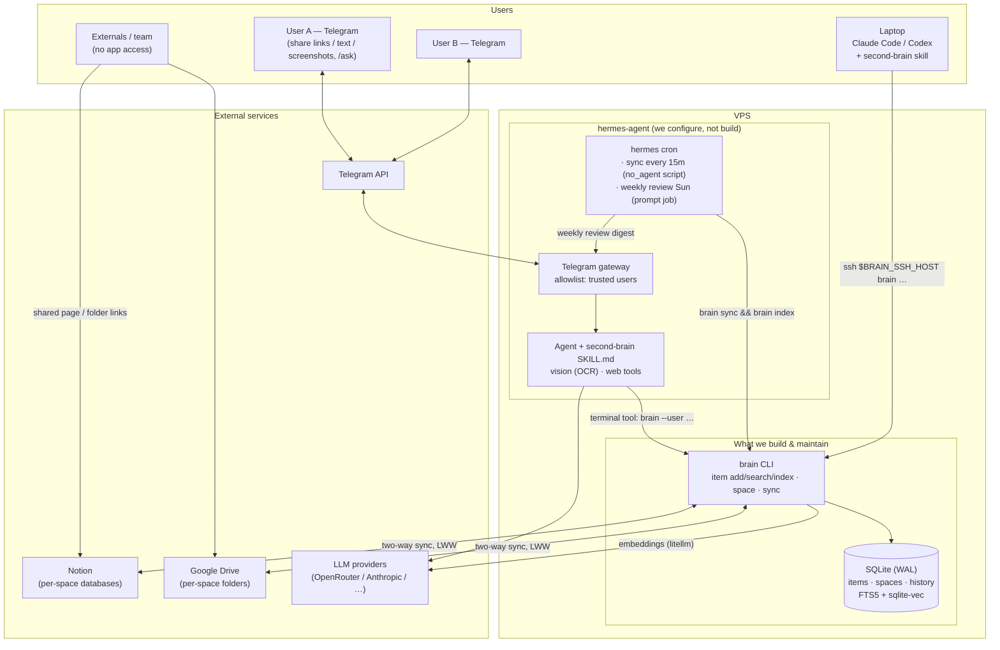

# Second Brain — `brain` CLI + sync layer on top of hermes-agent

A small set of trusted users (two to start), defined in `config.toml`. **hermes-agent is the harness** — we build no bot, no agent loop,
no scheduler, no OCR, no HTTP server. We maintain three things:

1. **`brain`** — a Python CLI owning the SQLite source-of-truth DB (schema, search, embeddings).
2. **Sync layer** — `brain sync notion` / `brain sync drive`, two-way, run from hermes cron.
3. **`second-brain` skill** — a SKILL.md that teaches the hermes agent to capture, triage,
   search, and write back through the `brain` CLI.

Local harnesses (Claude Code, Codex) are first-class clients too: the same `brain` CLI is
reachable over SSH, and the same SKILL.md drives it (agentskills.io format is what Claude
Code skills use).

## Architecture

## What hermes already provides (do NOT rebuild)

- **Capture + chat UX**: Telegram gateway with per-user allowlist/pairing, media caching,
  document text injection. Both users talk to the same bot; identity comes from Telegram.
- **OCR/vision**: incoming images are handled by hermes vision tools — the skill instructs
  the agent to extract text and save it as an item.
- **Agents**: Q&A, research (hermes web tools), content drafting, weekly review are all the
  same hermes agent with the `second-brain` skill loaded — no per-agent code, prompts only.
- **Scheduling**: `hermes cron` runs sync as `no_agent` script jobs and the weekly review as
  a prompt job with Telegram delivery.
- **LLM provider config**: hermes model/provider selection. `brain` itself only calls an LLM
  for embeddings (litellm, model + base URL in config).

## Architecture decisions (locked)

- **Store**: SQLite (WAL) on the VPS next to the hermes gateway. FTS5 + sqlite-vec.
- **RBAC**: every item belongs to a **space** — `personal:<user>`, `shared`, or per-project.
  `brain` commands take `--user`; reads/searches are filtered to that user's spaces in one
  repository layer. Soft enforcement (trusted users; `--user` is not authenticated —
  ponytail: hard isolation = one hermes profile per user, if ever needed).
  Externals never touch the app: they get the exported Notion page / Drive folder link.
- **Sync**: two-way Notion↔DB and Drive↔DB per space, cron-invoked, cursor + content-hash
  based, idempotent. Conflicts: last-write-wins by edit timestamp, loser saved to
  `item_history`. Notion timestamps are minute-rounded, so cursors overlap by 1 minute
  (dedupe by content hash) and timestamp ties resolve **remote-wins** (loser still lands in
  history). Remote deletes archive locally, never hard-delete; local deletes propagate.
  First sync of a space ingests all existing remote content (legacy Notion inbox migration).
- **Local harness access**: no second interface — Claude Code/Codex pilot the system by
  running `brain` over SSH (`ssh <vps> brain …`). The skill resolves whether `brain` is
  local or remote via one env var (`BRAIN_SSH_HOST`); everything else is identical.
  `--user` comes from config on each machine. (ponytail: if SSH-per-call gets slow,
  upgrade path is an SSH ControlMaster connection, not an API.)
- **Tests**: Notion/Drive/LLM faked; pytest runs offline and deterministic. Real-API smoke
  tests are a manual checklist in `SMOKE.md`.

## Integration facts (researched 2026-07)

Ground truth from API docs — Specs 2/3 must follow these.

### Notion — `notion-client` SDK, API version `2026-03-11`

- **Internal integration** (token `ntn_…`), no OAuth needed for a single workspace. Each
  space's database must be manually shared with the integration (page Connections menu).
  No API exists for public/guest page sharing — external Notion links stay a manual step.
- Space target is a **database (data source)**, items = rows. The data-source query endpoint
  (`/v1/data_sources/:id/query`) filters/sorts on `last_edited_time` — the incremental-sync
  primitive; child-page listing has no filters at all. Resolve `data_source_id` from the
  database ID once (`GET /v1/databases/:id`), then always query the data source.
- `last_edited_time` is **rounded down to the minute** — hence the cursor-overlap and
  remote-wins-ties rules in the locked sync decision.
- Deletes: trash via `PATCH /v1/pages/:id` `in_trash: true` — the old `archived` field was
  **removed** in `2026-03-11`; never use it. Detect remote trashing via absence from the
  query (default filter excludes trash) or `in_trash: true` on direct fetch.
- Limits: ~3 req/s average (respect `Retry-After` on 429), 100 items/page pagination,
  2000 chars per `rich_text` span, 1000 blocks/request, 500KB payload.
- Notion has webhooks now, but they need a public HTTP endpoint — skipped.
  (ponytail: 15m cron poll is the design; webhooks are the latency upgrade path, not an API server.)

### Google Drive — `google-api-python-client` + `google-auth`

- **OAuth user credentials, not a service account.** Service accounts have zero storage
  quota (2025 change) and can't own files even in folders shared to them; the fix (Shared
  Drives) requires Workspace, which plain Gmail accounts don't have. Bootstrap: run the
  consent flow once on the laptop (`InstalledAppFlow.run_local_server()`), copy the token
  JSON to the VPS; `brain` refreshes it headlessly (persist creds yourself — `google-auth`
  has no token store). Set the OAuth consent screen to **In production**: Testing mode
  expires refresh tokens every 7 days and would silently kill the sync weekly.
- Scope: full `drive`, not `drive.file` — `drive.file` cannot see files humans drop into
  the synced folders.
- Change cursor: `changes.getStartPageToken` once, then `changes.list(pageToken)` →
  persist `newStartPageToken`. One global feed; reports deletes/trashes and other users'
  edits; tokens don't expire. `files.list` per folder only for the initial import.
- Content-change signal: `md5Checksum` on uploaded files (markdown/attachments) — no
  download needed to detect no-ops. Native Google Docs have no checksum; read them via
  `files.export(mimeType="text/markdown")` (import as read-only items — we never write
  markdown back into a Doc).
- Sharing: `permissions.create` supports anyone-with-link (`type: anyone`,
  `allowFileDiscovery: false`) and per-email grants — Drive external sharing *can* be
  automated, unlike Notion.
- Quotas are a non-issue at 2 users (≥325k units/min/user; sustained writes cap ~3/s).
- **One Drive identity**: all synced folders live in the primary account's My Drive, shared
  with the other users — one OAuth token, one changes feed. (ponytail: a token per user only
  if someone needs synced folders in their own Drive.)

### hermes-agent deploy (VPS)

- Any 1 vCPU / 1GB box — no GPU, all inference is remote API calls. Installer provisions
  Python 3.11 + uv itself.
- Install: `curl -fsSL https://hermes-agent.nousresearch.com/install.sh | bash`, then the
  interactive `hermes setup` (LLM provider + API key → `~/.hermes/.env`, e.g.
  `OPENROUTER_API_KEY` or `ANTHROPIC_API_KEY`).
- Telegram: BotFather token → `TELEGRAM_BOT_TOKEN`; allowlist both users via
  `TELEGRAM_ALLOWED_USERS=<numeric ids>` or approve first-DM pairing codes with
  `hermes pairing approve telegram <code>`.
- Persistence is built in: `hermes gateway install && hermes gateway start` writes and
  manages its own systemd unit — do not hand-write one. Cron jobs live in
  `~/.hermes/cron/jobs.json` and tick **inside the gateway process**: gateway down = cron
  down, so `hermes gateway status` / `hermes cron status` is the health check.
- Skills: drop `skills/second-brain/` into `~/.hermes/skills/` — no registration step.
- All hermes state is under `~/.hermes/`; `brain`'s DB lives outside it (e.g. `~/brain/`).

## Verification (all phases)

- `uv run pytest`
- `uvx ruff check`
- `uvx ruff format --check`  (line-length 144, set in pyproject.toml)
- `uvx ty check`

---

## Spec 1: `brain` core — schema, CLI, search

### Requirements

- `uv`-managed project (`pyproject.toml`, line-length 144, pytest + ruff + ty configured).
- SQLite schema + migrations (plain SQL files applied by `brain migrate`): `users`, `spaces`,
  `space_members`, `items` (title, body, source, kind, space_id, timestamps), `item_history`,
  `attachments` (item_id, filename, sha256 — bytes on disk under `files/<item_id>/`),
  sync mapping tables (remote IDs, cursors, content hashes), FTS5 table kept current by triggers.
- Space model: one `personal:<user>` space per user in `config.toml` plus `shared`, seeded
  by `brain migrate`; `brain space add/list`.
  All item reads/writes go through one repository layer that filters by `--user` membership.
- CLI (`brain`): `migrate`, `space add/list`, `item add/get/list/archive`, `search <query>`
  (hybrid FTS5 + vector, RBAC-filtered), `index` (embed new/changed items via litellm,
  model + base URL in `config.toml`). Output is plain text/JSON suitable for an agent to read.

### Success Criteria

- All verification commands pass.
- Test: `--user <b>` search/list never returns items from `personal:<a>` (any two users).
- Test: FTS finds an item by body keyword; hybrid search returns an embedded item for a
  semantically related query (faked embedding vectors).
- `brain migrate && brain item add … && brain search …` works on an empty directory.

### Goal

/goal "Read spec.md and implement Spec 1. Done when all verification commands pass."

---

## Spec 2: Sync — Notion↔DB, Drive↔DB

### Prerequisites

Spec 1 complete.

### Requirements

- Per-space sync targets: optional Notion database ID (items = rows in its data source)
  and/or Drive folder ID (items = markdown docs, attachments as files).
  `brain space set-target` to configure.
- `brain sync notion` / `brain sync drive`: pull remote changes since cursor, push local
  changes since last sync, per space. Content hashes so unchanged items produce zero writes.
  Cursors per Integration facts: Notion = data-source query on `last_edited_time` with
  1-minute overlap + hash dedupe; Drive = persisted `changes.list` page token
  (`files.list` only for initial import). Use `in_trash` for Notion deletes, `md5Checksum`
  for Drive change detection, `files.export` (markdown) for native Google Docs (read-only).
- Markdown↔Notion-blocks converter written by us, covering paragraphs, headings 1–3,
  bulleted/numbered lists, code, and quotes; anything else round-trips as plain-text
  paragraphs. Round-trip test: md → blocks → md is stable for the covered subset.
- Conflict policy per locked decisions (LWW + history; ties remote-wins; archive on remote
  delete).
- Notion (`notion-client`) and Drive (`google-api-python-client`) clients behind thin
  interfaces; tests use in-memory fakes covering: create both sides, edit both sides,
  conflict (incl. same-minute tie), delete propagation, initial bulk import.
- `brain sync` handles 429/`Retry-After` with backoff (both APIs cap around 3 req/s).

### Success Criteria

- All verification commands pass.
- Test: item edited in fake-Notion and locally, remote newer → remote wins, local version in history.
- Test: two consecutive syncs with no changes make zero write calls to the fake remotes.
- Test: items in one user's personal space never appear in another space's sync target.

### Goal

/goal "Read spec.md and implement Spec 2. Done when all verification commands pass."

---

## Spec 3: `second-brain` skill + hermes wiring

### Prerequisites

Spec 2 complete.

### Requirements

- `skills/second-brain/SKILL.md` (agentskills.io frontmatter, installable into
  `~/.hermes/skills/`) covering, with exact `brain …` command examples:
  - **Capture**: shared links/text/screenshots → OCR via vision if image → `brain item add`
    into the sender's inbox (personal space); resolve `--user` from the Telegram identity.
  - **Q&A**: `brain search` → read items → answer with item IDs as citations.
  - **Research**: hermes web tools + `brain search`; write findings back via `brain item add`.
  - **Content**: draft/repurpose (long-form, short-form, script) from KB topics into items.
  - **Weekly review**: triage inbox items into spaces (propose, apply on confirmation),
    summarize the week.
  - Space/RBAC conventions: default to the caller's personal space; `shared` only when asked.
  - **Remote invocation**: if `BRAIN_SSH_HOST` is set, run every command as
    `ssh $BRAIN_SSH_HOST brain …` — this is how local harnesses (Claude Code, Codex)
    drive the system from a laptop.
- Local harness install docs: symlink/copy the skill into `~/.claude/skills/` (Claude Code)
  and reference it from `AGENTS.md` for Codex; SSH key + `BRAIN_SSH_HOST` setup.
- `cron/` directory with ready-to-create job definitions (documented `hermes cron create`
  commands): sync every 15m (`no_agent` script: `brain sync notion && brain sync drive &&
  brain index`), weekly review Sundays (prompt job, skill loaded, deliver to Telegram).
- Test: parse SKILL.md and assert every `brain` invocation it contains is a real CLI command
  with valid flags (keeps skill and CLI from drifting).
- `README.md`: VPS runbook following Integration facts — hermes `install.sh` + `hermes setup`,
  `hermes gateway setup/install/start`, Telegram allowlist/pairing for both users, Notion
  internal integration (create token, share each space's database with it), Drive OAuth
  bootstrap (laptop consent flow → token JSON to VPS, consent screen set to In production),
  skill install, cron creation, local-harness SSH setup. `SMOKE.md`: manual real-API
  checklist (capture a link, capture a screenshot, ask a question, run a sync against real
  Notion/Drive, weekly review, drive `brain` from Claude Code over SSH,
  `hermes cron status` health check).

### Success Criteria

- All verification commands pass (including the SKILL.md↔CLI drift test).
- SKILL.md covers all five workflows with runnable commands.

### Goal

/goal "Read spec.md and implement Spec 3. Done when all verification commands pass."
